# SNMP Protocol

## Overview

SNMP (Simple Network Management Protocol) transport enables ThingsBoard to integrate with network equipment, legacy devices, and any SNMP-enabled hardware. Unlike other transports where devices push data, SNMP transport actively polls devices for telemetry and can receive TRAP notifications for events. This makes it ideal for network monitoring, industrial equipment, and infrastructure management.

## Key Behaviors

1. **Polling Model**: ThingsBoard initiates SNMP GET requests to query device data.

2. **TRAP Reception**: Devices can send unsolicited SNMP TRAPs to ThingsBoard.

3. **OID Mapping**: SNMP OIDs are mapped to ThingsBoard telemetry and attributes.

4. **SNMPv3 Security**: Full USM (User-based Security Model) support with authentication and encryption.

5. **Profile-Driven**: Device profiles define polling schedules and OID mappings.

## Protocol Architecture

### Communication Model

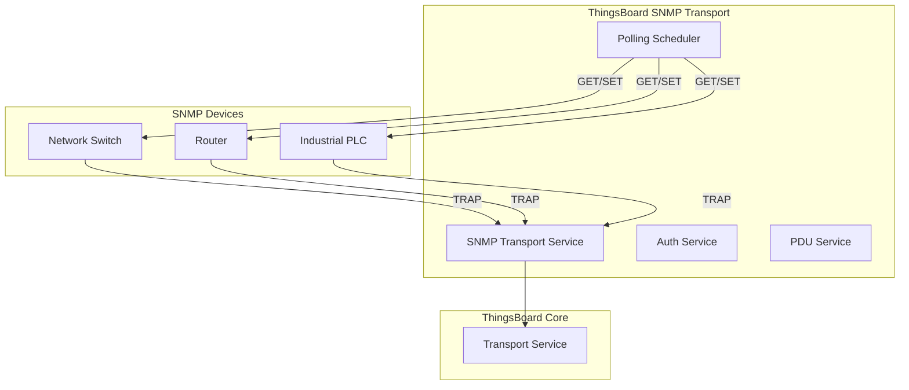

### Data Flow

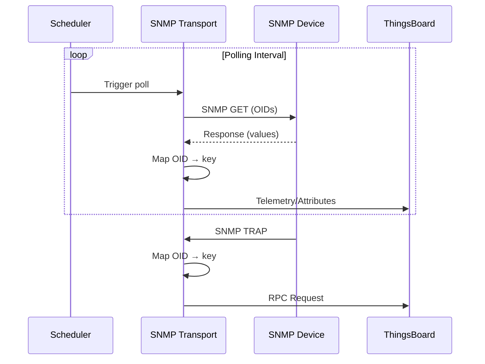

## SNMP Versions

### Version Support

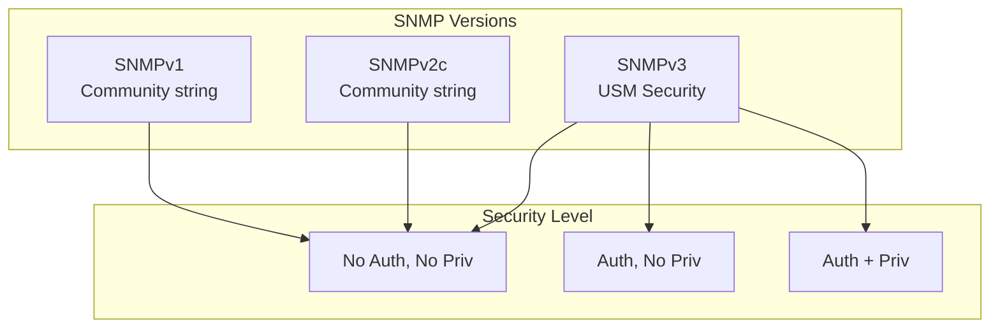

| Version | Authentication | Encryption | Use Case |
|---------|---------------|------------|----------|
| SNMPv1 | Community string | None | Legacy devices |
| SNMPv2c | Community string | None | Most network equipment |
| SNMPv3 | USM (username/password) | AES/DES | Secure environments |

## Operations

### SNMP Methods

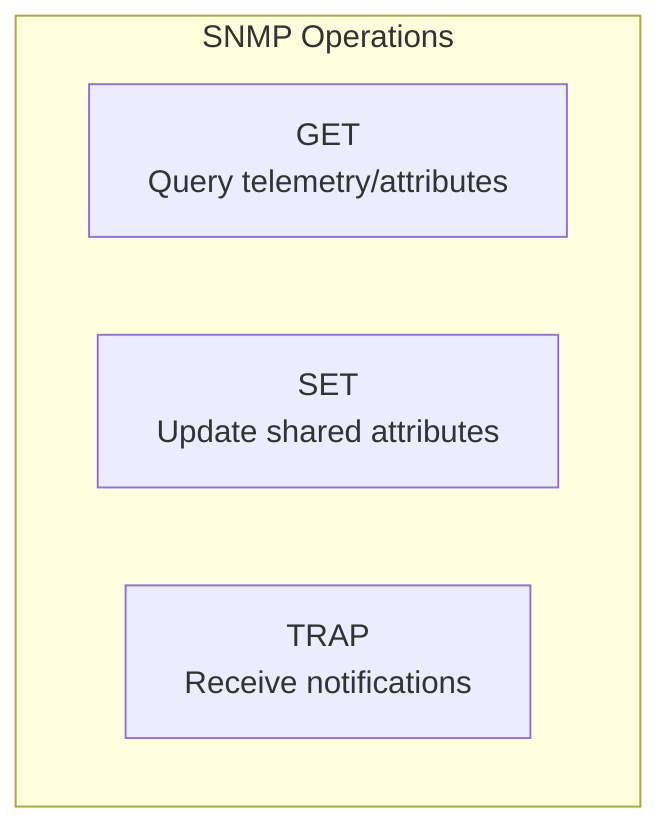

| Method | Direction | ThingsBoard Use |
|--------|-----------|-----------------|
| GET | TB → Device | Poll telemetry and client attributes |
| SET | TB → Device | Update shared attributes |
| TRAP | Device → TB | Server RPC requests |

### Communication Specifications

| Spec | Operation | Trigger | Purpose |
|------|-----------|---------|---------|
| TELEMETRY_QUERYING | GET | Scheduled | Poll device telemetry |
| CLIENT_ATTRIBUTES_QUERYING | GET | Scheduled | Poll client attributes |
| SHARED_ATTRIBUTES_SETTING | SET | Event-driven | Update device config |
| TO_DEVICE_RPC_REQUEST | GET/SET | On-demand | Execute RPC commands |
| TO_SERVER_RPC_REQUEST | TRAP | Event-driven | Receive device events |

## OID Mapping

### OID Structure

```
1.3.6.1.2.1.1.1.0
│ │ │ │ │ │ │ │ └─ Instance
│ │ │ │ │ │ │ └─── sysDescr
│ │ │ │ │ │ └───── system
│ │ │ │ │ └─────── mib-2
│ │ │ │ └───────── mgmt
│ │ │ └─────────── internet
│ │ └───────────── dod
│ └─────────────── org
└───────────────── iso
```

### Mapping Configuration

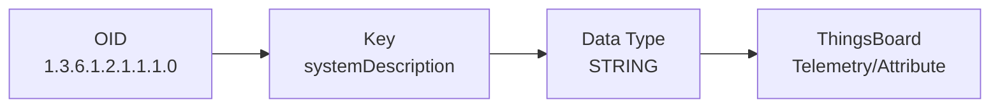

### Mapping Structure

| Field | Description | Example |
|-------|-------------|---------|
| oid | SNMP OID | 1.3.6.1.2.1.1.1.0 |
| key | ThingsBoard key name | systemDescription |
| dataType | Value type | STRING, LONG, DOUBLE, BOOLEAN, JSON |

### Common OIDs

| OID | Description | MIB |
|-----|-------------|-----|
| 1.3.6.1.2.1.1.1.0 | System description | SNMPv2-MIB |
| 1.3.6.1.2.1.1.3.0 | System uptime | SNMPv2-MIB |
| 1.3.6.1.2.1.1.5.0 | System name | SNMPv2-MIB |
| 1.3.6.1.2.1.2.1.0 | Interface count | IF-MIB |
| 1.3.6.1.2.1.25.3.3.1.2.1 | CPU load | HOST-RESOURCES-MIB |

## Security Configuration

### SNMPv1/v2c

| Setting | Description |
|---------|-------------|
| host | Device IP address |
| port | SNMP port (default: 161) |
| protocolVersion | V1 or V2C |
| community | Community string (e.g., "public") |

### SNMPv3

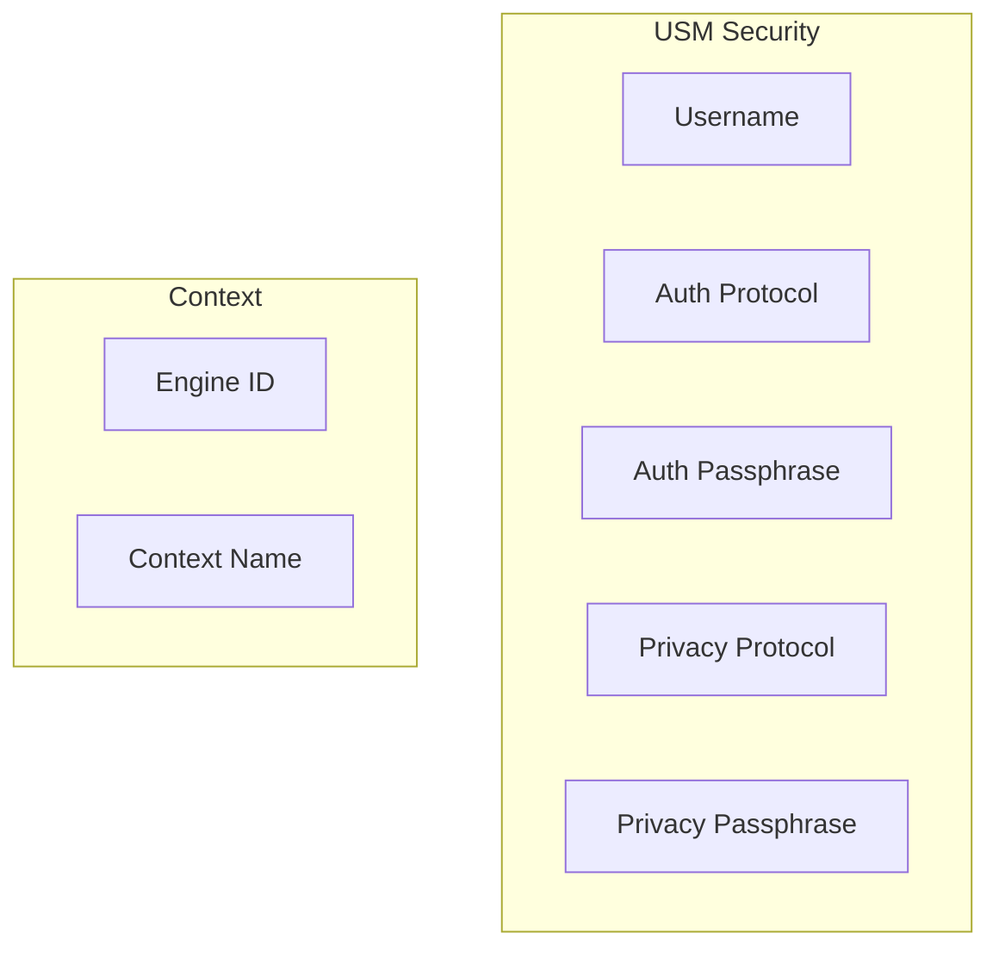

| Setting | Description |
|---------|-------------|
| username | SNMP user identifier |
| securityName | Security username |
| engineId | Authoritative engine ID (hex) |
| authenticationProtocol | MD5, SHA-1, SHA-224, SHA-256, SHA-384, SHA-512 |
| authenticationPassphrase | Authentication password |
| privacyProtocol | DES, AES-128, AES-192, AES-256 |
| privacyPassphrase | Encryption password |

### Authentication Protocols

| Protocol | OID | Security |
|----------|-----|----------|
| MD5 | 1.3.6.1.6.3.10.1.1.2 | Legacy |
| SHA-1 | 1.3.6.1.6.3.10.1.1.3 | Moderate |
| SHA-256 | 1.3.6.1.6.3.10.1.1.5 | Recommended |
| SHA-512 | 1.3.6.1.6.3.10.1.1.7 | Strongest |

### Privacy Protocols

| Protocol | OID | Security |
|----------|-----|----------|
| DES | 1.3.6.1.6.3.10.1.2.2 | Legacy |
| AES-128 | 1.3.6.1.6.3.10.1.2.4 | Good |
| AES-256 | 1.3.6.1.4.1.4976.2.2.1.1.2 | Best |

## Device Profiles

### Profile Configuration

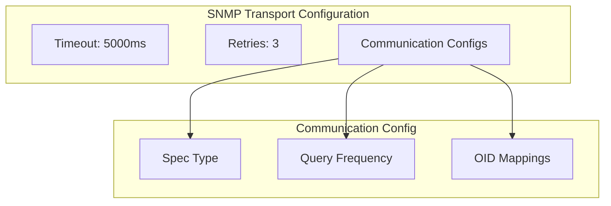

### Profile Settings

| Setting | Description | Default |
|---------|-------------|---------|
| timeoutMs | Request timeout | 5000 |
| retries | Retry attempts | 3 |
| communicationConfigs | List of polling configurations | [] |

### Communication Config

| Setting | Description |
|---------|-------------|
| spec | Communication type (TELEMETRY_QUERYING, etc.) |
| queryingFrequencyMs | Polling interval in milliseconds |
| mappings | Array of OID mappings |

## Polling Configuration

### Telemetry Polling

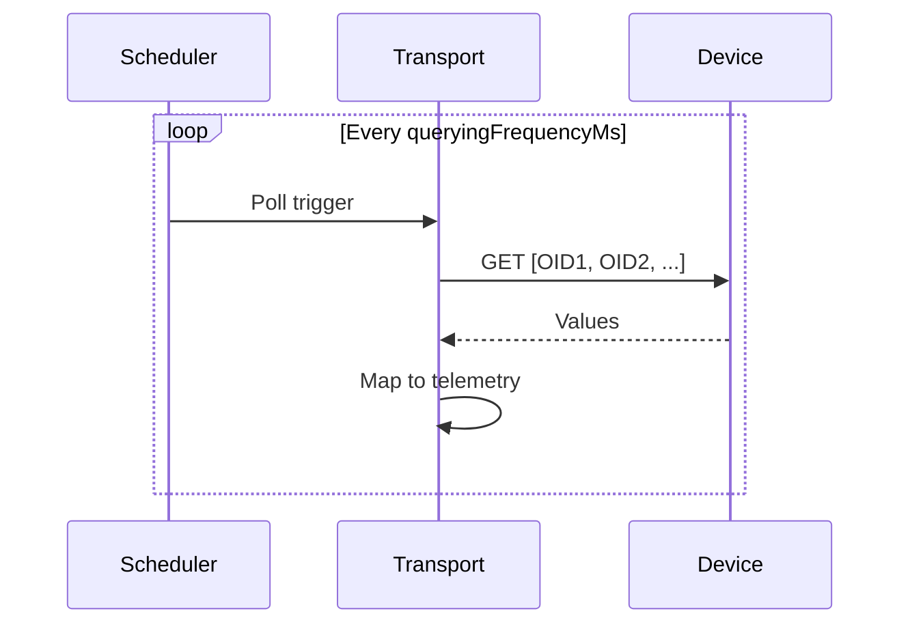

### Polling Settings

| Setting | Description |
|---------|-------------|
| queryingFrequencyMs | Interval between polls |
| mappings | OIDs to query |

### Batching

| Setting | Default | Description |
|---------|---------|-------------|
| max_request_oids | 100 | Max OIDs per request |
| request_chunk_delay_ms | 100 | Delay between chunks |

### PDU Splitting

Large requests are automatically split into multiple PDUs:

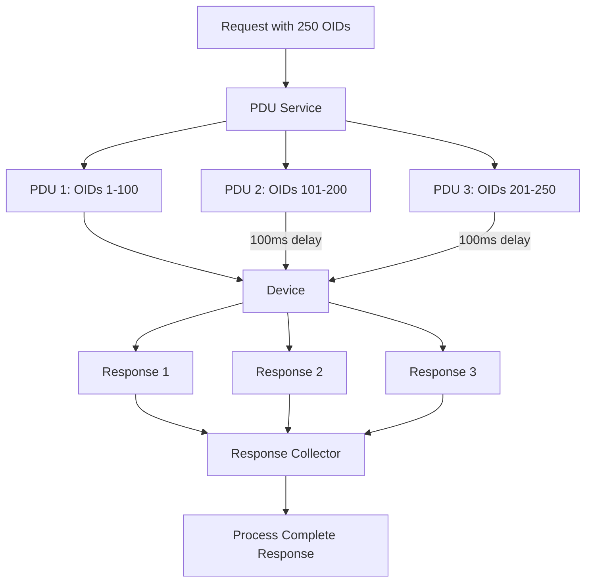

**Multi-Part Response Handling:**
- `RequestContext` tracks expected response count
- Responses collected in synchronized list
- Processing triggered when all parts received
- Timeout handled per-chunk

## TRAP Handling

### TRAP Flow

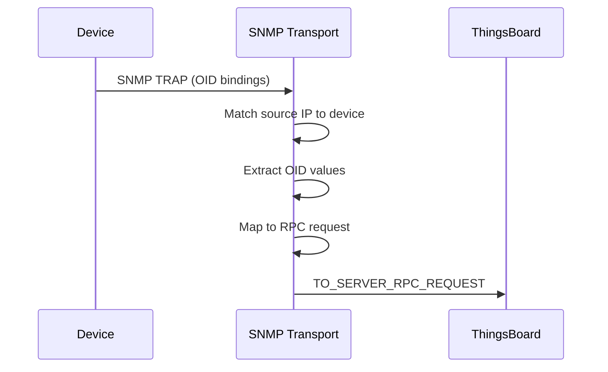

### TRAP Configuration

Devices sending TRAPs must be configured to send to ThingsBoard's SNMP transport address and port.

## Data Types

### Supported Types

| Type | SNMP Type | Example |
|------|-----------|---------|
| STRING | OctetString | "Device Name" |
| LONG | Integer32, Counter32 | 42 |
| DOUBLE | Float | 3.14 |
| BOOLEAN | Integer (0/1) | true |
| JSON | OctetString (parsed) | {"key": "value"} |

### Type Casting

SNMP values are converted to ThingsBoard types based on the `dataType` in the mapping configuration.

## Configuration

### Transport Settings

| Setting | Default | Description |
|---------|---------|-------------|
| bind_port | 0 | TRAP listener port (0=auto) |
| bind_address | 0.0.0.0 | Bind address |
| underlying_protocol | udp | UDP or TCP |
| response_processing.parallelism_level | 4 | Response threads |
| scheduler_thread_pool_size | 4 | Polling threads |

### Request Settings

| Setting | Default | Description |
|---------|---------|-------------|
| request_chunk_delay_ms | 100 | Delay between batches |
| max_request_oids | 100 | Max OIDs per PDU |
| ignore_type_cast_errors | false | Ignore conversion errors |
| batch_retries | 8 | Bootstrap retry count |

## Session Bootstrap

### Bootstrap Process

On startup, the SNMP transport bootstraps device sessions:

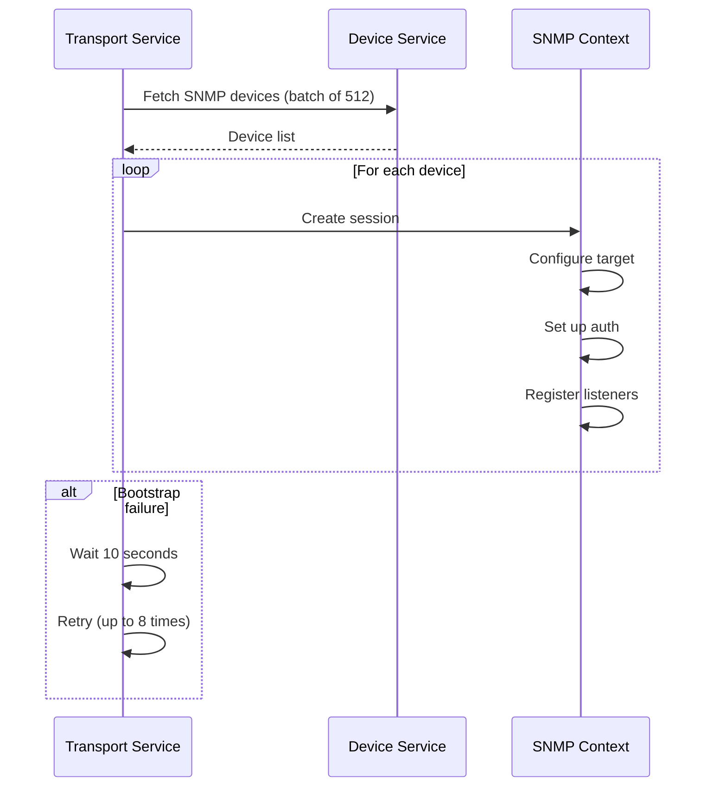

| Setting | Default | Description |
|---------|---------|-------------|
| batch_size | 512 | Devices per batch |
| batch_retries | 8 | Max retry attempts |
| retry_delay | 10000ms | Delay between retries |

## Load Balancing

### Partition-Based Distribution

SNMP sessions are distributed across transport instances using partition hashing:

```mermaid
graph TB
    subgraph "SNMP Devices"
        D1[Device 1]
        D2[Device 2]
        D3[Device 3]
        D4[Device 4]
    end

    subgraph "Transport Instances"
        T1[Transport 1<br/>Partition 0-1]
        T2[Transport 2<br/>Partition 2-3]
    end

    D1 -->|hash(UUID) % 4 = 0| T1
    D2 -->|hash(UUID) % 4 = 1| T1
    D3 -->|hash(UUID) % 4 = 2| T2
    D4 -->|hash(UUID) % 4 = 3| T2
```

**Load Balancing Service:**
- `SnmpTransportBalancingService` manages partition assignment
- Devices assigned based on UUID hash
- Sessions recalculated on cluster topology changes

### TRAP Limitation

**Important:** TRAP handling has a known limitation in multi-instance deployments:

| Scenario | Behavior |
|----------|----------|
| Single transport instance | TRAPs work correctly |
| Multiple transport instances | TRAPs may fail |

**Reason:** TRAPs are matched by source IP address, but the device session may be on a different transport instance than the one receiving the TRAP.

**Workaround:** For TRAP-dependent devices, use a single SNMP transport instance or route TRAPs to a specific instance.

## Example Configuration

### Device Profile

```json
{
  "type": "SNMP",
  "timeoutMs": 5000,
  "retries": 3,
  "communicationConfigs": [
    {
      "spec": "TELEMETRY_QUERYING",
      "queryingFrequencyMs": 10000,
      "mappings": [
        {
          "oid": "1.3.6.1.2.1.25.3.3.1.2.1",
          "key": "cpuUsage",
          "dataType": "LONG"
        },
        {
          "oid": "1.3.6.1.2.1.25.2.3.1.6.1",
          "key": "memoryUsed",
          "dataType": "LONG"
        }
      ]
    },
    {
      "spec": "SHARED_ATTRIBUTES_SETTING",
      "mappings": [
        {
          "oid": "1.3.6.1.2.1.1.6.0",
          "key": "location",
          "dataType": "STRING"
        }
      ]
    }
  ]
}
```

### Device Credentials (SNMPv3)

```json
{
  "host": "192.168.1.100",
  "port": 161,
  "protocolVersion": "V3",
  "username": "admin",
  "securityName": "admin",
  "authenticationProtocol": "SHA256",
  "authenticationPassphrase": "authPassword123",
  "privacyProtocol": "AES128",
  "privacyPassphrase": "privPassword123"
}
```

## Session Lifecycle

### Session States

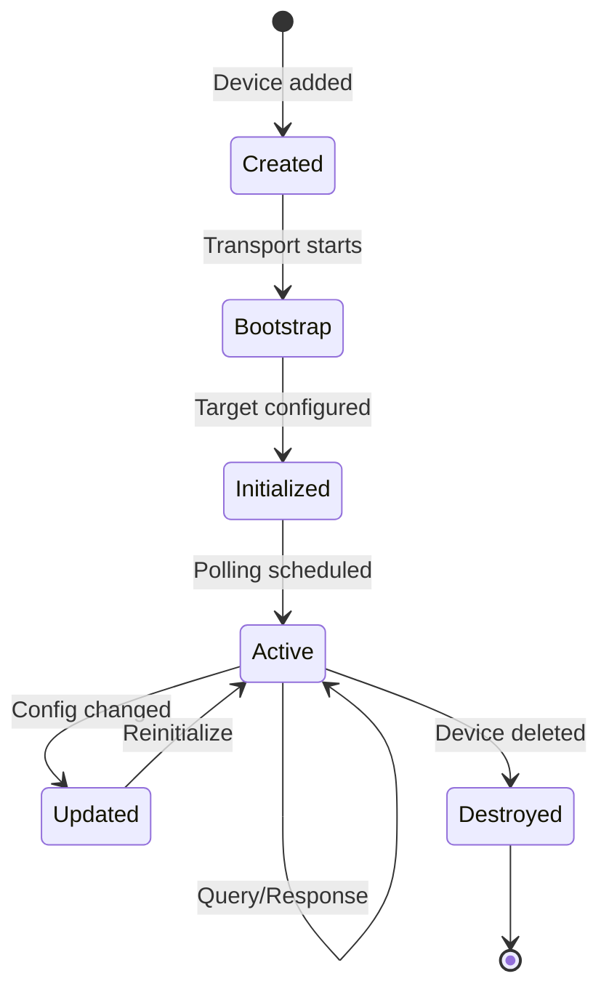

### Session Events

| Event | Action |
|-------|--------|
| DeviceUpdatedEvent | Recreate session if config changed |
| SnmpTransportListChangedEvent | Rebalance partitions |
| ServiceListChangedEvent | Update cluster topology |
| ComponentLifecycleEvent | Report device state |

### Session Components

| Component | Purpose |
|-----------|---------|
| DeviceSessionContext | Per-device state holder |
| SnmpTransportService | SNMP communication |
| SnmpAuthService | Credential management |
| PduService | PDU construction |
| ResponseProcessor | Response handling |

## SNMP4J Integration

ThingsBoard uses SNMP4J 3.8.0 for SNMP operations.

### Key Classes

| Class | Purpose |
|-------|---------|
| `Snmp` | Main SNMP API |
| `CommunityTarget` | v1/v2c security |
| `UserTarget` | v3 USM security |
| `PDU` | Protocol data unit |
| `ScopedPDU` | v3 PDU with context |
| `VariableBinding` | OID-value pair |
| `USM` | User-based security |
| `ResponseListener` | Async response handling |
| `CommandResponder` | TRAP reception |

### Target Configuration

| Version | Target Type | Security |
|---------|-------------|----------|
| v1/v2c | CommunityTarget | NOAUTH_NOPRIV |
| v3 | UserTarget | Configurable |

### USM User Management

For SNMPv3, USM users are:
- Created on session initialization
- Password-to-key conversion via security protocol
- Engine ID management for context
- Cleaned up on session termination

## Best Practices

### Security

| Practice | Benefit |
|----------|---------|
| Use SNMPv3 | Authentication + encryption |
| Strong passwords | Prevent unauthorized access |
| Restrict community strings | Limit v1/v2c exposure |
| Firewall SNMP ports | Control access |

### Performance

| Practice | Benefit |
|----------|---------|
| Batch OID requests | Reduce round trips |
| Appropriate polling interval | Balance freshness vs. load |
| Use counters wisely | Calculate deltas for rates |
| Monitor timeout errors | Detect network issues |

### Configuration

| Practice | Benefit |
|----------|---------|
| Document OID mappings | Maintainability |
| Test with snmpwalk | Verify OID availability |
| Start with common MIBs | Standardized data |
| Group related OIDs | Logical organization |

## Troubleshooting

### Common Issues

| Issue | Cause | Solution |
|-------|-------|----------|
| No data received | Wrong OID | Verify OID with snmpwalk |
| Timeout errors | Network issue or slow device | Increase timeout |
| Authentication failure | Wrong credentials | Verify v3 settings |
| Type cast errors | Data type mismatch | Adjust dataType |
| TRAP not received | Firewall or wrong port | Check network config |

### Debugging Commands

```bash
# Test SNMPv2c GET
snmpwalk -v2c -c public 192.168.1.100 1.3.6.1.2.1.1

# Test SNMPv3 GET
snmpwalk -v3 -u admin -l authPriv \
  -a SHA -A authPassword123 \
  -x AES -X privPassword123 \
  192.168.1.100 1.3.6.1.2.1.1

# Listen for TRAPs
snmptrapd -f -Lo
```

## Use Cases

### Network Monitoring

| Device | Common OIDs |
|--------|-------------|
| Switches | Interface stats, port status |
| Routers | Routing tables, CPU, memory |
| Firewalls | Session counts, throughput |
| UPS | Battery, load, temperature |

### Industrial Equipment

| Device | Common OIDs |
|--------|-------------|
| PLCs | Process values, alarms |
| Sensors | Temperature, humidity |
| Power meters | Voltage, current, power |
| HVAC | Setpoints, status |

## See Also

- [Transport Contract](./transport-contract.md) - Common transport behaviors
- [Device Entity](../02-core-concepts/entities/device.md) - Device configuration
- [Telemetry Data Model](../02-core-concepts/data-model/telemetry.md) - Data storage
- [Attributes Data Model](../02-core-concepts/data-model/attributes.md) - Attribute types
