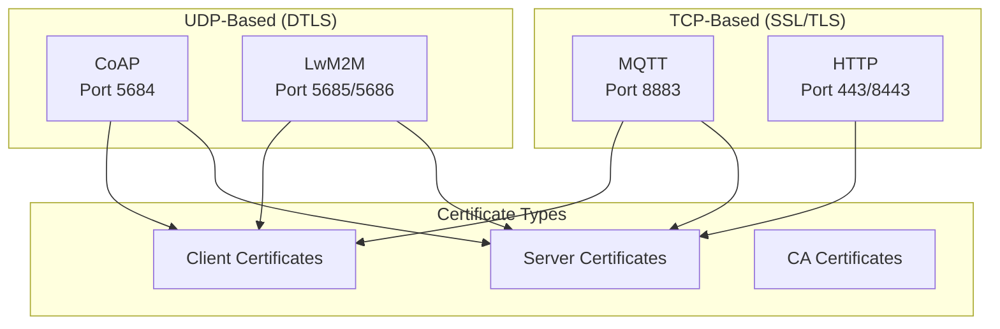
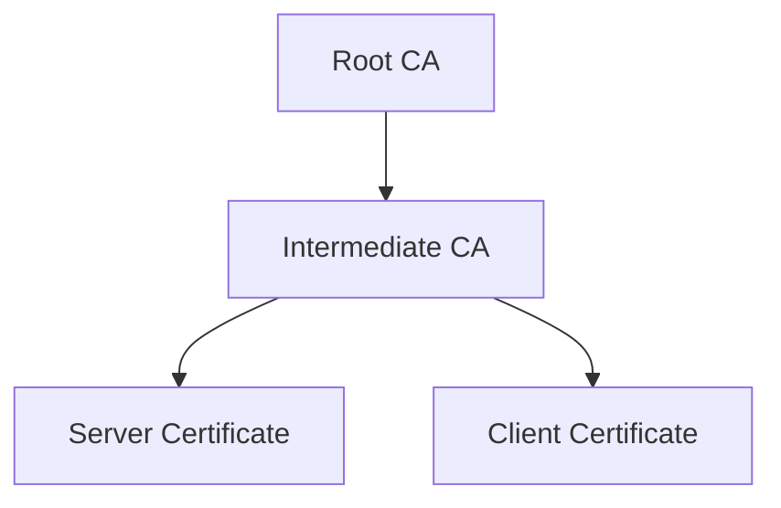
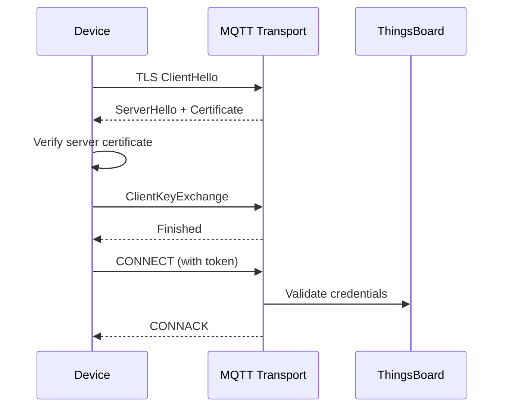
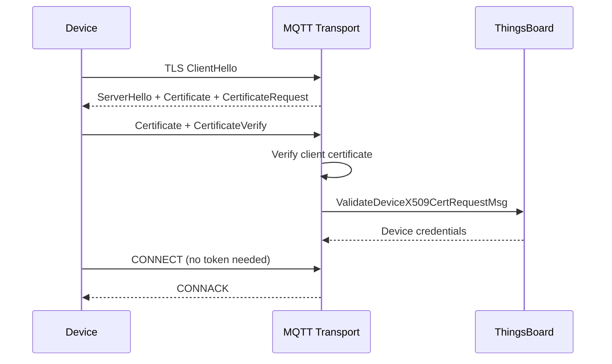
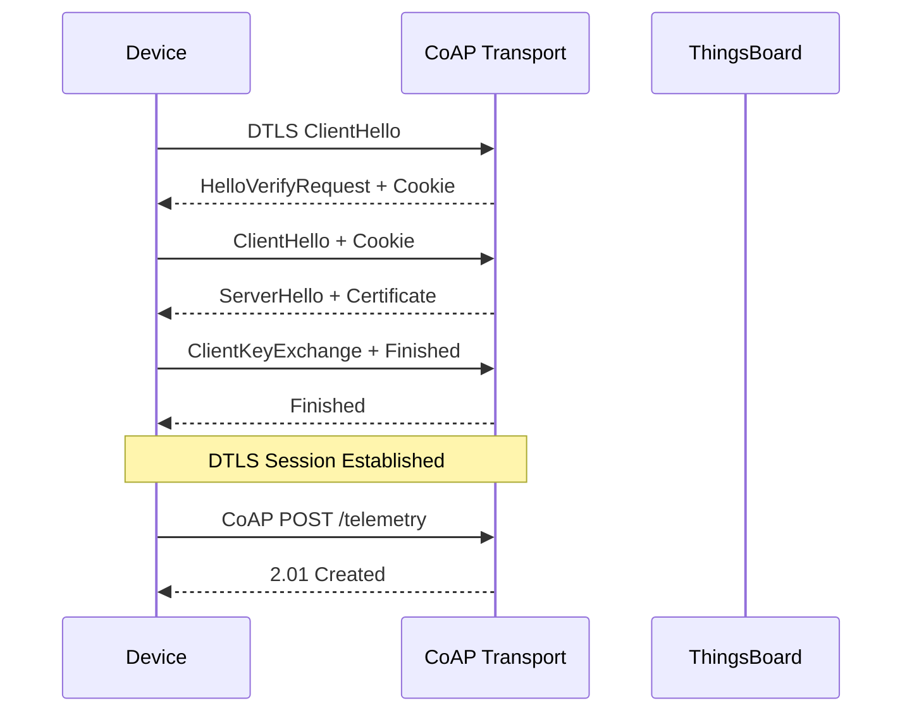
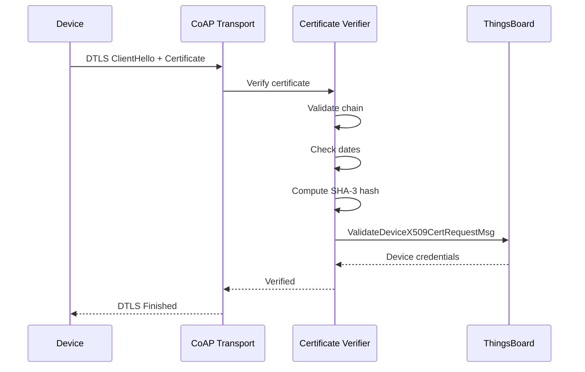
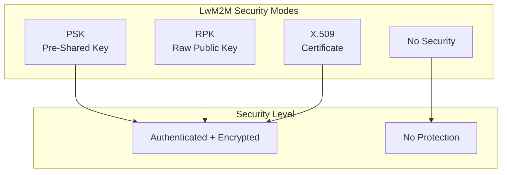
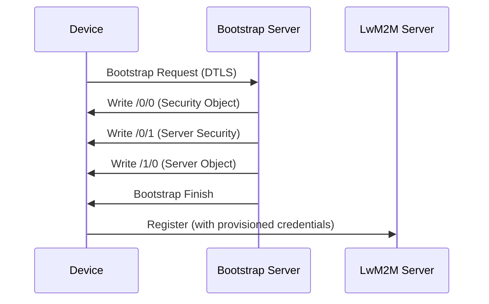
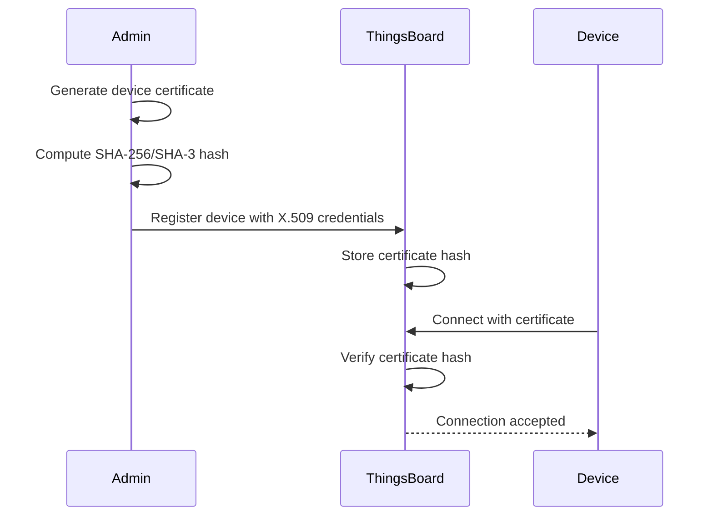

# SSL/TLS Configuration

## Overview

ThingsBoard supports secure communication across all transport protocols using SSL/TLS (for TCP-based protocols) and DTLS (for UDP-based protocols). This guide covers certificate generation, server configuration, and device authentication for secure transport layer communication.

## Security Architecture

### Protocol Security Matrix



### Authentication Methods

| Protocol | Token Auth | X.509 Mutual | PSK | RPK |
|----------|------------|--------------|-----|-----|
| MQTT | Yes | Yes | No | No |
| HTTP | Yes | No | No | No |
| CoAP | Yes | Yes | No | No |
| LwM2M | Yes | Yes | Yes | Yes |

## Certificate Generation

### Self-Signed Certificates

For development and testing, generate self-signed certificates:

```bash
# Generate CA private key
openssl ecparam -name secp256r1 -genkey -noout -out ca.key

# Generate CA certificate
openssl req -x509 -new -nodes -key ca.key -sha256 -days 3650 \
  -out ca.crt -subj "/CN=ThingsBoard CA"

# Generate server private key
openssl ecparam -name secp256r1 -genkey -noout -out server.key

# Generate server CSR
openssl req -new -key server.key -out server.csr \
  -subj "/CN=localhost"

# Sign server certificate with CA
openssl x509 -req -in server.csr -CA ca.crt -CAkey ca.key \
  -CAcreateserial -out server.crt -days 365 -sha256
```

### Certificate Chain



For production, use a proper certificate chain:

```bash
# Combine certificates into chain
cat server.crt intermediate.crt root.crt > server-chain.pem
```

### PEM vs Keystore Format

ThingsBoard supports two certificate formats:

| Format | Use Case | Files |
|--------|----------|-------|
| PEM | Linux, Docker, most deployments | `.pem`, `.crt`, `.key` |
| Keystore | Java-based, Windows | `.jks`, `.p12` |

**Convert PEM to PKCS12:**
```bash
openssl pkcs12 -export \
  -in server.crt \
  -inkey server.key \
  -out server.p12 \
  -name "thingsboard" \
  -password pass:thingsboard
```

**Convert PKCS12 to JKS:**
```bash
keytool -importkeystore \
  -srckeystore server.p12 \
  -srcstoretype PKCS12 \
  -srcstorepass thingsboard \
  -destkeystore server.jks \
  -deststoretype JKS \
  -deststorepass thingsboard
```

## MQTT over SSL/TLS

### Server Configuration



### Environment Variables

| Variable | Default | Description |
|----------|---------|-------------|
| `MQTT_SSL_ENABLED` | false | Enable MQTT SSL |
| `MQTT_SSL_BIND_ADDRESS` | 0.0.0.0 | SSL bind address |
| `MQTT_SSL_BIND_PORT` | 8883 | MQTTS port |
| `MQTT_SSL_CREDENTIALS_TYPE` | PEM | PEM or KEYSTORE |
| `MQTT_SSL_PEM_CERT` | mqttserver.pem | Server certificate |
| `MQTT_SSL_PEM_KEY` | mqttserver_key.pem | Private key |
| `MQTT_SSL_PEM_KEY_PASSWORD` | - | Key password (optional) |

### PEM Configuration

```yaml
# thingsboard.conf or environment
MQTT_SSL_ENABLED=true
MQTT_SSL_BIND_PORT=8883
MQTT_SSL_CREDENTIALS_TYPE=PEM
MQTT_SSL_PEM_CERT=/etc/thingsboard/conf/mqttserver.pem
MQTT_SSL_PEM_KEY=/etc/thingsboard/conf/mqttserver_key.pem
```

### Keystore Configuration

```yaml
MQTT_SSL_ENABLED=true
MQTT_SSL_BIND_PORT=8883
MQTT_SSL_CREDENTIALS_TYPE=KEYSTORE
MQTT_SSL_KEY_STORE=/etc/thingsboard/conf/mqttserver.jks
MQTT_SSL_KEY_STORE_PASSWORD=thingsboard
MQTT_SSL_KEY_ALIAS=thingsboard
MQTT_SSL_KEY_PASSWORD=thingsboard
```

### Client Certificate Authentication

For mutual TLS (mTLS), devices authenticate using X.509 certificates:



**Server Configuration for mTLS:**
```yaml
MQTT_SSL_ENABLED=true
MQTT_SSL_SKIP_VALIDITY_CHECK_FOR_CLIENT_CERT=false
```

**Device Credential Setup:**
1. Generate device certificate signed by trusted CA
2. Register device with X.509 credentials in ThingsBoard
3. Upload certificate SHA-256 hash or full certificate

### Testing MQTT SSL

```bash
# Test with mosquitto_pub
mosquitto_pub -h localhost -p 8883 \
  --cafile ca.crt \
  -t "v1/devices/me/telemetry" \
  -m '{"temperature": 25}' \
  -u "DEVICE_ACCESS_TOKEN"

# Test with client certificate
mosquitto_pub -h localhost -p 8883 \
  --cafile ca.crt \
  --cert device.crt \
  --key device.key \
  -t "v1/devices/me/telemetry" \
  -m '{"temperature": 25}'
```

## HTTP over SSL/TLS

### Server Configuration

HTTP transport uses the embedded Tomcat server with SSL support.

### Environment Variables

| Variable | Default | Description |
|----------|---------|-------------|
| `SSL_ENABLED` | false | Enable HTTP SSL |
| `SSL_CREDENTIALS_TYPE` | PEM | PEM or KEYSTORE |
| `SSL_PEM_CERT` | server.pem | Server certificate |
| `SSL_PEM_KEY` | server_key.pem | Private key |
| `SSL_PEM_KEY_PASSWORD` | - | Key password |
| `SSL_KEY_STORE` | - | Keystore path |
| `SSL_KEY_STORE_PASSWORD` | - | Keystore password |
| `SSL_KEY_ALIAS` | - | Key alias |

### PEM Configuration

```yaml
SSL_ENABLED=true
SSL_CREDENTIALS_TYPE=PEM
SSL_PEM_CERT=/etc/thingsboard/conf/server.pem
SSL_PEM_KEY=/etc/thingsboard/conf/server_key.pem
```

### Keystore Configuration

```yaml
SSL_ENABLED=true
SSL_CREDENTIALS_TYPE=KEYSTORE
SSL_KEY_STORE_TYPE=PKCS12
SSL_KEY_STORE=/etc/thingsboard/conf/server.p12
SSL_KEY_STORE_PASSWORD=thingsboard
SSL_KEY_ALIAS=tomcat
```

### HTTP/2 with SSL

HTTP/2 requires SSL to be enabled:

```yaml
SSL_ENABLED=true
server.http2.enabled=true
```

### Testing HTTP SSL

```bash
# Test telemetry endpoint
curl -v --cacert ca.crt \
  -X POST \
  -H "Content-Type: application/json" \
  -d '{"temperature": 25}' \
  "https://localhost:8443/api/v1/DEVICE_TOKEN/telemetry"
```

## CoAP over DTLS

### DTLS Overview

CoAP uses DTLS (Datagram TLS) for UDP-based secure communication.



### Environment Variables

| Variable | Default | Description |
|----------|---------|-------------|
| `COAP_DTLS_ENABLED` | false | Enable DTLS |
| `COAP_DTLS_BIND_ADDRESS` | 0.0.0.0 | DTLS bind address |
| `COAP_DTLS_BIND_PORT` | 5684 | CoAPS port |
| `COAP_DTLS_CREDENTIALS_TYPE` | PEM | PEM or KEYSTORE |
| `COAP_DTLS_PEM_CERT` | coapserver.pem | Server certificate |
| `COAP_DTLS_PEM_KEY` | coapserver_key.pem | Private key |
| `COAP_DTLS_RETRANSMISSION_TIMEOUT` | 9000 | Retransmit timeout (ms) |

### PEM Configuration

```yaml
COAP_DTLS_ENABLED=true
COAP_DTLS_BIND_PORT=5684
COAP_DTLS_CREDENTIALS_TYPE=PEM
COAP_DTLS_PEM_CERT=/etc/thingsboard/conf/coapserver.pem
COAP_DTLS_PEM_KEY=/etc/thingsboard/conf/coapserver_key.pem
```

### X.509 Client Authentication

CoAP supports X.509 certificate-based device authentication:

**Device Registration:**
1. Generate device certificate
2. Compute SHA-3 hash of certificate
3. Register device with X.509 credentials
4. Configure certificate hash in ThingsBoard

**Certificate Verification Flow:**


### DTLS Session Configuration

| Variable | Default | Description |
|----------|---------|-------------|
| `COAP_DTLS_CONNECTION_ID_LENGTH` | 8 | Connection ID bytes |
| `COAP_DTLS_SESSION_INACTIVITY_TIMEOUT` | 86400000 | Session timeout (24h) |
| `COAP_DTLS_MAX_TRANSMISSION_UNIT` | 1024 | Max MTU |

### Testing CoAP DTLS

```bash
# Using coap-client with DTLS
coap-client -m post \
  -e '{"temperature": 25}' \
  -t "application/json" \
  "coaps://localhost:5684/api/v1/DEVICE_TOKEN/telemetry"

# With client certificate
coap-client -m post \
  -e '{"temperature": 25}' \
  -c device.crt \
  -j device.key \
  "coaps://localhost:5684/api/v1/telemetry"
```

## LwM2M over DTLS

### Security Modes

LwM2M supports multiple DTLS security modes:



### Environment Variables

| Variable | Default | Description |
|----------|---------|-------------|
| `LWM2M_SERVER_SECURITY_SKIP_VALIDITY_CHECK` | true | Skip cert validity |
| `LWM2M_DTLS_RETRANSMISSION_TIMEOUT` | 9000 | DTLS retransmit (ms) |
| `LWM2M_DTLS_CONNECTION_ID_LENGTH` | 8 | Connection ID bytes |

### PSK Configuration

Pre-Shared Key mode uses shared secrets:

**Device Credentials:**
```json
{
  "securityMode": "PSK",
  "endpoint": "device-endpoint",
  "identity": "device-identity",
  "key": "48656c6c6f576f726c64"
}
```

| Field | Description |
|-------|-------------|
| identity | PSK identity string |
| key | Hex-encoded shared secret |

**Cipher Suites:**
- TLS_PSK_WITH_AES_128_CCM_8
- TLS_PSK_WITH_AES_128_CBC_SHA256

### RPK Configuration

Raw Public Key mode uses asymmetric keys without certificates:

**Device Credentials:**
```json
{
  "securityMode": "RPK",
  "endpoint": "device-endpoint",
  "clientPublicKey": "base64-encoded-public-key",
  "clientPrivateKey": "base64-encoded-private-key"
}
```

**Key Generation:**
```bash
# Generate EC key pair
openssl ecparam -name secp256r1 -genkey -noout -out device.key
openssl ec -in device.key -pubout -out device.pub

# Extract raw public key (base64)
openssl ec -in device.key -pubout -outform DER | base64
```

### X.509 Configuration

Certificate-based authentication:

**Device Credentials:**
```json
{
  "securityMode": "X509",
  "endpoint": "device-endpoint",
  "clientCertificate": "-----BEGIN CERTIFICATE-----\n...",
  "clientPrivateKey": "base64-encoded-private-key"
}
```

**Server Configuration:**
```yaml
LWM2M_SERVER_SECURITY_SKIP_VALIDITY_CHECK=false
```

### Bootstrap Server Security

The bootstrap server provisions security credentials:



**Bootstrap Ports:**
| Port | Protocol | Description |
|------|----------|-------------|
| 5687 | CoAP | Bootstrap (no security) |
| 5688 | CoAPS | Bootstrap (DTLS) |

### Connection ID (CID)

DTLS Connection ID improves reliability for NAT traversal:

| CID Length | Mode | Description |
|------------|------|-------------|
| 0 | Disabled | No CID |
| 1-4 | Single Node | Basic CID |
| 5-8 | Multi Node | Cluster-aware CID |

**Configuration:**
```yaml
LWM2M_DTLS_CONNECTION_ID_LENGTH=8
```

## Certificate Management

### File Locations

**Linux:**
```
/etc/thingsboard/conf/
├── server.pem           # HTTP server cert
├── server_key.pem       # HTTP server key
├── mqttserver.pem       # MQTT server cert
├── mqttserver_key.pem   # MQTT server key
├── coapserver.pem       # CoAP server cert
├── coapserver_key.pem   # CoAP server key
└── ca.pem               # CA certificate
```

**Docker:**
Mount certificates as volumes:
```yaml
volumes:
  - ./certs:/etc/thingsboard/conf/certs
environment:
  - SSL_PEM_CERT=/etc/thingsboard/conf/certs/server.pem
  - SSL_PEM_KEY=/etc/thingsboard/conf/certs/server_key.pem
```

**Kubernetes:**
Use Secrets and ConfigMaps:
```yaml
apiVersion: v1
kind: Secret
metadata:
  name: thingsboard-certs
type: kubernetes.io/tls
data:
  tls.crt: <base64-encoded-cert>
  tls.key: <base64-encoded-key>
```

### Certificate Rotation


**Steps:**
1. Generate new certificate before expiration
2. Deploy new certificate files
3. Restart ThingsBoard service
4. Verify device connections
5. Remove old certificate files

### Trust Store Configuration

For validating client certificates:

| Variable | Description |
|----------|-------------|
| `SSL_TRUST_STORE` | Trust store path |
| `SSL_TRUST_STORE_PASSWORD` | Trust store password |
| `SSL_TRUST_STORE_TYPE` | JKS or PKCS12 |

```yaml
SSL_TRUST_STORE=/etc/thingsboard/conf/truststore.jks
SSL_TRUST_STORE_PASSWORD=thingsboard
SSL_TRUST_STORE_TYPE=JKS
```

## Device Certificate Registration

### X.509 Device Credentials



### Hash Computation

**SHA-256 (for MQTT):**
```bash
openssl x509 -in device.crt -outform DER | \
  openssl dgst -sha256 -binary | \
  xxd -p -c 64
```

**SHA-3 (for CoAP):**
```bash
openssl x509 -in device.crt -outform DER | \
  openssl dgst -sha3-256 -binary | \
  xxd -p -c 64
```

### Registration Methods

**Via UI:**
1. Create device
2. Select "X.509 Certificate" credentials type
3. Enter certificate hash or upload certificate

**Via REST API:**
```bash
curl -X POST \
  -H "Authorization: Bearer $JWT_TOKEN" \
  -H "Content-Type: application/json" \
  -d '{
    "device": {"name": "Secure Device"},
    "credentials": {
      "credentialsType": "X509_CERTIFICATE",
      "credentialsValue": "<certificate-hash>"
    }
  }' \
  "https://localhost:8080/api/device-with-credentials"
```

## Troubleshooting

### Common Issues

| Issue | Cause | Solution |
|-------|-------|----------|
| Handshake failure | Certificate mismatch | Verify certificate chain |
| Connection refused | SSL not enabled | Check SSL_ENABLED setting |
| Certificate expired | Validity period ended | Generate new certificate |
| Trust anchor not found | Missing CA certificate | Add CA to trust store |
| Protocol version error | TLS version mismatch | Configure supported versions |

### Debug SSL/TLS

**Enable SSL debugging:**
```bash
export JAVA_OPTS="-Djavax.net.debug=ssl:handshake"
```

**Check certificate:**
```bash
openssl s_client -connect localhost:8883 -showcerts
```

**Verify certificate chain:**
```bash
openssl verify -CAfile ca.crt server.crt
```

### DTLS Debugging

**Wireshark filter:**
```
udp.port == 5684 && dtls
```

**CoAP client debug:**
```bash
coap-client -v 9 -m get "coaps://localhost:5684/.well-known/core"
```

## Best Practices

### Security

| Practice | Description |
|----------|-------------|
| Use strong keys | Minimum 2048-bit RSA or 256-bit ECC |
| Short certificate lifetime | Rotate certificates annually |
| Separate certificates | Different certs per protocol |
| Protect private keys | Restrict file permissions |
| Use certificate chains | Include intermediate CAs |

### Performance

| Practice | Description |
|----------|-------------|
| Session resumption | Enable TLS session caching |
| Connection ID | Use CID for DTLS NAT traversal |
| Hardware acceleration | Use CPU AES-NI support |
| Certificate caching | Cache validated certificates |

### Operations

| Practice | Description |
|----------|-------------|
| Monitor expiration | Alert before certificate expiry |
| Automate renewal | Use cert-manager or similar |
| Test before deployment | Verify in staging environment |
| Document procedures | Maintain runbooks |

## See Also

- [MQTT Protocol](./mqtt.md) - MQTT transport details
- [CoAP Protocol](./coap.md) - CoAP transport details
- [HTTP Protocol](./http.md) - HTTP transport details
- [LwM2M Protocol](./lwm2m.md) - LwM2M transport details
- [Authentication](../06-api-layer/authentication.md) - Authentication overview
- [Configuration](../18-deployment/configuration.md) - General configuration
