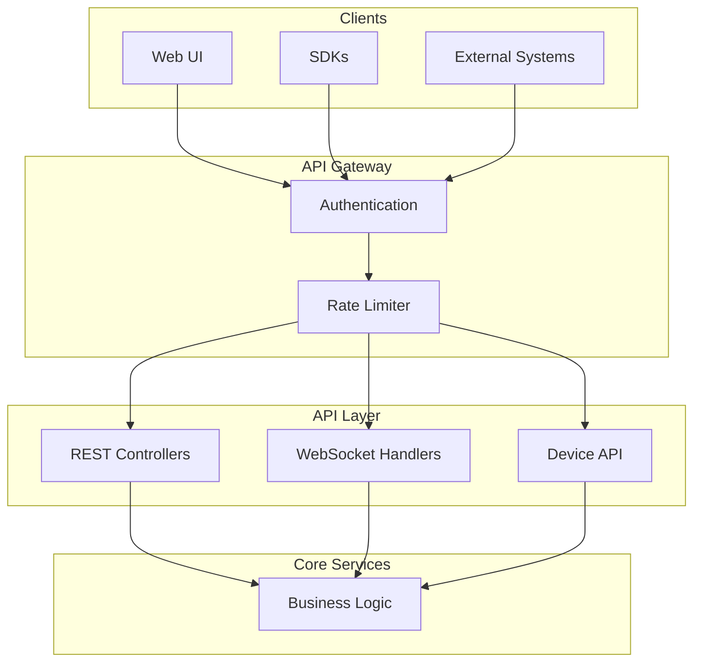

# API Layer

## Overview

The API layer exposes platform functionality through REST APIs, WebSocket connections, and device-specific endpoints. This section covers authentication mechanisms, API organization, and real-time subscription patterns.

## Contents

| Document | Description |
|----------|-------------|
| [REST API Overview](./rest-api-overview.md) | Controller organization, endpoints, pagination, and error handling |
| [Authentication](./authentication.md) | JWT tokens, API keys, OAuth2, and request authentication flow |
| [Device API](./device-api.md) | Device-facing endpoints for telemetry, attributes, and RPC |
| [WebSocket Overview](./websocket-overview.md) | Real-time subscriptions for telemetry and alarm updates |
| [Subscription Model](./subscription-model.md) | Entity data subscriptions, pagination, and update streaming |

## Key Concepts

- **RESTful Design**: Standard HTTP methods, JSON payloads, HATEOAS links
- **JWT Authentication**: Token-based auth with refresh token flow
- **WebSocket Subscriptions**: Real-time entity data and alarm streaming
- **Rate Limiting**: Per-user and per-tenant API throttling
- **API Versioning**: URL-based versioning for backward compatibility

## API Architecture

## See Also

- [Security](../09-security/README.md) - Platform security model (Note: This document covers API-level authentication mechanisms. For platform security model and access control, see Security Authentication.)
- [Transport Layer](../05-transport-layer/README.md) - Device connectivity
- [Frontend](../10-frontend/README.md) - UI consuming these APIs
