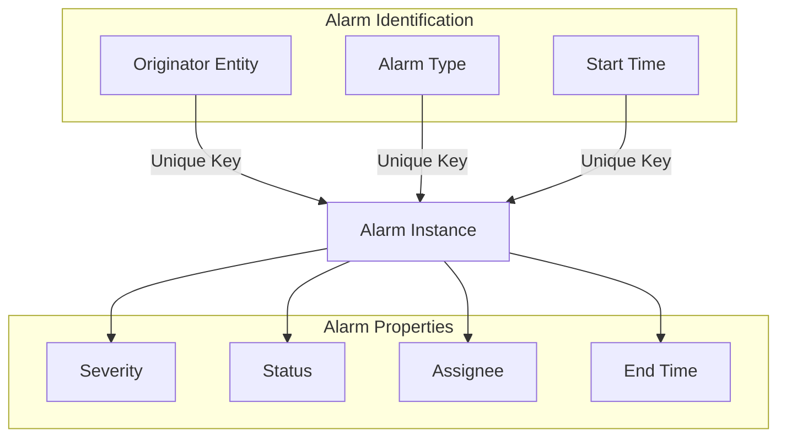
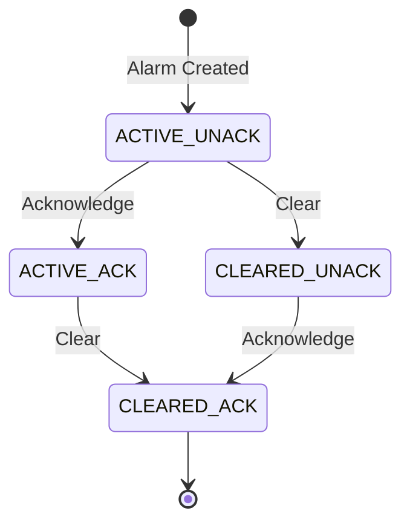
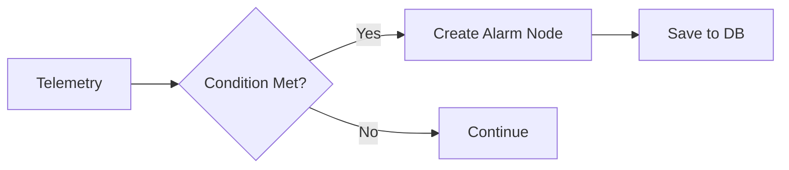
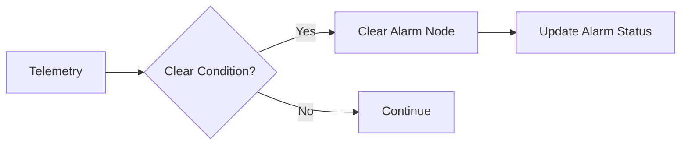
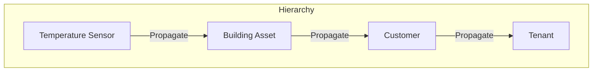

# Alarm API

## Overview

ThingsBoard provides comprehensive alarm management through REST APIs and Rule Engine integration. Alarms represent notable events or conditions that require attention, such as threshold violations or device malfunctions. The platform supports automatic alarm creation via device profile rules, manual alarm management, and real-time alarm notifications.

## Alarm Concepts

### Alarm Structure



| Component | Description |
|-----------|-------------|
| Originator | Entity that caused the alarm (device, asset, etc.) |
| Type | Identifies root cause (e.g., "High Temperature") |
| Severity | Priority level: Critical, Major, Minor, Warning, Indeterminate |
| Status | Active/Cleared + Acknowledged/Unacknowledged |
| Assignee | User responsible for handling the alarm |

### Severity Levels

| Severity | Priority | Use Case |
|----------|----------|----------|
| Critical | Highest | Immediate action required |
| Major | High | Significant issue |
| Minor | Medium | Notable but not urgent |
| Warning | Low | Potential issue |
| Indeterminate | Lowest | Unknown severity |

### Alarm Status



| Status | Code | Description |
|--------|------|-------------|
| Active Unacknowledged | ACTIVE_UNACK | New alarm, not yet seen |
| Active Acknowledged | ACTIVE_ACK | Seen but not resolved |
| Cleared Unacknowledged | CLEARED_UNACK | Resolved but not acknowledged |
| Cleared Acknowledged | CLEARED_ACK | Fully handled |

### Alarm Uniqueness

Alarms are uniquely identified by: **Originator + Type + Start Time**

Only one active alarm can exist for a given combination. If conditions repeat before clearing, the alarm's end time is updated rather than creating a new alarm.

**Example Timeline:**
```
12:00 - Temperature = 18°C (normal)
12:30 - Temperature = 22°C (alarm created, start = 12:30)
13:00 - Temperature = 25°C (same alarm, end time updated to 13:00)
13:30 - Temperature = 18°C (alarm cleared)
```

## Alarm Timing

| Time Field | Description |
|------------|-------------|
| Start Time | When threshold was first exceeded |
| Creation Time | When ThingsBoard processed the message |
| End Time | Most recent condition violation |

Start time and creation time may differ when devices send delayed or historical telemetry.

## REST API Endpoints

### Alarm Controller

Base path: `/api/alarm`

| Method | Endpoint | Description |
|--------|----------|-------------|
| GET | `/api/alarm/{alarmId}` | Get alarm by ID |
| POST | `/api/alarm` | Create or update alarm |
| DELETE | `/api/alarm/{alarmId}` | Delete alarm |
| POST | `/api/alarm/{alarmId}/ack` | Acknowledge alarm |
| POST | `/api/alarm/{alarmId}/clear` | Clear alarm |

### Query Alarms

```
GET /api/alarm/{entityType}/{entityId}
```

| Parameter | Type | Description |
|-----------|------|-------------|
| entityType | string | DEVICE, ASSET, CUSTOMER, etc. |
| entityId | UUID | Entity identifier |
| searchStatus | string | ACTIVE, CLEARED, ACK, UNACK |
| status | string | Specific status filter |
| pageSize | number | Results per page |
| page | number | Page number |
| sortProperty | string | Field to sort by |
| sortOrder | string | ASC or DESC |
| startTime | number | Filter by start time (epoch ms) |
| endTime | number | Filter by end time (epoch ms) |
| fetchOriginator | boolean | Include originator details |

### Create Alarm

```
POST /api/alarm
```

**Request Body:**
```json
{
  "type": "High Temperature",
  "originator": {
    "entityType": "DEVICE",
    "id": "3e46db70-e480-11eb-9d0e-1f8899a6f9b3"
  },
  "severity": "CRITICAL",
  "status": "ACTIVE_UNACK",
  "startTs": 1632236465459,
  "endTs": 1632236465459,
  "details": {
    "temperature": 85.5,
    "threshold": 80.0
  },
  "propagate": true,
  "propagateToOwner": false,
  "propagateToTenant": false,
  "propagateRelationTypes": ["Contains"]
}
```

### Acknowledge Alarm

```
POST /api/alarm/{alarmId}/ack
```

**Response:** Updated alarm object with status changed to ACK variant.

### Clear Alarm

```
POST /api/alarm/{alarmId}/clear
```

**Response:** Updated alarm object with status changed to CLEARED variant.

### Assign Alarm

```
POST /api/alarm/{alarmId}/assign/{userId}
```

Assigns the alarm to a specific user. The user must be the owner of the alarm's originator entity.

## Rule Engine Integration

### Automatic Alarm Creation

Alarms are typically created via device profile alarm rules:



### Create Alarm Node

| Setting | Description |
|---------|-------------|
| Alarm type | Type string (e.g., "High Temperature") |
| Severity | CRITICAL, MAJOR, MINOR, WARNING, INDETERMINATE |
| Propagate | Enable alarm propagation |
| Alarm details builder | Script to build details JSON |
| Create rules | Conditions for alarm creation |
| Clear rules | Conditions for alarm clearing |

### Alarm Creation Conditions

| Type | Description |
|------|-------------|
| Simple | Immediate alarm when threshold exceeded |
| Duration | Alarm after condition persists for specified time |
| Repeating | Alarm after condition repeats N times |

**Duration Example:**
```
Condition: temperature > 80
Duration: 5 minutes
Result: Alarm created only if temperature stays above 80 for 5+ minutes
```

**Repeating Example:**
```
Condition: temperature > 80
Count: 5
Result: Alarm created on 5th occurrence of temperature > 80
```

### Clear Alarm Node



### Alarm Messages in Rule Engine

| Message Type | Description |
|--------------|-------------|
| ALARM | Alarm created or updated |
| ALARM_ACK | Alarm acknowledged |
| ALARM_CLEAR | Alarm cleared |
| ALARM_DELETE | Alarm deleted |
| ALARM_ASSIGNED | Alarm assigned to user |

## Alarm Propagation

### Concept

Propagation allows alarms to appear in parent entities without duplicating data.



### Propagation Settings

| Setting | Description |
|---------|-------------|
| Propagate alarm | Enable propagation to related entities |
| Propagate to owner | Propagate to entity owner |
| Propagate to tenant | Propagate to tenant level |
| Relation types | Filter relations for propagation |

### Querying Propagated Alarms

Include `searchPropagatedAlarms=true` in query to find propagated alarms:

```
GET /api/alarm/ASSET/{assetId}?searchPropagatedAlarms=true
```

## Alarm Comments

### Add Comment

```
POST /api/alarm/{alarmId}/comment
```

**Request Body:**
```json
{
  "comment": {
    "text": "Technician dispatched to investigate"
  }
}
```

### Get Comments

```
GET /api/alarm/{alarmId}/comment
```

**Comment Types:**
- User comments: Editable by author
- System comments: Auto-generated for state changes (gray, non-editable)

## Notifications

### Notification Center Integration

Alarm notifications are sent through the Notification Center:

| Channel | Configuration |
|---------|--------------|
| Web | In-app notifications |
| Email | SMTP configuration |
| SMS | Twilio/AWS SNS |
| Slack | Webhook integration |
| Microsoft Teams | Webhook integration |

### Notification Rules

Configure alarm-based notification triggers:

| Trigger | Description |
|---------|-------------|
| Alarm created | New alarm notification |
| Alarm severity changed | Severity update notification |
| Alarm acknowledged | Acknowledgment notification |
| Alarm cleared | Resolution notification |
| Alarm assigned | Assignment notification |

## WebSocket Subscriptions

Subscribe to real-time alarm updates via WebSocket:

```javascript
{
  "attrSubCmds": [],
  "tsSubCmds": [],
  "historyCmds": [],
  "alarmDataCmds": [{
    "cmdId": 1,
    "entityType": "DEVICE",
    "entityId": "device-uuid",
    "pageLink": {
      "page": 0,
      "pageSize": 10,
      "sortOrder": {
        "key": {
          "key": "createdTime",
          "type": "ALARM_FIELD"
        },
        "direction": "DESC"
      }
    },
    "alarmFields": {
      "status": ["ACTIVE_UNACK", "ACTIVE_ACK"]
    }
  }]
}
```

## Dashboard Widgets

### Alarms Table Widget

Displays and manages alarms with filtering:

| Filter | Options |
|--------|---------|
| Status | ACK/UNACK/ACTIVE/CLEARED |
| Severity | Any combination |
| Types | Specific alarm types |
| Propagated | Include propagated alarms |

### Alarm Count Widget

Shows alarm count with configurable filters for severity and status.

## Best Practices

### Alarm Design

| Practice | Benefit |
|----------|---------|
| Use meaningful alarm types | Easy identification |
| Set appropriate severities | Proper prioritization |
| Configure clear conditions | Automatic resolution |
| Enable propagation wisely | Efficient monitoring |

### Performance

| Practice | Benefit |
|----------|---------|
| Use duration/repeating conditions | Reduce alarm noise |
| Filter by severity in dashboards | Focus on critical issues |
| Configure proper TTL | Database cleanup |

### Operations

| Practice | Benefit |
|----------|---------|
| Assign alarms to users | Clear responsibility |
| Use comments for tracking | Audit trail |
| Configure notifications | Timely response |

## Troubleshooting

### Common Issues

| Issue | Cause | Solution |
|-------|-------|----------|
| Duplicate alarms | Missing clear condition | Add alarm clear rules |
| Alarm noise | Threshold too sensitive | Use duration/repeating conditions |
| Missing alarms | Propagation disabled | Enable alarm propagation |
| Slow dashboard | Too many alarms | Add filters, increase TTL cleanup |
| Alarm still active after acknowledge | Acknowledge means "seen", not "resolved" | Use Acknowledge (`POST /api/alarm/{id}/ack`) to mark seen, Clear (`POST /api/alarm/{id}/clear`) to mark resolved. State: ACTIVE_ACK → CLEARED_ACK |
| Can't clear propagated alarm from parent | Propagated alarms are read-only copies on parent entities | Clear alarm on originating device entity (`POST /api/alarm/{id}/clear`), it will auto-clear on parent entities via propagation |
| Wrong alarm status filter returns no results | Using `status=ACTIVE` query parameter instead of `searchStatus=ACTIVE` | Use `searchStatus` for broad filter (ACTIVE includes ACTIVE_UNACK + ACTIVE_ACK), `status` for exact status match (e.g., `status=ACTIVE_UNACK`) |

## See Also

- [Device Profiles](../02-core-concepts/device-profiles.md) - Alarm rule configuration
- [Notifications](./notifications.md) - Notification center setup
- [WebSocket Overview](./websocket-overview.md) - Real-time subscriptions
- [Action Nodes](../04-rule-engine/nodes/action-nodes.md) - Create/Clear alarm nodes
- [Rule Engine](../04-rule-engine/README.md) - Alarm processing in rule chains
