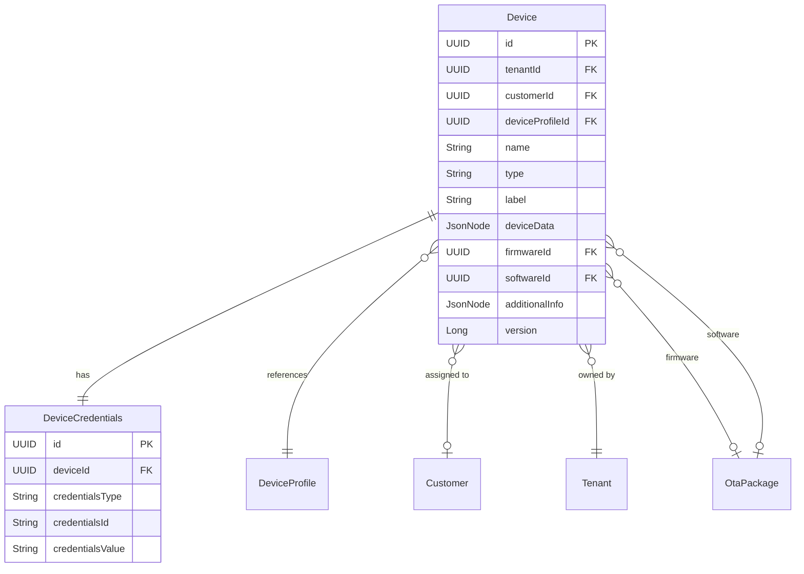
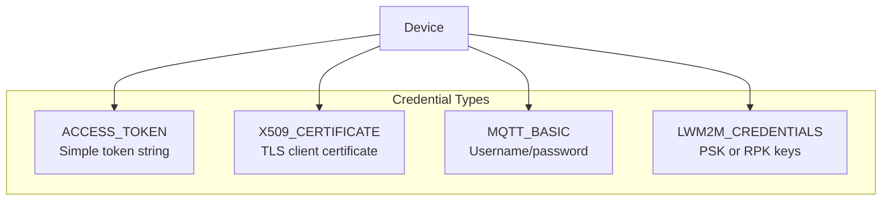
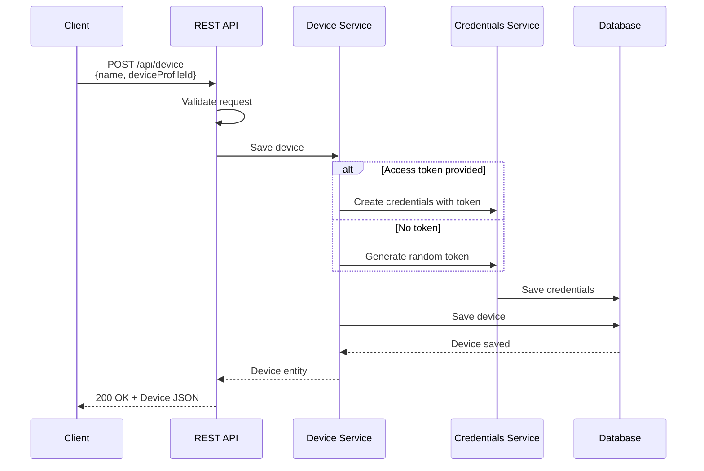
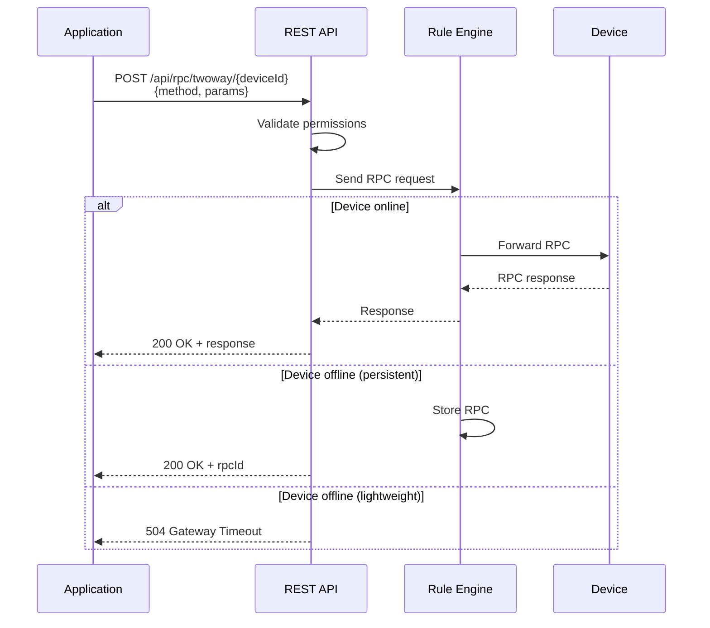
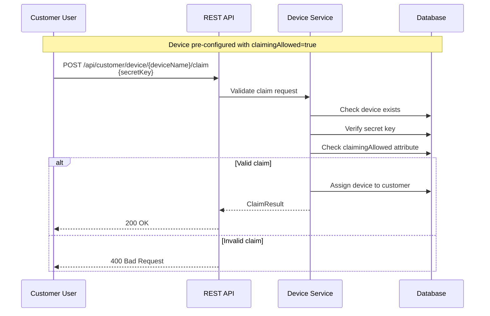

# Device API

## Overview

The Device API provides comprehensive REST endpoints for managing IoT devices in the ThingsBoard platform. This includes device CRUD operations, credentials management, customer assignment, telemetry and attributes access, remote procedure calls (RPC), and device claiming. The API serves both administrative management via authenticated REST calls and device-side communication through transport protocols.

## Key Behaviors

1. **Tenant Scoping**: Devices are always scoped to a tenant; device names must be unique within a tenant.

2. **Device Profiles**: Every device references a device profile that defines its transport type, alarm rules, and default rule chain.

3. **Credentials Per Device**: Each device has exactly one set of credentials (access token, X.509 certificate, MQTT basic, or LwM2M).

4. **Customer Assignment**: Devices can be optionally assigned to customers for access control.

5. **Claiming**: Devices can be claimed by customers using secret keys for self-service provisioning.

6. **Edge Support**: Devices can be assigned to edge instances for edge computing scenarios.

## Device Entity Model

### Device Structure



### Device Fields

| Field | Type | Required | Description |
|-------|------|----------|-------------|
| id | DeviceId (UUID) | Auto | Unique device identifier |
| tenantId | TenantId (UUID) | Auto | Owning tenant |
| customerId | CustomerId (UUID) | No | Assigned customer |
| name | String | Yes | Unique name within tenant (e.g., MAC address) |
| type | String | No | Device profile name |
| label | String | No | Human-friendly display label |
| deviceProfileId | DeviceProfileId | Yes | Device profile reference |
| deviceData | DeviceData | No | Transport-specific configuration |
| firmwareId | OtaPackageId | No | Device-specific firmware |
| softwareId | OtaPackageId | No | Device-specific software |
| additionalInfo | JsonNode | No | Custom metadata |
| version | Long | Auto | Optimistic locking version |

### DeviceInfo (Extended View)

| Field | Type | Description |
|-------|------|-------------|
| (all Device fields) | - | Base device fields |
| customerTitle | String | Customer name |
| customerIsPublic | boolean | Is public customer |
| deviceProfileName | String | Profile name |
| active | boolean | Device connectivity status |

## Credential Types

### Supported Credentials



| Type | credentialsId | credentialsValue |
|------|---------------|------------------|
| ACCESS_TOKEN | Token string | null |
| X509_CERTIFICATE | SHA3 hash of cert | PEM certificate (Base64) |
| MQTT_BASIC | Client ID | JSON with username/password |
| LWM2M_CREDENTIALS | Endpoint client | JSON with keys |

### Credentials Examples

**Access Token:**
```json
{
  "deviceId": {"id": "784f394c-42b6-435a-983c-b7beff2784f9"},
  "credentialsType": "ACCESS_TOKEN",
  "credentialsId": "A1B2C3D4E5F6",
  "credentialsValue": null
}
```

**MQTT Basic:**
```json
{
  "deviceId": {"id": "784f394c-42b6-435a-983c-b7beff2784f9"},
  "credentialsType": "MQTT_BASIC",
  "credentialsId": "myDeviceClientId",
  "credentialsValue": "{\"clientId\":\"myDeviceClientId\",\"userName\":\"myUsername\",\"password\":\"myPassword\"}"
}
```

**X.509 Certificate:**
```json
{
  "deviceId": {"id": "784f394c-42b6-435a-983c-b7beff2784f9"},
  "credentialsType": "X509_CERTIFICATE",
  "credentialsId": "sha3HashOfCertificate",
  "credentialsValue": "-----BEGIN CERTIFICATE-----\nMIIC...base64...==\n-----END CERTIFICATE-----"
}
```

## Management API Endpoints

### Device CRUD Operations

| Method | Endpoint | Description | Authority |
|--------|----------|-------------|-----------|
| GET | `/api/device/{deviceId}` | Get device by ID | TENANT_ADMIN, CUSTOMER_USER |
| GET | `/api/device/info/{deviceId}` | Get device info by ID | TENANT_ADMIN, CUSTOMER_USER |
| POST | `/api/device` | Create or update device | TENANT_ADMIN, CUSTOMER_USER |
| POST | `/api/device-with-credentials` | Create device with credentials | TENANT_ADMIN, CUSTOMER_USER |
| DELETE | `/api/device/{deviceId}` | Delete device | TENANT_ADMIN |

### Device Listing

| Method | Endpoint | Description | Authority |
|--------|----------|-------------|-----------|
| GET | `/api/tenant/devices` | List tenant devices | TENANT_ADMIN |
| GET | `/api/tenant/deviceInfos` | List tenant device infos | TENANT_ADMIN |
| GET | `/api/tenant/devices?deviceName={name}` | Get device by name | TENANT_ADMIN |
| GET | `/api/customer/{customerId}/devices` | List customer devices | TENANT_ADMIN, CUSTOMER_USER |
| GET | `/api/customer/{customerId}/deviceInfos` | List customer device infos | TENANT_ADMIN, CUSTOMER_USER |
| GET | `/api/devices?deviceIds={ids}` | Get devices by IDs | TENANT_ADMIN, CUSTOMER_USER |
| POST | `/api/devices` | Find related devices (query) | TENANT_ADMIN, CUSTOMER_USER |

### Credentials Management

| Method | Endpoint | Description | Authority |
|--------|----------|-------------|-----------|
| GET | `/api/device/{deviceId}/credentials` | Get device credentials | TENANT_ADMIN, CUSTOMER_USER |
| POST | `/api/device/credentials` | Update device credentials | TENANT_ADMIN |

### Customer Assignment

| Method | Endpoint | Description | Authority |
|--------|----------|-------------|-----------|
| POST | `/api/customer/{customerId}/device/{deviceId}` | Assign device to customer | TENANT_ADMIN |
| DELETE | `/api/customer/device/{deviceId}` | Unassign device from customer | TENANT_ADMIN |
| POST | `/api/customer/public/device/{deviceId}` | Make device public | TENANT_ADMIN |

### Device Claiming

| Method | Endpoint | Description | Authority |
|--------|----------|-------------|-----------|
| POST | `/api/customer/device/{deviceName}/claim` | Claim device | CUSTOMER_USER |
| DELETE | `/api/customer/device/{deviceName}/claim` | Reclaim device | TENANT_ADMIN, CUSTOMER_USER |

### Tenant/Edge Assignment

| Method | Endpoint | Description | Authority |
|--------|----------|-------------|-----------|
| POST | `/api/tenant/{tenantId}/device/{deviceId}` | Assign to tenant | TENANT_ADMIN |
| POST | `/api/edge/{edgeId}/device/{deviceId}` | Assign to edge | TENANT_ADMIN |
| DELETE | `/api/edge/{edgeId}/device/{deviceId}` | Unassign from edge | TENANT_ADMIN |
| GET | `/api/edge/{edgeId}/devices` | Get edge devices | TENANT_ADMIN, CUSTOMER_USER |

## Device Lifecycle

### Creation Flow



### Create Device Request

```
POST /api/device
Content-Type: application/json
X-Authorization: Bearer {token}

{
  "name": "Temperature Sensor 001",
  "type": "temperature-sensor",
  "label": "Living Room Sensor",
  "deviceProfileId": {
    "entityType": "DEVICE_PROFILE",
    "id": "a1b2c3d4-e5f6-7890-abcd-ef1234567890"
  },
  "additionalInfo": {
    "gateway": false,
    "description": "Main living room temperature sensor"
  }
}
```

### Create Device Response

```json
{
  "id": {
    "entityType": "DEVICE",
    "id": "784f394c-42b6-435a-983c-b7beff2784f9"
  },
  "createdTime": 1609459200000,
  "tenantId": {
    "entityType": "TENANT",
    "id": "e4567890-e89b-12d3-a456-426614174000"
  },
  "customerId": {
    "entityType": "CUSTOMER",
    "id": "13814000-1dd2-11b2-8080-808080808080"
  },
  "name": "Temperature Sensor 001",
  "type": "temperature-sensor",
  "label": "Living Room Sensor",
  "deviceProfileId": {
    "entityType": "DEVICE_PROFILE",
    "id": "a1b2c3d4-e5f6-7890-abcd-ef1234567890"
  },
  "additionalInfo": {
    "gateway": false,
    "description": "Main living room temperature sensor"
  }
}
```

### Name Conflict Handling

When creating devices, you can specify conflict handling policies:

| Parameter | Values | Description |
|-----------|--------|-------------|
| nameConflictPolicy | FAIL, SKIP, UNIQUIFY | How to handle duplicate names |
| uniquifySeparator | String (default "_") | Separator for uniquification |
| uniquifyStrategy | RANDOM, SEQUENTIAL | Suffix generation strategy |

```
POST /api/device?nameConflictPolicy=UNIQUIFY&uniquifySeparator=_&uniquifyStrategy=RANDOM
```

## Device Profile API

### Profile Endpoints

| Method | Endpoint | Description | Authority |
|--------|----------|-------------|-----------|
| GET | `/api/deviceProfile/{deviceProfileId}` | Get profile by ID | TENANT_ADMIN |
| GET | `/api/deviceProfileInfo/{deviceProfileId}` | Get profile info | TENANT_ADMIN, CUSTOMER_USER |
| GET | `/api/deviceProfileInfo/default` | Get default profile | TENANT_ADMIN, CUSTOMER_USER |
| POST | `/api/deviceProfile` | Create/update profile | TENANT_ADMIN |
| DELETE | `/api/deviceProfile/{deviceProfileId}` | Delete profile | TENANT_ADMIN |
| POST | `/api/deviceProfile/{deviceProfileId}/default` | Set as default | TENANT_ADMIN |
| GET | `/api/deviceProfiles` | List profiles | TENANT_ADMIN |
| GET | `/api/deviceProfileInfos` | List profile infos | TENANT_ADMIN, CUSTOMER_USER |
| GET | `/api/deviceProfile/names` | Get profile names | TENANT_ADMIN, CUSTOMER_USER |

### Profile Transport Types

| Transport | Description |
|-----------|-------------|
| DEFAULT | HTTP transport |
| MQTT | MQTT protocol |
| COAP | CoAP protocol |
| LWM2M | LwM2M protocol |
| SNMP | SNMP protocol |

## Telemetry and Attributes API

### Telemetry Endpoints

| Method | Endpoint | Description |
|--------|----------|-------------|
| GET | `/api/plugins/telemetry/{entityType}/{entityId}/keys/timeseries` | Get telemetry key names |
| GET | `/api/plugins/telemetry/{entityType}/{entityId}/values/timeseries` | Get latest telemetry |
| GET | `/api/plugins/telemetry/{entityType}/{entityId}/values/timeseries?keys={keys}` | Get specific keys |
| GET | `/api/plugins/telemetry/{entityType}/{entityId}/values/timeseries?startTs={ts}&endTs={ts}` | Get historical data |
| POST | `/api/plugins/telemetry/{entityType}/{entityId}/timeseries/{scope}` | Save telemetry |
| POST | `/api/plugins/telemetry/{entityType}/{entityId}/timeseries/{scope}/{ttl}` | Save telemetry with TTL |
| DELETE | `/api/plugins/telemetry/{entityType}/{entityId}/timeseries/delete` | Delete telemetry |

### Delete Telemetry Parameters

| Parameter | Type | Default | Description |
|-----------|------|---------|-------------|
| keys | String | Required | Comma-separated key names to delete |
| deleteAllDataForKeys | Boolean | false | Delete ALL data for keys (ignores time range) |
| startTs | Long | - | Start of deletion time range (required if deleteAllDataForKeys=false) |
| endTs | Long | - | End of deletion time range (required if deleteAllDataForKeys=false) |
| deleteLatest | Boolean | true | Allow deleting latest value from latest table |
| rewriteLatestIfDeleted | Boolean | false | Replace latest with most recent value before range |

### Attributes Endpoints

| Method | Endpoint | Description |
|--------|----------|-------------|
| GET | `/api/plugins/telemetry/{entityType}/{entityId}/values/attributes` | Get all attributes |
| GET | `/api/plugins/telemetry/{entityType}/{entityId}/values/attributes/{scope}` | Get scoped attributes |
| POST | `/api/plugins/telemetry/{entityType}/{entityId}/attributes/{scope}` | Save attributes |
| DELETE | `/api/plugins/telemetry/{entityType}/{entityId}/attributes/{scope}` | Delete attributes |

### Attribute Scopes

| Scope | Description | Writable By |
|-------|-------------|-------------|
| SERVER_SCOPE | Server-side attributes | Server only |
| CLIENT_SCOPE | Client-side attributes | Device only |
| SHARED_SCOPE | Shared attributes | Server (pushed to device) |

### Save Telemetry Example

```
POST /api/plugins/telemetry/DEVICE/{deviceId}/timeseries/ANY
Content-Type: application/json
X-Authorization: Bearer {token}

{
  "temperature": 25.5,
  "humidity": 60,
  "pressure": 1013.25
}
```

### Save Telemetry with TTL

```
POST /api/plugins/telemetry/DEVICE/{deviceId}/timeseries/ANY/{ttl}
```

| Parameter | Description |
|-----------|-------------|
| ttl | Time to live in seconds (Cassandra only) |

### Telemetry Query Parameters

| Parameter | Type | Default | Description |
|-----------|------|---------|-------------|
| keys | String | Required | Comma-separated telemetry key names |
| startTs | Long | Required | Start timestamp in milliseconds |
| endTs | Long | Required | End timestamp in milliseconds |
| intervalType | String | MILLISECONDS | MILLISECONDS, WEEK, WEEK_ISO, MONTH, QUARTER |
| interval | Long | 0 | Aggregation interval in milliseconds |
| timeZone | String | - | Timezone for WEEK/MONTH/QUARTER calculations |
| limit | Integer | 100 | Max data points for NONE aggregation |
| agg | String | NONE | Aggregation: MIN, MAX, AVG, SUM, COUNT, NONE |
| orderBy | String | DESC | Sort order: ASC or DESC |
| useStrictDataTypes | Boolean | false | Return typed values instead of strings |

### Save Attributes Example

```
POST /api/plugins/telemetry/DEVICE/{deviceId}/attributes/SERVER_SCOPE
Content-Type: application/json
X-Authorization: Bearer {token}

{
  "location": "Building A, Floor 3",
  "installDate": "2024-01-15",
  "maintenanceRequired": false
}
```

## RPC API

### Remote Procedure Call Flow



### RPC Endpoints

| Method | Endpoint | Description |
|--------|----------|-------------|
| POST | `/api/rpc/oneway/{deviceId}` | One-way RPC (no response) |
| POST | `/api/rpc/twoway/{deviceId}` | Two-way RPC (with response) |
| GET | `/api/rpc/persistent/{rpcId}` | Get persistent RPC status |
| GET | `/api/rpc/persistent/device/{deviceId}` | List device RPCs |
| DELETE | `/api/rpc/persistent/{rpcId}` | Delete persistent RPC |

### RPC Request Structure

```json
{
  "method": "setGpio",
  "params": {
    "pin": 7,
    "value": 1
  },
  "persistent": false,
  "timeout": 5000,
  "expirationTime": 1704067200000,
  "retries": 3,
  "additionalInfo": {
    "requestedBy": "automation-rule"
  }
}
```

### RPC Parameters

| Parameter | Type | Required | Description |
|-----------|------|----------|-------------|
| method | String | Yes | RPC method name |
| params | Object | Yes | Method parameters (can be empty {}) |
| timeout | Integer | No | Timeout in ms (default: 10000, min: 5000) |
| expirationTime | Long | No | Epoch time for expiration |
| persistent | Boolean | No | Store if device offline (default: false) |
| retries | Integer | No | Retry count for persistent RPC |
| additionalInfo | Object | No | Metadata for persistent RPC events |

### RPC Status Values

| Status | Description |
|--------|-------------|
| QUEUED | RPC stored, waiting for device |
| SENT | Sent to device |
| DELIVERED | Delivered to device |
| SUCCESSFUL | Device responded successfully |
| TIMEOUT | No response within timeout |
| EXPIRED | Passed expiration time |
| FAILED | Device reported failure |

## Device Claiming

### Claiming Flow



### Claim Request

```
POST /api/customer/device/Temperature-Sensor-001/claim
Content-Type: application/json
X-Authorization: Bearer {customer-user-token}

{
  "secretKey": "myDeviceSecretKey123"
}
```

### Claim Response

```json
{
  "response": "SUCCESS",
  "device": {
    "id": {"id": "784f394c-42b6-435a-983c-b7beff2784f9"},
    "name": "Temperature-Sensor-001",
    "customerId": {"id": "customer-uuid"}
  }
}
```

### Reclaim (Unclaim)

```
DELETE /api/customer/device/Temperature-Sensor-001/claim
X-Authorization: Bearer {token}
```

## Device Connectivity

### Connectivity Commands

Get protocol-specific commands for device connectivity:

```
GET /api/device-connectivity/{deviceId}
X-Authorization: Bearer {token}
```

Response provides connection commands for each supported protocol:

```json
{
  "http": {
    "publish": "curl -v -X POST http://localhost:8080/api/v1/{accessToken}/telemetry --header Content-Type:application/json --data {temperature:25}"
  },
  "mqtt": {
    "publish": "mosquitto_pub -d -q 1 -h localhost -t v1/devices/me/telemetry -u {accessToken} -m {temperature:25}"
  },
  "coap": {
    "publish": "coap-client -m POST coap://localhost:5683/api/v1/{accessToken}/telemetry -t json -e {temperature:25}"
  }
}
```

### Certificate Download

```
GET /api/device-connectivity/{protocol}/certificate/download
```

### Gateway Docker Compose

```
GET /api/device-connectivity/gateway-launch/{deviceId}/docker-compose/download
```

## Bulk Import

### Import Devices from CSV

```
POST /api/device/bulk_import
Content-Type: application/json
X-Authorization: Bearer {token}

{
  "file": "base64-encoded-csv-content",
  "mapping": {
    "columns": [
      {"type": "NAME", "index": 0},
      {"type": "TYPE", "index": 1},
      {"type": "LABEL", "index": 2},
      {"type": "SHARED_ATTRIBUTE", "key": "location", "index": 3}
    ]
  }
}
```

## Pagination

### Request Parameters

| Parameter | Type | Required | Description |
|-----------|------|----------|-------------|
| pageSize | Integer | Yes | Items per page (max 1000) |
| page | Integer | Yes | Page number (0-based) |
| textSearch | String | No | Search text |
| sortProperty | String | No | Sort field |
| sortOrder | String | No | ASC or DESC |

### Sortable Fields

| Entity | Sortable Fields |
|--------|-----------------|
| Device | createdTime, name, deviceProfileName, label, customerTitle |
| DeviceProfile | createdTime, name, type, transportType, description, isDefault |

### Paginated Response

```json
{
  "data": [
    {"id": "...", "name": "Device 1", ...},
    {"id": "...", "name": "Device 2", ...}
  ],
  "totalPages": 10,
  "totalElements": 100,
  "hasNext": true
}
```

## Error Responses

### Common Errors

| HTTP Status | Error Code | Description |
|-------------|------------|-------------|
| 400 | BAD_REQUEST_PARAMS | Invalid request parameters |
| 401 | AUTHENTICATION | Not authenticated |
| 403 | PERMISSION_DENIED | Insufficient permissions |
| 404 | ITEM_NOT_FOUND | Device not found |
| 409 | CONFLICT | Name conflict |
| 429 | TOO_MANY_REQUESTS | Rate limit exceeded |

### Error Response Example

```json
{
  "status": 404,
  "message": "Device with id [784f394c-42b6-435a-983c-b7beff2784f9] is not found",
  "errorCode": 32,
  "timestamp": "2024-01-09T12:00:00.000+00:00"
}
```

## Access Control

### Permission Matrix

| Operation | SYS_ADMIN | TENANT_ADMIN | CUSTOMER_USER |
|-----------|-----------|--------------|---------------|
| Create Device | - | Yes | Yes* |
| Read Device | - | Own tenant | Assigned only |
| Update Device | - | Own tenant | Assigned only |
| Delete Device | - | Own tenant | - |
| Read Credentials | - | Own tenant | Assigned only |
| Update Credentials | - | Own tenant | - |
| Assign to Customer | - | Own tenant | - |
| Claim Device | - | - | Yes |
| Send RPC | Yes | Own tenant | Assigned only |

*CUSTOMER_USER can create if enabled in tenant settings

## Best Practices

1. **Device Naming**: Use unique identifiers (MAC, IMEI) as device names; use label for human-friendly display.

2. **Credential Security**: Use X.509 certificates for production; rotate access tokens periodically.

3. **Profile Design**: Create device profiles for each device type with appropriate alarm rules and transport settings.

4. **Bulk Operations**: Use bulk import for large-scale provisioning; use async API for mass operations.

5. **Claiming Setup**: Set `claimingAllowed` server attribute and configure secret keys for self-service provisioning.

6. **RPC Timeouts**: Use appropriate timeouts; use persistent RPC for offline devices that need commands delivered.

7. **Pagination**: Always paginate large result sets; use filters to reduce data transfer.

## Common Pitfalls

| Issue | Cause | Solution |
|-------|-------|----------|
| Device creation fails with conflict | Device names must be unique within tenant | Use unique identifiers: MAC address, serial number, or append UUID to name (e.g., `Sensor-{macAddress}` or `Device-{uuid}`) |
| Device can't connect despite valid credentials | Credential type doesn't match device profile transport configuration | Match credential type to transport: ACCESS_TOKEN for HTTP/MQTT default, MQTT_BASIC for MQTT username/password, X509_CERTIFICATE for TLS mutual auth |
| Telemetry keys break queries and rule engine | Keys with spaces or special characters require escaping in queries | Use `snake_case` or `camelCase` for telemetry/attribute keys. Avoid spaces, dots, and special characters (e.g., use `battery_level` not `battery level`) |
| Shared attributes not visible to device | Using SERVER_SCOPE instead of SHARED_SCOPE for device configuration | Use SHARED_SCOPE for device-visible attributes (configuration pushed to device), SERVER_SCOPE for internal metadata, CLIENT_SCOPE for device-reported state |
| Device claiming timeout before user completes | Default claiming duration too short for user workflow | Increase `claimingDuration` in Device Profile (default varies), implement UI with clear timeout countdown, or allow reclaiming |
| Credentials not deleted with device | Edge case where credentials orphaned after device deletion (rare) | Use proper device delete endpoint `/api/device/{id}`, verify credentials removed via `/api/device/{id}/credentials` returning 404 |

## See Also

- [REST API Overview](./rest-api-overview.md) - General API patterns
- [Authentication](./authentication.md) - API authentication
- [Transport Contract](../05-transport-layer/transport-contract.md) - Device-side protocols
- [MQTT Protocol](../05-transport-layer/mqtt.md) - MQTT transport details
- [Device Entity](../02-core-concepts/entities/device.md) - Device data model
- [Telemetry Data Model](../02-core-concepts/data-model/telemetry.md) - Telemetry structure
- Official: [HTTP Device API](https://thingsboard.io/docs/reference/http-api/)
- Official: [MQTT Device API](https://thingsboard.io/docs/reference/mqtt-api/)
