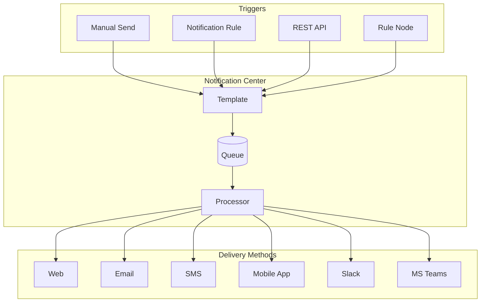
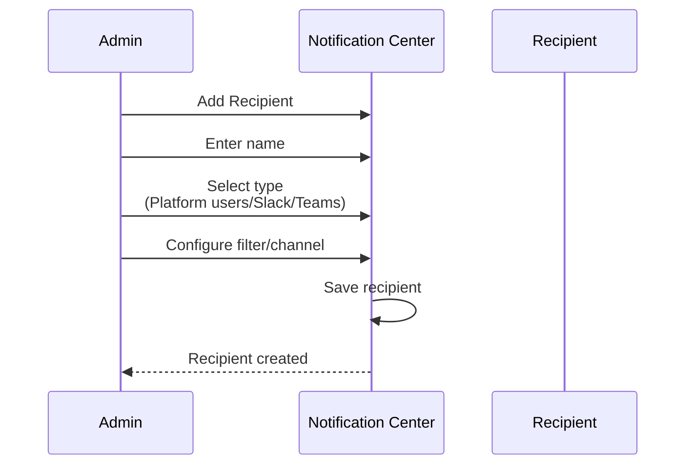
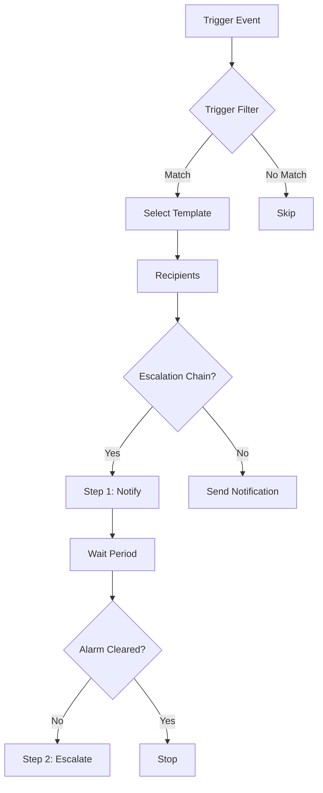
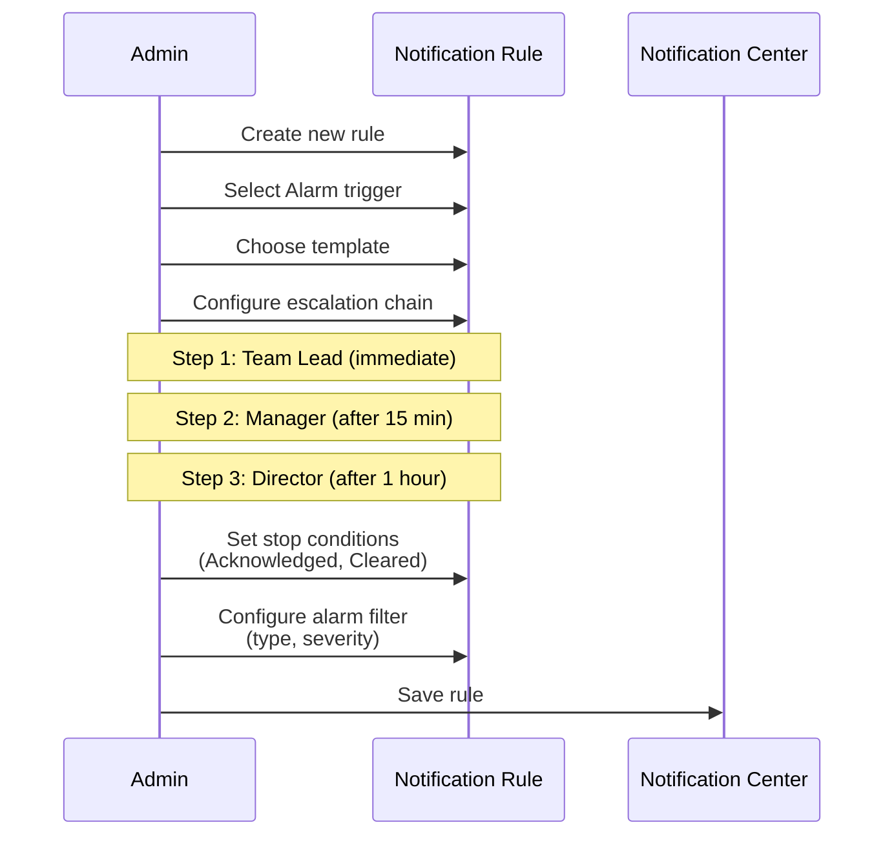
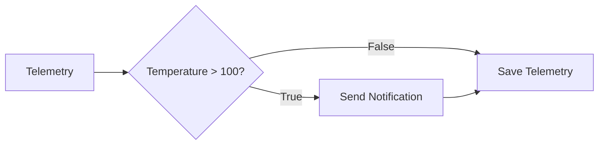

# Notification Center

## Overview

The ThingsBoard Notification Center provides comprehensive notification management for IoT solutions. It supports multiple delivery channels (Web, Email, SMS, Mobile, Slack, Microsoft Teams), templated messages with dynamic parameters, automated rules triggered by system events, and scheduled delivery. Notifications can be sent manually, via REST API, or automatically based on alarms, device activity, and other triggers.

## Key Behaviors

1. **Multi-Channel Delivery**: Send notifications via Web, Email, SMS, Mobile app, Slack, or Microsoft Teams.

2. **Templated Messages**: Create reusable templates with dynamic parameters for consistent messaging.

3. **Automated Rules**: Configure triggers for automatic notifications based on system events.

4. **Escalation Chains**: Define multi-step escalation for alarm notifications.

5. **Scheduled Delivery**: Schedule notifications for specific times.

6. **Recipient Groups**: Define recipients by user filter, role, or external channel.

## Architecture



## Delivery Methods

### Method Comparison

| Method | Use Case | Configuration Required |
|--------|----------|------------------------|
| Web | In-app notifications | None |
| Email | Formal notifications | Outgoing mail server |
| SMS | Urgent alerts | SMS provider |
| Mobile App | Push notifications | Mobile app settings |
| Slack | Team collaboration | Slack integration |
| MS Teams | Enterprise teams | Webhook URL |

### Web Notifications

Delivered directly in the ThingsBoard UI. Users see notifications via the bell icon.

**Features:**
- Action buttons (open dashboard, open URL)
- Icon customization
- Mark as read/unread
- No external configuration required

### Email Notifications

Delivered to user email addresses.

**Requirements:**
- Configured outgoing mail server
- Valid recipient email addresses

**Features:**
- HTML templates
- Report attachments (PE)
- Rich text formatting

### SMS Notifications

Delivered via SMS to mobile devices.

**Requirements:**
- Configured SMS provider (Twilio, AWS SNS, etc.)
- Valid phone numbers

**Features:**
- Concise messages
- Works without internet

### Mobile App Notifications

Push notifications to ThingsBoard mobile app.

**Requirements:**
- ThingsBoard Mobile App installed
- Mobile settings configured in platform

**Features:**
- Real-time push
- Deep linking to dashboards

### Slack Notifications

Messages sent to Slack channels or users.

**Requirements:**
- Slack integration configured
- Channel/user permissions

**Features:**
- Public channels
- Private channels
- Direct messages

### Microsoft Teams Notifications

Messages sent to MS Teams channels.

**Requirements:**
- Incoming webhook URL
- Channel access

**Features:**
- Channel notifications
- Rich message formatting

## Recipients

### User Filters

| Filter | Description |
|--------|-------------|
| All users | All users of tenant |
| Tenant administrators | Tenant admin users |
| User list | Specific selected users |
| Customer users | Users belonging to customers |
| Users of entity owner | Owner of the triggering entity |
| Affected user | User affected by event (e.g., alarm assignee) |

### External Recipients

**Slack:**
- Public channel
- Private channel
- Direct message

**Microsoft Teams:**
- Channel via webhook URL

### Create Recipient



## Templates

### Template Structure

| Property | Description |
|----------|-------------|
| Name | Template identifier |
| Type | Template type (General, Alarm, etc.) |
| Delivery Methods | Enabled channels |
| Subject | Message subject (supports parameters) |
| Message | Message body (supports parameters) |

### Parameter Syntax

Parameters use `${...}` syntax:

```
Hello ${recipientFirstName},

Device ${deviceName} is now ${eventType}.

Best regards,
ThingsBoard
```

**Modifiers:**
- `${name:upperCase}` - UPPERCASE
- `${name:lowerCase}` - lowercase
- `${name:capitalize}` - Capitalize

### Template Types

#### General Template

For generic notifications (announcements, maintenance).

**Parameters:**
| Parameter | Description |
|-----------|-------------|
| `recipientTitle` | Recipient's name or email |
| `recipientEmail` | Recipient's email |
| `recipientFirstName` | First name |
| `recipientLastName` | Last name |

#### Alarm Template

For alarm-related notifications.

**Additional Parameters:**
| Parameter | Description |
|-----------|-------------|
| `alarmType` | Type of alarm |
| `alarmSeverity` | Severity (lowercase) |
| `alarmStatus` | Current status |
| `alarmOriginatorName` | Entity name |
| `alarmOriginatorEntityType` | Entity type |
| `action` | created/acknowledged/cleared/etc. |

**Example:**
```
Subject: ${alarmSeverity:upperCase} Alarm: ${alarmType}

Device ${alarmOriginatorName} has a ${alarmSeverity} alarm.
Type: ${alarmType}
Status: ${alarmStatus}
```

#### Device Activity Template

For device online/offline notifications.

**Additional Parameters:**
| Parameter | Description |
|-----------|-------------|
| `deviceId` | Device UUID |
| `deviceName` | Device name |
| `deviceLabel` | Device label |
| `deviceType` | Device type |
| `eventType` | active/inactive |

#### Entity Action Template

For entity lifecycle notifications.

**Additional Parameters:**
| Parameter | Description |
|-----------|-------------|
| `entityType` | Type (Device, Asset, etc.) |
| `entityName` | Entity name |
| `actionType` | added/updated/deleted |
| `userEmail` | Action user's email |

#### Alarm Comment Template

For alarm comment notifications.

**Additional Parameters:**
| Parameter | Description |
|-----------|-------------|
| `comment` | Comment text |
| `action` | added/updated |
| `userEmail` | Commenter's email |

#### Rule Engine Lifecycle Template

For rule chain/node lifecycle events.

**Additional Parameters:**
| Parameter | Description |
|-----------|-------------|
| `componentType` | rule chain/rule node |
| `componentName` | Component name |
| `ruleChainName` | Parent chain name |
| `eventType` | started/updated/stopped |
| `error` | Error message |

#### Edge Connection Template

For Edge connectivity status changes.

**Parameters:**
| Parameter | Description |
|-----------|-------------|
| `edgeId` | Edge UUID |
| `edgeName` | Edge name |
| `eventType` | connected/disconnected |

## Notification Rules

### Rule Structure



### Trigger Types

#### Alarm Trigger

Notifies on alarm events.

**Filter Options:**
- Alarm types
- Severity levels
- Event types (created, acknowledged, cleared, etc.)

**Escalation:**
- Multiple escalation steps
- Time delays between steps
- Stop conditions (alarm statuses)

#### Device Activity Trigger

Notifies on device connectivity changes.

**Filter Options:**
- Specific devices
- Device types
- Event types (active, inactive)

#### Entity Action Trigger

Notifies on entity lifecycle events.

**Filter Options:**
- Entity types
- Action types (added, updated, deleted)

#### Alarm Comment Trigger

Notifies on alarm comments.

**Filter Options:**
- Alarm types
- Severity levels
- Comment types (user/system)

#### Alarm Assignment Trigger

Notifies on alarm assignment changes.

**Filter Options:**
- Alarm types
- Severity levels
- Actions (assigned, unassigned)

#### Rule Engine Lifecycle Trigger

Notifies on rule chain/node errors.

**Filter Options:**
- Rule chains
- Rule nodes
- Event types

#### Edge Connection Trigger

Notifies on Edge connectivity.

**Filter Options:**
- Edge instances
- Event types (connected, disconnected)

### Create Alarm Rule with Escalation



## Send Notification

### Manual Send

1. Click "Send notification" button
2. Select recipients
3. Choose delivery methods
4. Optionally schedule delivery
5. Compose message content
6. Review and send

### REST API Send

**Endpoint:** `POST /api/notification/request`

```json
{
  "targets": {
    "userIds": ["user-uuid-1", "user-uuid-2"]
  },
  "template": {
    "notificationType": "GENERAL",
    "configuration": {
      "deliveryMethodsTemplates": {
        "WEB": {
          "enabled": true,
          "subject": "System Alert",
          "body": "Important message for all users."
        }
      }
    }
  }
}
```

### Rule Engine Send

Use the "Send Notification" rule node to trigger notifications from rule chains.

**Configuration:**
- Select template (Rule Node type)
- Use message data/metadata as parameters

## Inbox and Sent

### Inbox

View received notifications:
- Unread notifications (default)
- All notifications
- Mark as read
- Delete notifications
- Take action (click buttons)

### Sent

View sent notifications:
- Delivery status per recipient
- Resend notifications
- Delete (removes for all recipients)
- Debug delivery issues

## Integration with Rule Engine

### Send Notification Node

The "Send Notification" action node sends notifications from rule chains.

**Use Cases:**
- Threshold alerts
- Custom event notifications
- Automated customer communications

**Template Parameters Available:**
- All message metadata
- All message data
- `originatorType`, `originatorId`
- `msgType`
- Recipient information

**Example Rule Chain:**



## Best Practices

### Template Design

| Practice | Benefit |
|----------|---------|
| Use meaningful subject lines | Better user attention |
| Include relevant parameters | Context-rich messages |
| Keep SMS messages short | Character limits |
| Format HTML for email | Professional appearance |

### Rule Configuration

| Practice | Benefit |
|----------|---------|
| Filter by severity | Reduce noise |
| Use escalation chains | Ensure critical alerts reach decision makers |
| Set stop conditions | Prevent over-notification |
| Test before production | Validate delivery |

### Recipient Management

| Practice | Benefit |
|----------|---------|
| Group by role | Role-based routing |
| Use filters | Dynamic membership |
| Verify contact info | Successful delivery |
| Review periodically | Keep recipients current |

## Configuration

### System Settings

| Setting | Description |
|---------|-------------|
| `notification.enabled` | Enable/disable notification system |
| `notification.rate_limits` | Rate limiting configuration |
| `notification.queue_size` | Notification queue capacity |

### Provider Configuration

**Email:**
- SMTP server settings
- From address
- Authentication

**SMS:**
- Provider type (Twilio, AWS SNS, etc.)
- API credentials
- Sender ID

**Slack:**
- Bot token
- App permissions

**Mobile:**
- Firebase configuration
- Push notification settings

## Troubleshooting

### Common Issues

| Issue | Cause | Solution |
|-------|-------|----------|
| Notification not received | Invalid recipient | Verify email/phone |
| Email delivery failed | SMTP misconfigured | Check mail server settings |
| SMS not sent | Provider error | Verify SMS provider config |
| Slack message failed | Invalid channel | Check channel permissions |
| Template error | Invalid parameter | Verify parameter names |
| Template parameter not replaced | Typo in `${parameterName}` doesn't throw error, outputs literal text | Test template with sample data before production, verify parameter names match template type exactly (case-sensitive). Use Notification Center preview feature |
| Notifications dropped during burst | Exceeding per-tenant notification rate limit (`notification.rate_limits` config) | Configure `notification.rate_limits` in system settings, batch notifications, use targeted recipients instead of "all users" broadcast, implement exponential backoff in client |
| Escalation continues after alarm cleared | Stop condition not configured in escalation chain steps | Add stop conditions (CLEARED, ACKNOWLEDGED status) to each escalation chain step configuration. Check "Stop escalation if alarm has one of the statuses" with desired statuses |

### Debug Steps

1. Check notification status in Sent tab
2. Verify recipient configuration
3. Review delivery method settings
4. Check provider integrations
5. Examine notification logs

## See Also

- [REST API Overview](./rest-api-overview.md) - Notification API endpoints
- [Rule Engine](../04-rule-engine/README.md) - Send Notification node
- [Alarm Entity](../02-core-concepts/entities/alarm.md) - Alarm-based notifications
- [Device Entity](../02-core-concepts/entities/device.md) - Device activity notifications
