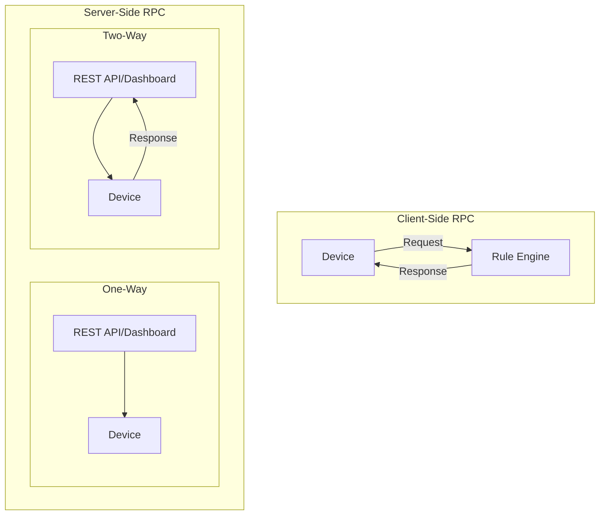
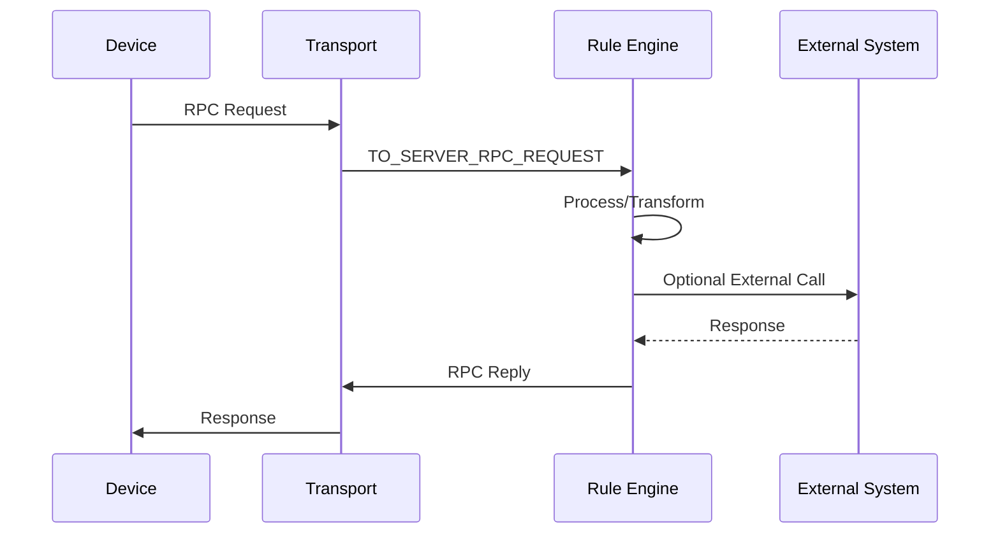
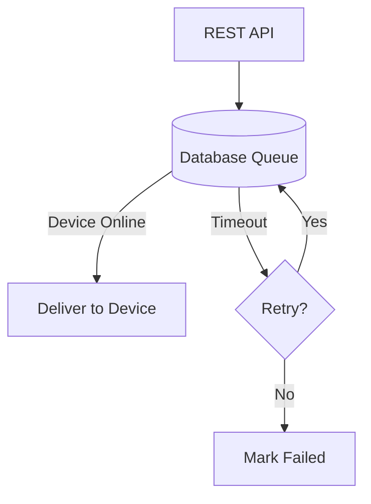
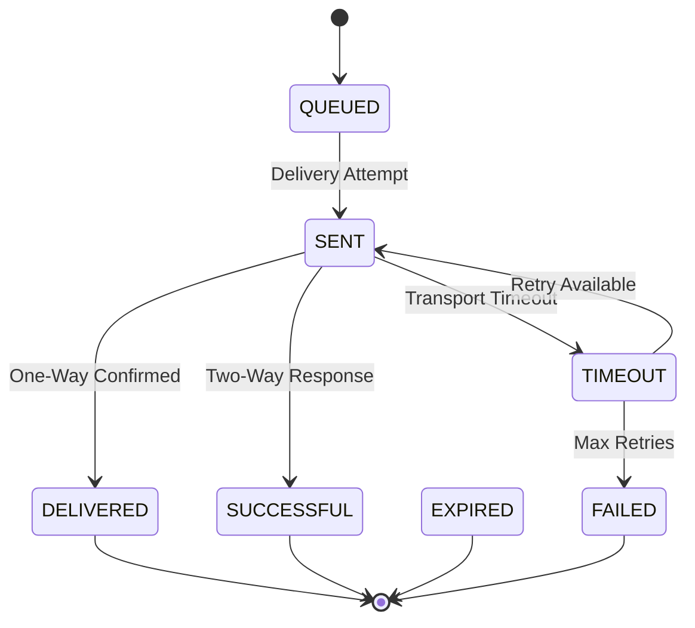

# RPC API

## Overview

ThingsBoard provides Remote Procedure Call (RPC) capabilities for bidirectional communication between the platform and devices. Client-side RPC allows devices to send requests to the platform, while server-side RPC enables the platform to send commands to devices. Both lightweight (short-lived) and persistent (durable) RPC calls are supported.

## RPC Types



| Type | Direction | Response | Use Case |
|------|-----------|----------|----------|
| Client-side | Device → Platform | Required | Weather forecast, time sync, access control |
| Server-side one-way | Platform → Device | None | Reboot, state change commands |
| Server-side two-way | Platform → Device | Expected | GPIO control, configuration changes |

## Client-Side RPC

### Concept

Client-side RPC allows devices to send requests to the platform and receive responses. The request is processed by the Rule Engine, which can transform the data, call external systems, and return results to the device.



### Request Structure

| Field | Type | Required | Description |
|-------|------|----------|-------------|
| method | string | Yes | RPC method name (e.g., "getCurrentTime") |
| params | JSON | Yes | Request parameters (use {} if none) |

**Example Request:**
```json
{
   "method": "getCurrentTime",
   "params": {}
}
```

**Example Response:**
```text
1631881236974
```

### Protocol-Specific APIs

| Protocol | Endpoint/Topic | Reference |
|----------|----------------|-----------|
| MQTT | `v1/devices/me/rpc/request/$request_id` | Subscribe to `v1/devices/me/rpc/response/+` |
| CoAP | `POST /api/v1/$ACCESS_TOKEN/rpc` | Observe for response |
| HTTP | `POST /api/v1/$ACCESS_TOKEN/rpc` | Synchronous response |

### Rule Engine Processing

Client-side RPC messages arrive as `TO_SERVER_RPC_REQUEST` message type with metadata containing `requestId`. Use the **RPC Call Reply** node to send responses.


**Example Script Transformation:**
```javascript
var rpcResponse;
if (msg.method === "getCurrentTime") {
   rpcResponse = new Date().getTime();
} else {
   rpcResponse = "Unknown RPC request method: " + msg.method;
}
return {msg: rpcResponse, metadata: metadata, msgType: msgType};
```

## Server-Side RPC

### Concept

Server-side RPC sends commands from the platform (REST API, dashboard widgets, or Rule Engine) to devices. Commands can be one-way (fire-and-forget) or two-way (expecting response).

### Request Structure

| Field | Type | Required | Description |
|-------|------|----------|-------------|
| method | string | Yes | RPC method name |
| params | JSON | Yes | Command parameters |
| timeout | number | No | Processing timeout in ms (default: 10000, min: 5000) |
| expirationTime | number | No | Epoch time (ms) for expiration (overrides timeout) |
| persistent | boolean | No | Enable persistent RPC (default: false) |
| retries | number | No | Retry count for persistent RPC |
| additionalInfo | JSON | No | Metadata for persistent RPC events |

**Example Request:**
```json
{
   "method": "setGPIO",
   "params": {
     "pin": 4,
     "value": 1
   },
   "timeout": 30000
}
```

**Example Response:**
```json
{
   "pin": 4,
   "value": 1,
   "changed": true
}
```

### REST API Endpoints

```
POST /api/plugins/rpc/{callType}/{deviceId}
```

| Parameter | Description |
|-----------|-------------|
| callType | `oneway` or `twoway` |
| deviceId | Target device UUID |

**Authentication:** JWT token required (TENANT_ADMIN or CUSTOMER_USER role)

**Example cURL:**
```bash
curl -X POST \
  "https://$TB_HOST/api/plugins/rpc/twoway/$DEVICE_ID" \
  -H "Content-Type: application/json" \
  -H "X-Authorization: Bearer $JWT_TOKEN" \
  -d '{
    "method": "setGPIO",
    "params": {"pin": 4, "value": 1},
    "timeout": 30000
  }'
```

### Dashboard Integration

Control widgets send RPC commands to devices:

| Widget | Description |
|--------|-------------|
| RPC Button | Single command trigger |
| Round Switch | Toggle on/off state |
| Switch Control | Multiple switch controls |
| Knob Control | Value adjustment |

Widget advanced settings define RPC method name and parameters.

### Rule Engine Integration

Server-side RPC messages have type `RPC_CALL_FROM_SERVER_TO_DEVICE`. Use the **RPC Call Request** node to deliver commands to devices.

**Generator Node Example:**
```javascript
var msg = { method: "rpcCommand", params: {} };
var metadata = {
    expirationTime: new Date().getTime() + 60000,
    oneway: true,
    persistent: false
};
var msgType = "RPC_CALL_FROM_SERVER_TO_DEVICE";

return { msg: msg, metadata: metadata, msgType: msgType };
```

### Device-Side Processing

| Protocol | Subscribe Topic/Endpoint | Response |
|----------|--------------------------|----------|
| MQTT | `v1/devices/me/rpc/request/+` | Publish to `v1/devices/me/rpc/response/$request_id` |
| CoAP | Observe `/api/v1/$ACCESS_TOKEN/rpc` | POST response |
| HTTP | `GET /api/v1/$ACCESS_TOKEN/rpc` (long polling) | POST response |

## Persistent RPC

### Overview

Persistent RPC (since v3.3) stores commands in the database with configurable lifetime. Useful for devices that may be offline or in Power-Saving Mode (PSM).



### RPC States

| State | Description |
|-------|-------------|
| QUEUED | Saved to database, awaiting delivery |
| SENT | Delivery attempted |
| DELIVERED | Device confirmed receipt (final for one-way) |
| SUCCESSFUL | Two-way response received |
| TIMEOUT | Transport timeout (MQTT/CoAP/LwM2M) |
| EXPIRED | Expiration time reached without delivery/response |
| FAILED | Max retries exceeded or device rejected command |



### Persistent RPC Response

```json
{
   "rpcId": "b10bb1a0-0afd-11ec-a08f-1b3182194747"
}
```

Use the `rpcId` to track command state via REST API.

### Rule Engine Events

State changes generate Rule Engine messages:

| Message Type | Trigger |
|--------------|---------|
| RPC_QUEUED | RPC created |
| RPC_SENT | Delivery attempted |
| RPC_DELIVERED | Device confirmed |
| RPC_SUCCESSFUL | Response received |
| RPC_TIMEOUT | Transport timeout |
| RPC_EXPIRED | Expiration reached |
| RPC_FAILED | Max retries exceeded |

**Successful RPC Event Example:**
```json
{
    "id": {
        "entityType": "RPC",
        "id": "bea26301-1aec-11ec-9441-73a37bbb7cd2"
    },
    "tenantId": {
        "entityType": "TENANT",
        "id": "ab937a40-3f98-11eb-a8d6-f5a87f07d4be"
    },
    "deviceId": {
        "entityType": "DEVICE",
        "id": "3e46db70-e480-11eb-9d0e-1f8899a6f9b3"
    },
    "expirationTime": 1632236525354,
    "request": {
        "oneway": false,
        "body": {
            "method": "rpcCommand",
            "params": "{}"
        },
        "persisted": true
    },
    "response": {
        "test": "passed"
    },
    "status": "SUCCESSFUL"
}
```

### TTL Configuration

Configure RPC time-to-live in **Tenant Profile**:

| Parameter | Description |
|-----------|-------------|
| RPC TTL days | How long to keep persistent RPC records |
| SQL_TTL_RPC_ENABLED | Enable/disable RPC cleanup (env variable) |
| SQL_RPC_TTL_CHECKING_INTERVAL | Cleanup frequency (default: 2 hours) |

## Lightweight vs Persistent RPC

| Feature | Lightweight | Persistent |
|---------|-------------|------------|
| Storage | Memory only | Database |
| Lifetime | ~30 seconds | Configurable (days) |
| Offline support | No | Yes |
| State tracking | Limited | Full lifecycle |
| Resource usage | Low | Higher (database I/O) |
| Use case | Interactive control | Offline devices, PSM |

## Configuration

### Transport Timeouts

| Protocol | Environment Variable | Default |
|----------|---------------------|---------|
| MQTT | MQTT_TIMEOUT | 10 seconds |
| CoAP | COAP_TIMEOUT | 10 seconds |
| LwM2M | LWM2M_TIMEOUT | 120 seconds |

### Retry Configuration

| Parameter | Environment Variable | Default |
|-----------|---------------------|---------|
| Max retries | ACTORS_RPC_MAX_RETRIES | 5 |
| Sequential delivery | ACTORS_RPC_SEQUENTIAL | false |

## Best Practices

### Performance

| Practice | Benefit |
|----------|---------|
| Use lightweight RPC for interactive commands | Lower latency, fewer resources |
| Set appropriate timeouts | Prevent long waits |
| Use one-way for fire-and-forget | Reduced overhead |

### Reliability

| Practice | Benefit |
|----------|---------|
| Use persistent RPC for offline devices | Guaranteed delivery |
| Configure retries for unreliable networks | Automatic recovery |
| Monitor RPC state events | Track command lifecycle |

### Security

| Practice | Benefit |
|----------|---------|
| Validate RPC method names | Prevent injection |
| Use proper authentication | JWT for REST, device credentials for transport |
| Log RPC events | Audit trail |

## Troubleshooting

### Common Issues

| Issue | Cause | Solution |
|-------|-------|----------|
| RPC timeout | Device offline or slow | Increase timeout, use persistent RPC |
| No response | Missing RPC Call Reply node | Add node to rule chain |
| Permission denied | Invalid JWT or wrong device owner | Verify authentication |
| QUEUED indefinitely | Device never comes online | Check device connectivity |

## See Also

- [Device API](./device-api.md) - Device-facing RPC endpoints
- [REST API Overview](./rest-api-overview.md) - General REST API patterns
- [Transport Layer](../05-transport-layer/README.md) - Protocol-specific details
- [Rule Engine](../04-rule-engine/README.md) - RPC processing in rule chains
- [Action Nodes](../04-rule-engine/nodes/action-nodes.md) - RPC Call Request/Reply nodes
