# Subscription Model

## Overview

The ThingsBoard subscription model enables real-time data delivery to WebSocket clients. It provides a unified framework for subscribing to telemetry, attributes, alarms, entity data, and notifications. The model supports both simple single-entity subscriptions (V1) and complex query-based subscriptions (V2) that can track multiple entities simultaneously. Subscriptions are managed per-session and automatically deliver incremental updates when underlying data changes.

## Key Behaviors

1. **Per-Session Management**: Subscriptions are tied to WebSocket sessions and automatically cleaned up on disconnect.

2. **Entity Tracking**: The system tracks which entities have active subscriptions and routes updates efficiently.

3. **Deduplication**: Stale and duplicate updates are filtered before delivery to clients.

4. **Key-Based Filtering**: Subscriptions can target specific telemetry/attribute keys or all keys.

5. **Scope Filtering**: Attribute subscriptions can filter by scope (CLIENT, SERVER, SHARED).

6. **Dynamic Queries**: V2 subscriptions support entity queries that automatically update when matching entities change.

## Subscription Architecture

### High-Level Flow

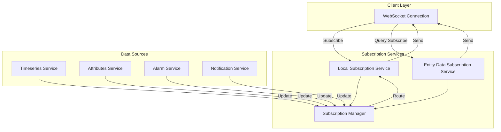

### Subscription Types

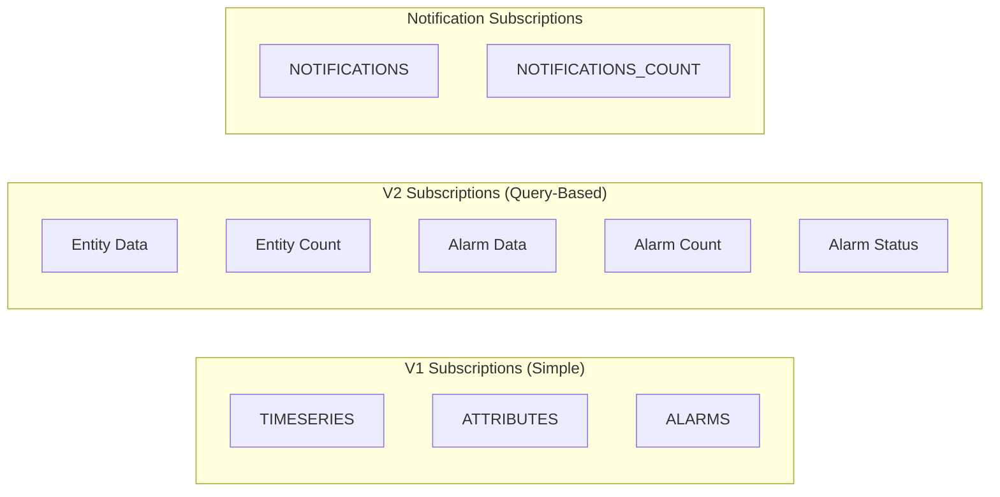

| Type | API Version | Description |
|------|-------------|-------------|
| TIMESERIES | V1 | Subscribe to time-series data for single entity |
| ATTRIBUTES | V1 | Subscribe to attribute updates for single entity |
| ALARMS | V1 | Subscribe to alarm updates for single entity |
| NOTIFICATIONS | V1 | Subscribe to user notifications |
| NOTIFICATIONS_COUNT | V1 | Subscribe to unread notification count |
| Entity Data | V2 | Query-based entity data subscription |
| Entity Count | V2 | Subscribe to entity count matching query |
| Alarm Data | V2 | Query-based alarm subscription |
| Alarm Count | V2 | Subscribe to alarm count matching query |
| Alarm Status | V2 | Subscribe to alarm status by entity |

## V1 Subscriptions (Simple)

### Subscription Structure

All V1 subscriptions extend a base subscription class:

| Field | Type | Description |
|-------|------|-------------|
| serviceId | String | Server instance ID |
| sessionId | String | WebSocket session ID |
| subscriptionId | int | Unique subscription ID within session |
| tenantId | TenantId | Owning tenant |
| entityId | EntityId | Target entity |
| type | TbSubscriptionType | Subscription type |
| updateProcessor | BiConsumer | Callback for updates |

### Timeseries Subscription

Subscribe to telemetry updates for a specific entity.

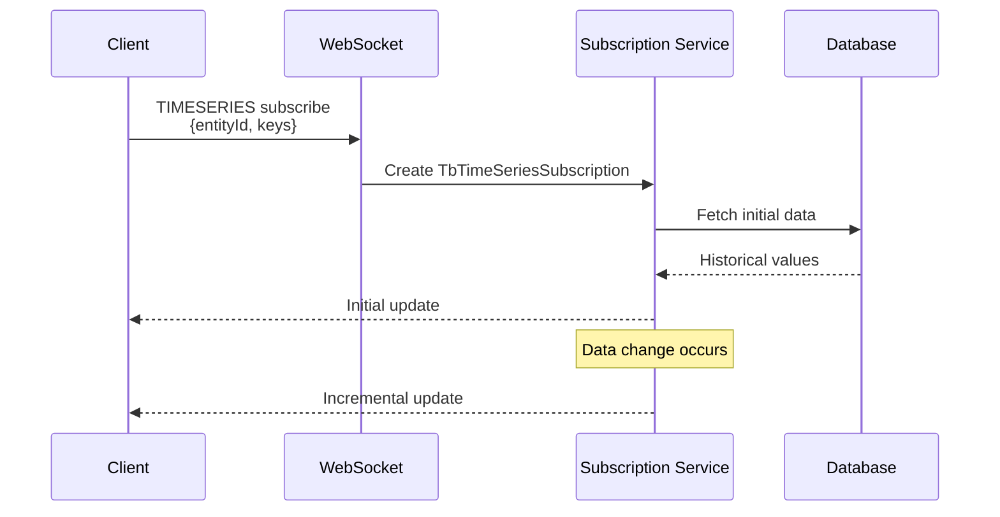

**Additional Fields:**

| Field | Type | Description |
|-------|------|-------------|
| queryTs | long | Subscription creation timestamp |
| allKeys | boolean | Subscribe to all keys |
| keyStates | Map&lt;String, Long&gt; | Last known timestamp per key |
| startTime | long | Time window start |
| endTime | long | Time window end |
| latestValues | boolean | Only latest values (vs historical) |

### Attribute Subscription

Subscribe to attribute updates for a specific entity with optional scope filtering.

**Additional Fields:**

| Field | Type | Description |
|-------|------|-------------|
| queryTs | long | Subscription creation timestamp |
| allKeys | boolean | Subscribe to all keys |
| keyStates | Map&lt;String, Long&gt; | Last known timestamp per key |
| scope | TbAttributeSubscriptionScope | Attribute scope filter |

**Attribute Scopes:**

| Scope | Description |
|-------|-------------|
| ANY_SCOPE | All attribute scopes |
| CLIENT_SCOPE | Device-reported attributes |
| SERVER_SCOPE | Server-side attributes |
| SHARED_SCOPE | Shared attributes (server to device) |

### Alarm Subscription

Subscribe to alarm updates for a specific entity.

**Additional Fields:**

| Field | Type | Description |
|-------|------|-------------|
| ts | long | Subscription timestamp |

## V2 Subscriptions (Query-Based)

### Entity Data Query Structure

V2 subscriptions use queries to select and track multiple entities:

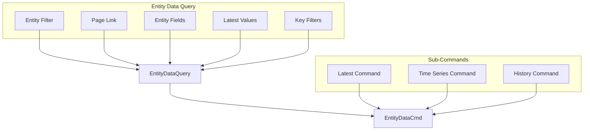

### Entity Filter Types

| Filter Type | JSON Type | Description |
|-------------|-----------|-------------|
| SingleEntityFilter | singleEntity | Single specific entity |
| EntityListFilter | entityList | List of entity IDs |
| EntityNameFilter | entityName | Filter by name pattern |
| EntityTypeFilter | entityType | All entities of type |
| AssetTypeFilter | assetType | Assets of specific type |
| DeviceTypeFilter | deviceType | Devices of specific profile |
| EdgeTypeFilter | edgeType | Edges of specific type |
| EntityViewTypeFilter | entityViewType | Entity views of specific type |
| RelationsQueryFilter | relationsQuery | Entities related to root entity |
| AssetSearchQueryFilter | assetSearchQuery | Asset search with relations |
| DeviceSearchQueryFilter | deviceSearchQuery | Device search with relations |
| EntityViewSearchQueryFilter | entityViewSearchQuery | Entity view search with relations |
| EdgeSearchQueryFilter | edgeSearchQuery | Edge search with relations |
| ApiUsageStateFilter | apiUsageState | API usage state entities |

### Alias Entity Types

SingleEntityFilter supports alias entity resolution for dynamic queries:

| Alias | Description |
|-------|-------------|
| CURRENT_USER | Current authenticated user |
| CURRENT_TENANT | Current user's tenant |
| CURRENT_CUSTOMER | Current user's customer |
| CURRENT_USER_OWNER | Owner of current user |

### Relations Query Options

| Field | Type | Description |
|-------|------|-------------|
| rootEntity | AliasEntityId | Starting entity for traversal |
| isMultiRoot | boolean | Enable multiple root entities |
| multiRootEntitiesType | EntityType | Type for multi-root entities |
| multiRootEntityIds | Set<String> | IDs for multi-root entities |
| direction | EntitySearchDirection | FROM or TO |
| filters | List<RelationEntityTypeFilter> | Relation type constraints |
| maxLevel | int | Maximum traversal depth |
| fetchLastLevelOnly | boolean | Return only deepest level |
| negate | boolean | Invert filter results |

### Filter Examples

**Single Entity:**
```json
{
  "type": "singleEntity",
  "singleEntity": {
    "entityType": "DEVICE",
    "id": "784f394c-42b6-435a-983c-b7beff2784f9"
  }
}
```

**Entity Type:**
```json
{
  "type": "entityType",
  "entityType": "DEVICE"
}
```

**Device Type (Profile):**
```json
{
  "type": "deviceType",
  "deviceType": "temperature-sensor",
  "deviceNameFilter": "Sensor*"
}
```

**Relations Query:**
```json
{
  "type": "relationsQuery",
  "rootEntity": {
    "entityType": "ASSET",
    "id": "building-uuid"
  },
  "direction": "FROM",
  "maxLevel": 2,
  "filters": [
    {
      "relationType": "Contains",
      "entityTypes": ["DEVICE"]
    }
  ]
}
```

### Key Filters

Filter entities based on attribute/telemetry values:

```json
{
  "keyFilters": [
    {
      "key": {
        "type": "TIME_SERIES",
        "key": "temperature"
      },
      "valueType": "NUMERIC",
      "predicate": {
        "operation": "GREATER",
        "value": {
          "defaultValue": 25.0
        },
        "type": "NUMERIC"
      }
    }
  ]
}
```

**Predicate Types:**

| Type | Operations |
|------|------------|
| STRING | EQUAL, NOT_EQUAL, STARTS_WITH, ENDS_WITH, CONTAINS, NOT_CONTAINS, IN, NOT_IN |
| NUMERIC | EQUAL, NOT_EQUAL, GREATER, LESS, GREATER_OR_EQUAL, LESS_OR_EQUAL |
| BOOLEAN | EQUAL, NOT_EQUAL |
| COMPLEX | AND, OR |

### Entity Key Types

| Type | Description |
|------|-------------|
| ENTITY_FIELD | Entity metadata (name, createdTime, label, etc.) |
| ATTRIBUTE | Historical attributes (any scope) |
| CLIENT_ATTRIBUTE | Client-side attributes |
| SHARED_ATTRIBUTE | Shared attributes |
| SERVER_ATTRIBUTE | Server-side attributes |
| TIME_SERIES | Telemetry data points |
| ALARM_FIELD | Alarm-specific fields |

### Filter Predicate Values

Values support multiple sources with priority resolution:

| Source | Priority | Description |
|--------|----------|-------------|
| userValue | 1 (Highest) | User-provided override |
| dynamicValue | 2 | Runtime resolved value |
| defaultValue | 3 (Lowest) | Static default |

### Entity Data Subscription Context

The subscription context tracks:

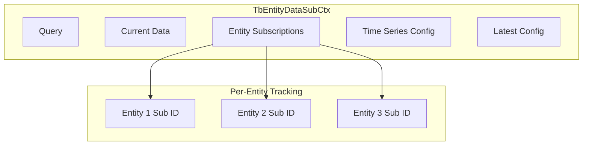

| Component | Description |
|-----------|-------------|
| query | The entity data query |
| data | Current page of entity data |
| subToEntityIdMap | Maps subscription IDs to entities |
| latestTsEntityData | Latest timestamp per entity/key |
| curTsCmd | Current time series command |
| latestValueCmd | Current latest value command |

## Subscription Lifecycle

### Creation Flow

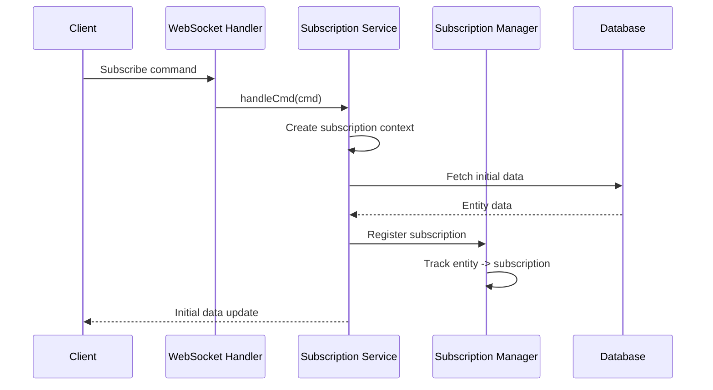

### Update Flow

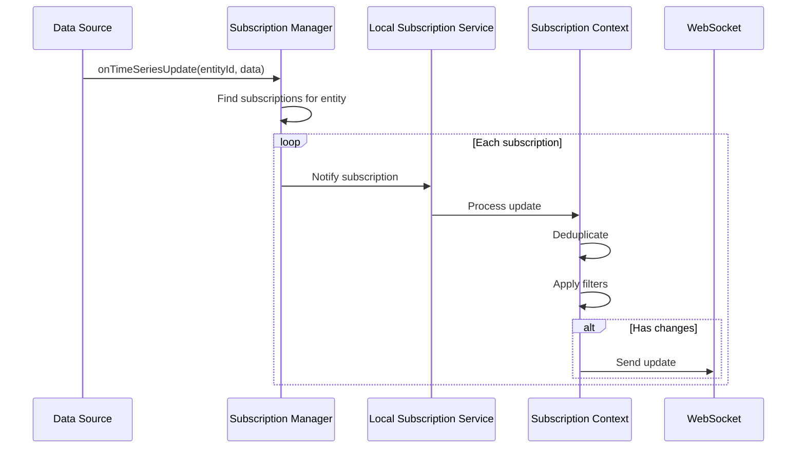

### Cancellation Flow

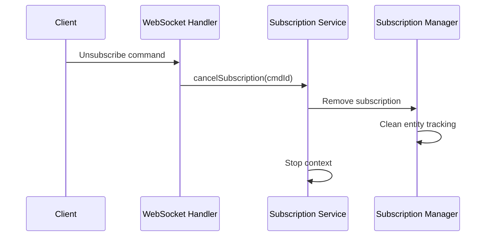

## Update Deduplication

### Stale Update Detection

Updates with older timestamps than current state are filtered:

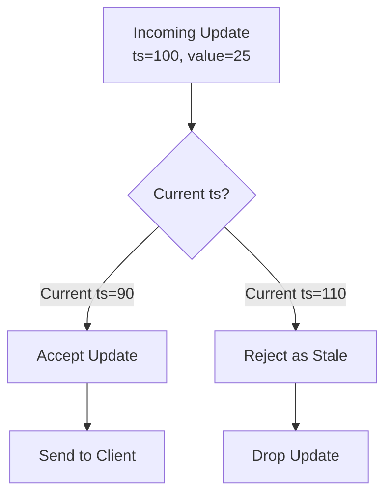

### Duplicate Detection

Updates with same timestamp and value are filtered:

```
Current State: {temperature: {ts: 100, value: "25.5"}}
Update:        {temperature: {ts: 100, value: "25.5"}}
Result:        Dropped (duplicate)

Update:        {temperature: {ts: 100, value: "25.6"}}
Result:        Accepted (different value)
```

## Rate Limiting

### Subscription Limits

Rate limits prevent subscription abuse:

| Limit | Setting | Description |
|-------|---------|-------------|
| Per Tenant | `server.ws.rate_limits.subscriptions_per_tenant` | Max subscriptions per tenant |
| Per User | `server.ws.rate_limits.subscriptions_per_user` | Max subscriptions per user |
| Per Session | (tenant profile) | Max subscriptions per session |

### Update Limits

| Limit | Description |
|-------|-------------|
| Updates per session | Rate limit on updates sent to single session |
| Message queue size | Max pending messages per session |

## Subscription Manager

### Entity Tracking

The subscription manager tracks which entities have active subscriptions:

```
subscriptionsByEntityId: Map<UUID, TbEntityLocalSubsInfo>

TbEntityLocalSubsInfo:
  - entityId: EntityId
  - subscriptions: Map<TbSubscription, TbSubscriptionsInfo>
```

### Cluster Distribution

Subscriptions span across cluster nodes:

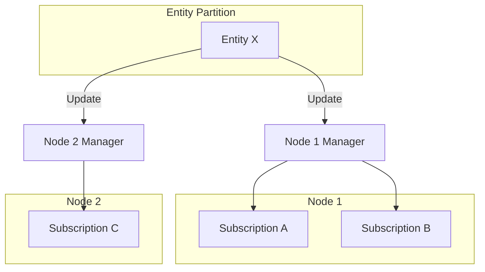

When data changes:
1. Partition owner receives update
2. Manager finds all subscriptions for entity
3. Local subscriptions receive direct update
4. Remote subscriptions receive cluster message

## Notification Subscriptions

### Notification Types

| Subscription | Description |
|--------------|-------------|
| NOTIFICATIONS | Full notification updates |
| NOTIFICATIONS_COUNT | Unread count only |

### Notification Flow

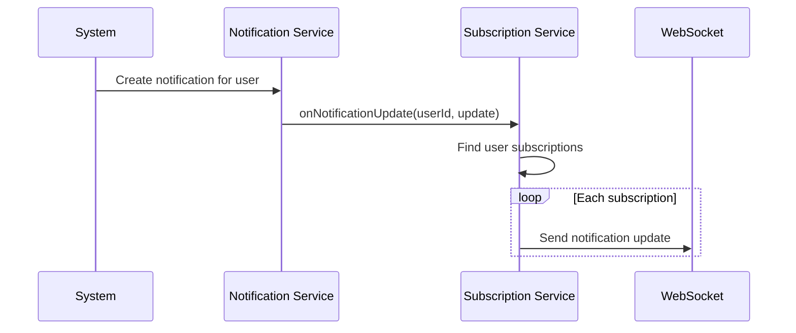

## Best Practices

### Subscription Management

1. **Minimize Subscriptions**: Subscribe only to needed entities and keys.

2. **Use Key Filters**: Specify `keys` parameter instead of subscribing to all keys.

3. **Unsubscribe Promptly**: Cancel subscriptions when data is no longer needed.

4. **Use V2 for Multiple Entities**: Query-based subscriptions are more efficient than multiple V1 subscriptions.

5. **Handle Reconnection**: Re-establish subscriptions after WebSocket reconnection.

### Query Design

1. **Limit Page Size**: Use reasonable page sizes (10-100 entities).

2. **Use Specific Filters**: Narrow filters reduce tracked entities.

3. **Avoid All-Keys**: Specify exact keys when possible.

4. **Consider Aggregation**: Use aggregation for historical time-series to reduce data volume.

### Error Handling

1. **Check Error Codes**: Handle subscription errors gracefully.

2. **Implement Backoff**: Use exponential backoff on repeated failures.

3. **Monitor Updates**: Track update frequency for anomaly detection.

## Configuration

### Server Settings

| Setting | Default | Description |
|---------|---------|-------------|
| server.ws.rate_limits.subscriptions_per_tenant | - | Tenant subscription limit |
| server.ws.rate_limits.subscriptions_per_user | - | User subscription limit |
| server.ws.max_queue_messages_per_session | 1000 | Max queued updates |

### Tenant Profile Settings

| Setting | Description |
|---------|-------------|
| maxEntitiesPerDataSubscription | Max entities per V2 subscription |
| wsMsgQueueLimitPerSession | Override message queue limit |

## Implementation Details

### Subscription Tracking Architecture

**DefaultTbLocalSubscriptionService** maintains three-tier tracking:

1. `subscriptionsBySessionId` (ConcurrentMap): Session ID → subscriptions map
2. `subscriptionsByEntityId` (ConcurrentMap): Entity UUID → TbEntityLocalSubsInfo
3. `entityUpdates` (ConcurrentMap): Entity UUID → TbEntityUpdatesInfo (timestamps)

**TbEntityLocalSubsInfo** aggregates per entity:
- Concurrent set of active subscriptions
- Volatile TbSubscriptionsInfo with flags: tsAllKeys, attrAllKeys
- Pending subscriptions map indexed by sequence number

### Update Deduplication Logic

**Latest Values (TbEntityDataSubCtx):**
```
For each update:
1. Extract latest value from values list
2. Compare with cached: latestCtxValues (per EntityKeyType)
3. Filter: timestamp equality AND value equality = duplicate
4. Filter: update.getTs() < cached.getTs() = stale
5. Send only non-duplicate, non-stale updates
```

**Time-Series Deduplication:**
- Compare each value against latest cached value per key
- Track max timestamp and update cache
- Deletions represented as ts=0, value=null (explicitly not deduplicated)

### Key Filtering Implementation

**DefaultSubscriptionManagerService.getSubList():**
```java
For each KvEntry in update:
  - Check if entry.key() in subscriber's key set
  - Include only matching keys in result
```

### Partition-Aware Routing

**Local vs Remote Decision:**
```java
TopicPartitionInfo tpi = partitionService.resolve(ServiceType.TB_CORE, tenantId, entityId);
if (tpi.isMyPartition()) {
    → Handle locally via SubscriptionManagerService
} else {
    → Push to Kafka queue for remote partition
}
```

### Missed Updates Detection

On new subscription registration:
- Query attributes/timeseries if `subscriptionCreationTs > lastUpdateTs`
- Uses `entityUpdateInfo.attributesUpdateTs` and `timeSeriesUpdateTs`
- Prevents data loss during subscription setup window

### Sequence Number Ordering

- Each entity subscription state change increments `seqNumber`
- TbEntityRemoteSubsInfo validates sequence numbers
- Detects and prevents out-of-order update processing

### Locking Strategy

**Tenant-level locks** (ConcurrentReferenceHashMap<TenantId, Lock>):
- SOFT references allow GC of unused tenant locks
- Prevents race conditions during concurrent add/remove operations

### Cleanup Mechanisms

**Stale Session Cleanup:**
- Scheduled executor runs every 60 seconds
- Calls `webSocketService.cleanupIfStale()` for each session

**Entity Update Cleanup:**
- Hourly cleanup of `entityUpdates` entries older than 1 hour
- Prevents unbounded growth of timestamp cache

## See Also

- [WebSocket Overview](./websocket-overview.md) - WebSocket connection details
- [REST API Overview](./rest-api-overview.md) - REST API patterns
- [Telemetry Data Model](../02-core-concepts/data-model/telemetry.md) - Telemetry structure
- [Attributes Data Model](../02-core-concepts/data-model/attributes.md) - Attribute structure
