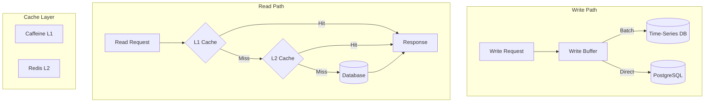

# Data Persistence

## Overview

The data persistence layer handles storage and retrieval of all platform data. ThingsBoard supports PostgreSQL for relational data, Cassandra or TimescaleDB for time-series data, and Redis/Caffeine for caching.

## Contents

| Document | Description |
|----------|-------------|
| [Database Schema](./database-schema.md) | PostgreSQL schema, tables, indexes, and relationships |
| [Time-Series Storage](./timeseries-storage.md) | Telemetry storage strategies, partitioning, and aggregation |
| [Attribute Storage](./attribute-storage.md) | Key-value attribute persistence and versioning |
| [Cassandra Storage](./cassandra-storage.md) | NoSQL time-series backend configuration and optimization |
| [Caching](./caching.md) | Redis and Caffeine caching layers and invalidation |

## Key Concepts

- **Hybrid Storage**: Relational (PostgreSQL) + Time-series (Cassandra/TimescaleDB)
- **Partitioning**: Time-based partitioning for efficient time-series queries
- **Write Batching**: Aggregated writes for high throughput
- **Read Caching**: Multi-layer caching (Redis + Caffeine) for low latency
- **TTL Management**: Automatic data expiration and cleanup

## Storage Architecture

## See Also

- [Data Model](../02-core-concepts/data-model/) - What data is stored
- [Message Queue](../08-message-queue/README.md) - Write path orchestration
- [Microservices](../11-microservices/README.md) - Service-to-database mapping
