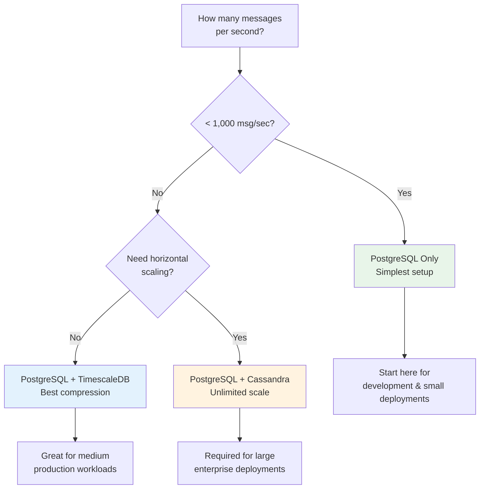
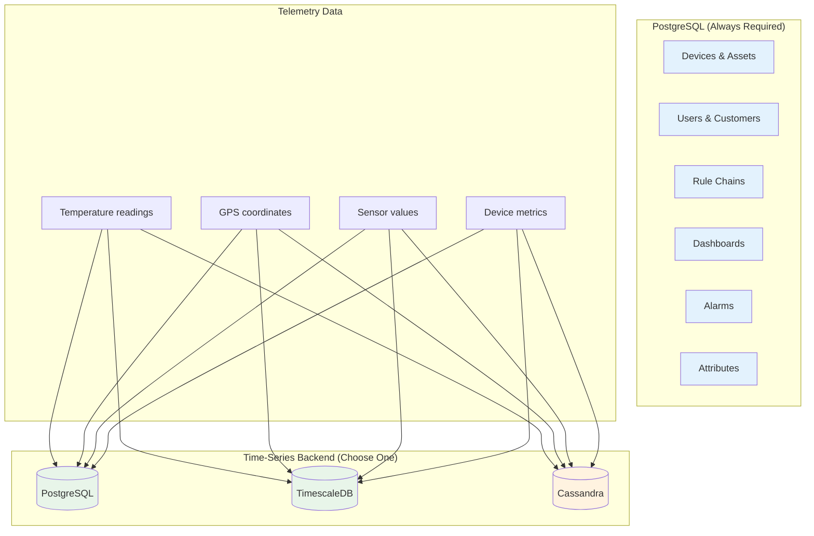
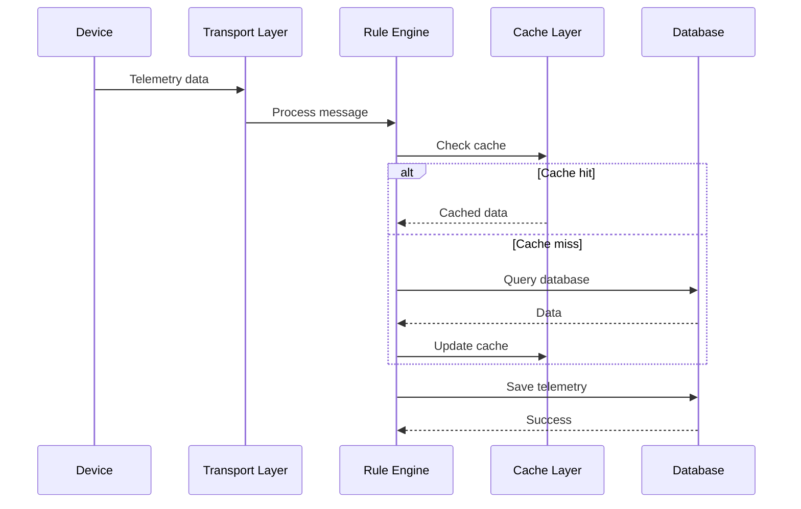
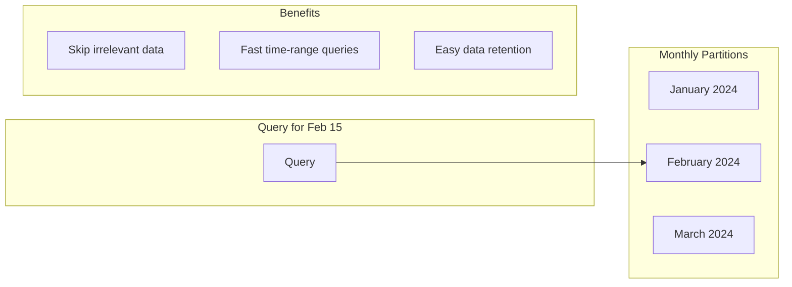
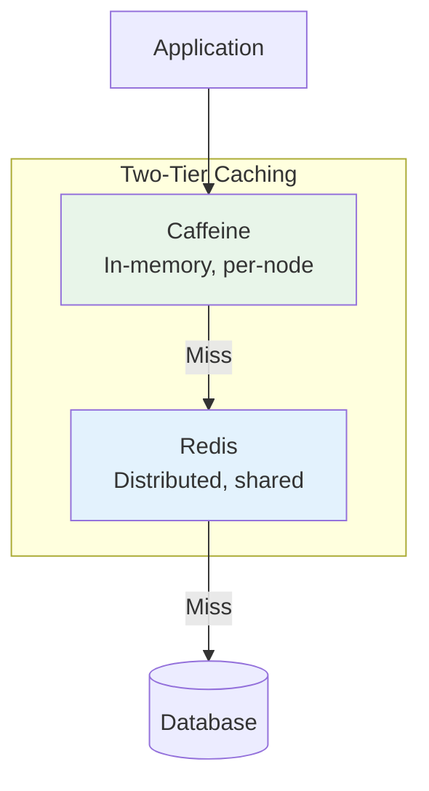
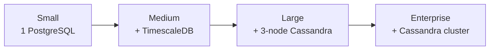

# Data Persistence

## Overview

The data persistence layer handles storage and retrieval of all platform data. ThingsBoard uses a flexible architecture that separates entity storage from time-series storage, allowing you to choose the right database backend for your scale and requirements.

## Quick Start: Choosing Your Storage Backend



| Backend | Best For | Complexity | Max Throughput |
|---------|----------|------------|----------------|
| PostgreSQL only | Development, < 1K devices | Low | ~2,000 msg/sec |
| PostgreSQL + TimescaleDB | Production, 1K-50K devices | Medium | ~5,000 msg/sec |
| PostgreSQL + Cassandra | Enterprise, 50K+ devices | High | 30,000+ msg/sec |

## Contents

| Document | Description |
|----------|-------------|
| [Hybrid Storage](./hybrid-storage.md) | When and how to use PostgreSQL + Cassandra together |
| [Database Schema](./database-schema.md) | PostgreSQL schema, tables, indexes, and relationships |
| [Time-Series Storage](./timeseries-storage.md) | Telemetry storage strategies, partitioning, and aggregation |
| [TimescaleDB Storage](./timescale-storage.md) | TimescaleDB extension configuration and optimization |
| [Cassandra Storage](./cassandra-storage.md) | NoSQL time-series backend configuration and optimization |
| [Attribute Storage](./attribute-storage.md) | Key-value attribute persistence and versioning |
| [Caching](./caching.md) | Redis and Caffeine caching layers and invalidation |

## Architecture Overview

### What Goes Where



### Data Flow



## Key Concepts

### Dual Storage Pattern

ThingsBoard stores time-series data in two forms:

| Store | Purpose | Query Pattern |
|-------|---------|---------------|
| **Historical** | All data points over time | Range scans for charts |
| **Latest Values** | Most recent reading per key | Point lookups for dashboards |

This separation optimizes both real-time monitoring (fast latest value lookups) and historical analysis (efficient time-range queries).

### Partitioning

Time-series data is automatically partitioned by time:



### Caching Layers



| Layer | Type | Use Case |
|-------|------|----------|
| Caffeine (L1) | In-memory | Single-node deployments |
| Redis (L2) | Distributed | Multi-node clusters |

## Configuration Quick Reference

### PostgreSQL Only

```yaml
database:
  ts:
    type: sql
  ts_latest:
    type: sql
```

### PostgreSQL + TimescaleDB

```yaml
database:
  ts:
    type: timescale
  ts_latest:
    type: timescale
```

### PostgreSQL + Cassandra (Hybrid)

```yaml
database:
  ts:
    type: cassandra
  ts_latest:
    type: cassandra

cassandra:
  url: "node1:9042,node2:9042,node3:9042"
  keyspace_name: thingsboard
```

## Performance Guidelines

### Write Throughput

| Configuration | Expected Throughput |
|---------------|---------------------|
| PostgreSQL (single) | ~2,000 writes/sec |
| TimescaleDB | ~5,000 writes/sec |
| Cassandra (3 nodes) | ~30,000 writes/sec |

### Memory Requirements

| Component | Recommended |
|-----------|-------------|
| PostgreSQL | 25% of RAM for shared_buffers |
| Caffeine cache | 1-4 GB heap allocation |
| Redis | Separate process, 2-8 GB |
| Cassandra | 8-16 GB heap per node |

### Scaling Strategy



## Common Tasks

### Monitoring Storage Health

| What to Monitor | Why |
|-----------------|-----|
| Disk usage | Plan capacity |
| Query latency | Detect slowdowns |
| Cache hit rate | Verify caching |
| Connection pool | Detect exhaustion |

### Data Retention

Configure TTL to automatically expire old data:

```yaml
sql:
  ttl:
    ts:
      enabled: true
      ts_key_value_ttl: 2592000  # 30 days in seconds
```

### Backup Strategy

| Database | Backup Method |
|----------|---------------|
| PostgreSQL | pg_dump, pg_basebackup |
| Cassandra | nodetool snapshot |
| Redis | RDB snapshots, AOF |

## Common Pitfalls

| Pitfall | Impact | Detection | Solution |
|---------|--------|-----------|----------|
| Wrong backend for scale | Performance degradation, query timeouts | Write latency > 50ms, growing queue depth | Upgrade to TimescaleDB (< 5K msg/sec) or Cassandra (> 5K msg/sec) |
| Undersized connection pools | Intermittent connection timeouts | Pool utilization > 80%, timeout errors in logs | Increase pool size based on service count and workload |
| Missing TTL configuration | Disk exhaustion, degraded performance | Unbounded disk growth, table sizes > 500GB | Configure data retention policies with appropriate TTL |
| No monitoring setup | Late problem detection, prolonged outages | Reactive firefighting, no baseline metrics | Set up monitoring for disk, latency, throughput, and pool usage |
| Cache invalidation gaps | Stale data in dashboards | User complaints despite high cache hit rate | Always update through API layer, never modify database directly |
| Mixed timezone handling | Incorrect time ranges, missing data | Dashboard data shifted by 5-8 hours | Store all timestamps as UTC epoch milliseconds |
| Partition maintenance neglect | Disk space waste, slow queries | Old partitions consuming 40%+ of disk | Enable automatic partition cleanup or scheduled maintenance |

### Detailed Examples

#### Undersized Connection Pools

**Problem**: Connection pool exhaustion causes intermittent "Connection timeout" or "Unable to acquire connection" errors, especially during peak load periods.

**Why It Happens**:
- Default pool size (typically 10-16 connections) is designed for single-service deployments
- Each microservice instance needs dedicated connections for concurrent operations
- Rule engine, transport layer, and REST API services compete for the same pool
- High-throughput scenarios can quickly exhaust available connections

**Detection**:

Check active connection count:
```sql
-- PostgreSQL: Monitor active connections
SELECT count(*) as active_connections,
       setting::int as max_connections,
       round(100.0 * count(*) / setting::int, 2) as percent_used
FROM pg_stat_activity, pg_settings
WHERE pg_settings.name = 'max_connections';
```

Warning signs:
- Connection pool utilization consistently > 80%
- Log entries: "Connection is not available, request timed out"
- Increased API response times during load spikes
- Dashboard queries timing out intermittently

**Solution**:

Calculate required pool size:
```
Formula: (services × threads_per_service × 1.2) + buffer

Example for 3 services:
- Transport: 20 threads, Rule engine: 30 threads, REST API: 15 threads
- Total: (3 × 22 average) × 1.2 = 79 + 10 buffer = 90 connections
```

Configure connection pooling:
```yaml
spring:
  datasource:
    hikari:
      maximumPoolSize: 90
      minimumIdle: 20
```

**Important**: Also increase database server's maximum connections.

#### Missing TTL Configuration

**Problem**: Time-series data grows unbounded, consuming all available disk space and eventually causing database failures.

**Why It Happens**:
- Default configuration often has TTL disabled (0 = infinite retention)
- IoT devices generate continuous telemetry streams
- Without cleanup, historical data accumulates indefinitely

**Example Growth**:
```
10,000 devices × 10 keys × 1 msg/min = 144M records/day (~10GB)
Monthly: 4.3B records (~300GB uncompressed)
```

**Detection**:

Check disk usage trends:
```bash
# Monitor disk space
df -h /var/lib/postgresql

# Check table sizes
SELECT tablename,
       pg_size_pretty(pg_total_relation_size(tablename::text))
FROM pg_tables
WHERE tablename LIKE 'ts_kv%'
ORDER BY pg_total_relation_size(tablename::text) DESC;
```

**Solution**:

Configure TTL based on requirements:
```yaml
sql:
  ttl:
    ts:
      enabled: true
      ts_key_value_ttl: 2592000  # 30 days (in seconds)
```

Retention considerations:
- Compliance requirements (legal/regulatory)
- Business analytics needs
- Storage costs vs retention value

#### Wrong Storage Backend for Scale

**Problem**: Choosing PostgreSQL-only for high-volume workloads leads to write congestion and increased latency.

**Why It Happens**:
- PostgreSQL has limitations for high-velocity time-series writes
- Single-node databases face I/O bottlenecks beyond ~2K writes/second
- Migration later requires downtime

**Performance by Backend**:
- PostgreSQL: ~2K msg/sec sustained
- PostgreSQL + TimescaleDB: ~5K msg/sec
- PostgreSQL + Cassandra: 30K+ msg/sec

**Detection**:

Monitor write latency and queue depth:
- Average write latency > 50ms
- Queue depth growing consistently
- CPU utilization > 80% on database server
- Log entries: "Transport service queue exceeded limit"

**Solution**:

Decision criteria:
- < 1K devices, < 2K msg/sec → PostgreSQL only
- < 50K devices, < 5K msg/sec → PostgreSQL + TimescaleDB
- \> 50K devices, > 5K msg/sec → PostgreSQL + Cassandra

Capacity planning:
```
Required throughput = devices × keys × (60 / reporting_interval_sec)

Example: 50K devices × 10 keys / 30 sec = 16,666 msg/sec
→ Requires Cassandra (hybrid mode)
```

## See Also

- [Data Model](../02-core-concepts/data-model/) - What data is stored
- [Message Queue](../08-message-queue/README.md) - Write path orchestration
- [Microservices](../11-microservices/README.md) - Service-to-database mapping
- [Deployment](../18-deployment/README.md) - Production setup guides
