# Attribute Storage

## Overview

Attributes provide key-value storage for entity metadata and configuration in ThingsBoard. Unlike time-series data which tracks values over time, attributes store only the current value for each key. The attribute system supports three scopes (client, server, shared), batch writing with queued processing, optional caching, and versioning for concurrent update handling.

## Key Behaviors

1. **Scope-Based Storage**: Attributes are organized into three scopes with different visibility and write permissions.

2. **Key Dictionary**: String keys are mapped to integer IDs for storage efficiency.

3. **Batch Processing**: Writes are queued and processed in configurable batches.

4. **Optional Caching**: Caffeine or Redis caching can be enabled for read optimization.

5. **Versioned Updates**: Each attribute has a version number for concurrent modification detection.

## Architecture

### Storage Architecture

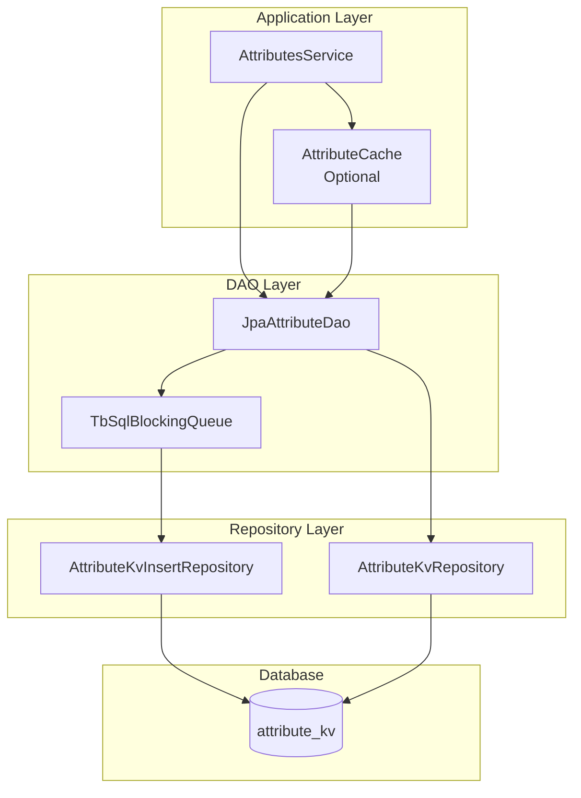

### Service Layer Architecture

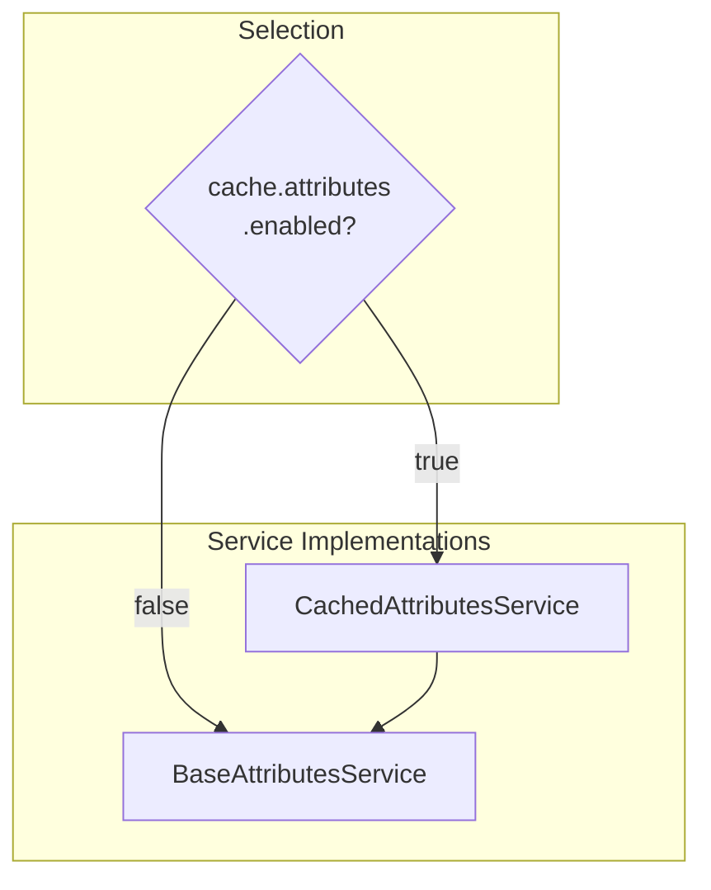

## Attribute Scopes

### Three-Scope Model

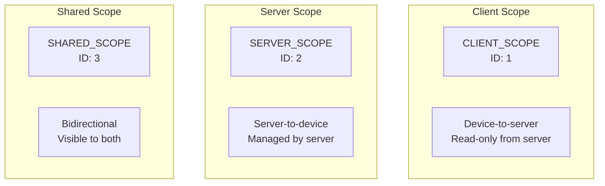

### Scope Details

| Scope | ID | Write Source | Read Access | Use Case |
|-------|-----|--------------|-------------|----------|
| CLIENT | 1 | Device | Server | Device status, capabilities |
| SERVER | 2 | Server | Device, Server | Configuration, commands |
| SHARED | 3 | Both | Both | Shared state, settings |

### Scope in Database

Scope is stored as integer ID in `attribute_type` column:

```sql
SELECT * FROM attribute_kv
WHERE entity_id = ?
  AND attribute_type = 2  -- SERVER_SCOPE
  AND attribute_key = ?
```

## Data Model

### attribute_kv Table Structure

| Column | Type | Description |
|--------|------|-------------|
| entity_id | uuid | Entity identifier |
| attribute_type | integer | Scope ID (1, 2, 3) |
| attribute_key | integer | Key ID from dictionary |
| bool_v | boolean | Boolean value |
| str_v | varchar | String value |
| long_v | bigint | Long value |
| dbl_v | double | Double value |
| json_v | varchar | JSON value |
| last_update_ts | bigint | Last update timestamp |
| version | bigint | Optimistic lock version |

**Primary Key**: (entity_id, attribute_type, attribute_key)

### AttributeKvEntity

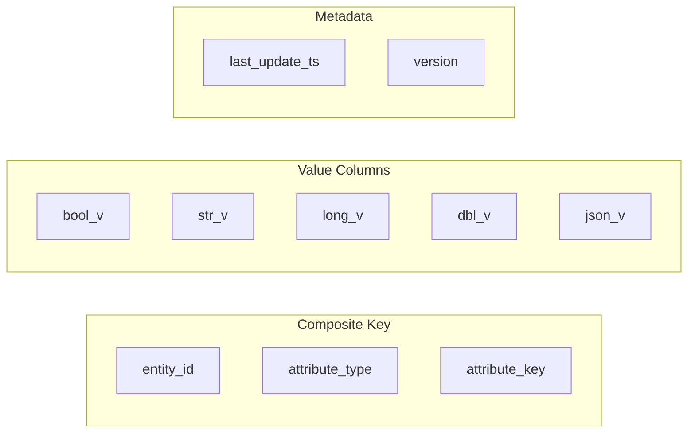

### Key Dictionary

String keys are stored as integer IDs via `KeyDictionaryDao`:

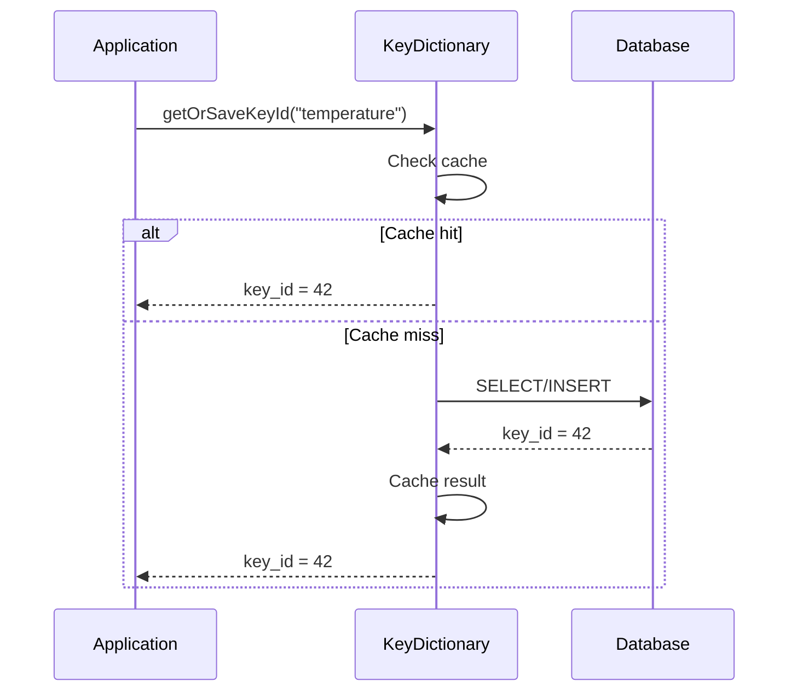

## Batch Processing

### Queue Architecture

```mermaid
graph TB
    subgraph "Write Path"
        WRITE[save(attributes)]
        QUEUE[TbSqlBlockingQueue]
        BATCH[Batch Processor]
        DB[(Database)]
    end

    WRITE --> QUEUE
    QUEUE --> BATCH
    BATCH --> DB
```

Write operations are queued for batch processing to reduce database round-trips and improve throughput.

**Reference**: `TbSqlBlockingQueue` implementation for queuing and `AttributeKvInsertRepository` for batch database operations

### Batch Configuration

| Property | Default | Description |
|----------|---------|-------------|
| `sql.attributes.batch_size` | 1000 | Max entries per batch |
| `sql.attributes.batch_max_delay` | 100 | Max wait before flush (ms) |
| `sql.attributes.batch_threads` | 4 | Parallel batch processors |
| `sql.batch_sort` | true | Sort before batch execution |

### Batch Processing Flow

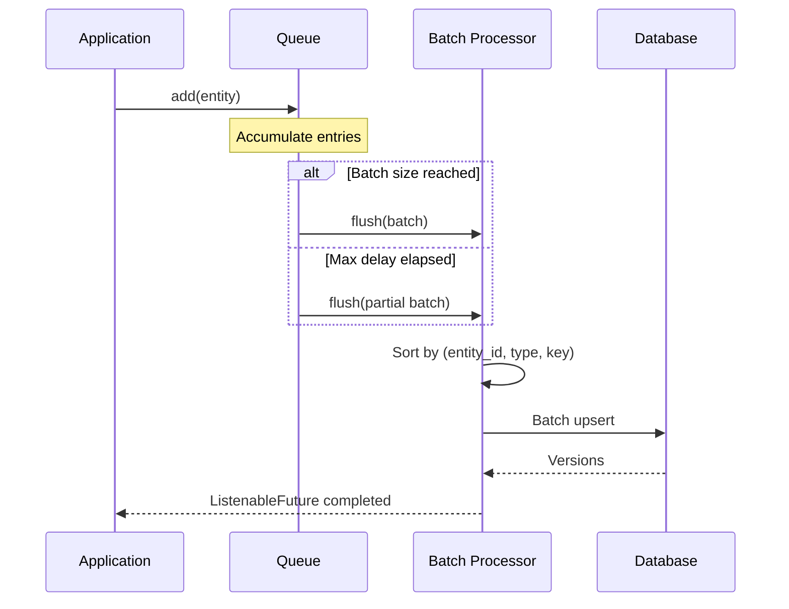

### Hash-Based Distribution

```
threadIndex = (entityId.hashCode() & 0x7FFFFFFF) % batchThreads

Ensures: All attributes for same entity go to same queue
Benefit: Maintains ordering per entity
```

### Batch Sorting

When `sql.batch_sort=true`:

```
Sort order: entity_id → attribute_type → attribute_key

Purpose: Prevents deadlocks in cluster deployments
         by ensuring consistent lock ordering
```

## Write Operations

### Upsert Pattern

```sql
INSERT INTO attribute_kv
  (entity_id, attribute_type, attribute_key, str_v, ..., last_update_ts)
VALUES (?, ?, ?, ?, ..., ?)
ON CONFLICT (entity_id, attribute_type, attribute_key)
DO UPDATE SET
  str_v = EXCLUDED.str_v,
  ...
  last_update_ts = EXCLUDED.last_update_ts,
  version = nextval('attribute_kv_version_seq')
RETURNING version
```

### Version Sequence

```sql
CREATE SEQUENCE attribute_kv_version_seq;

-- Incremented on every INSERT or UPDATE
version = nextval('attribute_kv_version_seq')
```

### Write Flow

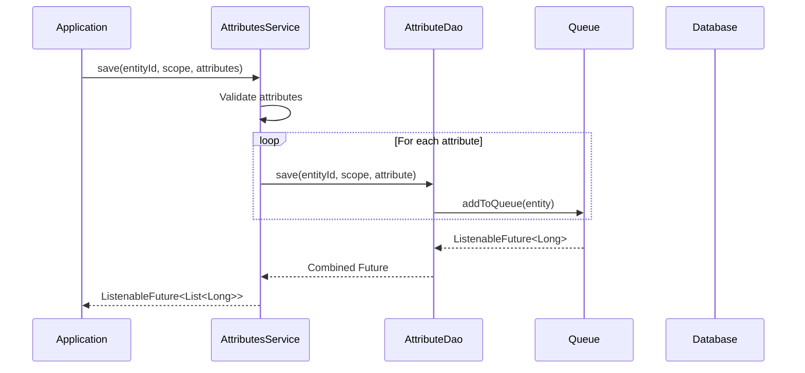

## Read Operations

### Query Methods

| Method | Description |
|--------|-------------|
| `find(entityId, scope, key)` | Single attribute |
| `find(entityId, scope, keys)` | Multiple attributes by key |
| `findAll(entityId, scope)` | All attributes in scope |
| `findNextBatch(...)` | Paginated batch retrieval |

### Batch Query Pagination

```sql
SELECT * FROM attribute_kv
WHERE (entity_id, attribute_type, attribute_key) > (?, ?, ?)
ORDER BY entity_id, attribute_type, attribute_key
LIMIT ?
```

Uses tuple ordering for efficient cursor-based pagination.

### Query Flow

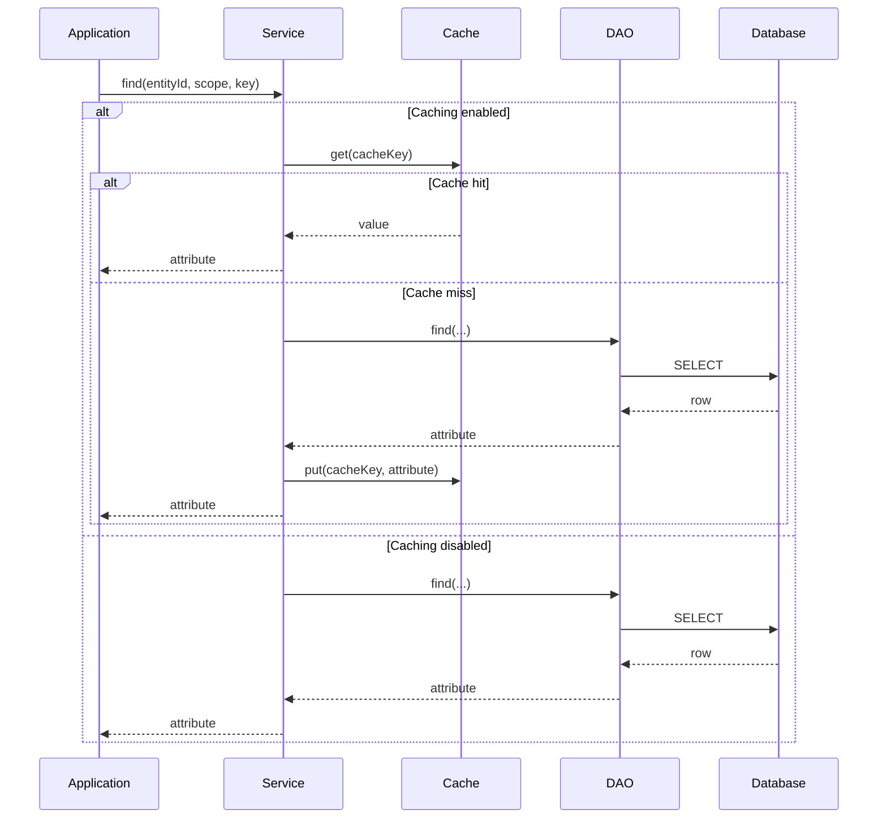

## Caching

### Cache Configuration

| Property | Default | Description |
|----------|---------|-------------|
| `cache.attributes.enabled` | false | Enable attribute caching |
| `cache.specs.attributes.timeToLiveInMinutes` | 1440 | Cache TTL |
| `cache.specs.attributes.maxSize` | 100000 | Max cached entries |

### Cache Key Structure

```
AttributeCacheKey {
    scope: AttributeScope
    entityId: EntityId
    attributeKey: String
}

isVersioned(): true
```

### Cache Implementations

| Type | Class | Use Case |
|------|-------|----------|
| Caffeine | AttributeCaffeineCache | Single node |
| Redis | AttributeRedisCache | Multi-node cluster |

### Versioned Cache

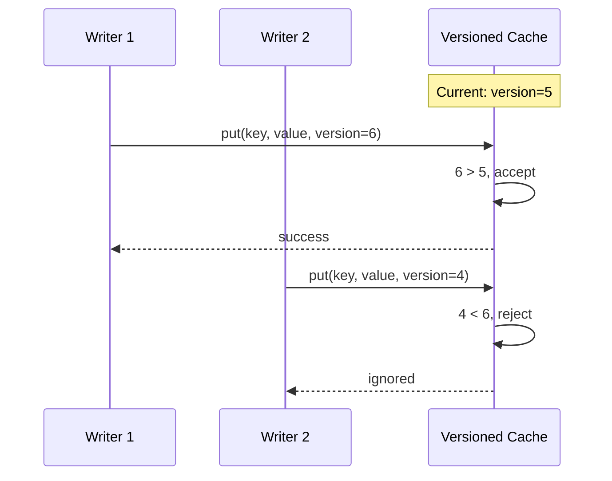

### Negative Caching

```mermaid
flowchart TD
    GET[get(key)] --> HIT{Cache Hit?}
    HIT -->|Yes| CHECK{Null marker?}
    CHECK -->|Yes| RETURN_NULL[Return null]
    CHECK -->|No| RETURN_VAL[Return value]
    HIT -->|No| DB[Query DB]
    DB --> FOUND{Found?}
    FOUND -->|Yes| CACHE_VAL[Cache value]
    FOUND -->|No| CACHE_NULL[Cache null marker]
    CACHE_VAL --> RETURN_VAL
    CACHE_NULL --> RETURN_NULL
```

**Purpose**: Prevents repeated DB queries for non-existent attributes.

### Cache Invalidation

```mermaid
graph LR
    UPDATE[Attribute Update] --> EVENT[AttributeCacheEvictEvent]
    EVENT --> EVICT[cache.evict(key, version)]
```

## Versioning

### Version Tracking

- Every attribute has a `version` field (Long)
- Version auto-incremented via PostgreSQL sequence
- Incremented on both INSERT and UPDATE operations

### Optimistic Locking

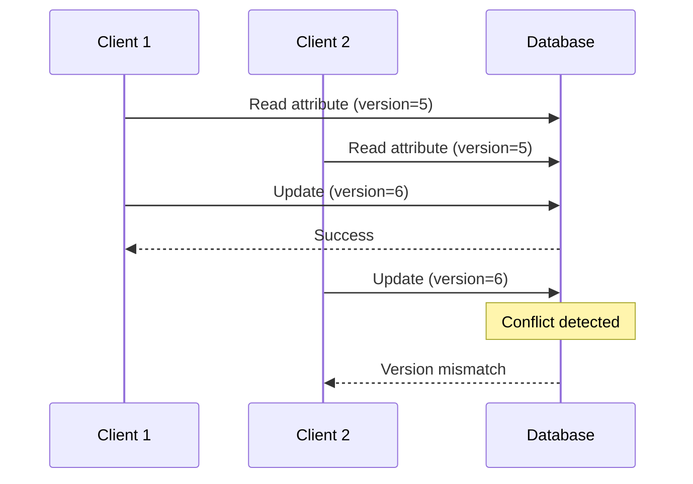

### EDQS Integration

After attribute changes, events are published for distributed tracking:

```
save() → edqsService.onUpdate(attribute, version)
delete() → edqsService.onDelete(entityId, version)
```

## Validation

### Input Validation Rules

| Field | Validation |
|-------|------------|
| Entity ID | Non-null |
| Scope | Valid scope enum |
| Key | Non-empty string |
| Value | Non-null data type |
| Timestamp | Positive value |

### XSS Validation

Optional XSS protection for string and JSON values:

```
Flag: valueNoXssValidation

When false: String/JSON values checked for XSS patterns
When true: Validation skipped (for trusted sources)
```

## Delete Operations

### Delete Methods

| Method | Description |
|--------|-------------|
| `removeAll(entityId, scope, keys)` | Remove specific attributes |
| `removeAll(entityId)` | Remove all attributes for entity |

### Delete Flow

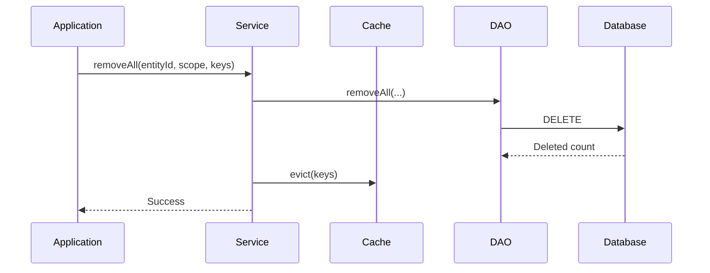

## Performance Optimization

### Key Optimizations

| Optimization | Description |
|--------------|-------------|
| Key Dictionary | Integer keys vs string comparison |
| Batch Processing | Queued writes reduce DB round-trips |
| Multi-threaded Batching | Parallel execution across threads |
| Composite Key Sorting | Prevents deadlocks in clusters |
| Two-tier Caching | Local + optional distributed cache |
| Negative Caching | Avoids repeated lookups for missing data |
| Async Futures | Non-blocking operations |

### Query Optimization

```sql
-- Efficient index usage with composite key
CREATE INDEX idx_attribute_kv ON attribute_kv
  (entity_id, attribute_type, attribute_key);
```

### Batch Size Tuning

| Scenario | Recommended batch_size |
|----------|------------------------|
| High write volume | 5000-10000 |
| Mixed workload | 1000 (default) |
| Low latency priority | 100-500 |

## Configuration Reference

### Complete Configuration

```yaml
sql:
  attributes:
    batch_size: "${SQL_ATTRIBUTES_BATCH_SIZE:1000}"
    batch_max_delay: "${SQL_ATTRIBUTES_BATCH_MAX_DELAY:100}"
    batch_threads: "${SQL_ATTRIBUTES_BATCH_THREADS:4}"
    stats_print_interval_ms: "${SQL_ATTRIBUTES_STATS_PRINT_MS:10000}"
  batch_sort: "${SQL_BATCH_SORT:true}"

cache:
  type: "${CACHE_TYPE:caffeine}"
  attributes:
    enabled: "${CACHE_ATTRIBUTES_ENABLED:false}"
  specs:
    attributes:
      timeToLiveInMinutes: "${CACHE_SPECS_ATTRIBUTES_TTL:1440}"
      maxSize: "${CACHE_SPECS_ATTRIBUTES_MAX_SIZE:100000}"
```

## Schema Reference

### Table DDL

```sql
CREATE TABLE attribute_kv (
    entity_id uuid NOT NULL,
    attribute_type integer NOT NULL,
    attribute_key integer NOT NULL,
    bool_v boolean,
    str_v varchar(10000000),
    long_v bigint,
    dbl_v double precision,
    json_v varchar,
    last_update_ts bigint NOT NULL,
    version bigint NOT NULL DEFAULT 0,
    CONSTRAINT attribute_kv_pkey
        PRIMARY KEY (entity_id, attribute_type, attribute_key)
);

CREATE SEQUENCE attribute_kv_version_seq;
```

## Troubleshooting

| Issue | Cause | Solution |
|-------|-------|----------|
| Slow writes | Batch size too small | Increase batch_size |
| Write latency spikes | Batch delay too long | Decrease batch_max_delay |
| Cache misses | TTL too short | Increase TTL |
| Version conflicts | Concurrent updates | Normal behavior, retry |
| Memory pressure | Cache too large | Reduce maxSize |

## See Also

- [Database Schema](./database-schema.md) - Full schema reference
- [Caching](./caching.md) - Cache configuration details
- [Attributes Data Model](../02-core-concepts/data-model/attributes.md) - Conceptual overview
