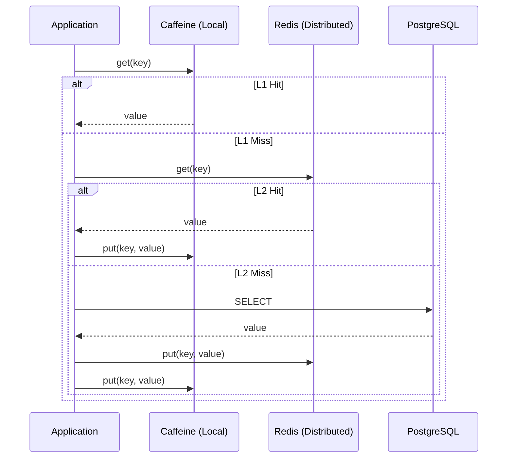
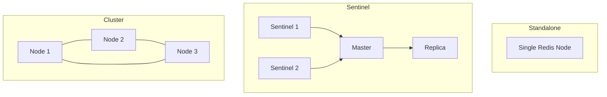
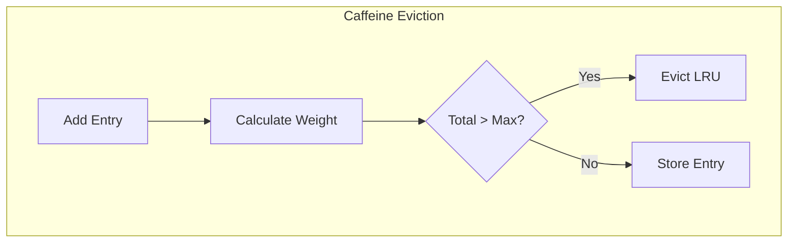
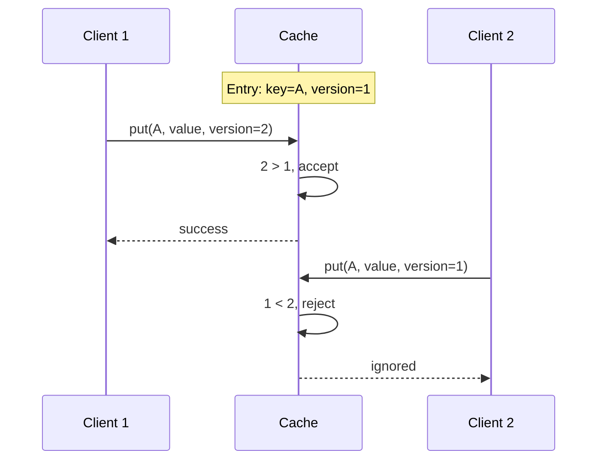
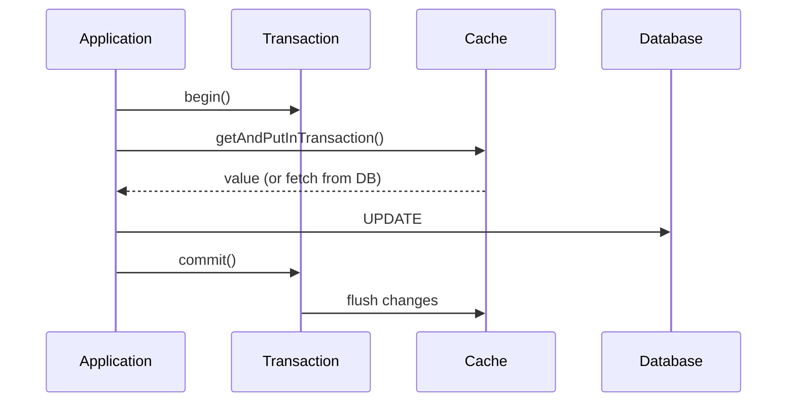
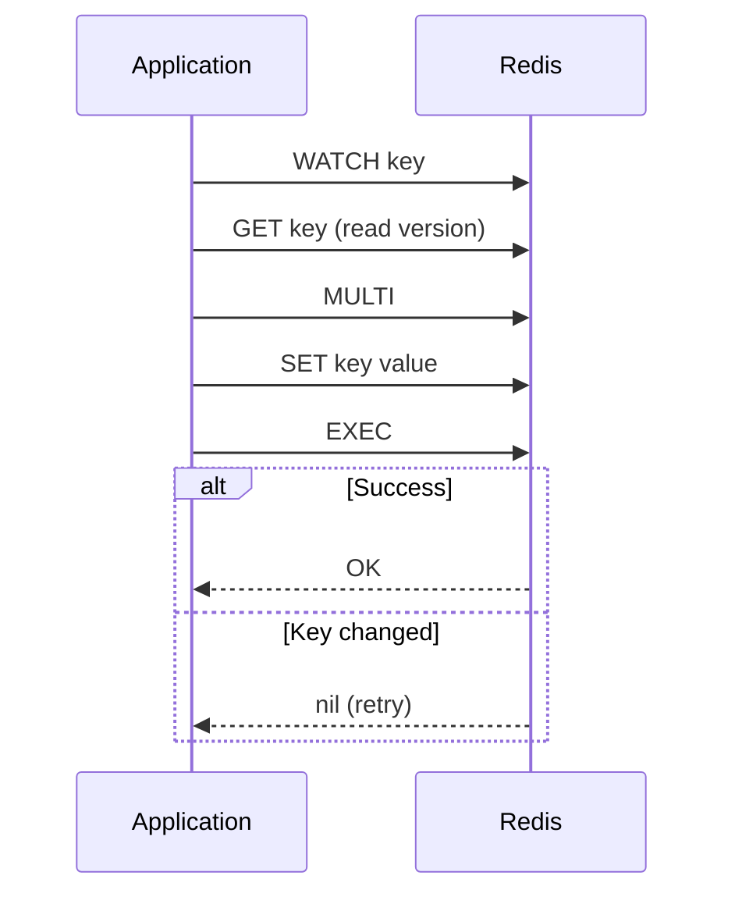
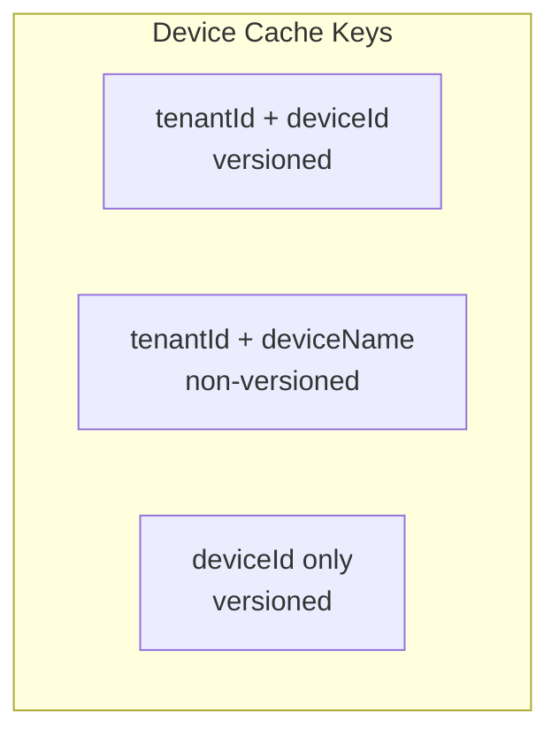
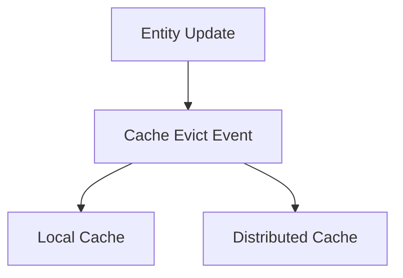
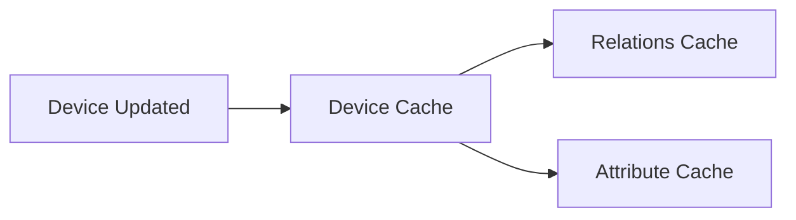

# Caching Architecture

## Overview

ThingsBoard implements a flexible two-tier caching architecture with support for local in-memory caching (Caffeine) and distributed caching (Redis/Valkey). The caching layer sits between the application and database, providing fast access to frequently-used data while maintaining consistency through versioning and transactional support.

## Key Behaviors

1. **Pluggable Cache Backends**: Switch between Caffeine (local) and Redis (distributed) without code changes.

2. **Versioned Caching**: Optimistic concurrency control prevents stale data overwrites.

3. **Transactional Support**: Cache operations participate in application transactions.

4. **Entity-Specific Caches**: Dedicated caches with tailored configurations for different entity types.

5. **Negative Caching**: Caches null values to prevent repeated database lookups for non-existent data.

## Architecture

### Cache-Aside Pattern



### Cache Type Selection

| Configuration | Cache Type | Use Case |
|---------------|------------|----------|
| `cache.type=caffeine` | In-memory | Single-node deployments |
| `cache.type=redis` | Distributed | Multi-node clusters |

## Redis Configuration

### Connection Topologies



### Standalone Configuration

```yaml
redis:
  connection:
    type: standalone
  standalone:
    host: "${REDIS_HOST:localhost}"
    port: "${REDIS_PORT:6379}"
    useDefaultClientConfig: true
    usePoolConfig: false
  db: 0
```

| Property | Default | Description |
|----------|---------|-------------|
| `redis.standalone.host` | localhost | Redis host |
| `redis.standalone.port` | 6379 | Redis port |
| `redis.standalone.usePoolConfig` | false | Enable connection pooling |
| `redis.db` | 0 | Database index |

### Sentinel Configuration

```yaml
redis:
  connection:
    type: sentinel
  sentinel:
    master: "${REDIS_MASTER:mymaster}"
    sentinels: "${REDIS_SENTINELS:localhost:26379}"
    password: "${REDIS_SENTINEL_PASSWORD:}"
```

| Property | Default | Description |
|----------|---------|-------------|
| `redis.sentinel.master` | mymaster | Master node name |
| `redis.sentinel.sentinels` | - | Sentinel nodes (host:port,host:port) |
| `redis.sentinel.password` | - | Sentinel password |

### Cluster Configuration

```yaml
redis:
  connection:
    type: cluster
  cluster:
    nodes: "${REDIS_NODES:localhost:7000,localhost:7001,localhost:7002}"
    max-redirects: 12
```

| Property | Default | Description |
|----------|---------|-------------|
| `redis.cluster.nodes` | - | Cluster nodes (comma-separated) |
| `redis.cluster.max-redirects` | 12 | Max cluster redirects |

### Connection Pool Configuration

```yaml
redis:
  pool_config:
    maxTotal: 128
    maxIdle: 128
    minIdle: 16
    testWhileIdle: true
    minEvictableMs: 60000
    evictionRunsMs: 30000
    blockWhenExhausted: true
```

| Property | Default | Description |
|----------|---------|-------------|
| `redis.pool_config.maxTotal` | 128 | Max connections |
| `redis.pool_config.maxIdle` | 128 | Max idle connections |
| `redis.pool_config.minIdle` | 16 | Min idle connections |
| `redis.pool_config.testWhileIdle` | true | Validate idle connections |
| `redis.pool_config.evictionRunsMs` | 30000 | Eviction check interval |

### SSL Configuration

```yaml
redis:
  ssl:
    enabled: true
    credentials:
      certFile: "/path/to/cert.pem"
      keyFile: "/path/to/key.pem"
      keyPassword: ""
    truststore:
      certFile: "/path/to/ca.pem"
```

## Caffeine Configuration

### Basic Setup

```yaml
cache:
  type: caffeine
  maximumPoolSize: 16
```

### Eviction Strategy



### Weight-Based Eviction

| Entry Type | Weight |
|------------|--------|
| Collection | collection.size() |
| Non-collection | 1 |

### Cache Specifications

Each named cache has its own TTL and size configuration:

```yaml
cache:
  specs:
    devices:
      timeToLiveInMinutes: 1440
      maxSize: 10000
    attributes:
      timeToLiveInMinutes: 1440
      maxSize: 100000
    relations:
      timeToLiveInMinutes: 1440
      maxSize: 10000
    tsLatest:
      timeToLiveInMinutes: 1440
      maxSize: 100000
```

## Versioned Caching

### Version-Based Concurrency



### Versioned Cache Key

```
Interface: VersionedCacheKey
  - isVersioned(): boolean

Implementations:
  - DeviceCacheKey (versioned)
  - TsLatestCacheKey (versioned)
  - AttributeCacheKey (versioned)
```

### Versioned Value Storage

**Redis Implementation:**
```
Byte Layout:
[0-7]  : 64-bit big-endian version number
[8-N]  : Serialized value data
```

**Caffeine Implementation:**
```
Storage: TbPair<Long, V> (version, value)
```

### Version Comparison

| New Version | Current Version | Action |
|-------------|-----------------|--------|
| > current | - | Accept update |
| <= current | - | Reject (keep current) |
| - | none | Accept (first write) |

## Transactional Caching

### Transaction Flow



### Redis Transactions

Uses Redis WATCH/MULTI/EXEC pattern:



### Caffeine Transactions

Uses local locking with UUID-based conflict detection:

```
Transaction Map: Map<CacheKey, UUID>
- Each transaction gets unique UUID
- Conflict detection on overlapping keys
- Lock-protected operations
```

### Eviction TTL

For transaction support, eviction uses short TTL:

| Property | Default | Description |
|----------|---------|-------------|
| `redis.evictTtlInMs` | 60000 | Eviction marker TTL |

## Entity-Specific Caches

### Configured Caches

| Cache Name | TTL (min) | Max Size | Versioned |
|------------|-----------|----------|-----------|
| devices | 1440 | 10000 | Yes |
| deviceCredentials | 1440 | 10000 | No |
| users | 1440 | 10000 | No |
| customers | 1440 | 10000 | No |
| edges | 1440 | 1000 | No |
| attributes | 1440 | 100000 | Yes |
| relations | 1440 | 10000 | No |
| tsLatest | 1440 | 100000 | Yes |
| tenantProfiles | 1440 | 1000 | No |
| deviceProfiles | 1440 | 10000 | No |
| assetProfiles | 1440 | 10000 | No |
| otaPackages | 60 | 10 | No |

### Device Cache



**Serialization**: Protocol Buffers

### Time-Series Latest Cache

```
Key: TsLatestCacheKey(entityId, key)
Value: TsKvEntry (timestamp, value, version)
Serialization: Protocol Buffers
```

### Attribute Cache

```
Key: AttributeCacheKey(scope, entityId, key)
Value: AttributeKvEntry
Serialization: JSON
```

## Serialization Strategies

### JSON Serialization (Default)

```java
// TbJsonRedisSerializer
byte[] serialize(T value) {
    return JacksonUtil.writeValueAsBytes(value);
}

T deserialize(K key, byte[] bytes) {
    return JacksonUtil.fromBytes(bytes, clazz);
}
```

Used for: User, Customer, Edge, most entities

### Protocol Buffer Serialization

```java
// ProtoUtils for Device
byte[] serialize(Device device) {
    return ProtoUtils.toProto(device).toByteArray();
}

// KvProtoUtil for TsKvEntry
byte[] serialize(TsKvEntry entry) {
    return KvProtoUtil.toTsKvProto(entry).toByteArray();
}
```

Used for: Device, Time-series entries

### Benefits Comparison

| Aspect | JSON | Protocol Buffers |
|--------|------|------------------|
| Size | Larger | Compact |
| Speed | Slower | Faster |
| Schema Evolution | Flexible | Requires care |
| Human Readable | Yes | No |

## Cache Operations

### Basic Operations

| Operation | Description |
|-----------|-------------|
| `get(key)` | Retrieve value (returns wrapper) |
| `put(key, value)` | Store value |
| `putIfAbsent(key, value)` | Store only if missing |
| `evict(key)` | Remove entry |
| `evict(key, version)` | Version-aware removal |

### Cache-Aside Helper

```java
// getOrFetchFromDB pattern
V value = cache.get(key);
if (value == null) {
    value = dbFetcher.apply(key);
    cache.put(key, value);
}
return value;
```

### Null Value Handling

```mermaid
flowchart TD
    GET[get(key)] --> CHECK{Value in Cache?}
    CHECK -->|Yes| RETURN[Return value]
    CHECK -->|No| DB[Query DB]
    DB --> FOUND{Found?}
    FOUND -->|Yes| STORE[Cache value]
    FOUND -->|No| NULL[Cache null marker]
    STORE --> RET1[Return value]
    NULL --> RET2[Return null]
```

**Purpose**: Prevents repeated DB queries for non-existent data

## Cache Invalidation

### Event-Driven Invalidation



### Common Events

| Event | Trigger |
|-------|---------|
| DeviceCacheEvictEvent | Device created/updated/deleted |
| UserCacheEvictEvent | User modified |
| CustomerCacheEvictEvent | Customer modified |
| AttributeCacheEvictEvent | Attribute changed |

### Cascading Invalidation

Some cache evictions trigger related invalidations:



## Performance Monitoring

### Statistics Tracking

| Metric | Description |
|--------|-------------|
| Cache hits | Successful cache lookups |
| Cache misses | DB fallback required |
| Hit rate | hits / (hits + misses) |
| Evictions | Entries removed |
| Load time | DB fetch duration |

### Enable Statistics

```yaml
cache:
  specs:
    <cache-name>:
      recordStats: true
```

### Monitoring Points

- Hit rate per cache
- Average load time
- Eviction rate
- Memory usage (Caffeine)
- Connection pool utilization (Redis)

## Configuration Reference

### Complete Configuration

```yaml
cache:
  type: "${CACHE_TYPE:caffeine}"
  maximumPoolSize: "${CACHE_MAXIMUM_POOL_SIZE:16}"

  attributes:
    enabled: "${CACHE_ATTRIBUTES_ENABLED:false}"

  specs:
    devices:
      timeToLiveInMinutes: "${CACHE_SPECS_DEVICES_TTL:1440}"
      maxSize: "${CACHE_SPECS_DEVICES_MAX_SIZE:10000}"

    attributes:
      timeToLiveInMinutes: "${CACHE_SPECS_ATTRIBUTES_TTL:1440}"
      maxSize: "${CACHE_SPECS_ATTRIBUTES_MAX_SIZE:100000}"

    tsLatest:
      timeToLiveInMinutes: "${CACHE_SPECS_TS_LATEST_TTL:1440}"
      maxSize: "${CACHE_SPECS_TS_LATEST_MAX_SIZE:100000}"

redis:
  connection:
    type: "${REDIS_CONNECTION_TYPE:standalone}"
  standalone:
    host: "${REDIS_HOST:localhost}"
    port: "${REDIS_PORT:6379}"
  evictTtlInMs: "${REDIS_EVICT_TTL_MS:60000}"
  pool_config:
    maxTotal: "${REDIS_POOL_MAX_TOTAL:128}"
    maxIdle: "${REDIS_POOL_MAX_IDLE:128}"
    minIdle: "${REDIS_POOL_MIN_IDLE:16}"
```

## Best Practices

### Cache Selection

| Scenario | Recommended |
|----------|-------------|
| Single node | Caffeine |
| Multi-node cluster | Redis |
| High availability | Redis Sentinel |
| Large scale | Redis Cluster |

### TTL Configuration

| Data Type | Recommended TTL |
|-----------|-----------------|
| Frequently changing | 5-60 minutes |
| Semi-static | 24 hours (1440 min) |
| Static configuration | Longer or no expiration |

### Size Configuration

```
MaxSize = (Expected unique entities) * 1.2

Example:
  10,000 devices expected
  maxSize = 12,000
```

### Memory Considerations

| Cache Type | Memory Impact |
|------------|---------------|
| Caffeine | JVM heap |
| Redis | Separate process |

For Caffeine, ensure JVM heap accommodates cache sizes.

## Troubleshooting

| Issue | Cause | Solution |
|-------|-------|----------|
| Low hit rate | TTL too short | Increase TTL |
| Memory pressure | Size too large | Reduce maxSize |
| Stale data | Missed invalidation | Check event propagation |
| Redis timeout | Connection pool exhausted | Increase pool size |
| Version conflicts | Concurrent updates | Normal behavior, retry |

## See Also

- [Database Schema](./database-schema.md) - Schema overview
- [Time-Series Storage](./timeseries-storage.md) - Time-series caching
- [Attribute Storage](./attribute-storage.md) - Attribute caching
