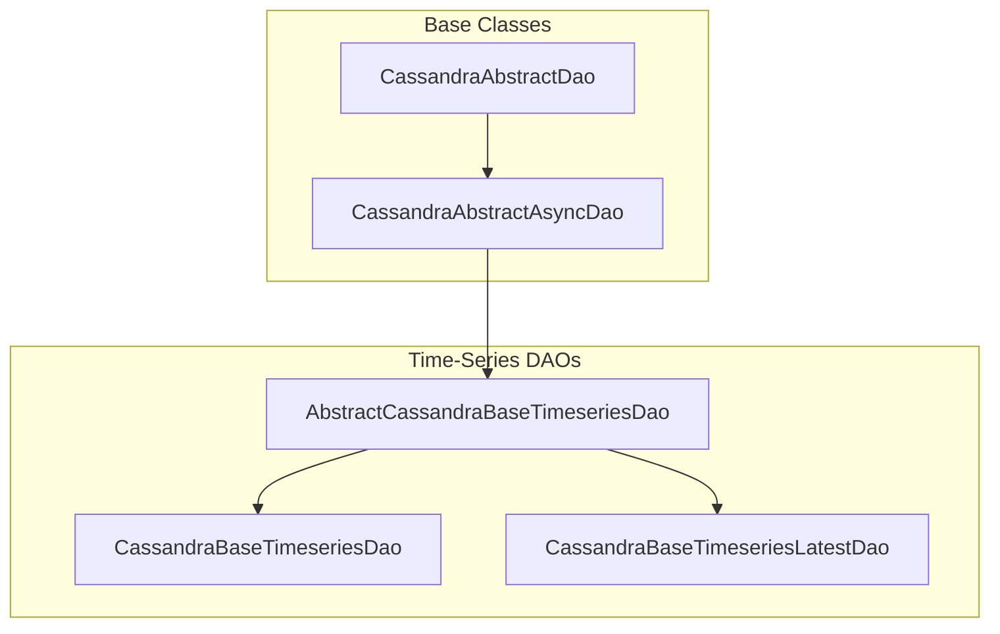
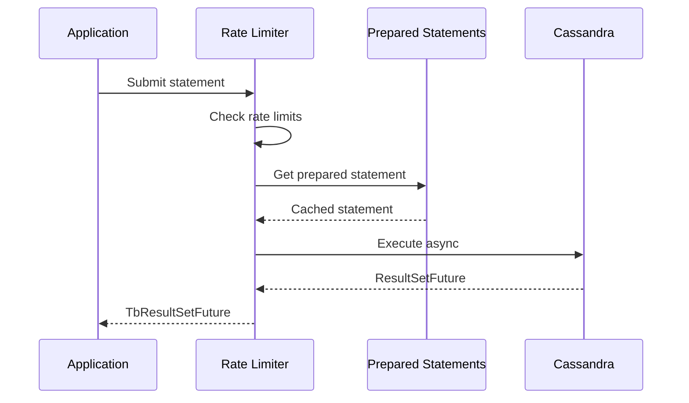
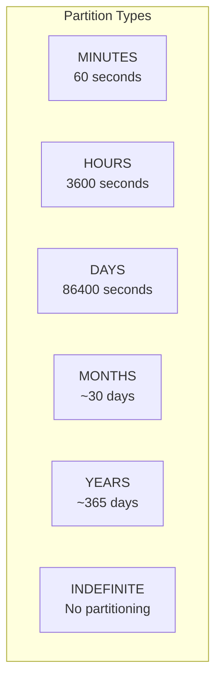
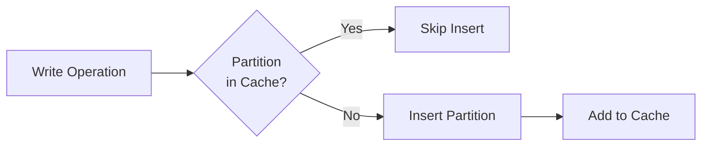
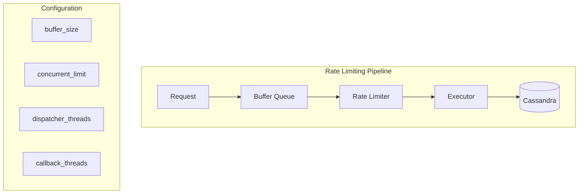
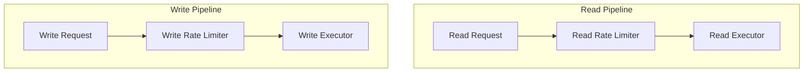
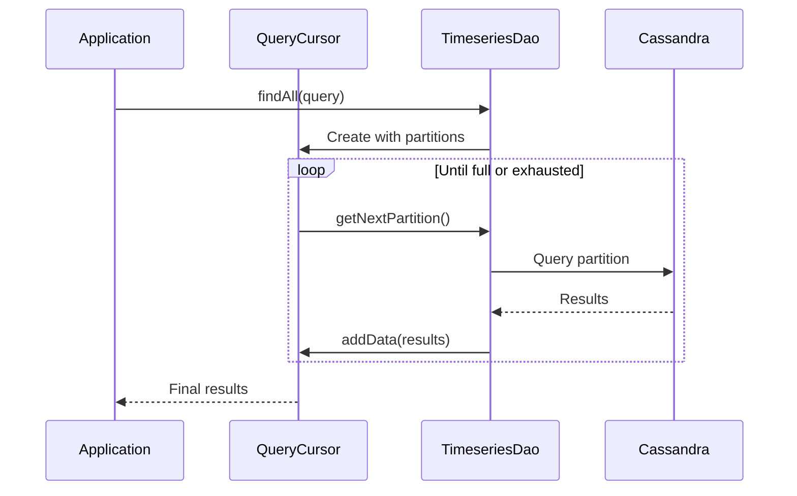
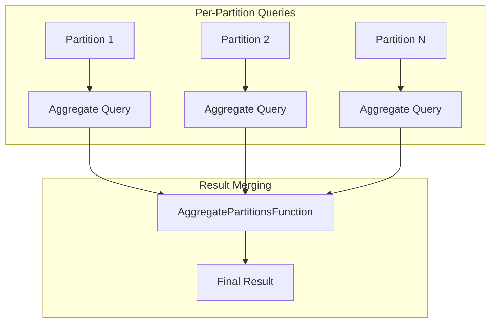
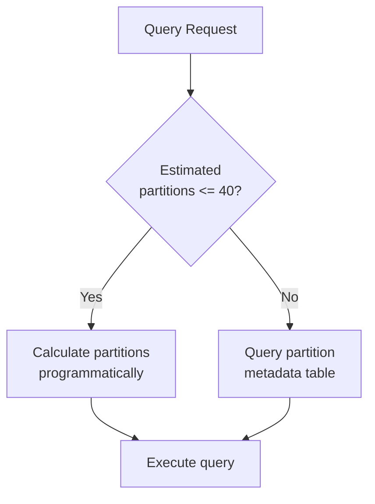

# Cassandra Storage

## Overview

Apache Cassandra provides a horizontally scalable storage backend for ThingsBoard time-series data in high-throughput deployments. The platform uses Cassandra's native features for time-based partitioning, TTL (Time-To-Live), and distributed data storage. This document covers Cassandra-specific configuration, connection pooling, rate limiting, and query patterns.

## Key Behaviors

1. **Native TTL**: Cassandra handles data expiration automatically using native TTL support.

2. **Partition-Based Distribution**: Data is distributed across partitions using entity ID and time-based partition keys.

3. **Rate-Limited Execution**: Read and write operations are rate-limited to prevent cluster overload.

4. **Cursor-Based Queries**: Large result sets are fetched partition-by-partition using cursors.

5. **Prepared Statement Caching**: All queries use cached prepared statements for optimal performance.

## Architecture

### Storage Layer Architecture

The Cassandra storage implementation uses a layered architecture for scalability and performance:



| Layer | Responsibility |
|-------|----------------|
| Base Layer | Session management, query templates, rate limiting |
| Async Layer | Non-blocking operations, result futures |
| Time-Series Base | Row-to-entry conversion for all data types |
| Historical Storage | Time-series data with partitioning |
| Latest Storage | Current value optimization |

**Reference Implementation**: See `CassandraAbstractDao` hierarchy in source code.

The architecture provides:
- **Session management**: Connection pooling and prepared statement caching
- **Rate limiting**: Tenant-aware request throttling
- **Async execution**: Non-blocking query processing
- **Type conversion**: Cassandra rows to platform data types

### Data Flow



## Connection Configuration

### Bootstrap Configuration

| Property | Default | Description |
|----------|---------|-------------|
| `cassandra.url` | Required | Contact points (comma-separated host:port) |
| `cassandra.cluster_name` | - | Session name identifier |
| `cassandra.keyspace_name` | Required | Target keyspace |
| `cassandra.local_datacenter` | datacenter1 | Local DC for load balancing |

```yaml
cassandra:
  url: "cassandra1:9042,cassandra2:9042,cassandra3:9042"
  cluster_name: "thingsboard-cluster"
  keyspace_name: "thingsboard"
  local_datacenter: "datacenter1"
```

### Socket Configuration

| Property | Default | Description |
|----------|---------|-------------|
| `cassandra.socket.connect_timeout` | - | Connection timeout (ms) |
| `cassandra.socket.read_timeout` | - | Read request timeout (ms) |
| `cassandra.socket.keep_alive` | - | TCP keep-alive |
| `cassandra.socket.tcp_no_delay` | - | Disable Nagle's algorithm |
| `cassandra.socket.receive_buffer_size` | - | Socket receive buffer |
| `cassandra.socket.send_buffer_size` | - | Socket send buffer |

### Connection Pooling

| Property | Default | Description |
|----------|---------|-------------|
| `cassandra.max_requests_per_connection_local` | 32768 | Max requests per local connection |
| `cassandra.max_requests_per_connection_remote` | 32768 | Max requests per remote connection |

### Security Configuration

```yaml
cassandra:
  ssl:
    enabled: true
    # Keystore and truststore configuration
  credentials: true
  compression: "lz4"  # or "snappy"
```

| Property | Default | Description |
|----------|---------|-------------|
| `cassandra.ssl.enabled` | false | Enable TLS |
| `cassandra.credentials` | false | Enable authentication |
| `cassandra.compression` | - | Protocol compression (lz4, snappy) |

### Reconnection Policy

| Property | Default | Description |
|----------|---------|-------------|
| `cassandra.init_retry_interval_ms` | - | Base reconnection delay |
| `cassandra.init_timeout_ms` | - | Max reconnection delay |

## Partition Strategy

### Time-Based Partitioning

Data is partitioned by time intervals controlled by the `cassandra.query.ts_key_value_partitioning` property.



| Partition Type | Pattern | Duration | Use Case |
|----------------|---------|----------|----------|
| MINUTES | yyyy-MM-dd-HH-mm | 60 seconds | High-frequency, short retention |
| HOURS | yyyy-MM-dd-HH | 3600 seconds | Medium-frequency data |
| DAYS | yyyy-MM-dd | 86400 seconds | Standard daily partitioning |
| MONTHS | yyyy-MM | ~30 days | Long-term historical data |
| YEARS | yyyy | ~365 days | Archive/compliance data |
| INDEFINITE | - | Forever | Single partition |

### Partition Calculation

```
partitionTs = truncate(timestamp, partitionType)

Example (MONTHS):
  timestamp: 2024-01-15 14:30:00
  partitionTs: 2024-01-01 00:00:00
```

### Partition Metadata Table

A companion table tracks existing partitions for query optimization:

| Column | Type | Description |
|--------|------|-------------|
| entity_type | text | Entity type |
| entity_id | uuid | Entity identifier |
| partition | bigint | Partition timestamp |
| key | text | Time-series key |

### Partition Cache



| Property | Default | Description |
|----------|---------|-------------|
| `cassandra.query.ts_key_value_partitions_max_cache_size` | 100000 | Max cached partitions |

## Rate Limiting

### Architecture



### Rate Limiter Configuration

| Property | Default | Description |
|----------|---------|-------------|
| `cassandra.query.buffer_size` | - | Max queued statements |
| `cassandra.query.concurrent_limit` | - | Max concurrent statements |
| `cassandra.query.permit_max_wait_time` | - | Wait timeout before rejection |
| `cassandra.query.dispatcher_threads` | 2 | Thread pool for dispatching |
| `cassandra.query.callback_threads` | 4 | Thread pool for callbacks |
| `cassandra.query.poll_ms` | 50 | Queue polling interval |

### Separate Read/Write Pipelines



The system uses separate executors for read and write operations to optimize throughput and apply different rate limiting policies:

- **Read Pipeline**: Dedicated executor for query operations with read-specific rate limits
- **Write Pipeline**: Dedicated executor for insert/update operations with write-specific rate limits
- **Tenant-aware**: Rate limiting enforced per-tenant with configurable quotas

**Reference**: `CassandraBufferedRateReadExecutor` and `CassandraBufferedRateWriteExecutor` implementations

## TTL Configuration

### System TTL

| Property | Default | Description |
|----------|---------|-------------|
| `cassandra.query.ts_key_value_ttl` | 0 | System TTL in seconds (0 = disabled) |

### TTL Logic

```mermaid
flowchart TD
    SAVE[Save Data] --> CHECK{systemTtl > 0?}
    CHECK -->|No| NOTTL[No TTL Applied]
    CHECK -->|Yes| MERGE{customTtl > 0?}
    MERGE -->|No| SYSTTL[Use systemTtl]
    MERGE -->|Yes| MIN[Use min(systemTtl, customTtl)]
```

### TTL Query Variants

For each data type, two prepared statements exist:

```sql
-- Without TTL
INSERT INTO ts_kv (entity_type, entity_id, key, partition, ts, <value_column>)
VALUES (?, ?, ?, ?, ?, ?)

-- With TTL
INSERT INTO ts_kv (entity_type, entity_id, key, partition, ts, <value_column>)
VALUES (?, ?, ?, ?, ?, ?) USING TTL ?
```

### Partition TTL Strategy

Partitions always use system TTL, never custom TTL:

```
Reason: Short TTL on partitions could cause premature removal
        while historical data still exists in that partition.
```

### No Manual Cleanup

```java
@Override
public void cleanup(long systemTtl) {
    // No-op: Cassandra handles TTL natively
}
```

## Query Patterns

### Cursor-Based Queries



### Query Cursor Implementation

```
QueryCursor {
    entityType: String
    entityId: UUID
    key: String
    startTs: long
    endTs: long
    partitions: List<Long>
    partitionIndex: int
}

TsKvQueryCursor extends QueryCursor {
    data: List<TsKvEntry>
    orderBy: "ASC" | "DESC"
    currentLimit: int
}
```

### Query Direction

| Order | Starting Position | Movement |
|-------|-------------------|----------|
| DESC | Last partition | Backwards |
| ASC | First partition | Forwards |

### Fetch Statement Structure

```sql
SELECT * FROM ts_kv
WHERE entity_type = ?
  AND entity_id = ?
  AND key = ?
  AND partition = ?
  AND ts >= ?
  AND ts < ?
ORDER BY ts DESC
LIMIT ?
```

## Data Types

### Value Columns

| Data Type | Column | Cassandra Type |
|-----------|--------|----------------|
| BOOLEAN | boolean_value | boolean |
| STRING | string_value | text |
| LONG | long_value | bigint |
| DOUBLE | double_value | double |
| JSON | json_value | text |

### Type Detection Order

```
String → Long → Double → Boolean → JSON → null
```

## Aggregation

### Supported Aggregations

| Type | Description |
|------|-------------|
| COUNT | Count of non-null values per type |
| SUM | Numeric sums |
| AVG | Average (computed as SUM/COUNT) |
| MIN | Minimum value |
| MAX | Maximum value |

### Multi-Partition Aggregation



### Aggregation Row Structure

| Position | Column | Description |
|----------|--------|-------------|
| 0 | long_cnt | Count of LONG values |
| 1 | double_cnt | Count of DOUBLE values |
| 2 | bool_cnt | Count of BOOLEAN values |
| 3 | str_cnt | Count of STRING values |
| 4 | json_cnt | Count of JSON values |
| 5 | max_ts | Latest timestamp |
| 6-10 | values | Aggregated values |

## Latest Values

### Table Structure

| Column | Type | Description |
|--------|------|-------------|
| entity_type | text | Entity type |
| entity_id | uuid | Entity identifier |
| key | text | Time-series key |
| ts | bigint | Timestamp of latest value |
| *_value | various | Value columns |

### Operations

| Operation | Description |
|-----------|-------------|
| Save | Overwrite latest value |
| Find | Single key lookup |
| FindAll | All keys for entity |
| Delete | Remove latest entry |
| DeleteWithRewrite | Delete and restore previous value |

## Prepared Statement Caching

### Statement Categories

| Category | Count | Description |
|----------|-------|-------------|
| Save statements | 10 | 5 types × 2 (with/without TTL) |
| Fetch statements | ~10 | Per aggregation × 2 (ASC/DESC) |
| Partition statements | 2 | Insert (with/without TTL) |
| Latest statements | 4 | Save, find, find all, delete |

### Thread-Safe Lazy Initialization

```
Double-checked locking pattern:
1. Check if statement array is null
2. Acquire lock
3. Check again (double-check)
4. Initialize all statements
5. Release lock
```

## Consistency Configuration

| Property | Default | Description |
|----------|---------|-------------|
| `cassandra.query.read_consistency_level` | ONE | Read consistency |
| `cassandra.query.write_consistency_level` | ONE | Write consistency |

### Consistency Levels

| Level | Description | Use Case |
|-------|-------------|----------|
| ONE | Single replica | Low latency |
| QUORUM | Majority replicas | Balanced |
| LOCAL_QUORUM | Local DC quorum | Multi-DC |
| ALL | All replicas | Maximum consistency |

## Query Configuration

| Property | Default | Description |
|----------|---------|-------------|
| `cassandra.query.default_fetch_size` | - | Page size for result sets |
| `cassandra.query.use_ts_key_value_partitioning_on_read` | true | Enable partition optimization |
| `cassandra.query.use_ts_key_value_partitioning_on_read_max_estimated_partition_count` | 40 | Threshold for estimated mode |
| `cassandra.query.set_null_values_enabled` | false | Allow explicit null storage |

### Partition Query Optimization



## Monitoring

### Statistics Properties

| Property | Default | Description |
|----------|---------|-------------|
| `cassandra.query.rate_limit_print_interval_ms` | - | Stats logging interval |
| `cassandra.query.print_queries_freq` | - | Query frequency logging |
| `cassandra.query.tenant_rate_limits.print_tenant_names` | - | Tenant-aware logging |

### Key Metrics

| Metric | Description |
|--------|-------------|
| Buffer queue depth | Pending statements |
| Concurrent requests | Active statements |
| Rate limit rejections | Throttled requests |
| Per-tenant usage | Tenant-specific metrics |

## Schema Reference

### ts_kv Table

```sql
CREATE TABLE ts_kv (
    entity_type text,
    entity_id uuid,
    key text,
    partition bigint,
    ts bigint,
    boolean_value boolean,
    string_value text,
    long_value bigint,
    double_value double,
    json_value text,
    PRIMARY KEY ((entity_type, entity_id, key, partition), ts)
) WITH CLUSTERING ORDER BY (ts DESC);
```

### ts_kv_latest Table

```sql
CREATE TABLE ts_kv_latest (
    entity_type text,
    entity_id uuid,
    key text,
    ts bigint,
    boolean_value boolean,
    string_value text,
    long_value bigint,
    double_value double,
    json_value text,
    PRIMARY KEY ((entity_type, entity_id), key)
);
```

### ts_kv_partitions Table

```sql
CREATE TABLE ts_kv_partitions (
    entity_type text,
    entity_id uuid,
    key text,
    partition bigint,
    PRIMARY KEY ((entity_type, entity_id, key), partition)
);
```

## Best Practices

### Partition Strategy Selection

| Data Volume | Update Frequency | Recommended |
|-------------|------------------|-------------|
| Very High | Per second | HOURS |
| High | Per minute | DAYS |
| Medium | Hourly | DAYS or MONTHS |
| Low | Daily | MONTHS or YEARS |

### Performance Tuning

1. **Match partitioning to query patterns**: Choose partition size to balance read/write performance
2. **Configure rate limits appropriately**: Start conservative, increase based on monitoring
3. **Monitor partition cache hit rate**: Size cache to minimize partition metadata lookups
4. **Use appropriate TTL**: Balance retention requirements with storage costs
5. **Consider consistency levels**: Lower consistency for better performance when acceptable

## Troubleshooting

| Issue | Cause | Solution |
|-------|-------|----------|
| Slow queries | Too many partitions | Use partition optimization |
| Rate limit rejections | Cluster overload | Increase concurrent_limit or add nodes |
| High latency | Network issues | Check local_datacenter config |
| Memory pressure | Large result sets | Use cursor-based queries with limits |

## See Also

- [Time-Series Storage](./timeseries-storage.md) - General time-series patterns
- [Database Schema](./database-schema.md) - Schema overview
- [Caching](./caching.md) - Cache layer configuration
