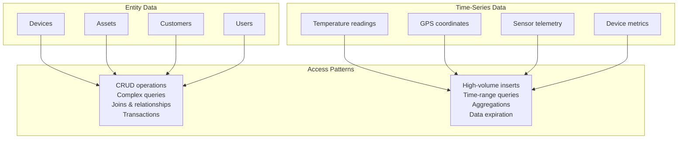
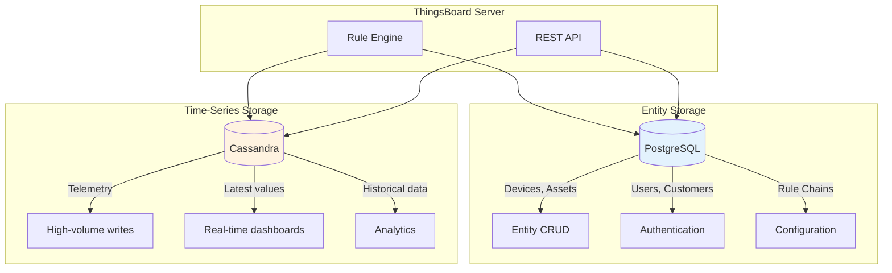
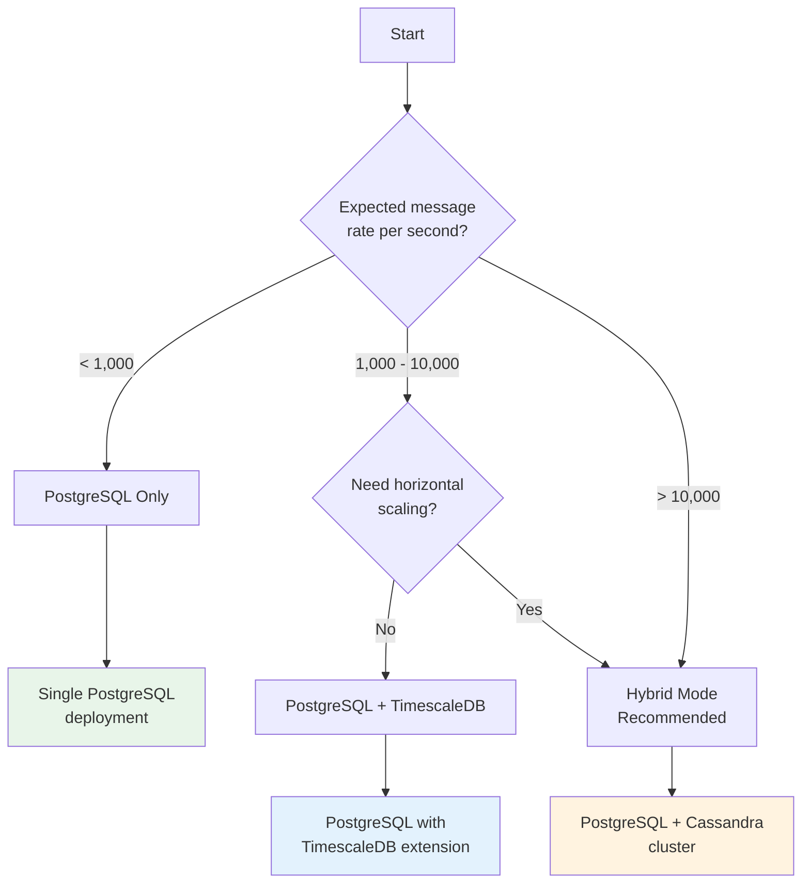
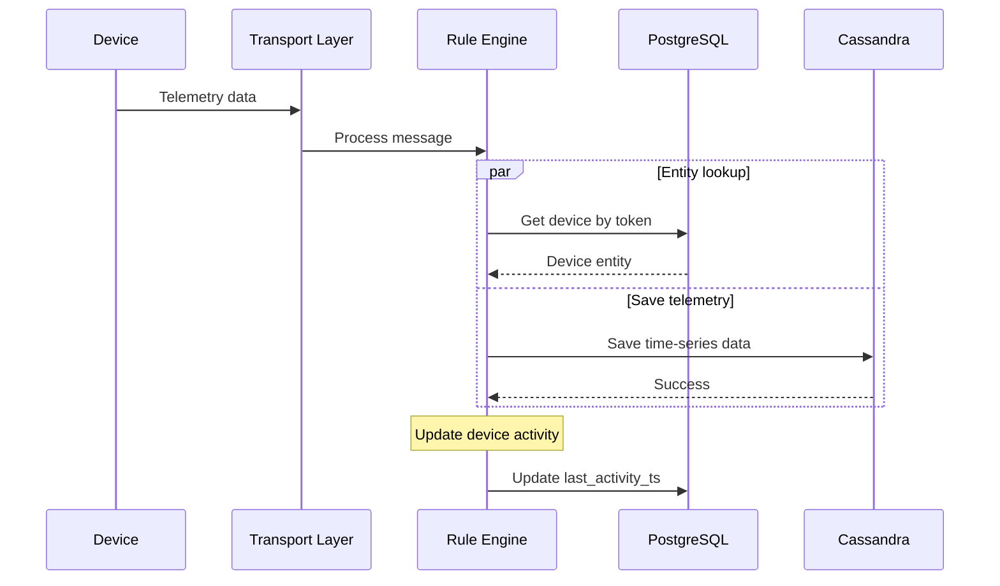
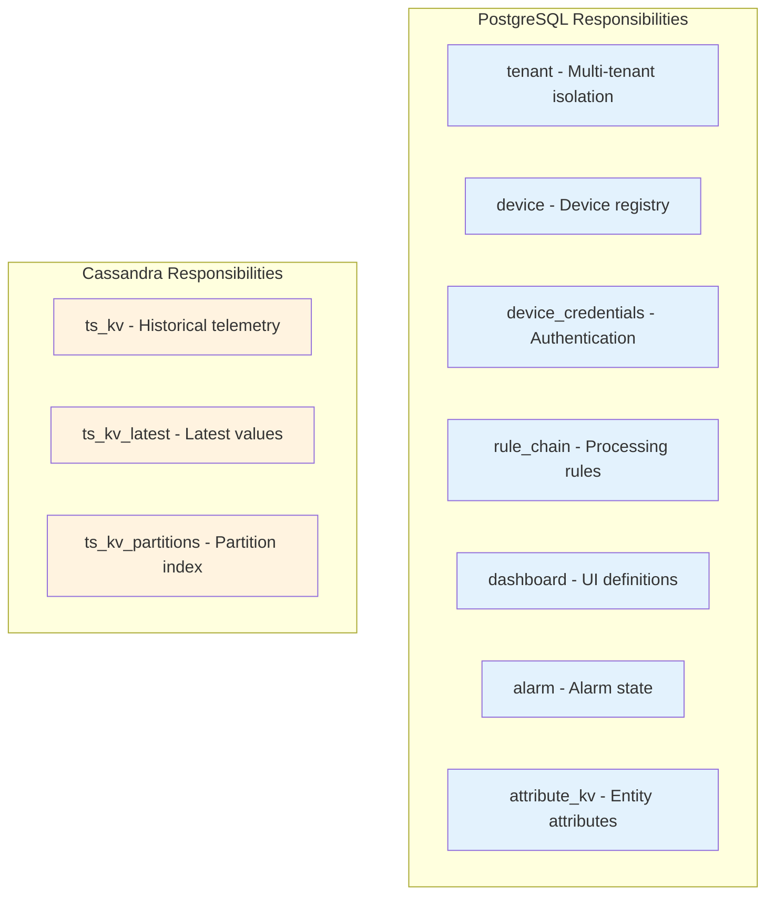
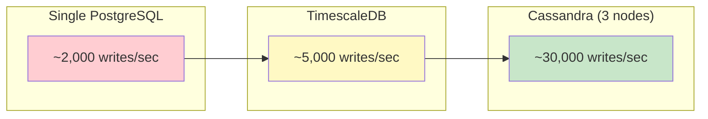
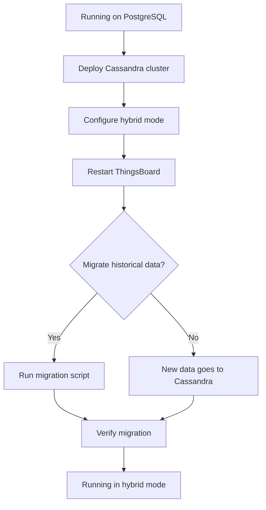
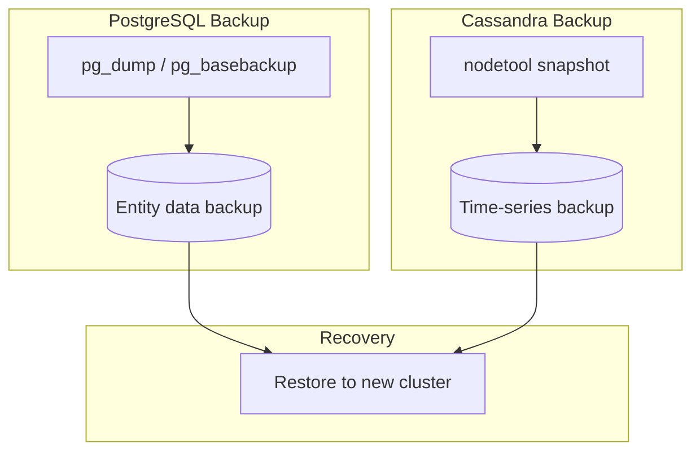
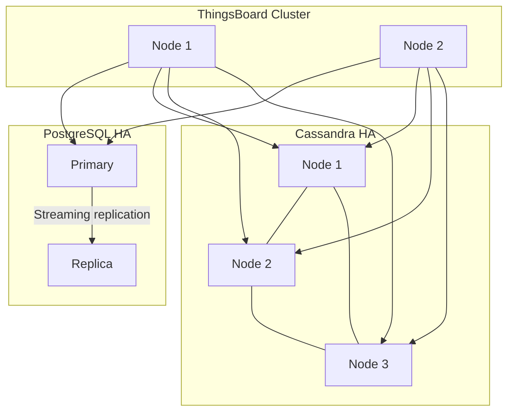

# Hybrid Storage Architecture

## Overview

ThingsBoard supports a hybrid storage architecture that separates **entity data** from **time-series data** into different database backends. This design allows you to optimize each storage type independently: PostgreSQL for relational entity data and Cassandra (or TimescaleDB) for high-volume time-series telemetry.

## Why Hybrid Storage?

### The Problem with Single-Database Deployments

In IoT applications, you have two fundamentally different data access patterns:



| Characteristic | Entity Data | Time-Series Data |
|----------------|-------------|------------------|
| Write pattern | Occasional updates | Constant streaming inserts |
| Read pattern | Random access, joins | Sequential time-range scans |
| Volume | Thousands to millions | Billions of data points |
| Schema | Complex relationships | Simple key-value-timestamp |
| Transactions | Required | Not needed |

### The Hybrid Solution



## When to Use Hybrid Storage

### Decision Guide



### Recommendations by Scale

| Scale | Devices | Messages/sec | Recommended Setup |
|-------|---------|--------------|-------------------|
| Small | < 1,000 | < 1,000 | PostgreSQL only |
| Medium | 1,000 - 10,000 | 1,000 - 5,000 | PostgreSQL + TimescaleDB |
| Large | 10,000 - 100,000 | 5,000 - 30,000 | PostgreSQL + Cassandra (3 nodes) |
| Enterprise | > 100,000 | > 30,000 | PostgreSQL + Cassandra cluster |

### Cost-Benefit Analysis

| Configuration | Pros | Cons |
|---------------|------|------|
| **PostgreSQL Only** | Simple setup, single backup, ACID transactions | Limited write throughput |
| **PostgreSQL + TimescaleDB** | Compression, automatic partitioning, SQL queries | Single node bottleneck |
| **PostgreSQL + Cassandra** | Unlimited horizontal scaling, high availability | More complex operations |

## Architecture Deep Dive

### Data Flow



### Storage Responsibilities



## Configuration

### Environment Variables

| Variable | Default | Description |
|----------|---------|-------------|
| `DATABASE_TS_TYPE` | `sql` | Time-series backend: `sql`, `timescale`, or `cassandra` |
| `DATABASE_TS_LATEST_TYPE` | `sql` | Latest values backend (can differ from ts.type) |
| `SPRING_DATASOURCE_URL` | - | PostgreSQL connection URL |
| `CASSANDRA_URL` | - | Cassandra contact points |

### PostgreSQL-Only Configuration

```yaml
# thingsboard.yml
database:
  ts:
    type: sql
  ts_latest:
    type: sql

spring:
  datasource:
    url: jdbc:postgresql://localhost:5432/thingsboard
    username: postgres
    password: postgres
```

### Hybrid Configuration (PostgreSQL + Cassandra)

```yaml
# thingsboard.yml
database:
  ts:
    type: cassandra
  ts_latest:
    type: cassandra

spring:
  datasource:
    url: jdbc:postgresql://localhost:5432/thingsboard
    username: postgres
    password: postgres

cassandra:
  url: "cassandra1:9042,cassandra2:9042,cassandra3:9042"
  keyspace_name: thingsboard
  local_datacenter: datacenter1
  query:
    ts_key_value_partitioning: MONTHS
```

### Split Configuration (Advanced)

You can use different backends for historical vs. latest values:

```yaml
# Historical in Cassandra, Latest in PostgreSQL
database:
  ts:
    type: cassandra      # High-volume historical writes
  ts_latest:
    type: sql            # Transactional latest values
```

This configuration is useful when:
- You need transactional consistency for latest values
- Dashboard queries primarily use latest values from PostgreSQL
- Historical data volume requires Cassandra's scale

## Performance Characteristics

### Write Performance



### Query Performance Comparison

| Query Type | PostgreSQL | TimescaleDB | Cassandra |
|------------|------------|-------------|-----------|
| Point lookup | Fast | Fast | Very fast |
| Time-range scan | Moderate | Fast (compression) | Very fast |
| Aggregations | Fast (SQL) | Fast (built-in) | Slower (multi-partition) |
| Complex joins | Supported | Supported | Not supported |
| Full-text search | Supported | Supported | Limited |

### Cassandra Performance Benchmarks

Based on ThingsBoard performance testing:

| Configuration | Devices | Messages/sec | Hardware |
|---------------|---------|--------------|----------|
| Single node + Cassandra | 10,000 | 10,000 | c4.2xlarge (8 vCPU) |
| Single node + 3-node Cassandra | 20,000 | 30,000 | c4.2xlarge + 3x c4.xlarge |

Key optimizations that enable this performance:
1. **Asynchronous writes**: Non-blocking Cassandra driver API
2. **Connection pooling**: 32,768 max requests per connection
3. **Batched inserts**: Grouped writes to reduce round trips

## Migration Strategies

### PostgreSQL to Hybrid



### Migration Steps

1. **Deploy Cassandra cluster** alongside existing PostgreSQL
2. **Update configuration** to use hybrid mode
3. **Restart ThingsBoard** - new telemetry writes go to Cassandra
4. **Optional**: Migrate historical data using export/import scripts
5. **Monitor** both databases during transition

### Data Migration Considerations

| Approach | Pros | Cons |
|----------|------|------|
| Fresh start | Simple, clean | Historical data lost |
| Parallel operation | No downtime | Temporary dual storage |
| Full migration | Complete history | Requires migration tooling |

## Operational Considerations

### Backup Strategy



### Monitoring Points

| Component | Key Metrics |
|-----------|-------------|
| PostgreSQL | Connection pool usage, query latency, disk usage |
| Cassandra | Write latency, compaction pending, SSTable count |
| ThingsBoard | Message processing rate, queue depth |

### High Availability



## Best Practices

### For Small Deployments

1. Start with **PostgreSQL only** - simpler to manage
2. Monitor write throughput and latency
3. Upgrade to hybrid when approaching limits

### For Large Deployments

1. Use **3+ Cassandra nodes** for redundancy
2. Configure **QUORUM consistency** for reliability
3. Implement **proper backup procedures** for both databases
4. Set up **monitoring and alerting** for both systems

### Common Mistakes to Avoid

| Mistake | Impact | Solution |
|---------|--------|----------|
| Single Cassandra node | No fault tolerance | Use minimum 3 nodes |
| Shared PostgreSQL for entities and telemetry | Bottleneck | Use hybrid mode |
| Missing TTL configuration | Unbounded storage growth | Set appropriate TTL |
| Insufficient connection pooling | Connection timeouts | Increase pool size |

## Troubleshooting

### Connection Issues

| Symptom | Cause | Solution |
|---------|-------|----------|
| Cassandra connection timeout | Network/firewall | Check connectivity, ports 9042 |
| PostgreSQL pool exhausted | High concurrent load | Increase max connections |
| Slow writes | Wrong data center | Set correct `local_datacenter` |

### Performance Issues

| Symptom | Cause | Solution |
|---------|-------|----------|
| High write latency | Cassandra compaction | Add nodes or tune compaction |
| Query timeouts | Large time ranges | Use appropriate partition strategy |
| Memory pressure | Cache misconfiguration | Tune cache sizes |

## See Also

- [Database Schema](./database-schema.md) - Complete schema reference
- [Time-Series Storage](./timeseries-storage.md) - Detailed time-series patterns
- [Cassandra Storage](./cassandra-storage.md) - Cassandra configuration
- [Caching](./caching.md) - Cache layer optimization
