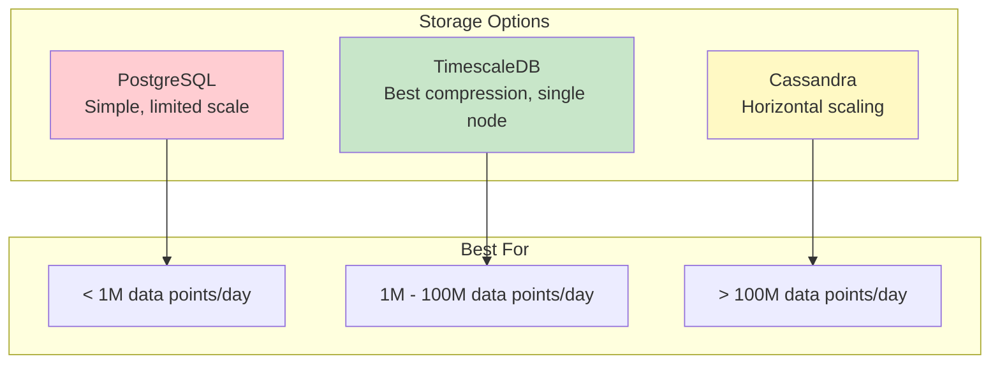
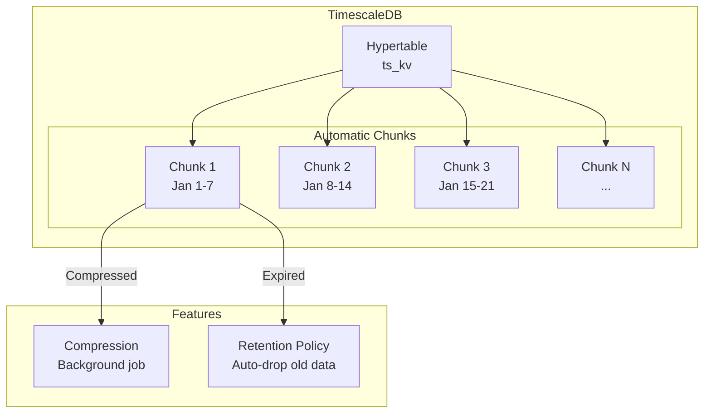
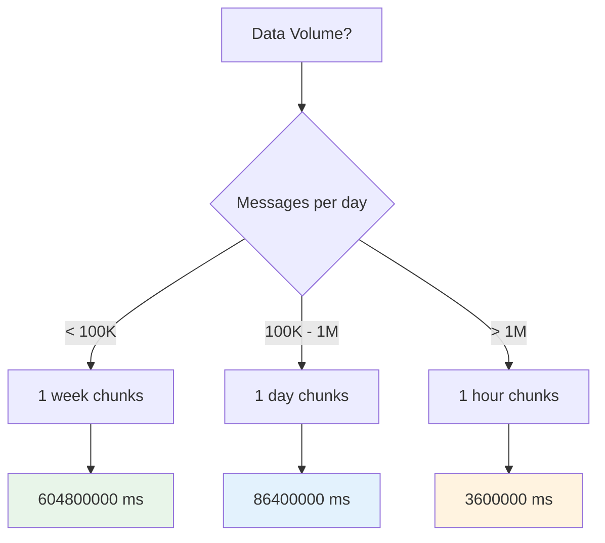
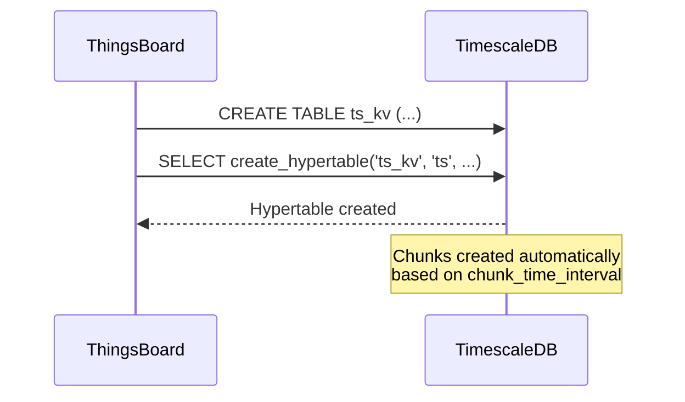
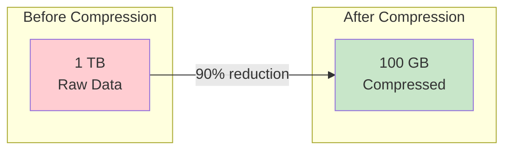
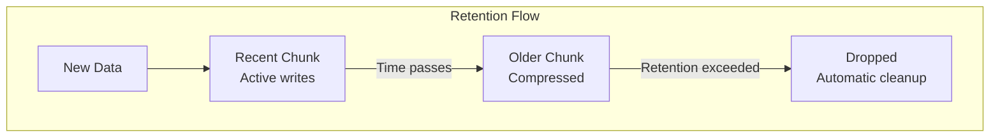
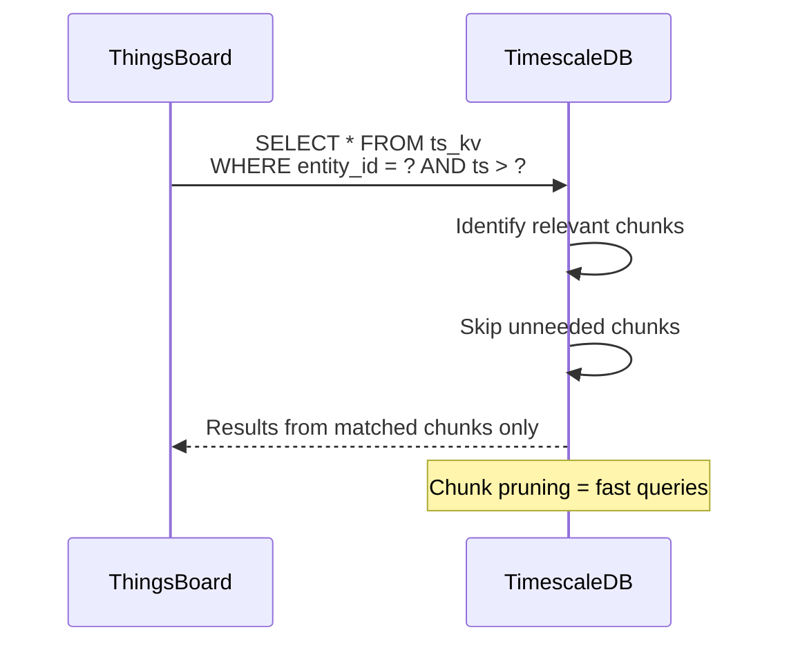
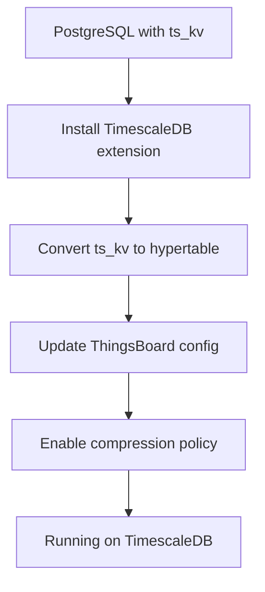

# TimescaleDB Storage

## Overview

TimescaleDB is a PostgreSQL extension that adds automatic time-series data management features. ThingsBoard can use TimescaleDB for time-series storage while keeping the familiar PostgreSQL interface for queries. This provides better compression, automatic partitioning (called "chunks"), and optimized time-series queries compared to plain PostgreSQL.

## Why TimescaleDB?

### Comparison with Other Backends



### Key Benefits

| Feature | PostgreSQL | TimescaleDB | Benefit |
|---------|------------|-------------|---------|
| Partitioning | Manual setup | Automatic | No partition management |
| Compression | Limited | 90%+ compression | 10x storage reduction |
| Data retention | Manual delete | Built-in policies | Automatic cleanup |
| Query performance | Degrades with size | Consistent | Fast time-range queries |

### Architecture



## Configuration

### Enable TimescaleDB Mode

```yaml
# thingsboard.yml
database:
  ts:
    type: timescale
  ts_latest:
    type: timescale

sql:
  timescale:
    chunk_time_interval: 604800000   # 1 week in milliseconds
    batch_threads: 3
```

### Environment Variables

| Variable | Default | Description |
|----------|---------|-------------|
| `DATABASE_TS_TYPE` | `sql` | Set to `timescale` |
| `SQL_TIMESCALE_CHUNK_TIME_INTERVAL` | `604800000` | Chunk duration (ms) |
| `SQL_TS_BATCH_SIZE` | `10000` | Batch write size |
| `SQL_TS_BATCH_MAX_DELAY` | `100` | Max batch delay (ms) |

### Chunk Time Interval Selection



| Data Volume | Recommended Chunk Interval |
|-------------|---------------------------|
| Low (< 100K/day) | 1 week (604800000 ms) |
| Medium (100K-1M/day) | 1 day (86400000 ms) |
| High (> 1M/day) | 1 hour (3600000 ms) |

## Hypertable Setup

### Automatic Creation

ThingsBoard automatically creates hypertables during initialization:



### Manual Hypertable Creation

If setting up manually:

```sql
-- Create the base table (if not exists)
CREATE TABLE IF NOT EXISTS ts_kv (
    entity_id uuid NOT NULL,
    key int NOT NULL,
    ts bigint NOT NULL,
    bool_v boolean,
    str_v varchar,
    long_v bigint,
    dbl_v double precision,
    json_v varchar,
    CONSTRAINT ts_kv_pkey PRIMARY KEY (entity_id, key, ts)
);

-- Convert to hypertable
SELECT create_hypertable('ts_kv', 'ts',
    chunk_time_interval => 604800000,  -- 1 week
    if_not_exists => true,
    migrate_data => true
);
```

## Compression

### Enable Compression

```sql
-- Enable compression on the hypertable
ALTER TABLE ts_kv SET (
    timescaledb.compress,
    timescaledb.compress_segmentby = 'entity_id, key'
);

-- Create compression policy (compress chunks older than 7 days)
SELECT add_compression_policy('ts_kv', INTERVAL '7 days');
```

### Compression Benefits



| Data Type | Typical Compression Ratio |
|-----------|--------------------------|
| Numeric telemetry | 10:1 to 20:1 |
| String data | 5:1 to 10:1 |
| JSON data | 3:1 to 5:1 |

### Compression Configuration

```yaml
# thingsboard.yml (conceptual - managed via SQL)
sql:
  timescale:
    compression:
      enabled: true
      policy_interval: 7d    # Compress after 7 days
      segment_by: entity_id, key
```

## Data Retention

### Retention Policy



### Configure Retention

```sql
-- Drop chunks older than 30 days
SELECT add_retention_policy('ts_kv', INTERVAL '30 days');

-- View current policies
SELECT * FROM timescaledb_information.jobs
WHERE proc_name = 'policy_retention';
```

### ThingsBoard TTL Integration

ThingsBoard's TTL configuration works with TimescaleDB retention:

```yaml
sql:
  ttl:
    ts:
      enabled: true
      execution_interval_ms: 86400000  # Check daily
      ts_key_value_ttl: 2592000        # 30 days in seconds
```

## Query Optimization

### Time-Series Queries



### Aggregation Performance

TimescaleDB provides optimized aggregation functions:

```sql
-- Standard aggregation (optimized by TimescaleDB)
SELECT entity_id, key,
       time_bucket('1 hour', to_timestamp(ts/1000)) AS bucket,
       avg(dbl_v) as avg_value,
       min(dbl_v) as min_value,
       max(dbl_v) as max_value
FROM ts_kv
WHERE ts >= ? AND ts < ?
GROUP BY entity_id, key, bucket
ORDER BY bucket;
```

### Continuous Aggregates (Advanced)

For frequently-queried aggregations:

```sql
-- Create continuous aggregate for hourly stats
CREATE MATERIALIZED VIEW ts_kv_hourly
WITH (timescaledb.continuous) AS
SELECT entity_id, key,
       time_bucket('1 hour', to_timestamp(ts/1000)) AS bucket,
       avg(dbl_v) as avg_value,
       count(*) as sample_count
FROM ts_kv
GROUP BY entity_id, key, bucket;

-- Refresh policy
SELECT add_continuous_aggregate_policy('ts_kv_hourly',
    start_offset => INTERVAL '3 hours',
    end_offset => INTERVAL '1 hour',
    schedule_interval => INTERVAL '1 hour'
);
```

## Monitoring

### View Chunk Information

```sql
-- List all chunks
SELECT chunk_schema, chunk_name,
       range_start, range_end,
       is_compressed
FROM timescaledb_information.chunks
WHERE hypertable_name = 'ts_kv'
ORDER BY range_start DESC;
```

### Check Compression Status

```sql
-- Compression statistics
SELECT hypertable_name,
       chunk_name,
       before_compression_total_bytes,
       after_compression_total_bytes,
       compression_ratio
FROM chunk_compression_stats('ts_kv');
```

### Monitor Job Status

```sql
-- View background job status
SELECT job_id, application_name,
       schedule_interval,
       last_run_success, last_run_status
FROM timescaledb_information.job_stats;
```

## Performance Tuning

### Memory Configuration

```sql
-- Recommended PostgreSQL settings for TimescaleDB
-- Set in postgresql.conf

shared_buffers = '4GB'              -- 25% of RAM
effective_cache_size = '12GB'       -- 75% of RAM
work_mem = '64MB'                   -- For sorting/aggregation
maintenance_work_mem = '1GB'        -- For compression/vacuum
max_parallel_workers_per_gather = 4 -- Parallel queries
```

### TimescaleDB-Specific Settings

```sql
-- In postgresql.conf
timescaledb.max_background_workers = 8
timescaledb.telemetry_level = off   -- Disable telemetry
```

### ThingsBoard Batch Configuration

```yaml
sql:
  ts:
    batch_size: 10000          # Entries per batch
    batch_max_delay: 100       # Max wait before flush (ms)
    batch_threads: 3           # Parallel batch processors

  ts_latest:
    batch_size: 1000
    batch_max_delay: 50
```

## Migration from PostgreSQL

### Steps to Migrate



### Migration Script

```sql
-- 1. Install extension (requires superuser)
CREATE EXTENSION IF NOT EXISTS timescaledb;

-- 2. Convert existing table to hypertable
SELECT create_hypertable('ts_kv', 'ts',
    chunk_time_interval => 604800000,
    migrate_data => true
);

-- 3. Enable compression
ALTER TABLE ts_kv SET (
    timescaledb.compress,
    timescaledb.compress_segmentby = 'entity_id, key'
);

-- 4. Add compression policy
SELECT add_compression_policy('ts_kv', INTERVAL '7 days');

-- 5. Optionally add retention
SELECT add_retention_policy('ts_kv', INTERVAL '365 days');
```

### Update ThingsBoard Configuration

```yaml
# Change ts.type from sql to timescale
database:
  ts:
    type: timescale
```

## Troubleshooting

### Common Issues

| Issue | Cause | Solution |
|-------|-------|----------|
| Slow inserts | Too many indexes | Use default indexes only |
| High memory usage | Large work_mem | Reduce or add RAM |
| Chunk creation errors | Disk space | Free space or add storage |
| Compression failures | Active writes to chunk | Wait for chunk to age |

### Useful Diagnostic Queries

```sql
-- Check hypertable size
SELECT hypertable_size('ts_kv');

-- Check chunk sizes
SELECT chunk_name,
       pg_size_pretty(total_bytes) as size
FROM chunks_detailed_size('ts_kv')
ORDER BY total_bytes DESC;

-- Check for compression issues
SELECT * FROM timescaledb_information.compression_settings
WHERE hypertable_name = 'ts_kv';
```

### Performance Diagnostics

```sql
-- Query execution stats
EXPLAIN ANALYZE
SELECT * FROM ts_kv
WHERE entity_id = 'device-uuid'
  AND ts > extract(epoch from now() - interval '1 day') * 1000;
```

## Best Practices

### Do's

- Set appropriate chunk interval based on data volume
- Enable compression for older data
- Configure retention policies to manage storage
- Monitor chunk sizes and compression ratios
- Use time_bucket() for aggregations

### Don'ts

- Don't set chunk interval too small (overhead)
- Don't compress recent chunks (write performance)
- Don't skip retention policies (unbounded growth)
- Don't ignore monitoring (catch issues early)

### Recommended Configuration Summary

| Setting | Small | Medium | Large |
|---------|-------|--------|-------|
| Chunk interval | 1 week | 1 day | 1 hour |
| Compression age | 7 days | 3 days | 1 day |
| Batch size | 5000 | 10000 | 20000 |
| Batch threads | 2 | 3 | 4 |

## See Also

- [Time-Series Storage](./timeseries-storage.md) - General patterns
- [Hybrid Storage](./hybrid-storage.md) - When to use TimescaleDB vs Cassandra
- [Database Schema](./database-schema.md) - Schema reference
- [Caching](./caching.md) - Cache configuration
