# Time-Series Storage

## Overview

Time-series storage is the backbone of IoT data persistence in ThingsBoard. The platform implements a pluggable storage architecture that supports multiple database backends optimized for different scale and performance requirements. The design separates **historical data** (all data points over time) from **latest values** (most recent reading per key), enabling efficient queries for both real-time dashboards and historical analysis.

## Key Behaviors

1. **Dual Storage Pattern**: Historical data and latest values are stored separately for query optimization.

2. **Pluggable Backends**: Storage backend can be PostgreSQL, TimescaleDB, or Cassandra without changing application code.

3. **Time-Based Partitioning**: Data is partitioned by time intervals to manage growth and enable efficient cleanup.

4. **Key Dictionary**: String keys are mapped to integer IDs for storage efficiency.

5. **Asynchronous Operations**: All storage operations are non-blocking for high throughput.

6. **TTL Support**: Automatic data expiration based on configurable retention policies.

7. **Aggregation Engine**: Built-in support for MIN, MAX, AVG, SUM, COUNT across time windows.

## Storage Architecture

### Dual Storage Pattern

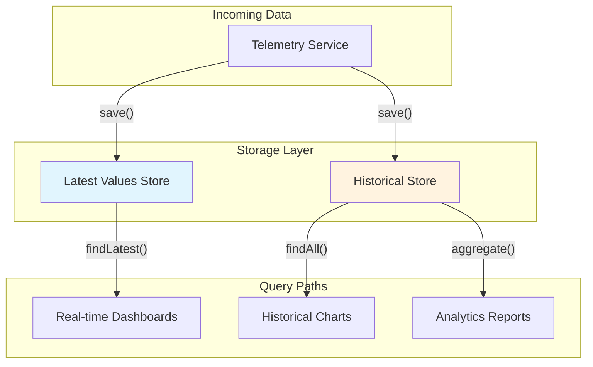

The dual storage pattern optimizes for two distinct access patterns:

| Store | Purpose | Query Pattern | Update Frequency |
|-------|---------|---------------|------------------|
| Latest Values | Current state | Point lookup by entity+key | Every data point |
| Historical | Time-series analysis | Range scans by time | Append-only |

### Storage Backend Options

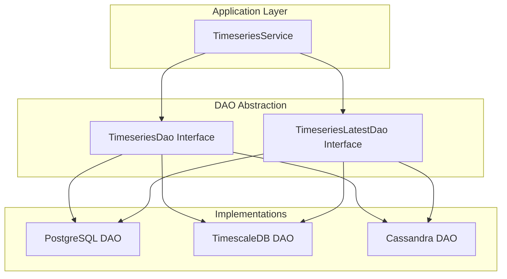

| Backend | Best For | Partitioning | Scaling Model |
|---------|----------|--------------|---------------|
| PostgreSQL | Small-medium deployments | Native table partitions | Vertical |
| TimescaleDB | Medium-large time-series | Automatic hypertable chunks | Vertical + compression |
| Cassandra | Large distributed deployments | Column family partitions | Horizontal |

### Hybrid Configuration

The platform supports using different backends for different storage types:

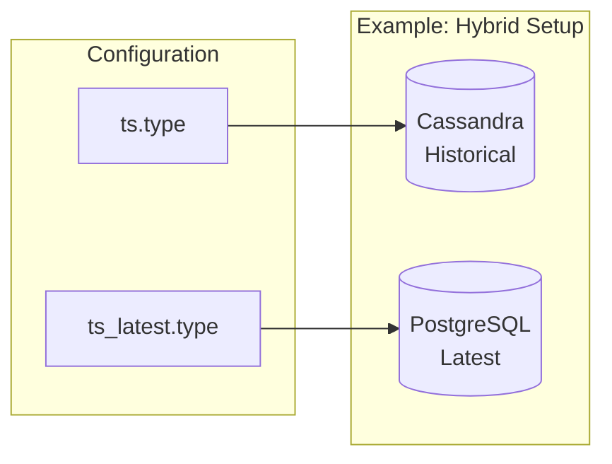

This enables optimizing each storage type independently - for example, using Cassandra for high-volume historical writes while keeping latest values in PostgreSQL for transactional consistency.

## Data Model

### Key Dictionary

String keys are normalized to integer IDs for storage efficiency:

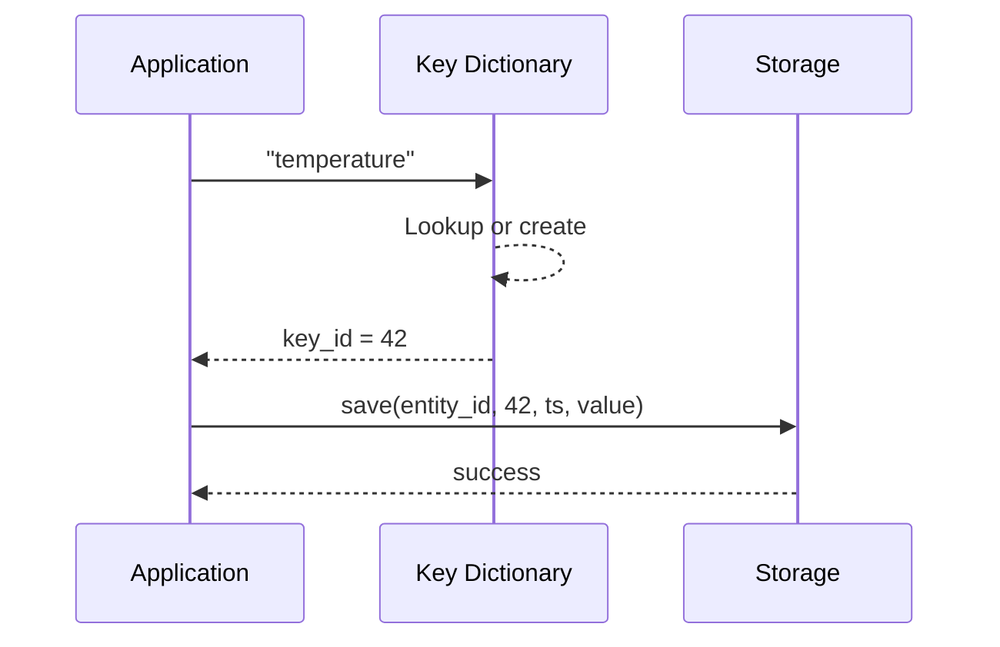

| Table | Column | Type | Description |
|-------|--------|------|-------------|
| ts_kv_dictionary | key | varchar(255) | Original key name |
| ts_kv_dictionary | key_id | serial | Auto-increment integer ID |

Benefits:
- Reduced storage footprint (4 bytes vs variable string length)
- Faster index comparisons
- Consistent key handling across backends

### Data Point Structure

Each time-series data point contains:

| Field | Type | Required | Description |
|-------|------|----------|-------------|
| entity_id | UUID | Yes | Entity the data belongs to |
| key | integer | Yes | Key ID from dictionary |
| ts | bigint | Yes | Timestamp in milliseconds |
| bool_v | boolean | No | Boolean value |
| str_v | varchar | No | String value |
| long_v | bigint | No | Integer value |
| dbl_v | double | No | Decimal value |
| json_v | jsonb | No | JSON object value |

Only one value column is populated per data point (mutually exclusive types).

### Latest Values Structure

Latest values include additional metadata for concurrency control:

| Field | Type | Description |
|-------|------|-------------|
| entity_id | UUID | Entity identifier |
| key | integer | Key ID |
| ts | bigint | Timestamp of latest value |
| *_v | various | Value columns (same as historical) |
| version | bigint | Optimistic lock version |

## Partitioning Strategies

### Time-Based Partitioning

Data is partitioned by time intervals to:
- Limit partition size for query performance
- Enable efficient TTL-based cleanup (drop entire partitions)
- Distribute writes across storage nodes

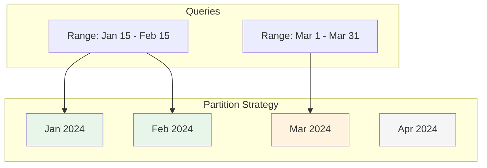

### Partition Intervals

| Interval | Duration | Use Case |
|----------|----------|----------|
| MINUTES | 1 minute | Very high frequency, short retention |
| HOURS | 1 hour | High frequency data |
| DAYS | 1 day | Standard IoT workloads |
| MONTHS | ~30 days | Default, most deployments |
| YEARS | ~365 days | Low volume, long retention |
| INDEFINITE | None | Single partition (simple, limited scale) |

### Backend-Specific Partitioning

**PostgreSQL**: Uses native declarative partitioning with range partitions on timestamp.

**TimescaleDB**: Uses hypertables with automatic chunk creation. Chunks are the equivalent of partitions but managed automatically.

**Cassandra**: Uses composite partition keys (entity_id + partition_ts) with partition timestamp calculated from the data timestamp.

### PostgreSQL Partition Management

Partitions are created automatically on first write:

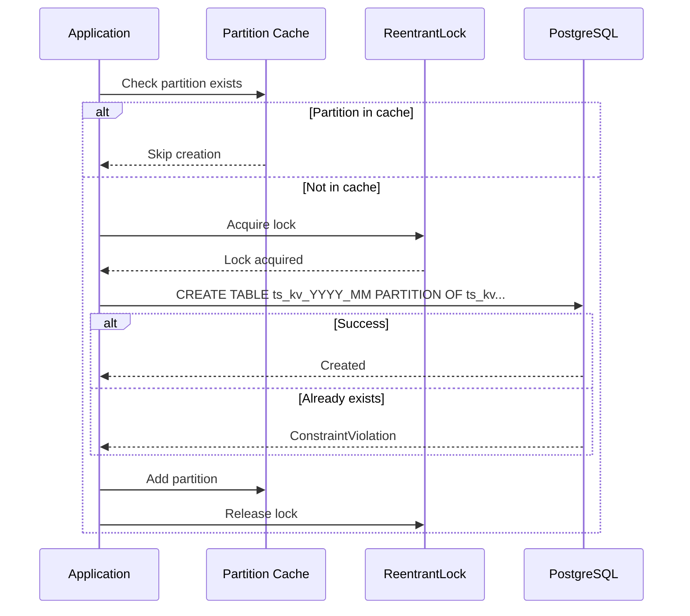

**Partition naming**: `ts_kv_YYYY_MM` (for MONTHS) or `ts_kv_YYYY_MM_DD` (for DAYS)

**Double-checked locking**: Uses ReentrantLock to minimize contention during partition creation.

### Partition Tracking

For efficient queries, the system tracks which partitions exist:

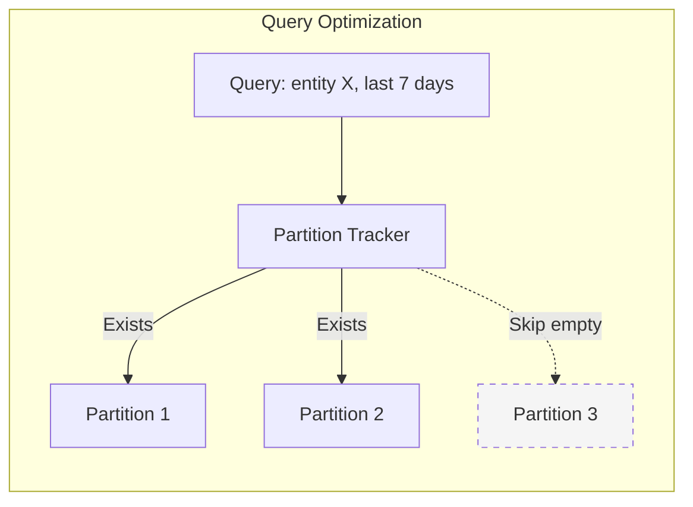

The partition tracker maintains a cache of existing partitions per entity, avoiding queries to empty partitions.

## Query Operations

### Query Types

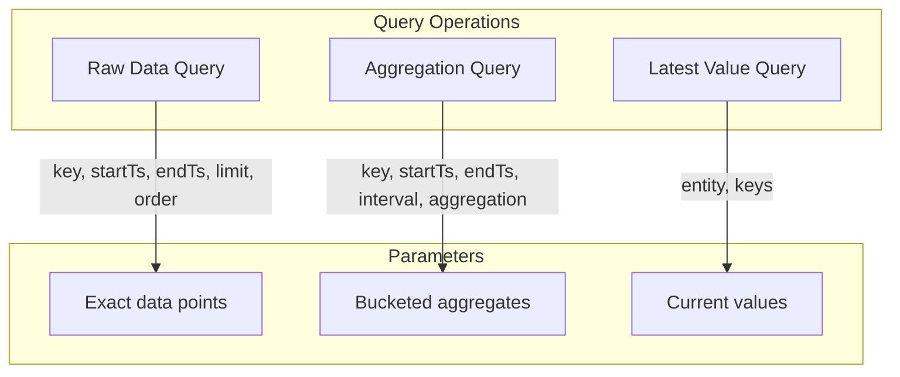

### Raw Data Queries

Retrieve exact data points within a time range:

| Parameter | Type | Description |
|-----------|------|-------------|
| key | string | Time-series key name |
| startTs | long | Range start (inclusive) |
| endTs | long | Range end (exclusive) |
| limit | int | Maximum points to return |
| orderBy | enum | ASC or DESC by timestamp |

### Aggregation Queries

Compute statistics over time windows:

| Parameter | Type | Description |
|-----------|------|-------------|
| key | string | Time-series key name |
| startTs | long | Range start |
| endTs | long | Range end |
| interval | long | Bucket size |
| intervalType | enum | MILLISECONDS, HOURS, DAYS, MONTHS, YEARS |
| aggregation | enum | MIN, MAX, AVG, SUM, COUNT |
| timezone | string | For calendar-aligned buckets |

### Aggregation Functions

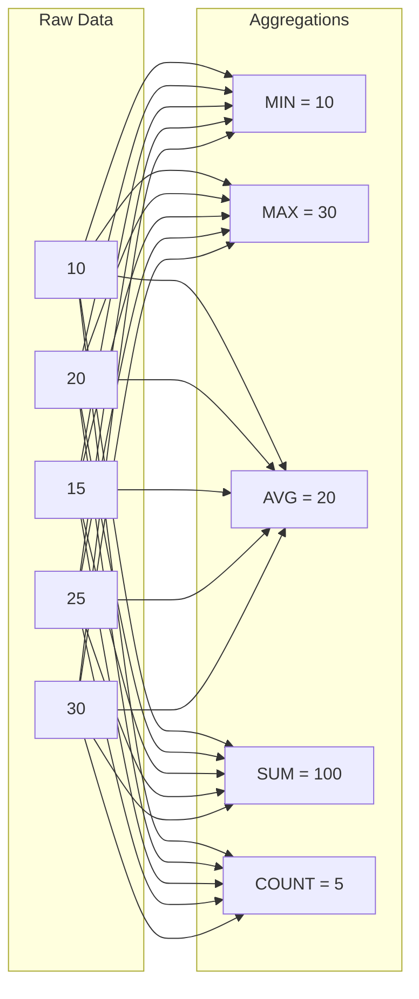

### Query Flow

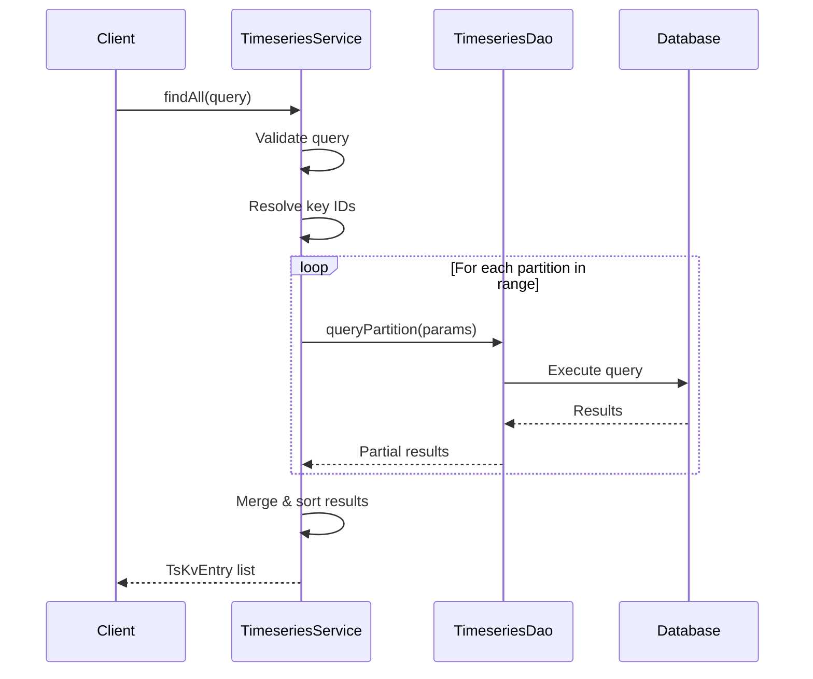

## Data Retention (TTL)

### TTL Mechanisms

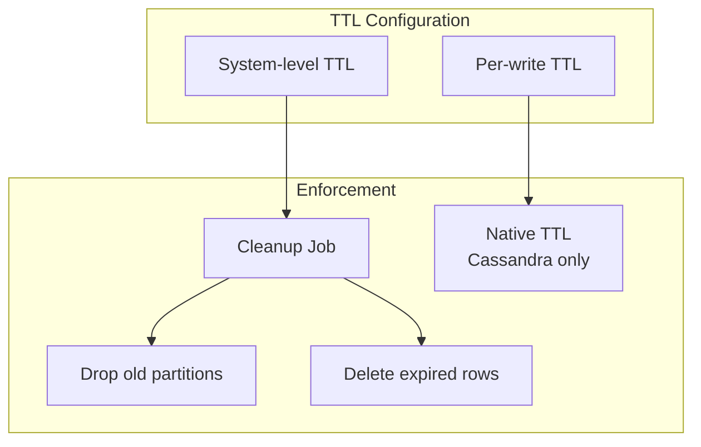

### Configuration Options

| Setting | Default | Description |
|---------|---------|-------------|
| ts_key_value_ttl | 0 (disabled) | System-wide TTL in seconds |
| execution_interval_ms | 86400000 | Cleanup job frequency (1 day) |

### Cleanup Process

1. **Partition-based cleanup**: Drop entire partitions older than TTL
2. **Row-based cleanup**: Delete individual rows based on timestamp
3. **Latest value handling**: Optionally preserve or expire latest values

### TTL Best Practices

- Set TTL based on data analysis requirements
- Use partition-aligned TTL for efficient cleanup
- Consider different TTL for different data types (e.g., keep alarms longer than raw telemetry)

## Write Operations

### Write Flow

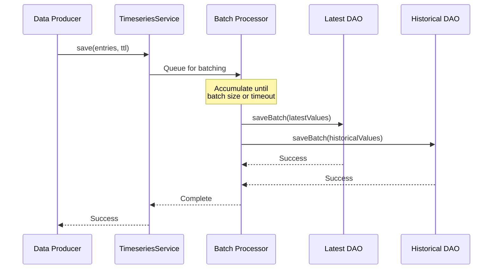

### Batching Configuration

| Setting | Default | Description |
|---------|---------|-------------|
| `sql.ts.batch_size` | 10000 | Max entries per batch |
| `sql.ts.batch_max_delay` | 100 | Max wait before flush (ms) |
| `sql.ts.batch_threads` | 4 | Parallel batch processors |
| `sql.ts_latest.batch_size` | 1000 | Latest values batch size |
| `sql.ts_latest.batch_max_delay` | 50 | Latest values max delay (ms) |
| `sql.batch_sort` | true | Sort batches to prevent deadlocks |

### SQL Batch Queue Architecture

```mermaid
graph TB
    subgraph "Write Requests"
        W1[save(entity1)]
        W2[save(entity2)]
        W3[save(entity3)]
    end

    subgraph "TbSqlBlockingQueue"
        HASH[Hash Distribution]
        Q1[Queue 1]
        Q2[Queue 2]
        Q3[Queue N]
    end

    subgraph "Batch Processing"
        BP1[Batch Processor 1]
        BP2[Batch Processor 2]
        BP3[Batch Processor N]
    end

    W1 --> HASH
    W2 --> HASH
    W3 --> HASH
    HASH --> Q1
    HASH --> Q2
    HASH --> Q3
    Q1 --> BP1
    Q2 --> BP2
    Q3 --> BP3
    BP1 --> DB[(Database)]
    BP2 --> DB
    BP3 --> DB
```

### Hash-Based Queue Distribution

Writes are distributed across queues using entity ID hash:

```
queueIndex = (entityId.hashCode() & 0x7FFFFFFF) % batchThreads

Benefit: All writes for same entity go to same queue,
         maintaining per-entity ordering
```

### Batch Sorting

When `sql.batch_sort=true`, batches are sorted before execution:

| Sort Order | Purpose |
|------------|---------|
| entity_id | Group by entity |
| key | Group by metric |
| ts | Chronological order |

**Purpose**: Prevents deadlocks in clustered PostgreSQL by ensuring consistent lock acquisition order.

### Write Modes

| Mode | Behavior | Use Case |
|------|----------|----------|
| save() | Update both latest and historical | Normal telemetry |
| saveLatest() | Update latest only | Current state sync |
| saveWithoutLatest() | Update historical only | Backfill operations |

### Latest Value Deduplication

When multiple writes occur for the same entity+key within a batch:

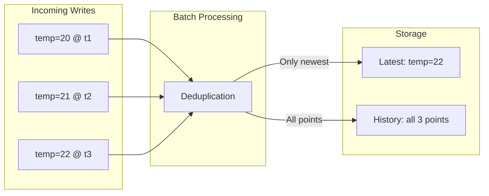

Only the newest value per entity+key is written to the latest store, reducing write amplification.

## Delete Operations

### Delete Modes

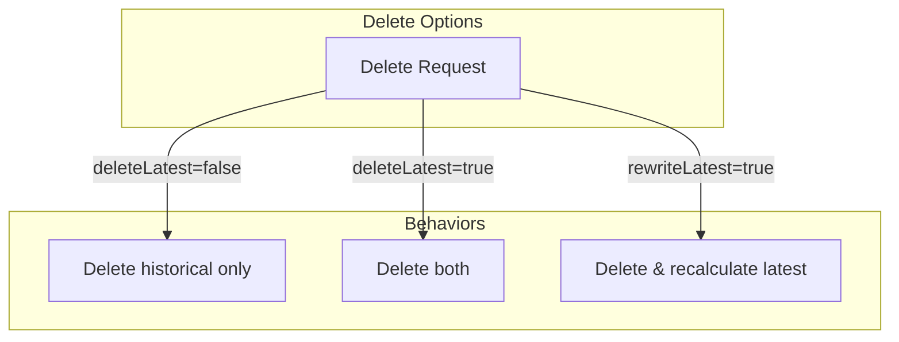

| Option | Description |
|--------|-------------|
| deleteLatest=false | Keep latest value, remove historical range |
| deleteLatest=true | Remove both latest and historical |
| rewriteLatestIfDeleted=true | After deleting, find next-most-recent value and set as latest |

### Latest Value Rewriting

When historical data is deleted and `rewriteLatestIfDeleted=true`:

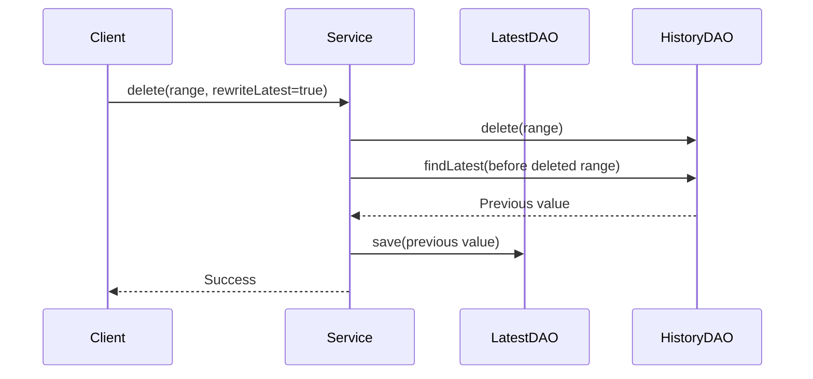

## Performance Considerations

### Query Optimization

1. **Partition pruning**: Queries only scan partitions within the time range
2. **Key filtering**: Dictionary lookup happens once, then integer comparisons
3. **Index usage**: Primary key indexes on (entity_id, key, ts) enable efficient scans
4. **Result streaming**: Large result sets are streamed rather than loaded entirely

### Write Optimization

1. **Async batching**: Writes are accumulated and flushed in batches
2. **Parallel processing**: Multiple batch processors run concurrently
3. **Statement deduplication**: Redundant latest-value updates are eliminated
4. **Sort ordering**: SQL batches are sorted to prevent deadlocks in clusters

### Scaling Guidelines

| Scale | Backend | Configuration |
|-------|---------|---------------|
| < 1M points/day | PostgreSQL | Monthly partitions |
| 1M-100M points/day | TimescaleDB | Weekly chunks, compression |
| > 100M points/day | Cassandra | Distributed cluster, daily partitions |

### Memory Considerations

- **Partition cache**: Stores partition existence info (configurable size)
- **Key dictionary cache**: Maps string keys to IDs
- **Batch buffers**: Accumulate writes before flush

## Configuration Reference

### Database Type Selection

```yaml
database:
  ts:
    type: sql          # sql, timescale, or cassandra
  ts_latest:
    type: sql          # Can differ from ts.type
```

### PostgreSQL Settings

```yaml
sql:
  postgres:
    ts_key_value_partitioning: MONTHS    # DAYS, MONTHS, YEARS, INDEFINITE
  ts:
    batch_size: 10000
    batch_max_delay: 100
    batch_threads: 3
  ts_latest:
    batch_size: 1000
    batch_max_delay: 50
    update_by_latest_ts: true            # Only update if newer
  ttl:
    ts:
      enabled: true
      execution_interval_ms: 86400000    # 1 day
      ts_key_value_ttl: 0                # 0 = disabled
```

### TimescaleDB Settings

```yaml
sql:
  timescale:
    chunk_time_interval: 604800000       # 1 week in milliseconds
```

### Cassandra Settings

```yaml
cassandra:
  query:
    ts_key_value_partitioning: MONTHS
    ts_key_value_ttl: 0
    ts_key_value_partitions_max_cache_size: 100000
    default_fetch_size: 2000
```

### Query Limits

```yaml
database:
  ts:
    max_intervals: 700                   # Max aggregation buckets per query
```

## Entity View Integration

Entity Views can filter time-series access:

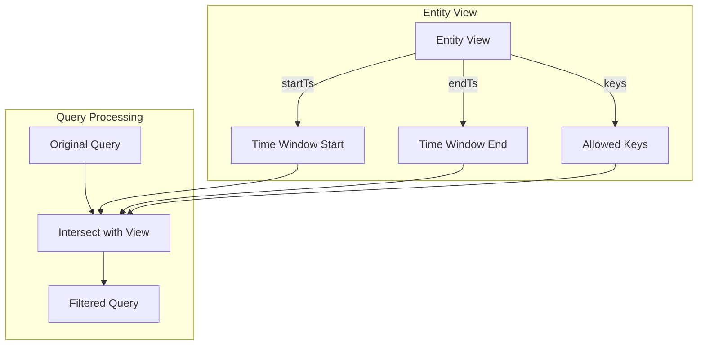

Queries through an Entity View are automatically filtered to:
- Only allowed keys (whitelist)
- Only the configured time window
- The underlying entity's data

## Troubleshooting

### Common Issues

| Issue | Cause | Solution |
|-------|-------|----------|
| Slow queries | Missing partition pruning | Ensure time range is specified |
| High memory usage | Large partition cache | Reduce cache size config |
| Write latency spikes | Batch size too large | Reduce batch_size |
| Missing latest values | TTL expired | Check TTL configuration |
| Query timeout | Too many intervals | Reduce time range or increase interval |

### Monitoring Points

- Batch queue depth
- Partition cache hit rate
- Query latency by type (raw vs aggregation)
- TTL cleanup job duration
- Write throughput (points/second)

## See Also

- [Database Schema](./database-schema.md) - Table definitions
- [Cassandra Storage](./cassandra-storage.md) - Cassandra-specific configuration
- [Caching](./caching.md) - Redis and Caffeine cache configuration
- [Telemetry Data Model](../02-core-concepts/data-model/telemetry.md) - Data structure
- [Message Queue Architecture](../08-message-queue/queue-architecture.md) - Data ingestion
- [Multi-Tenancy](../01-architecture/multi-tenancy.md) - Tenant isolation in storage
