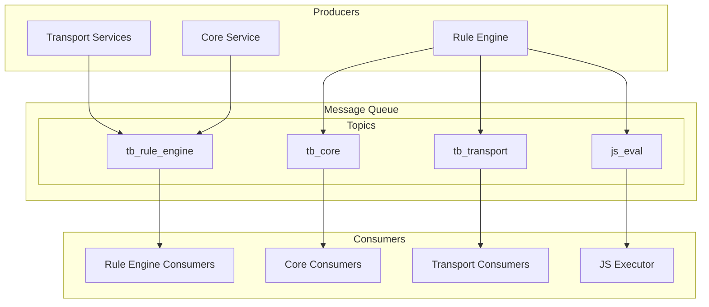
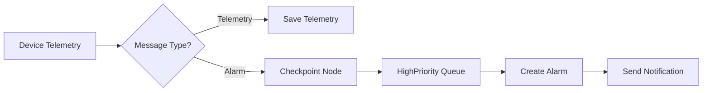
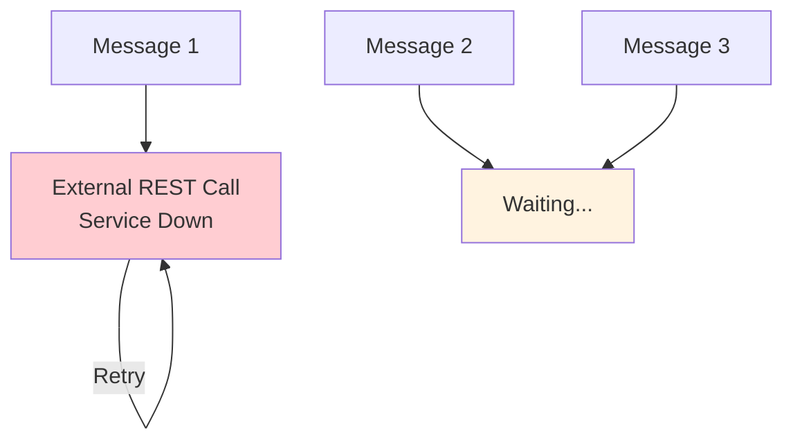
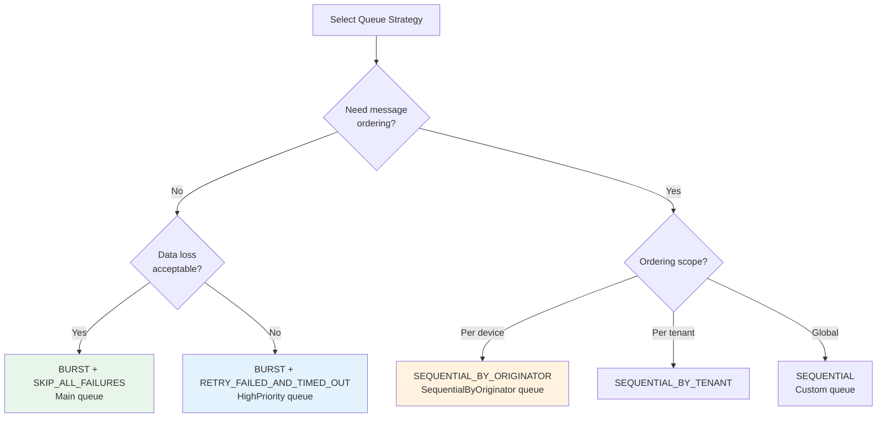

# Message Queue

## Overview

The message queue layer provides asynchronous, decoupled communication between ThingsBoard services. It enables horizontal scaling by distributing message processing across multiple service instances while maintaining message ordering through hash-based partitioning. The platform supports Kafka for production deployments and in-memory queues for development.

## Contents

| Document | Description |
|----------|-------------|
| [Queue Architecture](./queue-architecture.md) | Queue topology, topic structure, providers, and message routing |
| [Partitioning](./partitioning.md) | Hash-based distribution, partition assignment, and rebalancing |
| [Processing Strategies](./processing-strategies.md) | Submit strategies, failure handling, and retry mechanisms |
| [Kafka Configuration](./kafka-configuration.md) | Kafka-specific settings, tuning, and deployment options |

## Typical Use Cases

| Use Case | Queue | Submit Strategy | Processing Strategy |
|----------|-------|-----------------|---------------------|
| High-volume telemetry | Main | BURST | SKIP_ALL_FAILURES |
| Device commands | HighPriority | SEQUENTIAL_BY_ORIGINATOR | RETRY_FAILED_AND_TIMED_OUT |
| Alarm notifications | HighPriority | BURST | RETRY_FAILED_AND_TIMED_OUT |
| Counter/aggregation updates | SequentialByOriginator | SEQUENTIAL_BY_ORIGINATOR | RETRY_FAILED_AND_TIMED_OUT |
| External service integration | Custom | SEQUENTIAL | RETRY_ALL |

## Key Concepts

- **Service Decoupling**: Services communicate through queues rather than direct calls, enabling independent scaling
- **Hash-Based Partitioning**: Messages distributed using consistent hashing on entity IDs for ordering guarantees
- **Tenant Isolation**: Isolated tenants can have dedicated queue topics preventing noisy neighbor effects
- **Multiple Providers**: Kafka for production, in-memory for testing/single-node setups
- **Protocol Buffers**: Efficient binary serialization for inter-service messages

## Queue Architecture



## Default Queues

ThingsBoard comes with three preconfigured queues:

| Queue | Purpose | Submit Strategy | Processing Strategy |
|-------|---------|-----------------|---------------------|
| **Main** | Default entry point for all messages | BURST | SKIP_ALL_FAILURES |
| **HighPriority** | Alarms and critical processing | BURST | RETRY_FAILED_AND_TIMED_OUT |
| **SequentialByOriginator** | Ordered per-device processing | SEQUENTIAL_BY_ORIGINATOR | RETRY_FAILED_AND_TIMED_OUT |

Use the **Checkpoint** rule node to route messages from the Main queue to other queues. The Checkpoint node automatically acknowledges messages in the source queue when successfully enqueuing to the target.

## Getting Started Example

**Scenario**: Route alarm messages to a high-priority queue for reliable delivery.



1. Create or use the **HighPriority** queue (preconfigured)
2. Add a **Switch** node to route by message type
3. Add a **Checkpoint** node pointing to HighPriority queue
4. Messages automatically retry until notification succeeds

## Common Pitfalls and Gotchas

### Queue Blocking with Retry Strategies

**Critical:** When using `RETRY_ALL`, `RETRY_FAILED`, `RETRY_TIMED_OUT`, or `RETRY_FAILED_AND_TIMED_OUT` strategies, a single failed rule node can block the entire queue.



**Mitigation:**
- Handle the **Failure** output of external nodes (REST API, Kafka, MQTT)
- Use dedicated queues for unstable integrations
- Configure failure percentage thresholds to stop retrying

### Message Loss with Skip Strategies

The **Main** queue uses `SKIP_ALL_FAILURES` by default for backward compatibility. Failed messages are permanently lost.

| Strategy | Failed Messages | Risk |
|----------|-----------------|------|
| SKIP_ALL_FAILURES | Lost forever | Data loss if DB or external service is down |
| SKIP_ALL_FAILURES_AND_TIMED_OUT | Lost forever | Both failures and timeouts lost |

**When acceptable:** High-volume telemetry where individual message loss is tolerable.

### Message Amplification with RETRY_ALL

If 1 of 100 messages fails, **all 100 messages are reprocessed**—not just the failed one. This multiplies load during failures.

```
Pack of 100 messages → 1 fails → Retry all 100 → Repeat
```

Use `RETRY_FAILED_AND_TIMED_OUT` instead to retry only the problematic messages.

### Message Cancellation Behavior

When retry strategies resubmit messages:
- All messages from the previous submission are **canceled**
- Rule nodes **will not start** processing canceled messages
- Rule nodes **already processing** are NOT interrupted

This means partial execution can occur if a rule node was mid-processing when cancellation happened.

### Race Conditions with Counters

When using asynchronous processing (BURST strategy) to read, update, and save state:

```
Message A: read counter=5, add 1, save counter=6
Message B: read counter=5, add 1, save counter=6  ← Wrong! Should be 7
```

**Solution:** Use `SEQUENTIAL_BY_ORIGINATOR` for state-modifying operations on the same entity.

## Queue Selection Guide



## Troubleshooting Quick Reference

| Symptom | Likely Cause | Solution |
|---------|--------------|----------|
| Messages not processing | Queue blocked by retry | Check external service availability, handle Failure branch |
| Missing telemetry data | SKIP strategy dropping failures | Switch to RETRY strategy or fix underlying issue |
| Duplicate processing | RETRY_ALL retrying successful messages | Use RETRY_FAILED_AND_TIMED_OUT instead |
| Wrong counter values | Race condition with BURST | Use SEQUENTIAL_BY_ORIGINATOR for state updates |
| High latency | Sequential strategy too slow | Use SEQUENTIAL_BY_ORIGINATOR for parallelism |
| Consumer lag growing | Too few partitions | Increase partition count, add consumers |

## See Also

- [Microservices Architecture](../11-microservices/README.md) - Service communication patterns
- [Rule Engine](../04-rule-engine/README.md) - Message processing pipelines
- [Transport Layer](../05-transport-layer/README.md) - Device message ingestion
- [Multi-Tenancy](../01-architecture/multi-tenancy.md) - Tenant queue isolation
