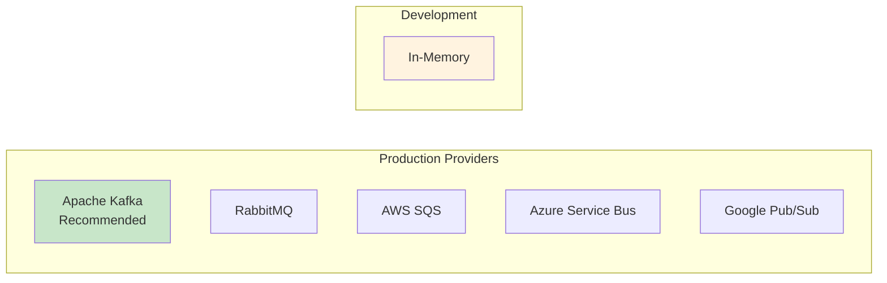
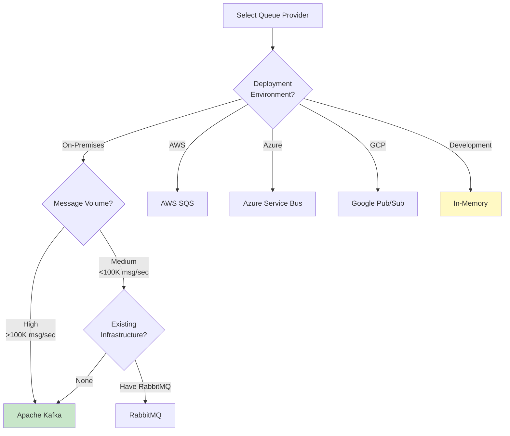
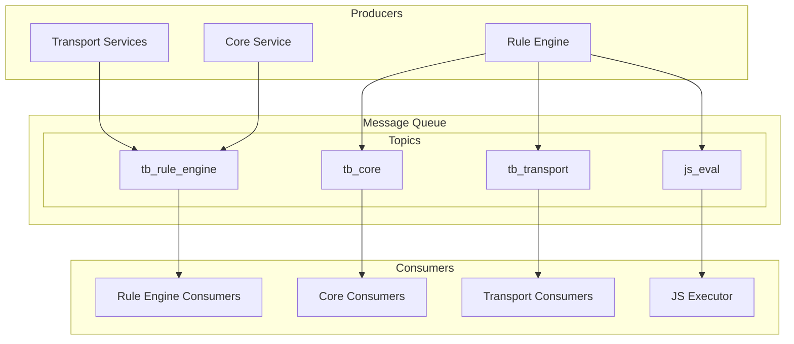
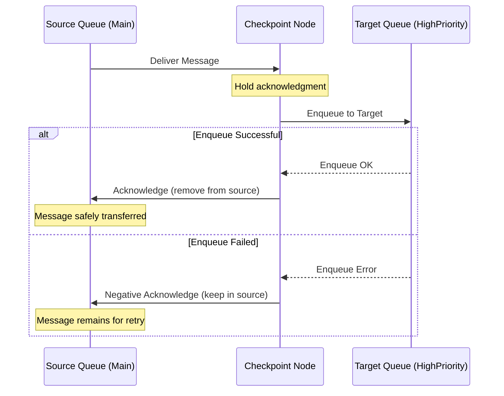
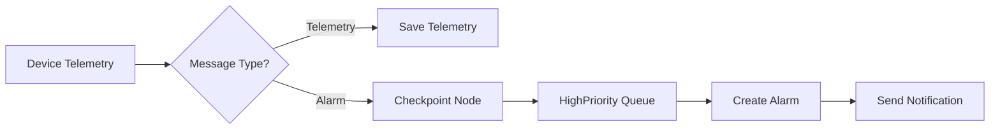
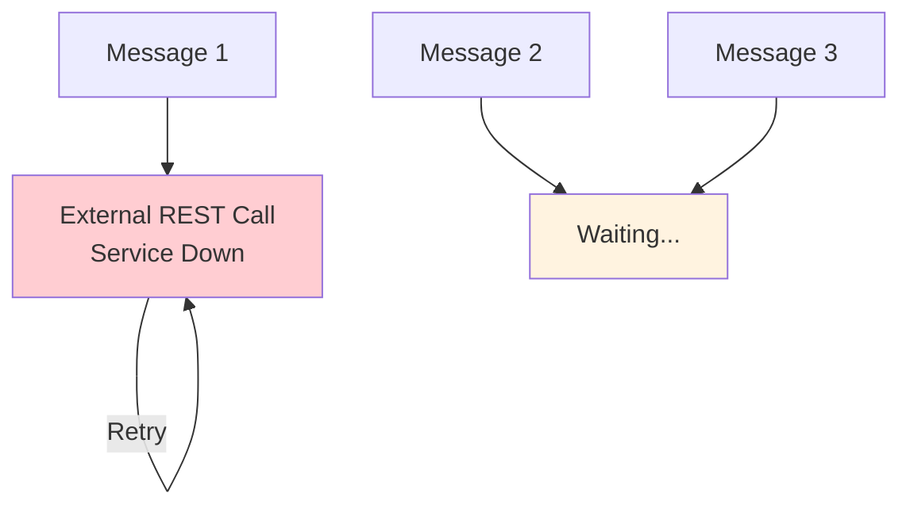
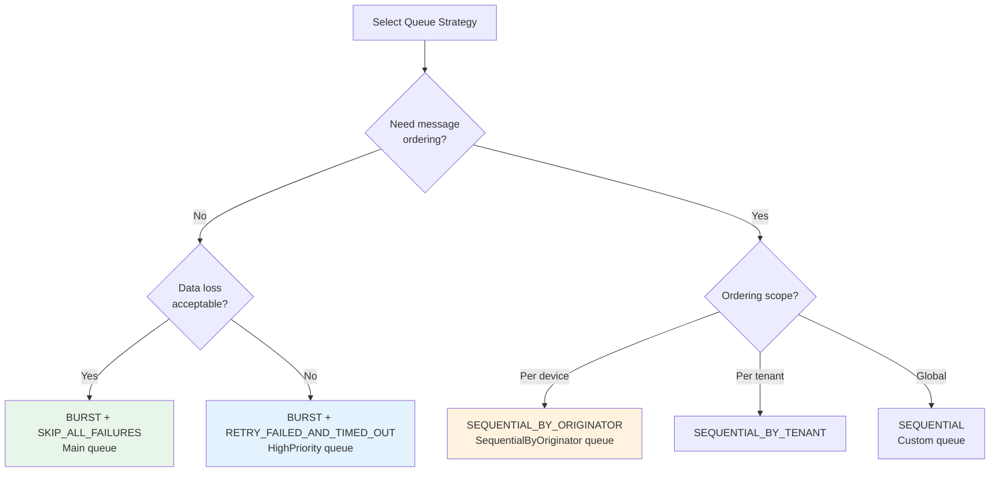

# Message Queue

## Overview

The message queue layer provides asynchronous, decoupled communication between ThingsBoard services. It enables horizontal scaling by distributing message processing across multiple service instances while maintaining message ordering through hash-based partitioning. The platform supports Kafka for production deployments and in-memory queues for development.

## Contents

| Document | Description |
|----------|-------------|
| [Queue Architecture](./queue-architecture.md) | Queue topology, topic structure, providers, and message routing |
| [Partitioning](./partitioning.md) | Hash-based distribution, partition assignment, and rebalancing |
| [Processing Strategies](./processing-strategies.md) | Submit strategies, failure handling, and retry mechanisms |
| [Kafka Configuration](./kafka-configuration.md) | Kafka-specific settings, tuning, and deployment options |

## Typical Use Cases

| Use Case | Queue | Submit Strategy | Processing Strategy |
|----------|-------|-----------------|---------------------|
| High-volume telemetry | Main | BURST | SKIP_ALL_FAILURES |
| Device commands | HighPriority | SEQUENTIAL_BY_ORIGINATOR | RETRY_FAILED_AND_TIMED_OUT |
| Alarm notifications | HighPriority | BURST | RETRY_FAILED_AND_TIMED_OUT |
| Counter/aggregation updates | SequentialByOriginator | SEQUENTIAL_BY_ORIGINATOR | RETRY_FAILED_AND_TIMED_OUT |
| External service integration | Custom | SEQUENTIAL | RETRY_ALL |

## Key Concepts

- **Service Decoupling**: Services communicate through queues rather than direct calls, enabling independent scaling
- **Hash-Based Partitioning**: Messages distributed using consistent hashing on entity IDs for ordering guarantees
- **Tenant Isolation**: Isolated tenants can have dedicated queue topics preventing noisy neighbor effects
- **Multiple Providers**: Kafka for production, in-memory for testing/single-node setups
- **Protocol Buffers**: Efficient binary serialization for inter-service messages

## Queue Providers

ThingsBoard supports multiple message queue providers to suit different deployment scenarios:

### Supported Providers



### Provider Comparison

| Provider | Throughput | Durability | Ordering | Latency | Use Case |
|----------|------------|------------|----------|---------|----------|
| **Apache Kafka** | Very High | Excellent | Per-partition | Low | Production (recommended) |
| **In-Memory** | Very High | None | Best-effort | Lowest | Development, testing |
| **RabbitMQ** | High | Good | Per-queue | Medium | Existing RabbitMQ infrastructure |
| **AWS SQS** | High | Excellent | FIFO queues | Medium | AWS-native deployments |
| **Azure Service Bus** | High | Excellent | Sessions | Medium | Azure-native deployments |
| **Google Pub/Sub** | Very High | Excellent | Ordering keys | Low | GCP-native deployments |

### Apache Kafka (Recommended)

**Best for**: Production deployments requiring high throughput, strong durability, and horizontal scalability.

**Characteristics:**
- Distributed, fault-tolerant message broker
- Supports millions of messages per second
- Persistent storage with configurable retention
- Partition-based parallelism
- Strong ordering guarantees within partitions

**Configuration:**
```yaml
queue:
  type: kafka
  kafka:
    bootstrap.servers: kafka1:9092,kafka2:9092,kafka3:9092
    replication_factor: 3
```

See [Kafka Configuration](./kafka-configuration.md) for detailed settings.

### In-Memory Queue

**Best for**: Development, testing, and single-node demos.

**Characteristics:**
- No external dependencies
- Ultra-low latency (microseconds)
- No persistence (messages lost on restart)
- Limited to single-node deployment
- No resource overhead

**Configuration:**
```yaml
queue:
  type: in-memory
```

**⚠️ Warning**: In-memory queues provide no durability. Data loss occurs on service restart, crash, or any failure.

### RabbitMQ

**Best for**: Organizations with existing RabbitMQ infrastructure or requiring flexible routing patterns.

**Characteristics:**
- Mature AMQP broker
- Flexible exchange/routing patterns
- Good management UI
- Plugin ecosystem
- Per-queue ordering

**Configuration:**
```yaml
queue:
  type: rabbitmq
  rabbitmq:
    host: rabbitmq.example.com
    port: 5672
    virtual_host: /
    username: thingsboard
    password: ${RABBITMQ_PASSWORD}
```

### AWS SQS

**Best for**: AWS-native deployments, serverless architectures, and managed queue requirements.

**Characteristics:**
- Fully managed by AWS
- No infrastructure management
- FIFO queues for ordering
- At-least-once delivery
- Integrated with AWS IAM

**Configuration:**
```yaml
queue:
  type: aws-sqs
  aws_sqs:
    access_key_id: ${AWS_ACCESS_KEY_ID}
    secret_access_key: ${AWS_SECRET_ACCESS_KEY}
    region: us-east-1
```

**Limitations:**
- Higher latency than Kafka (100-200ms typical)
- Message size limited to 256 KB
- Throughput caps (3000 msg/sec per FIFO queue)

### Azure Service Bus

**Best for**: Azure-native deployments and enterprise messaging scenarios.

**Characteristics:**
- Fully managed Azure service
- Session-based ordering
- Transaction support
- Duplicate detection
- Dead-letter queues built-in

**Configuration:**
```yaml
queue:
  type: azure-service-bus
  service_bus:
    namespace_name: thingsboard
    sas_key_name: RootManageSharedAccessKey
    sas_key: ${AZURE_SAS_KEY}
```

### Google Pub/Sub

**Best for**: GCP-native deployments and global-scale messaging.

**Characteristics:**
- Fully managed GCP service
- Global message delivery
- Ordering keys for sequencing
- Automatic scaling
- At-least-once delivery

**Configuration:**
```yaml
queue:
  type: pubsub
  pubsub:
    project_id: thingsboard-project
    service_account: /path/to/credentials.json
```

### Selection Criteria

Choose your queue provider based on:



**Decision Matrix:**

| Scenario | Recommended Provider | Rationale |
|----------|---------------------|-----------|
| Production deployment | Kafka | Best performance, proven at scale |
| Development/Testing | In-Memory | No setup, fastest iteration |
| AWS deployment | AWS SQS | Native integration, managed service |
| Azure deployment | Azure Service Bus | Native integration, enterprise features |
| GCP deployment | Google Pub/Sub | Native integration, global scale |
| Existing RabbitMQ | RabbitMQ | Leverage existing infrastructure |
| <10K devices | Any cloud provider | Managed service simplicity |
| >100K devices | Kafka | Maximum throughput and control |
| Multi-cloud | Kafka | Provider-agnostic |

### Migration Considerations

Switching queue providers requires:

1. **Configuration Update**: Change `queue.type` in thingsboard.yml
2. **Service Restart**: All ThingsBoard services must restart
3. **Message Loss**: In-flight messages in old queue are lost
4. **No Automatic Migration**: Messages don't transfer between providers

**Migration Strategy:**
- Schedule during maintenance window
- Drain old queue before switching (if possible)
- Monitor new queue for successful startup
- Have rollback plan ready

## Queue Architecture



## Default Queues

ThingsBoard comes with three preconfigured queues:

| Queue | Purpose | Submit Strategy | Processing Strategy |
|-------|---------|-----------------|---------------------|
| **Main** | Default entry point for all messages | BURST | SKIP_ALL_FAILURES |
| **HighPriority** | Alarms and critical processing | BURST | RETRY_FAILED_AND_TIMED_OUT |
| **SequentialByOriginator** | Ordered per-device processing | SEQUENTIAL_BY_ORIGINATOR | RETRY_FAILED_AND_TIMED_OUT |

## Checkpoint Node: Atomic Queue Transfer

The **Checkpoint** rule node provides **atomic message transfer** between queues, ensuring no message loss during queue transitions.

### How Atomic Transfer Works



**Key Guarantee:** The message is acknowledged in the source queue **ONLY after** successful enqueue to the target queue. This prevents message loss during the transfer window.

### Why This Matters

**Without Atomic Transfer (Unsafe):**
```
1. Dequeue from Source ✓
2. [Service crashes here]  ← Message lost!
3. Enqueue to Target ✗ (never happens)
```

**With Checkpoint's Atomic Transfer (Safe):**
```
1. Dequeue from Source (unacknowledged)
2. Enqueue to Target ✓
3. [Service crashes here] ← Message safe in target!
4. Acknowledge Source ✓
```

**Callback-Based Implementation:**
```java
// From TbCheckpointNode.java
ctx.enqueueForTellNext(msg, targetQueue, SUCCESS,
    () -> ctx.ack(msg),              // Acknowledge only on success
    error -> ctx.tellFailure(msg, error));  // Handle failure
```

### Use Cases for Queue Transfer

| Scenario | Source Queue | Checkpoint Triggers On | Target Queue |
|----------|--------------|------------------------|--------------|
| **Priority Escalation** | Main (fast, lossy) | Alarm created | HighPriority (slow, reliable) |
| **Ordering Enforcement** | Main (parallel) | Counter update | SequentialByOriginator (ordered) |
| **External Integration** | HighPriority | Send to API | ExternalAPI queue (isolated) |
| **Manual Review** | Any queue | Validation failed | DLQ queue (manual intervention) |

### Configuration

```yaml
# In Rule Chain Editor:
# 1. Add Checkpoint Node
# 2. Configure target queue name
# 3. Connect to routing logic

[Checkpoint Node Config]
Queue Name: HighPriority
```

**Important:** The Checkpoint node configuration specifies the **target** queue. The **source** queue is determined by which queue the rule chain is consuming from.

### Checkpoint vs. Direct Queue Assignment

| Approach | When to Use | Pros | Cons |
|----------|-------------|------|------|
| **Checkpoint Node** | Mid-chain queue switching | Atomic transfer, flexible routing | Adds processing step |
| **Device Profile Queue** | Known at device level | Automatic routing, no extra nodes | Fixed per device type |
| **Queue Per Rule Chain** | Known at chain start | Simple configuration | Less flexible |

**Recommendation:** Use Checkpoint nodes for **dynamic queue routing** based on message content or processing results.

## Getting Started Example

**Scenario**: Route alarm messages to a high-priority queue for reliable delivery.



1. Create or use the **HighPriority** queue (preconfigured)
2. Add a **Switch** node to route by message type
3. Add a **Checkpoint** node pointing to HighPriority queue
4. Messages automatically retry until notification succeeds

## Common Pitfalls and Gotchas

### Queue Blocking with Retry Strategies

**Critical:** When using `RETRY_ALL`, `RETRY_FAILED`, `RETRY_TIMED_OUT`, or `RETRY_FAILED_AND_TIMED_OUT` strategies, a single failed rule node can block the entire queue.



**Mitigation:**
- Handle the **Failure** output of external nodes (REST API, Kafka, MQTT)
- Use dedicated queues for unstable integrations
- Configure failure percentage thresholds to stop retrying

### Message Loss with Skip Strategies

The **Main** queue uses `SKIP_ALL_FAILURES` by default for backward compatibility. Failed messages are permanently lost.

| Strategy | Failed Messages | Risk |
|----------|-----------------|------|
| SKIP_ALL_FAILURES | Lost forever | Data loss if DB or external service is down |
| SKIP_ALL_FAILURES_AND_TIMED_OUT | Lost forever | Both failures and timeouts lost |

**When acceptable:** High-volume telemetry where individual message loss is tolerable.

### Message Amplification with RETRY_ALL

If 1 of 100 messages fails, **all 100 messages are reprocessed**—not just the failed one. This multiplies load during failures.

```
Pack of 100 messages → 1 fails → Retry all 100 → Repeat
```

Use `RETRY_FAILED_AND_TIMED_OUT` instead to retry only the problematic messages.

### Message Cancellation Behavior

When retry strategies resubmit messages:
- All messages from the previous submission are **canceled**
- Rule nodes **will not start** processing canceled messages
- Rule nodes **already processing** are NOT interrupted

This means partial execution can occur if a rule node was mid-processing when cancellation happened.

### Race Conditions with Counters

When using asynchronous processing (BURST strategy) to read, update, and save state:

```
Message A: read counter=5, add 1, save counter=6
Message B: read counter=5, add 1, save counter=6  ← Wrong! Should be 7
```

**Solution:** Use `SEQUENTIAL_BY_ORIGINATOR` for state-modifying operations on the same entity.

## Queue Selection Guide



## Troubleshooting Quick Reference

| Symptom | Likely Cause | Solution |
|---------|--------------|----------|
| Messages not processing | Queue blocked by retry | Check external service availability, handle Failure branch |
| Missing telemetry data | SKIP strategy dropping failures | Switch to RETRY strategy or fix underlying issue |
| Duplicate processing | RETRY_ALL retrying successful messages | Use RETRY_FAILED_AND_TIMED_OUT instead |
| Wrong counter values | Race condition with BURST | Use SEQUENTIAL_BY_ORIGINATOR for state updates |
| High latency | Sequential strategy too slow | Use SEQUENTIAL_BY_ORIGINATOR for parallelism |
| Consumer lag growing | Too few partitions | Increase partition count, add consumers |

## See Also

- [Microservices Architecture](../11-microservices/README.md) - Service communication patterns
- [Rule Engine](../04-rule-engine/README.md) - Message processing pipelines
- [Transport Layer](../05-transport-layer/README.md) - Device message ingestion
- [Multi-Tenancy](../01-architecture/multi-tenancy.md) - Tenant queue isolation
