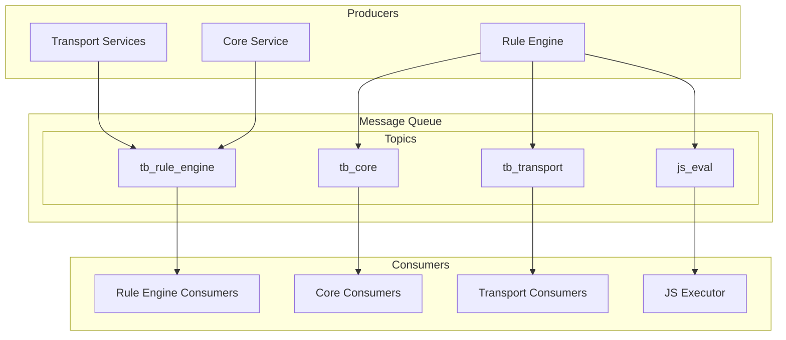

# Message Queue

## Overview

The message queue layer provides asynchronous, decoupled communication between ThingsBoard services. It enables horizontal scaling by distributing message processing across multiple service instances while maintaining message ordering through hash-based partitioning. The platform supports Kafka for production deployments and in-memory queues for development.

## Contents

| Document | Description |
|----------|-------------|
| [Queue Architecture](./queue-architecture.md) | Queue topology, topic structure, providers, and message routing |
| [Partitioning](./partitioning.md) | Hash-based distribution, partition assignment, and rebalancing |
| [Processing Strategies](./processing-strategies.md) | Submit strategies, failure handling, and retry mechanisms |
| [Kafka Configuration](./kafka-configuration.md) | Kafka-specific settings, tuning, and deployment options |

## Key Concepts

- **Service Decoupling**: Services communicate through queues rather than direct calls, enabling independent scaling
- **Hash-Based Partitioning**: Messages distributed using consistent hashing on entity IDs for ordering guarantees
- **Tenant Isolation**: Isolated tenants can have dedicated queue topics preventing noisy neighbor effects
- **Multiple Providers**: Kafka for production, in-memory for testing/single-node setups
- **Protocol Buffers**: Efficient binary serialization for inter-service messages

## Queue Architecture

## See Also

- [Microservices Architecture](../11-microservices/README.md) - Service communication patterns
- [Rule Engine](../04-rule-engine/README.md) - Message processing pipelines
- [Transport Layer](../05-transport-layer/README.md) - Device message ingestion
- [Multi-Tenancy](../01-architecture/multi-tenancy.md) - Tenant queue isolation
