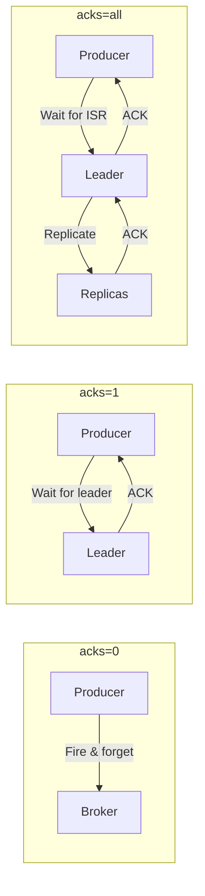
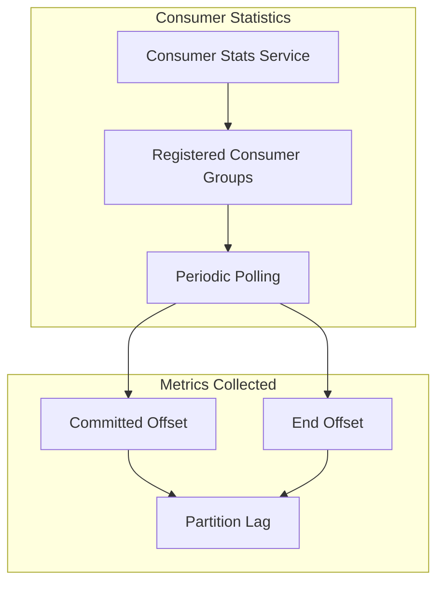

# Kafka Configuration

## Overview

Apache Kafka is the recommended message queue for production ThingsBoard deployments. This document details all Kafka-specific configuration options, including producer and consumer settings, SSL/TLS encryption, Confluent Cloud integration, topic configuration, and consumer statistics monitoring.

## Connection Settings

### Bootstrap Servers

| Variable | Default | Description |
|----------|---------|-------------|
| `queue.kafka.bootstrap.servers` | Required | Comma-separated list of Kafka broker addresses |

```yaml
queue:
  kafka:
    bootstrap.servers: "kafka1:9092,kafka2:9092,kafka3:9092"
```

### Request Timeout

| Variable | Default | Description |
|----------|---------|-------------|
| `queue.kafka.request.timeout.ms` | 30000 | Request timeout in milliseconds |
| `queue.kafka.session.timeout.ms` | 10000 | Consumer session timeout |

## SSL/TLS Configuration

### Enable SSL

```yaml
queue:
  kafka:
    ssl:
      enabled: true
      truststore:
        location: "/path/to/truststore.jks"
        password: "truststore-password"
      keystore:
        location: "/path/to/keystore.jks"
        password: "keystore-password"
      key:
        password: "key-password"
```

### SSL Settings

| Variable | Default | Description |
|----------|---------|-------------|
| `queue.kafka.ssl.enabled` | false | Enable SSL/TLS encryption |
| `queue.kafka.ssl.truststore.location` | (empty) | Path to truststore file |
| `queue.kafka.ssl.truststore.password` | (empty) | Truststore password |
| `queue.kafka.ssl.keystore.location` | (empty) | Path to keystore file |
| `queue.kafka.ssl.keystore.password` | (empty) | Keystore password |
| `queue.kafka.ssl.key.password` | (empty) | Private key password |

## Confluent Cloud Integration

For managed Kafka services like Confluent Cloud:

```yaml
queue:
  kafka:
    use_confluent_cloud: true
    confluent:
      ssl.algorithm: "https"
      sasl.mechanism: "PLAIN"
      sasl.config: "org.apache.kafka.common.security.plain.PlainLoginModule required username='API_KEY' password='API_SECRET';"
      security.protocol: "SASL_SSL"
```

### Confluent Settings

| Variable | Default | Description |
|----------|---------|-------------|
| `queue.kafka.use_confluent_cloud` | false | Enable Confluent Cloud support |
| `queue.kafka.confluent.ssl.algorithm` | (empty) | SSL algorithm |
| `queue.kafka.confluent.sasl.mechanism` | (empty) | SASL mechanism (PLAIN, SCRAM-SHA-256) |
| `queue.kafka.confluent.sasl.config` | (empty) | JAAS configuration string |
| `queue.kafka.confluent.security.protocol` | (empty) | Security protocol |

## Producer Configuration

### Core Producer Settings

```yaml
queue:
  kafka:
    acks: all
    retries: 1
    compression.type: none
    batch.size: 16384
    linger.ms: 1
    max.request.size: 1048576
    max.in.flight.requests.per.connection: 5
    buffer.memory: 33554432
```

### Producer Settings Reference

| Variable | Default | Description |
|----------|---------|-------------|
| `queue.kafka.acks` | all | Acknowledgment level (0, 1, all) |
| `queue.kafka.retries` | 1 | Number of retries on failure |
| `queue.kafka.compression.type` | none | Compression codec (none, gzip, snappy, lz4, zstd) |
| `queue.kafka.batch.size` | 16384 | Batch size in bytes |
| `queue.kafka.linger.ms` | 1 | Wait time for batching (ms) |
| `queue.kafka.max.request.size` | 1048576 | Maximum request size (1 MB) |
| `queue.kafka.max.in.flight.requests.per.connection` | 5 | Unacknowledged requests per connection |
| `queue.kafka.buffer.memory` | 33554432 | Total producer buffer memory (32 MB) |

### Acknowledgment Levels



| Value | Durability | Latency | Description |
|-------|------------|---------|-------------|
| 0 | None | Lowest | No acknowledgment |
| 1 | Leader only | Medium | Leader acknowledgment |
| all | Full ISR | Highest | All in-sync replicas |

### Compression Options

| Type | CPU | Compression Ratio | Use Case |
|------|-----|-------------------|----------|
| none | None | 1:1 | Low latency |
| gzip | High | Best | Bandwidth constrained |
| snappy | Low | Good | Balanced |
| lz4 | Very Low | Good | High throughput |
| zstd | Medium | Excellent | Best compression |

## Consumer Configuration

### Core Consumer Settings

```yaml
queue:
  kafka:
    auto_offset_reset: earliest
    max_poll_records: 8192
    max_poll_interval_ms: 300000
    max_partition_fetch_bytes: 16777216
    fetch_max_bytes: 134217728
```

### Consumer Settings Reference

| Variable | Default | Description |
|----------|---------|-------------|
| `queue.kafka.auto_offset_reset` | earliest | Offset reset behavior |
| `queue.kafka.max_poll_records` | 8192 | Maximum records per poll |
| `queue.kafka.max_poll_interval_ms` | 300000 | Maximum poll interval (5 min) |
| `queue.kafka.max_partition_fetch_bytes` | 16777216 | Max bytes per partition (16 MB) |
| `queue.kafka.fetch_max_bytes` | 134217728 | Max fetch bytes (128 MB) |
| `queue.kafka.session.timeout.ms` | 10000 | Session timeout (10 sec) |

### Auto Offset Reset Options

| Value | Behavior |
|-------|----------|
| earliest | Start from beginning of topic |
| latest | Start from end of topic |
| none | Throw error if no offset |

### Per-Topic Consumer Properties

Override consumer settings for specific topics:

```yaml
queue:
  kafka:
    consumer-properties-per-topic:
      tb_ota_package:
        max.poll.records: 10
      tb_version_control:
        max.poll.records: 100
      tb_edge:
        max.poll.records: 100
      tb_housekeeper:
        max.poll.records: 100
```

## Topic Configuration

### Replication Factor

| Variable | Default | Description |
|----------|---------|-------------|
| `queue.kafka.replication_factor` | 1 | Topic replication factor |

For production, set to at least 3:

```yaml
queue:
  kafka:
    replication_factor: 3
```

### Topic Properties

Configure topic-specific settings inline:

```yaml
queue:
  kafka:
    topic-properties:
      core: "retention.ms:604800000;segment.bytes:52428800"
      rule-engine: "retention.ms:604800000;segment.bytes:52428800"
      transport-api: "retention.ms:604800000;segment.bytes:52428800"
      notifications: "retention.ms:604800000;segment.bytes:52428800"
      js-executor: "retention.ms:86400000;segment.bytes:52428800"
      ota-updates: "retention.ms:604800000;segment.bytes:52428800"
      version-control: "retention.ms:604800000;segment.bytes:52428800"
      edge: "retention.ms:604800000;segment.bytes:52428800"
      edge-event: "retention.ms:604800000;segment.bytes:52428800"
      housekeeper: "retention.ms:604800000;segment.bytes:52428800"
      housekeeper-reprocessing: "retention.ms:7776000000;segment.bytes:52428800"
      calculated-field: "retention.ms:604800000;segment.bytes:52428800"
      calculated-field-state: "retention.ms:604800000;segment.bytes:52428800"
      edqs-events: "retention.ms:86400000;segment.bytes:52428800"
      edqs-state: "retention.ms:-1;cleanup.policy:compact"
      edqs-requests: "retention.ms:180000;retention.bytes:1073741824"
      tasks: "retention.ms:604800000;segment.bytes:52428800"
```

### Default Topic Configurations

| Topic Type | Retention | Segment Size | Notes |
|------------|-----------|--------------|-------|
| Core | 7 days | 50 MB | General platform messages |
| Rule Engine | 7 days | 50 MB | Rule chain processing |
| Transport API | 7 days | 50 MB | Device API messages |
| JS Executor | 1 day | 50 MB | Script execution |
| Housekeeper | 7 days | 50 MB | Cleanup tasks |
| Housekeeper Reprocessing | 90 days | 50 MB | Failed task retry |
| EDQS Events | 1 day | 50 MB | Entity changes |
| EDQS State | Infinite | Compacted | State snapshots |
| Tasks | 7 days | 50 MB | Background jobs |

## Consumer Statistics Service

### Enable Consumer Monitoring

```yaml
queue:
  kafka:
    consumer-stats:
      enabled: true
      print-interval-ms: 60000
      kafka-response-timeout-ms: 1000
```

### Statistics Settings

| Variable | Default | Description |
|----------|---------|-------------|
| `queue.kafka.consumer-stats.enabled` | true | Enable consumer lag tracking |
| `queue.kafka.consumer-stats.print-interval-ms` | 60000 | Log interval (60 seconds) |
| `queue.kafka.consumer-stats.kafka-response-timeout-ms` | 1000 | Stats query timeout |

### Statistics Output

The consumer statistics service logs partition lag for all registered consumer groups:

```
[groupId] Topic partitions with lag: [
  [topic=tb_rule_engine, partition=0, committedOffset=1000, endOffset=1050, lag=50],
  [topic=tb_rule_engine, partition=1, committedOffset=2000, endOffset=2100, lag=100]
]
```

### Monitoring Metrics



| Metric | Description | Alert Threshold |
|--------|-------------|-----------------|
| Committed Offset | Last committed consumer offset | N/A |
| End Offset | Latest message offset in partition | N/A |
| Lag | End offset - Committed offset | > 10000 |

## Topic Cache Configuration

### Cache Settings

| Variable | Default | Description |
|----------|---------|-------------|
| `queue.kafka.topics_cache_ttl_ms` | 300000 | Topic cache TTL (5 minutes) |

The topic cache reduces broker queries by caching topic existence checks.

## Admin Operations

### Topic Management

The Kafka admin client handles:

- Topic creation with configured replication and partitions
- Topic deletion
- Consumer group offset synchronization
- Consumer lag calculation

### Timeout Configuration

| Operation | Timeout | Description |
|-----------|---------|-------------|
| Topic creation | request.timeout.ms | Create new topic |
| Topic deletion | request.timeout.ms | Delete topic |
| Consumer offset fetch | kafka-response-timeout-ms | Stats queries |
| List topics | request.timeout.ms | Topic enumeration |

## Message Serialization

### Default Serializers

| Component | Serializer |
|-----------|------------|
| Key | StringSerializer |
| Value | ByteArraySerializer |

### Custom Headers

When debug logging is enabled, producers inject tracing headers:

| Header | Description |
|--------|-------------|
| `_producerId` | Client ID of producer |
| `_threadName` | Thread name (debug) |
| `_stackTrace*` | Call stack (trace level) |

## Performance Tuning

### High Throughput Configuration

```yaml
queue:
  kafka:
    batch.size: 65536
    linger.ms: 5
    compression.type: lz4
    max_poll_records: 16384
    buffer.memory: 67108864
```

### Low Latency Configuration

```yaml
queue:
  kafka:
    batch.size: 16384
    linger.ms: 0
    compression.type: none
    acks: 1
```

### High Reliability Configuration

```yaml
queue:
  kafka:
    acks: all
    retries: 3
    replication_factor: 3
    min.insync.replicas: 2
```

## Additional Properties

### Inline Properties

For properties not explicitly supported, use inline configuration:

```yaml
queue:
  kafka:
    other-inline: "property1:value1;property2:value2"
```

### Common Additional Properties

| Property | Description |
|----------|-------------|
| `min.insync.replicas` | Minimum replicas for acks=all |
| `unclean.leader.election.enable` | Allow unclean leader election |
| `message.max.bytes` | Maximum message size on broker |

## Troubleshooting

### Connection Issues

| Symptom | Cause | Solution |
|---------|-------|----------|
| Connection refused | Broker not running | Start Kafka brokers |
| SSL handshake failed | Certificate mismatch | Verify SSL configuration |
| Authentication failed | Invalid credentials | Check SASL configuration |

### Performance Issues

| Symptom | Cause | Solution |
|---------|-------|----------|
| High producer latency | Low batch.size | Increase batch.size |
| Consumer lag | Slow processing | Add consumers, increase partitions |
| Out of memory | Large buffer.memory | Reduce buffer.memory or add heap |

### Consumer Group Issues

| Symptom | Cause | Solution |
|---------|-------|----------|
| Rebalancing storm | Frequent consumer restarts | Stabilize services |
| Stuck consumer | max.poll.interval exceeded | Increase timeout or optimize processing |

## See Also

- [Queue Architecture](./queue-architecture.md) - Overall queue design
- [Partitioning](./partitioning.md) - Partition strategies
- [Processing Strategies](./processing-strategies.md) - Submit and retry strategies
