# Queue Partitioning

## Overview

Queue partitioning is fundamental to ThingsBoard's scalability, enabling parallel processing while maintaining message ordering guarantees. Messages are distributed across partitions using hash-based algorithms, ensuring that related messages (same entity or tenant) are processed by the same consumer. This design supports both horizontal scaling and tenant isolation.

## Key Behaviors

1. **Hash-Based Distribution**: Messages are assigned to partitions using consistent hashing of entity or tenant IDs.

2. **Per-Entity Ordering**: Messages for the same entity always go to the same partition, guaranteeing processing order.

3. **Dynamic Rebalancing**: When services join or leave, partitions are automatically redistributed.

4. **Tenant Isolation**: Isolated tenants can have dedicated partitions and processing resources.

5. **Consumer-Per-Partition**: Each partition can have a dedicated consumer thread for maximum parallelism.

6. **Service Discovery Integration**: Partition assignment is coordinated through the service registry.

## Partition Architecture

### Partition Distribution Model

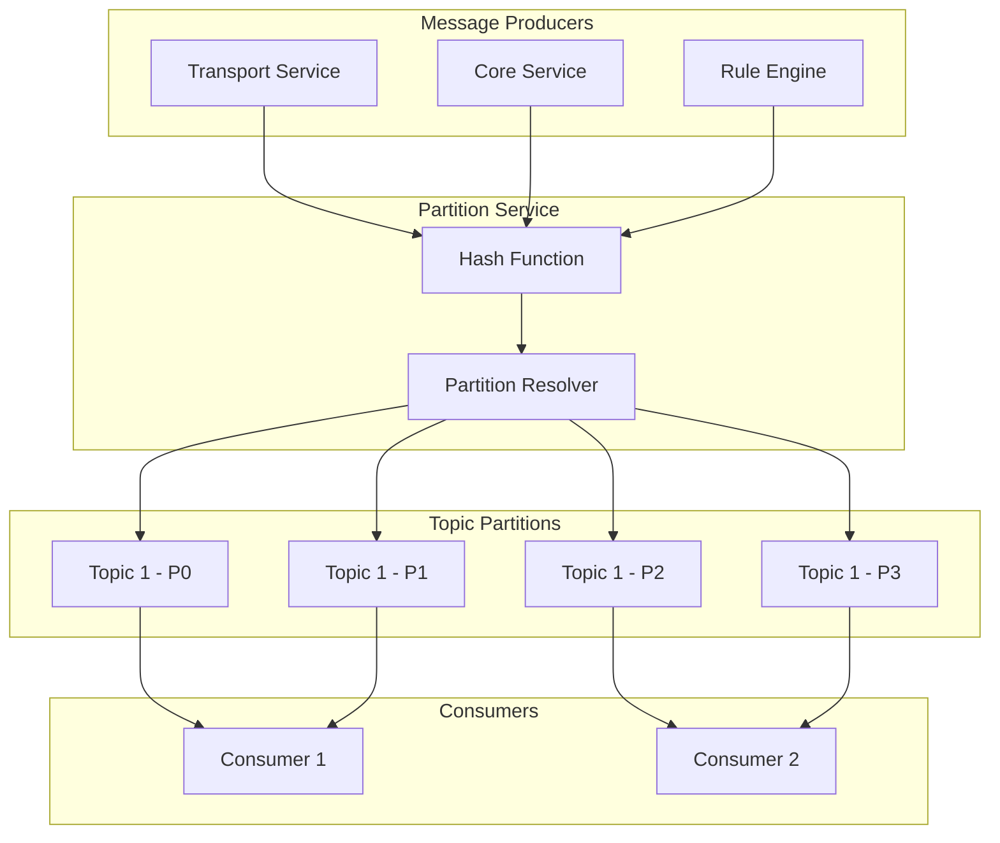
```mermaid
graph TB
    subgraph "Message Producers"
        P1[Transport Service]
        P2[Core Service]
        P3[Rule Engine]
    end

    subgraph "Partition Service"
        HASH[Hash Function]
        RESOLVE[Partition Resolver]
    end

    subgraph "Topic Partitions"
        T1P0[Topic 1 - P0]
        T1P1[Topic 1 - P1]
        T1P2[Topic 1 - P2]
        T1P3[Topic 1 - P3]
    end

    subgraph "Consumers"
        C1[Consumer 1]
        C2[Consumer 2]
    end

    P1 --> HASH
    P2 --> HASH
    P3 --> HASH
    HASH --> RESOLVE
    RESOLVE --> T1P0
    RESOLVE --> T1P1
    RESOLVE --> T1P2
    RESOLVE --> T1P3

    T1P0 --> C1
    T1P1 --> C1
    T1P2 --> C2
    T1P3 --> C2
```

### Partition Calculation

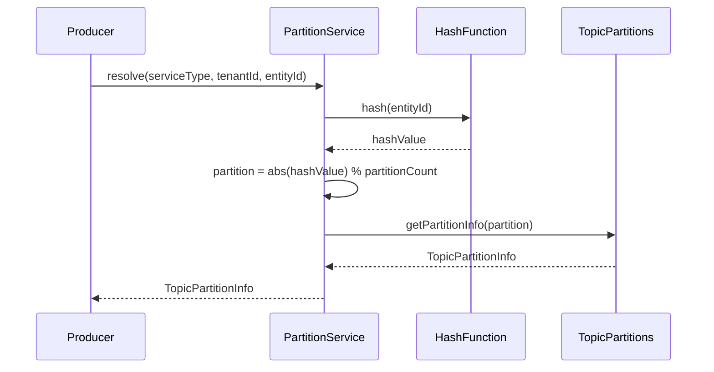
```mermaid
sequenceDiagram
    participant Producer
    participant PartitionService
    participant HashFunction
    participant TopicPartitions

    Producer->>PartitionService: resolve(serviceType, tenantId, entityId)
    PartitionService->>HashFunction: hash(entityId)
    HashFunction-->>PartitionService: hashValue

    PartitionService->>PartitionService: partition = abs(hashValue) % partitionCount
    PartitionService->>TopicPartitions: getPartitionInfo(partition)
    TopicPartitions-->>PartitionService: TopicPartitionInfo

    PartitionService-->>Producer: TopicPartitionInfo
```

## Partition Strategies

### Entity-Based Partitioning

The default strategy for most message types:

```
partition = abs(hash(entityId)) % partitionCount
```

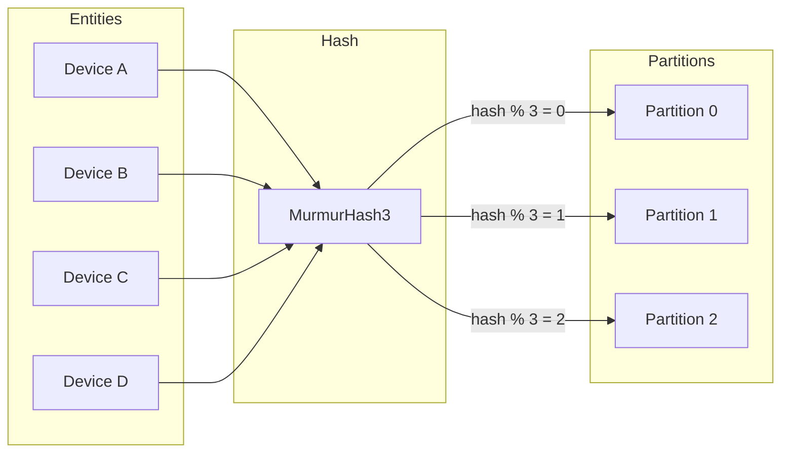
```mermaid
graph LR
    subgraph "Entities"
        E1[Device A]
        E2[Device B]
        E3[Device C]
        E4[Device D]
    end

    subgraph "Hash"
        H[MurmurHash3]
    end

    subgraph "Partitions"
        P0[Partition 0]
        P1[Partition 1]
        P2[Partition 2]
    end

    E1 --> H
    E2 --> H
    E3 --> H
    E4 --> H

    H --> |"hash % 3 = 0"| P0
    H --> |"hash % 3 = 1"| P1
    H --> |"hash % 3 = 2"| P2
```

**Guarantees:**
- Same entity → same partition → same consumer
- Message ordering preserved per entity
- Even distribution across partitions (statistically)

### Tenant-Based Partitioning

Used for rule engine queues with tenant context:

```
partition = abs((hash(tenantId) + partitionIndex) % serverCount)
```

```mermaid
graph TB
    subgraph "Tenants"
        T1[Tenant A]
        T2[Tenant B]
    end

    subgraph "Hash + Server Selection"
        H1[hash(TenantA) = 5]
        H2[hash(TenantB) = 8]
    end

    subgraph "Servers (3 total)"
        S0[Server 0]
        S1[Server 1]
        S2[Server 2]
    end

    T1 --> H1
    T2 --> H2
    H1 --> |"5 % 3 = 2"| S2
    H2 --> |"8 % 3 = 2"| S2
```

### Round-Robin Partitioning

Used for core and version control services:

```
server = servers.get(partition % serverCount)
```

| Service Type | Partitioning Strategy |
|--------------|----------------------|
| TB_RULE_ENGINE | Tenant-based hash |
| TB_CORE | Round-robin |
| TB_VC_EXECUTOR | Round-robin |
| TB_TRANSPORT | Entity-based hash |
| EDQS | Label-based grouping |

## Topic Structure

### Core Topics

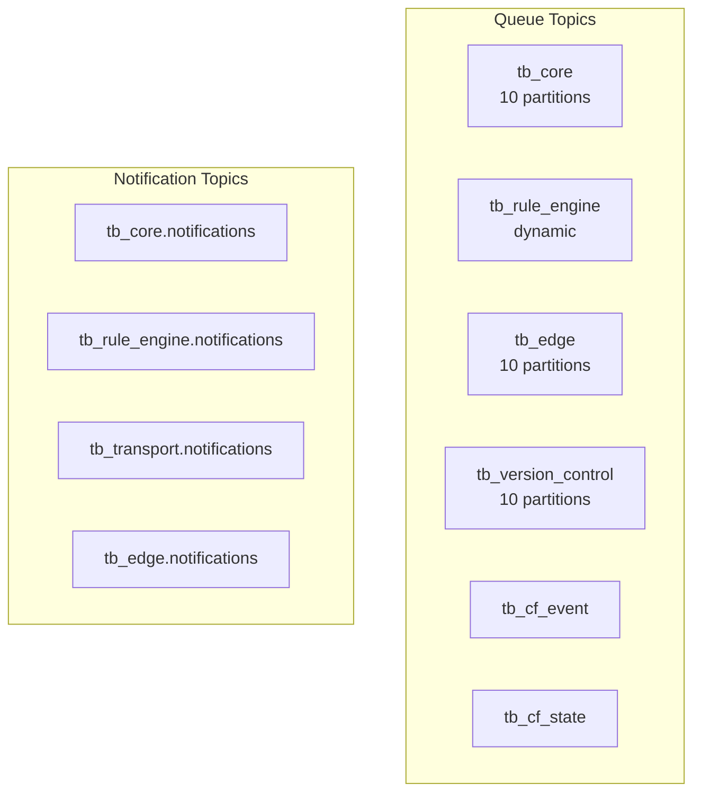
```mermaid
graph TB
    subgraph "Queue Topics"
        CORE[tb_core<br/>10 partitions]
        RE[tb_rule_engine<br/>dynamic]
        EDGE[tb_edge<br/>10 partitions]
        VC[tb_version_control<br/>10 partitions]
        CF_EVENT[tb_cf_event]
        CF_STATE[tb_cf_state]
    end

    subgraph "Notification Topics"
        N_CORE[tb_core.notifications]
        N_RE[tb_rule_engine.notifications]
        N_TRANS[tb_transport.notifications]
        N_EDGE[tb_edge.notifications]
    end
```

### Topic Configuration

| Topic | Default Partitions | Purpose |
|-------|-------------------|---------|
| tb_core | 10 | Core service messages |
| tb_rule_engine | Per queue config | Rule chain processing |
| tb_edge | 10 | Edge gateway messages |
| tb_version_control | 10 | Version control operations |
| tb_cf_event | Configurable | Calculated field events |
| tb_cf_state | Configurable | Calculated field state |

### Topic Naming Convention

```mermaid
graph LR
    subgraph "Standard Topic"
        BASE[tb_rule_engine]
    end

    subgraph "Isolated Tenant Topic"
        ISO[tb_rule_engine.isolated.{tenantId}]
    end

    subgraph "With Prefix"
        PREFIX[{prefix}.tb_rule_engine]
    end

    subgraph "With Partition (internal)"
        PART[tb_rule_engine.{partition}]
    end
```

| Pattern | Example | Use Case |
|---------|---------|----------|
| `{topic}` | `tb_core` | Standard topic |
| `{topic}.isolated.{tenantId}` | `tb_rule_engine.isolated.abc123` | Isolated tenant |
| `{prefix}.{topic}` | `prod.tb_core` | Environment prefix |

## Consumer Groups

### Consumer Group Architecture

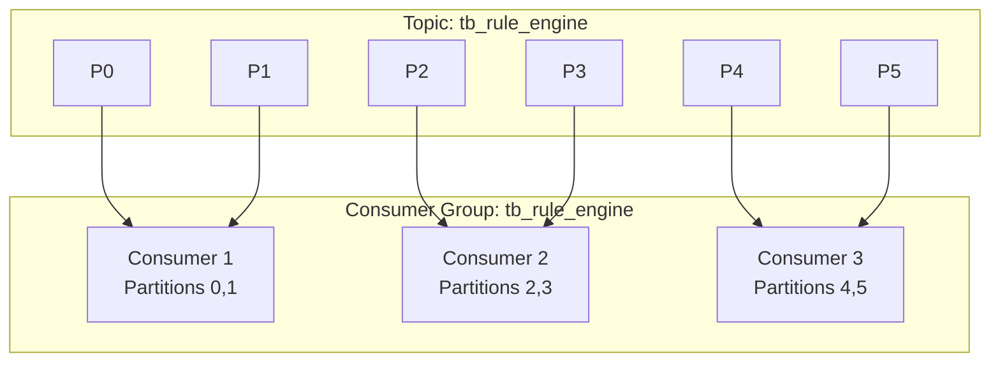
```mermaid
graph TB
    subgraph "Consumer Group: tb_rule_engine"
        C1[Consumer 1<br/>Partitions 0,1]
        C2[Consumer 2<br/>Partitions 2,3]
        C3[Consumer 3<br/>Partitions 4,5]
    end

    subgraph "Topic: tb_rule_engine"
        P0[P0]
        P1[P1]
        P2[P2]
        P3[P3]
        P4[P4]
        P5[P5]
    end

    P0 --> C1
    P1 --> C1
    P2 --> C2
    P3 --> C2
    P4 --> C3
    P5 --> C3
```

### Consumer Group ID Format

```
{prefix}{servicePrefix}{queueName}{-isolated-{tenantId}}-consumer{-{partitionId}}
```

| Component | Description | Example |
|-----------|-------------|---------|
| prefix | Optional environment prefix | `prod.` |
| servicePrefix | Service type identifier | `re.` |
| queueName | Queue name | `Main` |
| isolated | Tenant isolation suffix | `-isolated-abc123` |
| partitionId | Per-partition consumer | `-0` |

### Consumer Modes

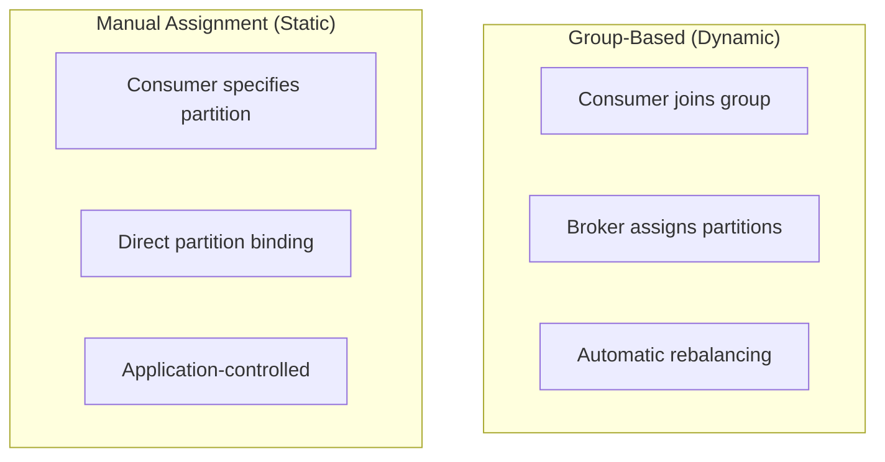
```mermaid
graph TB
    subgraph "Group-Based (Dynamic)"
        G1[Consumer joins group]
        G2[Broker assigns partitions]
        G3[Automatic rebalancing]
    end

    subgraph "Manual Assignment (Static)"
        M1[Consumer specifies partition]
        M2[Direct partition binding]
        M3[Application-controlled]
    end
```

| Mode | Assignment | Rebalancing | Use Case |
|------|------------|-------------|----------|
| Group-based | Broker-managed | Automatic | Simple deployments |
| Manual | Application-managed | Controlled | Per-partition consumers |

### Per-Partition Consumers

When `consumer-per-partition=true` (default):

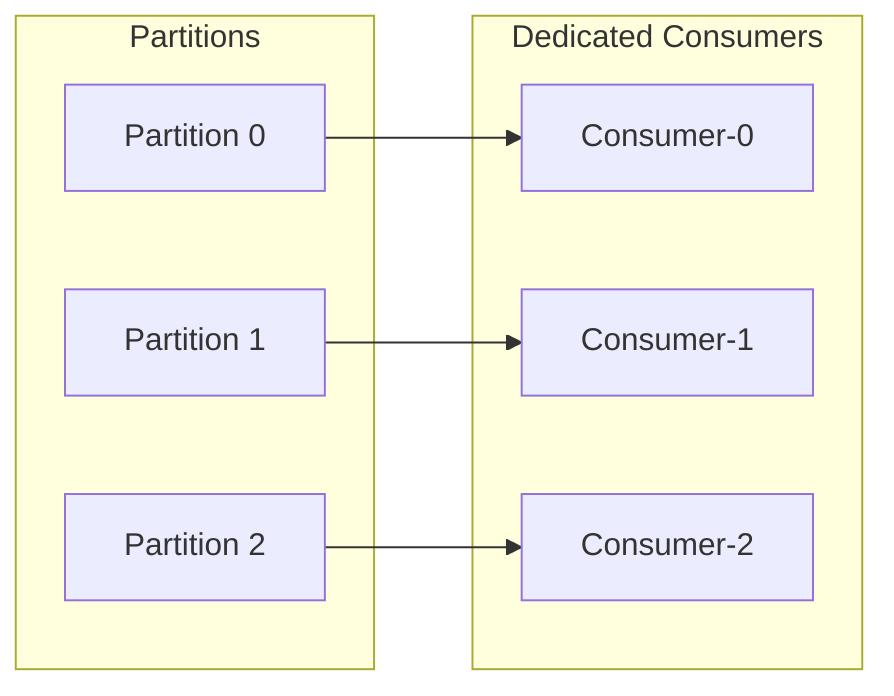
```mermaid
graph LR
    subgraph "Partitions"
        P0[Partition 0]
        P1[Partition 1]
        P2[Partition 2]
    end

    subgraph "Dedicated Consumers"
        C0[Consumer-0]
        C1[Consumer-1]
        C2[Consumer-2]
    end

    P0 --> C0
    P1 --> C1
    P2 --> C2
```

**Benefits:**
- Maximum parallelism
- Predictable resource allocation
- Fine-grained control over partition assignment
- Independent consumer lifecycle

## Partition Assignment

### Assignment Algorithm

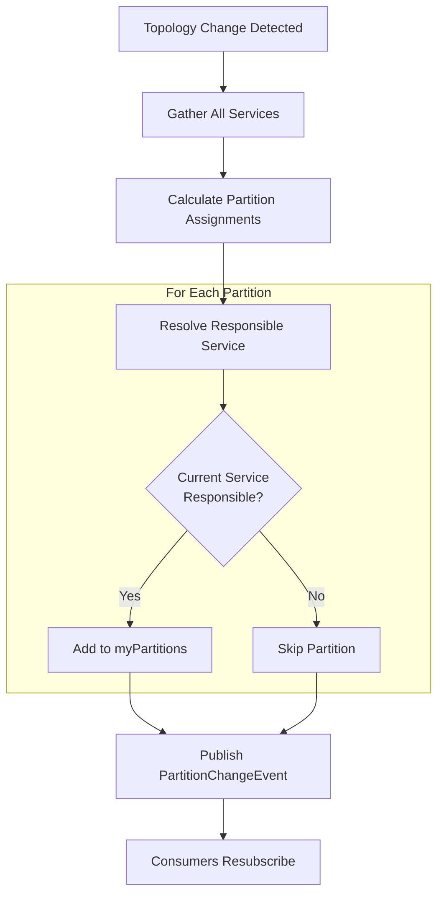
```mermaid
flowchart TB
    START[Topology Change Detected]
    GATHER[Gather All Services]
    CALC[Calculate Partition Assignments]

    subgraph "For Each Partition"
        RESOLVE[Resolve Responsible Service]
        CHECK{Current Service<br/>Responsible?}
        ADD[Add to myPartitions]
        SKIP[Skip Partition]
    end

    PUBLISH[Publish PartitionChangeEvent]
    RESUBSCRIBE[Consumers Resubscribe]

    START --> GATHER
    GATHER --> CALC
    CALC --> RESOLVE
    RESOLVE --> CHECK
    CHECK -->|Yes| ADD
    CHECK -->|No| SKIP
    ADD --> PUBLISH
    SKIP --> PUBLISH
    PUBLISH --> RESUBSCRIBE
```

### Service-to-Partition Mapping

For Rule Engine partitions:

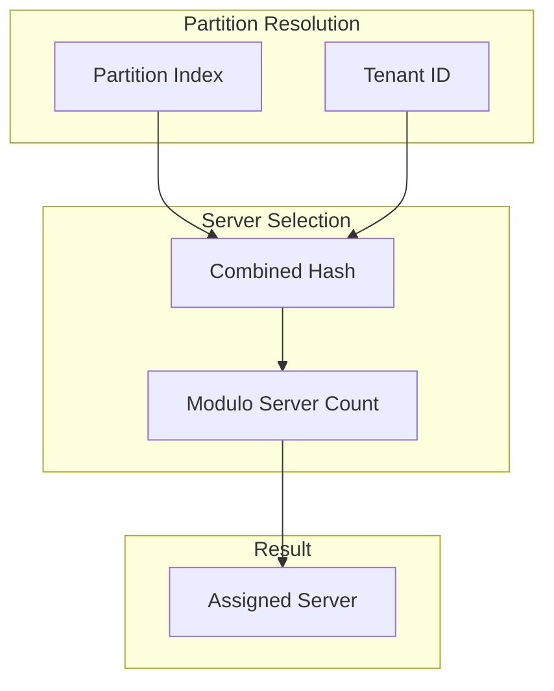
```mermaid
graph TB
    subgraph "Partition Resolution"
        P[Partition Index]
        T[Tenant ID]
    end

    subgraph "Server Selection"
        HASH[Combined Hash]
        MOD[Modulo Server Count]
    end

    subgraph "Result"
        S[Assigned Server]
    end

    P --> HASH
    T --> HASH
    HASH --> MOD
    MOD --> S
```

```
serverIndex = abs((hash(tenantId) + partitionIndex) % serverCount)
assignedServer = servers.get(serverIndex)
```

### Partition Ownership

| Service Type | Assignment Rule |
|--------------|----------------|
| TB_RULE_ENGINE | Hash(tenant + partition) % servers |
| TB_CORE | partition % servers |
| TB_VC | partition % servers |
| TB_TRANSPORT | partition % servers |

## Message Ordering

### Ordering Guarantees

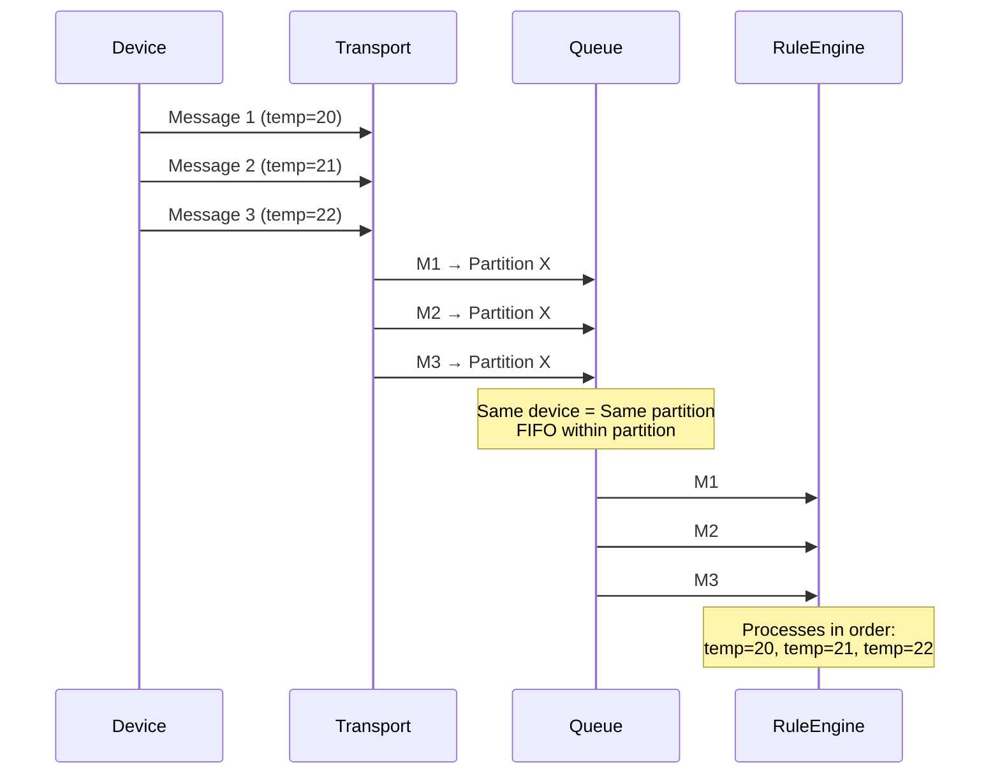
```mermaid
sequenceDiagram
    participant Device
    participant Transport
    participant Queue
    participant RuleEngine

    Device->>Transport: Message 1 (temp=20)
    Device->>Transport: Message 2 (temp=21)
    Device->>Transport: Message 3 (temp=22)

    Transport->>Queue: M1 → Partition X
    Transport->>Queue: M2 → Partition X
    Transport->>Queue: M3 → Partition X

    Note over Queue: Same device = Same partition<br/>FIFO within partition

    Queue->>RuleEngine: M1
    Queue->>RuleEngine: M2
    Queue->>RuleEngine: M3

    Note over RuleEngine: Processes in order:<br/>temp=20, temp=21, temp=22
```

### Ordering Scope

| Scope | Guaranteed | Mechanism |
|-------|------------|-----------|
| Same entity | Yes | Hash to same partition |
| Same tenant | No* | Different entities may be in different partitions |
| Cross-partition | No | Partitions processed independently |

*Tenant-level ordering possible with single partition per tenant (reduces parallelism)

### Broadcast Messages

For messages that need to reach all partitions:

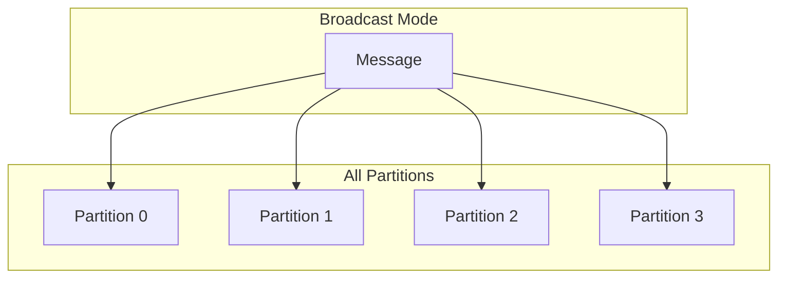
```mermaid
graph TB
    subgraph "Broadcast Mode"
        MSG[Message]
    end

    subgraph "All Partitions"
        P0[Partition 0]
        P1[Partition 1]
        P2[Partition 2]
        P3[Partition 3]
    end

    MSG --> P0
    MSG --> P1
    MSG --> P2
    MSG --> P3
```

When `duplicateMsgToAllPartitions=true`:
- Message sent to every partition
- All consumers receive the message
- Ordering not guaranteed across partitions
- Use case: Configuration updates, cache invalidation

## Rebalancing

### Rebalancing Triggers

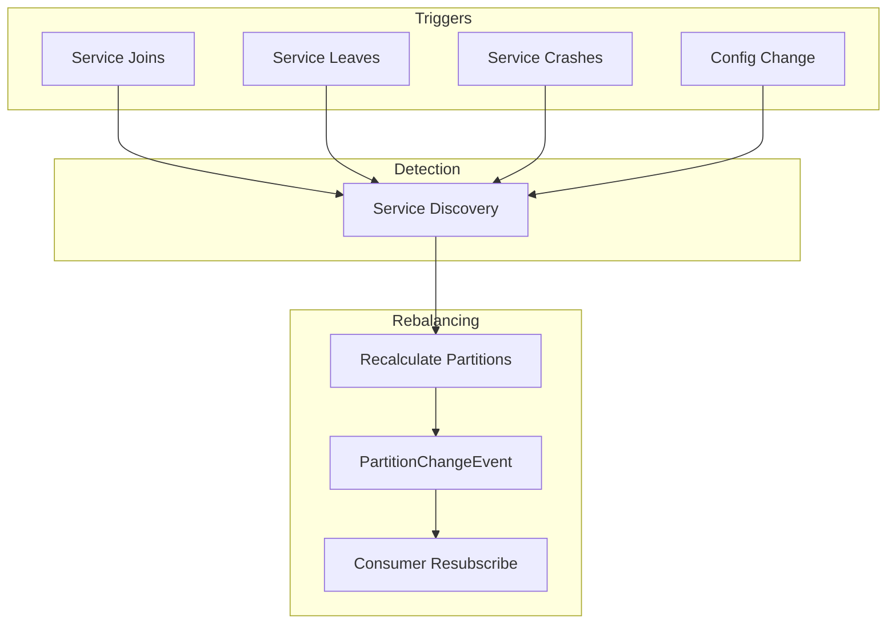
```mermaid
graph TB
    subgraph "Triggers"
        JOIN[Service Joins]
        LEAVE[Service Leaves]
        CRASH[Service Crashes]
        CONFIG[Config Change]
    end

    subgraph "Detection"
        DISC[Service Discovery]
    end

    subgraph "Rebalancing"
        RECALC[Recalculate Partitions]
        EVENT[PartitionChangeEvent]
        RESUB[Consumer Resubscribe]
    end

    JOIN --> DISC
    LEAVE --> DISC
    CRASH --> DISC
    CONFIG --> DISC
    DISC --> RECALC
    RECALC --> EVENT
    EVENT --> RESUB
```

### Rebalancing Flow

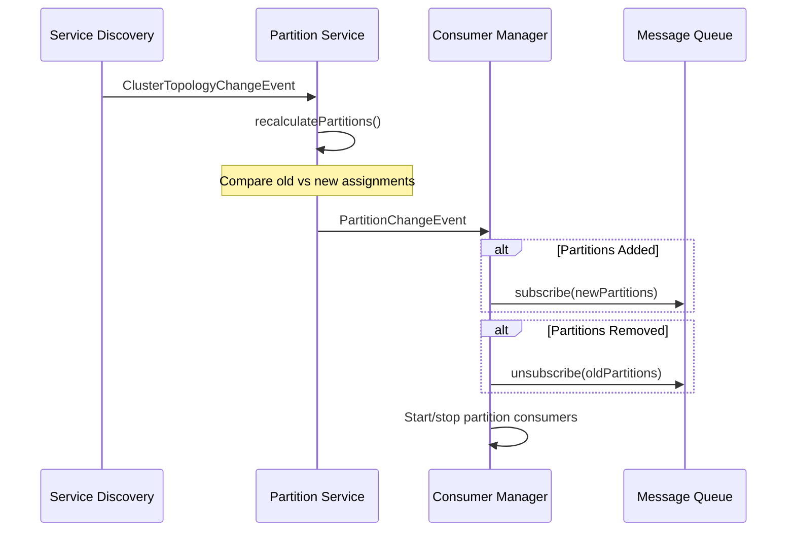
```mermaid
sequenceDiagram
    participant Discovery as Service Discovery
    participant Partition as Partition Service
    participant Consumer as Consumer Manager
    participant Queue as Message Queue

    Discovery->>Partition: ClusterTopologyChangeEvent
    Partition->>Partition: recalculatePartitions()

    Note over Partition: Compare old vs new assignments

    Partition->>Consumer: PartitionChangeEvent

    alt Partitions Added
        Consumer->>Queue: subscribe(newPartitions)
    end

    alt Partitions Removed
        Consumer->>Queue: unsubscribe(oldPartitions)
    end

    Consumer->>Consumer: Start/stop partition consumers
```

### Partition Change Event

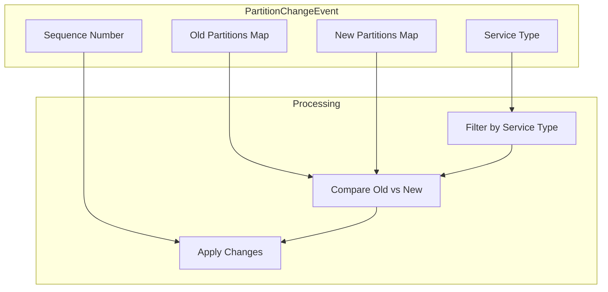
```mermaid
graph TB
    subgraph "PartitionChangeEvent"
        ST[Service Type]
        OLD[Old Partitions Map]
        NEW[New Partitions Map]
        SEQ[Sequence Number]
    end

    subgraph "Processing"
        FILTER[Filter by Service Type]
        COMPARE[Compare Old vs New]
        APPLY[Apply Changes]
    end

    ST --> FILTER
    OLD --> COMPARE
    NEW --> COMPARE
    SEQ --> APPLY
    FILTER --> COMPARE
    COMPARE --> APPLY
```

### Handling During Rebalance

| Scenario | Behavior |
|----------|----------|
| Message in-flight | Processed by original consumer |
| New partition assigned | Consumer starts polling |
| Partition revoked | Consumer stops, offsets committed |
| Consumer crash | Messages redelivered after timeout |

## Tenant Isolation

### Isolation Model

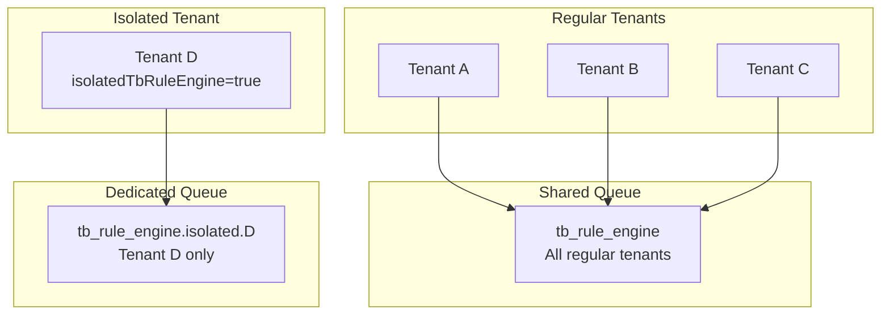
```mermaid
graph TB
    subgraph "Regular Tenants"
        RT1[Tenant A]
        RT2[Tenant B]
        RT3[Tenant C]
    end

    subgraph "Shared Queue"
        SQ[tb_rule_engine<br/>All regular tenants]
    end

    subgraph "Isolated Tenant"
        IT[Tenant D<br/>isolatedTbRuleEngine=true]
    end

    subgraph "Dedicated Queue"
        DQ[tb_rule_engine.isolated.D<br/>Tenant D only]
    end

    RT1 --> SQ
    RT2 --> SQ
    RT3 --> SQ
    IT --> DQ
```

### Queue Key Resolution

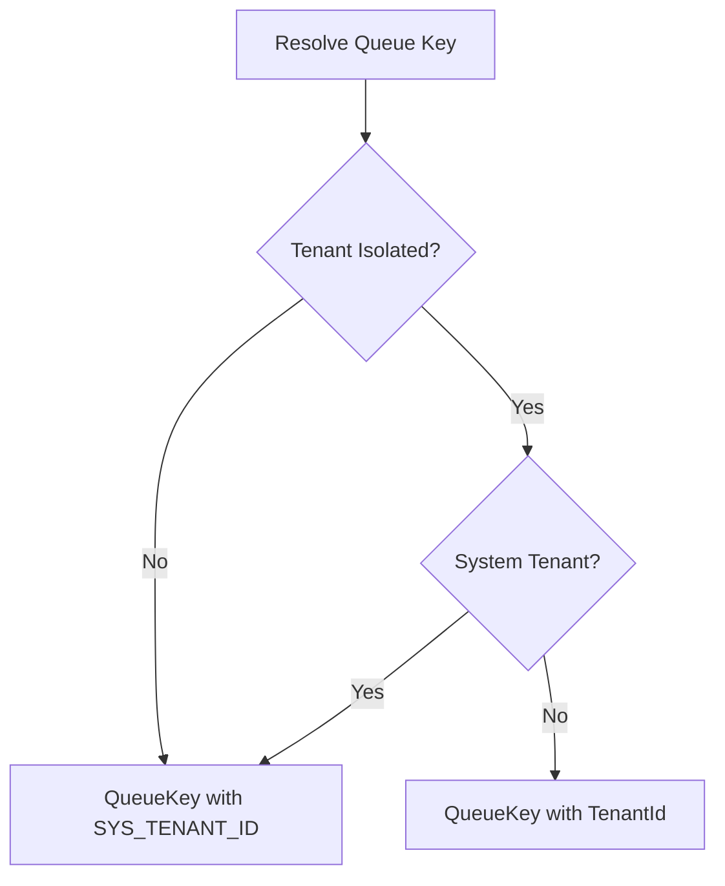
```mermaid
flowchart TB
    START[Resolve Queue Key]
    CHECK_ISO{Tenant Isolated?}
    CHECK_SYS{System Tenant?}

    TENANT_KEY[QueueKey with TenantId]
    SYSTEM_KEY[QueueKey with SYS_TENANT_ID]

    START --> CHECK_ISO
    CHECK_ISO -->|Yes| CHECK_SYS
    CHECK_ISO -->|No| SYSTEM_KEY
    CHECK_SYS -->|Yes| SYSTEM_KEY
    CHECK_SYS -->|No| TENANT_KEY
```

### Dedicated Service Assignment

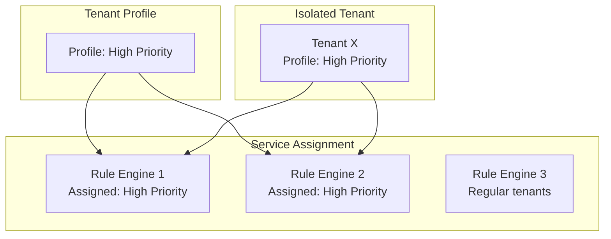
```mermaid
graph TB
    subgraph "Tenant Profile"
        TP[Profile: High Priority]
    end

    subgraph "Service Assignment"
        S1[Rule Engine 1<br/>Assigned: High Priority]
        S2[Rule Engine 2<br/>Assigned: High Priority]
        S3[Rule Engine 3<br/>Regular tenants]
    end

    subgraph "Isolated Tenant"
        IT[Tenant X<br/>Profile: High Priority]
    end

    TP --> S1
    TP --> S2
    IT --> S1
    IT --> S2
```

**Assignment Logic:**
1. Service registers with assigned tenant profiles
2. Isolated tenant messages route to assigned services
3. If no assigned services: falls back to regular services
4. Regular services process non-isolated tenants only

### Topic Naming for Isolation

| Tenant Type | Topic Name |
|-------------|------------|
| Regular | `tb_rule_engine` |
| Isolated | `tb_rule_engine.isolated.{tenantId}` |
| System | `tb_rule_engine` (system queue) |

## Configuration

### Partition Configuration

```yaml
queue:
  # Hash function for partition calculation
  partitions:
    hash_function_name: murmur3_128  # murmur3_128, murmur3_32, sha256

  # Core queue settings
  core:
    topic: tb_core
    partitions: 10
    consumer-per-partition: true

  # Edge queue settings
  edge:
    topic: tb_edge
    partitions: 10

  # Version control queue
  vc:
    topic: tb_version_control
    partitions: 10

  # Entity data query service
  edqs:
    partitions: 12

  # Task processing
  tasks:
    partitions: 12

  # Optional topic prefix
  prefix: ""
```

### Rule Engine Queue Configuration

```yaml
queue:
  rule-engine:
    topic: tb_rule_engine
    queues:
      - name: Main
        topic: tb_rule_engine.main
        partitions: 10
        consumer-per-partition: true
        submit-strategy:
          type: BURST
          batch-size: 1000
        processing-strategy:
          type: SKIP_ALL_FAILURES

      - name: HighPriority
        topic: tb_rule_engine.hp
        partitions: 4
        consumer-per-partition: true
        submit-strategy:
          type: SEQUENTIAL_BY_ORIGINATOR
```

### Hash Function Selection

| Function | Speed | Distribution | Use Case |
|----------|-------|--------------|----------|
| murmur3_128 | Fast | Excellent | Default, recommended |
| murmur3_32 | Fastest | Good | High throughput |
| sha256 | Slower | Excellent | Cryptographic needs |

## Performance Considerations

### Partition Count Guidelines

| Factor | Recommendation |
|--------|----------------|
| Consumer count | partitions >= consumers |
| Message volume | More partitions = more parallelism |
| Ordering needs | Fewer partitions = simpler ordering |
| Rebalancing time | More partitions = longer rebalance |

### Optimal Partition Sizing

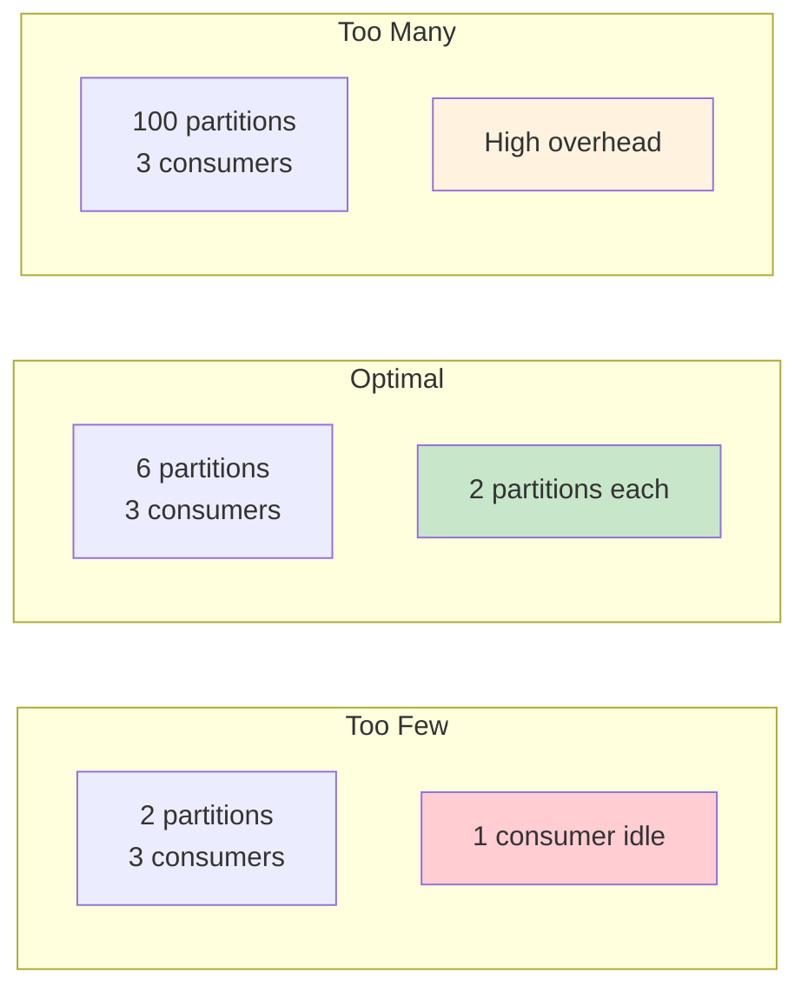
```mermaid
graph LR
    subgraph "Too Few"
        FEW[2 partitions<br/>3 consumers]
        FEW_RESULT[1 consumer idle]
    end

    subgraph "Optimal"
        OPT[6 partitions<br/>3 consumers]
        OPT_RESULT[2 partitions each]
    end

    subgraph "Too Many"
        MANY[100 partitions<br/>3 consumers]
        MANY_RESULT[High overhead]
    end

    style FEW_RESULT fill:#ffcdd2
    style OPT_RESULT fill:#c8e6c9
    style MANY_RESULT fill:#fff3e0
```

### Scaling Partitions

| Scenario | Action |
|----------|--------|
| Adding consumers | No partition change needed (up to partition count) |
| Consumer > partitions | Add more partitions |
| High latency per partition | Add partitions, add consumers |
| Uneven distribution | Check entity ID distribution |

## Troubleshooting

### Common Issues

| Issue | Cause | Solution |
|-------|-------|----------|
| Uneven partition load | Skewed entity distribution | Review hash function, entity IDs |
| Messages out of order | Different entities | Expected behavior; use same entity for ordering |
| Consumer not receiving | Partition not assigned | Check rebalancing, service discovery |
| Rebalancing storms | Frequent service restarts | Stabilize services, increase rebalance timeout |
| Isolated tenant not processing | No assigned services | Check tenant profile, service assignments |

### Monitoring Points

- Partition lag per consumer
- Messages per partition
- Rebalance frequency
- Consumer assignment distribution
- Hash distribution quality

### Debugging Partition Assignment

1. Check service registration in discovery
2. Verify partition count matches configuration
3. Confirm consumer group membership
4. Review partition assignment logs
5. Validate tenant isolation settings

## See Also

- [Message Queue Architecture](./queue-architecture.md) - Queue system overview
- [Microservices](../11-microservices/README.md) - Service architecture
- [Multi-Tenancy](../01-architecture/multi-tenancy.md) - Tenant isolation
- [Rule Engine Overview](../04-rule-engine/README.md) - Rule processing
