# Processing Strategies

## Overview

ThingsBoard's rule engine uses configurable strategies for message submission and failure handling. Submit strategies control how messages are dispatched for processing, while processing strategies define how failures and timeouts are handled. These strategies enable fine-tuned control over throughput, ordering, and reliability.

## Submit Strategies

Submit strategies control how messages from a queue batch are submitted to the rule engine for processing.

### Strategy Types

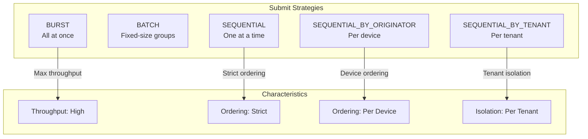

### BURST

Submits all messages immediately without ordering constraints.

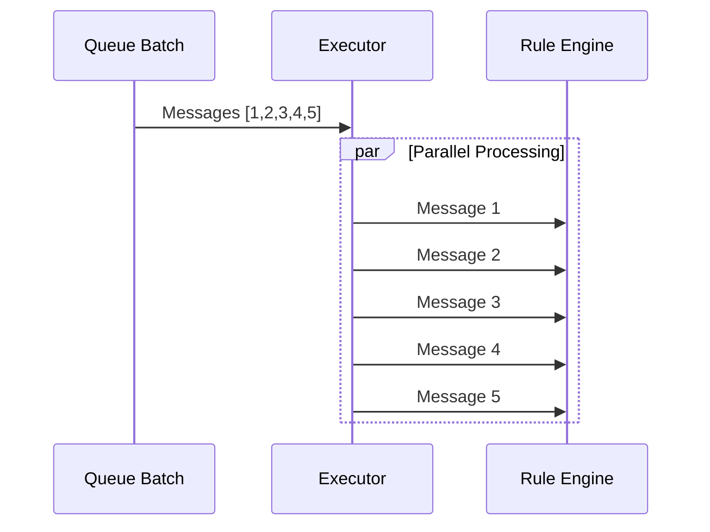

| Aspect | Value |
|--------|-------|
| Throughput | Maximum |
| Ordering | None guaranteed |
| Use Case | High-volume telemetry, non-critical data |

**Configuration:**
```yaml
submit-strategy:
  type: BURST
```

### BATCH

Submits messages in fixed-size sequential batches.

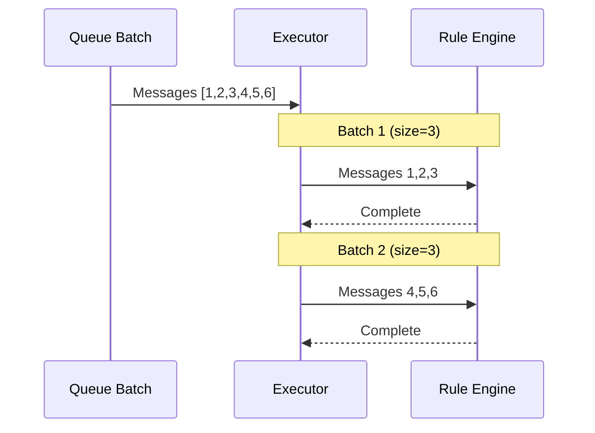

| Aspect | Value |
|--------|-------|
| Throughput | Medium-High |
| Ordering | Within batches |
| Use Case | Controlled throughput |

**Configuration:**
```yaml
submit-strategy:
  type: BATCH
  batch-size: 1000
```

### SEQUENTIAL

Submits one message at a time in strict order.

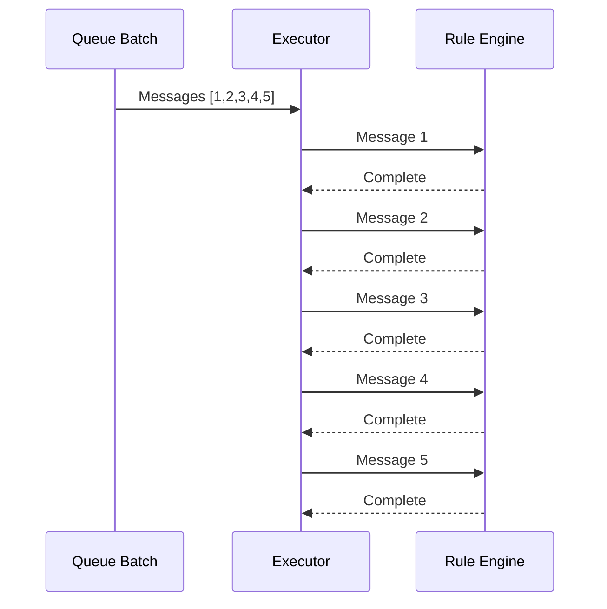

| Aspect | Value |
|--------|-------|
| Throughput | Lowest |
| Ordering | Strict global |
| Use Case | Rare, strict ordering required |

**Configuration:**
```yaml
submit-strategy:
  type: SEQUENTIAL
```

### SEQUENTIAL_BY_ORIGINATOR

Messages from the same originator (device/asset) are processed sequentially; different originators process in parallel.

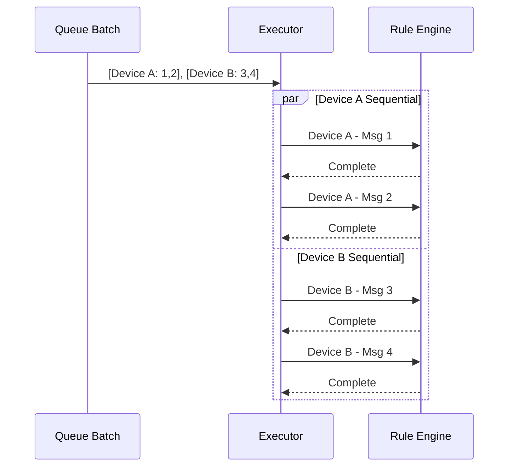

| Aspect | Value |
|--------|-------|
| Throughput | High (parallel across devices) |
| Ordering | Per-device sequential |
| Use Case | Device telemetry with ordering requirements |

**Configuration:**
```yaml
submit-strategy:
  type: SEQUENTIAL_BY_ORIGINATOR
```

### SEQUENTIAL_BY_TENANT

Messages within a tenant are processed sequentially; different tenants process in parallel.

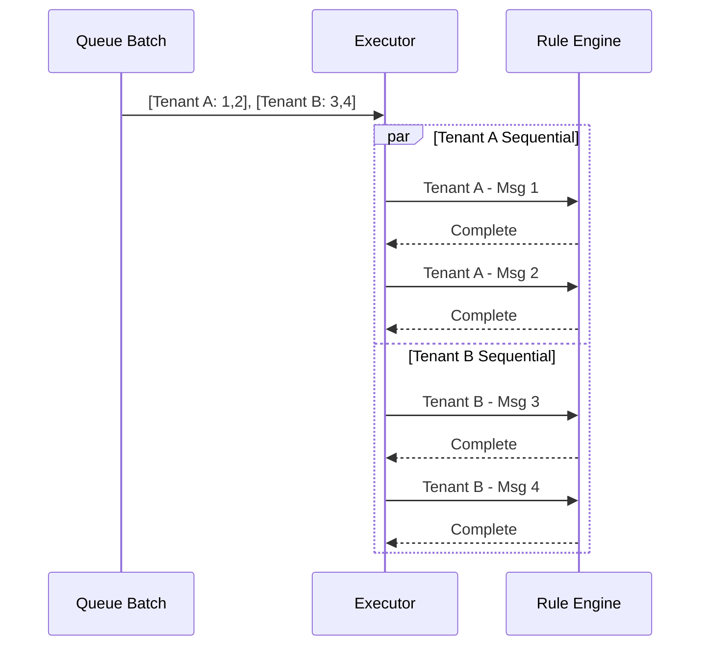

| Aspect | Value |
|--------|-------|
| Throughput | High (parallel across tenants) |
| Ordering | Per-tenant sequential |
| Use Case | Multi-tenant systems with tenant isolation |

**Configuration:**
```yaml
submit-strategy:
  type: SEQUENTIAL_BY_TENANT
```

### Strategy Comparison

| Strategy | Throughput | Ordering | Parallelism | Use Case |
|----------|------------|----------|-------------|----------|
| BURST | Highest | None | Maximum | High-volume, non-critical |
| BATCH | High | Within batch | Per-batch | Controlled throughput |
| SEQUENTIAL | Lowest | Global strict | None | Rare, strict ordering |
| SEQUENTIAL_BY_ORIGINATOR | High | Per-device | Cross-device | Device telemetry |
| SEQUENTIAL_BY_TENANT | High | Per-tenant | Cross-tenant | Multi-tenant isolation |

## Processing Strategies

Processing strategies define how failures and timeouts are handled during message processing.

### Strategy Types

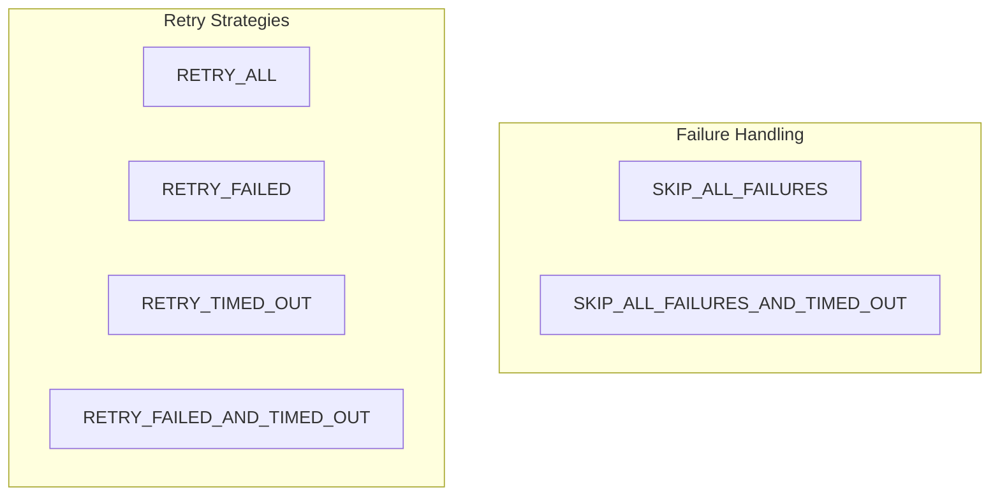

### SKIP_ALL_FAILURES

Skips reprocessing of failed messages only; does not skip timed-out messages.

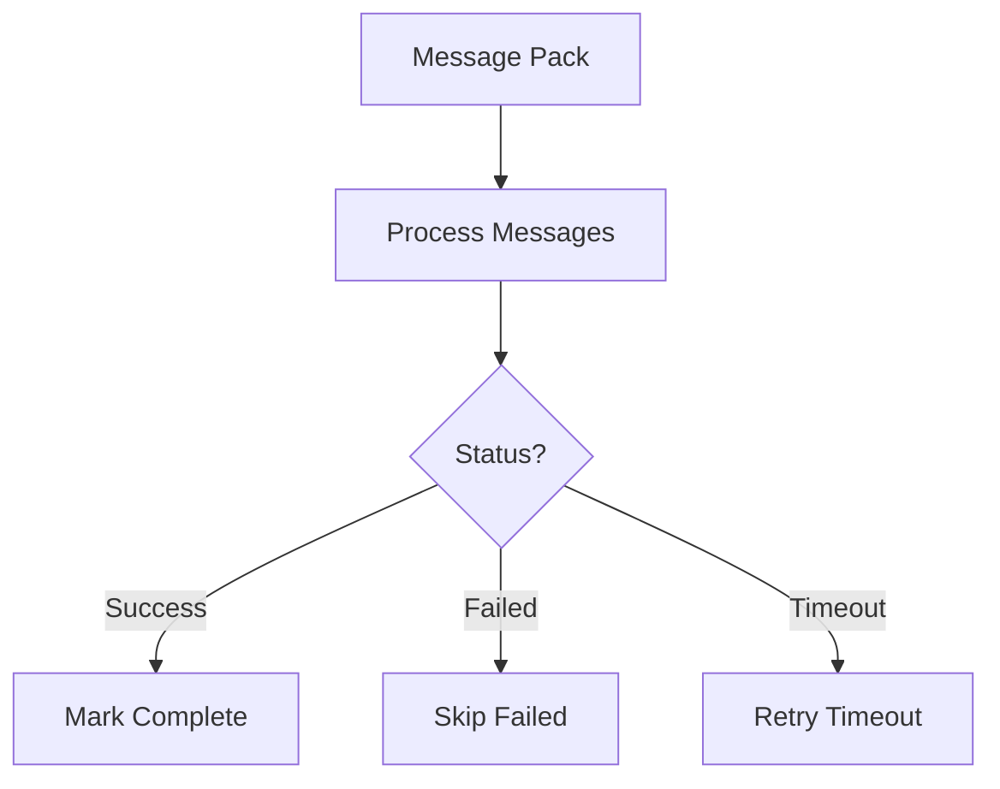

| Aspect | Behavior |
|--------|----------|
| Failed messages | Skipped |
| Timed-out messages | Retried |
| Use Case | Non-critical data, fast failure |

### SKIP_ALL_FAILURES_AND_TIMED_OUT

Skips both failed and timed-out messages; fastest failure handling.

| Aspect | Behavior |
|--------|----------|
| Failed messages | Skipped |
| Timed-out messages | Skipped |
| Use Case | High throughput, data loss acceptable |

### RETRY_ALL

Retries all messages regardless of status; most aggressive retry strategy.

| Aspect | Behavior |
|--------|----------|
| Failed messages | Retried |
| Timed-out messages | Retried |
| Successful messages | Retried |
| Use Case | Critical operations requiring verification |

### RETRY_FAILED

Retries only failed messages; skips successful and timed-out.

| Aspect | Behavior |
|--------|----------|
| Failed messages | Retried |
| Timed-out messages | Skipped |
| Successful messages | Skipped |
| Use Case | Standard error recovery |

### RETRY_TIMED_OUT

Retries only timed-out messages; skips failed and successful.

| Aspect | Behavior |
|--------|----------|
| Failed messages | Skipped |
| Timed-out messages | Retried |
| Successful messages | Skipped |
| Use Case | Handling temporary service unavailability |

### RETRY_FAILED_AND_TIMED_OUT

Retries both failed and timed-out messages; most common resilient strategy.

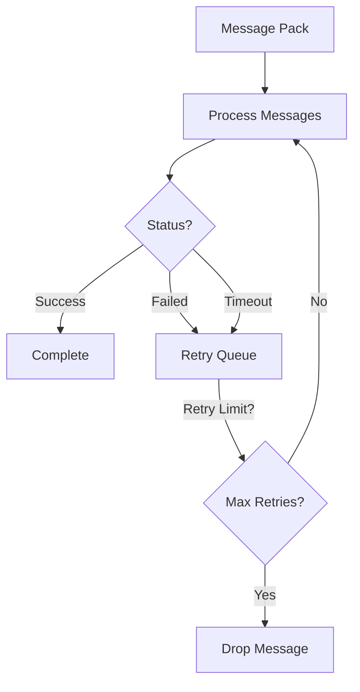

| Aspect | Behavior |
|--------|----------|
| Failed messages | Retried |
| Timed-out messages | Retried |
| Successful messages | Skipped |
| Use Case | Resilient processing with recovery |

### Processing Strategy Comparison

| Strategy | Failed | Timed Out | Successful | Reliability |
|----------|--------|-----------|------------|-------------|
| SKIP_ALL_FAILURES | Skip | Retry | Skip | Low |
| SKIP_ALL_FAILURES_AND_TIMED_OUT | Skip | Skip | Skip | Lowest |
| RETRY_ALL | Retry | Retry | Retry | Highest |
| RETRY_FAILED | Retry | Skip | Skip | Medium |
| RETRY_TIMED_OUT | Skip | Retry | Skip | Medium |
| RETRY_FAILED_AND_TIMED_OUT | Retry | Retry | Skip | High |

## Critical Warnings and Gotchas

### Queue Blocking with Retry Strategies

When using any retry strategy (`RETRY_ALL`, `RETRY_FAILED`, `RETRY_TIMED_OUT`, `RETRY_FAILED_AND_TIMED_OUT`), a single failing rule node can block the entire queue:

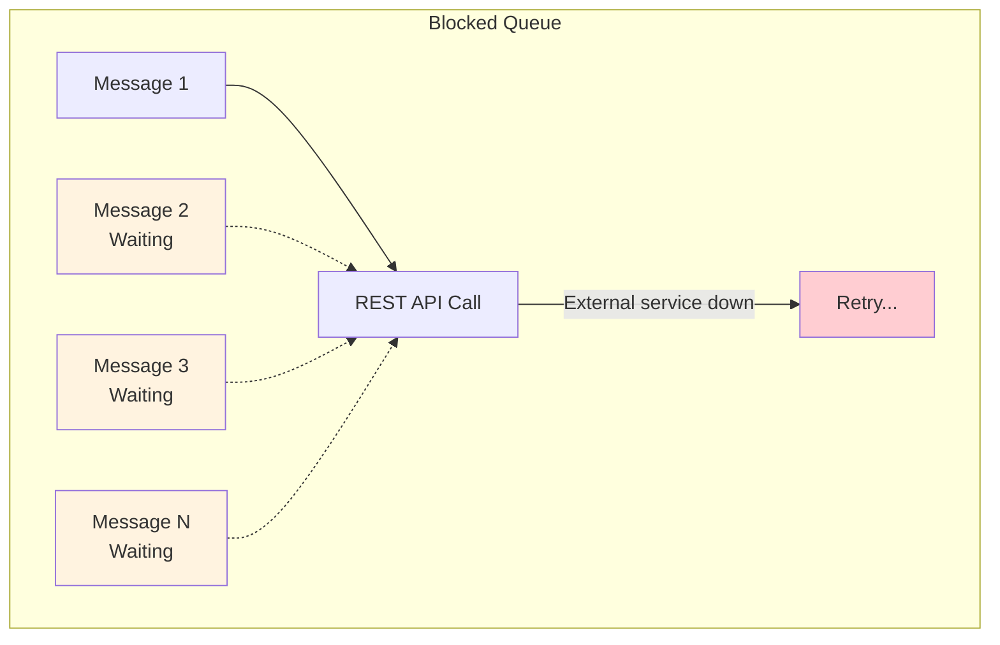

**Impact:** All messages in the queue wait for the failing message to succeed or exhaust retries.

**Mitigation Strategies:**
1. **Handle Failure outputs**: Connect the Failure output of external nodes (REST API, Kafka, MQTT) to logging or fallback logic
2. **Use dedicated queues**: Isolate unstable integrations in separate queues
3. **Configure failure percentage**: Stop retrying when failure rate exceeds threshold
4. **Use Device Profiles**: Automatically route messages by device type to appropriate queues

### Message Amplification with RETRY_ALL

The `RETRY_ALL` strategy reprocesses the **entire message pack**, not just failed messages:

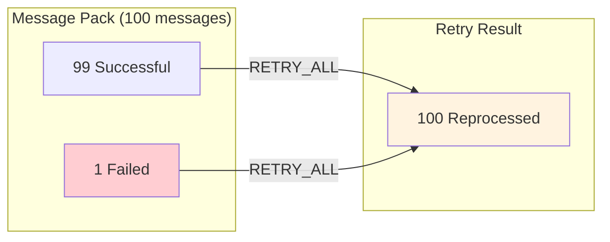

**Impact:** Processing load multiplies during failures. If 1 of 100 messages fails, all 100 are resubmitted.

**Recommendation:** Use `RETRY_FAILED_AND_TIMED_OUT` to retry only problematic messages.

### Data Loss with Skip Strategies

The **Main** queue uses `SKIP_ALL_FAILURES` by default for backward compatibility:

| Strategy | Failure Behavior | Risk |
|----------|-----------------|------|
| SKIP_ALL_FAILURES | Messages marked "acknowledged" and deleted | Data lost if DB down |
| SKIP_ALL_FAILURES_AND_TIMED_OUT | Both failed and timed-out deleted | Higher data loss risk |

**Important:** Timed-out messages already submitted to rule chains are:
- **SKIP_ALL_FAILURES**: NOT canceled—rule engine still processes them
- **SKIP_ALL_FAILURES_AND_TIMED_OUT**: Canceled—rule nodes won't start processing

### Message Cancellation Behavior

When retry strategies resubmit messages, previous submissions are canceled:

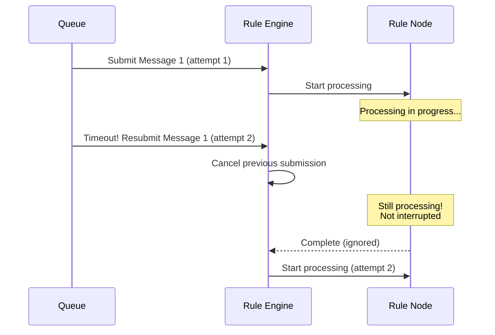

**Key behaviors:**
1. **Canceled messages**: Rule nodes will NOT start processing canceled messages
2. **In-flight messages**: Rule nodes already processing are NOT interrupted
3. **Binary copies**: Retried messages are exact copies of originals

**Risk:** Partial execution if node completes work after cancellation (e.g., external API called but response ignored).

## Retry Configuration

### Retry Parameters

```yaml
processing-strategy:
  type: RETRY_FAILED_AND_TIMED_OUT
  retries: 3
  failure-percentage: 0.0
  pause-between-retries: 3000
  max-pause-between-retries: 3000
```

### Configuration Options

| Parameter | Default | Description |
|-----------|---------|-------------|
| `retries` | 3 | Maximum retry attempts |
| `failure-percentage` | 0.0 | Max failure percentage (0-100) |
| `pause-between-retries` | 3000 | Initial pause between retries (ms) |
| `max-pause-between-retries` | 3000 | Max pause with exponential backoff (ms) |

### Retry Flow

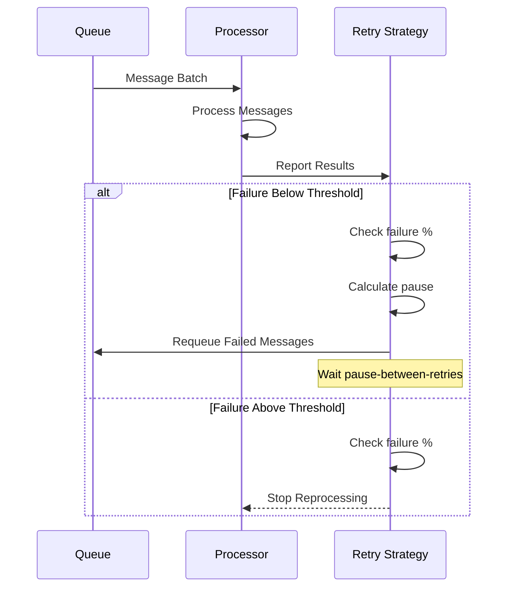

### Exponential Backoff

When `pause-between-retries` < `max-pause-between-retries`, the system uses exponential backoff:

```
currentPause = min(pauseBetweenRetries * 2^retryCount, maxPauseBetweenRetries)
```

Example with `pause=1000, max=8000`:
- Retry 1: 1000ms
- Retry 2: 2000ms
- Retry 3: 4000ms
- Retry 4: 8000ms (capped)

### Failure Percentage Threshold

Processing stops if the failure rate exceeds the configured threshold:

```
currentFailurePercentage = (failedMessages / totalMessages) * 100

if (currentFailurePercentage > failurePercentage) {
    stopReprocessing()
}
```

## Queue Configuration Example

### Complete Queue Definition

```yaml
queue:
  rule-engine:
    queues:
      - name: Main
        topic: tb_rule_engine.main
        partitions: 10
        consumer-per-partition: true
        poll-interval: 25
        pack-processing-timeout: 2000
        submit-strategy:
          type: BURST
          batch-size: 1000
        processing-strategy:
          type: RETRY_FAILED_AND_TIMED_OUT
          retries: 3
          failure-percentage: 0.0
          pause-between-retries: 3000
          max-pause-between-retries: 3000

      - name: HighPriority
        topic: tb_rule_engine.hp
        partitions: 4
        consumer-per-partition: true
        poll-interval: 25
        pack-processing-timeout: 2000
        submit-strategy:
          type: SEQUENTIAL_BY_ORIGINATOR
        processing-strategy:
          type: RETRY_FAILED_AND_TIMED_OUT
          retries: 5
          failure-percentage: 5.0
          pause-between-retries: 1000
          max-pause-between-retries: 5000

      - name: Sequential
        topic: tb_rule_engine.sq
        partitions: 1
        consumer-per-partition: true
        poll-interval: 25
        pack-processing-timeout: 60000
        submit-strategy:
          type: SEQUENTIAL
        processing-strategy:
          type: RETRY_ALL
          retries: 10
          failure-percentage: 0.0
          pause-between-retries: 5000
          max-pause-between-retries: 60000
```

## Use Case Recommendations

### High-Volume Telemetry

```yaml
submit-strategy:
  type: BURST
processing-strategy:
  type: SKIP_ALL_FAILURES
  retries: 1
```

- Maximum throughput
- Data loss acceptable for individual messages
- No ordering requirements

### Device Command Processing

```yaml
submit-strategy:
  type: SEQUENTIAL_BY_ORIGINATOR
processing-strategy:
  type: RETRY_FAILED_AND_TIMED_OUT
  retries: 5
  pause-between-retries: 2000
```

- Commands to same device processed in order
- Parallel processing across devices
- Reliable delivery with retries

### Multi-Tenant SaaS

```yaml
submit-strategy:
  type: SEQUENTIAL_BY_TENANT
processing-strategy:
  type: RETRY_FAILED
  retries: 3
  failure-percentage: 10.0
```

- Tenant isolation for fairness
- Parallel processing across tenants
- Controlled failure handling

### Critical Alarm Processing

```yaml
submit-strategy:
  type: SEQUENTIAL
processing-strategy:
  type: RETRY_ALL
  retries: 10
  pause-between-retries: 1000
  max-pause-between-retries: 30000
```

- Strict ordering
- Maximum reliability
- Aggressive retry with backoff

### Batch Data Import

```yaml
submit-strategy:
  type: BATCH
  batch-size: 500
processing-strategy:
  type: RETRY_FAILED_AND_TIMED_OUT
  retries: 3
  pause-between-retries: 5000
```

- Controlled batch processing
- Good throughput
- Reliable delivery

## Monitoring and Debugging

### Key Metrics

| Metric | Description | Alert Condition |
|--------|-------------|-----------------|
| Messages processed | Total messages handled | N/A |
| Messages failed | Failed message count | > 1% of total |
| Messages timed out | Timeout count | > 0.1% of total |
| Retry count | Total retries | > 10% of messages |
| Processing time | Time per message | > pack-processing-timeout |

### Troubleshooting

| Issue | Cause | Solution |
|-------|-------|----------|
| High retry rate | Rule chain errors | Check rule chain logs |
| Frequent timeouts | Slow processing | Increase timeout, optimize rules |
| Messages dropped | Failure threshold | Increase retries, check failures |
| Uneven processing | Wrong strategy | Use SEQUENTIAL_BY_ORIGINATOR |

## See Also

- [Queue Architecture](./queue-architecture.md) - Overall queue design
- [Partitioning](./partitioning.md) - Partition strategies
- [Kafka Configuration](./kafka-configuration.md) - Kafka settings
- [Rule Engine](../04-rule-engine/README.md) - Rule processing
