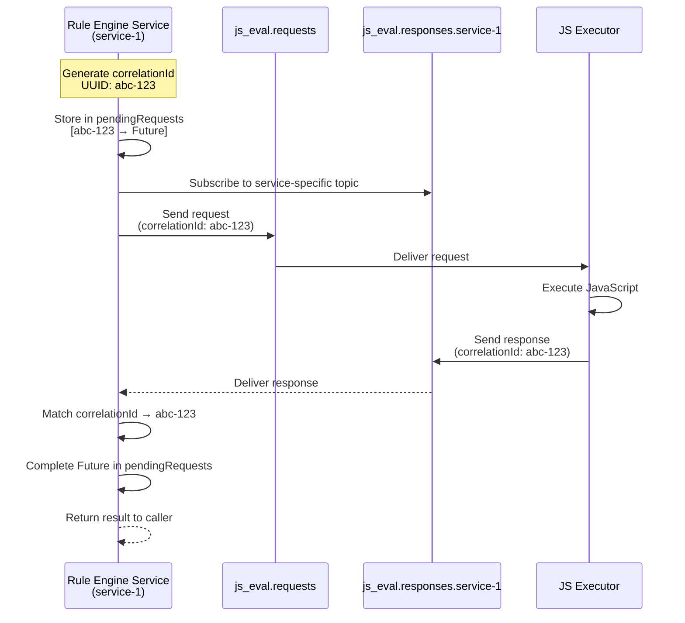
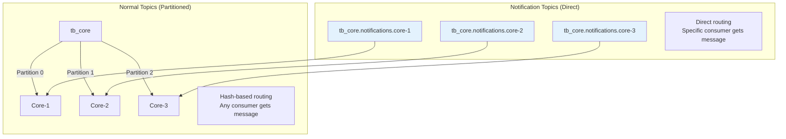
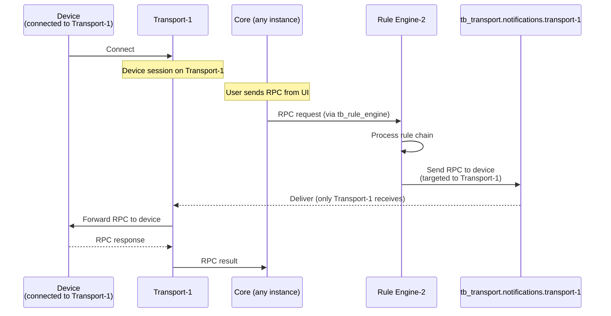

# Message Queue Architecture

## Overview

The message queue provides asynchronous, decoupled communication between platform services. It enables horizontal scaling by distributing message processing across multiple service instances while maintaining message ordering through hash-based partitioning. The platform supports multiple queue providers (Kafka, In-Memory) and uses Protocol Buffers for efficient message serialization.

## Key Behaviors

1. **Service Decoupling**: Services communicate through message queues rather than direct calls, enabling independent scaling and fault isolation.

2. **Hash-Based Partitioning**: Messages are distributed to partitions using consistent hashing on entity IDs, ensuring all messages for an entity go to the same partition.

3. **Tenant Isolation**: Non-system tenants can have isolated queue topics, preventing noisy neighbor effects.

4. **Multiple Providers**: Supports Kafka for production deployments and in-memory queues for testing/single-node setups.

## Queue Factory Implementations

The platform uses factory patterns to support different queue providers:

| Factory | Implementation | Use Case |
|---------|----------------|----------|
| KafkaMonolithQueueFactory | Kafka-based queues | Production monolith |
| KafkaTbCoreQueueFactory | Kafka core queues | Microservices core |
| KafkaTbRuleEngineQueueFactory | Kafka rule engine | Microservices RE |
| KafkaTbTransportQueueFactory | Kafka transport | Microservices transport |
| KafkaEdqsQueueFactory | Kafka EDQS | Entity queries |
| InMemoryMonolithQueueFactory | In-memory queues | Development/testing |
| InMemoryTbTransportQueueFactory | In-memory transport | Single-node testing |

### Queue State Management

| Service | Description |
|---------|-------------|
| KafkaQueueStateService | Persisted queue offsets |
| DefaultQueueStateService | In-memory state tracking |
| QueueRoutingInfoService | Dynamic queue routing |

## Architecture Overview


## Topic Structure

### Topic Naming Convention

```
[prefix.]<base_topic>[.isolated.<tenantId>][.<partition>]
```

| Component | Description | Example |
|-----------|-------------|---------|
| prefix | Optional environment prefix | `prod.` |
| base_topic | Core topic name | `tb_core` |
| isolated | Tenant isolation marker | `.isolated.` |
| tenantId | Tenant UUID for isolation | `a1b2c3d4-...` |
| partition | Partition number | `.0`, `.1` |

### Primary Topics

| Topic | Purpose | Default Partitions | Retention |
|-------|---------|-------------------|-----------|
| `tb_core` | Core platform messages | 10 | 7 days |
| `tb_core.notifications` | Direct core service notifications | 1 per service | 7 days |
| `tb_rule_engine` | Rule engine processing | Configurable | 7 days |
| `tb_rule_engine.notifications` | Direct rule engine notifications | 1 per service | 7 days |
| `tb_transport.notifications` | Transport service notifications | 1 per service | 7 days |
| `tb_transport.api.requests` | Transport API requests | 10 | 7 days |
| `tb_transport.api.responses` | Transport API responses | 10 | 7 days |
| `tb_edge` | Edge device synchronization | 10 | 7 days |
| `tb_edge.notifications` | Edge service notifications | 1 per service | 7 days |
| `tb_usage_stats` | Usage statistics collection | 1 | 7 days |
| `tb_ota_package` | OTA update distribution | 10 | 7 days |
| `tb_housekeeper` | Cleanup and maintenance tasks | 10 | 7 days |
| `tb_housekeeper.reprocessing` | Failed task reprocessing | 1 | 90 days |
| `tb_version_control` | Version control operations | 10 | 7 days |
| `tb_cf_event` | Calculated field events | Configurable | 7 days |
| `tb_cf_state` | Calculated field state | Configurable | 7 days |

### JavaScript Executor Topics

| Topic | Purpose | Default Partitions | Retention |
|-------|---------|-------------------|-----------|
| `js_eval.requests` | JavaScript evaluation requests | 30 | 1 day |
| `js_eval.responses.{serviceId}` | JavaScript evaluation responses | 1 per service | 1 day |

### EDQS Topics

| Topic | Purpose | Default Partitions | Retention |
|-------|---------|-------------------|-----------|
| `edqs.events` | Entity change events | 12 | 1 day |
| `edqs.state` | State snapshots | 12 | Infinite (compacted) |
| `edqs.requests` | Query requests | 12 | 3 minutes |
| `edqs.responses` | Query responses | 12 | 3 minutes |

### Task Queue Topics

| Topic | Purpose | Default Partitions | Retention |
|-------|---------|-------------------|-----------|
| `jobs.stats` | Task execution statistics | 1 | 7 days |
| `{job-type}` | Per-job-type task queues | 12 | 7 days |

### Notification Topics

Each service instance gets a dedicated notification topic for direct addressing:


## Message Format

### TbQueueMsg Interface

```
┌─────────────────────────────────────┐
│           TbQueueMsg                │
├─────────────────────────────────────┤
│ key: UUID                           │  → Partition routing key
│ headers: Map<String, byte[]>        │  → Metadata
│ data: byte[]                        │  → Protobuf payload
└─────────────────────────────────────┘
```

| Field | Type | Purpose |
|-------|------|---------|
| key | UUID | Used for partitioning and ordering |
| headers | Map<String, byte[]> | Metadata (producer ID, timestamps) |
| data | byte[] | Serialized Protocol Buffer message |

### Message Headers

| Header | Description |
|--------|-------------|
| producerId | Service instance that produced the message |
| ts | Timestamp when message was created |
| threadName | (Debug) Producer thread name |
| stackTrace | (Debug) Producer stack trace |

### Serialization

All message payloads use Protocol Buffers for efficient binary serialization:


## Partitioning Strategy

### Hash-Based Partitioning

Messages are assigned to partitions using consistent hashing:

```
partition = abs(hash(entityId)) % partitionCount
```


### Supported Hash Functions

| Function | Description | Use Case |
|----------|-------------|----------|
| murmur3_128 | 128-bit Murmur3 hash (default) | Best distribution |
| murmur3_32 | 32-bit Murmur3 hash | Faster, less collision resistant |
| sha256 | Cryptographic SHA-256 | Security-sensitive contexts |

### Partition Configuration

| Queue | Config Property | Default |
|-------|-----------------|---------|
| Core | `queue.core.partitions` | 10 |
| Rule Engine | Per-queue configuration | Varies |
| Edge | `queue.edge.partitions` | 10 |
| Version Control | `queue.vc.partitions` | 10 |
| EDQS | `queue.edqs.partitions` | 12 |
| Tasks | `queue.tasks.partitions` | 12 |

### Partition Assignment


## Tenant Isolation

### Isolation Mechanism

Non-system tenants can have dedicated queue topics:


### Topic Name Generation

| Tenant Type | Topic Pattern |
|-------------|---------------|
| System tenant | `tb_rule_engine.0` |
| Regular tenant | `tb_rule_engine.0` (shared) |
| Isolated tenant | `tb_rule_engine.isolated.<tenantId>.0` |

### TopicPartitionInfo

```
TopicPartitionInfo {
    topic: "tb_rule_engine"
    tenantId: <tenant-uuid>           // null for system
    partition: 5
    useInternalPartition: false
    myPartition: true                  // assigned to this service
    fullTopicName: "tb_rule_engine.isolated.<tenantId>.5"
}
```

## Service Types

### Service Type Enumeration

| Service Type | Label | Purpose |
|--------------|-------|---------|
| TB_CORE | TB Core | Core platform operations |
| TB_RULE_ENGINE | TB Rule Engine | Rule chain processing |
| TB_TRANSPORT | TB Transport | Device protocol handling |
| JS_EXECUTOR | JS Executor | JavaScript rule node execution |
| TB_VC_EXECUTOR | TB VC Executor | Version control operations |
| EDQS | TB Entity Data Query | Entity data queries |
| TASK_PROCESSOR | Task Processor | Background job processing |

### Service Communication Flow


## Queue Providers

### Kafka Provider

Production-ready distributed message queue.

**Configuration:**
```yaml
queue:
  type: kafka
  kafka:
    bootstrap.servers: localhost:9092
    acks: all
    retries: 1
    compression.type: none
    batch.size: 16384
    linger.ms: 1
    max.request.size: 1048576
    replication_factor: 1
```

**Producer Settings:**

| Setting | Default | Description |
|---------|---------|-------------|
| acks | all | All replicas must acknowledge |
| retries | 1 | Retry count on failure |
| batch.size | 16384 | Batch size in bytes |
| linger.ms | 1 | Wait time for batching |
| compression.type | none | Message compression |
| buffer.memory | 33554432 | Producer buffer size |

**Consumer Settings:**

| Setting | Default | Description |
|---------|---------|-------------|
| auto.offset.reset | earliest | Start from earliest on new group |
| session.timeout.ms | 10000 | Session timeout |
| max.poll.records | 8192 | Max records per poll |
| max.poll.interval.ms | 300000 | Max poll interval |
| max.partition.fetch.bytes | 16777216 | Max fetch per partition |

### In-Memory Provider

For testing and single-node deployments.

**Configuration:**
```yaml
queue:
  type: in-memory
```

**Characteristics:**
- No persistence (data lost on restart)
- No network overhead
- Suitable for development/testing
- Single-node only

## Consumer Groups

### Group ID Format

```
[prefix]<serviceType><queueName>[-isolated-<tenantId>]-consumer[-<partitionId>]
```

**Examples:**
- `tb_rule_engine_main-consumer` - Shared main queue
- `tb_core_main-isolated-abc123-consumer-0` - Isolated tenant, partition 0

### Consumer Coordination


## Producer/Consumer Interfaces

### TbQueueProducer

```
interface TbQueueProducer<T extends TbQueueMsg> {
    getDefaultTopic(): String
    send(tpi: TopicPartitionInfo, msg: T, callback: TbQueueCallback): void
    stop(): void
}
```

### TbQueueConsumer

```
interface TbQueueConsumer<T extends TbQueueMsg> {
    getTopic(): String
    subscribe(): void
    subscribe(partitions: Set<TopicPartitionInfo>): void
    poll(durationInMillis: long): List<T>
    commit(): void
    unsubscribe(): void
    stop(): void
    isStopped(): boolean
    getPartitions(): Set<TopicPartitionInfo>
}
```

### Message Flow


## Queue Factory Pattern

### Factory Hierarchy


### Factory Selection

| Deployment | Queue Type | Factory |
|------------|------------|---------|
| Monolith | Kafka | KafkaMonolithQueueFactory |
| Monolith | In-Memory | InMemoryMonolithQueueFactory |
| Microservices (Core) | Kafka | KafkaTbCoreQueueFactory |
| Microservices (Rule Engine) | Kafka | KafkaTbRuleEngineQueueFactory |
| Microservices (Transport) | Kafka | KafkaTbTransportQueueFactory |

## Request-Response Pattern

ThingsBoard implements **synchronous request-response semantics over asynchronous queues** using correlation IDs and per-service response topics. This pattern enables services to make blocking calls while maintaining the scalability benefits of message queues.

### Use Cases

| Service | Request Topic | Response Topic | Purpose |
|---------|---------------|----------------|---------|
| **JS Executor** | `js_eval.requests` | `js_eval.responses.{serviceId}` | Execute JavaScript for rule nodes |
| **EDQS** | `edqs.requests` | `edqs.responses.{serviceId}` | External data query service |
| **Transport API** | `tb_transport_api.requests` | `tb_transport_api.responses` | Device session management |

### Architecture



### Implementation Details

**Pending Request Tracking:**
```java
// From DefaultTbQueueRequestTemplate.java
ConcurrentHashMap<UUID, ResponseMetaData<Response>> pendingRequests;

public ListenableFuture<Response> send(Request request) {
    UUID correlationId = UUID.randomUUID();
    SettableFuture<Response> future = SettableFuture.create();

    // Store for later matching
    pendingRequests.put(correlationId, new ResponseMetaData<>(future, System.nanoTime()));

    // Send request with correlation ID
    requestProducer.send(request.withCorrelationId(correlationId));

    return future;
}
```

**Response Matching:**
```java
// Consumer poll loop continuously checks response queue
void mainLoop() {
    while (!stopped) {
        List<Response> responses = responseConsumer.poll(pollInterval);

        for (Response response : responses) {
            UUID correlationId = response.getCorrelationId();
            ResponseMetaData<Response> metadata = pendingRequests.remove(correlationId);

            if (metadata != null) {
                metadata.getFuture().set(response);  // Complete the Future
            }
        }

        cleanupExpiredRequests();  // Remove timed-out requests
    }
}
```

**Timeout Management:**
```java
void cleanupExpiredRequests() {
    long now = System.nanoTime();

    pendingRequests.entrySet().removeIf(entry -> {
        long elapsed = now - entry.getValue().getSubmitTime();
        if (elapsed > maxRequestTimeoutNs) {
            // Complete Future with timeout exception
            entry.getValue().getFuture().setException(
                new TimeoutException("Request timeout")
            );
            return true;  // Remove from map
        }
        return false;
    });
}
```

### Per-Service Response Topics

**Why Per-Service Topics?**

Instead of a single response topic with client-side filtering, ThingsBoard uses **dedicated response topics per service instance**:

```
js_eval.responses.core-service-1    ← Only Core Service 1 subscribes
js_eval.responses.core-service-2    ← Only Core Service 2 subscribes
js_eval.responses.re-service-3      ← Only Rule Engine Service 3 subscribes
```

**Benefits:**
- **No wasted polling**: Service only receives responses for its own requests
- **Partition-free**: Each service has unique topic, no partition coordination needed
- **Simpler consumer groups**: Each topic has single consumer (the requesting service)
- **Lower latency**: No client-side filtering overhead

**Configuration Example:**
```yaml
# From KafkaTbCoreQueueFactory.java
responseBuilder.topic(jsInvokeSettings.getResponseTopic() + "." + serviceInfoProvider.getServiceId());
// Results in: js_eval.responses.core-svc-1
```

### Request Template Configuration

```java
DefaultTbQueueRequestTemplate.builder()
    .requestTemplate(requestProducer)
    .responseTemplate(responseConsumer)
    .maxPendingRequests(10000)          // Max concurrent requests
    .maxRequestTimeout(60000)           // 60 second timeout
    .pollInterval(25)                   // Poll every 25ms
    .build();
```

### Configuration Parameters

| Parameter | Default | Purpose | Impact if Too Low | Impact if Too High |
|-----------|---------|---------|-------------------|-------------------|
| `maxPendingRequests` | 10,000 | Limit concurrent requests | Requests rejected | Memory pressure |
| `maxRequestTimeout` | 60,000ms | Request timeout | False timeouts | Memory leaks from stale requests |
| `pollInterval` | 25ms | Response check frequency | Higher latency | CPU overhead |

### Reliability Guarantees

**At-Least-Once Request Delivery:**
- Requests are stored in Kafka with replication
- If service crashes before receiving response, request remains in queue
- Restart processes pending requests

**No Automatic Retry:**
- Timeout completes Future with exception
- **Caller's responsibility** to retry on timeout
- Enables caller to decide retry strategy

**Duplicate Response Handling:**
- Correlation ID ensures correct response matching
- If response arrives after timeout, it's ignored (already removed from pendingRequests)
- No duplicate processing

### Performance Characteristics

**Throughput:**
- Tested: 50,000 requests/second per service instance
- Bottleneck: JS execution time, not queue throughput

**Latency:**
- Typical: 5-20ms for JS execution + queue latency
- 99th percentile: 50-100ms
- Timeout default: 60,000ms (safely handles slow JS scripts)

**Memory Usage:**
- ~1KB per pending request (Future + metadata)
- 10,000 max pending = ~10MB memory
- Cleanup every poll interval prevents leaks

### Common Pitfalls

| Pitfall | Impact | Solution |
|---------|--------|----------|
| **Timeout too low** | False timeouts for slow JS | Increase `maxRequestTimeout` to 120s+ for complex scripts |
| **maxPendingRequests too low** | Request rejection during spikes | Set to 2-3x peak concurrent load |
| **No timeout handling** | Caller hangs indefinitely | Always handle TimeoutException and retry |
| **Polling too slow** | High response latency | Keep `pollInterval` at 25ms or lower |
| **Memory leak** | Stale requests accumulate | Ensure cleanup runs (default: automatic) |

### Monitoring

**Key Metrics:**
```java
// From TbKafkaConsumerStatsService
- pending_requests_count: Number of in-flight requests
- request_timeout_count: Requests that timed out
- response_lag: Time from request send to response receive
- pending_requests_memory: Memory used by pendingRequests map
```

**Alerting Thresholds:**
- `pending_requests_count > 8000` → Approaching limit
- `request_timeout_count > 100/min` → JS Executor overloaded or down
- `response_lag > 5000ms` → Performance degradation

## Notification Topics

ThingsBoard uses **notification topics** for **direct service-to-service** communication, bypassing hash-based partition routing.

### Purpose

While normal topics use partitioning for load distribution, notification topics enable **targeted messaging** to specific service instances:



### Use Cases

| Scenario | Topic | Purpose |
|----------|-------|---------|
| **RPC Response** | `tb_core.notifications.core-{id}` | Return RPC result to specific Core instance |
| **Cache Invalidation** | `tb_rule_engine.notifications.re-{id}` | Invalidate cache on specific Rule Engine |
| **Session Notification** | `tb_transport.notifications.transport-{id}` | Notify Transport about device session change |
| **Edge Sync** | `tb_core.edge.notifications.{edgeId}` | Edge-specific sync messages |

### Topic Naming Convention

```
{base_topic}.notifications.{serviceId}

Examples:
tb_core.notifications.core-svc-1
tb_rule_engine.notifications.re-svc-2
tb_transport.notifications.mqtt-transport-3
```

### Configuration

```java
// From KafkaTbCoreQueueFactory.java (line 210)
consumerBuilder.topic(
    topicService.getNotificationsTopic(ServiceType.TB_CORE, serviceInfoProvider.getServiceId())
        .getFullTopicName()
);
// Results in: tb_core.notifications.core-svc-1

// Consumer group is also service-specific
consumerBuilder.groupId(
    topicService.buildTopicName("tb-core-notifications-node-" + serviceInfoProvider.getServiceId())
);
// Results in: tb-core-notifications-node-core-svc-1
```

### Guaranteed Single Consumer

**Key Design:** Each notification topic has **exactly one consumer** (the target service instance):

```
Topic: tb_core.notifications.core-svc-1
Consumer Group: tb-core-notifications-node-core-svc-1
Consumers: 1 (core-svc-1 only)
```

**Benefits:**
- **No partition coordination**: Single consumer, no rebalancing
- **Guaranteed delivery**: Message always goes to correct instance
- **No cross-instance routing**: Sender knows exact destination

### Performance

**Throughput:** Lower than partitioned topics (single consumer bottleneck)
**Latency:** Lower than partitioned topics (no partition routing overhead)
**Use Sparingly:** Only for direct addressing needs

### Example: RPC Response Flow



**Why Notification Topic Needed:**
- Device session exists on Transport-1 specifically
- Cannot use partitioned `tb_transport` topic (might go to Transport-2 or Transport-3)
- Must target Transport-1 directly via notification topic

## Cluster Events

### Partition Change Events

When cluster membership changes, services receive partition reassignment events:


### Event Types

| Event | Trigger | Action |
|-------|---------|--------|
| ClusterTopologyChangeEvent | Service added/removed | Recalculate assignments |
| PartitionChangeEvent | Partition reassignment | Update subscriptions |
| ServiceListChangedEvent | Service list changed | Update routing tables |

## Performance Considerations

### Throughput Optimization

| Setting | Impact | Recommendation |
|---------|--------|----------------|
| batch.size | Higher = better throughput | Increase for high volume |
| linger.ms | Higher = better batching | Balance with latency |
| compression.type | Reduces network, increases CPU | Enable for high volume |
| max.poll.records | More records per poll | Tune based on processing time |

### Latency Optimization

| Setting | Impact | Recommendation |
|---------|--------|----------------|
| linger.ms | Lower = lower latency | Set to 0-1ms for real-time |
| acks | "1" = faster, less durable | Use "all" for safety |
| max.poll.records | Fewer = faster commits | Balance with throughput |

### Partition Count Guidelines

| Factor | Recommendation |
|--------|----------------|
| Consumer count | At least 1 partition per consumer |
| Throughput | More partitions = more parallelism |
| Ordering | Same entity always same partition |
| Overhead | Too many partitions = metadata overhead |

## Configuration Reference

### Core Queue Settings

```yaml
queue:
  type: kafka                    # kafka | in-memory
  prefix: ""                     # Optional topic prefix

  core:
    topic: tb_core
    partitions: 10
    ota.topic: tb_ota_package
    usage-stats-topic: tb_usage_stats
    housekeeper.topic: tb_housekeeper

  rule-engine:
    topic: tb_rule_engine

  edge:
    topic: tb_edge
    partitions: 10

  vc:
    topic: tb_version_control
    partitions: 10

  partitions:
    hash_function_name: murmur3_128
```

### Kafka-Specific Settings

```yaml
queue:
  kafka:
    bootstrap.servers: localhost:9092
    ssl.enabled: false
    replication_factor: 1

    # Producer settings
    acks: all
    retries: 1
    batch.size: 16384
    linger.ms: 1
    buffer.memory: 33554432

    # Consumer settings
    auto.offset.reset: earliest
    session.timeout.ms: 10000
    max.poll.records: 8192
    max.poll.interval.ms: 300000
```

## See Also

- [Kafka Configuration](./kafka-configuration.md) - Detailed Kafka settings
- [Processing Strategies](./processing-strategies.md) - Submit and retry strategies
- [Partitioning](./partitioning.md) - Partition strategies
- [System Overview](../01-architecture/system-overview.md) - Platform architecture
- [Actor System](../03-actor-system/README.md) - Message consumers
- [Transport Contract](../05-transport-layer/transport-contract.md) - Message producers
- [Rule Engine](../04-rule-engine/) - Rule processing consumers
