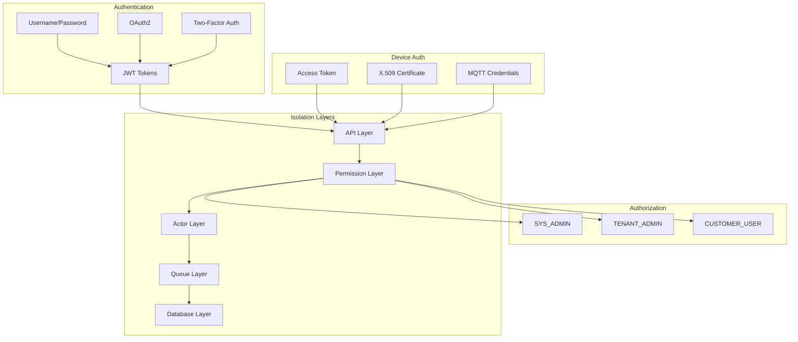

# Security

## Overview

ThingsBoard implements a comprehensive security model with multi-layered authentication, role-based authorization, and defense-in-depth tenant isolation. The system supports JWT tokens for user sessions, multiple device credential types, OAuth2 integration, and two-factor authentication, while enforcing tenant boundaries across all system layers.

## Contents

| Document | Description |
|----------|-------------|
| [Authentication](./authentication.md) | JWT tokens, OAuth2, 2FA, device credentials, and session management |
| [Authorization](./authorization.md) | Role-based access control, user authorities, and permission model |
| [Tenant Isolation](./tenant-isolation.md) | Multi-layer isolation, data separation, and boundary enforcement |

## Key Concepts

- **JWT Authentication**: Stateless token-based authentication for users and API access
- **Multi-Credential Devices**: Access tokens, X.509 certificates, MQTT credentials, LwM2M security
- **Role-Based Access**: Three authority levels (SYS_ADMIN, TENANT_ADMIN, CUSTOMER_USER)
- **Defense-in-Depth**: Tenant isolation enforced at API, permission, actor, queue, cache, and database layers
- **OAuth2 Integration**: Support for external identity providers

## Security Architecture

## See Also

- [Authentication (API Layer)](../06-api-layer/authentication.md) - API-level auth mechanisms
- [Multi-Tenancy](../01-architecture/multi-tenancy.md) - Tenant architecture
- [Device Entity](../02-core-concepts/entities/device.md) - Device credentials
- [Transport Layer](../05-transport-layer/README.md) - Transport authentication
