# Authentication

## Overview

ThingsBoard implements a multi-layered authentication system supporting various credential types for users, devices, and integrations. The system uses JWT (JSON Web Tokens) as its primary mechanism, combined with refresh tokens for session management and support for OAuth2, API keys, two-factor authentication (2FA), and device-specific credentials.

## Authentication Methods

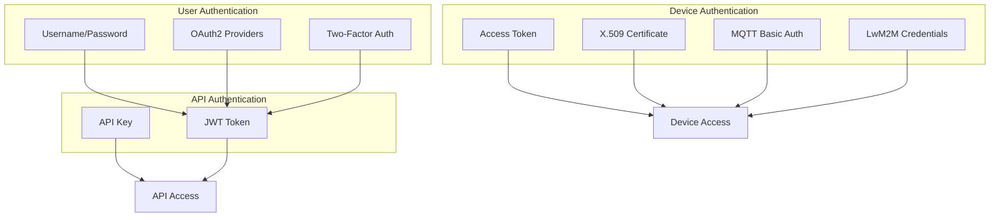

## JWT Authentication

### Token Structure

JWT tokens contain claims identifying the user and their permissions:

| Claim | Description |
|-------|-------------|
| sub | User email or public ID |
| userId | Unique user identifier (UUID) |
| scopes | User authority (SYS_ADMIN, TENANT_ADMIN, CUSTOMER_USER) |
| tenantId | Associated tenant |
| customerId | Associated customer (if applicable) |
| sessionId | Unique session identifier |
| enabled | User account enabled status |
| isPublic | Whether session is from public customer login |
| firstParentId | Original user ID when impersonating (first hop) |
| lastParentId | Immediate parent user ID when impersonating |
| iat | Issued at timestamp |
| exp | Expiration timestamp |

### Token Types

| Token Type | Purpose | Typical Expiration |
|------------|---------|-------------------|
| ACCESS_TOKEN | API request authentication | 2.5 hours (9000s) |
| REFRESH_TOKEN | Obtain new token pair | 7 days (604800s) |
| PRE_VERIFICATION_TOKEN | Temporary token before 2FA completion | Short-lived |
| MFA_CONFIGURATION_TOKEN | Token during MFA setup flow | Short-lived |

### Token Lifecycle

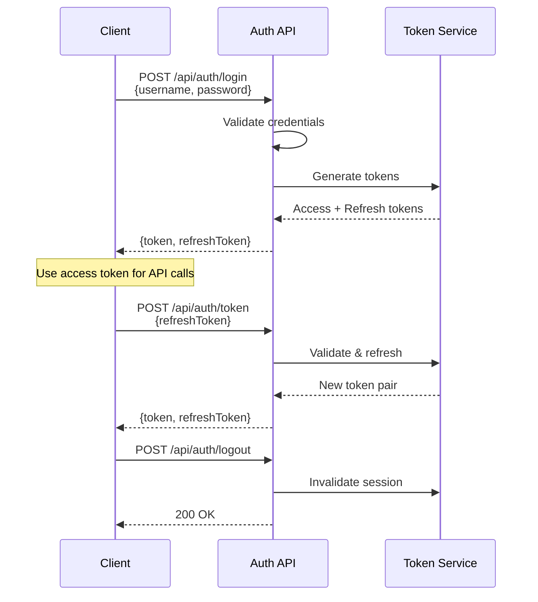

### Token Configuration

| Setting | Default | Description |
|---------|---------|-------------|
| Access Token Expiration | 9000s (2.5 hours) | Time before access token expires |
| Refresh Token Expiration | 604800s (7 days) | Time before refresh token expires |
| Signing Algorithm | HS512 | HMAC SHA-512 |

## User Login Flow

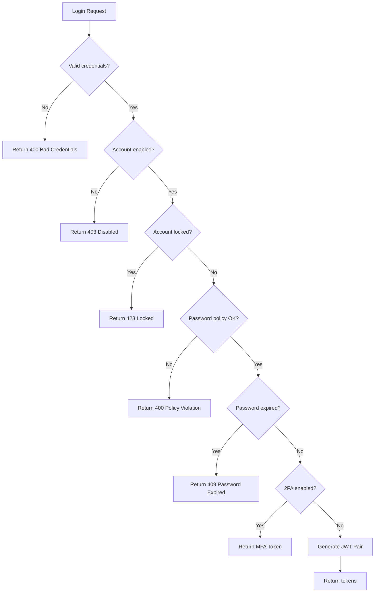

### Login Endpoint

```
POST /api/auth/login
Content-Type: application/json

{
  "username": "user@example.com",
  "password": "password123"
}
```

**Success Response:**
```json
{
  "token": "<access-jwt>",
  "refreshToken": "<refresh-jwt>"
}
```

### Failed Login Tracking

- Failed attempts increment counter
- Account locked after configurable max attempts
- All attempts logged to audit log
- Automatic unlock after time decay (optional)

## Two-Factor Authentication (2FA)

### Supported Providers

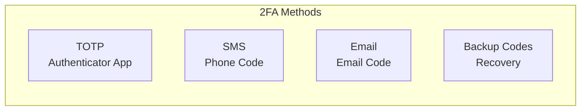

| Provider | Method | Use Case |
|----------|--------|----------|
| TOTP | Time-based one-time password | Primary - authenticator apps |
| SMS | Code sent via SMS | Alternative - phone verification |
| EMAIL | Code sent via email | Alternative - email verification |
| BACKUP_CODE | Pre-generated codes | Recovery - when primary unavailable |

### Provider Implementation Details

**TOTP (Time-based One-Time Password):**
- Uses secret key stored in user's `twoFaConfig`
- Standard 30-second time window
- Compatible with Google Authenticator, Authy, etc.

**SMS Verification:**
- Code sent via configured SMS provider (Twilio, AWS SNS, etc.)
- Rate limited to prevent abuse
- Requires valid phone number in user profile

**Email Verification:**
- Code sent to user's registered email
- Rate limited independently from SMS
- Falls back option when TOTP unavailable

**Backup Codes:**
- Pre-generated one-time use codes (typically 10)
- Each code can only be used once
- Marked as used immediately after successful verification
- Should be stored securely by user offline

### 2FA Flow

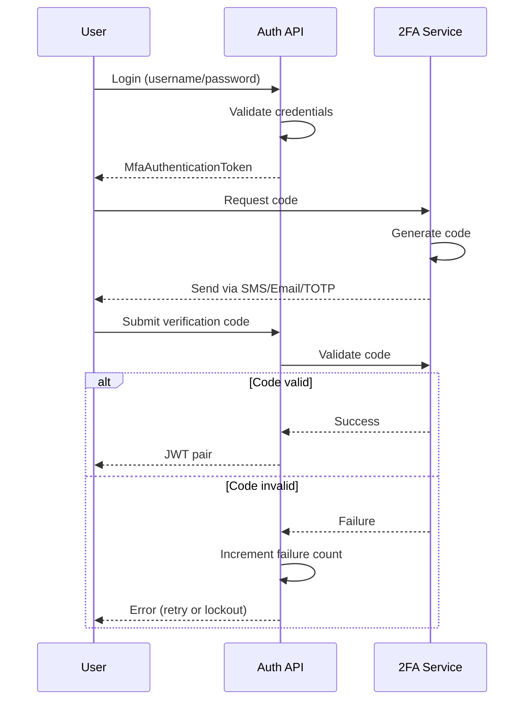

### 2FA Configuration

| Setting | Default | Description |
|---------|---------|-------------|
| minVerificationCodeSendPeriod | 30 | Minimum seconds between code sends |
| verificationCodeCheckRateLimit | 5:300 | Max verification attempts (count:seconds) |
| maxVerificationFailuresBeforeUserLockout | 10 | Failures before account lock |
| totalAllowedTimeForVerification | 3600 | Max seconds to complete 2FA after login |

### 2FA Lockout Behavior

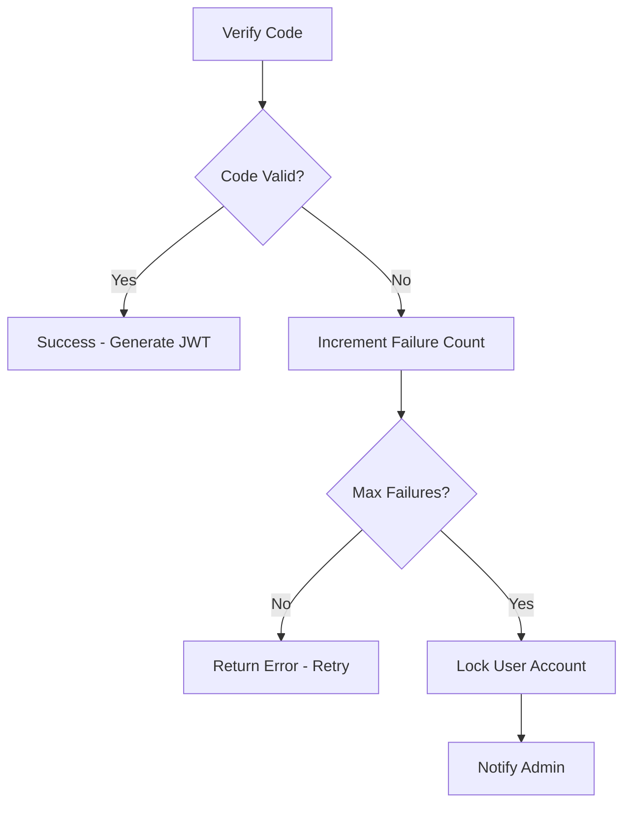

**Lockout Recovery:**
- Admin can unlock via User Management UI
- Optional automatic unlock after configured duration
- All active sessions invalidated on lockout

### TOTP Enrollment

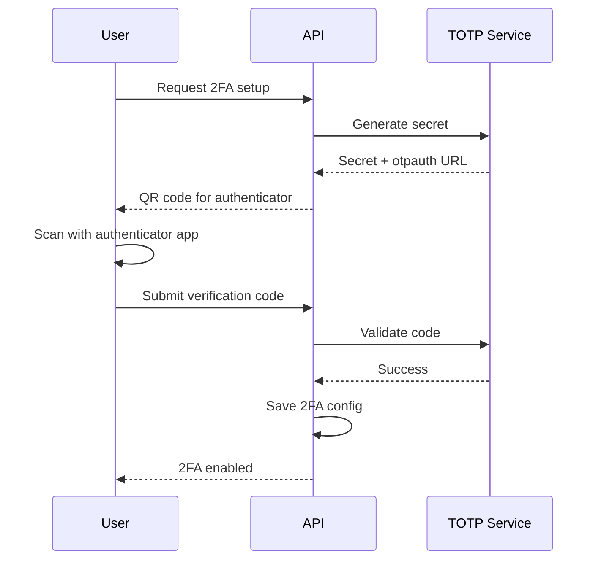

## Authentication Providers

ThingsBoard uses a chain of authentication providers to handle different login scenarios:

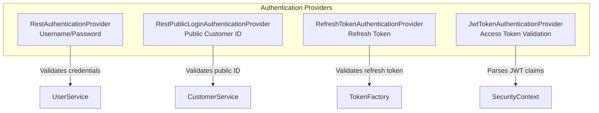

| Provider | Input | Output |
|----------|-------|--------|
| RestAuthenticationProvider | Username + Password | JWT pair or MFA token |
| RestPublicLoginAuthenticationProvider | Public customer UUID | JWT pair |
| RefreshTokenAuthenticationProvider | Refresh JWT | New JWT pair |
| JwtTokenAuthenticationProvider | Access JWT | Security context |

## OAuth2 Authentication

### Supported Providers

- **GitHub** - Custom mapper extracts login, email, name
- **Apple** - Custom mapper handles Apple-specific ID token claims
- **Google** - Uses basic mapper with standard OIDC claims
- **Custom providers** - Configure any OAuth2/OIDC provider

### OAuth2 Flow

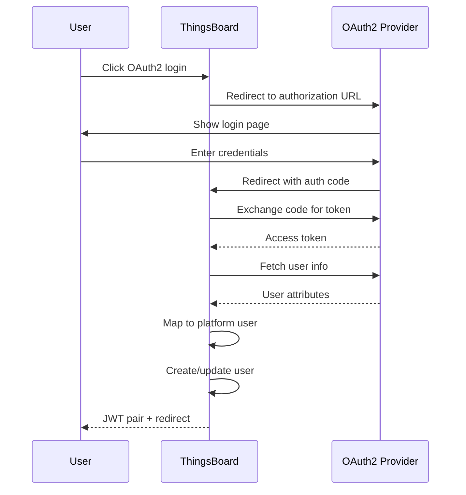

### OAuth2 Configuration

| Setting | Description |
|---------|-------------|
| clientId | OAuth2 provider client ID |
| clientSecret | OAuth2 provider secret |
| authorizationUri | Provider authorization endpoint |
| accessTokenUri | Provider token endpoint |
| userInfoUri | Provider user info endpoint |
| scope | Requested OAuth2 scopes |
| userNameAttributeName | Attribute for username mapping |

### OAuth2 User Mapping

OAuth2 mappers control how external user attributes map to ThingsBoard users:

| Mapper Type | Description |
|-------------|-------------|
| BASIC | Standard mapping using configured attribute names |
| GITHUB | GitHub-specific: extracts login, email, name from GitHub API |
| APPLE | Apple-specific: handles Apple ID token claims |
| CUSTOM | Custom JavaScript mapping logic |

### User Creation Behavior

| Setting | Behavior |
|---------|----------|
| allowUserCreation: true | Create new ThingsBoard user if not exists |
| allowUserCreation: false | Only allow login for existing users |
| activateUser: true | Automatically activate newly created users |
| defaultDashboardId | Assign default dashboard to new users |
| alwaysFullScreen | Set dashboard to full screen mode |

## API Key Authentication

API keys provide long-lived authentication for integrations and automation.

### API Key Structure

| Field | Description |
|-------|-------------|
| id | Unique identifier (UUID) |
| value | The API key string |
| name | Human-readable name |
| userId | Owning user |
| enabled | Enable/disable flag |
| expirationTime | Expiration timestamp (0 = never) |

### API Key Usage

```
GET /api/devices
Authorization: ApiKey YOUR_API_KEY_VALUE
```

Or:
```
X-Authorization: ApiKey YOUR_API_KEY_VALUE
```

### API Key Flow

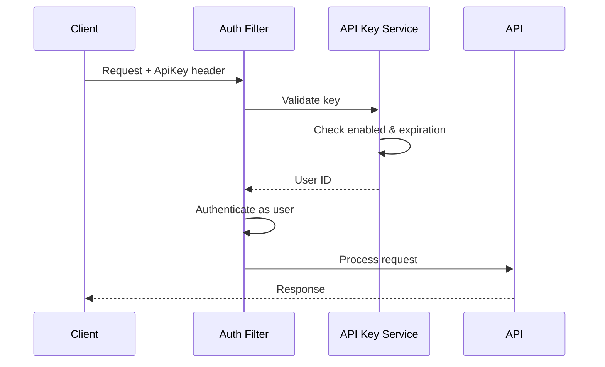

## Device Authentication

### Credential Types

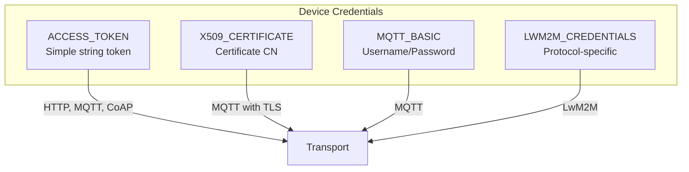

| Type | Format | Usage |
|------|--------|-------|
| ACCESS_TOKEN | Random string | HTTP header, MQTT username, CoAP query |
| X509_CERTIFICATE | Certificate CN | MQTT TLS client certificate |
| MQTT_BASIC | Username + Password | MQTT CONNECT packet |
| LWM2M_CREDENTIALS | Protocol-specific | LwM2M bootstrap/registration |

### Device Authentication Flow

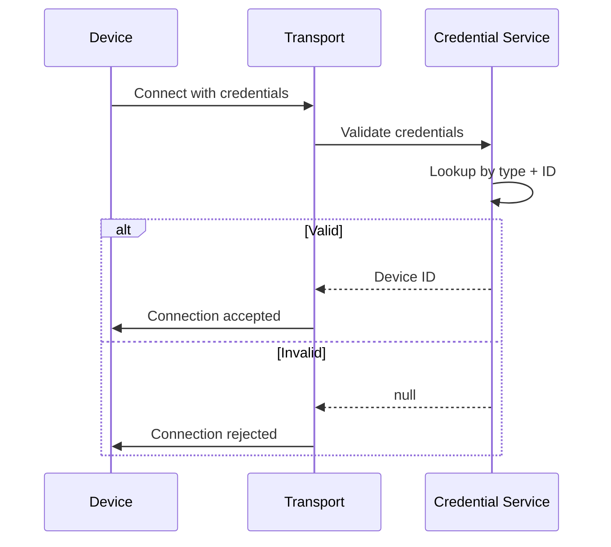

### Access Token Usage

**HTTP:**
```
POST /api/v1/{accessToken}/telemetry
```

**MQTT:**
```
Username: {accessToken}
Password: (empty or any value)
```

**CoAP:**
```
coap://server/api/v1/{accessToken}/telemetry
```

## Password Policies

### Policy Configuration

| Setting | Description |
|---------|-------------|
| minimumLength | Minimum password length |
| maximumLength | Maximum password length |
| minimumUppercaseLetters | Required uppercase count |
| minimumLowercaseLetters | Required lowercase count |
| minimumDigits | Required digit count |
| minimumSpecialCharacters | Required special char count |
| allowWhitespaces | Allow whitespace characters |
| passwordExpirationPeriodDays | Days until password expires |
| passwordReuseFrequencyDays | Days before reuse allowed |

### Password Storage

- Hashed using BCrypt algorithm
- Salt generated per password
- Timing-resistant comparison

### Password Reuse Prevention

The system tracks password history to prevent reuse:
- Stores password hash history in user credentials `additionalInfo`
- Field: `USER_PASSWORD_HISTORY` contains previous password hashes
- Validates against `passwordReuseFrequencyDays` window
- Prevents reuse of passwords within the configured time period

## Security Filter Chain

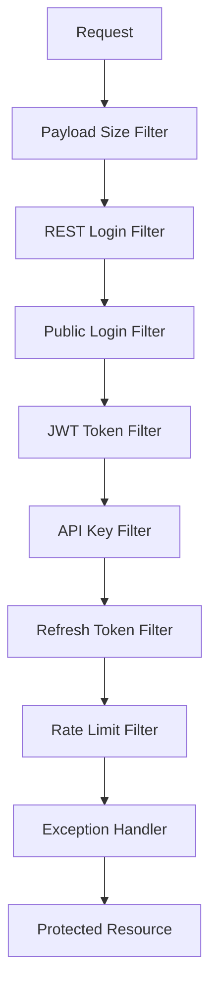

### Protected vs Unprotected Paths

**Unprotected (permitAll):**
- `/index.html`, `/*.html`
- `/assets/**`, `/static/**`
- `/api/noauth/**`
- `/api/auth/login`, `/api/auth/token`

**Protected (authenticated):**
- `/api/**` (all other API endpoints)

### Authorization Headers

| Header | Format |
|--------|--------|
| Authorization | `Bearer <jwt-token>` |
| Authorization | `ApiKey <api-key-value>` |
| X-Authorization | `<jwt-token>` (legacy) |

**Query Parameter (WebSocket):**
```
/api/ws?token=<jwt-token>
```

## Token Refresh

### Refresh Endpoint

```
POST /api/auth/token
Content-Type: application/json

{
  "refreshToken": "<refresh-jwt>"
}
```

**Response:**
```json
{
  "token": "<new-access-jwt>",
  "refreshToken": "<new-refresh-jwt>"
}
```

### Refresh Process

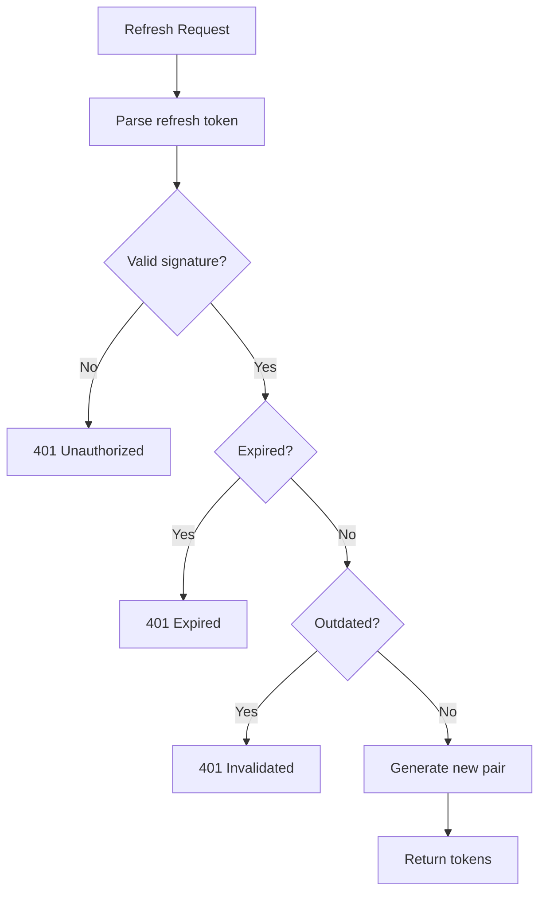

## Session Management

### Stateless Design

- No server-side session storage
- All state in JWT tokens
- SessionCreationPolicy: STATELESS

### Session Invalidation

Sessions are invalidated when:
- User explicitly logs out
- Password is changed
- Account is disabled
- Admin forces logout

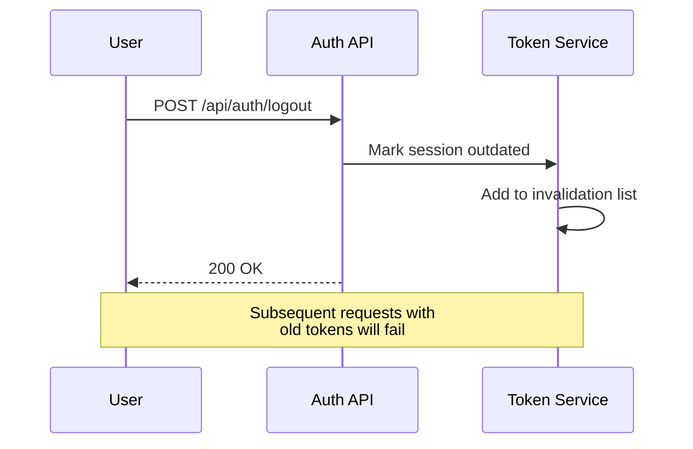

### Token Outdating Service

The TokenOutdatingService manages session invalidation:
- Tracks outdated tokens via distributed cache (UsersSessionInvalidation)
- Invalidates tokens by session ID and user ID
- Listens to `UserAuthDataChangedEvent` to invalidate affected sessions
- Fires `UserCredentialsInvalidationEvent` and `UserSessionInvalidationEvent` on logout

### Internal Authority Types (v4.3.0)

| Authority | Purpose |
|-----------|---------|
| PRE_VERIFICATION_TOKEN | Temporary token during login before 2FA verification |
| MFA_CONFIGURATION_TOKEN | Temporary token during MFA setup flow |

### Public Customer Login

Public customers can authenticate via:

```
POST /api/auth/login/public
Content-Type: application/json

{
  "publicId": "<public-customer-uuid>"
}
```

## Rate Limiting

### Protected Operations

| Operation | Default Limit |
|-----------|---------------|
| 2FA Code Send | 1 per minVerificationCodeSendPeriod |
| 2FA Verification | 5 per 300 seconds |
| Password Reset | 5 per 3600 seconds |

### Rate Limit Response

```json
{
  "status": 429,
  "message": "Too many requests",
  "errorCode": "TOO_MANY_REQUESTS"
}
```

## Error Handling

### Authentication Errors

| Status | Error | Cause |
|--------|-------|-------|
| 400 | BadCredentialsException | Invalid credentials |
| 401 | Unauthorized | Missing/invalid token |
| 403 | Forbidden | Disabled account |
| 409 | Conflict | User not found |
| 423 | Locked | Account locked |
| 429 | Too Many Requests | Rate limit exceeded |

### Error Response Format

```json
{
  "status": 400,
  "message": "Authentication Failed. Username or Password not valid.",
  "errorCode": "BAD_REQUEST_PARAMS",
  "timestamp": 1609459200000
}
```

## Audit Logging

All authentication events are logged:
- Login attempts (success/failure)
- Logout events
- Account lockouts
- Password changes
- 2FA verification attempts

| Field | Description |
|-------|-------------|
| actionType | LOGIN, LOGOUT, LOCKOUT |
| user | Username attempted |
| timestamp | Event time |
| clientIP | Request source IP |
| userAgent | Client information |
| result | SUCCESS or FAILURE |

### Enhanced Audit Information (v4.3.0)

Login audit logs include detailed user agent parsing:
- **Browser family** + version (Chrome 120, Firefox 115, etc.)
- **OS family** + version (Windows 11, macOS 14, etc.)
- **Device family** (Desktop, Mobile, Tablet)

### Last Login Tracking

The system tracks last login timestamp per user:
- Updated on successful authentication via `userService.updateLastLoginTs()`
- Available in user entity for display in admin UI

## Best Practices

### For Client Applications

- Store tokens securely (HTTP-only cookies preferred)
- Implement automatic token refresh
- Handle 401 responses gracefully
- Never log or expose tokens

### For Integrations

- Use API keys with expiration dates
- Rotate keys regularly
- Use minimal required permissions
- Monitor API key usage

### For Administrators

- Enable 2FA for admin accounts
- Configure appropriate password policies
- Monitor failed login attempts
- Review audit logs regularly
- Set up alerts for lockouts

## See Also

- [Authorization](./authorization.md) - Permission system
- [Tenant Isolation](./tenant-isolation.md) - Multi-tenancy security
- [REST API Overview](../06-api-layer/rest-api-overview.md) - API endpoints
- [Device Entity](../02-core-concepts/entities/device.md) - Device credentials
