# Authorization

## Overview

ThingsBoard implements a role-based access control (RBAC) system with three user authority levels and granular permissions on resources and operations. Authorization is enforced at two levels: endpoint-level authority checks and entity-level permission checks, ensuring users can only access resources they own or are assigned to.

## User Authority Hierarchy

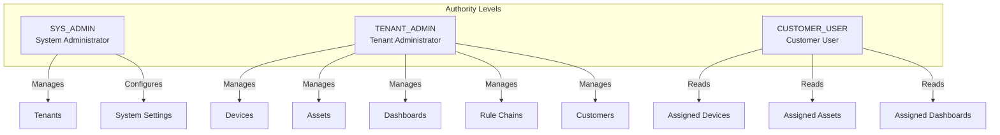

### Authority Descriptions

| Authority | Scope | Primary Responsibilities |
|-----------|-------|-------------------------|
| SYS_ADMIN | System-wide | Manage tenants, system settings, domains |
| TENANT_ADMIN | Single tenant | Manage all tenant resources and users |
| CUSTOMER_USER | Single customer | Read/interact with assigned entities |

## Permission Model

Authorization combines **Resources** (what) with **Operations** (what action).

### Resources (28 Types)

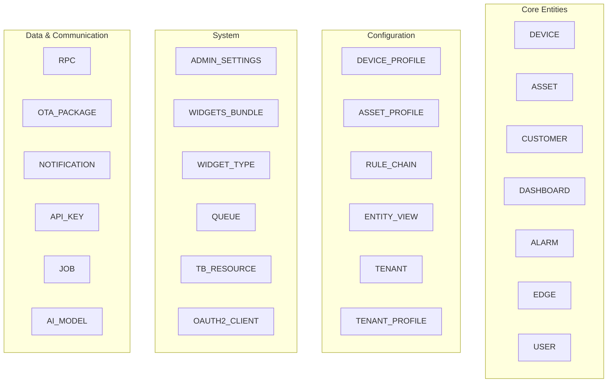

**Complete Resource List:**

| Category | Resources |
|----------|-----------|
| Core Entities | DEVICE, ASSET, CUSTOMER, DASHBOARD, ALARM, EDGE, USER |
| Profiles | DEVICE_PROFILE, ASSET_PROFILE, TENANT_PROFILE |
| Configuration | RULE_CHAIN, ENTITY_VIEW, TENANT, CONVERTER, INTEGRATION |
| Widgets | WIDGETS_BUNDLE, WIDGET_TYPE |
| System | ADMIN_SETTINGS, QUEUE, TB_RESOURCE, DOMAIN, VERSION_CONTROL |
| Security | OAUTH2_CLIENT, API_KEY, WHITE_LABELING |
| Data & Automation | RPC, OTA_PACKAGE, NOTIFICATION, JOB, AI_MODEL |
| Advanced | CALCULATED_FIELD, ENTITY_GROUP, MOBILE_APP |

### Operations (18 Types)

| Operation | Purpose |
|-----------|---------|
| ALL | Wildcard for all operations |
| CREATE | Create new entity |
| READ | Retrieve entity |
| WRITE | Update entity |
| DELETE | Remove entity |
| ASSIGN_TO_CUSTOMER | Assign entity to customer |
| UNASSIGN_FROM_CUSTOMER | Remove entity from customer |
| RPC_CALL | Execute remote procedure call |
| READ_CREDENTIALS | View device credentials |
| WRITE_CREDENTIALS | Update device credentials |
| READ_ATTRIBUTES | View entity attributes |
| WRITE_ATTRIBUTES | Update entity attributes |
| READ_TELEMETRY | View time-series data |
| WRITE_TELEMETRY | Store time-series data |
| CLAIM_DEVICES | Claim unassigned devices |
| ASSIGN_TO_TENANT | Assign edge to tenant |
| READ_CALCULATED_FIELD | View calculated fields |
| WRITE_CALCULATED_FIELD | Modify calculated fields |

## Two-Level Authorization

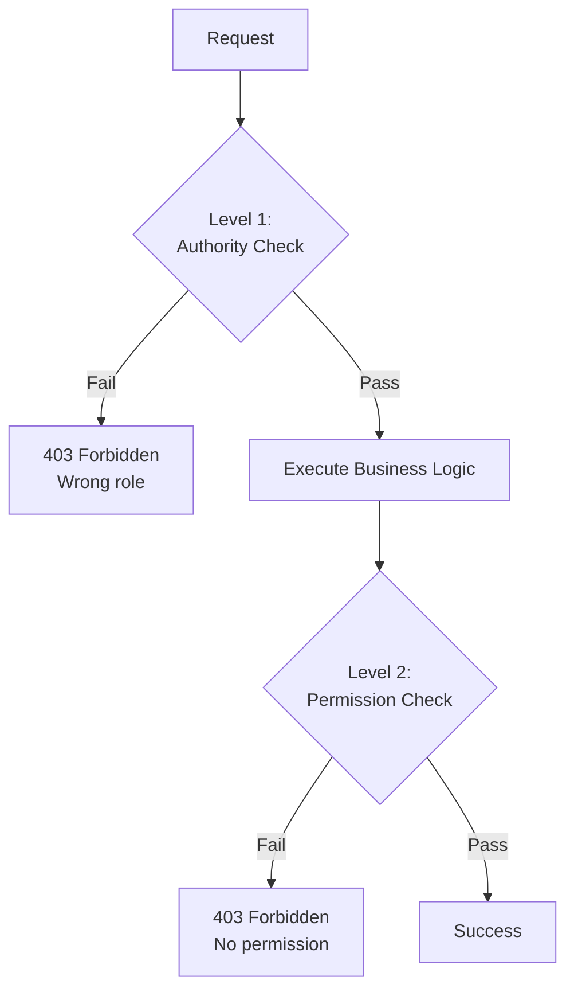

### Level 1: Authority Check (Endpoint)

Applied at API endpoint using annotations:

```
@PreAuthorize("hasAnyAuthority('TENANT_ADMIN', 'CUSTOMER_USER')")
```

- Fast check: "Is user in allowed role?"
- Rejects unauthorized users immediately
- Example: SYS_ADMIN blocked from device endpoints

### Level 2: Permission Check (Entity)

Applied during business logic:

```
accessControlService.checkPermission(user, Resource.DEVICE, Operation.READ, deviceId)
```

- Checks: "Can this user do this operation on this entity?"
- Considers ownership, tenant membership, customer assignment
- Throws exception if denied

## Authorization Flow

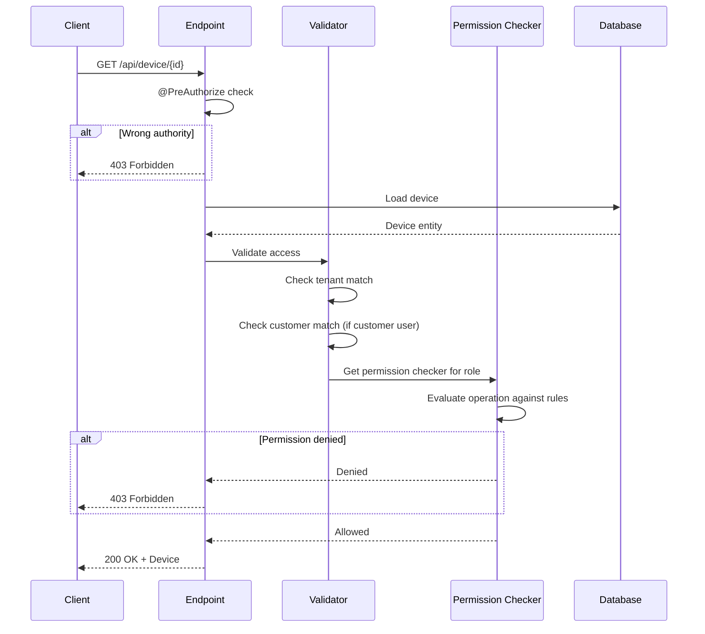

## Role Permissions Matrix

### System Administrator

| Resource | Allowed | Restricted |
|----------|---------|------------|
| TENANT | ALL | - |
| TENANT_PROFILE | ALL | - |
| ADMIN_SETTINGS | ALL | - |
| DOMAIN | ALL | - |
| DASHBOARD | READ | CREATE, WRITE, DELETE |
| WIDGETS_BUNDLE | ALL (system) | - |
| DEVICE | NONE | All operations |
| ASSET | NONE | All operations |
| CUSTOMER | NONE | All operations |

**Key Restrictions:**
- Cannot access tenant-owned devices, assets, or customers
- Cannot manage customer users
- Can only read dashboards (system-wide view)

### Tenant Administrator

| Resource | Allowed | Condition |
|----------|---------|-----------|
| DEVICE | ALL | Must belong to tenant |
| ASSET | ALL | Must belong to tenant |
| CUSTOMER | ALL | Must belong to tenant |
| DASHBOARD | ALL | Must belong to tenant |
| RULE_CHAIN | ALL | Must belong to tenant |
| USER | ALL | Non-SYS_ADMIN in tenant |
| ALARM | ALL | Must belong to tenant |
| EDGE | ALL | Must belong to tenant |
| WIDGETS_BUNDLE | READ | System resources |
| WIDGETS_BUNDLE | ALL | Tenant-owned |

**Key Capabilities:**
- Full control of all tenant resources
- Can manage customer users within tenant
- Read-only access to system resources

### Customer User

| Resource | Allowed Operations | Condition |
|----------|-------------------|-----------|
| DEVICE | READ, WRITE, RPC_CALL, READ_CREDENTIALS, READ/WRITE_ATTRIBUTES, READ/WRITE_TELEMETRY, CLAIM_DEVICES | Assigned to customer |
| ASSET | READ, WRITE, READ/WRITE_ATTRIBUTES, READ/WRITE_TELEMETRY, CLAIM_DEVICES | Assigned to customer |
| DASHBOARD | READ, READ_ATTRIBUTES, READ_TELEMETRY | Assigned to customer |
| ALARM | READ, READ_ATTRIBUTES, READ_TELEMETRY | On assigned entities |
| CUSTOMER | READ | Own customer only |
| USER | READ | Other users in customer |
| WIDGETS_BUNDLE | READ | System or tenant |
| DEVICE_PROFILE | READ | System or tenant |

**Key Restrictions:**
- Cannot CREATE, DELETE any entities
- Cannot access RULE_CHAIN, TENANT resources
- Cannot see entities not assigned to their customer

## Entity-Level Access Rules

### Tenant Membership Check

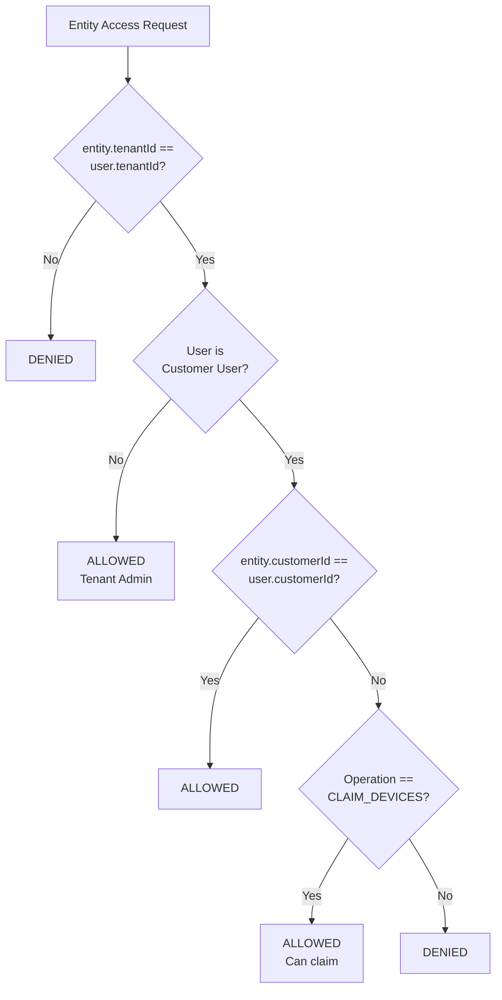

### Customer Assignment Check

For customer users, additional check required:

| Scenario | Result |
|----------|--------|
| Device assigned to user's customer | Allowed |
| Device assigned to different customer | Denied |
| Device unassigned + CLAIM operation | Allowed |
| Device unassigned + other operation | Denied |

### Dashboard Assignment

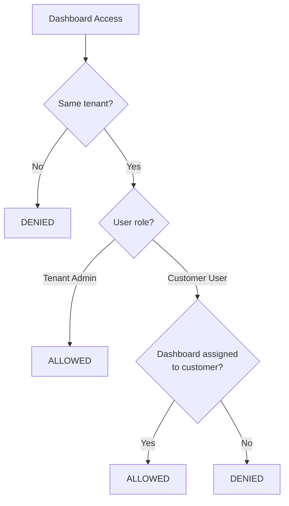

## Special Permissions

### RPC Permissions

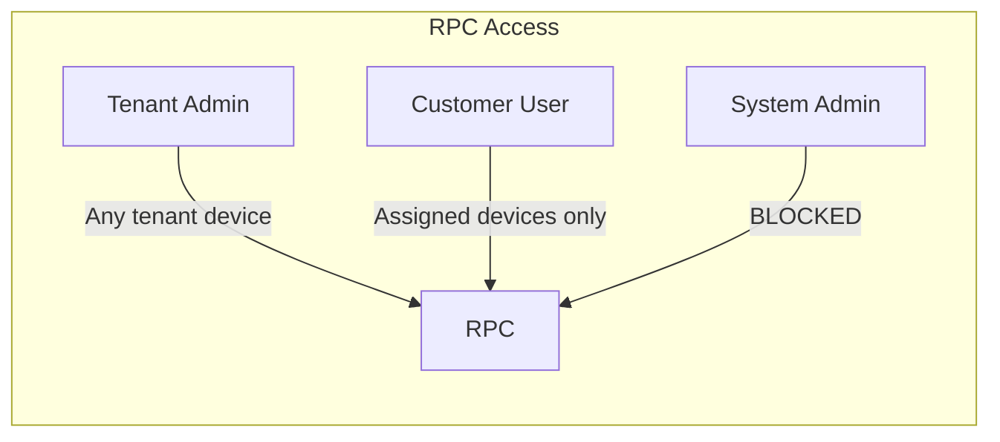

### Device Claiming

Customer users can claim unclaimed devices:

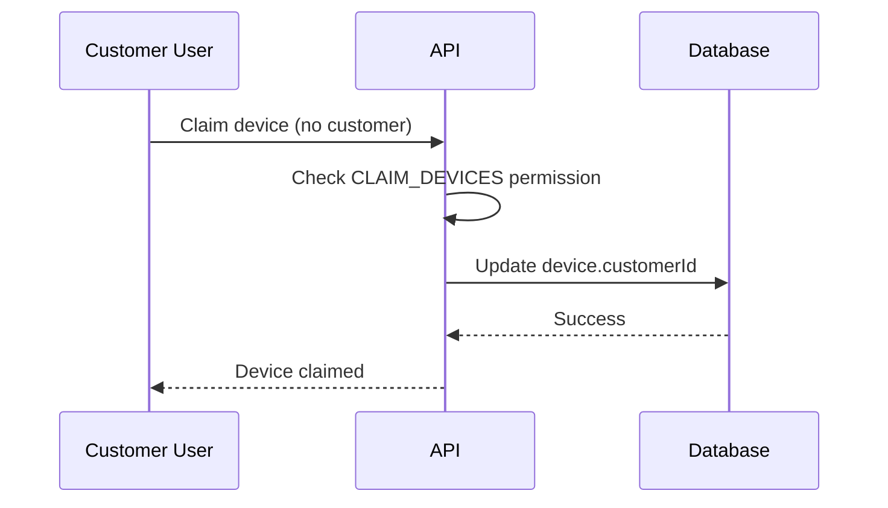

### Alarm Access

- Tenant Admin: All tenant alarms
- Customer User: Only alarms on assigned entities

```
alarm.tenantId == user.tenantId
AND alarm.customerId == user.customerId
```

### Telemetry & Attributes

| Operation | Tenant Admin | Customer User |
|-----------|--------------|---------------|
| READ_TELEMETRY | All tenant entities | Assigned entities |
| WRITE_TELEMETRY | All tenant entities | Assigned entities |
| READ_ATTRIBUTES | All tenant entities | Assigned entities |
| WRITE_ATTRIBUTES | All tenant entities | Assigned entities |

## System Resources

Some resources exist at system level (null tenant):

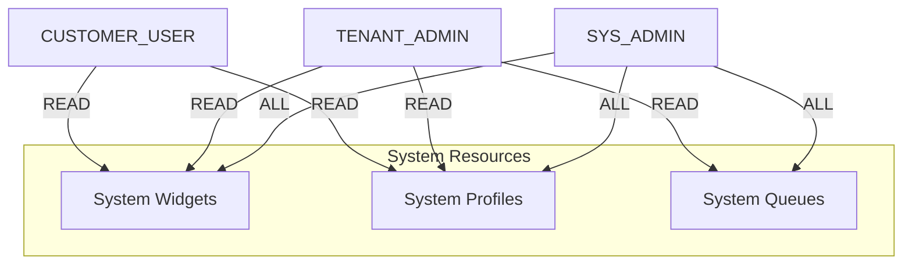

- System admins: Full access
- Tenant admins: Read-only access
- Customer users: Read-only access (widgets, profiles)

## Common Authorization Patterns

### Pattern 1: Tenant Admin Accessing Device

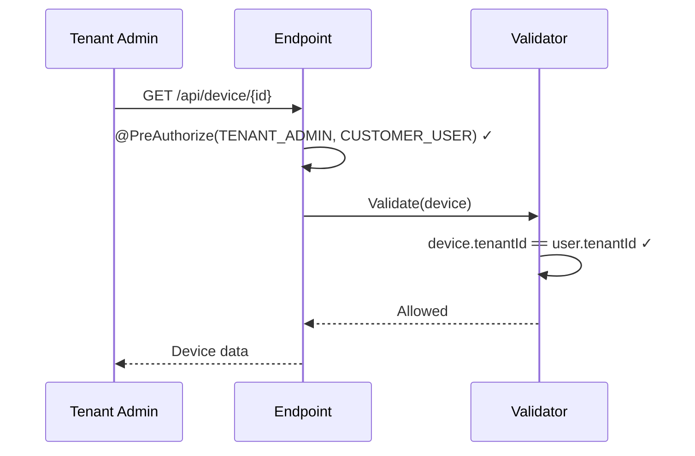

### Pattern 2: Customer User Accessing Assigned Device

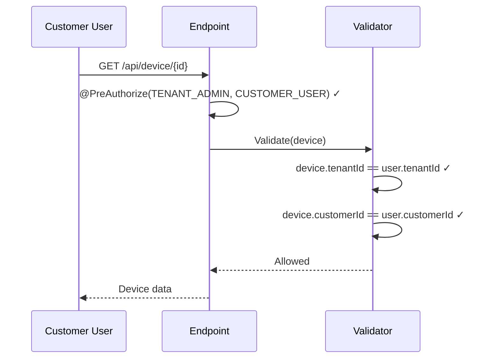

### Pattern 3: Customer User Blocked from Unassigned Device

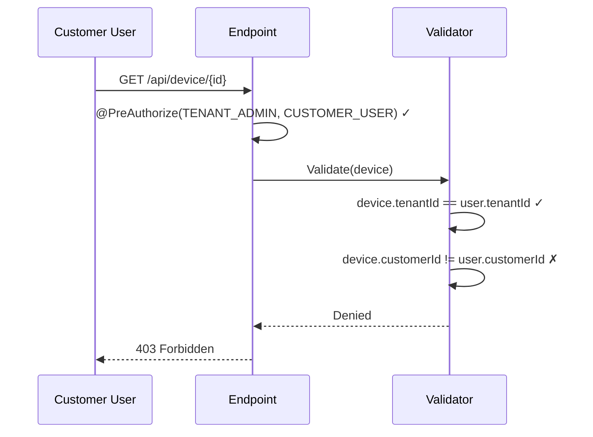

### Pattern 4: System Admin Blocked from Device

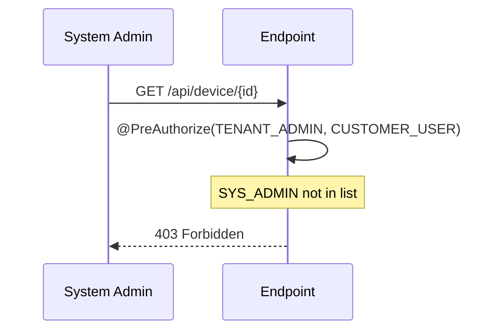

### Pattern 5: Customer User Claiming Device

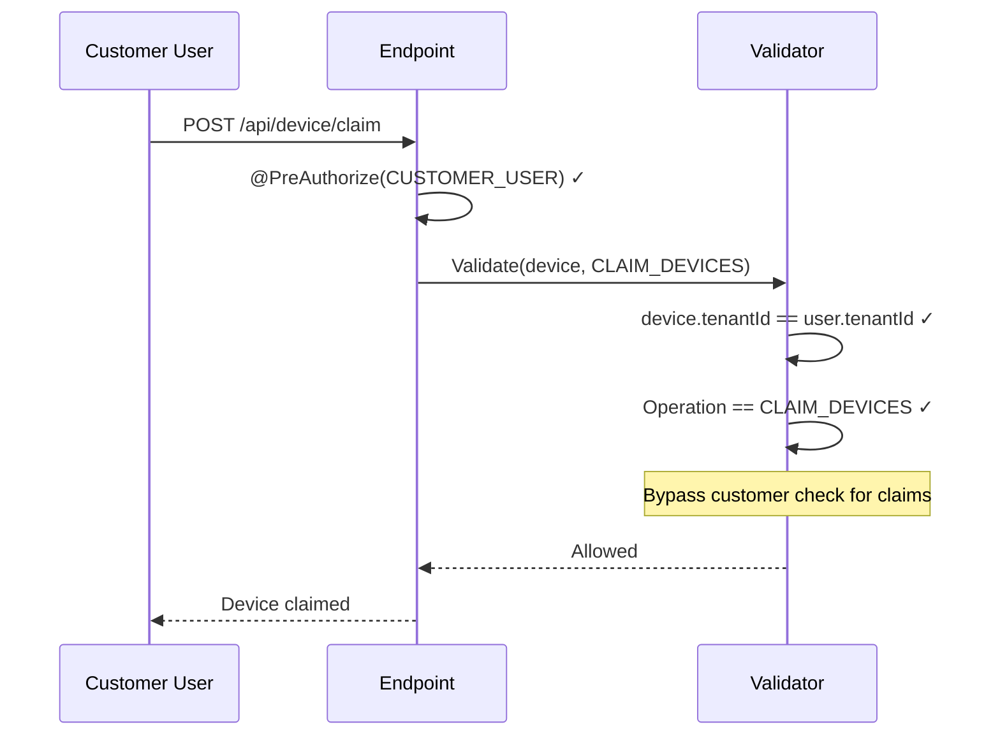

## Public Access

### Public Customers

- Customers can be marked as public
- Public customers are discoverable
- Set via `additionalInfo.isPublic`

### Public Dashboards

- Dashboards explicitly assigned to customers
- Customer users see only assigned dashboards
- No anonymous public dashboard access (requires authentication)

## Error Responses

| Status | Message | Cause |
|--------|---------|-------|
| 403 | "You don't have permission to perform this operation!" | Permission check failed |
| 403 | "System admin not allowed" | SYS_ADMIN accessing tenant resource |
| 403 | "Customer user not allowed" | CUSTOMER_USER accessing restricted resource |

## Best Practices

### For Tenant Administrators

- Use customers to delegate access to subsets of devices
- Assign dashboards explicitly to customers
- Review customer user permissions regularly
- Use device claiming for self-service provisioning

### For Customer Users

- Request device assignment from tenant admin
- Use claiming for unassigned devices
- Remember: read-only access to most resources

### For System Administrators

- Create tenant admins to manage tenant resources
- Don't try to access tenant devices directly
- Use system-level resources for shared configurations

## AccessControlService

The `AccessControlService` is the central authorization component that evaluates all permission checks.

### Core Methods

| Method | Purpose |
|--------|---------|
| `checkPermission(user, resource, operation)` | Check permission without entity context |
| `checkPermission(user, resource, operation, entityId)` | Check permission for specific entity |
| `filterEntityById(user, entityId)` | Filter entity in queries by ownership |
| `getPermissionChecker(authority)` | Get role-specific permission checker |

### Permission Checker Implementations

| Authority | Checker Class | Primary Logic |
|-----------|--------------|---------------|
| SYS_ADMIN | SysAdminPermissionChecker | Resource whitelist only |
| TENANT_ADMIN | TenantAdminPermissionChecker | Tenant ID match |
| CUSTOMER_USER | CustomerUserPermissionChecker | Tenant + Customer match |

## Permission Checker Logic

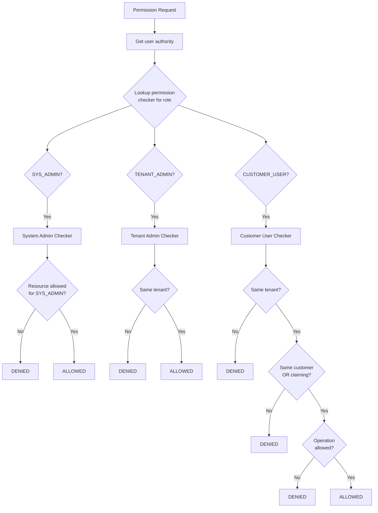

## Entity List Filtering (QueryContext)

When querying entity lists, the system automatically filters results based on user permissions:

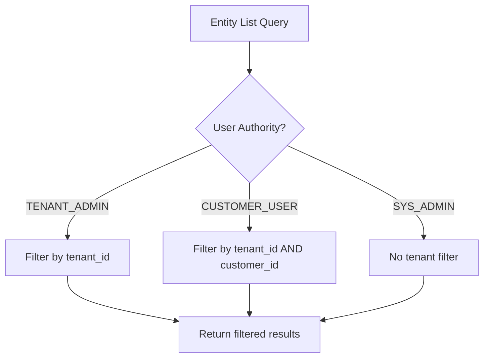

### QueryContext Usage

| User Type | Automatic Query Filter |
|-----------|----------------------|
| SYS_ADMIN | None (sees all tenants) |
| TENANT_ADMIN | `WHERE tenant_id = :userTenantId` |
| CUSTOMER_USER | `WHERE tenant_id = :userTenantId AND customer_id = :userCustomerId` |

This ensures users never see entities outside their permission scope, even in list views.

## Common Pitfalls

### Role Hierarchy Misunderstanding

| Pitfall | Symptom | Solution |
|---------|---------|----------|
| **Expecting SYS_ADMIN to access devices** | 403 Forbidden on device endpoints | System admins manage tenants, not tenant resources; use Tenant Admin |
| **Customer user expects write access** | Cannot create/delete entities | Customer users have read-mostly access; use Tenant Admin for modifications |
| **Role inheritance assumptions** | Higher role missing lower permissions | Roles are distinct, not hierarchical; each role defines its own permissions |
| **Confusing authority with permission** | Access denied despite correct role | Authority gates endpoints; permissions gate entity access within those endpoints |

### Permission Scope Issues

| Pitfall | Symptom | Solution |
|---------|---------|----------|
| **Entity not assigned to customer** | Customer user gets 403 | Explicitly assign entities to customers via API or UI |
| **Wrong customer assignment** | User sees different customer's data | Verify entity.customerId matches user.customerId |
| **Orphaned permissions after entity deletion** | Stale references, potential errors | Clean up entity group memberships when entities are deleted |
| **Dashboard visible but widgets fail** | Dashboard loads, data missing | Dashboard permission != device/asset data permission; assign both |

### Entity Group Permissions (PE)

| Pitfall | Symptom | Solution |
|---------|---------|----------|
| **Generic vs Group role confusion** | Unexpected permission scope | Generic = recursive to all owned; Group = specific entity group only |
| **Sharing group without propagation** | Shared group visible but members aren't | Also share or assign the underlying entities |
| **Role assigned to wrong owner level** | Permissions don't apply as expected | Generic roles cascade from assignment point; verify owner hierarchy |
| **Missing Group Permission Entity (GPE)** | Role exists but doesn't grant access | Create GPE linking user group + role + entity group |

### API Endpoint Authorization

| Pitfall | Symptom | Solution |
|---------|---------|----------|
| **Calling wrong authority endpoint** | 403 immediately without entity check | Check API docs for required authority (TENANT_ADMIN vs CUSTOMER_USER) |
| **Entity ID enumeration attempts** | 403 "Entity not found" | Returns "not found" for cross-tenant IDs to prevent enumeration |
| **RPC blocked for system admin** | Cannot execute RPC | Use Tenant Admin or Customer User credentials for RPC operations |
| **Credentials endpoint restricted** | Cannot read device credentials | READ_CREDENTIALS permission required; not granted to all roles |

### Dashboard Permissions

| Pitfall | Symptom | Solution |
|---------|---------|----------|
| **Dashboard visible but empty** | Dashboard renders, no data | Assign data source entities (devices/assets) to same customer |
| **Widget "no permission" error** | Individual widgets fail | Widget queries entities user doesn't have access to |
| **Public dashboard without public customer** | Cannot access public dashboard | Create public customer and assign dashboard to it |
| **Dashboard state not persisting** | User preferences lost | Verify user has READ/WRITE_ATTRIBUTES on dashboard entity |

### Customer User Access Patterns

| Pitfall | Symptom | Solution |
|---------|---------|----------|
| **Claiming already-assigned device** | Claim fails | CLAIM_DEVICES only works for unassigned devices |
| **Cannot see alarms on assigned device** | Alarm list empty | Verify alarm.customerId matches user.customerId |
| **Entity view doesn't restrict data** | More data visible than expected | Entity view filters attributes/telemetry; assignment controls access |
| **Customer user creating sub-entities** | Cannot create devices for customer | Customer users cannot CREATE; tenant admin must create and assign |

### Cross-Role Operations

| Pitfall | Symptom | Solution |
|---------|---------|----------|
| **Customer user modifying shared entity** | Write fails | Customer users can only WRITE to entities assigned to their customer |
| **Tenant admin accessing other tenant** | 403 Forbidden | Tenant admins are scoped to single tenant; use system admin to switch |
| **System admin trying direct entity access** | 403 on device/asset endpoints | System admin must impersonate or create tenant admin to access |

### Best Practice Violations

| Pitfall | Symptom | Solution |
|---------|---------|----------|
| **Single tenant admin for all operations** | Audit trail unclear | Create role-specific users; leverage custom roles (PE) |
| **Broad permissions to all users** | Security exposure | Use principle of least privilege; grant minimum required permissions |
| **Not testing customer user experience** | Permission gaps discovered in production | Test as customer user during development |
| **Ignoring permission check in custom widgets** | Data leakage through widgets | Widgets inherit user permissions; don't bypass in custom code |

## See Also

- [Authentication](./authentication.md) - How users prove identity
- [Tenant Isolation](./tenant-isolation.md) - Multi-tenancy security
- [Customer Entity](../02-core-concepts/entities/customer.md) - Customer model
- [Device Entity](../02-core-concepts/entities/device.md) - Device ownership
