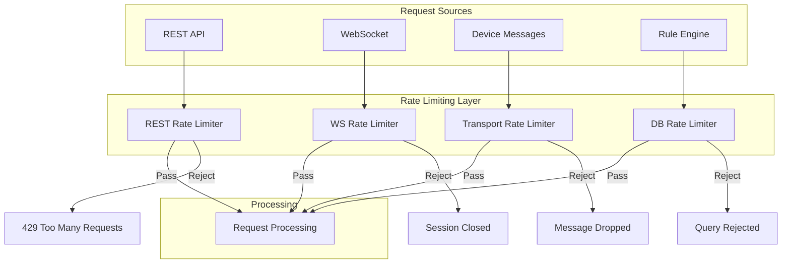
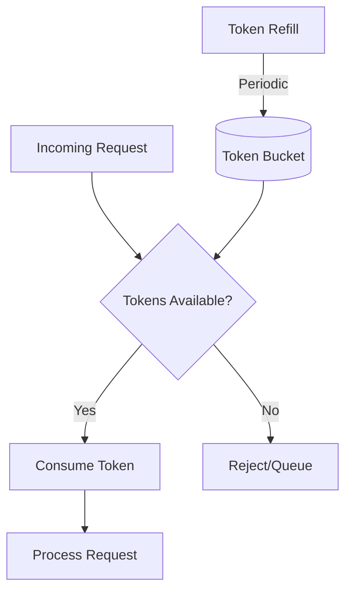
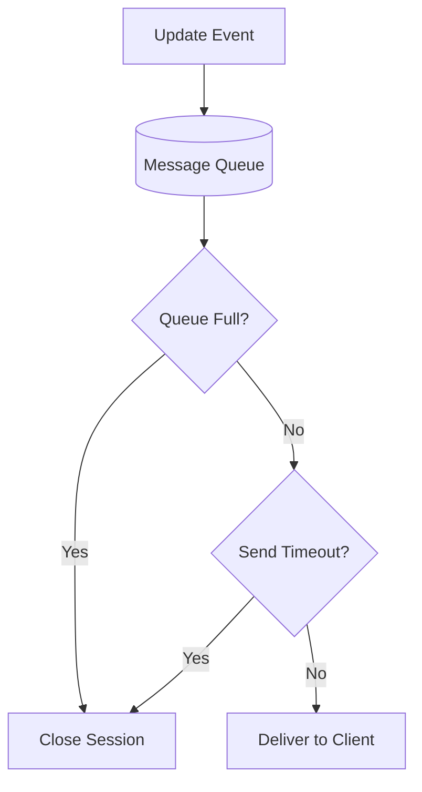
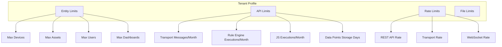
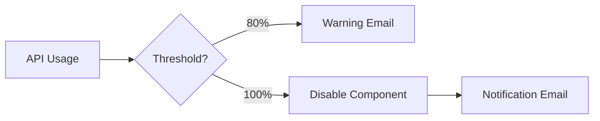
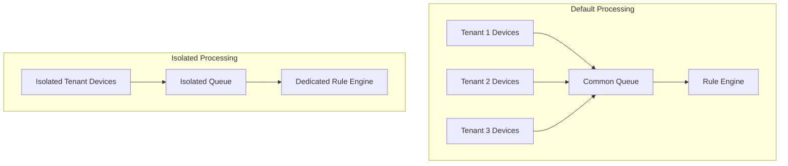

# Rate Limiting and API Usage

## Overview

ThingsBoard provides comprehensive rate limiting and API usage controls to protect the platform from overload and ensure fair resource allocation across tenants. Rate limits apply at multiple levels: REST API, WebSocket, Transport (device messages), and Database queries. System administrators configure limits via tenant profiles and system configuration, while tenant administrators monitor usage through dashboards.

## Key Behaviors

1. **Token Bucket Algorithm**: Rate limits use token bucket for burst handling with sustained limits.

2. **Multi-Level Limits**: Apply limits per tenant, customer, device, and user.

3. **API Usage Tracking**: Monitor and enforce monthly quotas for messages, executions, and storage.

4. **Automatic Throttling**: Platform disables components when limits are exceeded.

5. **Notifications**: Alert administrators when approaching or exceeding thresholds.

## Rate Limit Architecture



## Rate Limit Configuration

### Limit Format

Rate limits use the format `count:seconds`:

```
100:1       # 100 requests per second
2000:60     # 2000 requests per minute
100:1,2000:60  # Burst of 100/sec, max 2000/min
```

**Multiple Intervals:**
Comma-separated limits create compound rules. All limits must be satisfied.

### Token Bucket Algorithm



**Parameters:**
- Bucket capacity = maximum burst size
- Refill rate = sustained throughput
- Multiple buckets for compound limits

## REST API Limits

### Configuration

```yaml
server:
  rest:
    limits:
      tenant:
        enabled: "${TB_SERVER_REST_LIMITS_TENANT_ENABLED:false}"
        configuration: "${TB_SERVER_REST_LIMITS_TENANT_CONFIGURATION:100:1,2000:60}"
      customer:
        enabled: "${TB_SERVER_REST_LIMITS_CUSTOMER_ENABLED:false}"
        configuration: "${TB_SERVER_REST_LIMITS_CUSTOMER_CONFIGURATION:50:1,1000:60}"
```

### Limit Levels

| Level | Environment Variable | Default |
|-------|---------------------|---------|
| Tenant | `TB_SERVER_REST_LIMITS_TENANT_CONFIGURATION` | 100:1,2000:60 |
| Customer | `TB_SERVER_REST_LIMITS_CUSTOMER_CONFIGURATION` | 50:1,1000:60 |

### Response on Limit Exceeded

```http
HTTP/1.1 429 Too Many Requests
Retry-After: 1
Content-Type: application/json

{
  "status": 429,
  "message": "Too many requests",
  "errorCode": 31,
  "timestamp": "2024-01-15T10:30:00Z"
}
```

## WebSocket Limits

### Configuration

```yaml
server:
  ws:
    send_timeout: "${TB_SERVER_WS_SEND_TIMEOUT:5000}"
    limits:
      max_sessions_per_tenant: "${TB_SERVER_WS_TENANT_RATE_LIMITS_MAX_SESSIONS_PER_TENANT:0}"
      max_sessions_per_customer: "${TB_SERVER_WS_TENANT_RATE_LIMITS_MAX_SESSIONS_PER_CUSTOMER:0}"
      max_sessions_per_regular_user: "${TB_SERVER_WS_TENANT_RATE_LIMITS_MAX_SESSIONS_PER_REGULAR_USER:0}"
      max_sessions_per_public_user: "${TB_SERVER_WS_TENANT_RATE_LIMITS_MAX_SESSIONS_PER_PUBLIC_USER:0}"
      max_queue_per_ws_session: "${TB_SERVER_WS_TENANT_RATE_LIMITS_MAX_QUEUE_PER_WS_SESSION:500}"
      max_subscriptions_per_tenant: "${TB_SERVER_WS_TENANT_RATE_LIMITS_MAX_SUBSCRIPTIONS_PER_TENANT:0}"
      max_subscriptions_per_customer: "${TB_SERVER_WS_TENANT_RATE_LIMITS_MAX_SUBSCRIPTIONS_PER_CUSTOMER:0}"
      max_subscriptions_per_regular_user: "${TB_SERVER_WS_TENANT_RATE_LIMITS_MAX_SUBSCRIPTIONS_PER_REGULAR_USER:0}"
      max_subscriptions_per_public_user: "${TB_SERVER_WS_TENANT_RATE_LIMITS_MAX_SUBSCRIPTIONS_PER_PUBLIC_USER:0}"
      max_updates_per_session: "${TB_SERVER_WS_TENANT_RATE_LIMITS_MAX_UPDATES_PER_SESSION:300:1,3000:60}"
```

### Limit Types

| Limit | Description | Default |
|-------|-------------|---------|
| `max_sessions_per_tenant` | Max concurrent WS connections per tenant | 0 (unlimited) |
| `max_sessions_per_customer` | Max concurrent WS connections per customer | 0 (unlimited) |
| `max_sessions_per_regular_user` | Max concurrent WS connections per user | 0 (unlimited) |
| `max_sessions_per_public_user` | Max concurrent WS connections for public dashboards | 0 (unlimited) |
| `max_queue_per_ws_session` | Max queued messages before session close | 500 |
| `max_subscriptions_per_tenant` | Max active subscriptions per tenant | 0 (unlimited) |
| `max_updates_per_session` | Rate limit for updates sent to client | 300:1,3000:60 |

### Slow Client Handling



## Transport Rate Limits

### Configuration

```yaml
transport:
  rate_limits:
    enabled: "${TB_TRANSPORT_RATE_LIMITS_ENABLED:false}"
    tenant: "${TB_TRANSPORT_RATE_LIMITS_TENANT:1000:1,20000:60}"
    device: "${TB_TRANSPORT_RATE_LIMITS_DEVICE:10:1,300:60}"
```

### Limit Levels

| Level | Default | Description |
|-------|---------|-------------|
| Tenant | 1000:1,20000:60 | All devices per tenant combined |
| Device | 10:1,300:60 | Individual device limit |

### Message Types Affected

- Telemetry uploads
- Attribute updates
- RPC requests/responses
- Connection events
- Claiming requests

## Database Rate Limits

### Cassandra Query Limits

```yaml
cassandra:
  query:
    rate_limit_print_interval_ms: "${CASSANDRA_QUERY_RATE_LIMIT_PRINT_MS:10000}"
    tenant_rate_limits:
      enabled: "${CASSANDRA_QUERY_TENANT_RATE_LIMITS_ENABLED:false}"
      configuration: "${CASSANDRA_QUERY_TENANT_RATE_LIMITS_CONFIGURATION:1000:1,30000:60}"
      print_tenant_names: "${CASSANDRA_QUERY_TENANT_RATE_LIMITS_PRINT_TENANT_NAMES:false}"
```

### Statistics Logging

```log
2024-01-15 10:51:25,020 [Thread-1] INFO  CassandraBufferedRateExecutor -
Permits queueSize [0] totalAdded [6395] totalLaunched [6395] totalReleased [6396]
totalFailed [0] totalExpired [0] totalRejected [0] totalRateLimited [0]
totalRateLimitedTenants [0] currBuffer [0]
```

## API Usage Limits (Tenant Profile)

### Tracked Metrics

| Metric | Description | Impact When Exceeded |
|--------|-------------|---------------------|
| Transport Messages | Device messages received | Device connections disabled |
| Transport Data Points | Key-value pairs in messages | Device connections disabled |
| Rule Engine Executions | Rule node executions | Rule engine disabled |
| JavaScript Executions | Custom script runs | Scripts disabled |
| Data Points Storage Days | Storage × retention days | Write operations disabled |
| Emails Sent | Emails via system SMTP | Email sending disabled |
| SMS Sent | SMS via system provider | SMS sending disabled |
| Alarms | Total alarms created | Alarm creation disabled |

### Data Point Counting

```json
{
  "stringKey": "value1",      // 1 data point
  "booleanKey": true,         // 1 data point
  "doubleKey": 42.0,          // 1 data point
  "longKey": 73,              // 1 data point
  "jsonKey": {                // 1 data point (entire JSON)
    "someNumber": 42,
    "someArray": [1,2,3]
  }
}
// Total: 5 data points
```

**Large Values:**
- Strings/JSON > 512 characters count as multiple data points

### Storage Days Calculation

```
Storage Days = Data Points × TTL Days
```

**Example:**
- 3 data points with 30-day TTL = 90 storage days
- Default TTL configurable in tenant profile
- Can override per message via Save Timeseries node

## Tenant Profile Rate Limits

### Configuration Options



### Entity Limits

| Entity | Description |
|--------|-------------|
| Devices | Maximum devices per tenant |
| Assets | Maximum assets per tenant |
| Users | Maximum users per tenant |
| Customers | Maximum customers per tenant |
| Dashboards | Maximum dashboards per tenant |
| Rule Chains | Maximum rule chains per tenant |
| Integrations (PE) | Maximum integrations |
| Converters (PE) | Maximum data converters |

### Threshold Notifications



## Isolated Queue Processing

### Enable Isolation

Tenant profiles can enable isolated message processing:



### Benefits

| Feature | Shared Queue | Isolated Queue |
|---------|--------------|----------------|
| Resource Isolation | Limited | Full |
| Performance Impact | Shared | Dedicated |
| Configuration | Simple | Custom queues |
| Cost | Lower | Higher |

## API Usage Dashboard

### Dashboard Components

| Panel | Description |
|-------|-------------|
| Current Usage | Real-time usage metrics |
| Hourly Trends | Usage over past 24 hours |
| Daily Trends | Usage over past 30 days |
| Monthly Summary | Current billing period |
| Limit Status | Green/Yellow/Red indicators |

### Status Indicators

| Color | Meaning | Action |
|-------|---------|--------|
| Green | < 50% of limit | Normal operation |
| Yellow | 50-80% of limit | Monitor closely |
| Orange | 80-100% of limit | Warning notification sent |
| Red | Limit exceeded | Component disabled |

## Best Practices

### Limit Configuration

| Practice | Benefit |
|----------|---------|
| Start with defaults | Baseline understanding |
| Monitor before tightening | Data-driven decisions |
| Set burst + sustained limits | Handle traffic spikes |
| Use compound limits | Fine-grained control |

### Monitoring

| Practice | Benefit |
|----------|---------|
| Review API usage dashboard | Proactive management |
| Set up notification rules | Early warning |
| Log rate limit events | Troubleshooting |
| Track per-tenant statistics | Identify abusers |

### Tenant Isolation

| Scenario | Recommendation |
|----------|----------------|
| Standard tenants | Shared queue with rate limits |
| Premium tenants | Isolated queues |
| Critical workloads | Dedicated Rule Engine instances |

## Troubleshooting

### Common Issues

| Issue | Cause | Solution |
|-------|-------|----------|
| 429 Too Many Requests | REST limit exceeded | Reduce request rate or increase limit |
| WebSocket disconnected | Slow client or limit exceeded | Optimize client or increase queue |
| Device messages dropped | Transport limit exceeded | Reduce message rate or increase limit |
| Rule engine disabled | Monthly quota exceeded | Wait for reset or upgrade plan |

### Debug Steps

1. Check current API usage in dashboard
2. Review rate limit configuration
3. Examine log files for rate limit events
4. Verify tenant profile settings
5. Monitor real-time statistics

### Log Analysis

Enable detailed logging for rate limits:

```yaml
logging:
  level:
    org.thingsboard.server.service.ratelimit: DEBUG
```

## Common Pitfalls

### Configuration Errors

| Pitfall | Symptom | Solution |
|---------|---------|----------|
| **Rate limits disabled by default** | No protection against abuse | Explicitly enable limits in production; set `enabled: true` |
| **Limits too aggressive** | Legitimate users blocked | Start with generous limits; tighten based on monitoring data |
| **Burst limit without sustained limit** | Prolonged abuse possible | Use compound limits: `100:1,2000:60` for burst AND sustained |
| **Wrong format syntax** | Config parsing error | Use `count:seconds` format; comma-separate multiple limits |

### Scope Misunderstanding

| Pitfall | Symptom | Solution |
|---------|---------|----------|
| **Per-tenant vs per-user confusion** | Wrong users blocked | REST limits are per-tenant; configure both tenant AND customer limits |
| **Device limit affects all tenant devices** | Legitimate device blocked | Device limit is per-device; tenant limit is aggregate of all devices |
| **IP-based bypass with shared NAT** | Many users blocked together | Use token-based identification, not IP |
| **WebSocket limit vs REST limit** | Different limits trigger unexpectedly | Configure both; WebSocket handles dashboard subscriptions |

### Distributed Deployment Issues

| Pitfall | Symptom | Solution |
|---------|---------|----------|
| **Per-node limits multiply capacity** | Actual limit = N × configured | Use distributed rate limiting (Redis) in clustered deployments |
| **Inconsistent limits across nodes** | Unpredictable blocking | Sync configuration across all nodes; use centralized config |
| **Load balancer retry loops** | Amplified request count | Configure load balancer to not retry on 429 responses |

### Response Handling

| Pitfall | Symptom | Solution |
|---------|---------|----------|
| **Client ignoring Retry-After header** | Repeated 429 responses | Implement exponential backoff respecting Retry-After |
| **No retry logic in integrations** | Data loss during throttling | Queue messages; retry after delay |
| **WebSocket closed without notice** | Dashboard stops updating | Monitor WS connection; reconnect with backoff |
| **Transport messages silently dropped** | Telemetry gaps | Implement device-side buffering and retry |

### Monitoring Gaps

| Pitfall | Symptom | Solution |
|---------|---------|----------|
| **No alerting on rate limit events** | Abuse undetected | Set up alerts for rate limit log patterns |
| **Cannot identify throttled tenant** | Support blind spots | Enable `print_tenant_names` for debugging |
| **API usage dashboard not configured** | No visibility into limits | Deploy API usage dashboard for tenant visibility |

### API Usage Quota Issues

| Pitfall | Symptom | Solution |
|---------|---------|----------|
| **Data points miscounted** | Unexpected quota exhaustion | Each JSON key = 1 point; large strings = multiple points |
| **Storage days accumulate** | Quota exceeded despite low data rate | Storage days = points × TTL; reduce TTL or point count |
| **Rule engine executions spike** | Quota depleted quickly | Optimize rule chains; reduce unnecessary node executions |
| **Monthly quota reset timing** | Budget miscalculated | Quota resets on billing cycle, not calendar month |

### Internal Service Bypass

| Pitfall | Symptom | Solution |
|---------|---------|----------|
| **Rule engine blocked by transport limits** | Internal processing fails | Internal services may need bypass; use isolated queues |
| **Notification service rate limited** | Alert delivery delayed | Configure notification service limits separately |
| **System admin actions blocked** | Admin cannot manage | Consider admin bypass or higher admin-specific limits |

### Performance Impact

| Pitfall | Symptom | Solution |
|---------|---------|----------|
| **Rate limiting adds latency** | Slower response times | In-memory rate limiting is fast; distributed adds ~1-5ms |
| **Lock contention at scale** | Throughput bottleneck | Token bucket implementations are lock-free; verify implementation |
| **Log flooding from rate limit events** | Disk/IO impact | Throttle rate limit logging itself; use sampling |

## See Also

- [Tenant Profiles](../02-core-concepts/entities/tenant.md) - Tenant configuration
- [Authentication](./authentication.md) - API authentication
- [REST API](../06-api-layer/rest-api-overview.md) - REST API endpoints
- [WebSocket](../06-api-layer/websocket-overview.md) - WebSocket connections
- [Message Queue](../08-message-queue/README.md) - Queue configuration
