# Tenant Isolation

## Overview

ThingsBoard implements comprehensive multi-tenant isolation through defense-in-depth across all system layers. Every data access path enforces tenant boundaries through mandatory tenant ID filtering at the database, API, permission, actor, queue, and cache layers. This ensures that data from one tenant cannot leak to another, even in the presence of bugs or misconfigurations in any single layer.

## Isolation Architecture

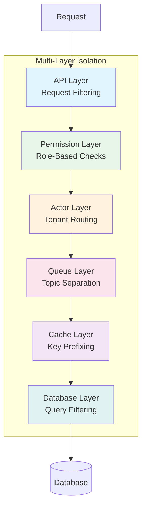

## Database Layer Isolation

### Query-Level Filtering

All repository queries enforce tenant isolation through explicit tenant_id filtering in WHERE clauses:

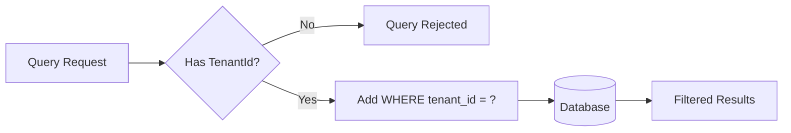

### Pattern: Mandatory Tenant Parameter

| Aspect | Implementation |
|--------|----------------|
| Query Style | Parameterized with @Param annotations |
| Required Field | Every entity query includes tenantId |
| Direct Access | No findById without tenant context |
| Injection Protection | JPA prepared statements |

### Example Query Pattern

```
SELECT d FROM DeviceEntity d
WHERE d.tenantId = :tenantId
AND (:textSearch IS NULL OR ilike(d.name, CONCAT('%', :textSearch, '%')) = true)
```

Key characteristics:
- Tenant ID is always the first filter condition
- No way to query across tenants
- Even system-level reports maintain tenant filtering

## API Layer Isolation

### Request Filtering

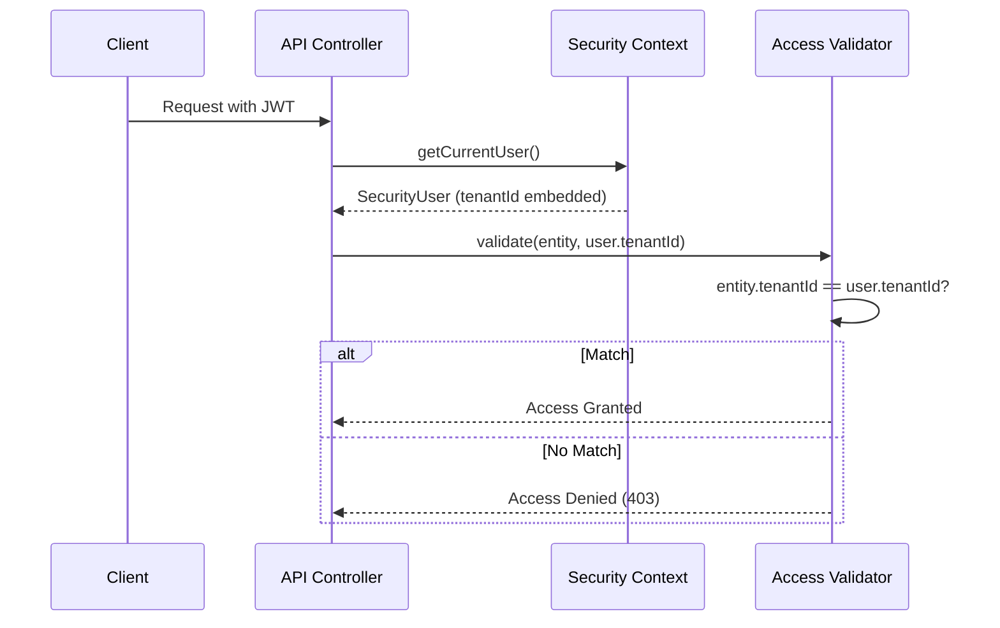

### Security User Context

| Field | Purpose |
|-------|---------|
| userId | Unique user identifier |
| tenantId | Immutable tenant association |
| customerId | Customer within tenant (if applicable) |
| sessionId | Unique session for isolation |
| authorities | Role-based permissions |

The tenant ID is:
- Extracted from the authenticated JWT
- Immutable for the session duration
- Automatically applied to all operations
- Never accepted from client input

### Access Validator Pattern

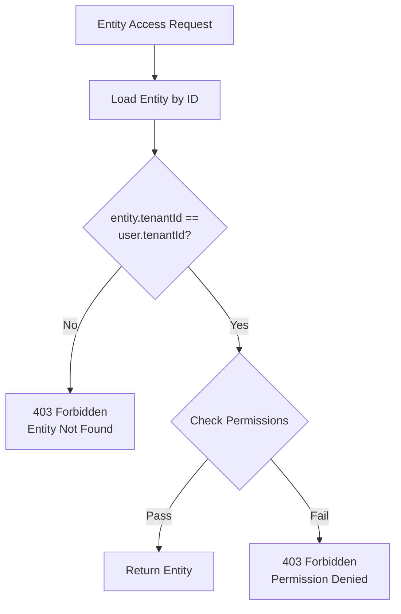

The validator:
1. Always passes the current user's tenant ID to service methods
2. Never trusts entity IDs alone
3. Validates ownership before returning data
4. Returns "not found" for cross-tenant access (prevents enumeration)

## Permission Layer Isolation

### Role-Based Tenant Checks

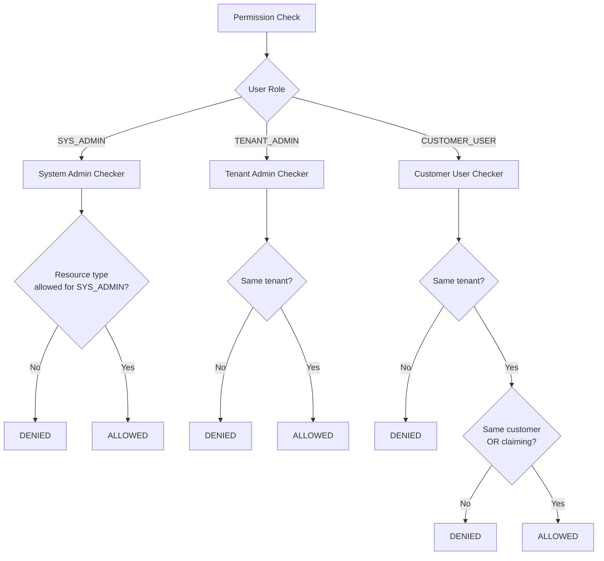

### HasTenantId Interface

All tenant-scoped entities implement a common interface:

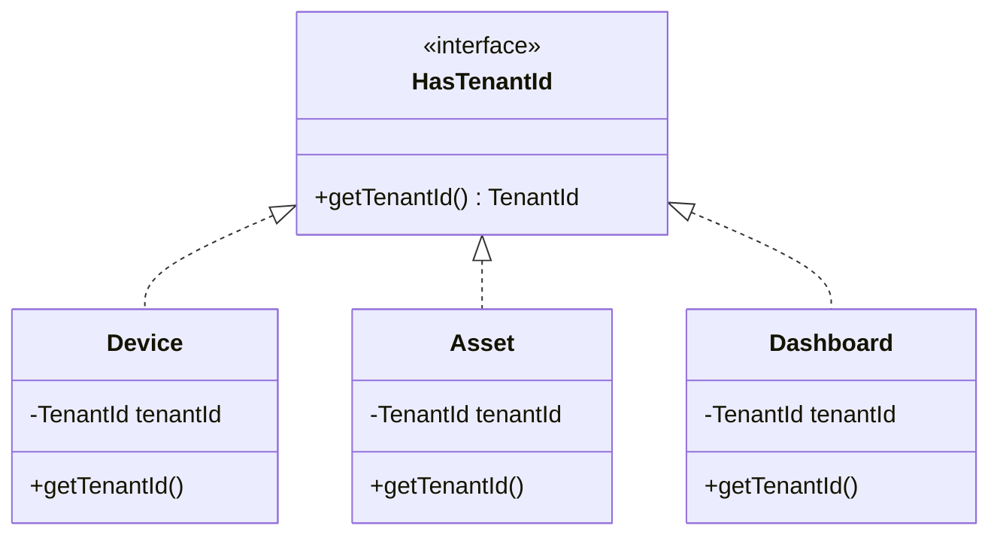

This interface enables:
- Type-safe tenant checking in permission validators
- Generic handling of tenant-scoped entities
- Compile-time enforcement of tenant association

## Actor System Isolation

### Tenant-Aware Message Routing

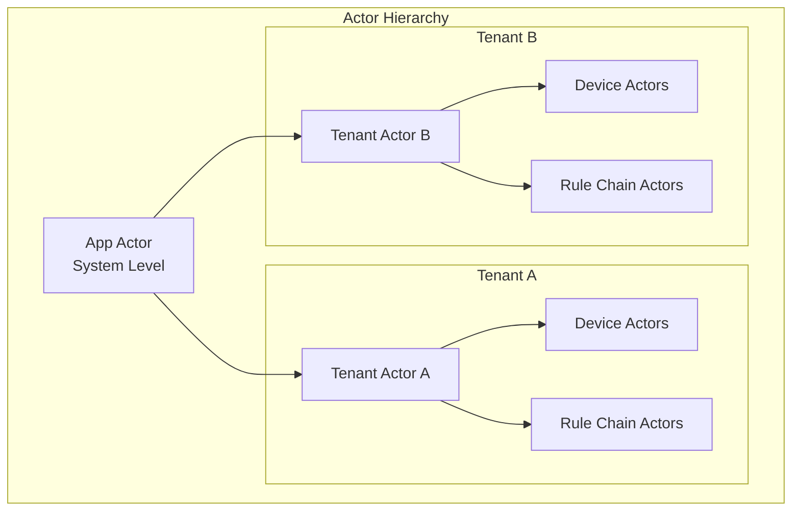

### Message Routing by Tenant

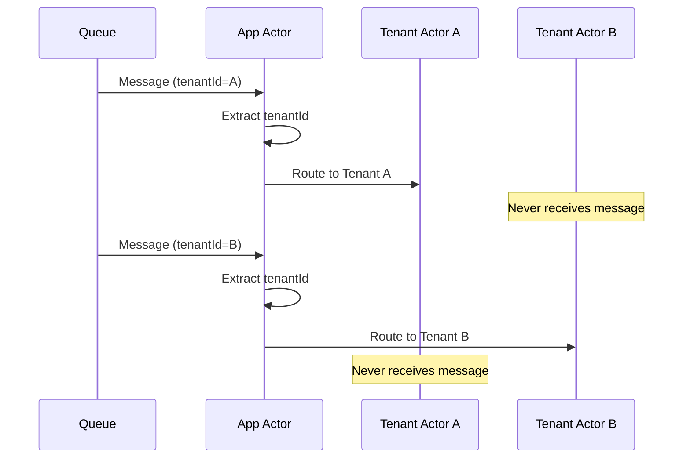

### TenantAwareMsg Interface

All routable messages include tenant identification:

| Field | Purpose |
|-------|---------|
| getTenantId() | Mandatory tenant identifier |
| getCallback() | Optional completion callback |

The App Actor:
- Routes messages only to the target tenant's actor
- Creates tenant actors on demand
- Rejects messages with system tenant ID
- Prevents cross-tenant message delivery

### System Tenant Protection

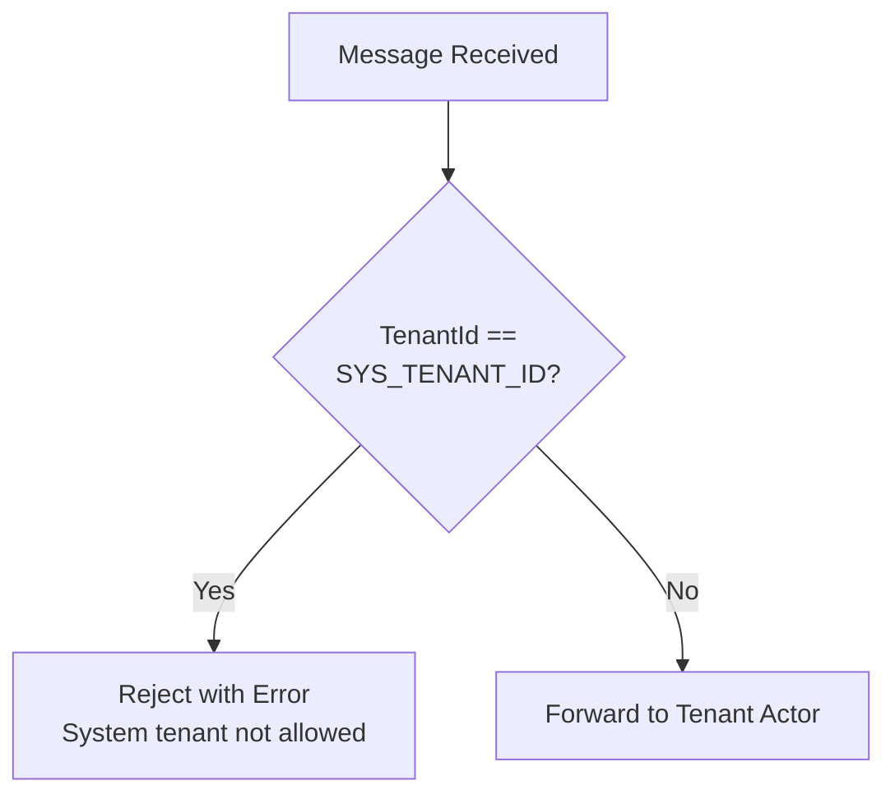

## Message Queue Isolation

### Topic Name Separation

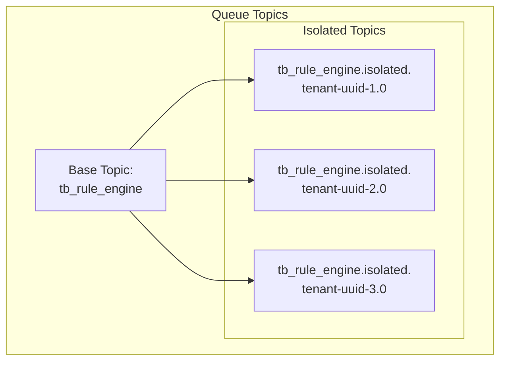

### Topic Structure

| Component | Example | Purpose |
|-----------|---------|---------|
| Base Topic | tb_rule_engine | Queue type |
| Isolation Marker | .isolated. | Tenant separation |
| Tenant UUID | 123e4567-e89b-... | Unique tenant |
| Partition | .0, .1, .2 | Load distribution |

Full topic name pattern:
```
{base_topic}.isolated.{tenant-uuid}.{partition}
```

### Queue Topic Examples

| Queue Type | Shared Topic | Isolated Topic |
|------------|--------------|----------------|
| Rule Engine | tb_rule_engine.main.0 | tb_rule_engine.isolated.abc123-def456.0 |
| Transport | tb_transport.main | tb_transport.isolated.abc123-def456 |
| Core | tb_core.main.0 | tb_core.isolated.abc123-def456.0 |
| Version Control | tb_vc.main.0 | tb_vc.isolated.abc123-def456.0 |

### Tenant Profile Queue Configuration

```mermaid
flowchart TD
    TP[Tenant Profile] --> IC{isolatedTbRuleEngine<br/>enabled?}
    IC -->|Yes| IT[Use Isolated Topic<br/>tb_rule_engine.isolated.{tenantId}]
    IC -->|No| ST[Use Shared Topic<br/>tb_rule_engine.main]
```

| Profile Setting | Effect |
|-----------------|--------|
| isolatedTbRuleEngine | Dedicated rule engine queue per tenant |
| isolatedTbCore | Dedicated core queue per tenant |
| isolatedTbTransport | Dedicated transport queue per tenant |

### Partition Service

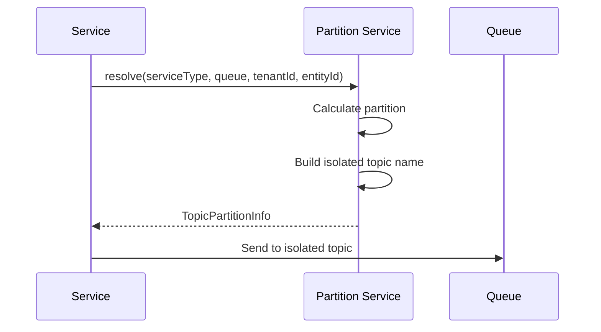

Benefits of queue isolation:
- Physical separation at broker level
- No message mixing between tenants
- Independent rate limiting per tenant
- Tenant removal clears only their topics

## Cache Layer Isolation

### Tenant-Prefixed Cache Keys

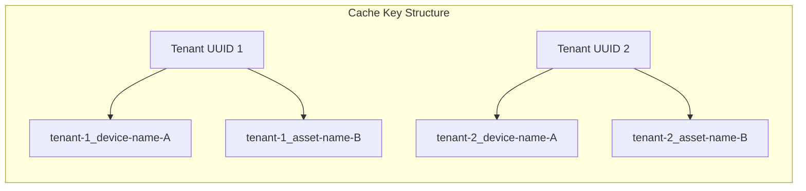

### Cache Key Pattern

| Entity Type | Key Format |
|-------------|------------|
| Device | {tenantId}_{deviceId} |
| Asset | {tenantId}_{assetName} |
| Customer | {tenantId}_{customerId} |
| Dashboard | {tenantId}_{dashboardId} |

### Cache Name Examples

| Cache | Key Format | Example |
|-------|------------|---------|
| deviceCredentials | {tenantId}_{deviceId} | abc123_device-001 |
| sessions | sessionId | sess-uuid-12345 |
| deviceByName | {tenantId}_{deviceName} | abc123_temperature-sensor |
| tenantProfiles | tenantProfileId | profile-uuid-789 |
| usersSessionInvalidation | userId | user-uuid-456 |
| rateLimits | {tenantId}_{limitKey} | abc123_DEVICE_TELEMETRY |

### Caffeine vs Redis Cache

| Aspect | Caffeine (Local) | Redis (Distributed) |
|--------|------------------|---------------------|
| Scope | Single node | Cluster-wide |
| Use Case | Hot data, frequent reads | Shared state |
| Tenant Isolation | Key prefix | Key prefix + namespace |
| Eviction | Per-node TTL | Cluster TTL |

Cache isolation ensures:
- Same entity name in different tenants = different keys
- No cache pollution between tenants
- Tenant deletion removes only their cache entries
- Redis/Caffeine naturally partitions by key prefix

### Cache Eviction on Tenant Deletion

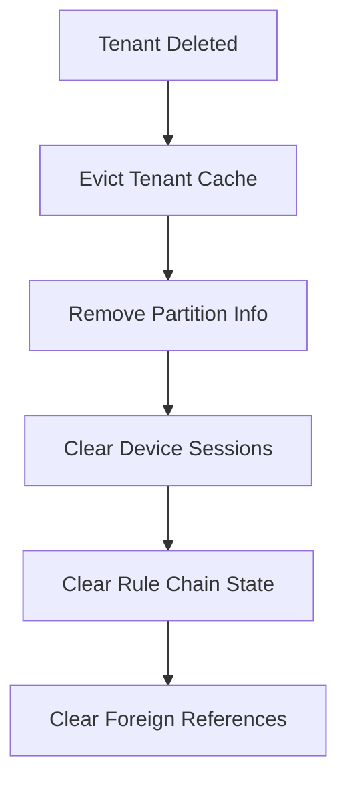

## Rate Limiting Per Tenant

ThingsBoard implements tenant-level rate limiting to ensure fair resource usage across tenants.

### Rate Limit Categories

| Category | Description |
|----------|-------------|
| DEVICE_TELEMETRY | Telemetry messages per device |
| DEVICE_TELEMETRY_DATA_POINTS | Data points per device |
| GATEWAY_TELEMETRY | Gateway telemetry throughput |
| TENANT_SERVER_REST_LIMITS | REST API calls per tenant |
| TENANT_ENTITY_COUNT | Entity creation limits |
| CUSTOMER_SERVER_REST_LIMITS | REST API calls per customer |

### Rate Limit Configuration

Rate limits are defined in tenant profiles:

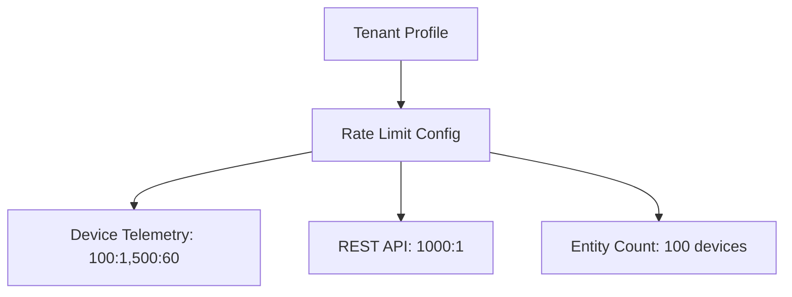

Configuration format: `count:period[,count:period,...]`
- `100:1` = 100 requests per 1 second
- `500:60` = 500 requests per 60 seconds

### Implementation

Rate limits use bucket4j token bucket algorithm:
- Per-tenant buckets stored in distributed cache
- Tenant ID used as bucket key prefix
- Exceeding limit returns HTTP 429

## Cross-Tenant Prevention Matrix

### Defense-in-Depth Layers

| Layer | Mechanism | What It Prevents |
|-------|-----------|------------------|
| Database | WHERE tenant_id = ? | Direct data access |
| API | SecurityUser.tenantId | Request spoofing |
| Permission | HasTenantId check | Entity theft |
| Actor | TenantAwareMsg routing | Message interception |
| Queue | Topic name isolation | Queue snooping |
| Cache | Key prefixing | Cache poisoning |

### Attack Prevention

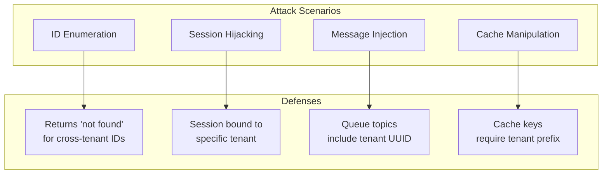

## Special Cases

### System Tenant (NULL_UUID)

The system tenant has special handling:

| Behavior | Description |
|----------|-------------|
| Reserved ID | NULL_UUID (13814000-1dd2-11b2-8080-808080808080) |
| Message Rejection | Rule engine rejects SYS_TENANT_ID messages |
| System Resources | Widgets, profiles owned by system tenant |
| Access | Only SYS_ADMIN can access system resources |

### Tenant Deletion

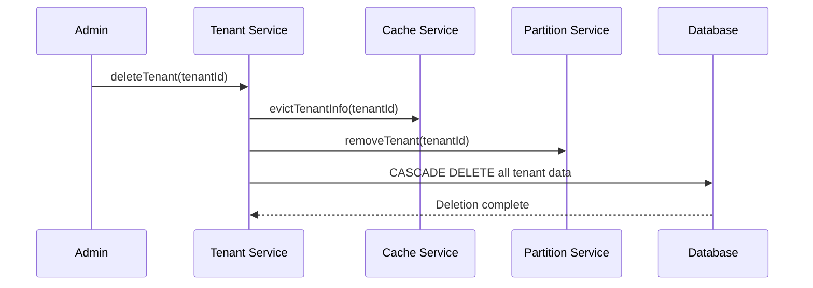

Cleanup includes:
- All entity data (devices, assets, dashboards)
- All telemetry and attributes
- Cache entries
- Queue partition assignments
- Actor instances

### Native SQL Queries

Native SQL queries require careful review:

| Risk | Mitigation |
|------|------------|
| Missing tenant filter | All queries use :tenantId parameter |
| SQL injection | Parameterized queries only |
| Dynamic queries | Generated with tenant ID always first |

## Async Operation Isolation

### Callback Context Propagation

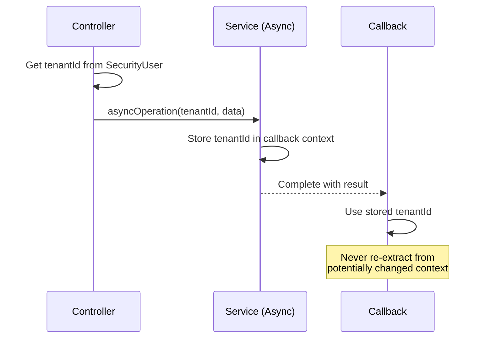

Async isolation requirements:
- Tenant ID captured at request start
- Passed explicitly to async operations
- Never re-extracted from security context in callbacks
- ListenableFuture callbacks receive tenant ID as closure

## Monitoring and Auditing

### Isolation Verification

| Check | Method |
|-------|--------|
| Query auditing | Review all native SQL for tenant filtering |
| Cache inspection | Verify key format includes tenant |
| Actor routing | Validate message destination actors |
| Queue topology | Confirm topic separation |

### Audit Events

| Event | Data Captured |
|-------|---------------|
| Cross-tenant attempt | Source tenant, target entity, operation |
| Permission denial | User, resource, operation, reason |
| Session creation | User, tenant, session ID, IP |
| Tenant deletion | Admin, tenant ID, cascade counts |

## Best Practices

### For Developers

- Always accept TenantId as method parameter
- Never extract tenant from entity ID alone
- Use type-safe TenantId wrapper, not raw UUID
- Test cross-tenant scenarios explicitly

### For Administrators

- Monitor failed access attempts
- Review audit logs for unusual patterns
- Test tenant isolation after upgrades
- Verify cleanup after tenant deletion

### For Security Auditors

- Review new repository methods for tenant filtering
- Check async code for context propagation
- Verify native queries include tenant parameter
- Test API endpoints with cross-tenant tokens

## See Also

- [Authentication](./authentication.md) - How users prove identity
- [Authorization](./authorization.md) - Permission model
- [Multi-Tenancy](../01-architecture/multi-tenancy.md) - Architecture overview
- [Tenant Entity](../02-core-concepts/entities/tenant.md) - Tenant model
