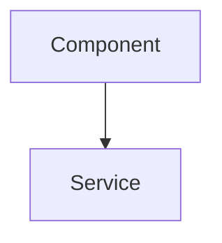

# CLAUDE.md - Frontend Section

This file provides guidance for working with the Frontend documentation section.

## Section Purpose

This section documents ThingsBoard's Angular frontend:

- **Angular Architecture**: Module structure, lazy loading, routing
- **State Management**: NgRx store, actions, reducers, effects, selectors
- **Widget System**: Dashboard widgets, subscriptions, datasources
- **Real-Time Data**: WebSocket services for live telemetry

## File Structure

```
10-frontend/
├── README.md                  # Frontend overview and architecture
├── angular-architecture.md    # Module structure, state management, routing
└── widget-system.md           # Widget types, subscriptions, custom widgets
```

## Writing Guidelines

### Audience

Frontend developers extending or customizing ThingsBoard's UI. Assume familiarity with Angular concepts but not necessarily with ThingsBoard's specific patterns.

### Content Pattern

Frontend documents should include:

1. **Overview** - What the component/pattern does
2. **Architecture** - How it fits in the overall system
3. **Key Concepts** - Important patterns and abstractions
4. **Configuration** - Settings and options
5. **Examples** - Working code examples
6. **Pitfalls** - Common mistakes
7. **See Also** - Related documentation

### Angular Documentation Pattern

For Angular components and patterns:

```markdown
## Component/Pattern Name

**Purpose**: What it does

### Architecture



### Key Concepts

| Concept | Description |
|---------|-------------|
| ... | ... |

### Example

\`\`\`typescript
// Working example
\`\`\`

### Common Pitfalls

| Pitfall | Solution |
|---------|----------|
| ... | ... |

```

### Terminology

- Use "Module" for Angular @NgModule
- Use "Component" for Angular @Component
- Use "Service" for Injectable classes
- Use "Store" for NgRx state container
- Use "Effect" for NgRx side effects
- Use "Selector" for NgRx state queries
- Use "Widget" for dashboard visualization component
- Use "Subscription" for WebSocket data streams

### Diagrams

Use Mermaid diagrams to show:

- Module structure (`graph TB`)
- State flow (`graph LR`)
- Component hierarchy (`graph TB`)
- Widget lifecycle (`sequenceDiagram`)

### Technology-Agnostic Rule

Focus on patterns and architecture, not implementation details:

**DO**: "The store manages application state with immutable updates via actions"
**DON'T**: "AppState extends EntityState<Device> using @ngrx/entity adapter"

**DO**: "Widgets receive real-time data through subscriptions that reconnect on failure"
**DON'T**: "WidgetSubscription calls TelemetryWebSocketService.subscribe() with SubscriptionCmd"

**DO**: "Feature modules are lazy-loaded to reduce initial bundle size"
**DON'T**: "HomeModule uses loadChildren: () => import('./home.module').then(m => m.HomeModule)"

## Reference Sources

When updating this section, cross-reference:

- `~/work/viaanix/thingsboard-master/ui-ngx/src/app/core/` - Core module and services
- `~/work/viaanix/thingsboard-master/ui-ngx/src/app/shared/` - Shared components and utilities
- `~/work/viaanix/thingsboard-master/ui-ngx/src/app/modules/` - Feature modules
- `~/work/viaanix/thingsboard-master/ui-ngx/src/app/modules/home/components/widget/` - Widget framework

## Related Sections

- `06-api-layer/websocket-overview.md` - Real-time protocol
- `06-api-layer/subscription-model.md` - Data subscriptions
- `02-core-concepts/entities/dashboard.md` - Dashboard data model
- `06-api-layer/authentication.md` - Auth mechanisms

## Common Tasks

### Documenting Module Architecture

1. Show module dependency diagram
2. Explain lazy loading boundaries
3. Document shared module exports
4. Show routing configuration patterns

### Documenting State Management

1. Explain store structure
2. Document action patterns
3. Show effect side effects
4. Demonstrate selector usage

### Documenting Widget System

1. Explain widget types and when to use each
2. Document subscription lifecycle
3. Show datasource configuration
4. Include custom widget examples

### Cross-Reference Validation

Ensure all `See Also` links point to valid files:

```bash
grep -r "\.\.\/" docs/10-frontend/ | grep -o '\.\./[^)]*' | sort -u
```

## Recommended Skills

Use these skills when working on this section:

| Skill | Command | Use For |
|-------|---------|---------|
| **angular-architect** | `/angular-architect` | Enterprise Angular patterns, NgRx, module architecture |
| **angular-expert** | `/angular-expert` | Angular best practices, RxJS, component patterns |
| **typescript-pro** | `/typescript-pro` | Advanced TypeScript patterns, type system, generics |
| **technical-writer** | `/technical-writer` | Clear frontend documentation |

### When to Use Each Skill

- **Documenting module architecture**: Use `/angular-architect` for enterprise patterns
- **Explaining state management**: Use `/angular-architect` for NgRx patterns
- **Documenting TypeScript patterns**: Use `/typescript-pro` for type-safe code
- **Documenting components**: Use `/angular-expert` for component best practices
- **Writing widget guides**: Use `/technical-writer` for clear documentation

## Key Frontend Concepts

When documenting frontend, emphasize:

| Concept | Key Points |
|---------|------------|
| **Core Module** | Singleton services, auth, HTTP interceptors |
| **Shared Module** | Reusable components, pipes, directives |
| **Feature Modules** | Lazy-loaded domain modules |
| **NgRx Store** | Centralized immutable state |
| **Effects** | Side effects and async operations |
| **Selectors** | Memoized state queries |
| **Widget Types** | Timeseries, latest, RPC, alarm, static |
| **Subscriptions** | Real-time data streams via WebSocket |

## Common Pitfalls to Document

Ensure documentation covers these frontend issues:

| Pitfall | Description |
|---------|-------------|
| Memory leaks | Unsubscribed observables in components |
| Circular dependencies | Improper module imports creating cycles |
| Change detection | Unnecessary renders without OnPush |
| Bundle size | Missing lazy loading for feature modules |
| State mutation | Direct state modification bypassing store |
| Widget context | Losing widget context in callbacks |
| Subscription cleanup | Not unsubscribing on widget destroy |
| RxJS operators | Using deprecated or inefficient operators |

## Module Architecture Documentation

For module docs, ensure coverage of:

| Module Type | Content |
|-------------|---------|
| **Core Module** | Singleton services, providers, guards |
| **Shared Module** | Exports, common components, utilities |
| **Feature Module** | Routing, lazy loading, domain logic |
| **Widget Module** | Widget types, registry, dynamic loading |

## State Management Documentation

For NgRx docs, ensure coverage of:

| Concept | Content |
|---------|---------|
| **Store** | State shape, feature states |
| **Actions** | Action creators, naming conventions |
| **Reducers** | State transitions, immutability |
| **Effects** | Side effects, API calls, error handling |
| **Selectors** | Memoization, composition |

## Widget System Documentation

For widget docs, ensure coverage of:

| Aspect | Content |
|--------|---------|
| **Widget Types** | Timeseries, latest, RPC, alarm, static |
| **Subscriptions** | Data sources, update intervals |
| **Lifecycle** | Init, update, destroy hooks |
| **Context** | Dashboard state, widget settings |
| **Custom Widgets** | Development, packaging, deployment |

## Technology Stack Reference

| Technology | Version | Purpose |
|------------|---------|---------|
| Angular | 18.2.13 | Core framework |
| Angular Material | 18.2.10 | UI components |
| NgRx | 18.x | State management |
| RxJS | 7.8.x | Reactive programming |
| angular-gridster2 | 18.x | Dashboard grid layout |
| Leaflet | 1.9.x | Map widgets |

## Helpful Paths

- local-skillz: `~/Projects/barf/repo/SKILLS/README.md`
