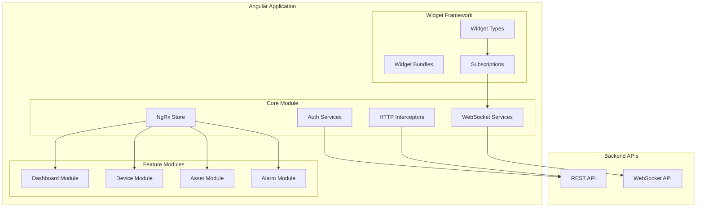

# Frontend

## Overview

ThingsBoard's frontend is a sophisticated single-page application built on Angular 18 with Material Design components. The architecture follows modular design principles with lazy-loaded feature modules, centralized state management via NgRx, real-time WebSocket communication, and an extensible widget framework for IoT dashboard visualization.

## Contents

| Document | Description |
|----------|-------------|
| [Angular Architecture](./angular-architecture.md) | Module structure, state management, routing, and services |
| [Widget System](./widget-system.md) | Widget types, subscriptions, datasources, and custom development |

## Key Concepts

- **Modular Architecture**: Core, shared, and lazy-loaded feature modules with clear separation
- **NgRx State Management**: Centralized store with actions, reducers, effects, and selectors
- **Real-Time Data**: WebSocket services deliver live telemetry and notifications to widgets
- **Widget Framework**: Type-based widgets (timeseries, latest, RPC, alarm, static) with subscription-driven data
- **Lazy Loading**: Feature modules load on-demand to reduce initial bundle size
- **Role-Based UI**: Routes and features protected based on user authority

## Frontend Architecture

## Technology Stack

| Technology | Version | Purpose |
|------------|---------|---------|
| Angular | 18.2.13 | Core framework |
| Angular Material | 18.2.10 | UI components |
| NgRx | 18.x | State management |
| RxJS | 7.8.x | Reactive programming |
| angular-gridster2 | 18.x | Dashboard grid layout |
| Leaflet | 1.9.x | Map widgets |

## See Also

- [REST API Overview](../06-api-layer/rest-api-overview.md) - Backend API structure
- [WebSocket Overview](../06-api-layer/websocket-overview.md) - Real-time protocol
- [Subscription Model](../06-api-layer/subscription-model.md) - Data subscriptions
- [Authentication](../06-api-layer/authentication.md) - Auth mechanisms
- [Dashboard Entity](../02-core-concepts/entities/dashboard.md) - Dashboard data model
