# Angular Frontend Architecture

## Overview

ThingsBoard's frontend is a sophisticated single-page application built on **Angular 18.2.13** with Material Design components. The architecture follows modular design principles with lazy-loaded feature modules, centralized state management via **NgRx**, real-time WebSocket communication, and an extensible widget framework. This design enables a responsive, scalable user interface that handles complex IoT dashboard scenarios.

## Technology Stack

| Technology | Version | Purpose |
|------------|---------|---------|
| Angular | 18.2.13 | Core framework |
| Angular Material | 18.2.10 | UI component library |
| NgRx | 18.x | State management |
| RxJS | 7.8.x | Reactive programming |
| TypeScript | 5.5.x | Type safety |
| angular-gridster2 | 18.x | Dashboard grid layout |
| Chart.js | 4.4.x | Charting library |
| Leaflet | 1.9.x | Map widgets |

## Key Behaviors

1. **Modular Structure**: Core, shared, and feature modules with clear separation of concerns.

2. **Centralized State**: NgRx store manages application state with actions, reducers, and effects.

3. **Real-Time Data**: WebSocket services deliver live telemetry and notifications to widgets.

4. **Dynamic Widgets**: Widget components are dynamically loaded and receive data via subscriptions.

5. **Lazy Loading**: Feature modules load on-demand to reduce initial bundle size.

6. **Role-Based Access**: Routes and features are protected based on user authority.

## Module Architecture

### Module Hierarchy

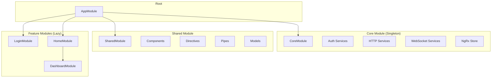

### Module Responsibilities

| Module | Purpose | Loading |
|--------|---------|---------|
| AppModule | Bootstrap, root routing | Immediate |
| CoreModule | Singleton services, state, interceptors | Immediate |
| SharedModule | Reusable components, pipes, directives | Immediate |
| LoginModule | Authentication flows | Lazy |
| HomeModule | Main authenticated area | Lazy |
| DashboardModule | Dashboard features | Lazy |

### Core Module Components

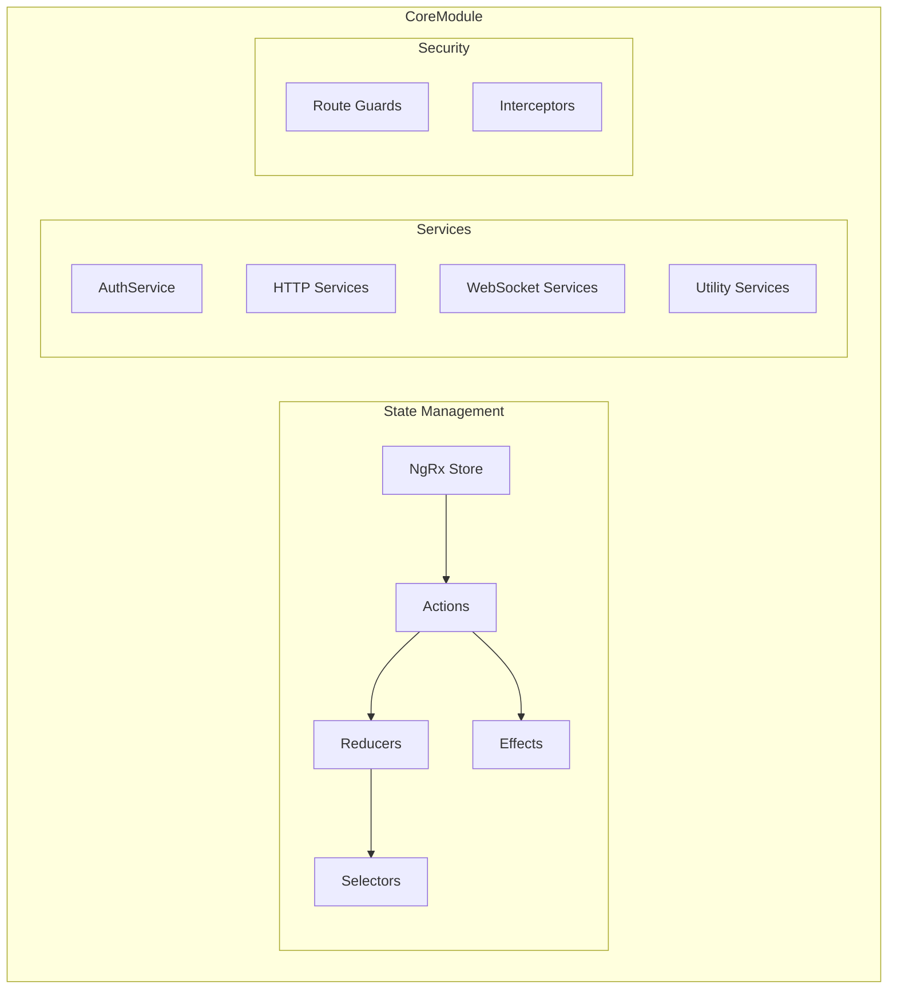

### Shared Module Components

| Category | Examples | Purpose |
|----------|----------|---------|
| Components | Entity selectors, dialogs, buttons | Reusable UI elements |
| Directives | Truncate, context menu, ellipsis | DOM manipulation |
| Pipes | File size, time format, enum display | Data transformation |
| Models | Entity types, widget models | Type definitions |
| Services | Image, resource, notification | Shared business logic |

## Component Architecture

### Component Hierarchy

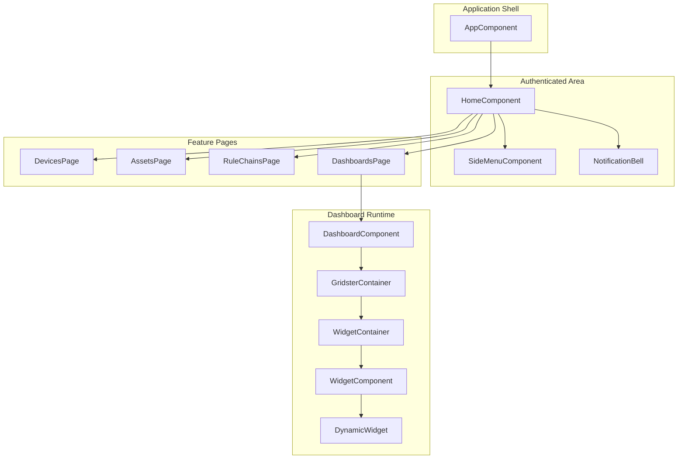

### Component Patterns

| Pattern | Description | Use Case |
|---------|-------------|----------|
| Smart/Container | Connects to store, fetches data | Page components |
| Presentation | Receives inputs, emits outputs | Reusable UI components |
| Dynamic | Loaded at runtime via injector | Widgets |

### Component Lifecycle

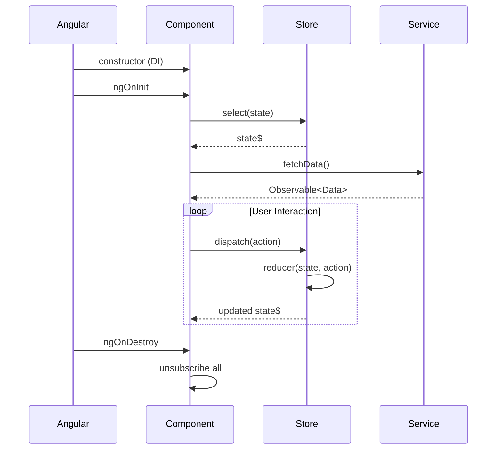

## State Management

### Store Architecture

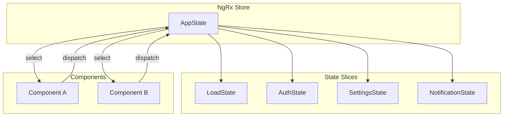

### State Structure

| Slice | Purpose | Key Properties |
|-------|---------|----------------|
| LoadState | HTTP loading indicators | isLoading, pendingRequests |
| AuthState | Authentication context | isAuthenticated, authUser, userDetails |
| SettingsState | User preferences | language, timezone, theme |
| NotificationState | Toast messages | notifications[] |

### NgRx Feature Modules

The application uses NgRx with feature state modules:

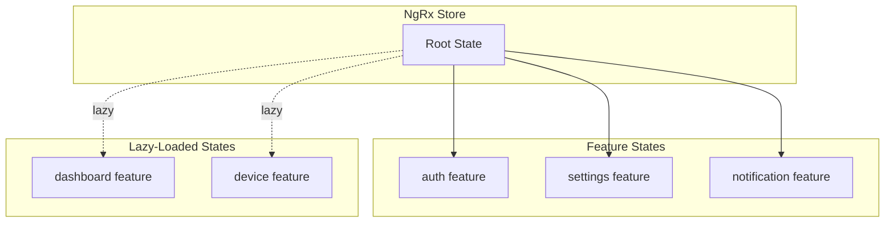

### State Organization

| Feature | Actions File | Reducer File | Effects File |
|---------|-------------|--------------|--------------|
| Auth | auth.actions.ts | auth.reducer.ts | auth.effects.ts |
| Settings | settings.actions.ts | settings.reducer.ts | - |
| Notification | notification.actions.ts | notification.reducer.ts | - |
| Load | load.actions.ts | load.reducer.ts | - |

### Auth State Details

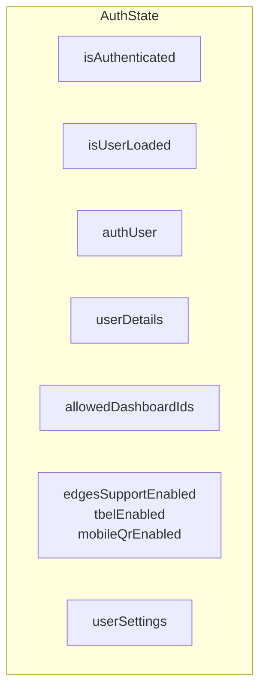

### Data Flow Pattern

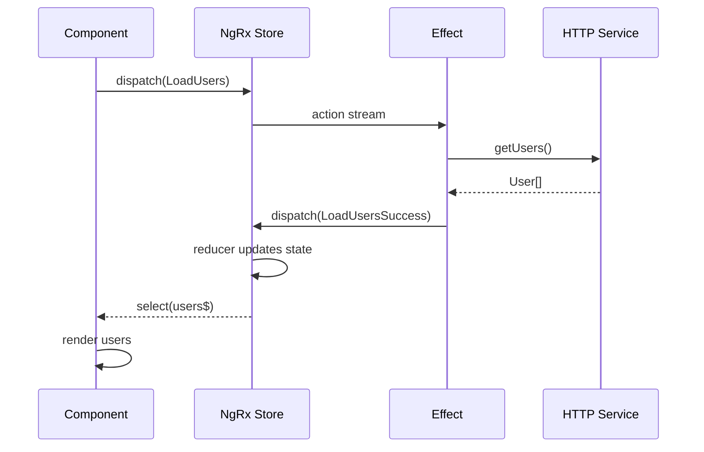

### Actions and Effects

| Action Type | Trigger | Effect |
|-------------|---------|--------|
| ActionAuthAuthenticated | Login success | Store user, navigate |
| ActionAuthUnauthenticated | Logout | Clear state, redirect |
| ActionAuthLoadUser | App init | Fetch user details |
| ActionLoadStart | HTTP request | Show loading |
| ActionLoadFinish | HTTP response | Hide loading |

## Routing

### Route Configuration

```mermaid
graph TB
    subgraph "Public Routes"
        LOGIN[/login]
        RESET[/login/resetPassword]
        MFA[/login/mfa]
    end

    subgraph "Protected Routes"
        HOME[/ home]
        ACCOUNT[/account]
        ADMIN[/admin]
        DEVICES[/device]
        ASSETS[/asset]
        DASHBOARDS[/dashboard]
        RULES[/rulechain]
    end

    subgraph "Guards"
        AUTH_GUARD[AuthGuard]
    end

    LOGIN --> HOME
    AUTH_GUARD --> HOME
    HOME --> ACCOUNT
    HOME --> ADMIN
    HOME --> DEVICES
    HOME --> ASSETS
    HOME --> DASHBOARDS
    HOME --> RULES
```

### Route Protection

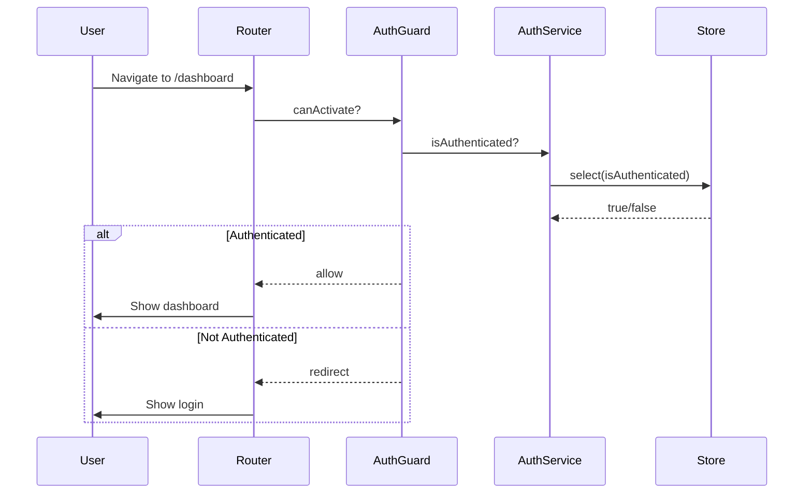

### Route Data

Routes include metadata for:
- Page title (i18n key)
- Breadcrumb configuration
- Required authorities
- Module visibility (public/private)

### Lazy Loading Pattern

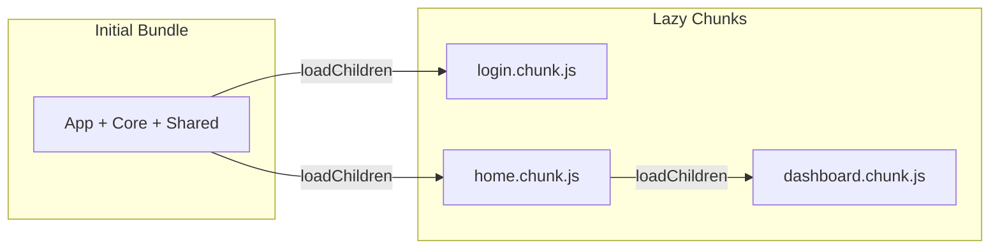

## Authentication

### Authentication Flow

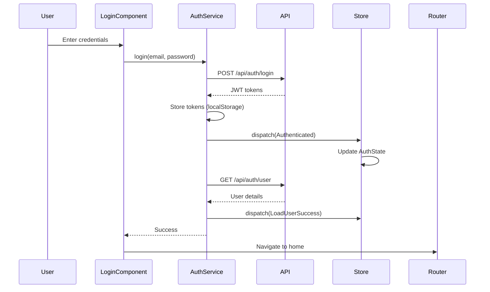

### Token Management

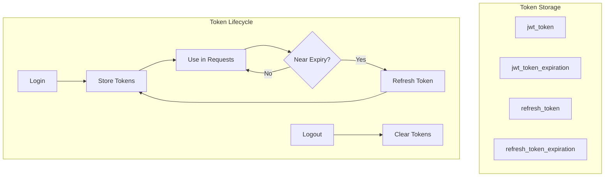

### Authority Levels

| Authority | Description | Access |
|-----------|-------------|--------|
| SYS_ADMIN | System administrator | All tenants |
| TENANT_ADMIN | Tenant administrator | Own tenant |
| CUSTOMER_USER | Customer user | Assigned resources |
| PUBLIC_USER | Anonymous | Public dashboards |

### Two-Factor Authentication

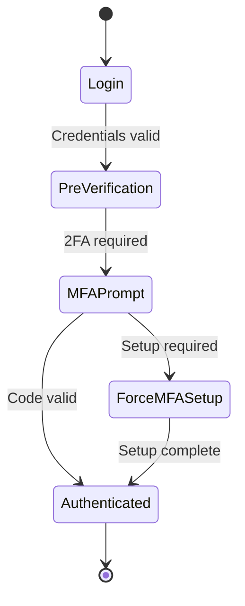

## API Integration

### HTTP Service Architecture

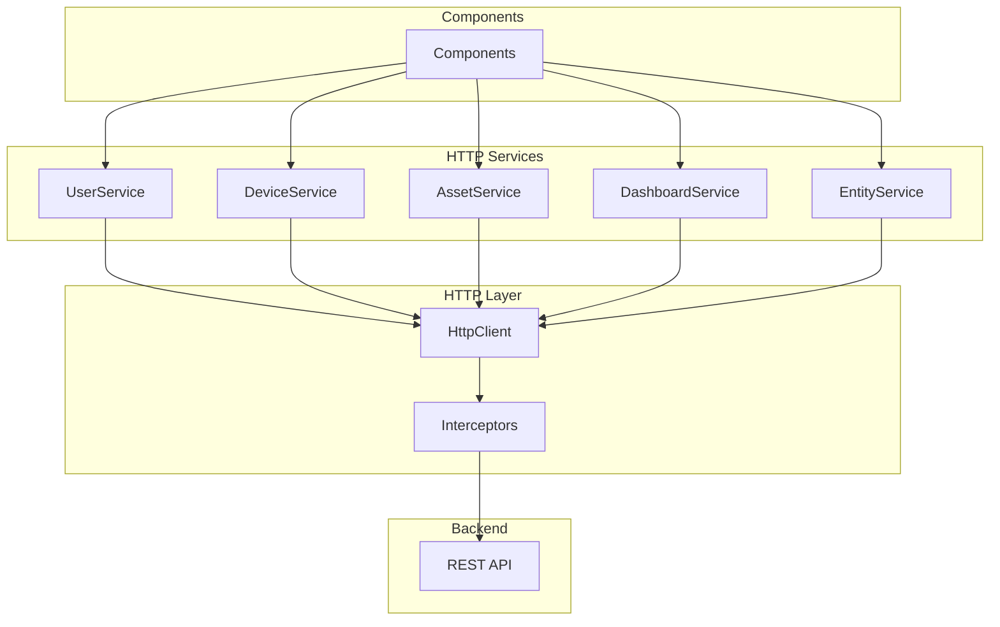

### HTTP Interceptor Chain

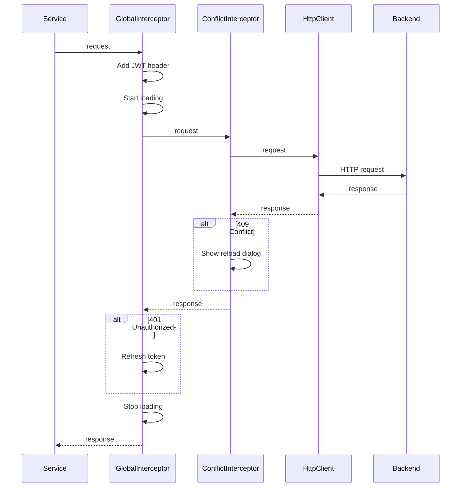

### Interceptor Responsibilities

| Interceptor | Responsibility |
|-------------|----------------|
| GlobalHttpInterceptor | JWT attachment, token refresh, loading state, error handling |
| EntityConflictInterceptor | Detect 409 conflicts, prompt reload |

### API Patterns

| Pattern | Example | Description |
|---------|---------|-------------|
| CRUD | `GET /api/device/{id}` | Standard entity operations |
| Pagination | `GET /api/devices?page=0&size=10` | PageLink-based results |
| Search | `POST /api/devices/query` | Entity queries |
| Telemetry | `GET /api/plugins/telemetry/...` | Time-series data |
| RPC | `POST /api/rpc/...` | Device commands |

## WebSocket Communication

### WebSocket Architecture

```mermaid
graph TB
    subgraph "Frontend"
        WIDGET[Widget Components]
        SUB_SVC[Subscription Service]
        WS_SVC[WebSocket Service]
    end

    subgraph "Connection"
        WS[WebSocket Connection]
    end

    subgraph "Backend"
        WS_API[/api/ws/plugins/telemetry]
    end

    WIDGET --> SUB_SVC
    SUB_SVC --> WS_SVC
    WS_SVC --> WS
    WS --> WS_API
```

### Subscription Flow

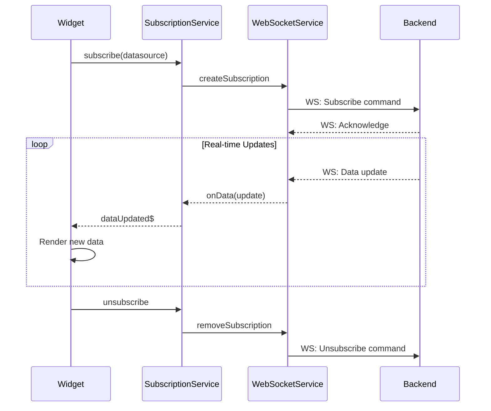

### WebSocket Services

| Service | Purpose | Data Types |
|---------|---------|------------|
| TelemetryWebSocketService | Real-time telemetry | Attributes, timeseries, latest values |
| NotificationWebSocketService | Live notifications | Alarms, system events |

### Connection Management

| Feature | Behavior |
|---------|----------|
| Auto-reconnect | 2-second intervals |
| Idle timeout | 90 seconds, then reconnect |
| Batch commands | Up to 10 commands per message |
| Error recovery | Automatic resubscription |

## Widget System

### Widget Architecture

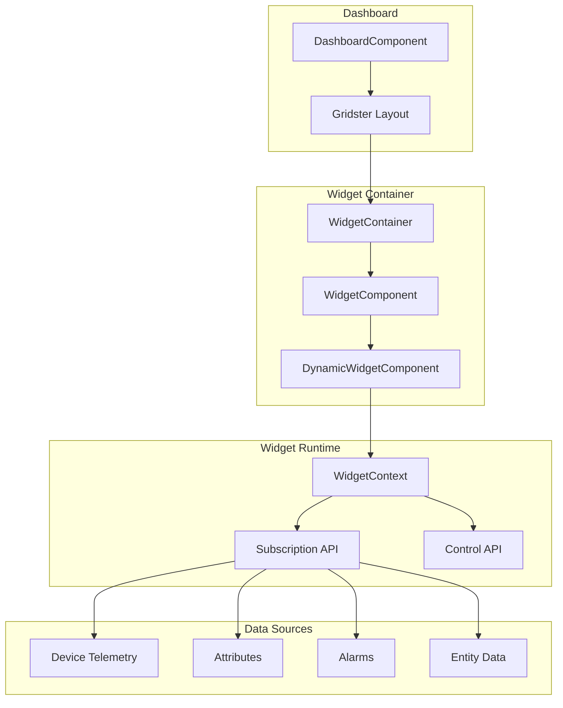

### Widget Loading Flow

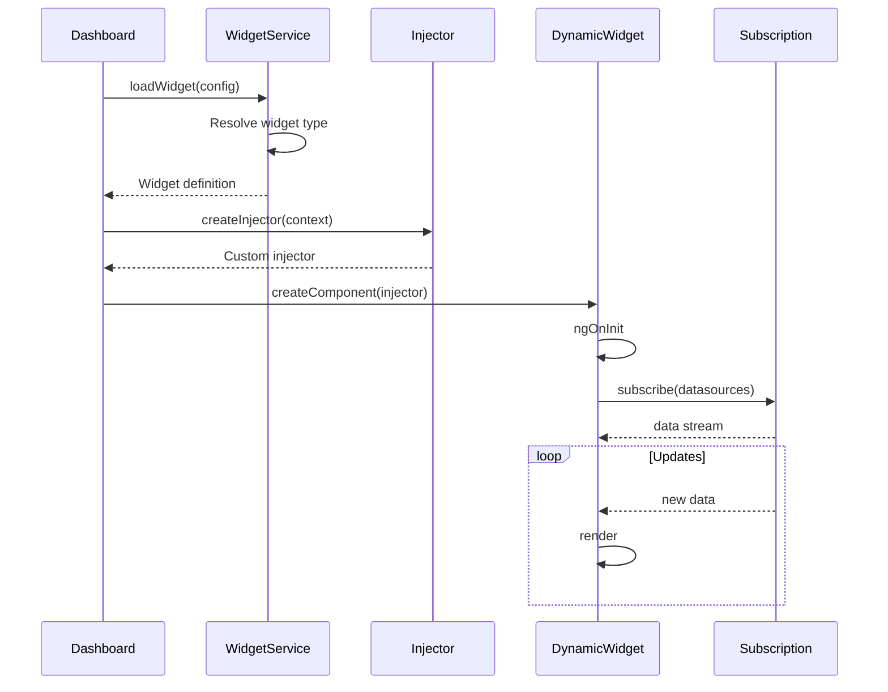

### Widget Context

| Property | Description |
|----------|-------------|
| subscriptionApi | Data subscription management |
| settings | Widget configuration |
| controlApi | Widget control methods |
| widget | Widget definition |
| parentDashboard | Dashboard reference |

### Widget Categories

| Type | Examples | Data Source |
|------|----------|-------------|
| Charts | Line, bar, pie | Timeseries |
| Gauges | Analog, digital, level | Latest values |
| Maps | OpenStreetMap, Google | Entity coordinates |
| Tables | Entities, alarms, timeseries | Query results |
| Controls | Buttons, switches, sliders | RPC commands |
| Cards | Value cards, HTML | Attributes/telemetry |

## Theming

### Theme Architecture

```mermaid
graph TB
    subgraph "Theme Definition"
        PRIMARY[Primary Palette]
        ACCENT[Accent Palette]
        WARN[Warn Palette]
    end

    subgraph "Theme Variants"
        LIGHT[Light Theme]
        DARK[Dark Theme]
    end

    subgraph "Component Styles"
        MATERIAL[Material Components]
        CUSTOM[Custom Components]
        WIDGETS[Widget Styles]
    end

    PRIMARY --> LIGHT
    PRIMARY --> DARK
    ACCENT --> LIGHT
    ACCENT --> DARK
    WARN --> LIGHT
    WARN --> DARK

    LIGHT --> MATERIAL
    LIGHT --> CUSTOM
    LIGHT --> WIDGETS
    DARK --> MATERIAL
    DARK --> CUSTOM
    DARK --> WIDGETS
```

### Theme Configuration

| Element | Light Theme | Dark Theme |
|---------|-------------|------------|
| Primary | Indigo | Dark Indigo |
| Accent | Deep Orange | Deep Orange |
| Background | #EEEEEE | #303030 |
| Text | Dark gray | Light gray |

### Styling Architecture

| Layer | Purpose | Scope |
|-------|---------|-------|
| Global styles | Typography, resets | Application-wide |
| Theme | Colors, palettes | Material components |
| Component SCSS | Component-specific | ViewEncapsulation |
| Widget styles | Dynamic styling | Widget runtime |

## Performance Patterns

### Optimization Strategies

```mermaid
graph TB
    subgraph "Bundle Optimization"
        LAZY[Lazy Loading]
        TREE[Tree Shaking]
        AOT[AOT Compilation]
    end

    subgraph "Runtime Optimization"
        ONPUSH[OnPush Detection]
        TRACK[trackBy Functions]
        UNSUB[Subscription Cleanup]
    end

    subgraph "Data Optimization"
        MEMO[Memoized Selectors]
        CACHE[Response Caching]
        BATCH[WebSocket Batching]
    end
```

### Change Detection

| Strategy | Use Case | Benefit |
|----------|----------|---------|
| Default | Simple components | Easy to implement |
| OnPush | List items, widgets | Reduced checks |
| Manual | Complex scenarios | Full control |

### Memory Management

```mermaid
sequenceDiagram
    participant Component
    participant Subscription
    participant Destroy$

    Component->>Destroy$: Create Subject
    Component->>Subscription: subscribe().pipe(takeUntil(destroy$))

    loop Component Active
        Subscription-->>Component: Data updates
    end

    Component->>Destroy$: next() + complete()
    Note over Subscription: All subscriptions cleaned up
```

## Error Handling

### Error Flow

```mermaid
graph TB
    subgraph "Error Sources"
        HTTP[HTTP Errors]
        WS[WebSocket Errors]
        APP[Application Errors]
    end

    subgraph "Error Handling"
        INTERCEPT[Interceptor]
        HANDLER[Global Handler]
    end

    subgraph "User Feedback"
        TOAST[Toast Notification]
        DIALOG[Error Dialog]
        CONSOLE[Console Log]
    end

    HTTP --> INTERCEPT
    INTERCEPT --> TOAST
    INTERCEPT --> DIALOG

    WS --> HANDLER
    APP --> HANDLER
    HANDLER --> TOAST
    HANDLER --> CONSOLE
```

### Error Types

| Code | Handling | User Feedback |
|------|----------|---------------|
| 401 | Token refresh or logout | Silent or login redirect |
| 403 | Display forbidden | Permission denied dialog |
| 404 | Display not found | Entity not found message |
| 409 | Conflict resolution | Reload entity prompt |
| 5xx | Retry logic | Server error toast |

## Build Configuration

### Build Pipeline

```mermaid
graph LR
    subgraph "Source"
        TS[TypeScript]
        SCSS[SCSS]
        HTML[Templates]
    end

    subgraph "Compilation"
        AOT[AOT Compiler]
        SASS[Sass Compiler]
        BUNDLE[Bundler]
    end

    subgraph "Output"
        JS[JavaScript Bundles]
        CSS[CSS Files]
        ASSETS[Static Assets]
    end

    TS --> AOT
    SCSS --> SASS
    HTML --> AOT

    AOT --> BUNDLE
    SASS --> BUNDLE
    BUNDLE --> JS
    BUNDLE --> CSS
    BUNDLE --> ASSETS
```

### Output Structure

| Bundle | Contents | Loading |
|--------|----------|---------|
| main.js | Core application | Immediate |
| vendor.js | Third-party libraries | Immediate |
| polyfills.js | Browser compatibility | Immediate |
| login.chunk.js | Login module | On navigation |
| home.chunk.js | Home module | On navigation |

## See Also

- [Widget System](./widget-system.md) - Widget framework details
- [REST API Overview](../06-api-layer/rest-api-overview.md) - Backend API
- [WebSocket Overview](../06-api-layer/websocket-overview.md) - Real-time protocol
- [Authentication](../06-api-layer/authentication.md) - Auth details
- [Subscription Model](../06-api-layer/subscription-model.md) - Data subscriptions
