# Widget System

## Overview

ThingsBoard's widget system provides a flexible, extensible framework for visualizing IoT data. Widgets are self-contained components that receive data through subscriptions and render interactive visualizations. The architecture supports built-in widgets, custom widgets, and third-party integrations through a well-defined API. This system enables dashboards to display real-time telemetry, historical trends, alarms, and device controls.

## Key Behaviors

1. **Type-Based Classification**: Widgets are categorized by data type (timeseries, latest, RPC, alarm, static).

2. **Subscription-Driven Data**: Widgets receive data through subscription callbacks rather than polling.

3. **Datasource Abstraction**: Widgets are decoupled from specific data sources through entity aliases.

4. **Action System**: Widgets can trigger navigation, commands, and custom behaviors.

5. **Dynamic Configuration**: Widget settings are defined through JSON schemas and dynamic forms.

6. **Lifecycle Management**: Widgets have well-defined initialization, update, and destruction phases.

## Widget Types

### Type Classification

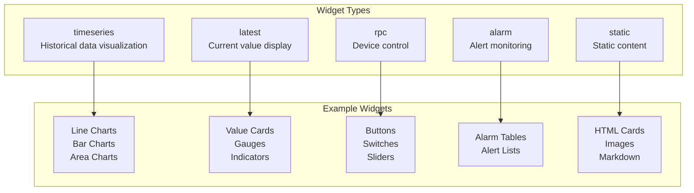

### Type Characteristics

| Type | Data Pattern | Time Window | Use Case |
|------|--------------|-------------|----------|
| timeseries | Historical + streaming | Required | Trends, charts, graphs |
| latest | Most recent values | Not used | Current state, gauges |
| rpc | Command/response | Not used | Device control |
| alarm | Alarm events | Optional | Alert monitoring |
| static | None | Not used | Labels, images, info |

## Widget Bundles

### Bundle Organization

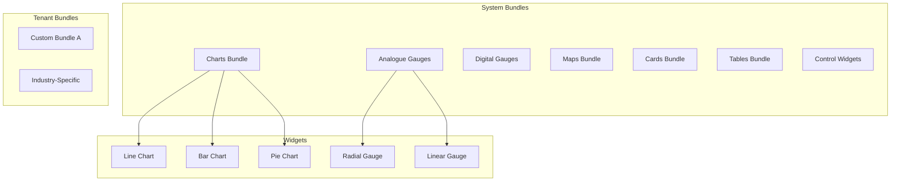

### Bundle Structure

| Field | Description |
|-------|-------------|
| id | Unique identifier |
| tenantId | Owner (system or tenant) |
| alias | Unique string reference |
| title | Display name |
| image | Bundle preview image |
| description | Purpose documentation |
| order | Display sequence |
| widgets | Collection of widget types |

## Widget Configuration

### Configuration Hierarchy

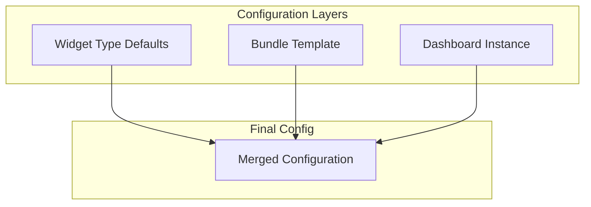

### Configuration Structure

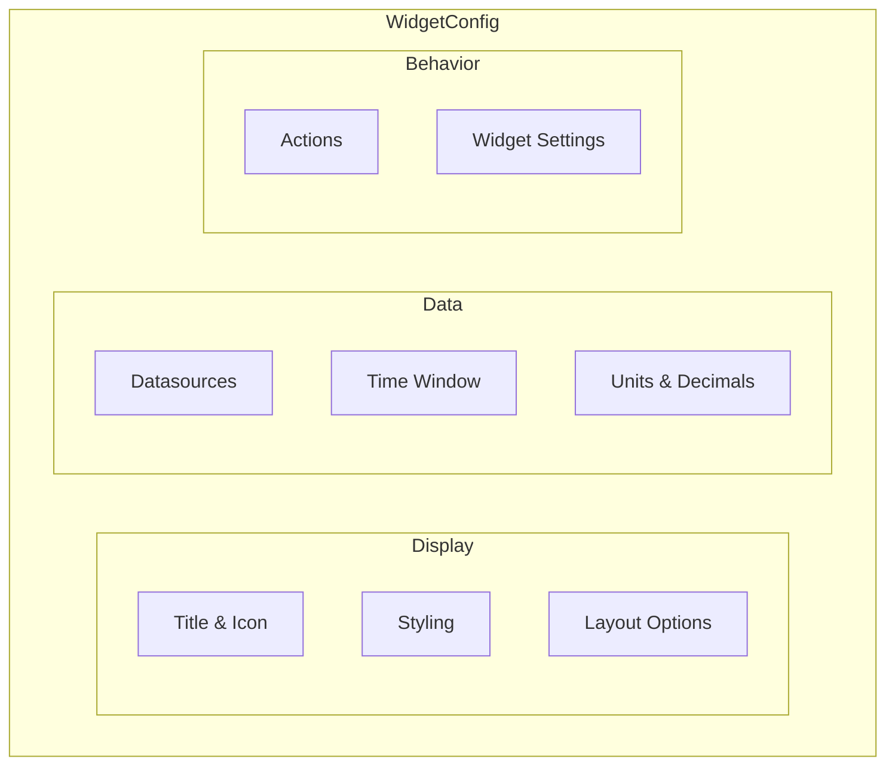

### Configuration Properties

| Category | Properties | Purpose |
|----------|------------|---------|
| Display | title, titleFont, titleColor, showTitle | Header appearance |
| Styling | widgetStyle, backgroundColor, padding, borderRadius | Visual appearance |
| Layout | resizable, preserveAspectRatio, mobileHide, mobileHeight | Sizing behavior |
| Data | datasources, timewindow, units, decimals | Data binding |
| Behavior | actions, settings, enableFullscreen | Interactivity |

## Data Sources

### Datasource Types

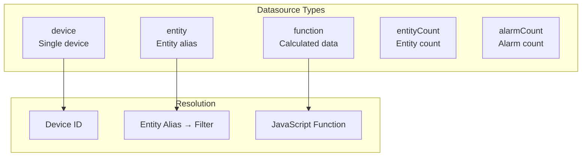

### Datasource Structure

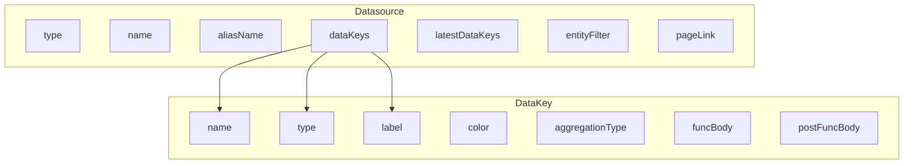

### Data Key Types

| Type | Description | Example |
|------|-------------|---------|
| timeseries | Historical time-series | temperature, humidity |
| attribute | Entity attribute | serialNumber, firmware |
| function | Calculated value | avg(temp1, temp2) |
| constant | Static value | threshold = 100 |

### Aggregation Types

| Aggregation | Description |
|-------------|-------------|
| NONE | Raw data points |
| MIN | Minimum value in interval |
| MAX | Maximum value in interval |
| AVG | Average value in interval |
| SUM | Sum of values in interval |
| COUNT | Count of data points |

## Widget Actions

### Action Architecture

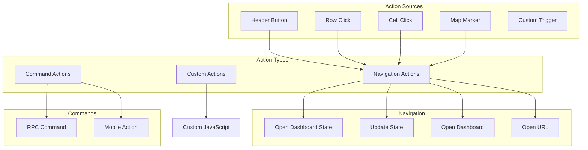

### Action Types

| Type | Description | Target |
|------|-------------|--------|
| openDashboardState | Navigate to state | State ID |
| updateDashboardState | Update parameters | State params |
| openDashboard | Open dashboard | Dashboard ID |
| openURL | External link | URL |
| custom | JavaScript execution | Function body |
| mobileAction | Mobile-specific | Camera, GPS, etc. |

### Mobile Actions

| Action | Description |
|--------|-------------|
| takePictureFromGallery | Select from gallery |
| takePhoto | Capture photo |
| mapDirection | Navigation directions |
| mapLocation | Show on map |
| scanQrCode | QR code scanner |
| makePhoneCall | Initiate call |
| getLocation | Get GPS location |
| takeScreenshot | Capture screen |

### Action Configuration

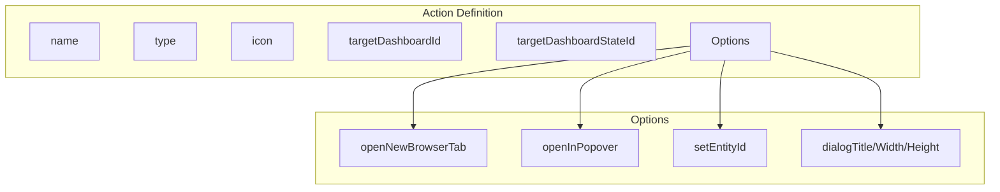

## Widget Subscription

### Subscription Architecture

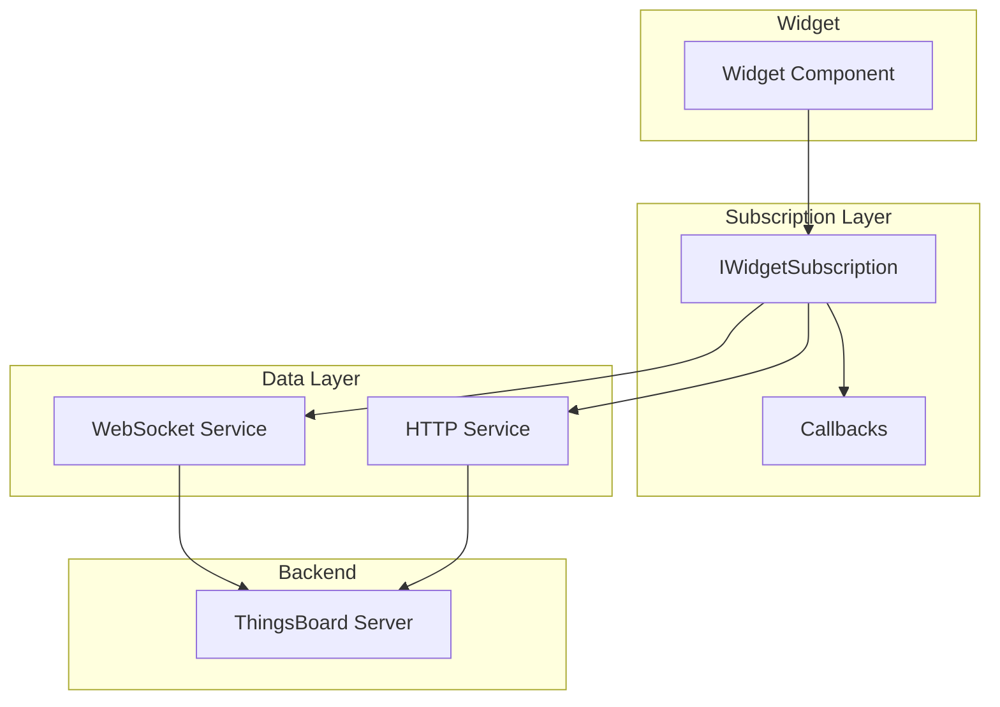

### Subscription Flow

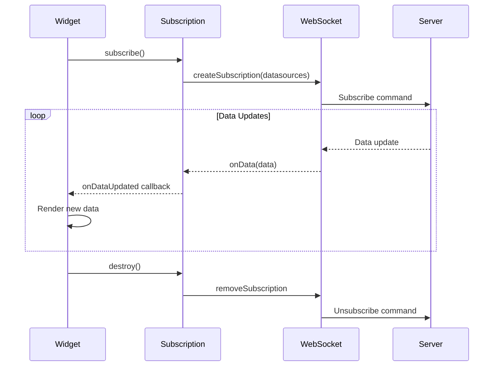

### Subscription Callbacks

| Callback | Trigger | Purpose |
|----------|---------|---------|
| onDataUpdated | New data received | Update visualization |
| onLatestDataUpdated | Latest values changed | Update current state |
| onDataUpdateError | Data fetch failed | Show error state |
| dataLoading | Data fetch started | Show loading state |
| legendDataUpdated | Legend changed | Update legend |
| timeWindowUpdated | Time window changed | Adjust display |
| rpcStateChanged | RPC state changed | Update control state |
| onRpcSuccess | RPC succeeded | Show success feedback |
| onRpcFailed | RPC failed | Show error feedback |

## Widget Context API

### Context Structure

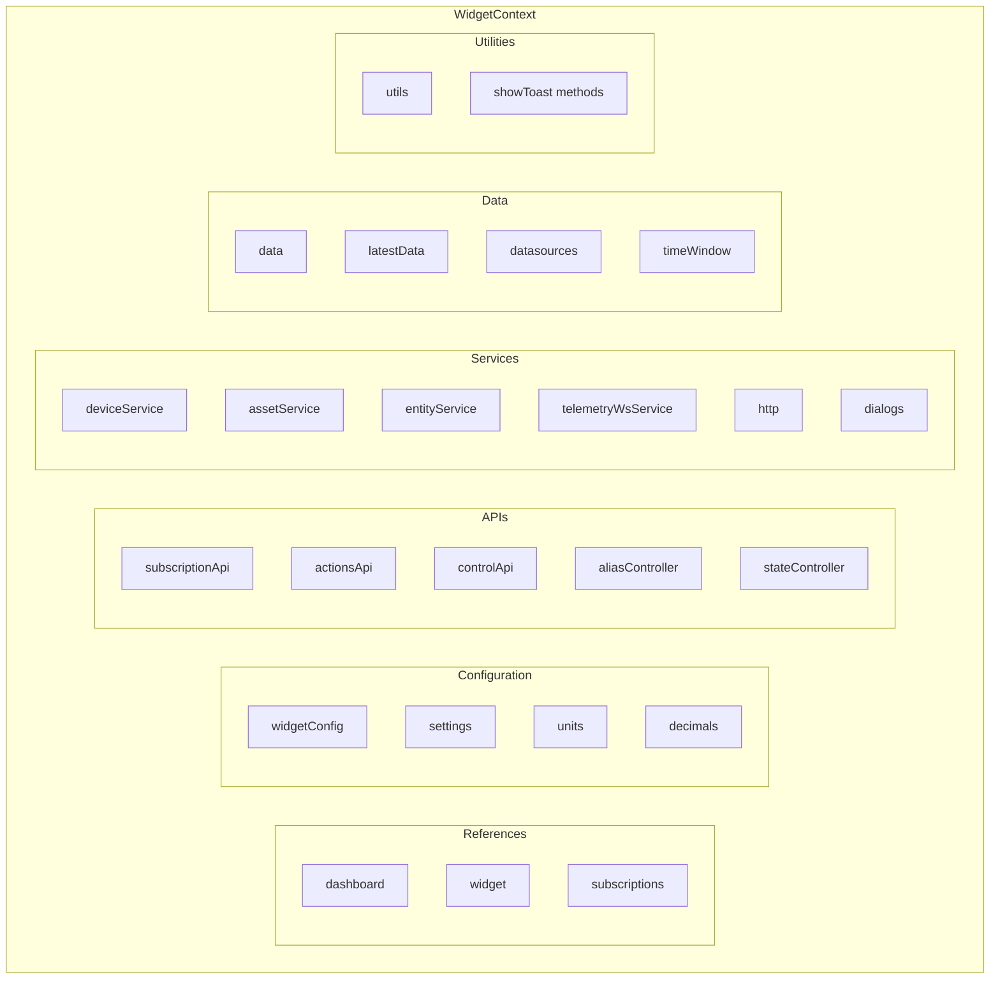

### Available Services (40+ Injected)

The WidgetContext provides access to over 40 platform services:

**Entity Services:**
| Service | Purpose |
|---------|---------|
| deviceService | Device CRUD operations |
| assetService | Asset CRUD operations |
| entityService | Generic entity operations |
| entityRelationService | Entity relationships |
| entityGroupService | Entity group management |
| customerService | Customer operations |
| userService | User management |
| tenantService | Tenant operations |

**Data Services:**
| Service | Purpose |
|---------|---------|
| attributeService | Attribute read/write |
| telemetryWsService | WebSocket telemetry |
| alarmService | Alarm operations |
| deviceProfileService | Device profiles |
| assetProfileService | Asset profiles |

**Dashboard Services:**
| Service | Purpose |
|---------|---------|
| dashboardService | Dashboard operations |
| dashboardUtilsService | Dashboard utilities |
| widgetService | Widget definitions |
| widgetComponentService | Widget rendering |

**Platform Services:**
| Service | Purpose |
|---------|---------|
| authService | Authentication info |
| http | Raw HTTP client |
| dialogs | Dialog popups |
| translate | Internationalization (i18n) |
| router | Navigation |
| date | Date utilities |
| sanitizer | DOM sanitizer |
| ngZone | Angular zone |
| store | NgRx store access |
| rxjs | RxJS utilities |

**UI Services:**
| Service | Purpose |
|---------|---------|
| importExport | Import/export functionality |
| raf | Request animation frame |
| cd | Change detection |
| renderer | DOM renderer |

**Specialized Services:**
| Service | Purpose |
|---------|---------|
| ruleChainService | Rule chain operations |
| entityViewService | Entity view management |
| notificationService | Platform notifications |
| resourceService | Resource management |
| otaPackageService | OTA package management |

### Utility Functions

| Function | Description |
|----------|-------------|
| formatValue(value, decimals, units) | Format numeric value |
| getEntityDetailsPageURL(id, type) | Get entity page URL |

### Display Methods

| Method | Description |
|--------|-------------|
| showSuccessToast(message) | Green success notification |
| showErrorToast(message) | Red error notification |
| showToast(type, message, duration) | Custom toast |

## Widget Lifecycle

### Lifecycle Phases

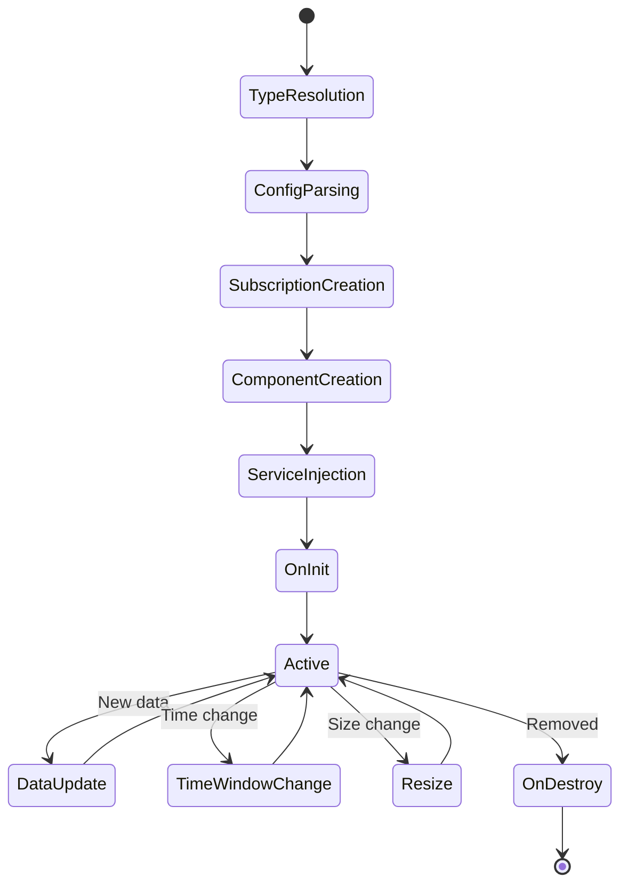

### Lifecycle Callbacks

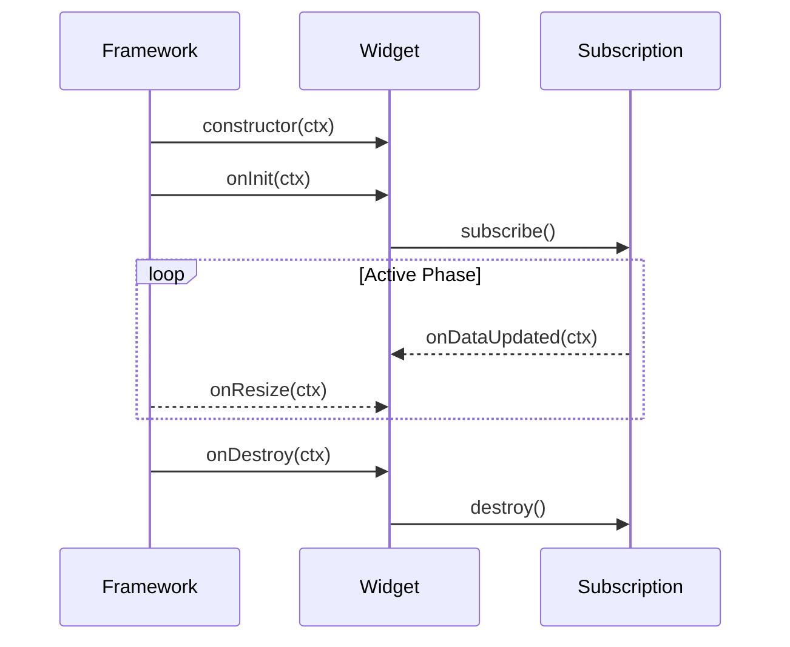

### Controller Script Pattern

```javascript
// Initialization
self.onInit = function(ctx) {
    // Setup widget
    // Initialize state
    // Configure handlers
}

// Data handling
self.onDataUpdated = function(ctx) {
    // Process new data
    // Update visualization
}

// Layout handling
self.onResize = function(ctx) {
    // Adjust to new size
}

// RPC handling
self.onRpcSuccess = function(ctx, result) {
    // Handle success
}

self.onRpcFailed = function(ctx, error) {
    // Handle failure
}

// Cleanup
self.onDestroy = function(ctx) {
    // Release resources
    // Cancel subscriptions
}
```

## Custom Widget Development

### Widget Type Definition

```mermaid
graph TB
    subgraph "WidgetTypeDescriptor"
        TYPE[type: widgetType]
        RESOURCES[resources: URL[]]
        TEMPLATE[templateHtml]
        CSS[templateCss]
        CONTROLLER[controllerScript]
        SETTINGS_FORM[settingsForm]
        DEFAULT_CONFIG[defaultConfig]
        SIZE[sizeX, sizeY]
    end
```

### Custom Widget Structure

| Component | Purpose | Format |
|-----------|---------|--------|
| templateHtml | Widget HTML template | HTML string |
| templateCss | Widget styles | CSS string |
| controllerScript | Widget logic | JavaScript |
| settingsForm | Settings schema | JSON schema |
| resources | External dependencies | URL array |
| defaultConfig | Default configuration | JSON |

### Development Flow

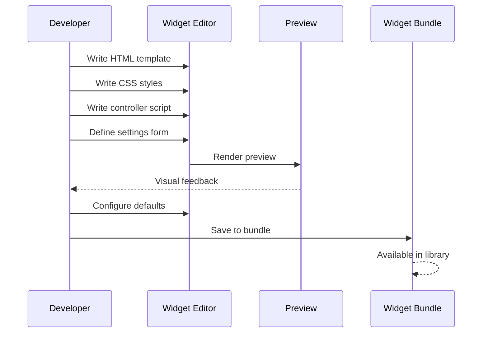

### Widget Parameters

| Parameter | Description | Default |
|-----------|-------------|---------|
| useCustomDatasources | Custom datasource support | false |
| maxDatasources | Maximum datasources | unlimited |
| maxDataKeys | Maximum data keys | unlimited |
| singleEntity | Single entity mode | false |
| stateData | Use dashboard state | false |
| hasBasicMode | Basic config UI | false |

## Value Processing

### Processing Pipeline

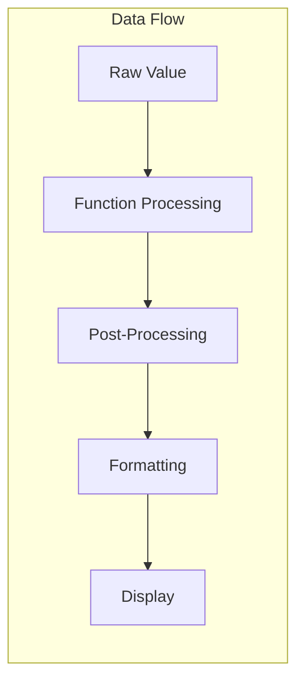

### Value Processors

| Processor | Purpose |
|-----------|---------|
| SimpleValueFormatProcessor | Basic formatting |
| UnitConverterValueFormatProcessor | Unit conversion |

### Color Processors

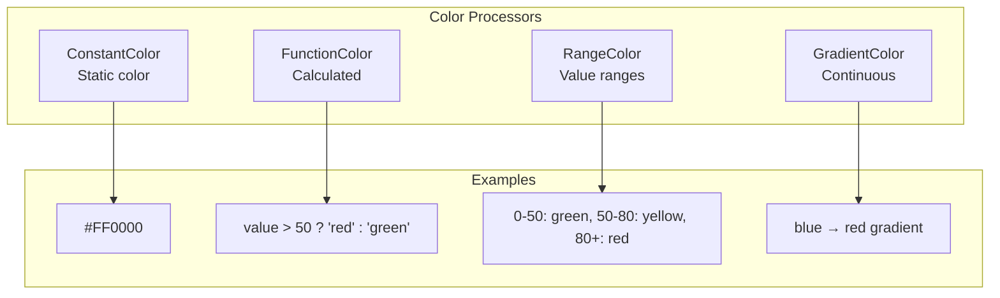

### Date Formatters

| Formatter | Output Example |
|-----------|----------------|
| SimpleDateFormat | "2024-01-15 10:30:00" |
| LastUpdateAgo | "5 minutes ago" |
| AutoDateFormat | Context-aware format |

## Widget Settings Schema

### Dynamic Form Schema

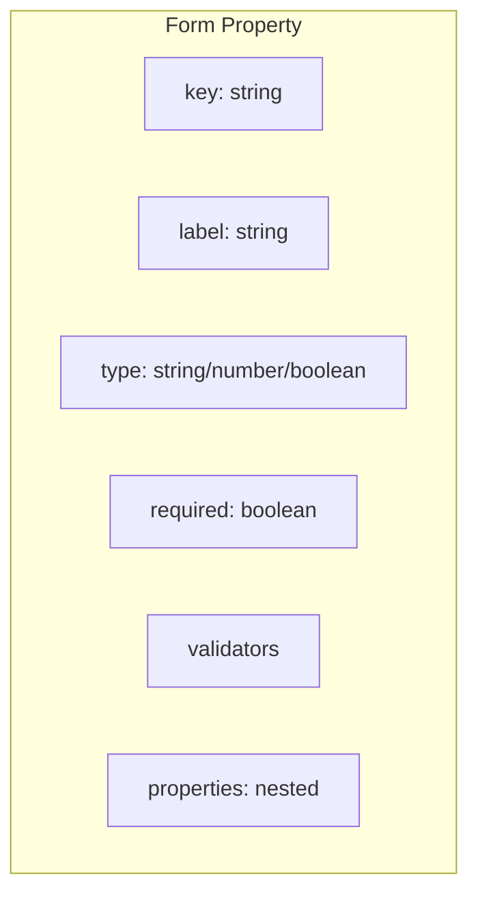

### Property Types

| Type | Description | UI Control |
|------|-------------|------------|
| string | Text value | Text input |
| number | Numeric value | Number input |
| boolean | True/false | Checkbox/toggle |
| array | List of items | Array editor |
| object | Nested object | Nested form |
| color | Color value | Color picker |
| image | Image reference | Image selector |
| entity | Entity reference | Entity selector |

### Settings Form Example

```json
{
  "schema": {
    "title": "Widget Settings",
    "properties": {
      "showTitle": {
        "type": "boolean",
        "default": true
      },
      "titleColor": {
        "type": "string",
        "format": "color"
      },
      "decimals": {
        "type": "number",
        "minimum": 0,
        "maximum": 10
      }
    }
  }
}
```

## Best Practices

### Performance

| Practice | Benefit |
|----------|---------|
| Use OnPush change detection | Reduce render cycles |
| Unsubscribe in onDestroy | Prevent memory leaks |
| Use latest data optimization | Reduce data transfer |
| Implement pagination | Handle large datasets |

### Data Handling

| Practice | Benefit |
|----------|---------|
| Use entity aliases | Decouple from specific entities |
| Define aggregation | Reduce data volume |
| Set appropriate time window | Balance detail vs. performance |
| Handle empty states | Improve UX |

### Action Design

| Practice | Benefit |
|----------|---------|
| Use dashboard states | Maintain context |
| Provide feedback | User knows action worked |
| Handle errors gracefully | Don't break dashboard |
| Use confirmation for destructive actions | Prevent accidents |

## Common Widget Patterns

### Value Card Pattern

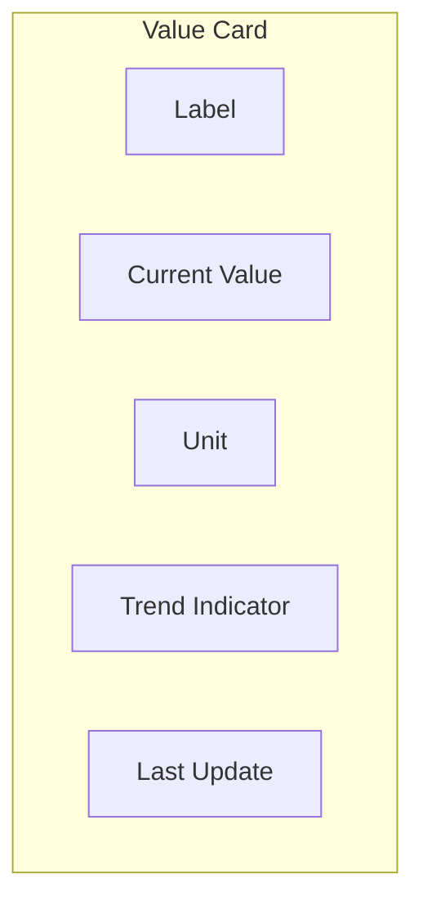

### Chart Pattern

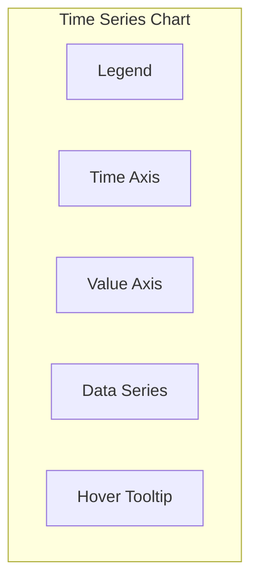

### Table Pattern

```mermaid
graph TB
    subgraph "Data Table"
        HEADER[Column Headers]
        ROWS[Data Rows]
        PAGINATION[Pagination]
        ACTIONS[Row Actions]
        SORTING[Sort Controls]
    end
```

### Control Pattern

```mermaid
graph TB
    subgraph "Control Widget"
        LABEL[Control Label]
        INPUT[Input Control]
        STATUS[Connection Status]
        FEEDBACK[Action Feedback]
    end
```

## Troubleshooting

### Common Issues

| Issue | Cause | Solution |
|-------|-------|----------|
| No data displayed | Subscription not active | Check datasource config |
| Data updates stop | WebSocket disconnected | Check connection status |
| Actions don't work | Missing entity context | Verify entity alias |
| Widget won't resize | CSS constraints | Check style settings |
| Slow performance | Too many data points | Enable aggregation |

### Debugging Tools

| Tool | Purpose |
|------|---------|
| Browser DevTools | JavaScript errors |
| Network tab | API requests |
| Widget debug mode | Data inspection |
| Console logging | Custom debugging |

## See Also

- [Angular Architecture](./angular-architecture.md) - Frontend framework
- [WebSocket Overview](../06-api-layer/websocket-overview.md) - Real-time data
- [Subscription Model](../06-api-layer/subscription-model.md) - Data subscriptions
- [REST API Overview](../06-api-layer/rest-api-overview.md) - API integration
