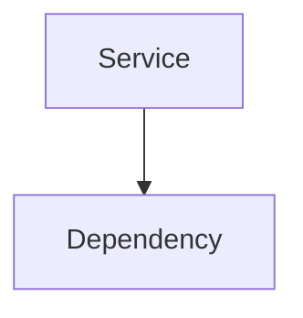

# CLAUDE.md - Microservices Section

This file provides guidance for working with the Microservices documentation section.

## Section Purpose

This section documents ThingsBoard's distributed architecture:

- **Service Types**: TB Core, Rule Engine, Transport, JS Executor, EDQS
- **Deployment Modes**: Monolith, microservices, hybrid
- **Communication**: Message queues, Protocol Buffers, service discovery
- **Scaling**: Horizontal scaling, high availability, load balancing

## File Structure

```
11-microservices/
├── README.md               # Architecture overview and service topology
├── tb-node.md              # TB Core and Rule Engine services
├── transport-services.md   # Protocol-specific transport services
├── js-executor.md          # JavaScript/TBEL remote execution
├── vc-executor.md          # Version control and Git integration
├── edqs.md                 # Entity Data Query Service
├── monitoring.md           # Synthetic monitoring service
└── web-ui.md               # Angular frontend service
```

## Writing Guidelines

### Audience

DevOps engineers and platform architects deploying ThingsBoard at scale. Assume familiarity with distributed systems concepts but not necessarily with ThingsBoard's specific service architecture.

### Content Pattern

Microservices documents should include:

1. **Overview** - Service purpose and responsibilities
2. **Architecture** - How it fits in the system
3. **Configuration** - Environment variables and settings
4. **Scaling** - When and how to scale
5. **Monitoring** - Key metrics to watch
6. **Pitfalls** - Common operational issues
7. **See Also** - Related documentation

### Service Documentation Pattern

For each service type:

```markdown
## Service Name

**Purpose**: What the service does

### Responsibilities

- Responsibility 1
- Responsibility 2

### Architecture



### Configuration

| Variable | Description | Default |
|----------|-------------|---------|
| ... | ... | ... |

### Scaling

| Metric | Threshold | Action |
|--------|-----------|--------|
| ... | ... | ... |

### Common Pitfalls

| Pitfall | Impact | Solution |
|---------|--------|----------|
| ... | ... | ... |

```

### Terminology

- Use "Service" for deployable microservice units
- Use "Instance" for running copies of a service
- Use "Partition" for queue distribution units
- Use "Consumer Group" for coordinated service instances
- Use "Service Discovery" for dynamic registration
- Use "Protocol Buffers" or "Protobuf" for serialization

### Diagrams

Use Mermaid diagrams to show:

- Service topology (`graph TB`)
- Message flow (`sequenceDiagram`)
- Scaling architecture (`graph LR`)
- Deployment modes (`graph TB`)

### Technology-Agnostic Rule

Focus on service behavior and operations, not implementation:

**DO**: "Transport services validate device credentials by querying the Core service"
**DON'T**: "MqttTransportService calls DeviceAuthService.validateDeviceToken() via gRPC"

**DO**: "The Rule Engine consumes messages from partitioned queues for parallel processing"
**DON'T**: "TbRuleEngineConsumerService extends AbstractConsumerService with KafkaConsumer"

**DO**: "Services register with Zookeeper using ephemeral nodes for automatic cleanup"
**DON'T**: "ZkDiscoveryService creates ephemeral ZNode via CuratorFramework.create().creatingParentsIfNeeded()"

## Reference Sources

When updating this section, cross-reference:

- `~/work/viaanix/thingsboard-master/msa/` - Microservice modules
- `~/work/viaanix/thingsboard-master/application/src/main/java/org/thingsboard/server/service/` - Core services
- `~/work/viaanix/thingsboard-master/common/transport/` - Transport abstractions
- `~/work/viaanix/thingsboard.github.io-master/docs/reference/msa/` - Official MSA docs

## Related Sections

- `01-architecture/system-overview.md` - Platform architecture
- `08-message-queue/` - Queue configuration and partitioning
- `05-transport-layer/` - Device protocol details
- `04-rule-engine/` - Rule processing details
- `18-deployment/` - Production deployment guides

## Common Tasks

### Documenting Service Configuration

1. List all environment variables
2. Document default values and valid ranges
3. Show YAML configuration examples
4. Include Docker/Kubernetes examples
5. Note version-specific options

### Documenting Scaling Strategies

1. Identify scaling metrics
2. Document thresholds and triggers
3. Show scaling architecture diagrams
4. Include capacity planning guidance
5. Document partition rebalancing

### Documenting High Availability

1. Document failure scenarios
2. Show failover behavior
3. Include recovery procedures
4. Document minimum instance counts
5. Show multi-zone deployment patterns

### Cross-Reference Validation

Ensure all `See Also` links point to valid files:

```bash
grep -r "\.\.\/" docs/11-microservices/ | grep -o '\.\./[^)]*' | sort -u
```

## Recommended Skills

Use these skills when working on this section:

| Skill | Command | Use For |
|-------|---------|---------|
| **microservices-architect** | `/microservices-architect` | Service decomposition, communication patterns |
| **kubernetes-specialist** | `/kubernetes-specialist` | Container orchestration, K8s deployments |
| **docker-expert** | `/docker-expert` | Containerization, Docker Compose, image optimization |
| **devops-engineer** | `/devops-engineer` | CI/CD pipelines, monitoring, infrastructure automation |
| **kafka-expert** | `/kafka-expert` | Message queue configuration, partitioning |
| **grafana-expert** | `/grafana-expert` | Dashboards, metrics visualization, alerting |
| **technical-writer** | `/technical-writer` | Clear service documentation |

### When to Use Each Skill

- **Documenting service architecture**: Use `/microservices-architect` for topology
- **Explaining Kubernetes deployment**: Use `/kubernetes-specialist` for K8s patterns
- **Documenting Docker configuration**: Use `/docker-expert` for containerization
- **Explaining CI/CD and monitoring**: Use `/devops-engineer` for automation
- **Documenting queue configuration**: Use `/kafka-expert` for partitioning
- **Documenting monitoring dashboards**: Use `/grafana-expert` for metrics visualization
- **Writing operational guides**: Use `/technical-writer` for clarity

## Key Microservices Concepts

When documenting microservices, emphasize:

| Concept | Key Points |
|---------|------------|
| **Service Specialization** | Each service type handles specific responsibility |
| **Stateless Services** | State externalized to databases and caches |
| **Message-Based Communication** | Async communication via queues |
| **Independent Scaling** | Each service scales based on its workload |
| **Service Discovery** | Dynamic registration with Zookeeper |
| **Protocol Buffers** | Efficient binary serialization |
| **Partition Distribution** | Hash-based message routing |

## Common Pitfalls to Document

Ensure documentation covers these operational issues:

| Pitfall | Description |
|---------|-------------|
| Partition imbalance | Uneven message distribution across instances |
| Service discovery lag | Stale service registry causing routing errors |
| Queue consumer lag | Rule Engine falling behind on message processing |
| Connection pool exhaustion | Too many database connections |
| Memory pressure | JS Executor OOM with complex scripts |
| Split brain | Zookeeper quorum loss |
| Cascade failure | One service failure affecting others |
| Config drift | Inconsistent configuration across instances |

## Service Type Documentation

For each service, ensure coverage of:

| Service | Key Content |
|---------|-------------|
| **TB Core** | REST API, entity management, WebSocket, auth |
| **Rule Engine** | Message processing, rule chain execution |
| **Transport** | Protocol handling, credential validation |
| **JS Executor** | Sandbox execution, script evaluation |
| **EDQS** | Optimized queries, tenant partitions |
| **VC Executor** | Git operations, version control |
| **Monitoring** | Health checks, synthetic monitoring |
| **Web UI** | Frontend serving, static assets |

## Deployment Mode Documentation

For deployment docs, ensure coverage of:

| Mode | Content |
|------|---------|
| **Monolith** | Single process, simplified operations, limited scale |
| **Microservices** | Independent scaling, fault isolation, complex ops |
| **Hybrid** | Component-specific mode selection |

## Scaling Documentation

For scaling docs, ensure coverage of:

| Aspect | Content |
|--------|---------|
| **Horizontal Scaling** | Adding instances per service type |
| **Partition Rebalancing** | Automatic distribution on cluster change |
| **Resource Sizing** | CPU/memory recommendations per service |
| **Auto-scaling** | Triggers and thresholds |

## High Availability Documentation

For HA docs, ensure coverage of:

| Aspect | Content |
|--------|---------|
| **Failure Scenarios** | Service, queue, database, cache failures |
| **Recovery Behavior** | Automatic failover, reconnection |
| **Minimum Instances** | Per-service HA requirements |
| **Multi-Zone** | Geographic distribution |

## Load Balancing Documentation

For load balancing docs, ensure coverage of:

| Aspect | Content |
|--------|---------|
| **HAProxy** | Backend configuration, health checks |
| **Algorithms** | Round-robin, least connections, source sticky |
| **WebSocket** | Session affinity requirements |
| **Rate Limiting** | Request throttling configuration |

## Helpful Paths

- local-skillz: `~/Projects/barf/repo/SKILLS/README.md`
