# Microservices Architecture

## Overview

ThingsBoard supports two deployment modes: a monolithic single-service deployment for simplicity, and a distributed microservices architecture for scalability. The microservices mode decomposes the platform into specialized services that communicate through message queues, enabling independent scaling, fault isolation, and flexible deployment patterns.

## Key Behaviors

1. **Service Specialization**: Each service type handles a specific responsibility (API, rule processing, device protocols).

2. **Message-Based Communication**: Services communicate asynchronously through message queues, enabling loose coupling.

3. **Stateless Services**: Application services are stateless; state is externalized to databases and caches.

4. **Independent Scaling**: Each service type scales independently based on its workload characteristics.

5. **Service Discovery**: Services register with a coordination service for dynamic discovery.

6. **Protocol Buffers**: Efficient binary serialization for inter-service messages.

## Service Types

### Service Overview

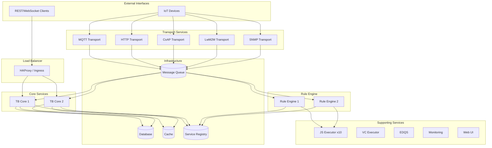

### Service Type Definitions

| Service Type | Identifier | Description | Documentation |
|--------------|------------|-------------|---------------|
| TB Node | tb-core / tb-rule-engine | Core platform: entity management, REST API, rule engine | [TB Node](./tb-node.md) |
| TB Transport | tb-transport | Protocol adapters for device communication | [Transport Services](./transport-services.md) |
| JS Executor | tb-js-executor | Remote JavaScript/TBEL function execution | [JS Executor](./js-executor.md) |
| VC Executor | tb-vc-executor | Version control and Git integration | [VC Executor](./vc-executor.md) |
| EDQS | edqs | Entity Data Query Service for optimized queries | [EDQS](./edqs.md) |
| Monitoring | tb-monitoring | Synthetic monitoring and health checks | [Monitoring](./monitoring.md) |
| Web UI | tb-web-ui | Angular frontend serving | [Web UI](./web-ui.md) |

## Service Responsibilities

### TB Core Service

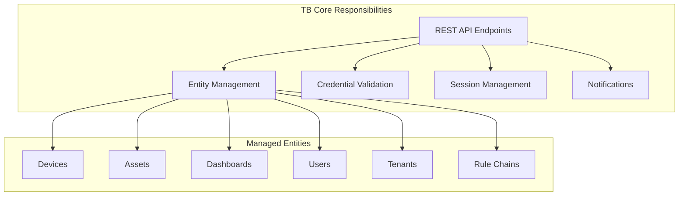

**Responsibilities:**
- REST API endpoints (port 8080)
- WebSocket connections for real-time updates
- Entity CRUD operations
- Device credential validation
- User authentication and authorization
- OTA package management
- Device activity tracking

**Scaling Considerations:**
- Stateless; scales horizontally
- Session state stored in distributed cache
- Database connection pool per instance

### TB Rule Engine Service

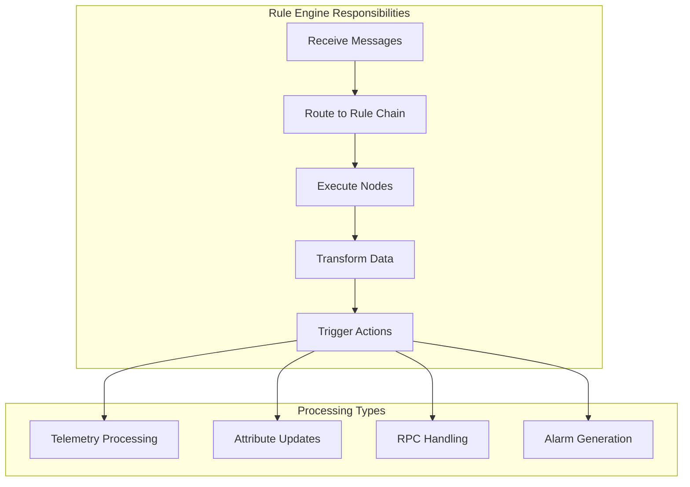

**Responsibilities:**
- Process messages through rule chains
- Execute rule node logic
- Transform and enrich data
- Generate alarms and notifications
- Route messages to external systems

**Scaling Considerations:**
- CPU-intensive; scale based on message throughput
- Queue partitions distributed across instances
- Isolated tenants get dedicated processing

### Transport Services

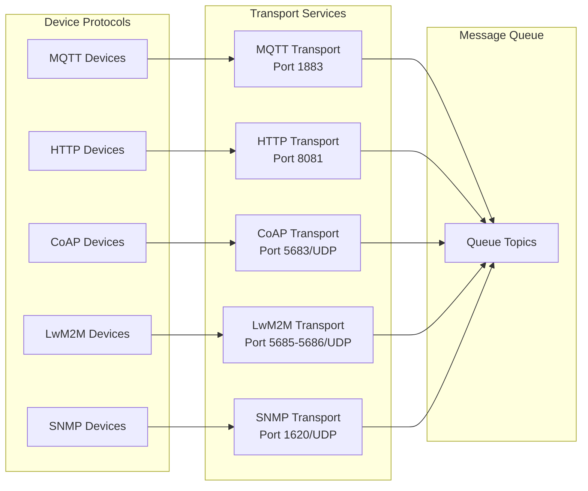

**Port Assignments:**

| Protocol | Port | Transport |
|----------|------|-----------|
| MQTT | 1883 | TCP |
| MQTT/SSL | 8883 | TCP |
| HTTP | 8081 | TCP |
| CoAP | 5683 | UDP |
| CoAP/DTLS | 5684 | UDP |
| LwM2M | 5685 | UDP |
| LwM2M Bootstrap | 5686 | UDP |
| SNMP | 1620 | UDP |

**Responsibilities:**
- Accept device connections
- Protocol-specific message parsing
- Credential validation via Core service
- Message serialization to queue format
- Session management for stateful protocols

**Scaling Considerations:**
- Connection-bound; scale by device count
- Each instance handles independent connections
- No shared state between transport replicas

### JS Executor Service

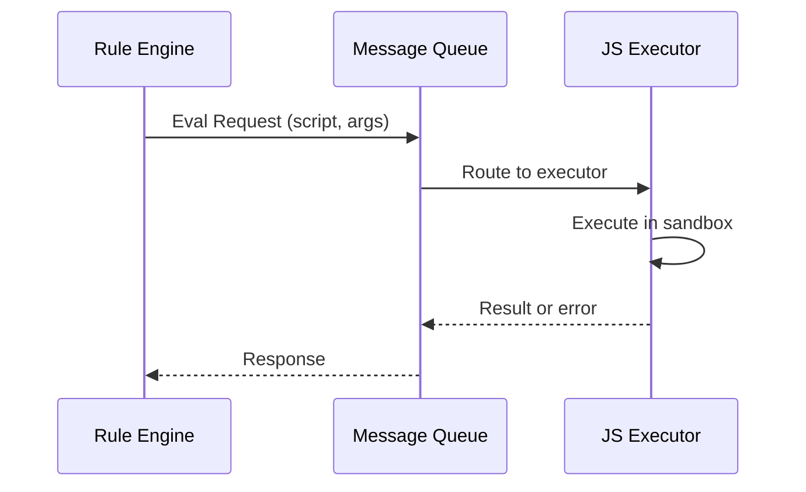

**Responsibilities:**
- Execute JavaScript functions remotely
- Sandbox execution environment
- Support for transformation scripts
- Filter and switch node evaluation

**Scaling Considerations:**
- CPU-intensive; scale by script complexity
- Default: 10 replicas
- Stateless; instant scaling

### Supporting Services

| Service | Purpose | Scaling |
|---------|---------|---------|
| [VC Executor](./vc-executor.md) | Git operations, version control | Low volume, 1-2 instances |
| [EDQS](./edqs.md) | Optimized entity data queries | Scale with query load, tenant partitions |
| [Monitoring](./monitoring.md) | Synthetic health checks, alerts | Single instance typically sufficient |
| [Web UI](./web-ui.md) | Angular frontend serving | Scale with user connections |

## Communication Patterns

### Message Queue Architecture

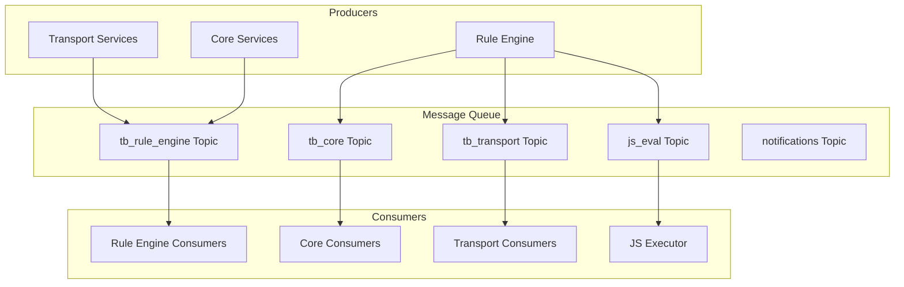

### Message Flow: Device Telemetry

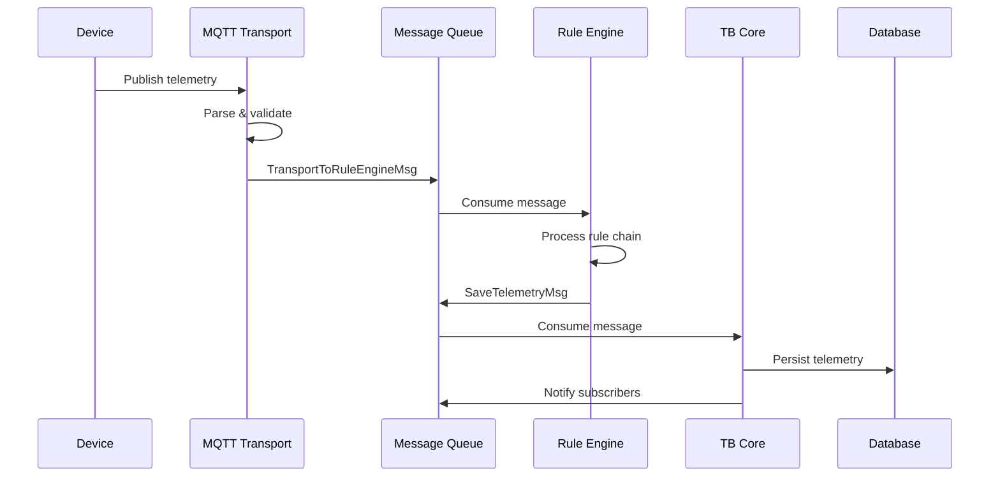

### Protocol Buffer Messages

Inter-service communication uses Protocol Buffers for efficient serialization:

| Message Type | Direction | Purpose |
|--------------|-----------|---------|
| TransportToDeviceActorMsg | Transport → Core | Session events, credentials |
| TransportToRuleEngineMsg | Transport → Rule Engine | Telemetry, attributes |
| ToCoreMsg | Any → Core | Device state, notifications |
| ToRuleEngineMsg | Any → Rule Engine | Messages for processing |
| ToTransportMsg | Core → Transport | Device responses, commands |
| JsInvokeRequest | Rule Engine → JS | Script evaluation |

### Message Structure

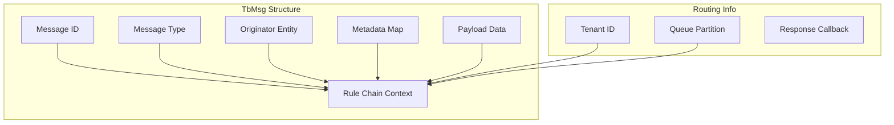

## Deployment Modes

### Monolith Mode

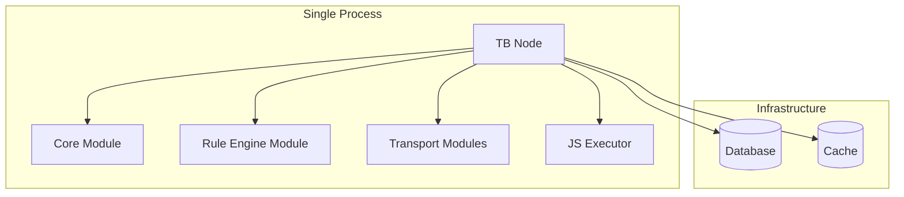

**Characteristics:**
- Single deployable unit
- In-process communication
- Simplified operations
- Limited horizontal scaling

**Use Cases:**
- Development and testing
- Small deployments (< 10,000 devices)
- Resource-constrained environments

### Microservices Mode

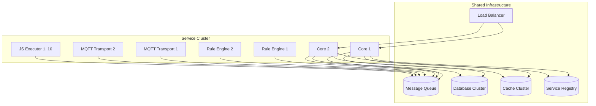

**Characteristics:**
- Independent service scaling
- Fault isolation
- Rolling updates
- Complex operations

**Use Cases:**
- Production deployments
- High availability requirements
- Large scale (> 100,000 devices)

### Hybrid Mode

Some components can run in different modes:

| Component | Monolith | Microservices |
|-----------|----------|---------------|
| Core + Rule Engine | Same process | Separate services |
| Transport | Embedded | Separate services |
| JS Executor | Local | Remote service |
| Database | Local or remote | Remote cluster |

## Service Discovery

### Zookeeper-Based Discovery

The platform uses Apache Zookeeper for service discovery and coordination. Zookeeper provides:

- **Ephemeral nodes**: Services register as ephemeral znodes that automatically disappear on disconnect
- **Watch notifications**: Other services receive instant updates when the cluster changes
- **Consistent configuration**: Shared configuration across all services

### Registration Flow

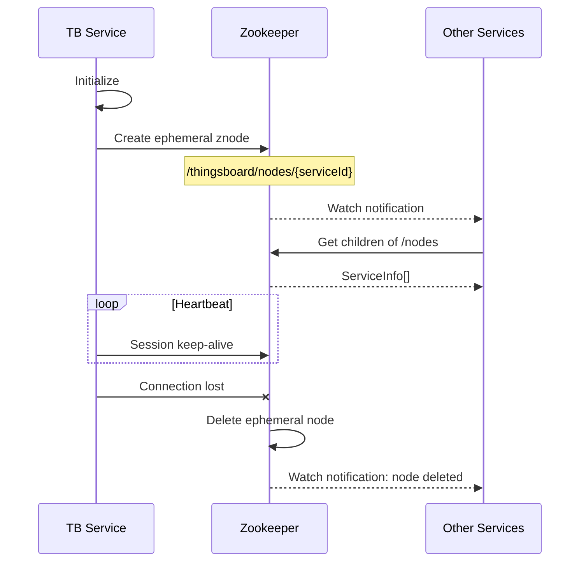

### Zookeeper Configuration

| Variable | Description | Default |
|----------|-------------|---------|
| ZOOKEEPER_ENABLED | Enable service discovery | true |
| ZOOKEEPER_URL | Zookeeper connection string | localhost:2181 |
| ZOOKEEPER_SESSION_TIMEOUT_MS | Session timeout | 10000 |
| ZOOKEEPER_CONNECTION_TIMEOUT_MS | Connection timeout | 30000 |
| ZOOKEEPER_RETRY_INTERVAL_MS | Retry interval on failure | 3000 |

### Service Info Structure

| Field | Description |
|-------|-------------|
| serviceId | Unique identifier (e.g., "tb-core-1") |
| serviceTypes | Roles: TB_CORE, TB_RULE_ENGINE, etc. |
| transports | Supported protocols |
| systemInfo | CPU, memory, disk metrics |
| assignedTenantProfiles | Isolated tenant assignments |
| ready | Service readiness status |
| partitionsPerNode | Queue partition assignments |

### Discovery Use Cases

| Use Case | Discovery Pattern |
|----------|-------------------|
| Queue partitioning | Find all rule engine instances |
| Credential validation | Transport finds core service |
| Load balancing | Distribute across available instances |
| Failover | Detect failed services |
| Partition reassignment | Hash-based rebalancing on cluster change |

## Configuration

### Environment-Based Configuration

Services are configured through environment variables:

| Variable | Description | Default |
|----------|-------------|---------|
| TB_SERVICE_TYPE | Service role | tb-core |
| TB_SERVICE_ID | Instance identifier | auto-generated |
| TB_QUEUE_TYPE | Queue backend | kafka |
| DATABASE | Storage type | postgres |
| CACHE | Cache backend | valkey |
| ZOOKEEPER_ENABLED | Enable discovery | true |
| JS_EVALUATOR | JS execution mode | remote |

### Queue Configuration

| Variable | Description |
|----------|-------------|
| TB_KAFKA_SERVERS | Kafka bootstrap servers |
| TB_KAFKA_REPLICATION_FACTOR | Topic replication |
| TB_QUEUE_CORE_PARTITIONS | Core queue partitions |
| TB_QUEUE_RE_PARTITIONS | Rule engine partitions |

### Cache Configuration

| Mode | Description | Nodes |
|------|-------------|-------|
| valkey | Single node | 1 |
| valkey-cluster | Clustered | 6 (3 primary + 3 replica) |
| valkey-sentinel | Sentinel HA | 3 (1 primary + 1 replica + sentinel) |

## Scaling Patterns

### Horizontal Scaling Guide

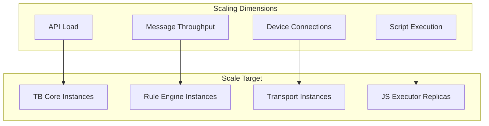

### Scaling Recommendations

| Workload | Metric | Action |
|----------|--------|--------|
| High API traffic | Request latency | Add Core instances |
| Message backlog | Queue lag | Add Rule Engine instances |
| Connection limits | Active connections | Add Transport instances |
| Script timeouts | Execution time | Add JS Executor replicas |
| Cache misses | Hit rate < 80% | Scale cache cluster |

### Instance Sizing

| Service | CPU | Memory | Scaling Factor |
|---------|-----|--------|----------------|
| TB Core | 2-4 cores | 4-8 GB | API requests/sec |
| Rule Engine | 4-8 cores | 8-16 GB | Messages/sec |
| Transport | 2-4 cores | 2-4 GB | Connections |
| JS Executor | 1-2 cores | 1-2 GB | Scripts/sec |

### Queue Partitioning for Scale

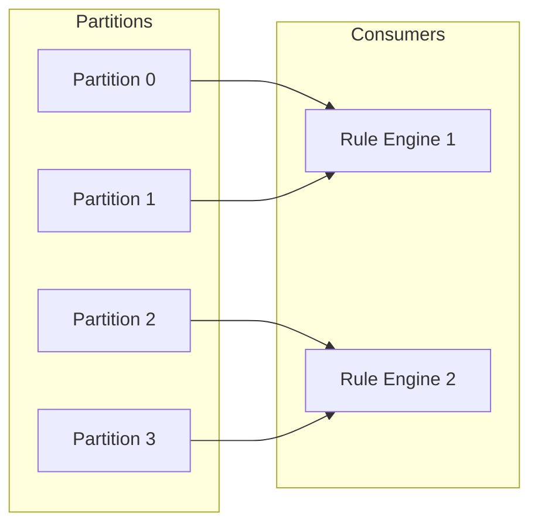

When adding instances:
- Partitions rebalance automatically
- Each instance gets subset of partitions
- Message ordering preserved per partition

## High Availability

### Failure Scenarios

| Failure | Impact | Recovery |
|---------|--------|----------|
| Core instance down | API unavailable on that node | Load balancer routes to others |
| Rule Engine down | Processing paused for partitions | Partitions reassign to remaining |
| Transport down | Devices reconnect | Devices use other transport instances |
| Queue broker down | All services affected | Broker cluster failover |
| Database down | All writes fail | Database cluster failover |

### HA Configuration

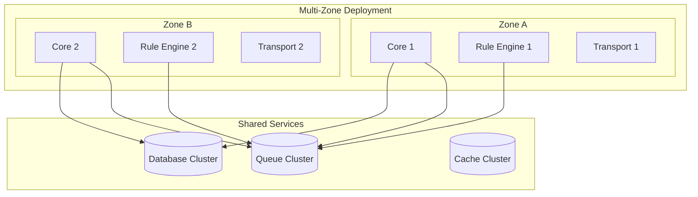

### Recommended Minimums for HA

| Component | Minimum Instances | Notes |
|-----------|-------------------|-------|
| TB Core | 2 | Behind load balancer |
| Rule Engine | 2 | Partition distribution |
| Transport | 2 per protocol | Per-protocol scaling |
| JS Executor | 3+ | Workload dependent |
| Queue | 3 brokers | Replication factor 3 |
| Database | 2+ | Primary + replica |
| Cache | 3+ | Cluster or sentinel |
| Service Registry | 3 | Quorum-based |

## Load Balancing

### HAProxy Configuration

HAProxy serves as the primary load balancer for distributing traffic across service instances.

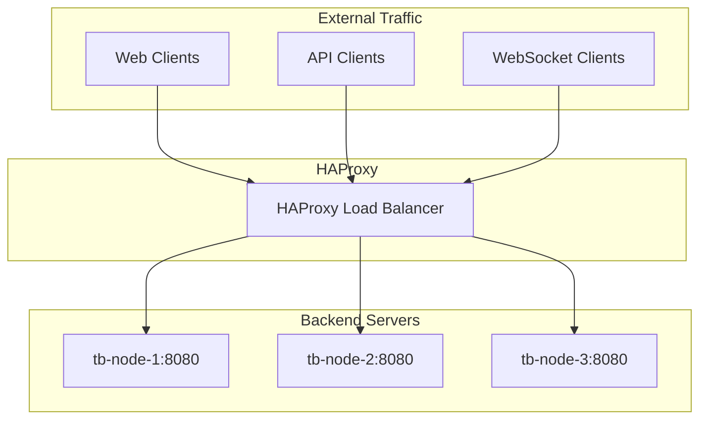

### Load Balancing Algorithms

| Algorithm | Configuration | Use Case |
|-----------|---------------|----------|
| Round-robin | `balance roundrobin` | Default, even distribution |
| Least connections | `balance leastconn` | Long-lived connections |
| Source sticky | `balance source` | Session affinity |

### HAProxy Backend Configuration

```
backend tb-http-backend
    balance roundrobin
    option tcp-check
    option log-health-checks
    server tb-node-1 tb-node-1:8080 check inter 5s
    server tb-node-2 tb-node-2:8080 check inter 5s
    server tb-node-3 tb-node-3:8080 check inter 5s

backend tb-mqtt-backend
    balance leastconn
    option tcp-check
    server mqtt-1 tb-mqtt-1:1883 check inter 5s
    server mqtt-2 tb-mqtt-2:1883 check inter 5s
```

### WebSocket Configuration

WebSocket connections require special handling for sticky sessions:

```
backend tb-websocket-backend
    balance source
    option httpchk GET /api/health
    http-check expect status 200
    server tb-node-1 tb-node-1:8080 check inter 5s
    server tb-node-2 tb-node-2:8080 check inter 5s
```

### Health Checks

| Check Type | Endpoint | Purpose |
|------------|----------|---------|
| TCP check | Port connectivity | Basic availability |
| HTTP check | `/api/health` | Application readiness |
| Custom | `/api/actuator/health` | Detailed health status |

### Rate Limiting with HAProxy

```
frontend tb-frontend
    bind *:80
    # Rate limit: 100 requests per second per IP
    stick-table type ip size 100k expire 30s store http_req_rate(1s)
    http-request track-sc0 src
    http-request deny deny_status 429 if { sc_http_req_rate(0) gt 100 }
```

## Monitoring

### Key Metrics by Service

| Service | Metrics |
|---------|---------|
| Core | Request latency, error rate, active sessions |
| Rule Engine | Message throughput, processing time, queue lag |
| Transport | Connection count, message rate, protocol errors |
| JS Executor | Execution time, queue depth, error rate |
| Queue | Partition lag, throughput, replication |

### Health Checks

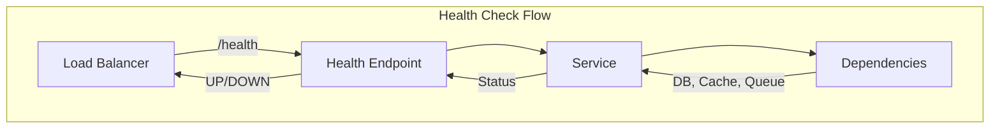

Health check verifies:
- Service is running
- Database connectivity
- Cache connectivity
- Queue connectivity
- Service registry connection

## See Also

### Service Documentation

- [TB Node](./tb-node.md) - Core application service
- [JS Executor](./js-executor.md) - JavaScript execution service
- [Transport Services](./transport-services.md) - Device protocol transports
- [VC Executor](./vc-executor.md) - Version control service
- [EDQS](./edqs.md) - Entity Data Query Service
- [Monitoring](./monitoring.md) - Synthetic monitoring service
- [Web UI](./web-ui.md) - Angular frontend service

### Related Architecture

- [System Overview](../01-architecture/system-overview.md) - Platform architecture
- [Message Queue Architecture](../08-message-queue/queue-architecture.md) - Queue system
- [Queue Partitioning](../08-message-queue/partitioning.md) - Partition strategies
- [Multi-Tenancy](../01-architecture/multi-tenancy.md) - Tenant isolation
- [Transport Contract](../05-transport-layer/transport-contract.md) - Device protocols
