# Entity Data Query Service (EDQS)

## Overview

The Entity Data Query Service (EDQS) is a high-performance, distributed microservice optimized for entity metadata and relationship queries. It maintains an in-memory representation of entity data to provide sub-millisecond query responses, functioning similarly to Elasticsearch but specifically designed for ThingsBoard entity operations.

## Architecture

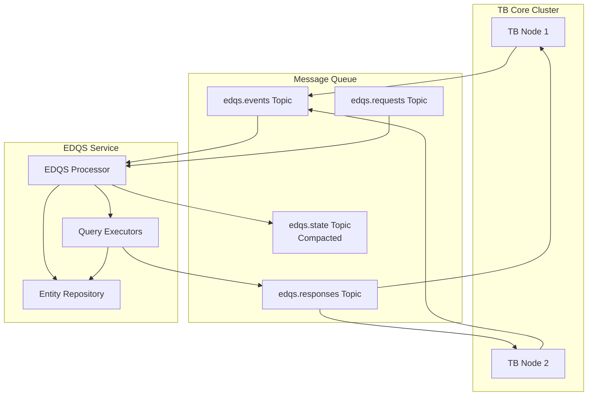

## Key Responsibilities

| Responsibility | Description |
|----------------|-------------|
| Event Processing | Consume entity update/delete events from TB Core |
| State Management | Maintain compacted state for crash recovery |
| Query Execution | Process entity data queries with filtering and pagination |
| In-Memory Storage | Store entity data in optimized data structures |
| Partition Management | Handle tenant-based partitioning for horizontal scaling |
| Statistics | Track query performance and slow queries |

## Components

### EDQS Processor

The main message handler that processes events and queries:

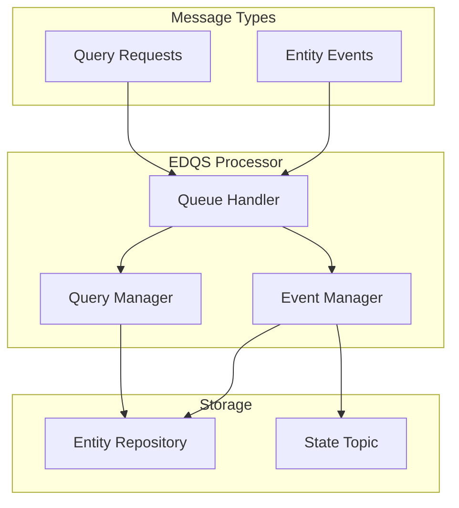

### Entity Repository

Per-tenant in-memory data storage:

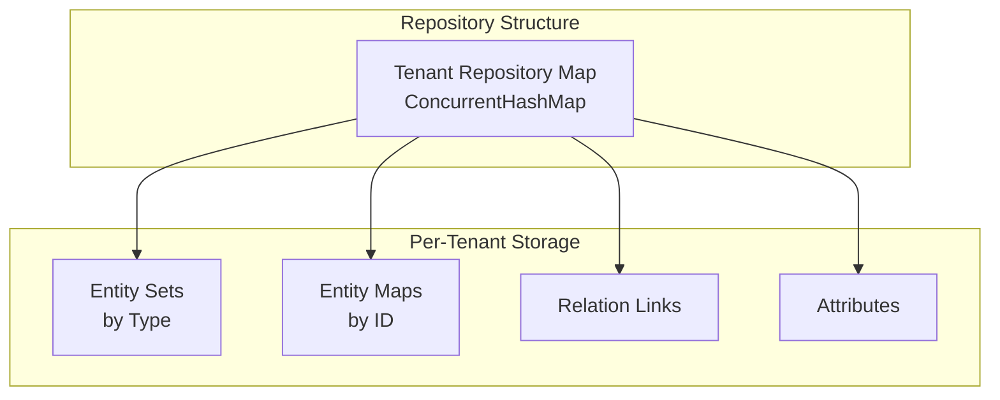

#### Supported Entity Types

| Entity Type | Data Class | Fields |
|-------------|------------|--------|
| Device | DeviceData | name, type, label, profileId |
| Asset | AssetData | name, type, label, profileId |
| Dashboard | DashboardData | name, title |
| Customer | CustomerData | name, title, country, city |
| Tenant | TenantData | name, title, region |
| Edge | EdgeData | name, type, label |
| EntityView | EntityViewData | name, type |
| ApiUsageState | ApiUsageStateData | usage metrics |

## Query System

### Query Types

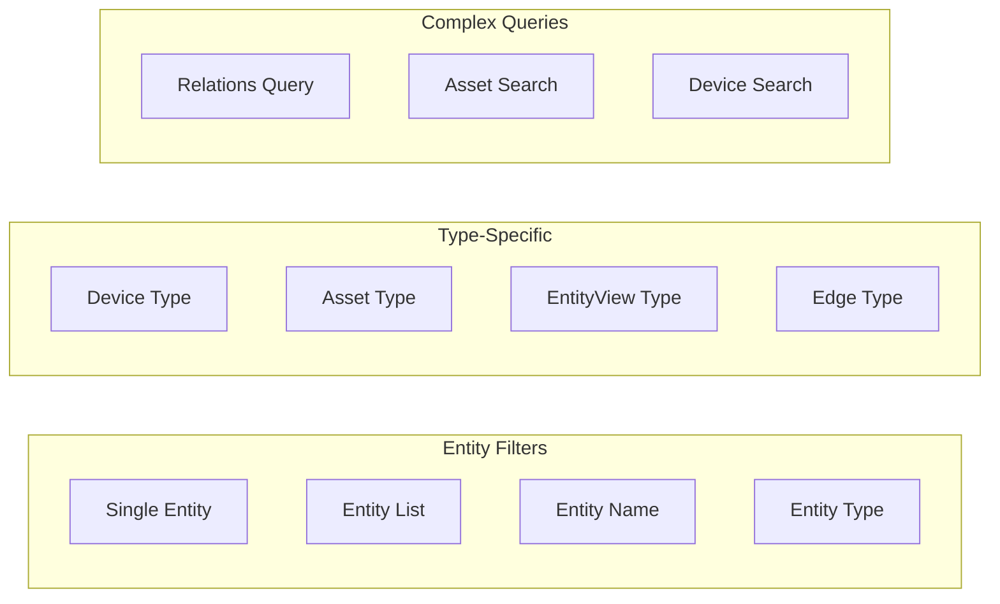

| Query Type | Processor | Purpose |
|------------|-----------|---------|
| SINGLE_ENTITY | SingleEntityQueryProcessor | Query by entity ID |
| ENTITY_LIST | EntityListQueryProcessor | Query specific entity IDs |
| ENTITY_NAME | EntityNameQueryProcessor | Search by entity name |
| ENTITY_TYPE | EntityTypeQueryProcessor | Filter by entity type |
| DEVICE_TYPE | DeviceTypeQueryProcessor | Filter devices by type |
| ASSET_TYPE | AssetTypeQueryProcessor | Filter assets by type |
| ENTITY_VIEW_TYPE | EntityViewTypeQueryProcessor | Filter entity views |
| EDGE_TYPE | EdgeTypeQueryProcessor | Filter edges by type |
| RELATIONS_QUERY | RelationQueryProcessor | Query entity relationships |
| API_USAGE_STATE | ApiUsageStateQueryProcessor | Query API usage statistics |
| ASSET_SEARCH_QUERY | AssetSearchQueryProcessor | Full-text asset search |
| DEVICE_SEARCH_QUERY | DeviceSearchQueryProcessor | Full-text device search |

### Query Structure

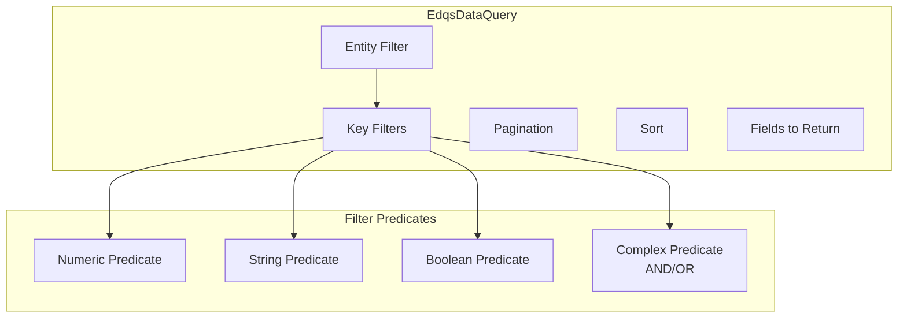

#### Filter Predicates

| Predicate Type | Operations |
|----------------|------------|
| NumericFilterPredicate | EQUAL, NOT_EQUAL, GREATER, LESS, GREATER_OR_EQUAL, LESS_OR_EQUAL |
| StringFilterPredicate | EQUAL, NOT_EQUAL, CONTAINS, NOT_CONTAINS, STARTS_WITH, ENDS_WITH |
| BooleanFilterPredicate | TRUE, FALSE |
| ComplexFilterPredicate | AND, OR (combines multiple predicates) |

## Queue Communication

### Topics

| Topic | Purpose | Retention | Compaction |
|-------|---------|-----------|------------|
| edqs.events | Entity events (UPDATED/DELETED) | 24 hours | No |
| edqs.state | State backup for recovery | Infinite | Yes |
| edqs.requests | Query requests from TB Core | 3 minutes | No |
| edqs.responses | Query responses to TB Core | 3 minutes | No |

### Event Flow

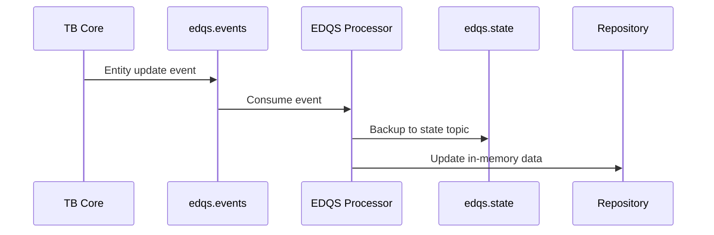

### Query Flow

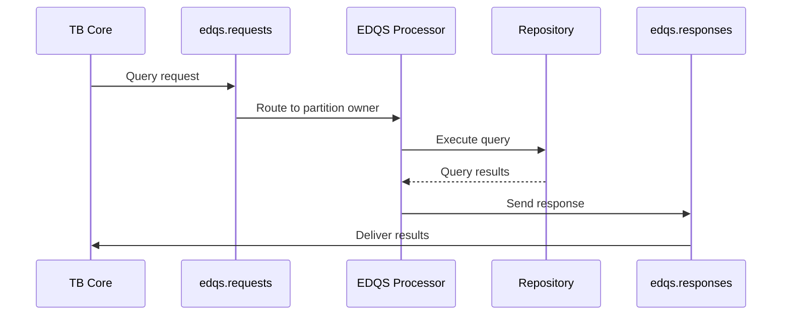

## Data Storage

### Data Point Types

Optimized storage with automatic compression:

| Type | Storage Class | Purpose |
|------|---------------|---------|
| Boolean | BoolDataPoint | Boolean values |
| Long | LongDataPoint | Integer numbers |
| Double | DoubleDataPoint | Floating point |
| String | StringDataPoint | Short strings |
| String (long) | CompressedStringDataPoint | Strings > 512 bytes |
| JSON | JsonDataPoint | JSON objects |
| JSON (large) | CompressedJsonDataPoint | Large JSON > 512 bytes |

### Compression

| Setting | Default | Description |
|---------|---------|-------------|
| String Compression Threshold | 512 bytes | Compress strings larger than this |
| Compression Algorithm | gzip | Applied to large strings/JSON |

## Partition Strategy

### Tenant-Based Partitioning

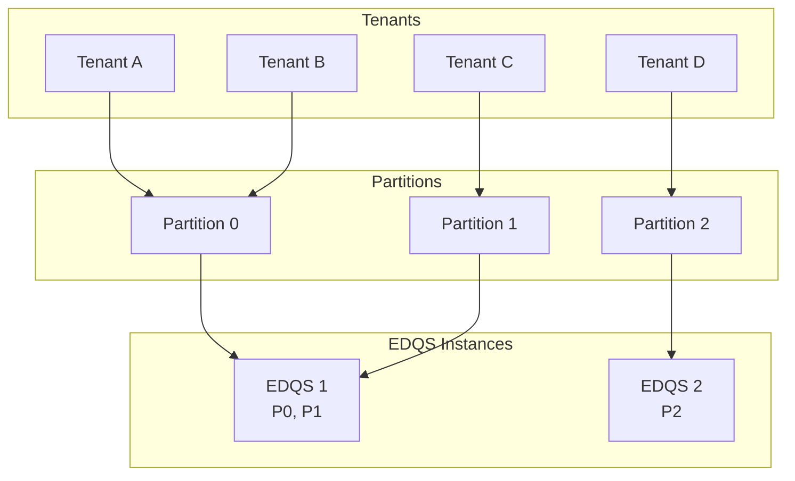

### Partitioning Strategies

| Strategy | Description | Use Case |
|----------|-------------|----------|
| TENANT | Partition by tenant ID | Multi-instance scaling |
| NONE | All data on each instance | Single instance deployment |

## Configuration

### Core Settings

| Variable | Default | Description |
|----------|---------|-------------|
| TB_SERVICE_TYPE | edqs | Service type identifier |
| TB_EDQS_PARTITIONS | 12 | Number of partitions |
| TB_EDQS_PARTITIONING_STRATEGY | tenant | Partitioning strategy |
| TB_EDQS_LABEL | (empty) | Instance label for partition sharing |

### Topic Configuration

| Variable | Default | Description |
|----------|---------|-------------|
| TB_EDQS_EVENTS_TOPIC | edqs.events | Events topic name |
| TB_EDQS_STATE_TOPIC | edqs.state | State topic name |
| TB_EDQS_REQUESTS_TOPIC | edqs.requests | Requests topic name |
| TB_EDQS_RESPONSES_TOPIC | edqs.responses | Responses topic name |

### Performance Tuning

| Variable | Default | Description |
|----------|---------|-------------|
| TB_EDQS_POLL_INTERVAL_MS | 25 | Consumer poll interval |
| TB_EDQS_MAX_PENDING_REQUESTS | 10000 | Max queued requests |
| TB_EDQS_MAX_REQUEST_TIMEOUT | 20000 | Request timeout (ms) |
| TB_EDQS_REQUEST_EXECUTOR_SIZE | 50 | Query executor threads |
| TB_EDQS_VERSIONS_CACHE_TTL_MINUTES | 60 | Version cache TTL |
| TB_EDQS_STRING_COMPRESSION_LENGTH_THRESHOLD | 512 | Compression threshold |

### Statistics

| Variable | Default | Description |
|----------|---------|-------------|
| TB_EDQS_STATS_ENABLED | true | Enable query statistics |
| TB_EDQS_SLOW_QUERY_THRESHOLD_MS | 200 | Slow query threshold |

## Deployment

### Docker Deployment

```yaml
tb-edqs:
  image: thingsboard/tb-edqs:latest
  environment:
    - TB_SERVICE_TYPE=edqs
    - TB_QUEUE_TYPE=kafka
    - TB_KAFKA_SERVERS=kafka:9092
    - ZOOKEEPER_ENABLED=true
    - ZOOKEEPER_URL=zookeeper:2181
    - TB_EDQS_PARTITIONS=12
    - TB_EDQS_PARTITIONING_STRATEGY=tenant
```

### Health Check

| Endpoint | Port | Response |
|----------|------|----------|
| GET /api/edqs/ready | 8080 | 200 OK when ready |

## Synchronization

### Initial Sync

When EDQS starts or reconnects:

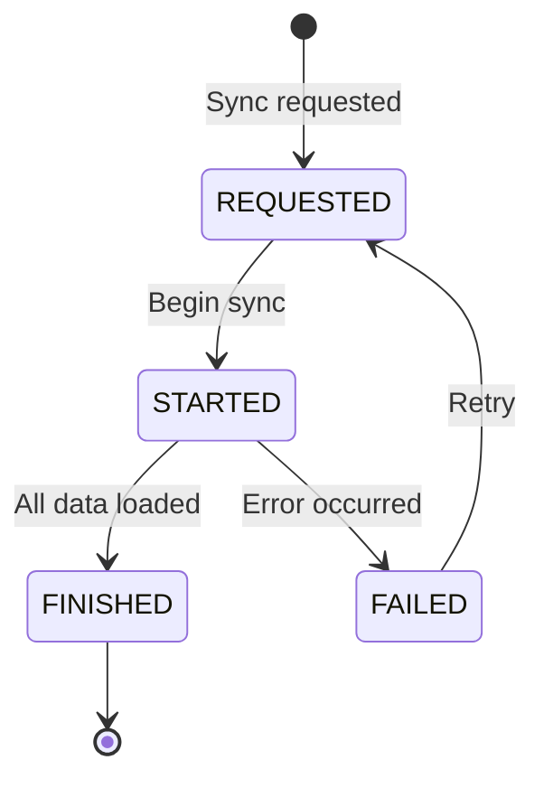

### State Recovery

1. Subscribe to state topic (compacted)
2. Consume all existing state messages
3. Subscribe to events topic
4. Process new events
5. Mark service as ready

## Error Handling

### Error Types

| Error | Handling |
|-------|----------|
| OutOfMemoryError | Clear repository, mark not ready, shutdown |
| RecordTooLargeException | Return "Result set is too large" |
| IllegalArgumentException | Return "Invalid request format" |
| NullPointerException | Return "Invalid request format or missing data" |

### Recovery Actions

| Condition | Action |
|-----------|--------|
| OOM | Graceful shutdown, rely on orchestrator restart |
| Partition change | Clear non-owned tenant data |
| Request timeout | Return error response |

## Performance Characteristics

### Query Performance

| Aspect | Characteristic |
|--------|----------------|
| Lookup by ID | O(1) hash map access |
| Filter by type | O(n) scan of type set |
| Text search | O(n) with string matching |
| Pagination | In-memory slice |

### Memory Usage

| Factor | Impact |
|--------|--------|
| Entity count | Linear memory growth |
| Attribute count | Per-entity overhead |
| String length | Compressed if > 512 bytes |
| JSON size | Compressed if > 512 bytes |

### Scalability

| Dimension | Scaling Method |
|-----------|----------------|
| Tenants | Add EDQS instances, partitions |
| Queries | Add EDQS instances |
| Data size | Memory per instance |

## Integration with TB Core

### Entity Update Flow

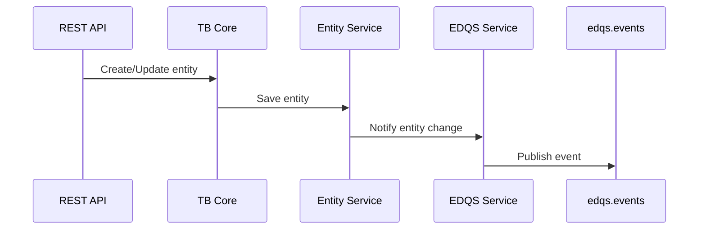

### Query Integration

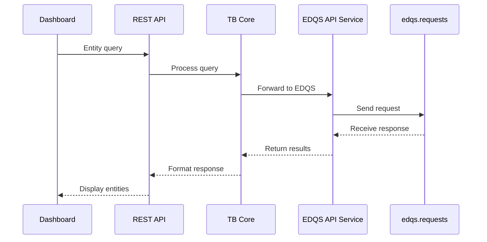

## Best Practices

### For Operations

- Monitor query latencies via statistics
- Set appropriate partition count for tenant volume
- Configure adequate memory for entity count
- Monitor slow query logs

### For Production

- Deploy minimum 2 instances for high availability
- Use TENANT partitioning for multi-tenant deployments
- Enable statistics for performance monitoring
- Configure compression thresholds based on data patterns

### For Scaling

- Scale horizontally by adding instances
- Increase partitions when adding instances
- Monitor memory usage per instance
- Balance partition distribution across instances

## See Also

- [Microservices Overview](./README.md) - Architecture overview
- [TB Node](./tb-node.md) - Core application service
- [Message Queue Architecture](../08-message-queue/queue-architecture.md) - Queue system
- [Data Model](../02-core-concepts/data-model/README.md) - Entity data concepts
