# JS Executor

## Overview

The JS Executor is a microservice responsible for executing JavaScript code in a sandboxed environment separate from the main ThingsBoard application. It enables rule nodes to run custom JavaScript for filtering, transformation, and routing without affecting the stability of the core platform. The service uses Node.js for execution and communicates with TB Node via message queues.

## Architecture

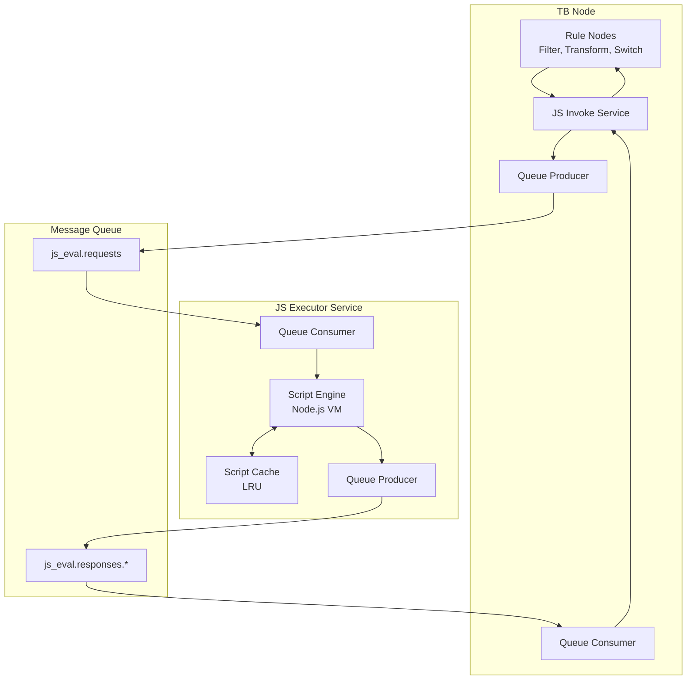

## Key Responsibilities

| Responsibility | Description |
|----------------|-------------|
| Script Compilation | Parse and compile JavaScript functions |
| Script Execution | Run functions with provided arguments |
| Sandboxing | Isolate script execution from system |
| Caching | Cache compiled scripts for performance |
| Timeout Enforcement | Terminate long-running scripts |
| Error Handling | Report compilation and runtime errors |

## Communication Protocol

### Message Flow

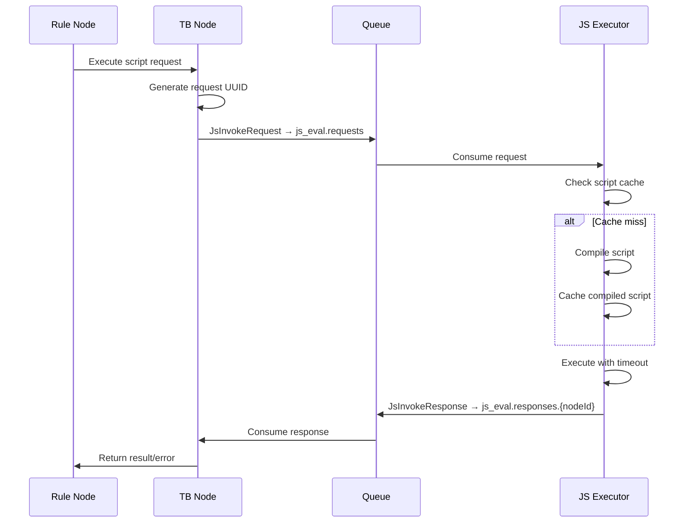

### Request Types

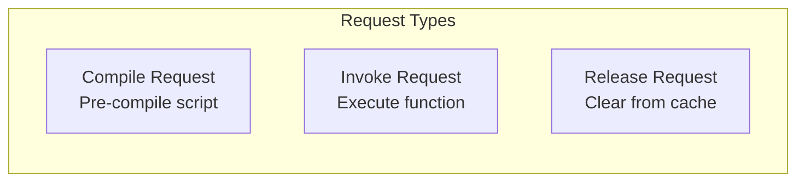

| Request | Fields | Purpose |
|---------|--------|---------|
| JsCompileRequest | scriptHash, functionName, scriptBody | Pre-compile and cache |
| JsInvokeRequest | scriptHash, scriptBody, timeout, args, functionName | Execute with arguments |
| JsReleaseRequest | scriptHash, functionName | Remove from cache |

### Response Structure

| Field | Type | Description |
|-------|------|-------------|
| requestIdMSB | int64 | Request UUID most significant bits |
| requestIdLSB | int64 | Request UUID least significant bits |
| success | boolean | Execution succeeded |
| result | string | Function return value (JSON) |
| errorCode | enum | Error type if failed |
| errorDetails | string | Error message and stack trace |

### Error Codes

| Code | Name | Cause |
|------|------|-------|
| 0 | COMPILATION_ERROR | Syntax or semantic error in script |
| 1 | RUNTIME_ERROR | Exception during execution |
| 2 | TIMEOUT_ERROR | Execution exceeded timeout |
| 3 | NOT_FOUND_ERROR | Script not in cache (triggers retry) |

## Queue Topics

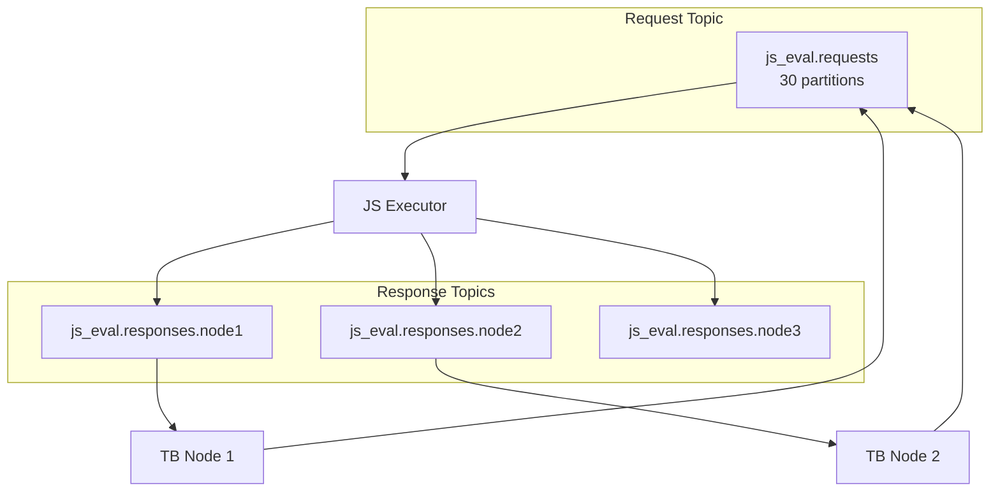

| Topic | Configuration | Purpose |
|-------|---------------|---------|
| js_eval.requests | 30 partitions, 1-day retention | Request distribution |
| js_eval.responses.{nodeId} | Per-node topic | Response routing |

## Execution Modes

### Local Execution (Deprecated)

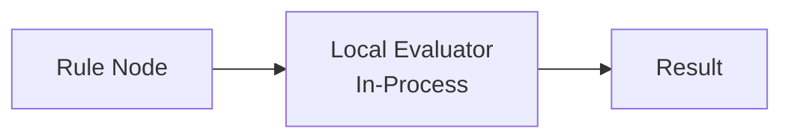

| Aspect | Description |
|--------|-------------|
| Engine | Java Nashorn (deprecated) |
| Location | In-process with TB Node |
| Isolation | Limited |
| Use Case | Development only |

### Remote Execution (Recommended)

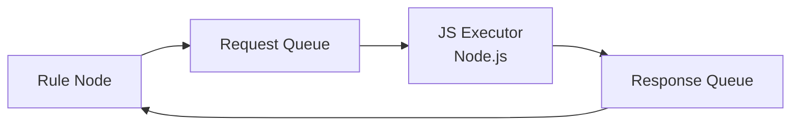

| Aspect | Description |
|--------|-------------|
| Engine | Node.js VM module |
| Location | Separate microservice |
| Isolation | Full sandboxing |
| Use Case | Production |

Configuration:
```yaml
js:
  evaluator: "remote"  # Options: 'local' (deprecated) or 'remote'
```

## Sandboxing

### VM Isolation

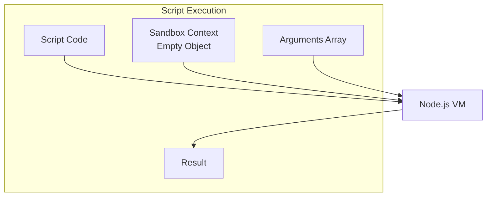

### Security Features

| Feature | Implementation |
|---------|----------------|
| Context Isolation | Scripts run in vm.runInNewContext() |
| No Globals | Sandbox created from Object.create(null) |
| Argument Passing | Arguments as array (prevents injection) |
| Timeout Enforcement | Per-execution timeout in VM options |
| Memory Limits | Resource monitoring |

### Sandbox Modes

| Mode | Method | Security | Performance |
|------|--------|----------|-------------|
| Full Sandbox | vm.runInNewContext() | Higher | Lower |
| Lightweight | vm.compileFunction() | Standard | Higher |

Configuration:
```yaml
script:
  use_sandbox: "true"  # Enable full sandboxing
```

## Script Caching

### LRU Cache

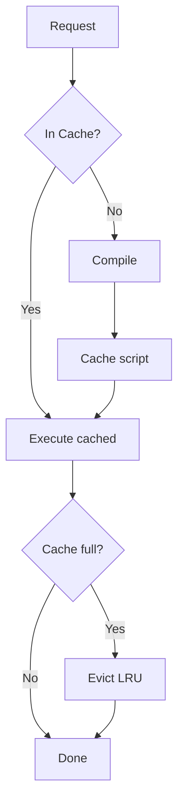

### Cache Configuration

| Setting | Default | Description |
|---------|---------|-------------|
| max_active_scripts | 1000 | Maximum cached scripts |
| Eviction Policy | LRU | Least Recently Used |
| Key Format | scriptHash + functionName | Unique identifier |

### Cache Operations

| Operation | Trigger | Action |
|-----------|---------|--------|
| Add | First execution | Compile and store |
| Hit | Subsequent execution | Return cached |
| Evict | Cache full | Remove least used |
| Release | Explicit request | Remove specific script |

## Resource Limits

### Size Limits

| Limit | Default | Description |
|-------|---------|-------------|
| max_total_args_size | 100,000 | Maximum argument data size (bytes) |
| max_result_size | 300,000 | Maximum result size (characters) |
| max_script_body_size | 50,000 | Maximum script code size (bytes) |

### Timeout Configuration

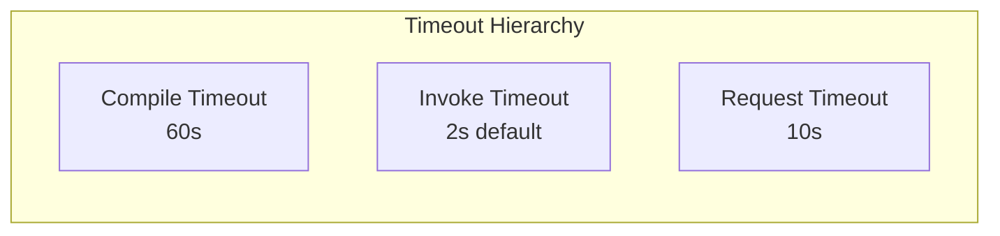

| Timeout | Default | Purpose |
|---------|---------|---------|
| max_eval_requests_timeout | 60s | Script compilation |
| max_exec_requests_timeout | 2s | Function execution |
| max_request_timeout | 10s | Overall request |
| response_poll_interval | 25ms | Response polling |

### Monitoring Settings

| Setting | Default | Description |
|---------|---------|-------------|
| memory_usage_trace_frequency | 1000 | Log memory every N scripts |
| script_body_trace_frequency | 10000 | Log script body every N executions |
| slow_query_log_ms | 5000 | Log if execution exceeds 5s |

## Error Handling

### Error Flow

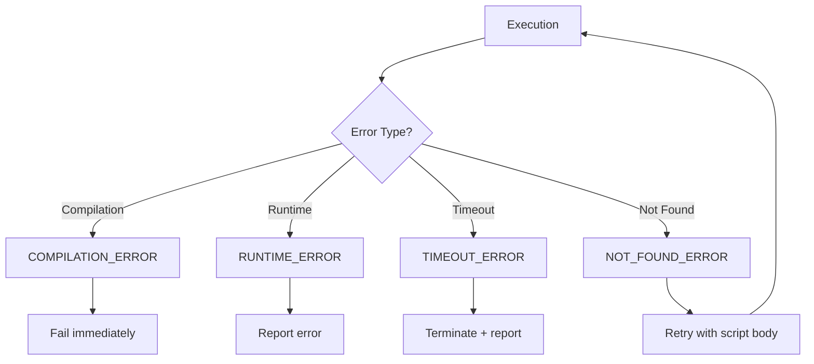

### Error Recovery

| Error | Recovery Action |
|-------|-----------------|
| COMPILATION_ERROR | Fail message, log error |
| RUNTIME_ERROR | Route to failure connection |
| TIMEOUT_ERROR | Terminate execution, report timeout |
| NOT_FOUND_ERROR | Re-send request with script body |

### Blacklisting

Scripts with repeated errors are temporarily blacklisted:

| Setting | Default | Description |
|---------|---------|-------------|
| max_errors | 3 | Errors before blacklist |
| max_black_list_duration_sec | 60 | Blacklist duration |

## Configuration Reference

### TB Node Settings (Remote JS)

| Property | Default | Description |
|----------|---------|-------------|
| js.evaluator | local | Evaluator type (local/remote) |
| js.remote.js_thread_pool_size | 50 | Thread pool for responses |
| js.remote.max_pending_requests | 10000 | Max queued requests |
| queue.js.request_topic | js_eval.requests | Request topic |
| queue.js.response_topic_prefix | js_eval.responses | Response topic prefix |

### JS Executor Settings

| Property | Default | Description |
|----------|---------|-------------|
| queue_type | kafka | Queue implementation |
| http_port | 8888 | Health check port |
| script.use_sandbox | true | Enable sandboxing |
| script.max_active_scripts | 1000 | Cache size |
| js.max_result_size | 300000 | Max result size |

### Environment Variables

| Variable | Description |
|----------|-------------|
| TB_KAFKA_SERVERS | Kafka broker addresses |
| REMOTE_JS_EVAL_REQUEST_TOPIC | Request topic name |
| REMOTE_JS_EVAL_RESPONSE_TOPIC | Response topic prefix |
| MAX_ACTIVE_SCRIPTS | Script cache size |
| SCRIPT_USE_SANDBOX | Enable/disable sandbox |

## Deployment

### Docker Deployment

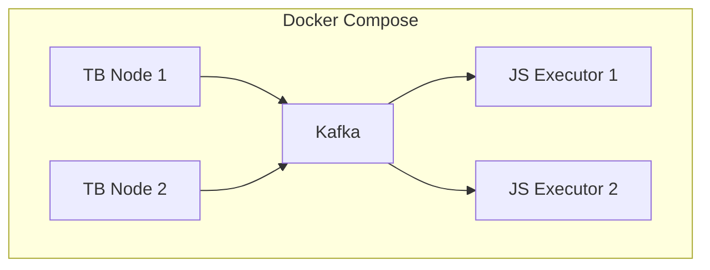

### Docker Compose Example

```yaml
tb-js-executor:
  image: thingsboard/tb-js-executor:latest
  environment:
    - TB_KAFKA_SERVERS=kafka:9092
    - REMOTE_JS_EVAL_REQUEST_TOPIC=js_eval.requests
    - MAX_ACTIVE_SCRIPTS=1000
    - SCRIPT_USE_SANDBOX=true
  deploy:
    replicas: 2
```

### Health Check

| Endpoint | Port | Purpose |
|----------|------|---------|
| /livenessProbe | 8888 | Kubernetes liveness |

## Scaling

### Horizontal Scaling

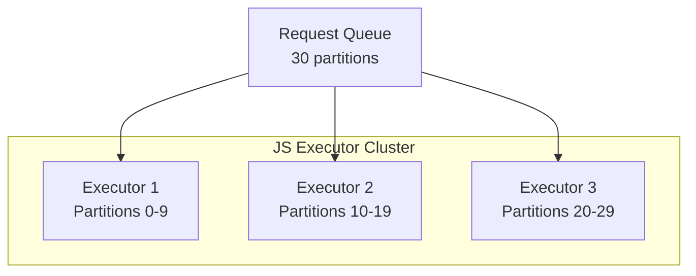

### Scaling Considerations

| Factor | Impact |
|--------|--------|
| Script Complexity | More CPU per request |
| Request Volume | More instances needed |
| Cache Size | Memory per instance |
| Timeout Frequency | Wasted resources |

### Performance Tuning

| Setting | Adjustment |
|---------|------------|
| max_active_scripts | Increase for cache hits |
| kafka.batch_size | Increase for throughput |
| kafka.linger_ms | Increase for batching |
| partitions_consumed_concurrently | Increase for parallelism |

## Rule Nodes Using JavaScript

### Filter Node

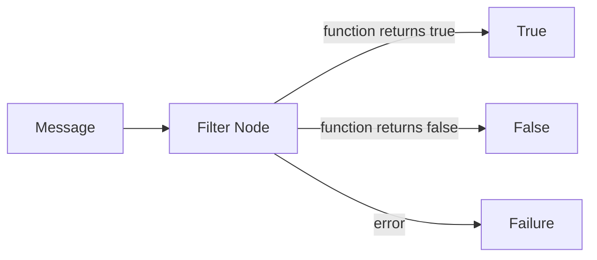

Function signature:
```javascript
function filter(msg, metadata, msgType) {
    return msg.temperature > 25;
}
```

### Switch Node

```mermaid
graph LR
    M[Message] --> S[Switch Node]
    S -->|returns ['A']| A[Route A]
    S -->|returns ['B']| B[Route B]
    S -->|returns ['A','B']| AB[Both Routes]
```

Function signature:
```javascript
function switch(msg, metadata, msgType) {
    if (msg.type === 'alarm') return ['alert'];
    return ['default'];
}
```

### Transform Node

Function signature:
```javascript
function transform(msg, metadata, msgType) {
    return {
        transformed: true,
        originalTemp: msg.temperature,
        tempF: msg.temperature * 9/5 + 32
    };
}
```

## Best Practices

### For Script Development

- Keep scripts simple and focused
- Avoid complex loops or recursion
- Return early when possible
- Use descriptive variable names
- Test scripts before deployment

### For Operations

- Monitor script execution times
- Set appropriate timeouts
- Scale executors with load
- Review slow query logs
- Monitor cache hit rates

### For Security

- Enable sandboxing in production
- Review scripts for security issues
- Limit script size and complexity
- Monitor for timeout patterns
- Use remote execution always

## When to Use JS Executor

### Use Remote JS Executor When

- Running in production
- High script execution volume
- Need independent scaling
- Security isolation required
- Long-running scripts possible

### Use Local Evaluator When

- Development/testing only
- Very low JavaScript usage
- Single-node deployment
- No performance concerns

## See Also

- [Microservices Overview](./README.md) - Architecture overview
- [TB Node](./tb-node.md) - Core application service
- [Rule Engine Overview](../04-rule-engine/README.md) - Rule processing
- [Node Categories](../04-rule-engine/node-categories.md) - Node types
- [Node Development Contract](../04-rule-engine/node-development-contract.md) - Custom nodes
