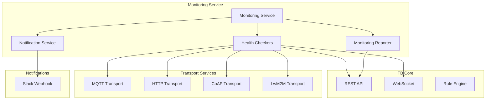
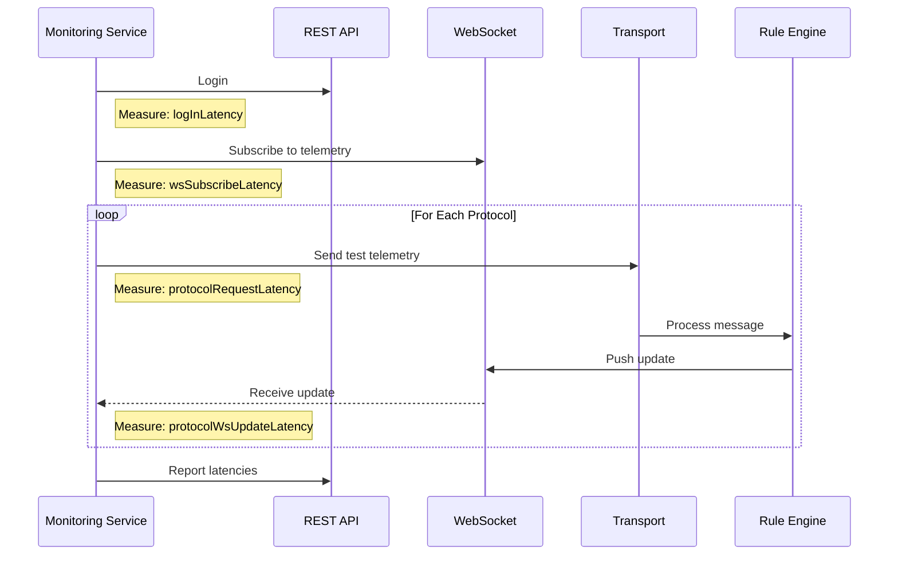
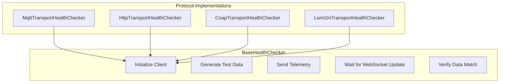
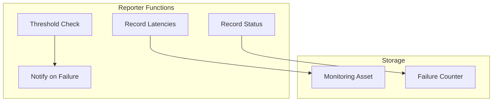
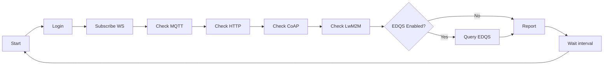

# Monitoring Service

## Overview

The Monitoring Service is a standalone microservice that continuously monitors the health and performance of ThingsBoard platform services and transport protocols. It operates as a synthetic monitoring system, creating artificial test traffic to measure system responsiveness and detect service degradation before it impacts users.

## Architecture



## Key Responsibilities

| Responsibility | Description |
|----------------|-------------|
| Protocol Health Checks | Monitor MQTT, HTTP, CoAP, LwM2M transports |
| End-to-End Latency | Measure full data flow from device to dashboard |
| Service Status | Track consecutive failures and recovery |
| Alert Management | Send notifications on failures and high latency |
| Metrics Collection | Store latency measurements as telemetry |
| Auto-Provisioning | Create test devices and monitoring assets |

## Health Check Flow



## Components

### Health Checkers

Protocol-specific implementations that perform synthetic tests:



#### Protocol Configurations

| Protocol | Client Library | Default Port | QoS |
|----------|----------------|--------------|-----|
| MQTT | Eclipse Paho v3 | 1883 | 1 |
| HTTP | Spring RestTemplate | 80/443 | N/A |
| CoAP | Eclipse Californium | 5683 | N/A |
| LwM2M | Eclipse Leshan | 5685 | N/A |

### Monitoring Reporter

Tracks and reports health metrics:



### Notification Service

Asynchronous notification delivery:

| Channel | Implementation | Format |
|---------|----------------|--------|
| Slack | Webhook POST | Markdown with emoji |

## Metrics Collected

### Latency Metrics

| Metric | Key | Description |
|--------|-----|-------------|
| Login | logInLatency | Time to authenticate with REST API |
| WebSocket Subscribe | wsSubscribeLatency | Time to establish subscription |
| MQTT Request | mqttRequestLatency | Time to send MQTT message |
| MQTT Update | mqttWsUpdateLatency | End-to-end MQTT latency |
| HTTP Request | httpRequestLatency | Time to send HTTP message |
| HTTP Update | httpWsUpdateLatency | End-to-end HTTP latency |
| CoAP Request | coapRequestLatency | Time to send CoAP message |
| CoAP Update | coapWsUpdateLatency | End-to-end CoAP latency |
| LwM2M Request | lwm2mRequestLatency | Time to send LwM2M message |
| LwM2M Update | lwm2mWsUpdateLatency | End-to-end LwM2M latency |
| EDQS Query | edqsQueryLatency | Entity data query time |

### Status Tracking

| Metric | Description |
|--------|-------------|
| Consecutive Failures | Count of sequential check failures |
| Service State | UP/DOWN status per service |
| Recovery Events | Transitions from failed to healthy |

## Auto-Provisioned Entities

The monitoring service automatically creates required test entities:

### Monitoring Dashboard

| Property | Value |
|----------|-------|
| Name | [Monitoring] Cloud monitoring |
| Visibility | Public (via customer assignment) |
| Purpose | Display real-time health metrics |

### Monitoring Asset

| Property | Value |
|----------|-------|
| Name | [Monitoring] Latencies |
| Type | Monitoring |
| Purpose | Store time-series latency data |

### Test Devices

Per protocol and target:

| Property | Format |
|----------|--------|
| Name | {prefix} {Protocol} ({Queue}) - {BaseUrl} |
| Credentials | Auto-generated 20-char access token |
| Profile | Protocol-specific profile |

### Calculated Fields

| Field | Formula | Purpose |
|-------|---------|---------|
| testDataCf | testData + "-cf" | Verify calculated field processing |

## Configuration

### Core Settings

| Variable | Default | Description |
|----------|---------|-------------|
| DOMAIN | localhost | Domain to monitor |
| REST_BASE_URL | https://${DOMAIN} | REST API endpoint |
| REST_AUTH_USERNAME | tenant@thingsboard.org | Authentication username |
| REST_AUTH_PASSWORD | tenant | Authentication password |
| REST_REQUEST_TIMEOUT_MS | 5000 | REST request timeout |
| WS_BASE_URL | wss://${DOMAIN} | WebSocket endpoint |
| WS_REQUEST_TIMEOUT_MS | 3000 | WebSocket timeout |
| MONITORING_RATE_MS | 10000 | Check interval (ms) |
| CHECK_TIMEOUT_MS | 5000 | Max wait for update |

### Failure Settings

| Variable | Default | Description |
|----------|---------|-------------|
| FAILURES_THRESHOLD | 1 | Failures before alert |
| REPEATED_FAILURE_NOTIFICATION | 4 | Alert every N additional failures |
| NOTIFICATION_MESSAGE_PREFIX | (empty) | Prefix for notifications |

### Protocol Settings

#### MQTT

| Variable | Default | Description |
|----------|---------|-------------|
| MQTT_TRANSPORT_MONITORING_ENABLED | true | Enable MQTT monitoring |
| MQTT_TRANSPORT_BASE_URL | tcp://${DOMAIN}:1883 | MQTT broker URL |
| MQTT_REQUEST_TIMEOUT_MS | 4000 | Request timeout |
| MQTT_QOS_LEVEL | 1 | QoS level |
| MQTT_TRANSPORT_CHECK_DOMAIN_IPS | false | Monitor all resolved IPs |

#### HTTP

| Variable | Default | Description |
|----------|---------|-------------|
| HTTP_TRANSPORT_MONITORING_ENABLED | true | Enable HTTP monitoring |
| HTTP_TRANSPORT_BASE_URL | http://${DOMAIN} | HTTP endpoint |
| HTTP_REQUEST_TIMEOUT_MS | 4000 | Request timeout |

#### CoAP

| Variable | Default | Description |
|----------|---------|-------------|
| COAP_TRANSPORT_MONITORING_ENABLED | true | Enable CoAP monitoring |
| COAP_TRANSPORT_BASE_URL | coap://${DOMAIN} | CoAP endpoint |
| COAP_REQUEST_TIMEOUT_MS | 4000 | Request timeout |

#### LwM2M

| Variable | Default | Description |
|----------|---------|-------------|
| LWM2M_TRANSPORT_MONITORING_ENABLED | true | Enable LwM2M monitoring |
| LWM2M_TRANSPORT_BASE_URL | coap://${DOMAIN}:5685 | LwM2M endpoint |
| LWM2M_REQUEST_TIMEOUT_MS | 4000 | Request timeout |

### Optional Features

| Variable | Default | Description |
|----------|---------|-------------|
| EDQS_MONITORING_ENABLED | false | Enable EDQS monitoring |
| CALCULATED_FIELDS_MONITORING_ENABLED | true | Verify calculated fields |
| LATENCY_REPORTING_ENABLED | true | Report metrics to asset |
| LATENCY_THRESHOLD | 2000 | High latency threshold (ms) |

### Notifications

| Variable | Default | Description |
|----------|---------|-------------|
| SLACK_NOTIFICATION_CHANNEL_ENABLED | false | Enable Slack notifications |
| SLACK_WEBHOOK_URL | (empty) | Slack webhook URL |

## Notification Types

### Service Failure

```
{ServiceKey} - Failure: {ErrorMessage} (number of subsequent failures: {Count})
```

Sent when consecutive failures exceed threshold.

### Service Recovery

```
{ServiceKey} - Service is OK
```

Sent when a failed service returns to healthy state.

### High Latency

Lists all metrics exceeding the configured threshold with their values.

### System Events

| Event | Message |
|-------|---------|
| Startup | :rocket: <{Dashboard Link}\|Monitoring> started |
| Shutdown | :warning: Monitoring is shutting down |

## Deployment

### Docker Deployment

```yaml
tb-monitoring:
  image: thingsboard/tb-monitoring:latest
  environment:
    - DOMAIN=thingsboard.example.com
    - REST_AUTH_USERNAME=tenant@thingsboard.org
    - REST_AUTH_PASSWORD=your-password
    - MONITORING_RATE_MS=30000
    - SLACK_NOTIFICATION_CHANNEL_ENABLED=true
    - SLACK_WEBHOOK_URL=https://hooks.slack.com/services/xxx
```

### Required Access

| Resource | Permission | Purpose |
|----------|------------|---------|
| REST API | Tenant Admin | Create devices, read telemetry |
| WebSocket | Subscribe | Receive telemetry updates |
| Transports | Device access | Send test telemetry |

## Advanced Features

### Domain IP Monitoring

When `CHECK_DOMAIN_IPS=true`:

1. Resolve all IP addresses for domain
2. Create health checker per IP
3. Monitor changes in DNS resolution
4. Add/remove checkers dynamically

Use case: Load-balanced environments with multiple backend IPs.

### Multiple Targets

Configure multiple endpoints per protocol:

```yaml
monitoring:
  transports:
    mqtt:
      targets:
        - base_url: tcp://mqtt1.example.com:1883
          queue: Main
        - base_url: tcp://mqtt2.example.com:1883
          queue: HighPriority
```

### EDQS Monitoring

When enabled:
1. Execute entity data query
2. Verify all test devices present
3. Check for missing data
4. Report query latency

## Scheduling

### Check Cycle



### Thread Model

| Executor | Type | Purpose |
|----------|------|---------|
| monitoring | Single-threaded scheduled | Main check loop |
| notification | Single-threaded | Async notifications |

## Best Practices

### For Operations

- Set reasonable monitoring interval (30-60 seconds for production)
- Configure appropriate failure thresholds
- Enable Slack notifications for critical environments
- Monitor the monitoring service logs

### For Production

- Use dedicated monitoring tenant
- Configure all relevant transport protocols
- Enable latency reporting for historical analysis
- Set up dashboard alerts on monitoring asset

### For Troubleshooting

- Check monitoring service logs first
- Verify test device credentials
- Confirm WebSocket connectivity
- Review latency trends in monitoring asset

## Common Pitfalls

### Monitoring Interval Too Aggressive

**Problem:** Short intervals (< 10s) create synthetic load affecting real traffic.

**Detection:**
- Monitoring traffic visible in queue metrics
- Test devices consume significant resources
- Production latency increases during monitoring

**Solution:**
```yaml
MONITORING_RATE_MS: 60000  # 60 seconds for production
CHECK_TIMEOUT_MS: 10000  # Generous timeout
```

Recommended intervals:
- Development: 10-30 seconds
- Production: 60-120 seconds
- Load testing: Disable monitoring

### False Positives from Network Blips

**Problem:** Single network hiccup triggers alerts, causing alarm fatigue.

**Detection:**
- Frequent alert → recovery → alert cycles
- Alerts don't correlate with actual outages
- Team ignores notifications

**Solution:**
```yaml
FAILURES_THRESHOLD: 3  # Require 3 consecutive failures
REPEATED_FAILURE_NOTIFICATION: 10  # Alert every 10 failures
```

Alert logic: Only notify after sustained failure (3+ checks = 3+ minutes).

### WebSocket Subscription Leaks

**Problem:** Monitoring service doesn't clean up old subscriptions, exhausting connections.

**Detection:**
- Growing WebSocket connection count
- Eventually can't create new subscriptions
- Logs: "Too many subscriptions" errors

**Solution:**
- Restart monitoring service daily
- Configure subscription cleanup
- Monitor WebSocket connection count

```yaml
WS_REQUEST_TIMEOUT_MS: 5000  # Short timeout for quick cleanup
```

### Test Device Credentials Expire

**Problem:** Auto-provisioned test devices deleted or credentials rotated, breaking monitoring.

**Detection:**
- All protocols suddenly fail
- Logs: "Device not found" or "Invalid credentials"
- Monitoring stopped working after credential rotation

**Solution:**
- Use dedicated monitoring tenant with long-lived credentials
- Document test device names for manual recreation
- Implement credential validation on startup

### Missing Protocol Endpoints

**Problem:** Monitoring configured for protocols not deployed in environment.

**Detection:**
- Constant connection failures for specific protocols
- Irrelevant alerts
- Resource waste on failed checks

**Solution:**
```yaml
# Disable unused protocols
MQTT_TRANSPORT_MONITORING_ENABLED: true
HTTP_TRANSPORT_MONITORING_ENABLED: true
COAP_TRANSPORT_MONITORING_ENABLED: false  # Not deployed
LWM2M_TRANSPORT_MONITORING_ENABLED: false  # Not deployed
```

Only enable monitoring for deployed transports.

### Latency Thresholds Too Tight

**Problem:** Thresholds set below normal latency, causing constant "high latency" alerts.

**Detection:**
- Latency alerts every monitoring cycle
- Reported latencies within normal range
- Alert noise obscures real issues

**Solution:**
```yaml
LATENCY_THRESHOLD: 5000  # 5 seconds (adjust based on P95)
```

Set thresholds based on historical data:
1. Run monitoring for 1 week
2. Calculate P95 latency per metric
3. Set threshold = P95 × 1.5

## See Also

- [Microservices Overview](./README.md) - Architecture overview
- [TB Node](./tb-node.md) - Core application service
- [Transport Services](./transport-services.md) - Protocol transports
- [Dashboard](../02-core-concepts/entities/dashboard.md) - Dashboard concepts
