# TB Node

## Overview

TB Node (ThingsBoard Node) is the core application server that serves as the central processing engine for the platform. It hosts the actor system, rule engine, REST API, and optionally transport protocols. TB Node can run as a monolith (all components together) or as a clustered microservice (multiple instances behind a load balancer).

## Architecture

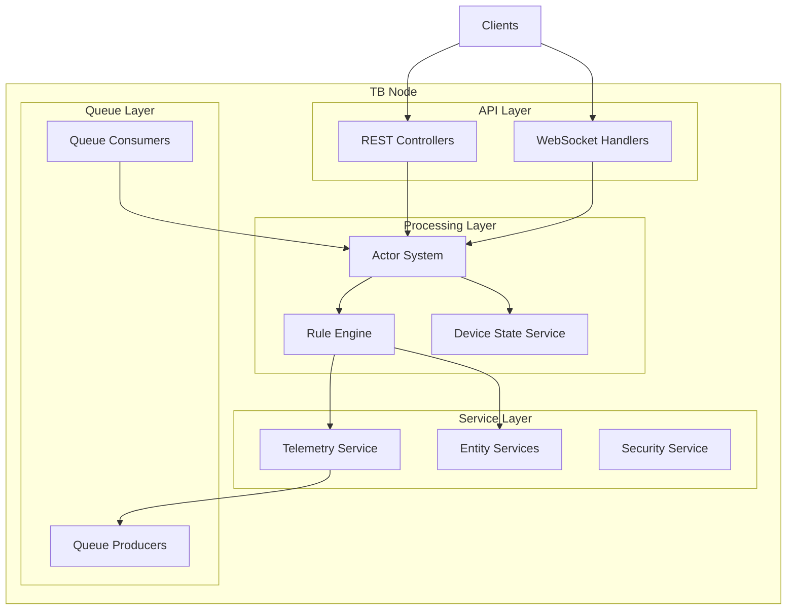

## Key Responsibilities

| Responsibility | Description |
|----------------|-------------|
| Actor System | Manages hierarchical actors for tenants, devices, rule chains |
| Rule Engine | Processes messages through configurable rule chains |
| REST API | Provides 50+ REST controllers for platform management |
| WebSocket | Handles real-time subscriptions and notifications |
| Queue Processing | Consumes and produces messages for distributed operation |
| Session Management | Tracks device sessions and connections |
| Security | Authenticates users and enforces permissions |

## Components

### Actor System

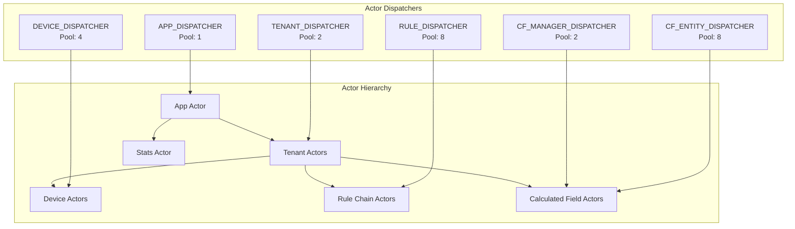

#### Dispatcher Configuration

| Dispatcher | Pool Size | Purpose |
|------------|-----------|---------|
| APP_DISPATCHER | 1 | Main application actor |
| TENANT_DISPATCHER | 2 | Tenant-level processing |
| DEVICE_DISPATCHER | 4 | Device session management |
| RULE_DISPATCHER | 8 | Rule engine execution |
| CF_MANAGER_DISPATCHER | 2 | Calculated field management |
| CF_ENTITY_DISPATCHER | 8 | Calculated field per-entity |

#### Actor Settings

| Setting | Default | Description |
|---------|---------|-------------|
| throughput | 5 | Messages per actor before switching |
| max_actor_init_attempts | 10 | Retries before disabling actor |
| scheduler_pool_size | 1 | Timer/scheduler thread pool |

### Rule Engine

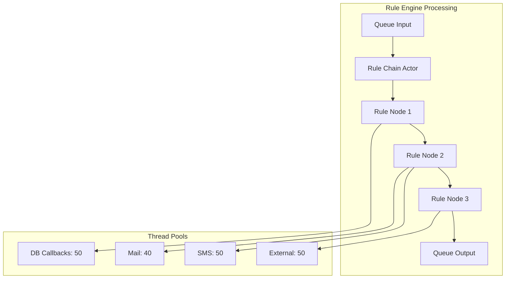

#### Rule Engine Configuration

| Setting | Default | Description |
|---------|---------|-------------|
| db_callback_thread_pool_size | 50 | Database operation threads |
| mail_thread_pool_size | 40 | Email sending threads |
| sms_thread_pool_size | 50 | SMS sending threads |
| external_call_thread_pool_size | 50 | External HTTP call threads |
| transaction_queue_size | 15000 | Max queued transactions |
| transaction_duration | 60s | Transaction timeout |
| error_persist_frequency | 3s | Error logging interval |
| debug_rate_limit | 50000/hour | Debug events per tenant |

### REST API Layer

TB Node hosts 50+ REST controllers covering all platform operations:

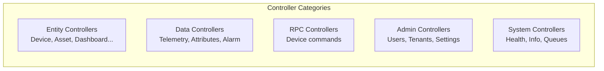

#### Key API Configuration

| Setting | Default | Description |
|---------|---------|-------------|
| rpc_min_timeout | 5s | Minimum RPC timeout |
| rpc_default_timeout | 10s | Default rule engine response timeout |
| max_payload_size | 16-52MB | Request body limit (varies by endpoint) |
| websocket_entity_limit | 10000 | Max entities per subscription |

### Queue Integration

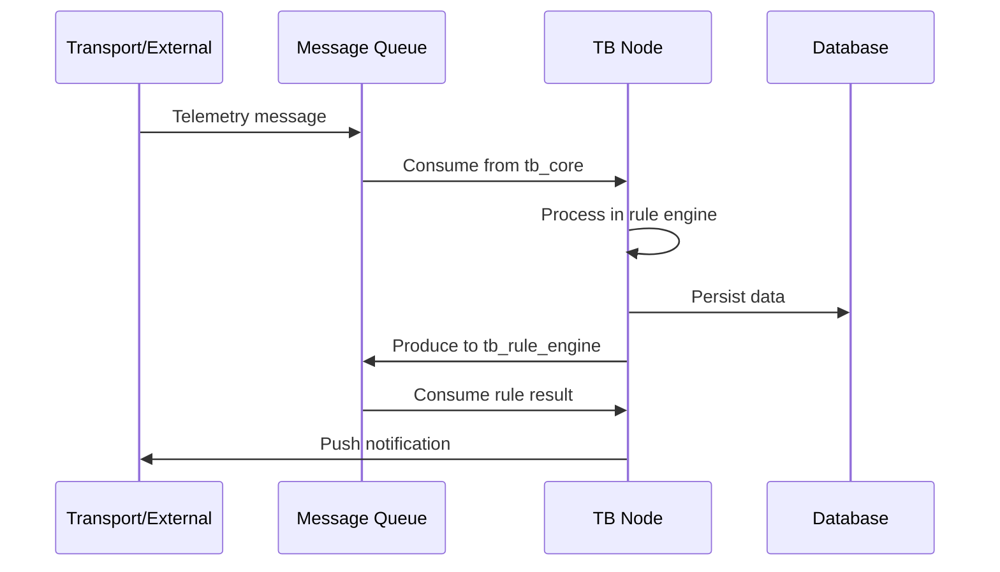

#### Queue Configuration

| Queue | Partitions | Poll Interval | Pack Timeout |
|-------|------------|---------------|--------------|
| Core (tb_core) | 10 | 25ms | 2s |
| Rule Engine | Varies | 25ms | 2s |
| Notifications | 1 | 25ms | 2s |
| Transport API | Varies | 25ms | 2s |

## Startup Sequence

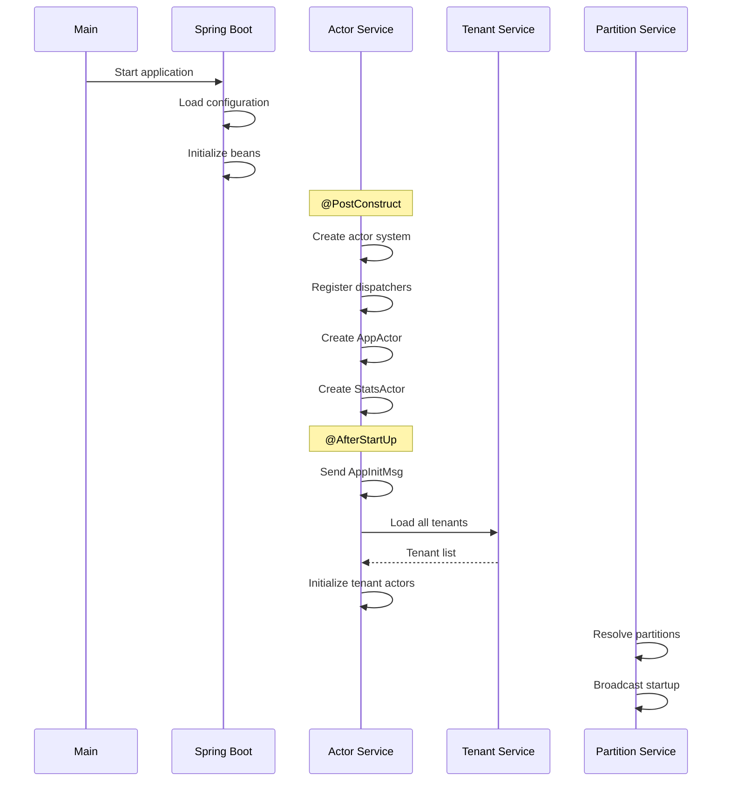

### Initialization Phases

| Phase | Actions |
|-------|---------|
| Configuration | Load thingsboard.yml, set up datasources |
| Bean Creation | Initialize Spring beans, auto-wiring |
| Actor Setup | Create actor system, dispatchers, root actors |
| Application Ready | Fire ApplicationReadyEvent, init tenant actors |
| Partition Discovery | Resolve queue partitions, broadcast to cluster |

## Clustering and Scaling

### Partition-Based Distribution

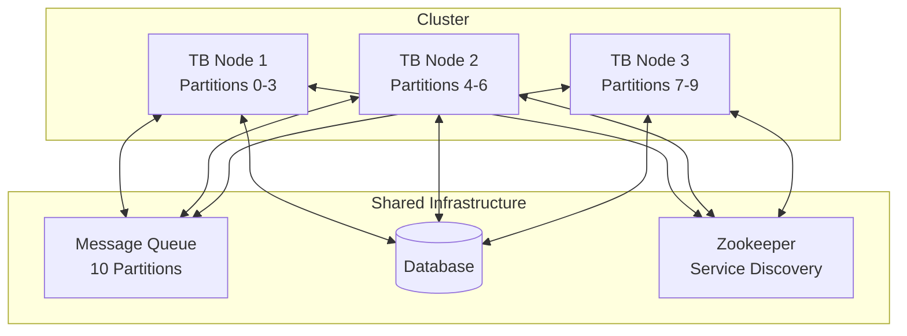

### Cluster Communication

| Service | Method | Purpose |
|---------|--------|---------|
| pushMsgToCore | Queue | Core operations |
| pushMsgToRuleEngine | Queue | Rule processing |
| pushMsgToTransport | Queue | Transport notifications |
| pushMsgToEdge | Queue | Edge synchronization |
| broadcast | Queue | All-node announcements |

### Service Discovery

| Provider | Configuration |
|----------|---------------|
| Zookeeper | URL, connection timeout (3s), session timeout (3s) |
| None | Standalone mode (default) |

### Horizontal Scaling Strategy

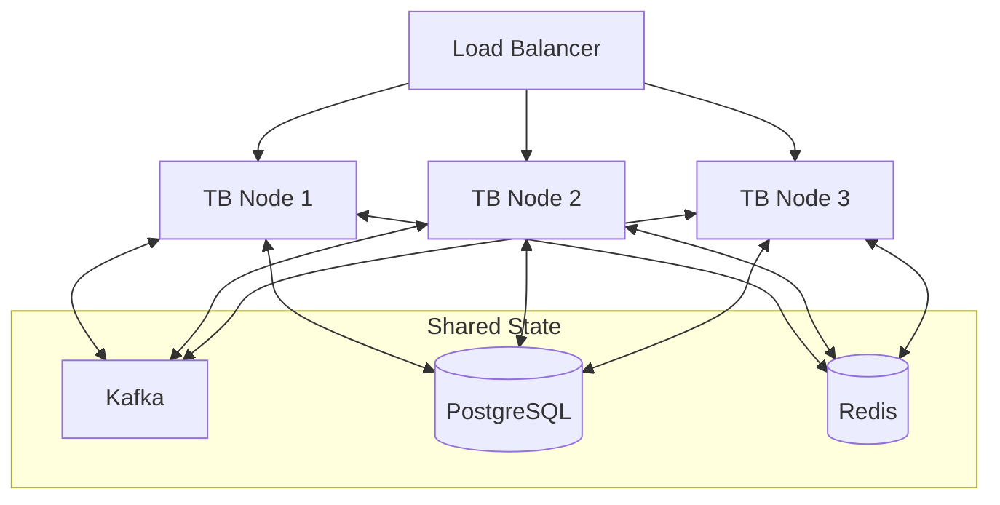

## Configuration Reference

### Core Settings

| Property | Default | Description |
|----------|---------|-------------|
| service.type | monolith | monolith or tb-core |
| server.port | 8080 | HTTP port |
| server.ssl.enabled | false | Enable HTTPS |

### Actor System

| Property | Default | Description |
|----------|---------|-------------|
| actors.system.throughput | 5 | Messages per actor cycle |
| actors.system.scheduler_pool_size | 1 | Scheduler threads |
| actors.system.max_actor_init_attempts | 10 | Init retry limit |
| actors.tenant_dispatcher_pool_size | 2 | Tenant actor threads |
| actors.device_dispatcher_pool_size | 4 | Device actor threads |
| actors.rule_dispatcher_pool_size | 8 | Rule actor threads |

### Queue Settings

| Property | Default | Description |
|----------|---------|-------------|
| queue.type | in-memory | in-memory, kafka, aws-sqs, etc. |
| queue.core.partitions | 10 | Core queue partitions |
| queue.core.poll-interval | 25ms | Consumer poll interval |
| queue.core.pack-processing-timeout | 2s | Batch processing timeout |

### Transport (Monolith Mode)

| Property | Default | Description |
|----------|---------|-------------|
| transport.mqtt.enabled | true | Enable MQTT |
| transport.mqtt.bind_port | 1883 | MQTT port |
| transport.http.enabled | true | Enable HTTP |
| transport.coap.enabled | false | Enable CoAP |
| transport.sessions.inactivity_timeout | 600s | Session timeout |

## Deployment

### Docker Image

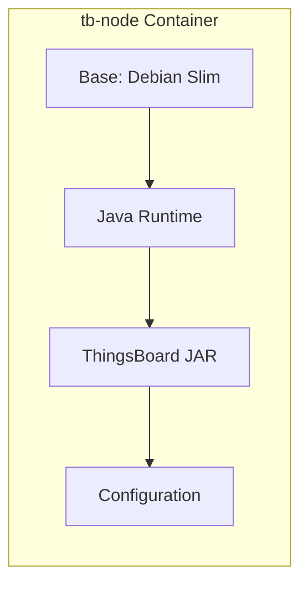

### Directory Structure

| Path | Purpose |
|------|---------|
| /usr/share/thingsboard/bin/ | Application JAR |
| /usr/share/thingsboard/conf/ | Configuration files |
| /var/log/thingsboard/ | Log files |
| /config/ | External config mount point |

### Startup Modes

| Mode | Environment Variable | Action |
|------|----------------------|--------|
| Install | INSTALL_TB=true | Initialize database |
| Upgrade | UPGRADE_TB=true | Run migrations |
| Normal | (default) | Start application |

### Docker Compose Example

```yaml
tb-core1:
  image: thingsboard/tb-node:latest
  environment:
    - TB_SERVICE_ID=tb-core1
    - TB_SERVICE_TYPE=tb-core
    - TB_QUEUE_TYPE=kafka
    - TB_KAFKA_SERVERS=kafka:9092
    - ZOOKEEPER_ENABLED=true
    - ZOOKEEPER_URL=zookeeper:2181
  ports:
    - "8080:8080"
```

## Health and Monitoring

### Health Endpoints

| Endpoint | Purpose |
|----------|---------|
| /api/system/info | Build version, timestamp |
| /api/system/usage | Resource usage stats |
| /actuator/info | Spring Boot actuator info |

### Metrics and Statistics

| Metric Type | Configuration |
|-------------|---------------|
| Queue stats | Print interval: 60s |
| Actor stats | Persistence frequency: configurable |
| Rule engine stats | Persistence: 1 hour |
| Cluster stats | Disabled by default |

### Logging Configuration

| Component | Log File |
|-----------|----------|
| Application | /var/log/thingsboard/thingsboard.log |
| Rule Engine | Rule chain debug mode |
| Audit | Audit log service |

## Resource Requirements

### Memory Footprint

| Component | Typical Usage |
|-----------|---------------|
| Actor System | Varies by tenant count |
| Rule Engine | Transaction queue: 15000 msgs |
| Kafka Buffers | 32MB (configurable) |
| Session Cache | Per-device tracking |
| Partition Cache | 100,000 entries |

### Thread Pool Summary

| Pool | Threads | Purpose |
|------|---------|---------|
| App Dispatcher | 1 | App actor |
| Tenant Dispatcher | 2 | Tenant actors |
| Device Dispatcher | 4 | Device actors |
| Rule Dispatcher | 8 | Rule processing |
| DB Callbacks | 50 | Database operations |
| Mail Service | 40 | Email sending |
| SMS Service | 50 | SMS sending |
| External Calls | 50 | HTTP integrations |
| Transport API | 16+100 | Handler + callbacks |

### Scaling Recommendations

| Scale | Configuration |
|-------|---------------|
| Small (< 1000 devices) | Single node, in-memory queue |
| Medium (1000-10000 devices) | 2-3 nodes, Kafka queue |
| Large (> 10000 devices) | 3+ nodes, Kafka cluster, Redis cache |

## Common Patterns

### Monolith Deployment

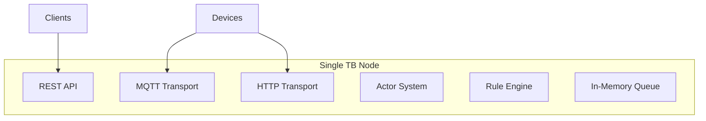

### Microservices Deployment

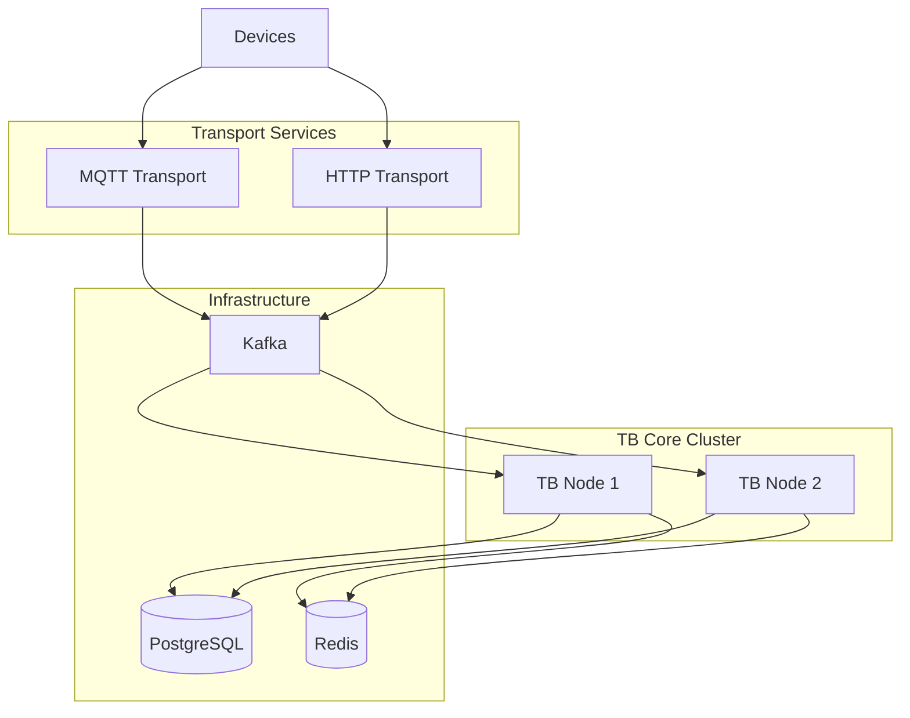

## Best Practices

### For Production Deployments

- Use Kafka for queue (not in-memory)
- Enable Redis for distributed caching
- Configure proper heap sizes based on load
- Set up health monitoring and alerts
- Use rolling deployments for zero downtime

### For Development

- Use monolith mode with in-memory queue
- Enable debug logging for rule engine
- Use smaller thread pool sizes
- Mount configuration externally for iteration

### For High Availability

- Deploy minimum 3 TB Node instances
- Use load balancer with health checks
- Configure partition distribution
- Enable Zookeeper for service discovery
- Monitor queue lag metrics

## Common Pitfalls

### Actor Dispatcher Starvation

**Problem:** Misconfigured dispatcher pool sizes cause actor processing delays.

**Detection:**
- Logs: "Actor mailbox size exceeded" warnings
- High latency for specific operations (device state, rule processing)
- Thread dump shows dispatchers at capacity

**Solution:**

| Dispatcher | Default | High Load | Use Case |
|------------|---------|-----------|----------|
| APP_DISPATCHER | 1 | 1 | Singleton app actor |
| TENANT_DISPATCHER | 2 | 4-8 | Many tenants |
| DEVICE_DISPATCHER | 4 | 8-16 | High connection count |
| RULE_DISPATCHER | 8 | 16-32 | Complex rule chains |
| CF_MANAGER_DISPATCHER | 2 | 4 | Calculated fields enabled |
| CF_ENTITY_DISPATCHER | 8 | 16 | Many calculated fields |

```yaml
actors:
  tenant_dispatcher_pool_size: 8
  device_dispatcher_pool_size: 16
  rule_dispatcher_pool_size: 32
```

### Rule Engine Thread Pool Exhaustion

**Problem:** External node thread pools depleted, blocking rule chain execution.

**Detection:**
```bash
# Check thread pool metrics
jstack <pid> | grep "pool-.*-thread" | wc -l

# Monitor rule engine stats
curl http://localhost:8080/api/rule-engine/stats
```

**Common Bottlenecks:**

| Pool | Default | Symptom | Solution |
|------|---------|---------|----------|
| DB Callbacks | 50 | Slow attribute/telemetry saves | Increase to 100 |
| Mail | 40 | Email delays | Increase to 80 or use async |
| SMS | 50 | SMS delays | Increase or batch |
| External HTTP | 50 | REST node timeouts | Increase to 100, add circuit breaker |

```yaml
actors:
  rule:
    db_callback_thread_pool_size: 100
    mail_thread_pool_size: 80
    external_call_thread_pool_size: 100
```

### Queue Partition Ownership Concentration

**Problem:** Single TB Node owns most partitions, creating hot spot.

**Detection:**
```bash
# Check partition distribution
kafka-consumer-groups.sh --bootstrap-server kafka:9092 \
  --group tb-rule-engine-consumer --describe | \
  awk '{print $7}' | sort | uniq -c
```

**Solution:**
- Ensure partition count > instance count × 2
- Use consistent service IDs (tb-core-1, tb-core-2 vs random UUIDs)
- Monitor CPU/memory per instance for imbalance
- Restart instances if rebalancing doesn't distribute evenly

### Transaction Queue Overflow

**Problem:** Rule engine transaction queue fills up, causing message rejection.

**Detection:**
- Logs: "Transaction queue is full" errors
- Messages dropped with "capacity exceeded"
- Queue lag doesn't decrease despite processing

**Solution:**
```yaml
actors:
  rule:
    transaction_queue_size: 30000  # Increase from 15000
    transaction_duration: 90s  # Extend timeout
```

Balance queue size with memory: Each queued message ~1-10KB. 30K messages ≈ 300MB.

### Actor Init Failures

**Problem:** Actors fail to initialize repeatedly, getting disabled.

**Detection:**
- Logs: "Actor init failed, attempt X of 10"
- Tenant/device actors marked as disabled
- Processing stops for specific entities

**Common Causes:**

| Cause | Detection | Solution |
|-------|-----------|----------|
| Database unreachable | Connection timeout logs | Fix DB connectivity, increase retry |
| Corrupted entity data | Deserialization errors | Fix data, increase init attempts |
| Resource exhaustion | OOM errors | Increase memory, reduce actor count |

```yaml
actors:
  system:
    max_actor_init_attempts: 20  # Increase retry limit
```

### Session Cache Memory Bloat

**Problem:** Device session cache grows unbounded, causing OOM.

**Detection:**
```bash
# Monitor cache size
curl http://localhost:8080/api/cache/stats

# Check heap usage
jmap -heap <pid> | grep -A 5 "Heap Usage"
```

**Solution:**
```yaml
cache:
  type: valkey  # Use external cache
  specs:
    sessions:
      timeToLiveInMinutes: 1440
      maxSize: 100000
```

For 100K devices with 1KB session data = ~100MB cached.

### REST API Rate Limiting Not Configured

**Problem:** Single tenant or user overwhelms API, affecting all users.

**Detection:**
- High request rate from single IP/tenant in logs
- Slow API responses for all users
- CPU usage spikes correlate with specific API calls

**Solution:**
```yaml
security:
  rateLimit:
    enabled: true
    perTenant:
      limit: "1000:60"  # 1000 requests per 60 seconds
    perCustomer:
      limit: "500:60"
```

Configure per-endpoint limits for expensive operations.

### WebSocket Subscription Overload

**Problem:** Too many WebSocket subscriptions per entity cause update storms.

**Detection:**
- Logs: "Too many subscriptions" warnings
- Slow telemetry updates
- High network bandwidth usage

**Solution:**
```yaml
websocket:
  max_subscriptions_per_session: 10
  send_timeout_ms: 5000
```

Best practices:
- Limit dashboard widgets to 10-20 per dashboard
- Use aggregation for high-frequency telemetry
- Implement client-side throttling

### Rule Chain Circular Dependencies

**Problem:** Rule chains call each other, causing infinite loops or deep recursion.

**Detection:**
- Logs: "Rule chain depth exceeded" or stack overflow
- Messages stuck in processing
- CPU usage spikes with no corresponding device activity

**Solution:**
- Implement rule chain depth limit (default: 20)
- Use rule chain versioning to detect cycles
- Monitor `ruleChainExecutionTime` metric for anomalies

```yaml
actors:
  rule:
    max_rule_chain_execution_depth: 20
```

### Partition Lag During Deployment

**Problem:** Rolling deployment causes temporary partition unavailability.

**Detection:**
- Consumer lag spikes during deployment
- Temporary message processing delays
- Partition rebalancing logs

**Solution:**
```yaml
# Use cooperative sticky assignment
queue:
  kafka:
    partition.assignment.strategy: "org.apache.kafka.clients.consumer.CooperativeStickyAssignor"
```

**Deployment Strategy:**
1. Deploy one instance at a time
2. Wait for partition reassignment (30-60s)
3. Verify consumer lag stabilizes
4. Proceed to next instance

## See Also

- [Microservices Overview](./README.md) - Architecture overview
- [JS Executor](./js-executor.md) - JavaScript execution service
- [Transport Services](./transport-services.md) - Device transport services
- [Actor System Overview](../03-actor-system/README.md) - Actor details
- [Rule Engine Overview](../04-rule-engine/README.md) - Rule processing
