# Transport Services

## Overview

Transport Services handle device connectivity for different IoT protocols. ThingsBoard supports five transport protocols—MQTT, HTTP, CoAP, LwM2M, and SNMP—each implemented as an independent microservice that can scale independently. All transports share a common abstraction layer and communicate with the core platform through message queues.

## Architecture

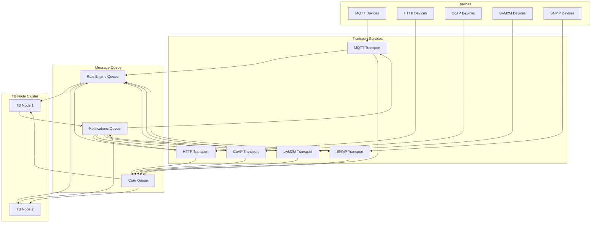

## Common Transport Layer

### TransportService Interface

All transports implement a common interface for device operations:

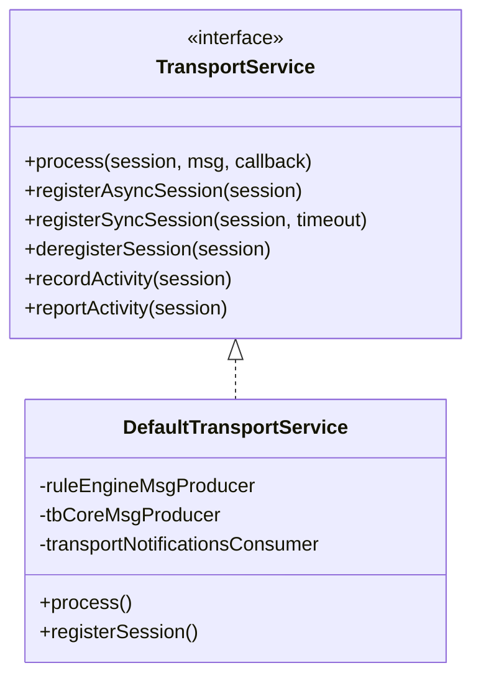

### Core Operations

| Operation | Description |
|-----------|-------------|
| Device Authentication | Validate credentials (token, certificate, basic auth) |
| Session Management | Register/deregister device connections |
| Telemetry Processing | Handle incoming time-series data |
| Attribute Handling | Process attribute requests and updates |
| RPC Handling | Manage device commands and responses |
| Activity Tracking | Report device activity for state management |

### Queue Communication

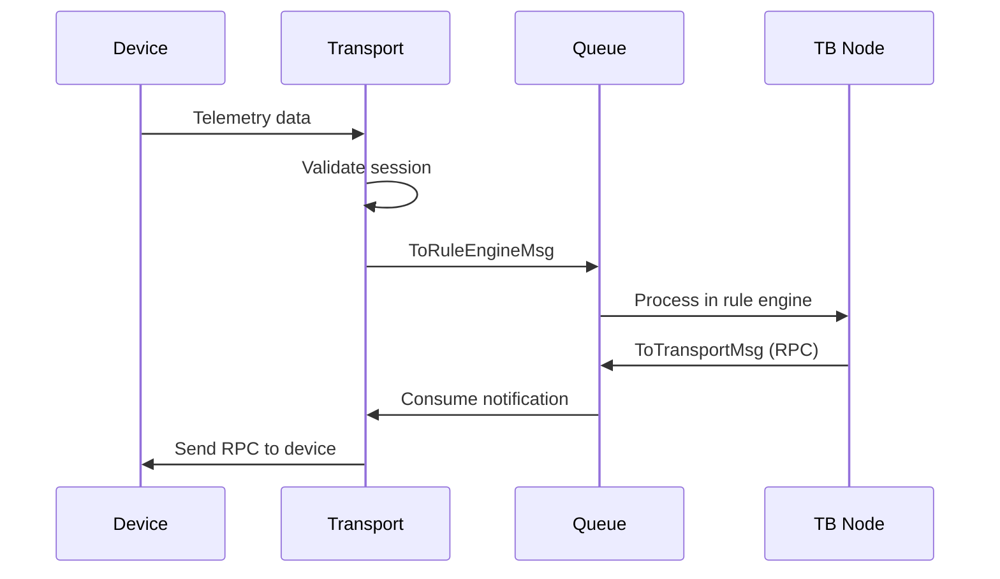

### Message Types

| Direction | Message | Purpose |
|-----------|---------|---------|
| Outbound | ToRuleEngineMsg | Device data to rule engine |
| Outbound | ToCoreMsg | Core operations (state, credentials) |
| Outbound | TransportApiRequestMsg | Sync API calls |
| Inbound | ToTransportMsg | Notifications from core |
| Inbound | TransportApiResponseMsg | API responses |

## MQTT Transport

### Architecture

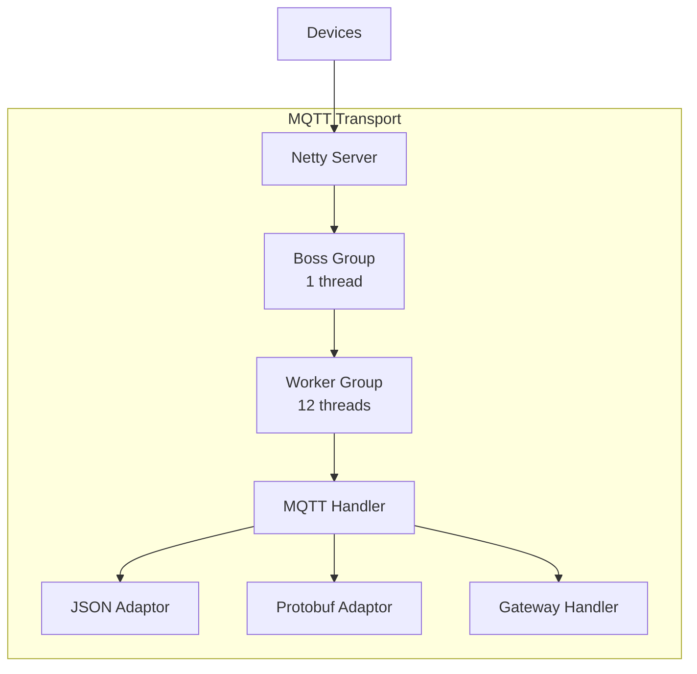

### Configuration

| Property | Default | Description |
|----------|---------|-------------|
| bind_address | 0.0.0.0 | Listen address |
| bind_port | 1883 | MQTT port |
| ssl.enabled | false | Enable TLS |
| ssl.bind_port | 8883 | TLS port |
| netty.boss_group_thread_count | 1 | Boss threads |
| netty.worker_group_thread_count | 12 | Worker threads |
| netty.max_payload_size | 65536 | Max message size (bytes) |
| timeout | 10000 | Connection timeout (ms) |
| msg_queue_size_per_device_limit | 100 | Per-device queue |

### Topics

| Topic Pattern | Purpose |
|---------------|---------|
| v1/devices/me/telemetry | Publish telemetry |
| v1/devices/me/attributes | Publish client attributes |
| v1/devices/me/attributes/request/+ | Request attributes |
| v1/devices/me/rpc/request/+ | Send RPC requests |
| v1/devices/me/rpc/response/+ | RPC responses |

### Gateway Support

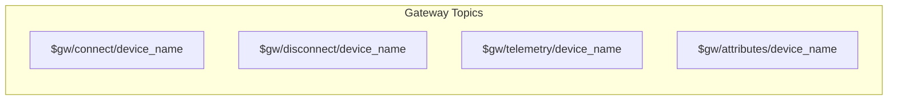

| Feature | Description |
|---------|-------------|
| Device Multiplexing | Single gateway represents multiple devices |
| Auto-Provisioning | Create devices automatically from gateway |
| Sparkplug B | Industrial IoT protocol support |
| Metrics | Track connected devices per gateway |

## HTTP Transport

### Architecture

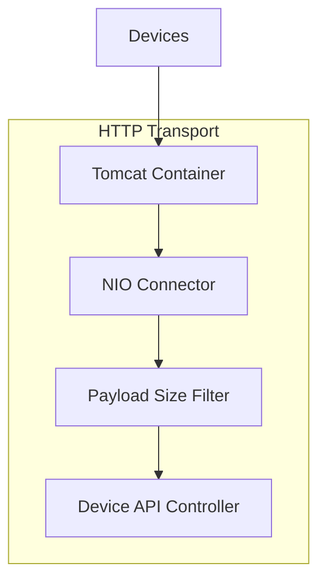

### Configuration

| Property | Default | Description |
|----------|---------|-------------|
| bind_address | 0.0.0.0 | Listen address |
| bind_port | 8081 | HTTP port |
| request_timeout | 60000 | Request timeout (ms) |
| max_request_timeout | 300000 | Maximum timeout (ms) |

### Endpoints

| Endpoint | Method | Purpose |
|----------|--------|---------|
| /api/v1/{token}/telemetry | POST | Submit telemetry |
| /api/v1/{token}/attributes | POST/GET | Attributes |
| /api/v1/{token}/rpc | POST | RPC requests |
| /api/v1/{token}/claim | POST | Device claiming |

### Features

| Feature | Description |
|---------|-------------|
| Async Servlet | Non-blocking I/O |
| Timeout Management | Configurable per-request |
| Payload Validation | Size limit enforcement |
| Long Polling | Wait for RPC responses |

## CoAP Transport

### Architecture

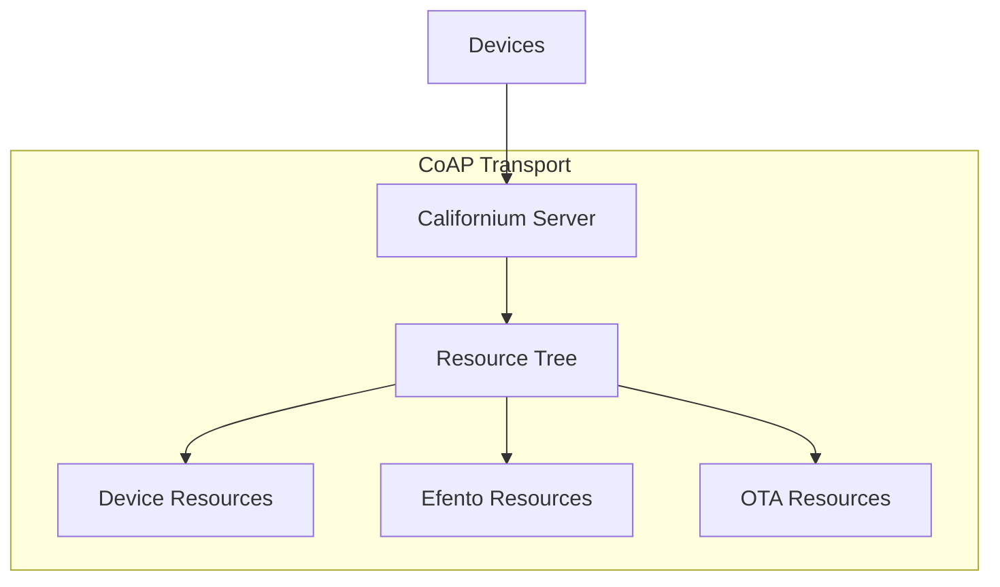

### Configuration

| Property | Default | Description |
|----------|---------|-------------|
| bind_address | 0.0.0.0 | Listen address |
| bind_port | 5685 | CoAP port |
| timeout | 10000 | Request timeout (ms) |
| piggyback_timeout | 500 | Piggyback response timeout |
| psm_activity_timer | 10000 | PSM activity timer (ms) |
| paging_transmission_window | 10000 | Paging window (ms) |

### Resources

| Resource Path | Purpose |
|---------------|---------|
| /api/v1/{token}/telemetry | Telemetry data |
| /api/v1/{token}/attributes | Attributes |
| /api/v1/{token}/rpc | RPC commands |
| /api/efento/* | Efento device support |

### Features

| Feature | Description |
|---------|-------------|
| PSM Support | Power Saving Mode activity tracking |
| Paging Support | Efficient batch transfers |
| DTLS | Datagram TLS security |
| Blockwise | Large payload transfers |

## LwM2M Transport

### Architecture

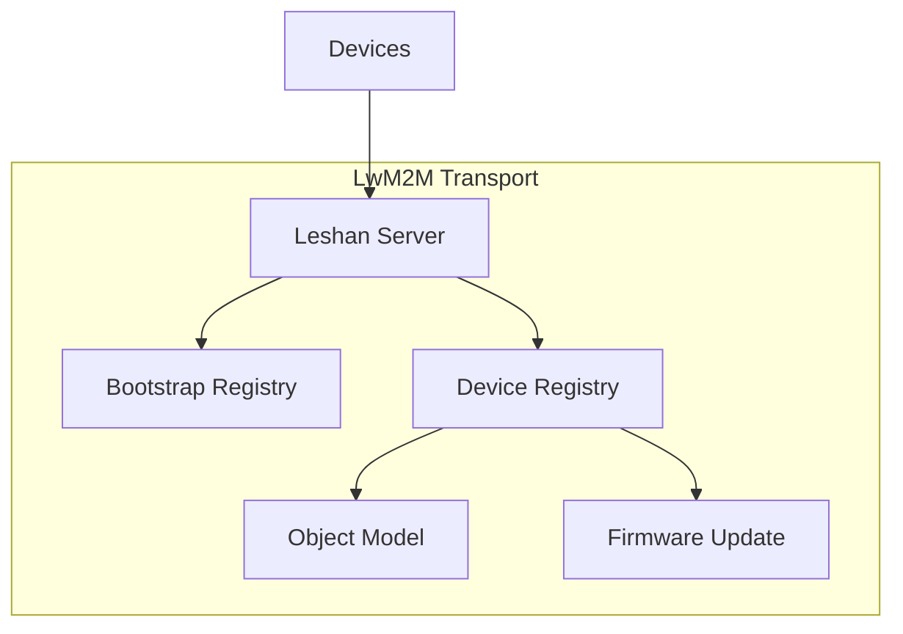

### Configuration

| Property | Default | Description |
|----------|---------|-------------|
| bind_address | 0.0.0.0 | Listen address |
| bind_port | 5685 | LwM2M port |
| secure_bind_port | 5686 | DTLS port |
| timeout | 120000 | Registration timeout |

### Features

| Feature | Description |
|---------|-------------|
| Object Discovery | Automatic object/resource detection |
| Read/Write | Object attribute operations |
| Execute | Trigger object actions |
| Observe | Subscribe to value changes |
| Firmware Update | OTA firmware support |
| Bootstrap | Secure device onboarding |

### Object Model

| Object ID | Name | Purpose |
|-----------|------|---------|
| 0 | Security | Security credentials |
| 1 | Server | Server configuration |
| 3 | Device | Device information |
| 4 | Connectivity | Network statistics |
| 5 | Firmware | Firmware update |

## SNMP Transport

### Architecture

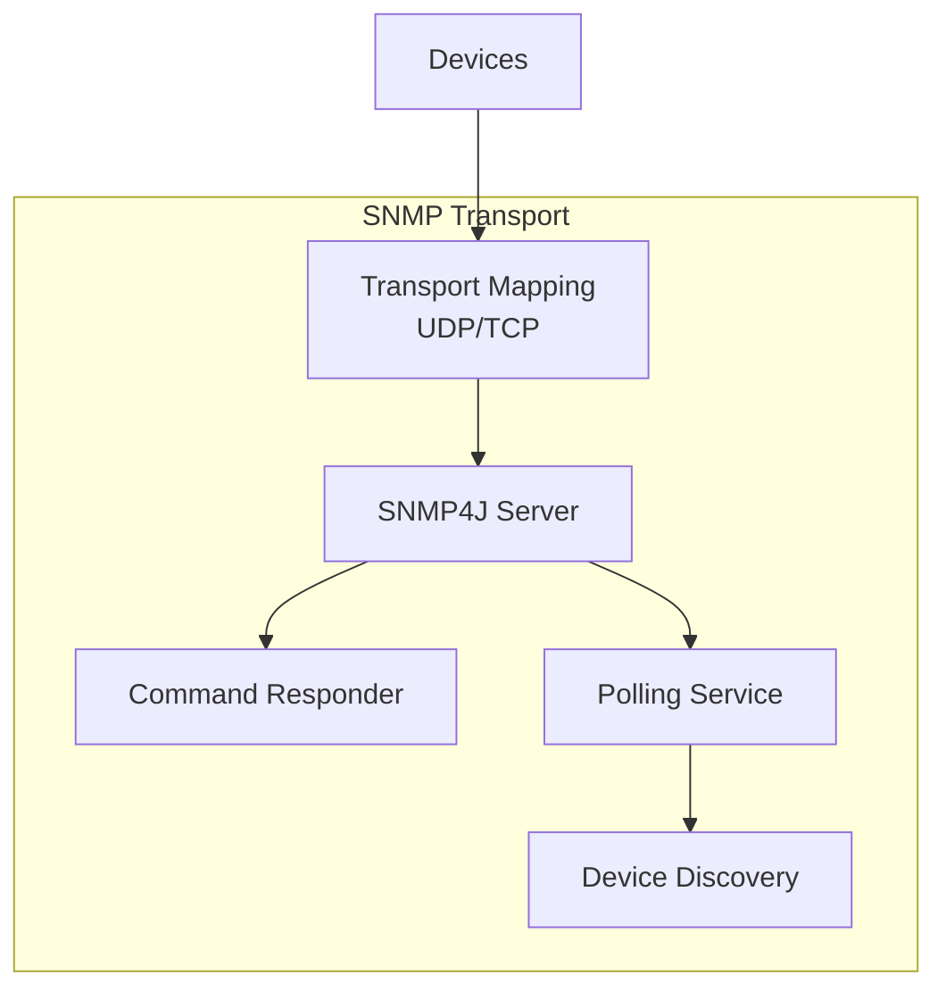

### Configuration

| Property | Default | Description |
|----------|---------|-------------|
| bind_port | 1620 | SNMP port |
| response_timeout | 500 | Response timeout (ms) |
| batch_size | 512 | Devices per batch |
| batch_retries | 3 | Retry attempts |

### Features

| Feature | Description |
|---------|-------------|
| SNMPv1/v2c/v3 | All versions supported |
| USM Security | User-based security model |
| GET/SET | Read/write OIDs |
| Trap Handling | Process device traps |
| Polling | Active device monitoring |
| Batch Discovery | Efficient device scanning |

## Deployment Options

### Monolith Mode

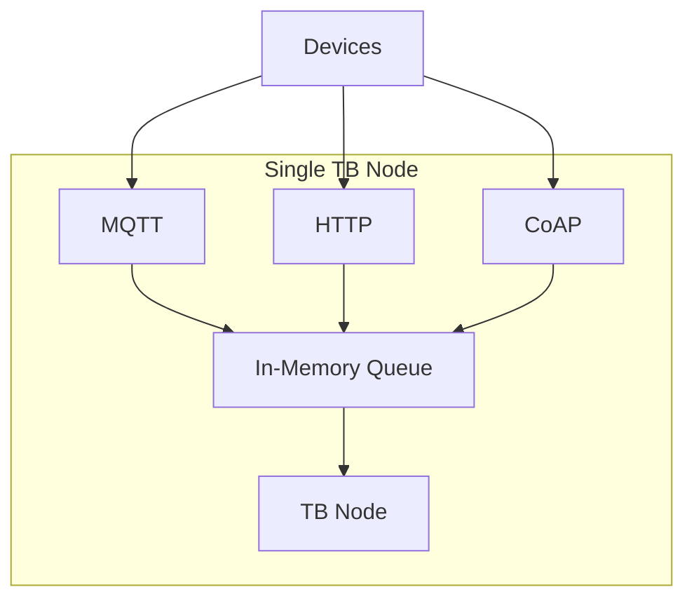

Configuration:
```yaml
service.type: monolith
transport.mqtt.enabled: true
transport.http.enabled: true
transport.coap.enabled: true
transport.lwm2m.enabled: true
```

### Microservices Mode

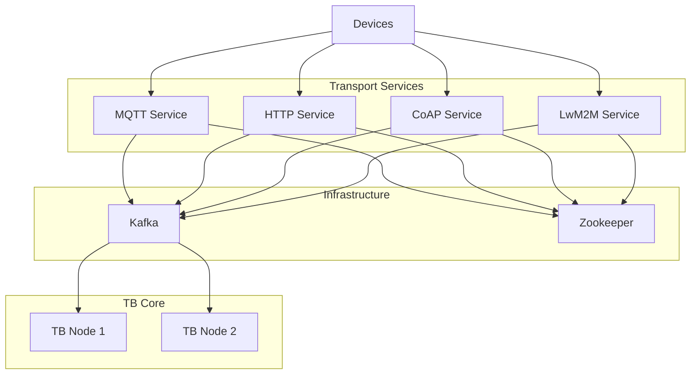

Configuration:
```yaml
service.type: tb-transport
transport.api_enabled: true
```

### Docker Deployment

```yaml
# MQTT Transport
tb-mqtt-transport:
  image: thingsboard/tb-mqtt-transport:latest
  environment:
    - ZOOKEEPER_ENABLED=true
    - ZOOKEEPER_URL=zookeeper:2181
    - TB_KAFKA_SERVERS=kafka:9092
    - MQTT_BIND_ADDRESS=0.0.0.0
    - MQTT_BIND_PORT=1883
  ports:
    - "1883:1883"
    - "8883:8883"

# HTTP Transport
tb-http-transport:
  image: thingsboard/tb-http-transport:latest
  environment:
    - ZOOKEEPER_ENABLED=true
    - ZOOKEEPER_URL=zookeeper:2181
    - TB_KAFKA_SERVERS=kafka:9092
  ports:
    - "8081:8081"
```

## Scaling

### Per-Protocol Scaling

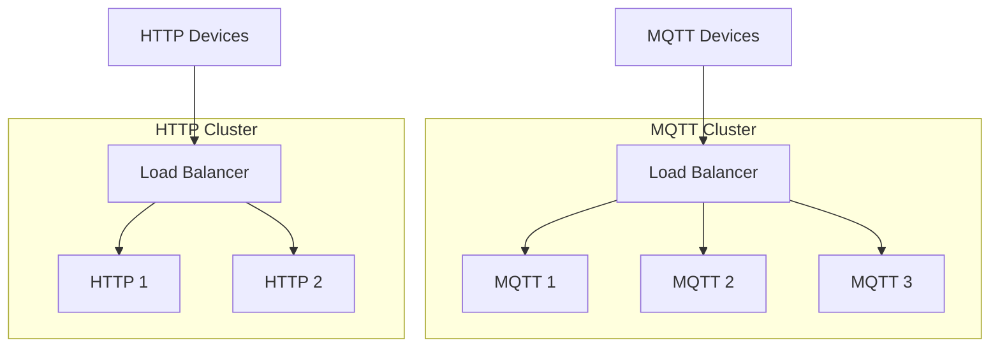

### Scaling Considerations

| Protocol | Key Factor | Scaling Strategy |
|----------|------------|------------------|
| MQTT | Persistent connections | Scale workers, sticky sessions |
| HTTP | Request throughput | Scale instances, no affinity |
| CoAP | UDP datagrams | Scale instances |
| LwM2M | Registration state | Scale with care, consider state |
| SNMP | Polling load | Scale horizontally |

### Resource Requirements

| Protocol | Memory | CPU | Network |
|----------|--------|-----|---------|
| MQTT | High (connections) | Medium | Bidirectional |
| HTTP | Low | Medium | Request-response |
| CoAP | Low | Low | Lightweight |
| LwM2M | Medium | Medium | Registration-based |
| SNMP | Medium | Medium | Polling-based |

## Health Monitoring

### Health Checkers

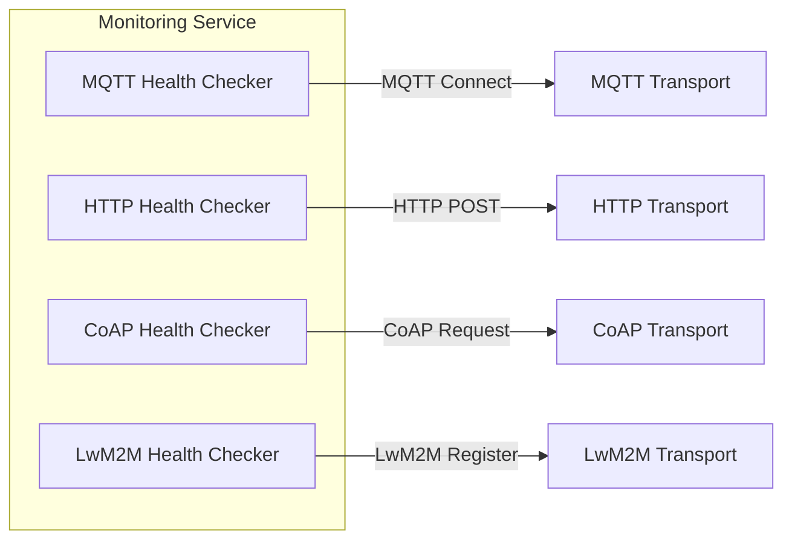

### Health Check Pattern

1. Create test device credentials
2. Connect using protocol client
3. Send test telemetry
4. Verify message receipt via queue
5. Report metrics and status

### Metrics

| Metric | Description |
|--------|-------------|
| Connection count | Active device connections |
| Message rate | Messages per second |
| Queue depth | Pending messages |
| Error rate | Failed operations |
| Latency | Processing time |

## Rate Limiting

### Rate Limit Service

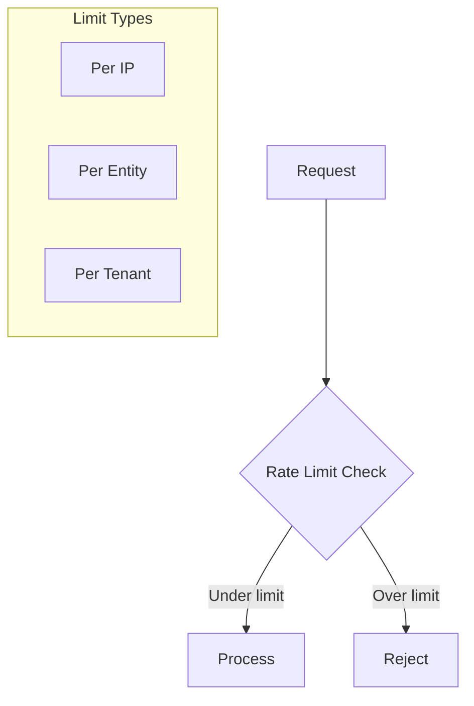

### Configuration

| Limit Type | Scope | Purpose |
|------------|-------|---------|
| Per IP | Source address | Prevent DDoS |
| Per Device | Device ID | Fair resource usage |
| Per Tenant | Tenant ID | Multi-tenant isolation |

## Gateway Functionality

### Gateway Architecture

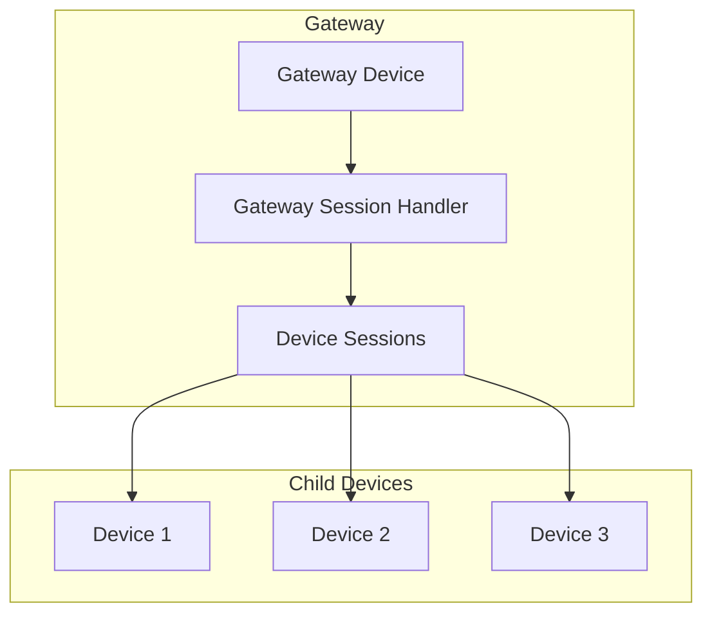

### Gateway Operations

| Operation | Description |
|-----------|-------------|
| Connect | Register gateway and devices |
| Disconnect | Clean up device sessions |
| Telemetry | Forward device telemetry |
| Attributes | Forward device attributes |
| RPC | Route RPC to devices |

### Auto-Provisioning

| Method | Description |
|--------|-------------|
| Gateway Request | Gateway requests device creation |
| Profile Default | Use device profile defaults |
| Custom Handler | Rule chain provisioning |

## Best Practices

### For Protocol Selection

| Use Case | Recommended Protocol |
|----------|---------------------|
| Persistent bidirectional | MQTT |
| Simple REST clients | HTTP |
| Constrained devices | CoAP |
| Resource-constrained IoT | LwM2M |
| Legacy/industrial | SNMP |

### For Production Deployment

- Deploy transports as separate services
- Use dedicated load balancers per protocol
- Enable TLS for all protocols
- Configure appropriate timeouts
- Monitor connection counts and throughput

### For High Availability

- Scale MQTT with sticky sessions
- Use health checks for all services
- Configure queue persistence
- Monitor for connection storms
- Set up alerting on error rates

## See Also

- [Microservices Overview](./README.md) - Architecture overview
- [TB Node](./tb-node.md) - Core application service
- [MQTT Protocol](../05-transport-layer/mqtt.md) - MQTT details
- [HTTP Protocol](../05-transport-layer/http.md) - HTTP details
- [CoAP Protocol](../05-transport-layer/coap.md) - CoAP details
- [LwM2M Protocol](../05-transport-layer/lwm2m.md) - LwM2M details
- [Transport Contract](../05-transport-layer/transport-contract.md) - Common abstraction
