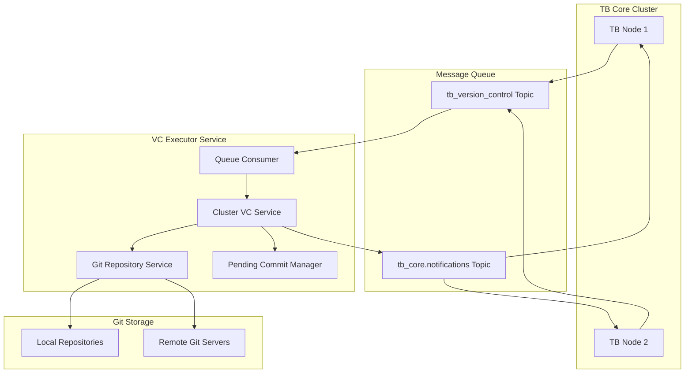
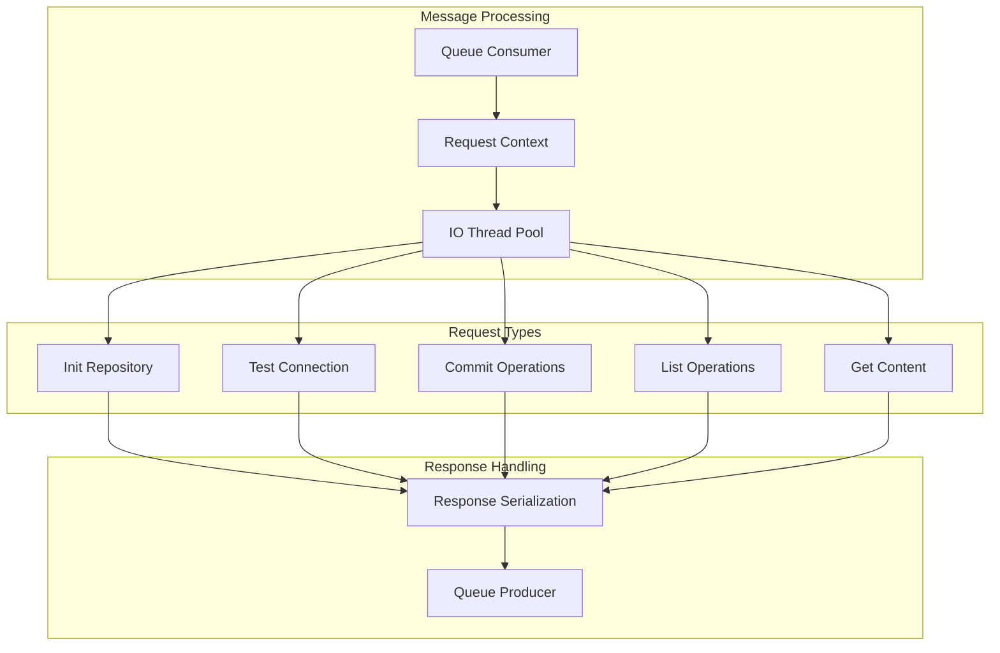
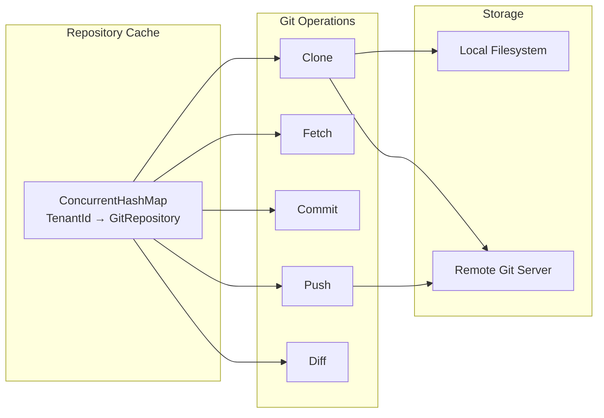
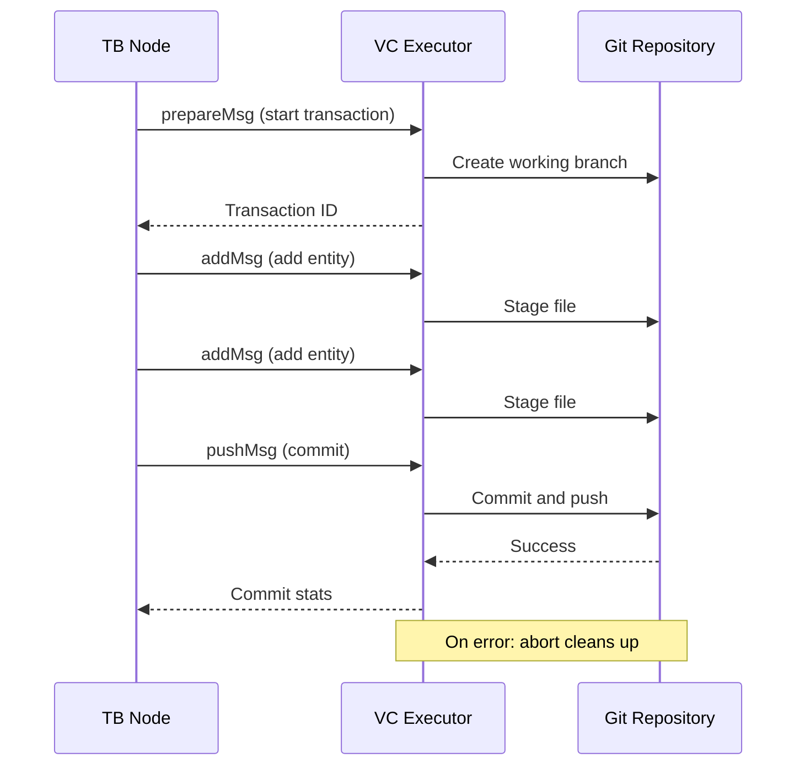
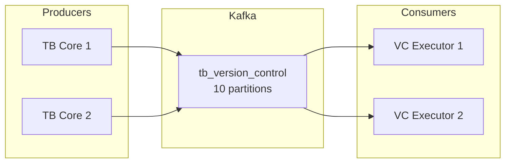
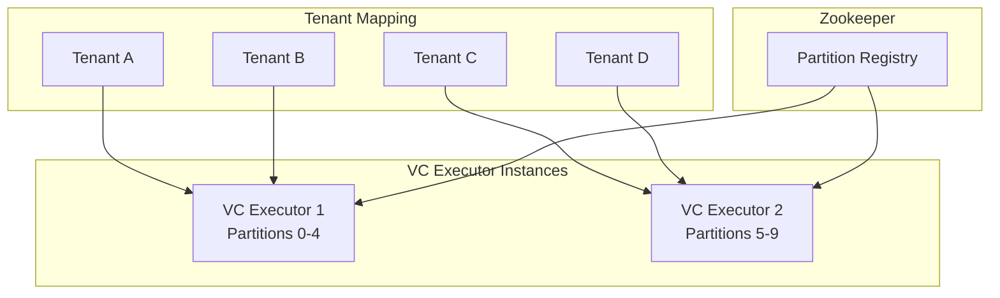
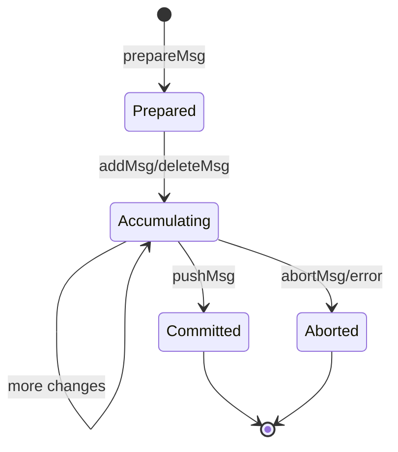

# VC Executor

## Overview

The Version Control Executor (VC Executor) is a microservice responsible for handling Git-based version control operations for the ThingsBoard platform. It manages Git repositories for each tenant, enabling configuration versioning, backup, and synchronization of platform entities such as dashboards, rule chains, and device profiles through standard Git workflows.

## Architecture



## Key Responsibilities

| Responsibility | Description |
|----------------|-------------|
| Git Operations | Clone, fetch, commit, push, and branch management |
| Repository Management | Initialize and manage per-tenant Git repositories |
| Entity Versioning | Store and retrieve entity configurations as JSON files |
| Transaction Handling | Support multi-file commits with rollback capability |
| Partition Handling | Manage tenant-based partitions for horizontal scaling |
| Message Processing | Consume and process version control requests via queues |

## Components

### Cluster Version Control Service

The main orchestrator that processes incoming messages and coordinates Git operations:



#### Thread Pool Architecture

| Pool | Default Size | Purpose |
|------|--------------|---------|
| Consumer Executor | Cached | Process incoming message batches |
| IO Thread Pool | 3 | Execute Git operations per tenant |
| Export Task Pool | 6 | Async export operations |

### Git Repository Service

Wraps JGit library for Git operations with an in-memory repository cache:



## Request Types

### Repository Operations

| Request | Purpose | Response |
|---------|---------|----------|
| initRepositoryRequest | Initialize/clone a repository | Generic success |
| testRepositoryRequest | Validate repository connectivity | Generic success |
| clearRepositoryRequest | Delete repository from cache | Generic success |

### Version Control Operations

| Request | Purpose | Response |
|---------|---------|----------|
| listVersionsRequest | List commits with pagination | Commit list |
| listBranchesRequest | List available branches | Branch list |
| listEntitiesRequest | List entities at specific version | Entity list |
| entityContentRequest | Get single entity content | Entity JSON |
| entitiesContentRequest | Get multiple entities | Multiple entity JSON |
| versionsDiffRequest | Compare two versions | Diff results |

### Commit Operations



| Message | Purpose |
|---------|---------|
| prepareMsg | Start transaction, create working branch |
| addMsg | Stage entity file for commit |
| deleteMsg | Remove entity from repository |
| pushMsg | Commit changes and push to remote |
| abortMsg | Rollback transaction, delete working branch |

## Entity Storage Format

Entities are stored hierarchically by type in the Git repository:

```
repository/
├── device/
│   ├── {device-uuid}.json
│   └── ...
├── asset/
│   ├── {asset-uuid}.json
│   └── ...
├── dashboard/
│   ├── {dashboard-uuid}.json
│   └── ...
├── rule_chain/
│   ├── {rule-chain-uuid}.json
│   └── ...
├── device_profile/
│   ├── {profile-uuid}.json
│   └── ...
└── [other-entity-types]/
```

## Queue Communication

### Topics

| Topic | Purpose | Configuration |
|-------|---------|---------------|
| tb_version_control | Incoming requests | 10 partitions (default) |
| tb_core.notifications | Responses to TB Core | Per-node routing |

### Message Flow



### Message Chunking

Large entity payloads are split into chunks for queue size limits:

| Setting | Default | Description |
|---------|---------|-------------|
| Chunk Size | 250KB | Maximum size per message chunk |
| Chunking | Automatic | Applied to both requests and responses |

## Partition-Based Scaling



### Partition Change Handling

When cluster topology changes:

1. Each instance receives partition change event
2. For each active tenant repository:
   - Check if partition ownership changed
   - If NOT owned: Remove pending commit, clear repository from memory
   - If owned: Keep active
3. Subscribe consumer to new partitions

## Configuration

### Core Settings

| Variable | Default | Description |
|----------|---------|-------------|
| TB_SERVICE_TYPE | tb-vc-executor | Service type identifier |
| TB_SERVICE_ID | auto-generated | Instance identifier |

### Git Settings

| Variable | Default | Description |
|----------|---------|-------------|
| TB_VC_GIT_REPOSITORIES_FOLDER | ${java.io.tmpdir}/repositories | Repository storage path |
| TB_VC_GIT_POOL_SIZE | 3 | IO threads per instance |
| TB_VC_POOL_SIZE | 6 | Export task pool size |

### Queue Settings

| Variable | Default | Description |
|----------|---------|-------------|
| TB_QUEUE_TYPE | kafka | Queue implementation |
| TB_QUEUE_VC_TOPIC | tb_version_control | Request topic name |
| TB_QUEUE_VC_PARTITIONS | 10 | Number of partitions |
| TB_QUEUE_VC_INTERVAL_MS | 25 | Consumer poll interval |
| TB_QUEUE_VC_PACK_PROCESSING_TIMEOUT_MS | 180000 | Batch processing timeout |
| TB_QUEUE_VC_MSG_CHUNK_SIZE | 250000 | Message chunk size (bytes) |

### Zookeeper Settings

| Variable | Default | Description |
|----------|---------|-------------|
| ZOOKEEPER_ENABLED | true | Enable service discovery |
| ZOOKEEPER_URL | localhost:2181 | Zookeeper connection string |
| ZOOKEEPER_CONNECTION_TIMEOUT_MS | 3000 | Connection timeout |
| ZOOKEEPER_SESSION_TIMEOUT_MS | 3000 | Session timeout |

## Deployment

### Docker Deployment

```yaml
tb-vc-executor:
  image: thingsboard/tb-vc-executor:latest
  environment:
    - TB_SERVICE_TYPE=tb-vc-executor
    - TB_QUEUE_TYPE=kafka
    - TB_KAFKA_SERVERS=kafka:9092
    - ZOOKEEPER_ENABLED=true
    - ZOOKEEPER_URL=zookeeper:2181
    - TB_VC_GIT_REPOSITORIES_FOLDER=/data/repositories
  volumes:
    - vc-data:/data/repositories
```

### Directory Structure

| Path | Purpose |
|------|---------|
| /usr/share/thingsboard/bin/ | Application JAR |
| /usr/share/thingsboard/conf/ | Configuration files |
| /data/repositories/ | Git repository storage |
| /var/log/thingsboard/ | Log files |

## Synchronization

### Per-Tenant Locking

- Each tenant has a dedicated `ReentrantLock`
- Operations for same tenant are processed sequentially
- Prevents concurrent modification of same repository

### Transaction Lifecycle



| State | Description |
|-------|-------------|
| Prepared | Working branch created, transaction ID assigned |
| Accumulating | Files being staged for commit |
| Committed | Changes pushed to target branch |
| Aborted | Working branch deleted, no changes persisted |

## Error Handling

### Exception Types

| Error | Handling |
|-------|----------|
| LargeObjectException | Converted to "Version is too big" |
| GitAPIException | Wrapped and returned as error response |
| TimeoutException | Logged, consumer still commits offset |
| Stale Transaction | Silently ignored (idempotency) |

### Recovery

- Transactions identified by UUID for idempotency
- Stale/duplicate transactions ignored
- Per-tenant lock prevents concurrent modifications
- Repository cleared on partition loss

## Scaling Considerations

### Horizontal Scaling

| Factor | Recommendation |
|--------|----------------|
| Tenants | Scale instances based on tenant count |
| Repository Size | Consider storage I/O capacity |
| Commit Volume | Add instances for high-throughput |
| Network | Git server bandwidth for remote repos |

### Resource Requirements

| Resource | Typical Usage |
|----------|---------------|
| Memory | Varies by cached repository count |
| CPU | Low (Git I/O bound) |
| Disk | Depends on repository sizes |
| Network | Remote Git operations |

## Best Practices

### For Operations

- Use dedicated storage volume for repositories
- Monitor queue lag for processing delays
- Set appropriate chunk sizes for large entities
- Configure adequate IO thread pool for tenant count

### For Production

- Deploy minimum 2 instances for high availability
- Use remote Git servers for durability
- Enable Zookeeper for proper partition management
- Monitor Git server performance

### For Security

- Secure Git credentials in environment variables
- Use SSH keys for remote repository access
- Restrict repository folder permissions
- Enable HTTPS for remote Git operations

## See Also

- [Microservices Overview](./README.md) - Architecture overview
- [TB Node](./tb-node.md) - Core application service
- [Message Queue Architecture](../08-message-queue/queue-architecture.md) - Queue system
- [Multi-Tenancy](../01-architecture/multi-tenancy.md) - Tenant isolation
