# Web UI Service

## Overview

The Web UI Service is a microservice that serves the ThingsBoard Angular frontend application. It consists of two components: the compiled Angular application (`ui-ngx`) and an Express.js server (`web-ui`) that serves static files and optionally proxies API requests. This separation allows independent scaling and deployment of the UI layer.

## Architecture

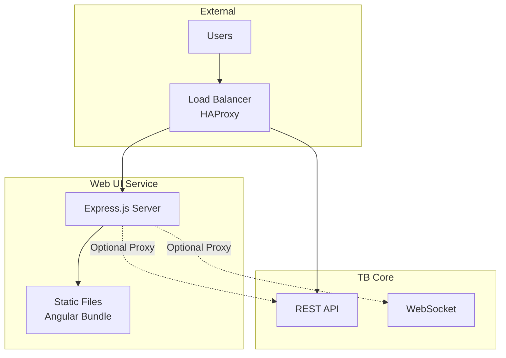

## Key Responsibilities

| Responsibility | Description |
|----------------|-------------|
| Static File Serving | Serve compiled Angular application |
| SPA Routing | History API fallback for Angular Router |
| Compression | Gzip compression for responses |
| API Proxying | Optional proxy to TB Core (development) |
| WebSocket Upgrade | Handle WebSocket connections |
| Health Checks | Respond to load balancer health probes |

## Components

### Angular Frontend (ui-ngx)

The compiled Angular application:

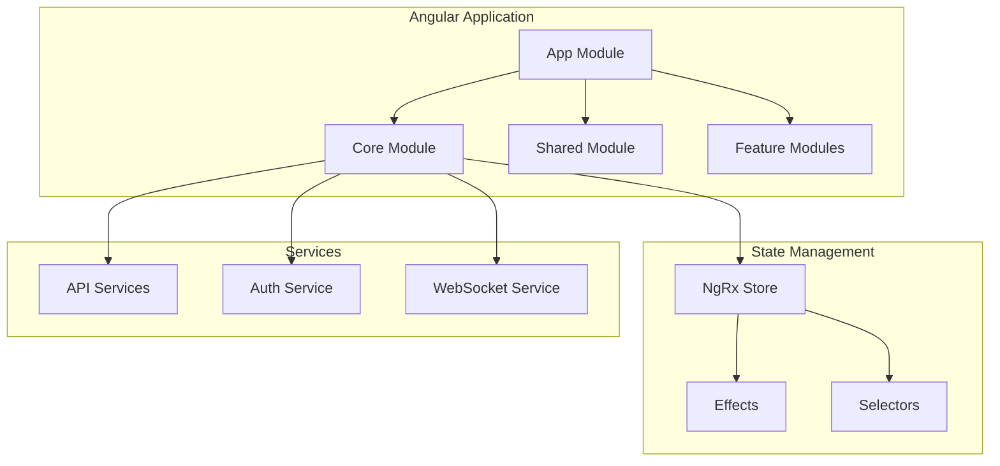

#### Technology Stack

| Component | Version | Purpose |
|-----------|---------|---------|
| Angular | 18.2.13 | Frontend framework |
| TypeScript | 5.5.4 | Programming language |
| Angular Material | 18.2.14 | UI components |
| NgRx | 18.1.1 | State management |
| RxJS | 7.8.1 | Reactive programming |

### Express.js Server (web-ui)

The HTTP server that serves the Angular application:

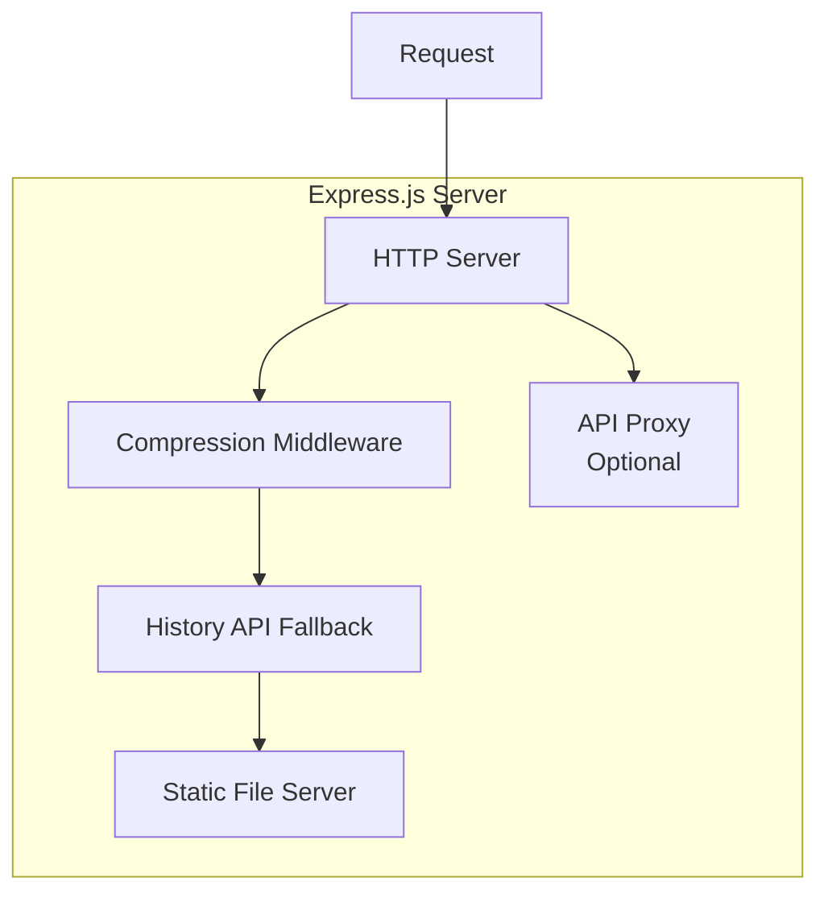

## Request Flow

### Static File Serving

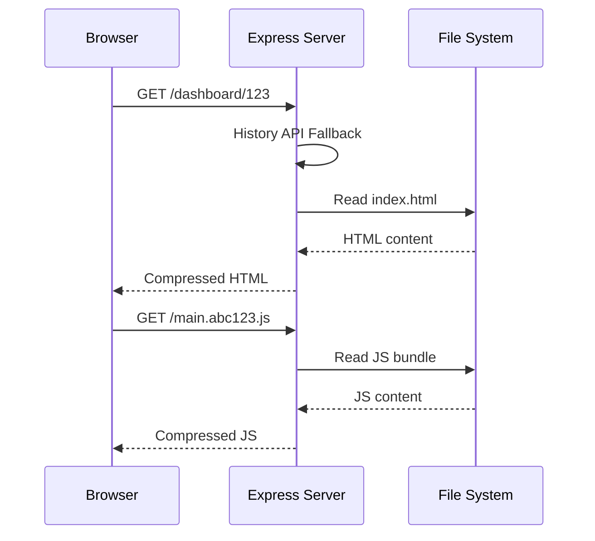

### API Proxying (Optional)

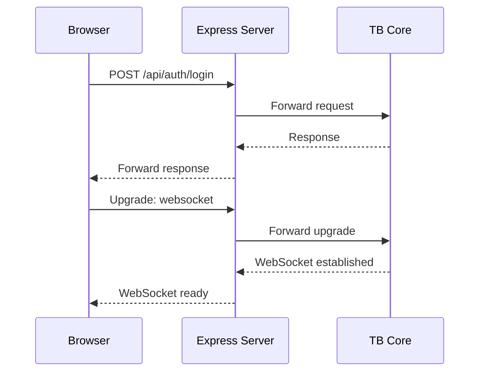

## Configuration

### Server Settings

| Variable | Default | Description |
|----------|---------|-------------|
| HTTP_BIND_ADDRESS | 0.0.0.0 | Server bind address |
| HTTP_BIND_PORT | 8080 | Server port |
| NODE_ENV | production | Node.js environment |
| DOCKER_MODE | true | Enable console logging |

### Proxy Settings

| Variable | Default | Description |
|----------|---------|-------------|
| TB_ENABLE_PROXY | false | Enable API proxying |
| TB_HOST | localhost | TB Core hostname |
| TB_PORT | 8080 | TB Core port |

### Logging Settings

| Variable | Default | Description |
|----------|---------|-------------|
| LOGGER_LEVEL | info | Log level |
| LOG_FOLDER | logs | Log directory |
| LOGGER_FILENAME | tb-web-ui-%DATE%.log | Log filename pattern |

## Deployment Modes

### Production Mode (Recommended)

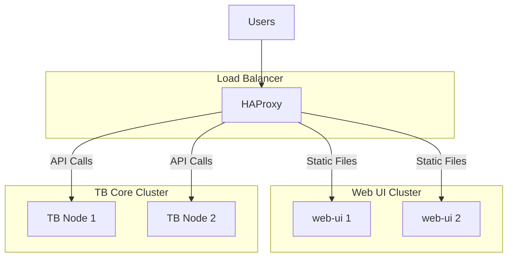

In production mode:
- HAProxy routes `/api/*` directly to TB Core
- HAProxy routes other requests to Web UI
- Web UI serves only static files
- `TB_ENABLE_PROXY=false`

### Development Mode

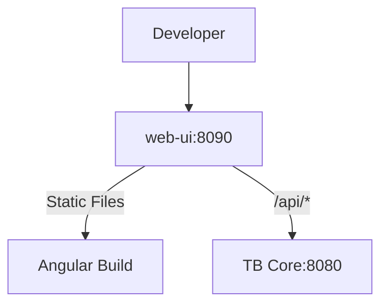

In development mode:
- Web UI proxies API calls to TB Core
- `TB_ENABLE_PROXY=true`
- Single entry point for all requests

## Docker Deployment

### Docker Compose

```yaml
tb-web-ui1:
  image: thingsboard/tb-web-ui:latest
  restart: always
  environment:
    - HTTP_BIND_ADDRESS=0.0.0.0
    - HTTP_BIND_PORT=8080
    - TB_ENABLE_PROXY=false
    - LOGGER_LEVEL=info
  ports:
    - "8080"

tb-web-ui2:
  image: thingsboard/tb-web-ui:latest
  restart: always
  environment:
    - HTTP_BIND_ADDRESS=0.0.0.0
    - HTTP_BIND_PORT=8080
    - TB_ENABLE_PROXY=false
  ports:
    - "8080"
```

### HAProxy Configuration

```
backend tb-web-backend
  timeout queue 60s
  balance leastconn
  option tcp-check
  option log-health-checks
  server tbWeb1 tb-web-ui1:8080 check inter 5s maxconn 50
  server tbWeb2 tb-web-ui2:8080 check inter 5s maxconn 50
```

## Build Process

### Angular Build

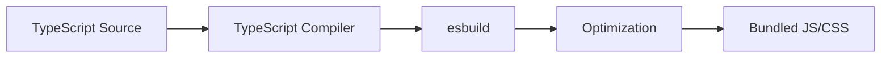

| Setting | Value |
|---------|-------|
| Output Hashing | All files |
| Source Maps | Disabled in production |
| Bundle Size Limit | 12MB error, 9MB warning |
| Optimization | Scripts and styles |

### Server Build

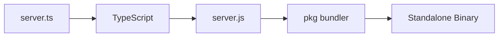

Output artifacts:
- `thingsboard-web-ui-linux` - Linux x64 binary
- `thingsboard-web-ui-win.exe` - Windows x64 binary
- Docker image with Node.js runtime

## Frontend Architecture

### Module Structure

```
ui-ngx/src/app/
├── core/                    # Singleton services
│   ├── api/                 # REST API services
│   ├── http/                # HTTP utilities
│   ├── interceptors/        # HTTP interceptors
│   ├── services/            # Core services
│   └── auth/                # Authentication
├── modules/                 # Feature modules
│   ├── home/                # Dashboard home
│   ├── device/              # Device management
│   ├── asset/               # Asset management
│   └── ...                  # Other features
└── shared/                  # Shared components
    ├── components/          # Reusable UI components
    ├── directives/          # Custom directives
    └── pipes/               # Custom pipes
```

### Key Dependencies

| Category | Libraries |
|----------|-----------|
| Charting | ECharts, Flot, Canvas Gauges |
| Maps | Leaflet, MapLibre GL |
| Editors | TinyMCE, ACE Editor |
| Layout | Angular Gridster 2 |
| Flow Charts | ngx-flowchart |
| File Handling | FlowJS, JSZip |

### API Communication

All API calls use relative URLs:

| Endpoint | Purpose |
|----------|---------|
| /api/* | REST API endpoints |
| /api/ws | WebSocket for real-time updates |
| /static/widgets/* | Dynamic widget resources |
| /static/rulenode/* | Rule node UI components |
| /oauth2/* | OAuth2 authentication |

## Security

### Headers (via HAProxy)

| Header | Purpose |
|--------|---------|
| X-Forwarded-Proto | Original protocol (http/https) |
| X-Forwarded-Port | Original port |
| X-Forwarded-For | Client IP address |

### Authentication Flow

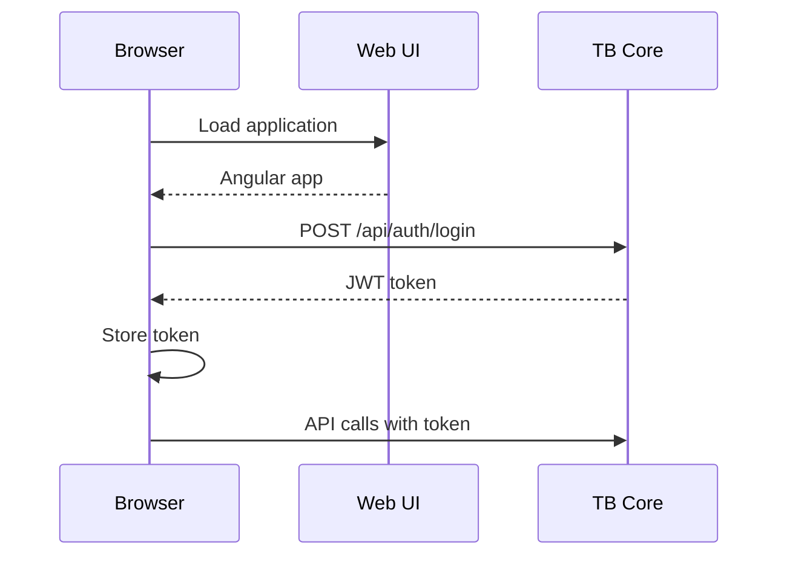

### SSL/TLS

- HAProxy handles SSL termination
- Web UI runs HTTP internally
- WebSocket upgrades work through HAProxy

## Scaling

### Horizontal Scaling

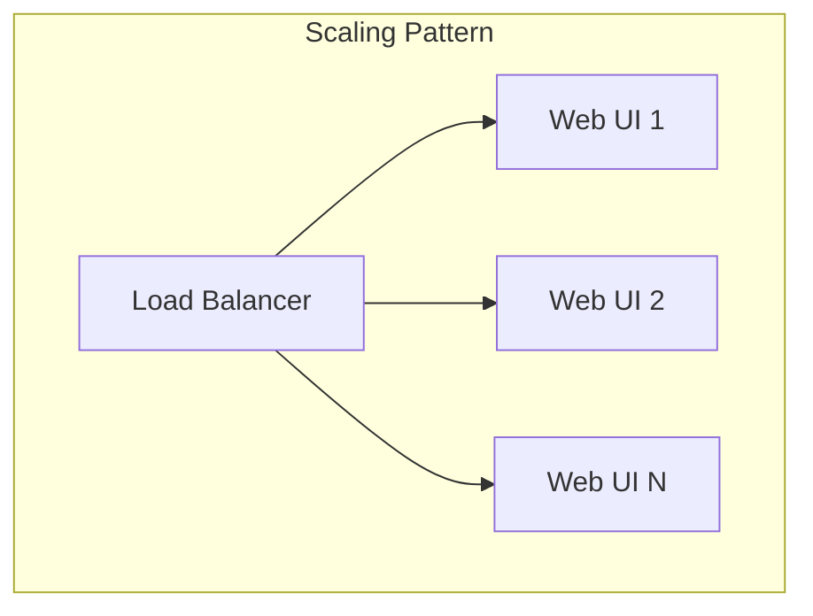

### Scaling Considerations

| Factor | Impact |
|--------|--------|
| Concurrent Users | Add Web UI instances |
| Static Asset CDN | Offload to CDN for global users |
| Memory | ~100-200MB per instance |
| CPU | Minimal (static file serving) |

### Load Balancing

| Algorithm | Use Case |
|-----------|----------|
| leastconn | Default, best for varying request sizes |
| roundrobin | Even distribution |

## Performance

### Bundle Sizes

| File | Typical Size |
|------|--------------|
| main.js | 4-9MB (uncompressed) |
| styles.css | 500KB-1MB |
| Total compressed | ~2-3MB |

### Caching

| Resource | Cache Strategy |
|----------|----------------|
| index.html | No cache (always fresh) |
| *.js | Long cache (hash in filename) |
| *.css | Long cache (hash in filename) |
| assets/* | Long cache |

### Compression

- Gzip enabled for all text responses
- Significant bandwidth reduction (~70%)

## Health Checks

### HTTP Health Check

| Check | Endpoint | Expected |
|-------|----------|----------|
| TCP | Port connectivity | Connection success |
| HTTP | Any path | 200 OK |

### HAProxy Health Check

```
option tcp-check
server tbWeb1 tb-web-ui1:8080 check inter 5s
```

## Directory Structure

```
web-ui/
├── package.json           # Node.js dependencies
├── server.ts              # Express.js server
├── tsconfig.json          # TypeScript config
├── config/
│   ├── default.yml        # Default configuration
│   └── custom-environment-variables.yml
├── docker/
│   ├── Dockerfile
│   └── start-web-ui.sh
└── web/
    └── public/            # Compiled Angular files
        ├── index.html
        ├── main.*.js
        ├── polyfills.*.js
        ├── styles.*.css
        └── assets/
```

## Best Practices

### For Operations

- Deploy minimum 2 instances behind load balancer
- Use HAProxy for API routing (not built-in proxy)
- Monitor response times and error rates
- Enable access logging for troubleshooting

### For Production

- Disable API proxy (`TB_ENABLE_PROXY=false`)
- Configure appropriate logging level
- Set up proper SSL termination at load balancer
- Use CDN for global deployments

### For Development

- Enable API proxy for single-port development
- Use Angular dev server for hot reload
- Configure proper CORS in TB Core

## See Also

- [Microservices Overview](./README.md) - Architecture overview
- [TB Node](./tb-node.md) - Core application service
- [Load Balancing](./README.md#load-balancing) - HAProxy configuration
- [Dashboard](../02-core-concepts/entities/dashboard.md) - Dashboard concepts
