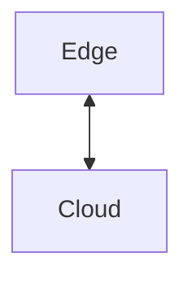

# CLAUDE.md - Edge Computing Section

This file provides guidance for working with the Edge Computing documentation section.

## Section Purpose

This section documents ThingsBoard Edge:

- **Edge Architecture**: Local processing, offline operation, data flow
- **Cloud Synchronization**: gRPC protocol, bidirectional sync
- **Rule Chain Templates**: Server-defined templates for edge deployment

## File Structure

```
12-edge/
├── README.md                    # Edge overview and deployment scenarios
├── edge-architecture.md         # Components, data flow, topology
├── cloud-synchronization.md     # gRPC protocol, event types, sync
└── rule-chain-templates.md      # Edge-specific rule chains
```

## Writing Guidelines

### Audience

IoT architects and DevOps engineers deploying edge computing solutions. Assume familiarity with IoT concepts but not necessarily with edge computing patterns.

### Content Pattern

Edge documents should include:

1. **Overview** - What the component/concept does
2. **Architecture** - How it fits in edge/cloud topology
3. **Configuration** - Settings for edge deployment
4. **Synchronization** - Cloud-edge data flow
5. **Offline Behavior** - Operation during disconnection
6. **Pitfalls** - Common deployment issues
7. **See Also** - Related documentation

### Edge Documentation Pattern

For edge concepts:

```markdown
## Concept Name

**Purpose**: What it does in edge context

### Architecture



### Configuration

| Variable | Description | Default |
|----------|-------------|---------|
| ... | ... | ... |

### Synchronization Behavior

| Event | Direction | Timing |
|-------|-----------|--------|
| ... | ... | ... |

### Offline Operation

| Scenario | Behavior |
|----------|----------|
| ... | ... |

### Common Pitfalls

| Pitfall | Impact | Solution |
|---------|--------|----------|
| ... | ... | ... |

```

### Terminology

- Use "Edge" for the local ThingsBoard instance
- Use "Cloud" for the central ThingsBoard server
- Use "Sync" for bidirectional data exchange
- Use "Offline mode" for disconnected operation
- Use "Event queue" for pending sync items

### Diagrams

Use Mermaid diagrams to show:

- Edge-cloud topology (`graph TB`)
- Sync flow (`sequenceDiagram`)
- Offline behavior (`graph LR`)
- Data flow (`graph TB`)

### Technology-Agnostic Rule

Focus on edge behavior, not implementation:

**DO**: "Edge instances synchronize with the cloud via gRPC when connectivity is restored"
**DON'T**: "CloudManagerService uses GrpcChannelManager to establish ManagedChannel"

**DO**: "Events are queued locally during network outages and sent when connection resumes"
**DON'T**: "CloudEventStorageService persists TbProtoQueueMsg to RocksDB"

**DO**: "Rule chain templates are pushed from cloud to edge during synchronization"
**DON'T**: "EdgeGrpcService calls RuleChainEdgeProcessor.processRuleChainMessage()"

## Reference Sources

When updating this section, cross-reference:

- `~/work/viaanix/thingsboard.github.io-master/docs/edge/` - Official Edge documentation
- `~/work/viaanix/thingsboard-master/application/src/main/java/org/thingsboard/server/service/edge/` - Edge services

## Related Sections

- `01-architecture/system-overview.md` - Platform architecture
- `04-rule-engine/` - Rule chain processing
- `05-transport-layer/` - Device protocols
- `13-iot-gateway/` - Gateway integration

## Common Tasks

### Documenting Sync Behavior

1. Document sync direction (edge→cloud, cloud→edge)
2. Show event types and their triggers
3. Explain conflict resolution
4. Document sync priorities

### Documenting Offline Mode

1. Document which operations work offline
2. Show data persistence during outage
3. Explain queue behavior
4. Document recovery procedures

### Cross-Reference Validation

Ensure all `See Also` links point to valid files:

```bash
grep -r "\.\.\/" docs/12-edge/ | grep -o '\.\./[^)]*' | sort -u
```

## Recommended Skills

Use these skills when working on this section:

| Skill | Command | Use For |
|-------|---------|---------|
| **iot-engineer** | `/iot-engineer` | IoT architecture, edge computing patterns |
| **embedded-systems** | `/embedded-systems` | Resource-constrained deployment |
| **technical-writer** | `/technical-writer` | Clear edge documentation |

### When to Use Each Skill

- **Documenting edge architecture**: Use `/iot-engineer` for topology
- **Explaining resource constraints**: Use `/embedded-systems` for hardware guidance
- **Writing deployment guides**: Use `/technical-writer` for clarity

## Key Edge Concepts

When documenting edge, emphasize:

| Concept | Key Points |
|---------|------------|
| **Local Processing** | Rule chains execute without cloud round-trip |
| **Offline Operation** | Continue processing during network outages |
| **Event Queue** | Pending sync items stored locally |
| **Bidirectional Sync** | Data flows both edge→cloud and cloud→edge |
| **Rule Chain Templates** | Server-defined templates deployed to edge |
| **Traffic Reduction** | Filter and aggregate before cloud sync |

## Common Pitfalls to Document

Ensure documentation covers these edge issues:

| Pitfall | Description |
|---------|-------------|
| Sync queue overflow | Too much data accumulated during long outage |
| Clock drift | Time synchronization issues between edge and cloud |
| Resource exhaustion | Edge hardware limitations during peak load |
| Template version mismatch | Rule chain incompatibility between versions |
| Network instability | Frequent reconnection causing sync overhead |
| Storage limitations | Local database growth during extended offline |

## Synchronization Documentation

For sync docs, ensure coverage of:

| Aspect | Content |
|--------|---------|
| **Event Types** | Telemetry, attributes, alarms, relations |
| **Direction** | Edge→cloud vs cloud→edge |
| **Priority** | Sync order during recovery |
| **Conflict Resolution** | How conflicts are handled |

## Hardware Documentation

For hardware docs, ensure coverage of:

| Deployment | RAM | CPU | Storage |
|------------|-----|-----|---------|
| Minimum | 256 MB | 1 core | 1 GB |
| Recommended | 1 GB | 2 cores | 10 GB |
| Production | 2+ GB | 4 cores | 50+ GB |

## Helpful Paths

- local-skillz: `~/Projects/barf/repo/SKILLS/README.md`
