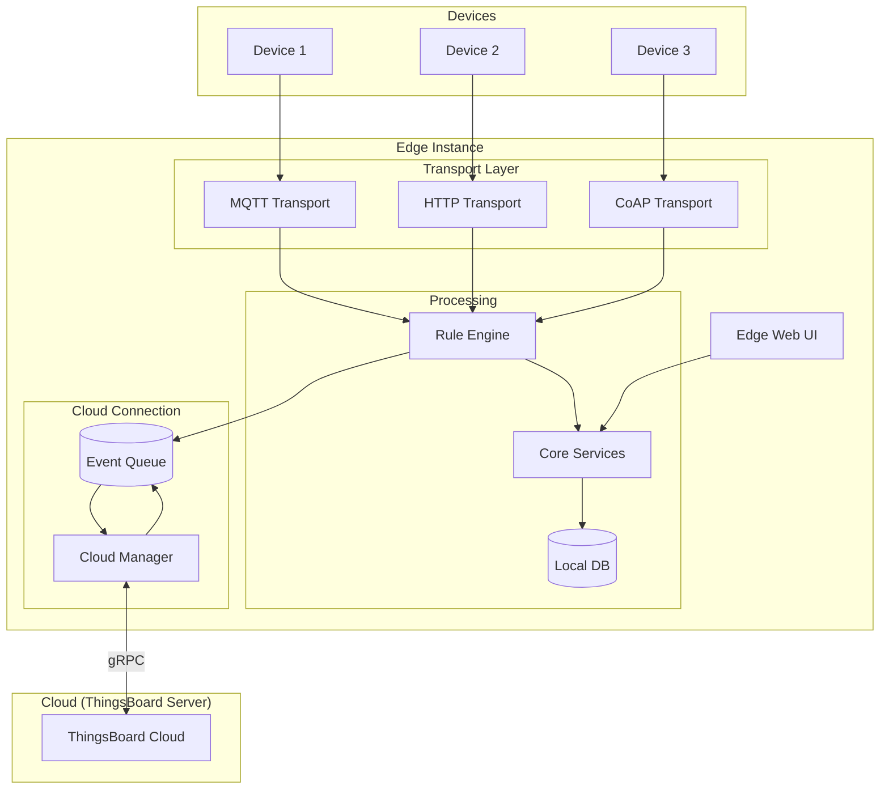
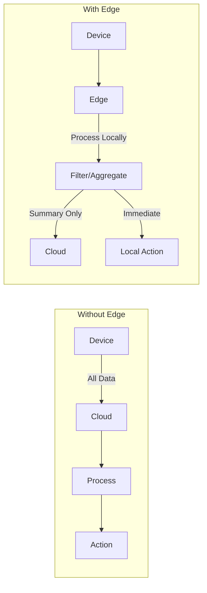

# Edge Computing

## Overview

ThingsBoard Edge enables distributed data processing and analysis at the network edge, close to where IoT devices operate. Edge instances run a lightweight version of the ThingsBoard platform that can operate independently during network outages while synchronizing with the cloud when connectivity is restored. This architecture reduces latency, saves bandwidth, ensures regulatory compliance, and provides resilience for critical operations.

## Contents

| Document | Description |
|----------|-------------|
| [Edge Architecture](./edge-architecture.md) | Components, data flow, and deployment topology |
| [Cloud Synchronization](./cloud-synchronization.md) | gRPC protocol, event types, and sync mechanisms |
| [Rule Chain Templates](./rule-chain-templates.md) | Edge-specific rule chains and template provisioning |

## Key Concepts

- **Local Processing**: Execute rule chains on the edge without cloud round-trips
- **Offline Operation**: Continue processing during network outages with local persistence
- **Cloud Sync**: Bidirectional synchronization via gRPC when connectivity is available
- **Traffic Reduction**: Filter and aggregate data locally before sending to cloud
- **Rule Chain Templates**: Server-defined templates deployed to edge instances
- **Edge Management**: Provision devices, dashboards, and configurations from the cloud

## Edge Architecture



## Deployment Scenarios

| Scenario | Edge Benefit |
|----------|-------------|
| **Remote/Offline Sites** | Continues operation during network outages |
| **High Data Volume** | Filters and aggregates locally, reducing cloud costs |
| **Low Latency Required** | Processes locally without cloud round-trip |
| **Regulatory Compliance** | Keeps sensitive data within geographic boundaries |
| **Distributed Architecture** | Local processing at each site with central management |

## Edge vs Cloud Processing



## Hardware Requirements

| Deployment | RAM | CPU | Storage |
|------------|-----|-----|---------|
| Minimum | 256 MB | 1 core | 1 GB |
| Recommended | 1 GB | 2 cores | 10 GB |
| Production | 2+ GB | 4 cores | 50+ GB |

Edge can run on:
- Raspberry Pi 4
- Industrial gateways
- NVIDIA Jetson
- Any Linux/Windows system meeting minimum requirements

## Common Pitfalls

Deploying and operating ThingsBoard Edge in production requires careful attention to resource allocation, network connectivity, and operational monitoring. Teams commonly encounter issues in three areas: deployment planning (under-provisioning hardware or network capacity), initial setup (misconfigured credentials or premature entity assignments), and ongoing operations (lack of monitoring visibility). The pitfalls below represent real-world operational challenges that can impact edge reliability, performance, and data integrity.

### Deployment Planning

| Pitfall | Impact | Detection | Solution |
|---------|--------|-----------|----------|
| Undersized hardware for workload | Slow processing, message drops, OOM crashes | CPU >90%, memory exhaustion, slow dashboards | Profile workload first: device count × message rate × rule chain complexity. Use Production specs (2GB+ RAM, 4 cores) for >100 devices |
| Network bandwidth underestimation | Sync delays, connection timeouts, queue overflow | Large sync queue backlog, connection flapping | Calculate: devices × msg/sec × payload size + rule chain outputs. Account for burst traffic during reconnection |
| Insufficient storage for offline buffering | Data loss during outages, sync failures | Disk full errors, event queue drops | Estimate: max_outage_hours × expected_event_rate × avg_event_size. Reserve 3x expected usage for safety |

### Initial Setup

| Pitfall | Impact | Detection | Solution |
|---------|--------|-----------|----------|
| Edge provisioning credential errors | Edge cannot connect to cloud, no sync | "Bad credentials" errors, DISCONNECTED status | Copy routing key and secret exactly from cloud Edge entity. Verify no whitespace in configuration |
| Missing connectivity verification | Delayed failure discovery, troubleshooting difficulty | Edge shows connected but entities don't sync | Test: create device on cloud, assign to edge, verify sync. Check firewall allows port 7070/gRPC outbound |
| Premature entity assignment | Entities sync before dependencies, rule chains fail | "Entity not found" errors, incomplete dashboard widgets | Assign in order: Profiles → Devices/Assets → Dashboards → Rule Chains. Wait for each sync completion |

### Monitoring & Operations

| Pitfall | Impact | Detection | Solution |
|---------|--------|-----------|----------|
| No remote diagnostics setup | Blind to edge health, slow incident response | Reactive troubleshooting after failures | Configure log forwarding (rsyslog, filebeat). Export edge status to monitoring system. Set up uptime checks |
| Missing log aggregation | Cannot correlate edge and cloud events | Fragmented troubleshooting across systems | Centralize logs with ELK/Loki. Include edge_id in log context. Sync timestamps with NTP |
| Inadequate edge health monitoring | Undetected degradation, surprise failures | Late discovery of resource exhaustion, sync lag | Monitor: CPU, memory, disk, event queue depth, sync lag. Alert on thresholds: >80% CPU, >85% disk, queue >5000 |

**Detailed Example 1: Undersized Hardware for Rule Chain Processing**

**Problem**: Edge instance deployed with minimum specifications (256MB RAM, 1 core) experiences frequent crashes and message processing delays when rule chains perform telemetry aggregation, script execution, or external API calls.

**Why This Happens**: Rule chains consume memory proportional to their complexity and throughput. A script node processing 1000 messages/second might allocate 50-100MB just for script context. Concurrent rule chain instances (one per device or per alarm) multiply memory requirements. The actor system's dispatcher threads compete for CPU, causing queue buildup when there's insufficient processing capacity.

**Detection**:
- Application logs show `OutOfMemoryError` or `GC overhead limit exceeded`
- Dashboard response times exceed 5-10 seconds
- Message queue depths grow continuously: `tb.queue.rule_engine.pending_messages > 10000`
- CPU utilization sustained at >95%
- Edge status shows frequent disconnections and reconnections

**Solution**:
1. **Immediate**: Restart edge with increased JVM heap: `export JAVA_OPTS="-Xms512m -Xmx1024m"` and restart service
2. **Short-term**: Reduce rule chain complexity - move heavy processing (REST calls, complex scripts) to cloud, keep only critical local actions
3. **Long-term**: Profile actual workload and right-size hardware:
   - Measure: devices × average msg/sec × rule chain complexity factor
   - Complexity factors: Simple filter (1x), Script node (5x), External API (10x)
   - Provision: For 100 devices @ 1 msg/sec with moderate complexity → 2GB RAM, 2 cores minimum

**Configuration Example**:
```yaml
# thingsboard.yml (or docker-compose environment)
JAVA_OPTS: "-Xms1024m -Xmx2048m -XX:+UseG1GC"
# Reduce dispatcher threads if CPU-constrained
actors.rule.dispatcher.pool_size: 8  # default is 16
```

**Detailed Example 2: Network Bandwidth Underestimation During Sync**

**Problem**: Edge deployed on satellite or cellular connection experiences connection timeouts and sync failures when transitioning from offline to online. The accumulated event queue causes network saturation, triggering connection resets and creating a sync storm that can last hours.

**Why This Happens**: During offline periods, edge queues all sync events (telemetry, alarms, attribute updates). When connectivity resumes, the sync process attempts to flush the entire queue rapidly. With thousands of queued events and limited bandwidth (e.g., 256kbps satellite), the gRPC connection times out before completing a batch. Failed batches retry, creating overlapping sync attempts that consume even more bandwidth.

**Detection**:
- Cloud event table shows Edge status flapping between CONNECTED and DISCONNECTED every few minutes
- Edge logs show `DEADLINE_EXCEEDED` or `UNAVAILABLE` gRPC errors
- Network monitoring shows sustained 100% bandwidth utilization
- Sync queue depth decreases slowly or not at all: `tb.edge.sync.queue.size` remains high
- Cloud-side logs show incomplete message batches: "Received 12 of 50 expected events"

**Solution**:
1. **Immediate**: Manually throttle sync by temporarily reducing batch size in edge configuration:
   ```yaml
   edges.storage.max_read_records_count: 10  # reduce from default 50
   edges.storage.sleep_between_batches: 120000  # increase delay to 2 minutes
   ```
2. **Short-term**: Implement traffic shaping at network layer to reserve bandwidth for health checks:
   - QoS rule: reserve 25% bandwidth for control plane (gRPC keepalive, small messages)
   - Limit bulk sync to 75% of available bandwidth
3. **Long-term**: Right-size network capacity:
   - Calculate expected sync traffic: `(devices × msg/sec × avg_payload) + (rules × output_rate × payload)`
   - Account for compression (gRPC provides ~3:1 for telemetry JSON)
   - Design for burst: `normal_traffic × 10` during post-outage sync
   - Consider edge-local analytics to reduce cloud sync volume by 90%+

**Configuration Example**:
```yaml
# Edge configuration for bandwidth-constrained deployments
edges:
  storage:
    max_read_records_count: 25              # smaller batches
    no_read_records_sleep: 2000             # longer polling interval
    sleep_between_batches: 90000            # 90s delay between batches
  rpc:
    max_inbound_message_size: 2097152       # 2MB instead of 4MB
    keep_alive_time_sec: 30                 # less frequent keepalives
```

**Detailed Example 3: Insufficient Remote Diagnostics Setup**

**Problem**: Production edge instances deployed in remote sites (offshore oil rigs, agricultural fields, autonomous vehicles) fail intermittently. Operations team cannot access logs or metrics without physical site visits, causing multi-day mean time to resolution (MTTR) and expensive truck rolls.

**Why This Happens**: Default edge deployment assumes log access via local filesystem or Docker logs. In field deployments, network access may be restricted, intermittent, or bandwidth-constrained. Without proactive log forwarding and metrics export, the edge becomes a "black box" when issues occur. Critical failure information is lost during reboots or hardware failures.

**Detection** (Ironically, this pitfall prevents detection):
- Operations team discovers issue only when users report failures
- No historical data available when troubleshooting begins
- Cannot correlate edge failures with cloud events or network issues
- Forced to infer problems from cloud-side symptoms (missing data, stale attributes)
- Physical site access required for root cause analysis

**Solution**:
1. **Pre-deployment setup**:
   - Configure log forwarding to central aggregation (ELK, Splunk, Grafana Loki)
   - Export edge metrics to monitoring system (Prometheus, Datadog, CloudWatch)
   - Enable edge status as telemetry to cloud (connection state, resource usage, queue depth)
   - Set up synthetic health checks (ping edge endpoint, verify rule chain execution)

2. **Log aggregation configuration**:
   ```bash
   # Filebeat configuration for edge log forwarding
   filebeat.inputs:
     - type: log
       paths:
         - /var/log/tb-edge/*.log
       fields:
         edge_id: ${EDGE_ID}
         deployment: ${DEPLOYMENT_NAME}
   output.logstash:
     hosts: ["central-logs.example.com:5044"]
     compression_level: 9  # max compression for bandwidth-constrained
   ```

3. **Metrics export setup**:
   ```yaml
   # Edge configuration for metrics export
   monitoring:
     enabled: true
     exporters:
       prometheus:
         enabled: true
         port: 9090
       custom:
         enabled: true
         endpoint: "https://metrics.example.com/edge"
         interval: 60000  # 1 minute
   ```

4. **Alerting rules**:
   - **Critical**: Edge offline >5 minutes → page on-call
   - **High**: Memory >85% for >10 minutes → escalate
   - **Medium**: Sync queue >10,000 events → investigate
   - **Low**: Disk >80% → schedule maintenance

5. **Recovery dashboard**:
   - Edge connection timeline (uptime percentage)
   - Resource utilization trends (detect gradual degradation)
   - Sync queue depth (identify accumulation issues)
   - Error rate by category (gRPC, database, rule engine)

**Prevention Checklist**:
- [ ] Logs forwarded to central system with edge_id tag
- [ ] Metrics exported every 1-5 minutes
- [ ] Edge status updates sent to cloud as telemetry
- [ ] Alerting rules configured with escalation paths
- [ ] Recovery runbook documented with remote remediation steps
- [ ] Bandwidth budget includes monitoring overhead (typically 5-10% of total)

## See Also

- [System Overview](../01-architecture/system-overview.md) - Platform architecture
- [Rule Engine](../04-rule-engine/README.md) - Rule chain processing
- [Transport Layer](../05-transport-layer/README.md) - Device protocols
- [Message Queue](../08-message-queue/README.md) - Queue architecture
- [IoT Gateway](../13-iot-gateway/README.md) - Gateway integration (if available)
