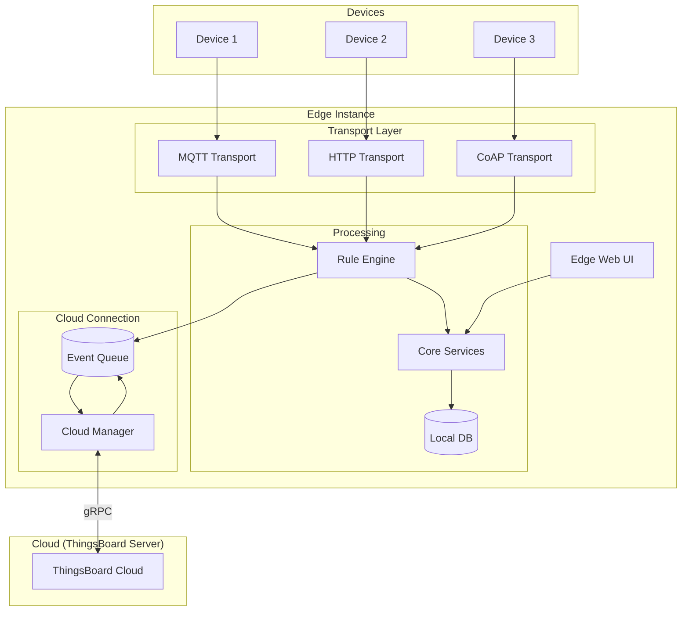
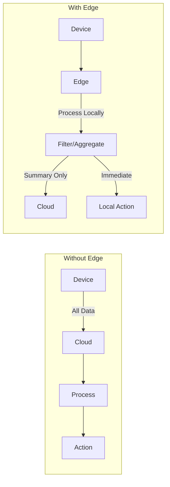

# Edge Computing

## Overview

ThingsBoard Edge enables distributed data processing and analysis at the network edge, close to where IoT devices operate. Edge instances run a lightweight version of the ThingsBoard platform that can operate independently during network outages while synchronizing with the cloud when connectivity is restored. This architecture reduces latency, saves bandwidth, ensures regulatory compliance, and provides resilience for critical operations.

## Contents

| Document | Description |
|----------|-------------|
| [Edge Architecture](./edge-architecture.md) | Components, data flow, and deployment topology |
| [Cloud Synchronization](./cloud-synchronization.md) | gRPC protocol, event types, and sync mechanisms |
| [Rule Chain Templates](./rule-chain-templates.md) | Edge-specific rule chains and template provisioning |

## Key Concepts

- **Local Processing**: Execute rule chains on the edge without cloud round-trips
- **Offline Operation**: Continue processing during network outages with local persistence
- **Cloud Sync**: Bidirectional synchronization via gRPC when connectivity is available
- **Traffic Reduction**: Filter and aggregate data locally before sending to cloud
- **Rule Chain Templates**: Server-defined templates deployed to edge instances
- **Edge Management**: Provision devices, dashboards, and configurations from the cloud

## Edge Architecture

## Deployment Scenarios

| Scenario | Edge Benefit |
|----------|-------------|
| **Remote/Offline Sites** | Continues operation during network outages |
| **High Data Volume** | Filters and aggregates locally, reducing cloud costs |
| **Low Latency Required** | Processes locally without cloud round-trip |
| **Regulatory Compliance** | Keeps sensitive data within geographic boundaries |
| **Distributed Architecture** | Local processing at each site with central management |

## Edge vs Cloud Processing

## Hardware Requirements

| Deployment | RAM | CPU | Storage |
|------------|-----|-----|---------|
| Minimum | 256 MB | 1 core | 1 GB |
| Recommended | 1 GB | 2 cores | 10 GB |
| Production | 2+ GB | 4 cores | 50+ GB |

Edge can run on:
- Raspberry Pi 4
- Industrial gateways
- NVIDIA Jetson
- Any Linux/Windows system meeting minimum requirements

## See Also

- [System Overview](../01-architecture/system-overview.md) - Platform architecture
- [Rule Engine](../04-rule-engine/README.md) - Rule chain processing
- [Transport Layer](../05-transport-layer/README.md) - Device protocols
- [Message Queue](../08-message-queue/README.md) - Queue architecture
- [IoT Gateway](../13-iot-gateway/README.md) - Gateway integration (if available)
