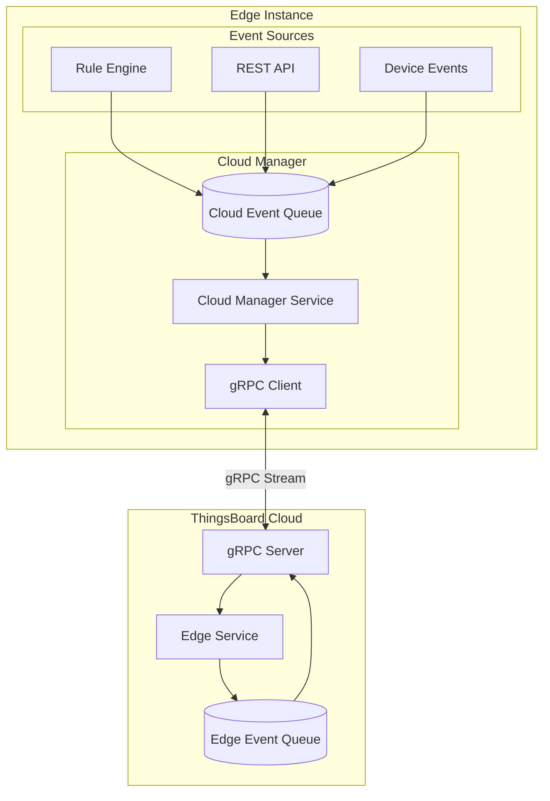
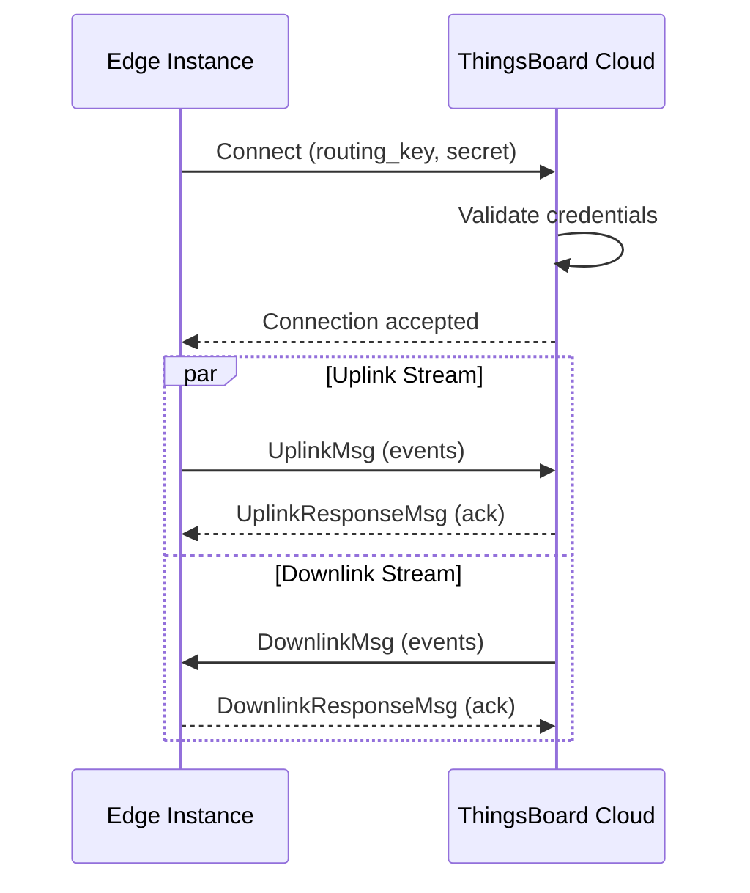
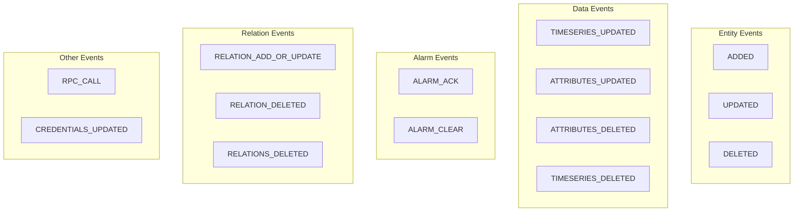
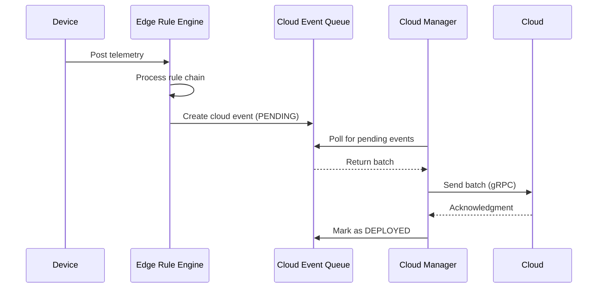
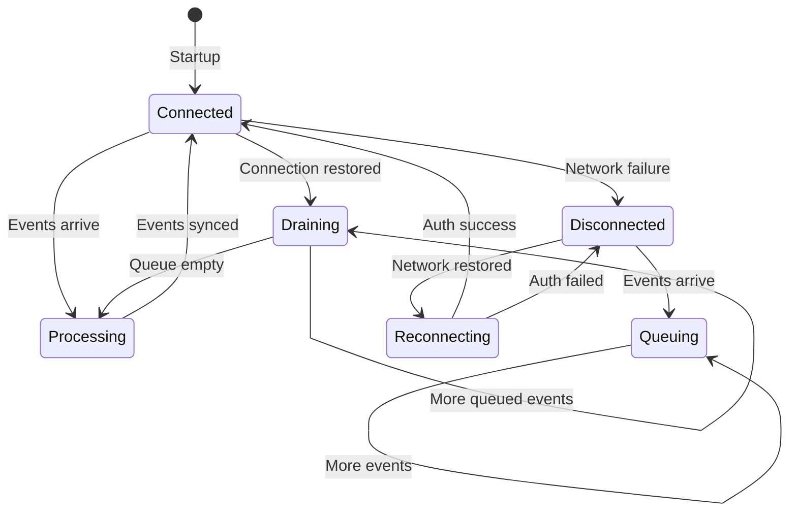
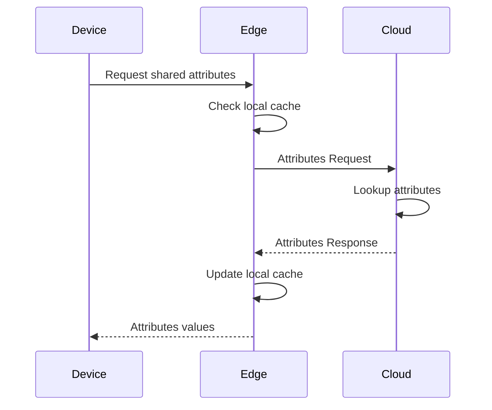
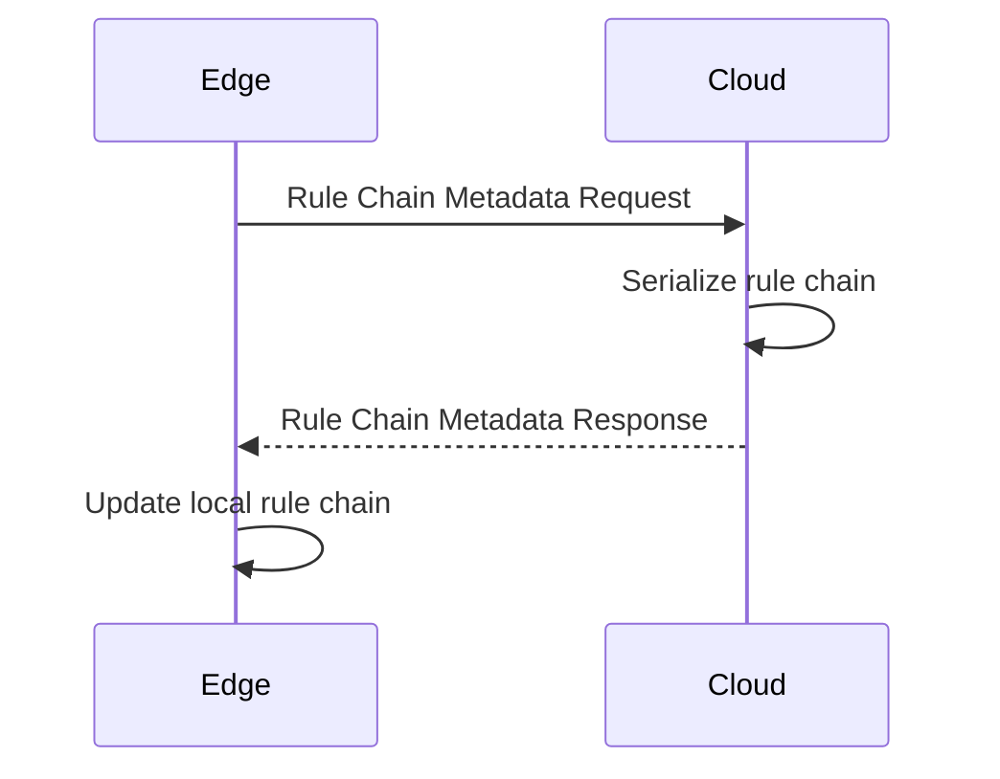
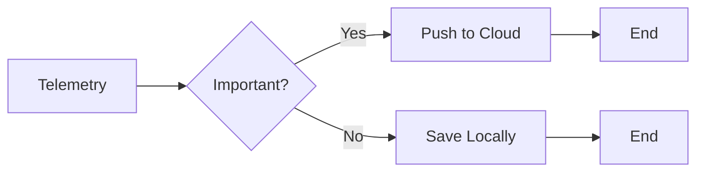
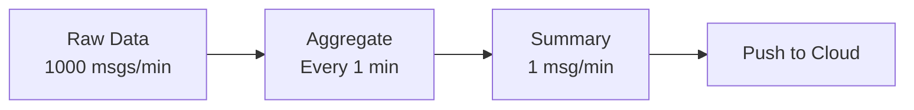

# Cloud Synchronization

## Overview

ThingsBoard Edge synchronizes with the cloud server using a bidirectional gRPC protocol. The Cloud Manager component maintains this connection, handling both outbound events (edge to cloud) and inbound events (cloud to edge). Events are queued locally during connectivity loss and synchronized when the connection is restored, ensuring no data loss.

## Key Behaviors

1. **Bidirectional Sync**: Events flow both from edge to cloud and cloud to edge.

2. **Persistent Queue**: Cloud events are stored locally until successfully delivered.

3. **Automatic Reconnection**: Cloud Manager automatically reconnects after network failures.

4. **Event Ordering**: Events are processed in order within each entity context.

5. **Acknowledgment-Based**: Events remain pending until cloud acknowledges receipt.

## Synchronization Architecture



## gRPC Protocol

### Connection Establishment



### Message Types

**Uplink Messages (Edge → Cloud):**

| Message Type | Description |
|--------------|-------------|
| EntityDataProto | Entity create/update/delete |
| TelemetryUpdateProto | Time-series data |
| AttributeUpdateProto | Attribute changes |
| AlarmUpdateProto | Alarm state changes |
| RelationUpdateProto | Relation modifications |
| RpcResponseProto | RPC command responses |

**Downlink Messages (Cloud → Edge):**

| Message Type | Description |
|--------------|-------------|
| EntityDataProto | Entity provisioning |
| AttributeUpdateProto | Server/shared attributes |
| RpcRequestProto | RPC commands to devices |
| RuleChainUpdateProto | Rule chain template updates |
| WidgetsBundleUpdateProto | Widget bundle sync |
| DashboardUpdateProto | Dashboard provisioning |

## Cloud Event Types

### Outbound Events (Edge → Cloud)

Events generated on the edge that sync to cloud:



### Event Status

| Status | Description |
|--------|-------------|
| PENDING | Event created, awaiting sync |
| DEPLOYED | Successfully pushed to cloud |

### Cloud Event Table Schema

```sql
CREATE TABLE cloud_event (
    id              UUID PRIMARY KEY,
    created_time    BIGINT NOT NULL,
    tenant_id       UUID NOT NULL,
    edge_id         UUID,
    cloud_event_type VARCHAR(255),
    entity_type     VARCHAR(255),
    entity_id       UUID,
    cloud_event_action VARCHAR(255),
    entity_body     TEXT,
    ts              BIGINT NOT NULL
);
```

## Inbound Events (Cloud → Edge)

Events pushed from cloud to edge instances:

| Event Type | Trigger | Effect on Edge |
|------------|---------|----------------|
| Device provisioned | Admin assigns device to edge | Device created on edge |
| Asset provisioned | Admin assigns asset to edge | Asset created on edge |
| Dashboard provisioned | Admin assigns dashboard | Dashboard synced to edge |
| Rule chain updated | Template modified | Rule chain updated on edge |
| Shared attribute set | Server updates attribute | Attribute synced to device |
| RPC request | Server initiates RPC | Command forwarded to device |
| User provisioned | User assigned to edge | User can access edge UI |

## Sync Mechanisms

### Push Strategy

Events are pushed to cloud as soon as connectivity is available:



### Offline Handling

When connectivity is lost:



**Queue Behavior During Offline:**

1. Events continue to be generated locally
2. Cloud events stored with PENDING status
3. No data loss - local persistence ensures durability
4. When reconnected, queued events are processed in order

### Batch Processing

Events are sent in batches for efficiency:

| Parameter | Description | Default |
|-----------|-------------|---------|
| batch.size | Max events per batch | 100 |
| batch.timeout | Max wait time (ms) | 1000 |
| retry.interval | Retry delay (ms) | 3000 |
| max.retries | Max retry attempts | 10 |

## Request-Response Patterns

### Attribute Request

Edge can request current attribute values from cloud:



### Rule Chain Metadata Request

Edge can request rule chain configuration:



## Configuration

### Cloud Connection Settings

| Environment Variable | Description | Default |
|---------------------|-------------|---------|
| CLOUD_ROUTING_KEY | Edge routing key | - |
| CLOUD_ROUTING_SECRET | Edge secret | - |
| CLOUD_RPC_HOST | Cloud server address | localhost |
| CLOUD_RPC_PORT | gRPC port | 7070 |
| CLOUD_RPC_TIMEOUT | Request timeout (ms) | 5000 |
| CLOUD_RPC_SSL_ENABLED | Enable TLS | false |
| CLOUD_RPC_SSL_CERT | TLS certificate path | - |

### Reconnection Settings

| Parameter | Description | Default |
|-----------|-------------|---------|
| reconnect.interval | Base reconnect delay (ms) | 3000 |
| reconnect.max.interval | Max backoff delay (ms) | 60000 |
| keepalive.time | Keepalive interval (s) | 30 |

## Traffic Optimization

### Selective Sync

Not all data needs to go to cloud. Use rule chains to filter:



### Data Aggregation

Reduce traffic by aggregating before sync:



**Example Rule Chain for Aggregation:**

1. Collect telemetry in time window
2. Calculate min/max/avg
3. Push aggregated values to cloud
4. Discard raw values

## Monitoring Sync Status

### Cloud Events Page

The Edge UI provides a Cloud Events page showing:
- Event type and action
- Entity information
- Status (PENDING/DEPLOYED)
- Timestamp

### Health Indicators

| Metric | Healthy | Warning |
|--------|---------|---------|
| Queue depth | < 1000 | > 5000 |
| Sync latency | < 5s | > 30s |
| Connection status | Connected | Reconnecting |

## Common Pitfalls

Cloud-edge synchronization is a complex distributed system challenge where network instability, event ordering, and resource constraints can cause data loss, duplicate processing, or sync failures. The pitfalls below cover five critical categories where synchronization issues most commonly occur: queue management, event ordering, network/protocol configuration, sync mode selection, and entity assignment coordination.

### Sync Queue Management

| Pitfall | Impact | Detection | Solution |
|---------|--------|-----------|----------|
| High-priority queue overflow (10k limit) | Lost sync events, critical data not reaching cloud | Queue depth metrics > 10000, ERROR logs "Queue full" | Increase max_high_priority_queue_size_per_session. Analyze event sources causing burst. Implement backpressure in rule chains |
| Batch size vs network latency mismatch | Slow sync progress, connection timeouts, partial batches | Batch processing taking >30s, DEADLINE_EXCEEDED errors | Reduce max_read_records_count for high-latency connections. Balance: smaller batches = more overhead, larger = timeouts |
| Retry delay accumulation during outages | Sync backlog takes hours to clear, data staleness | After reconnection, sync progress <100 events/min | Lower sleep_between_batches for rapid catch-up. Monitor: temporarily set to 10-30s during recovery, then restore default |
| Event persistence vs memory exhaustion | Edge crashes during long offline due to queue in memory | OOM errors correlating with large queue depth | Use persistent queue (PostgreSQL/Kafka) for production. In-memory only for development/testing |

### Event Ordering

| Pitfall | Impact | Detection | Solution |
|---------|--------|-----------|----------|
| Sequence number vs timestamp misalignment | Events processed out of order, state inconsistencies | Device shows old value after newer update, alarm states flipping | Verify NTP sync on edge and cloud. Rely on seqId ordering, not created_time. Check misordering_compensation_millis=60000 |
| Clock drift between edge and cloud (>60s) | Events rejected, "Event too old" warnings, missing data | Time difference >60s in logs, events marked as "Outdated" | Enable NTP on both systems. Monitor clock skew. Increase misordering_compensation_millis if drift unavoidable |
| Dependency violation in entity updates | Dashboard assigned before widget bundle, "Entity not found" | Sync fails with missing reference errors, partial entity graphs | Follow sync order: Profiles → Devices/Assets → Dashboards → Rules. Wait for DEPLOYED status before dependent entities |
| Bulk operation misordering | Mass device update creates race condition, inconsistent state | Some devices have old profile, others new after bulk change | Avoid simultaneous bulk updates. Use entity groups. Verify sync completion between operations |

### Network & Protocol

| Pitfall | Impact | Detection | Solution |
|---------|--------|-----------|----------|
| Message size exceeding 4MB limit | Large entity sync fails, "RESOURCE_EXHAUSTED" errors | Sync stuck on dashboard with many widgets, large rule chains | Split large entities: dashboards with >50 widgets, rule chains with >100 nodes. Increase max_inbound_message_size if necessary |
| Keep-alive timeout mismatch | Frequent disconnections, connection flapping, resync overhead | Edge status toggles CONNECTED/DISCONNECTED every few minutes | Match edge keep_alive_time_sec (default 30) with cloud client_max_keep_alive_time_sec. Network must support HTTP/2 PING frames |
| Connection flapping from network instability | Sync retry storms, duplicate events, resource exhaustion | Connection logs show reconnect every 10-60s, sync never completes | Implement backoff: increase reconnect.interval and reconnect.max.interval. Add network monitoring to detect root cause (packet loss, bandwidth saturation) |
| Proxy/firewall blocking HTTP/2 | Connection hangs at establishment, timeout after 30s | gRPC errors "DEADLINE_EXCEEDED", connection never establishes | Verify proxy supports HTTP/2. Test: `curl -v --http2 https://cloud:7070`. Configure proxy HTTP/2 upgrade. Consider VPN tunnel |

### Sync Mode Selection

| Pitfall | Impact | Detection | Solution |
|---------|--------|-----------|----------|
| Full sync after minor outage | Unnecessary data transfer, slow recovery, resource waste | 1-hour outage triggers full sync of 10,000 entities | Incremental sync should be default. Check: edge sends SyncRequestMsg with fullSync=false. Full sync only for: version mismatch, DB corruption, first connect |
| Incremental sync with stale entity graph | Missing dependencies, "Not found" errors for related entities | Devices sync but profiles missing, dashboards missing widgets | After long outage (>24h) or edge version upgrade, perform full sync: `SyncRequestMsg{fullSync=true}`. Validates entire entity graph |
| Sync retry storms on reconnection | Overlapping sync attempts, race conditions, event duplicates | Queue depth oscillates, multiple sync threads visible in logs | Ensure single-threaded sync: check `edges.scheduler.send_scheduler_pool_size=1` for strict ordering. Use circuit breaker pattern to prevent retry storms |

### Entity Assignment

| Pitfall | Impact | Detection | Solution |
|---------|--------|-----------|----------|
| Assignment before dependency entities sync | Dashboard widgets fail, rule chains reference missing profiles | Dashboard loads but widgets show "Entity not found", rules fail | Wait for dependency sync completion. Check cloud_event table: dependent entities show DEPLOYED before assigning. Use sync hooks to enforce order |
| Circular dependency deadlocks | Entities stuck in PENDING, sync never completes | cloud_event table shows circular references, queue depth static | Design entity graphs acyclically. Example: avoid Asset A → relation → Asset B → relation → Asset A. Break cycles with indirect relations via intermediate entities |
| Related entity propagation delays | Widget bundle assigned but widgets not synced yet | Dashboard renders but widgets missing, gradual appearance over minutes | Related entities sync asynchronously. Wait for "allEdgesRelated" event types (WIDGET_TYPE, DEVICE_PROFILE). Poll edge API until complete: `GET /api/edge/{edgeId}/missingToRelatedRuleChains` |
| Unassignment cleanup incompleteness | Orphaned entities on edge, storage waste, stale data | Edge shows devices no longer assigned to it, cloud shows correct state | Unassignment triggers DELETE events, but edge must have connectivity. After unassign, verify cloud_event shows ACTION=UNASSIGNED_FROM_EDGE status=DEPLOYED. Orphans require manual cleanup |

**Detailed Example 1: High-Priority Queue Overflow During Extended Offline**

**Problem**: Edge deployed on cargo ship loses satellite connectivity for 3 days. When connection resumes, high-priority sync queue overflows (10,000 event limit), dropping critical alarm updates. Cloud never receives alarms generated during offline period.

**Why This Happens**: High-priority queue stores critical events (alarms, RPC responses) in-memory for fast sync. Default limit is 10,000 events. During 3-day outage:
- 500 devices × 10 alarms/day = 15,000 alarm events
- Queue fills to 10,000 capacity
- Remaining 5,000 events dropped with WARNING log
- Dropped events never sync to cloud, no alarm history

**Detection**:
- Edge logs show: `High priority queue is full. Event dropped: AlarmUpdateProto`
- Cloud Events page shows gap in sequence numbers: seqId jumps from 10,000 to 15,001
- Cloud alarm dashboard missing alarms from offline period
- Queue depth metric reaches exactly 10,000 and stays there
- After reconnection, alarm count on edge vs cloud doesn't match:
  ```sql
  -- Edge DB
  SELECT COUNT(*) FROM alarm WHERE created_time BETWEEN offline_start AND offline_end;
  -- Returns: 15,000

  -- Cloud DB (for this edge)
  SELECT COUNT(*) FROM alarm WHERE edge_id = X AND created_time BETWEEN offline_start AND offline_end;
  -- Returns: 10,000 (5,000 dropped)
  ```

**Solution**:
1. **Immediate recovery** - Manually sync dropped alarms:
   ```bash
   # Identify missing alarms on edge
   SELECT id, type, severity, created_time
   FROM alarm
   WHERE created_time >= '2024-01-15' AND created_time <= '2024-01-18'
   AND id NOT IN (SELECT entity_id FROM cloud_event WHERE type = 'ALARM' AND status = 'DEPLOYED');

   # Export missing alarms as JSON, upload to cloud via API
   # (This requires custom script - no built-in recovery mechanism)
   ```

2. **Increase queue size** for long-outage scenarios:
   ```yaml
   # /etc/tb-edge/conf/tb-edge.yml
   edges:
     scheduler:
       max_high_priority_queue_size_per_session: 50000  # 5x increase

   # Requires edge restart
   systemctl restart tb-edge
   ```

3. **Calculate appropriate queue size**:
   ```
   Expected outage duration: 3 days = 72 hours
   Critical event rate: alarms + RPC responses
   - Devices: 500
   - Avg alarms per device per hour: 0.5
   - Critical event rate: 500 × 0.5 = 250 events/hour
   - Total for 72h: 250 × 72 = 18,000 events

   Queue size = expected_events × 1.5 (buffer)
   = 18,000 × 1.5 = 27,000

   Set: max_high_priority_queue_size_per_session = 30000
   ```

4. **Implement event prioritization** in rule chains:
   - **Critical** (high-priority queue): CRITICAL/MAJOR alarms, RPC responses
   - **Normal** (persistent queue): Telemetry, INFO alarms, attribute updates
   - Use "Push to Cloud" node with priority setting

5. **Monitor queue health**:
   ```yaml
   # Prometheus alert
   - alert: EdgeSyncQueueNearFull
     expr: tb_edge_high_priority_queue_size / tb_edge_max_high_priority_queue_size > 0.8
     for: 10m
     annotations:
       summary: "Edge {{$labels.edge_id}} high-priority queue at {{$value}}%"

   # Alert even when offline (via last-known metrics)
   - alert: EdgeOfflineWithHighQueue
     expr: tb_edge_connection_status == 0 AND tb_edge_high_priority_queue_size > 5000
     for: 1h
   ```

**Prevention**:
- Size queue for expected max outage duration
- Implement event prioritization in rule chains
- Consider persistent queue for all events in critical deployments
- Monitor queue depth continuously, alert at 80% capacity

**Detailed Example 2: Sequence Number vs Timestamp Misalignment Causing State Flipping**

**Problem**: Device attribute "operatingMode" flips between "AUTO" and "MANUAL" every few minutes on cloud dashboard, even though edge shows stable "AUTO" value. Actual device is in AUTO mode. Rule chains on cloud trigger incorrect actions based on stale "MANUAL" state.

**Why This Happens**: Events are ordered by two timestamps:
1. `seqId`: Strictly increasing sequence number assigned at event creation
2. `created_time`: Wall clock timestamp (depends on system clock)

When clock skews between edge and cloud systems:
- Edge sends events with seqId=1000, created_time=15:00:00 (edge clock)
- Then sends seqId=1001, created_time=14:59:00 (edge clock drifted backward)
- Cloud processes by seqId correctly, but cache/UI may sort by created_time
- Result: Newer event (seqId=1001) appears older (created_time), causing UI flicker

Additionally, `misordering_compensation_millis=60000` allows events within 60s window to be reordered by created_time, amplifying the problem.

**Detection**:
- Cloud logs show warnings: `Event with seqId X has timestamp older than previous event`
- Attribute history in cloud shows values flip-flopping:
  ```sql
  SELECT ts, bool_v, long_v FROM attribute_kv
  WHERE entity_id = 'device-uuid' AND attribute_key = 'operatingMode'
  ORDER BY ts DESC LIMIT 20;

  -- Output shows oscillation:
  -- ts=15:00:00, value=AUTO
  -- ts=14:59:00, value=MANUAL  ← Out of order
  -- ts=15:00:30, value=AUTO
  ```
- Check clock skew:
  ```bash
  # On edge
  date -u
  # On cloud
  date -u
  # Difference > 5s indicates drift
  ```
- Edge metrics: `jmx.clock.drift.seconds > 5`

**Solution**:
1. **Immediate fix** - Enable NTP on both systems:
   ```bash
   # Edge
   sudo timedatectl set-ntp true
   sudo systemctl restart systemd-timesyncd
   timedatectl status  # Verify "System clock synchronized: yes"

   # Cloud
   sudo timedatectl set-ntp true
   sudo systemctl restart systemd-timesyncd
   ```

2. **Adjust misordering compensation** if drift persists:
   ```yaml
   # Edge configuration
   edges:
     storage:
       misordering_compensation_millis: 300000  # Increase to 5 minutes if NTP unavailable

   # This allows events within 5-minute window to reorder
   # Reduces out-of-order errors but increases memory usage for buffering
   ```

3. **Rely on seqId for ordering**, not timestamps:
   ```java
   // Application code should use seqId for ordering
   events.sort(Comparator.comparing(Event::getSeqId));  // Correct
   // NOT: events.sort(Comparator.comparing(Event::getCreatedTime));  // Wrong
   ```

4. **Monitor clock skew continuously**:
   ```yaml
   # Prometheus exporter on edge
   - metric: system_clock_drift_seconds
     help: "Difference between system time and NTP reference"
     query: |
       chronyc tracking | grep "System time" | awk '{print $4}'

   # Alert on drift
   - alert: EdgeClockDrift
     expr: abs(system_clock_drift_seconds) > 5
     for: 5m
   ```

5. **Verify sync order matches event order**:
   ```sql
   -- Query cloud database
   SELECT seq_id, created_time, type, action
   FROM edge_event
   WHERE edge_id = 'X'
   ORDER BY seq_id DESC
   LIMIT 100;

   -- Verify: seq_id should be strictly increasing
   -- created_time may have minor variations but should trend upward
   ```

**Prevention**:
- Enable NTP on all systems (edge, cloud, database)
- Monitor clock skew continuously (alert on >5s drift)
- Use seqId for application-level ordering, not timestamps
- Set misordering_compensation based on expected max clock drift
- Document time sync requirements in deployment runbook

**Detailed Example 3: Connection Flapping from Network Instability Creating Sync Retry Storm**

**Problem**: Edge deployed on industrial site with unreliable network experiences connection flapping: connects for 30 seconds, disconnects, reconnects 10 seconds later. Sync never completes. Edge CPU at 90% from constant reconnection attempts. Cloud shows edge as "unstable" with thousands of connection events per hour.

**Why This Happens**: When connection is unstable:
1. Edge connects, starts syncing batch of 50 events
2. Network hiccup causes connection drop at event #25
3. Edge immediately reconnects (reconnect.interval=3000ms default)
4. Starts new sync batch from beginning (events 1-50 again)
5. If connection drops again, creates overlapping sync attempts
6. Resource exhaustion: CPU consumed by gRPC connection establishment, memory by queued events, logs grow rapidly

**Detection**:
- Edge logs show connection cycling:
  ```
  15:00:00 INFO CloudManager - Connected to cloud
  15:00:30 ERROR CloudManager - Connection lost: UNAVAILABLE: Network unreachable
  15:00:33 INFO CloudManager - Reconnecting...
  15:00:35 INFO CloudManager - Connected to cloud
  15:01:05 ERROR CloudManager - Connection lost: DEADLINE_EXCEEDED
  (Pattern repeats)
  ```
- Cloud edge status page shows: "Connection flapping detected - 120 reconnects in past hour"
- Network monitoring shows:
  - Packet loss: 2-5%
  - Latency spikes: p99 > 2000ms
  - Bandwidth utilization: 95%+ (saturation)
- Edge metrics:
  - CPU: 85-95%
  - Active gRPC streams: oscillates 0→1→0→1
  - Sync queue depth: never decreases (stuck at 5,000+)

**Solution**:
1. **Immediate mitigation** - Increase reconnect backoff to reduce attempt rate:
   ```yaml
   # Edge configuration
   edges:
     rpc:
       reconnect:
         interval: 10000          # Start at 10s (was 3s)
         max_interval: 300000     # Max 5 min (was 60s)
         multiplier: 2.0          # Exponential backoff
         jitter: 0.2              # Add randomness to prevent thundering herd

   # This creates backoff: 10s, 20s, 40s, 80s, 160s, 300s (max)
   ```

2. **Diagnose network root cause**:
   ```bash
   # Test connectivity stability
   ping -i 1 -c 3600 cloud-server  # 1 hour of pings
   # Look for: packet loss %, latency variance

   # Test bandwidth
   iperf3 -c cloud-server -t 60
   # Verify: sustainable throughput matches expected

   # Check MTU/fragmentation
   ping -M do -s 1472 cloud-server
   # Increase: ping -M do -s 1500 (should fail if MTU issue)

   # Trace route
   traceroute -n cloud-server
   # Identify: high-latency hops, routing loops
   ```

3. **Network layer solutions**:
   - **QoS configuration**: Prioritize gRPC traffic (port 7070) over HTTP/device traffic
     ```bash
     # Example tc rules on edge router
     tc qdisc add dev eth0 root handle 1: htb default 30
     tc class add dev eth0 parent 1: classid 1:1 htb rate 1mbit
     tc class add dev eth0 parent 1:1 classid 1:10 htb rate 800kbit ceil 1mbit prio 0  # gRPC high priority
     tc class add dev eth0 parent 1:1 classid 1:20 htb rate 200kbit ceil 1mbit prio 1  # Other traffic
     tc filter add dev eth0 protocol ip parent 1:0 prio 1 u32 match ip dport 7070 0xffff flowid 1:10
     ```

   - **Connection persistence**: Use TCP keepalive to detect dead connections faster
     ```yaml
     edges:
       rpc:
         keep_alive_time_sec: 60      # Send keepalive every 60s
         keep_alive_timeout_sec: 10   # Wait 10s for response
         keepalive_without_calls: true  # Send even without active RPCs
     ```

   - **Proxy/VPN tunnel**: If direct connection unstable, use VPN to cloud
     ```bash
     # WireGuard tunnel example (edge side)
     wg-quick up wg0
     # Route gRPC traffic through tunnel
     ip route add cloud-server via 10.0.0.1 dev wg0
     ```

4. **Implement circuit breaker pattern**:
   ```java
   // Pseudo-code for edge cloud manager
   int consecutiveFailures = 0;
   int maxConsecutiveFailures = 5;
   long circuitBreakerOpenTime = 300000; // 5 minutes

   void connect() {
       if (consecutiveFailures >= maxConsecutiveFailures) {
           log.warn("Circuit breaker OPEN - waiting {}ms", circuitBreakerOpenTime);
           Thread.sleep(circuitBreakerOpenTime);
           consecutiveFailures = 0; // Reset after wait
       }

       try {
           grpcChannel.connect();
           consecutiveFailures = 0; // Success resets counter
       } catch (Exception e) {
           consecutiveFailures++;
           log.error("Connection failed ({}/{})", consecutiveFailures, maxConsecutiveFailures);
           throw e;
       }
   }
   ```

5. **Monitor and alert on connection health**:
   ```yaml
   # Alert on connection flapping
   - alert: EdgeConnectionFlapping
     expr: rate(edge_connection_attempts_total[5m]) > 0.1  # >6 attempts per minute
     for: 10m
     annotations:
       description: "Edge {{$labels.edge_id}} reconnecting {{ $value | humanize }} times/min"

   # Alert on network quality degradation
   - alert: EdgeNetworkQualityLow
     expr: edge_rpc_latency_p99 > 1000  # p99 latency > 1s
     for: 5m
   ```

**Prevention**:
- Provision adequate network bandwidth: edge_traffic + 50% headroom
- Implement QoS to prioritize control plane (gRPC) over data plane (telemetry)
- Use connection pooling and keepalive to detect failures faster
- Set backoff parameters appropriate for network stability
- Consider VPN/tunnel for unreliable networks (cellular, satellite)
- Load test with network impairments (netem) before production

## See Also

- [Edge Architecture](./edge-architecture.md) - Component overview
- [Rule Chain Templates](./rule-chain-templates.md) - Template sync
- [Message Queue](../08-message-queue/README.md) - Internal queuing
- [gRPC/Protobuf](../05-transport-layer/README.md) - Protocol details
