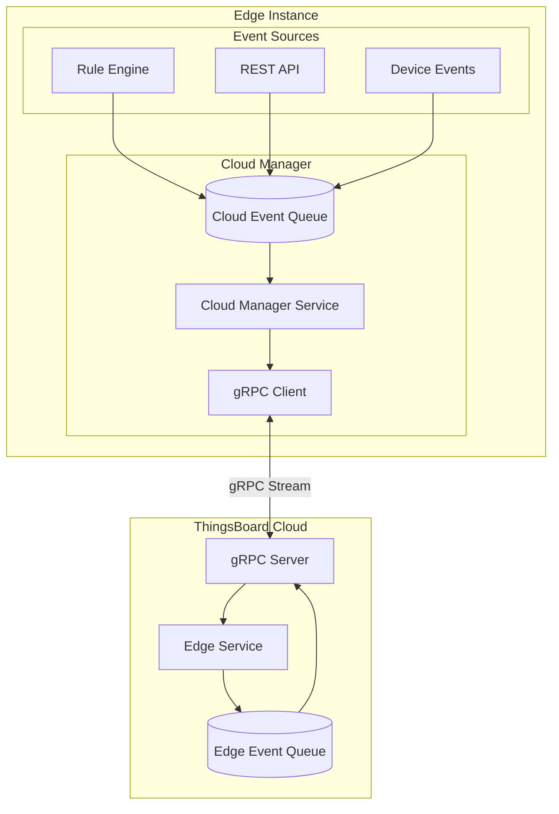
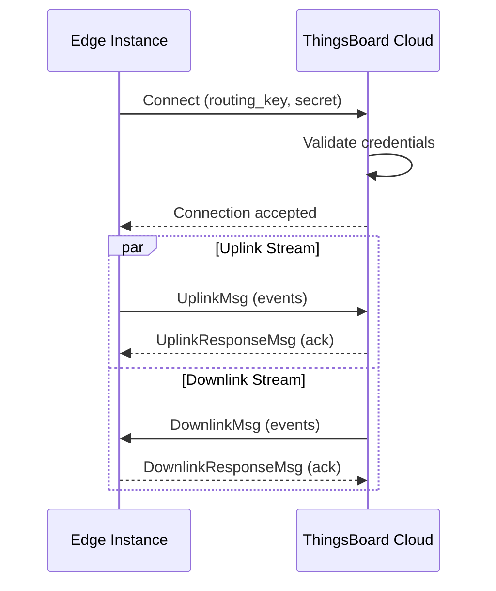
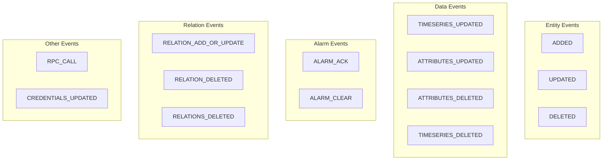
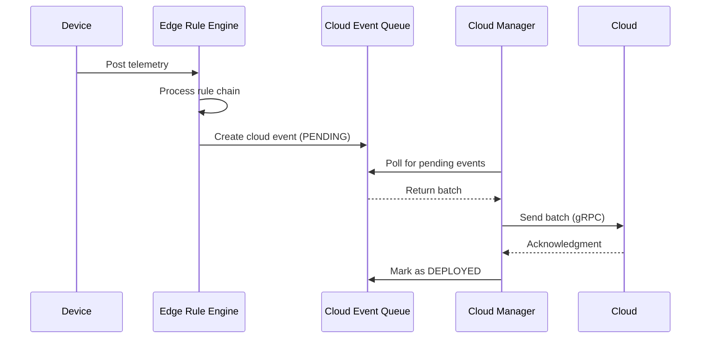
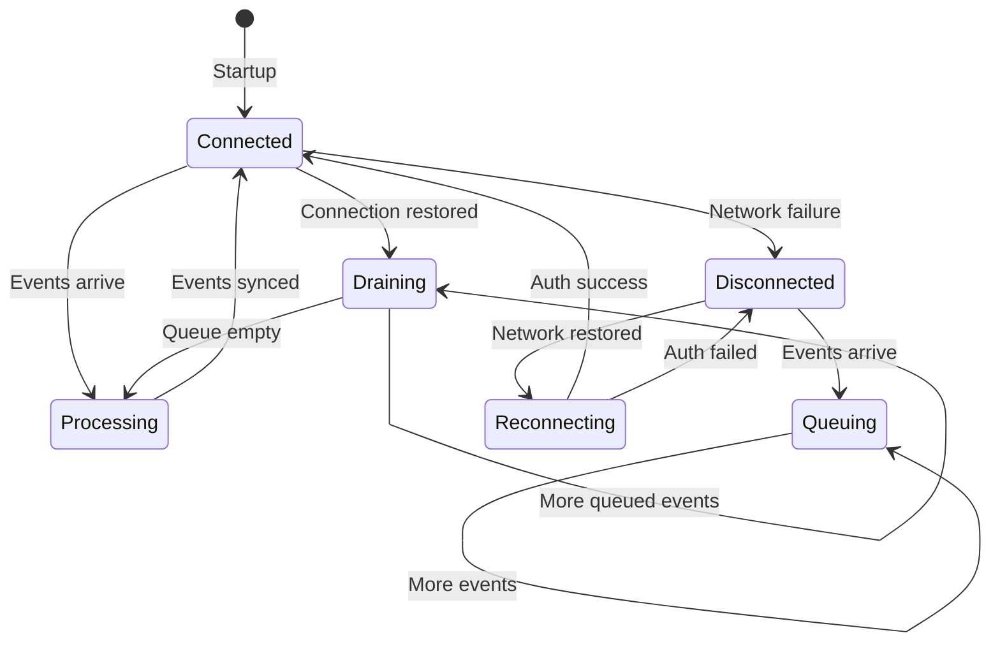
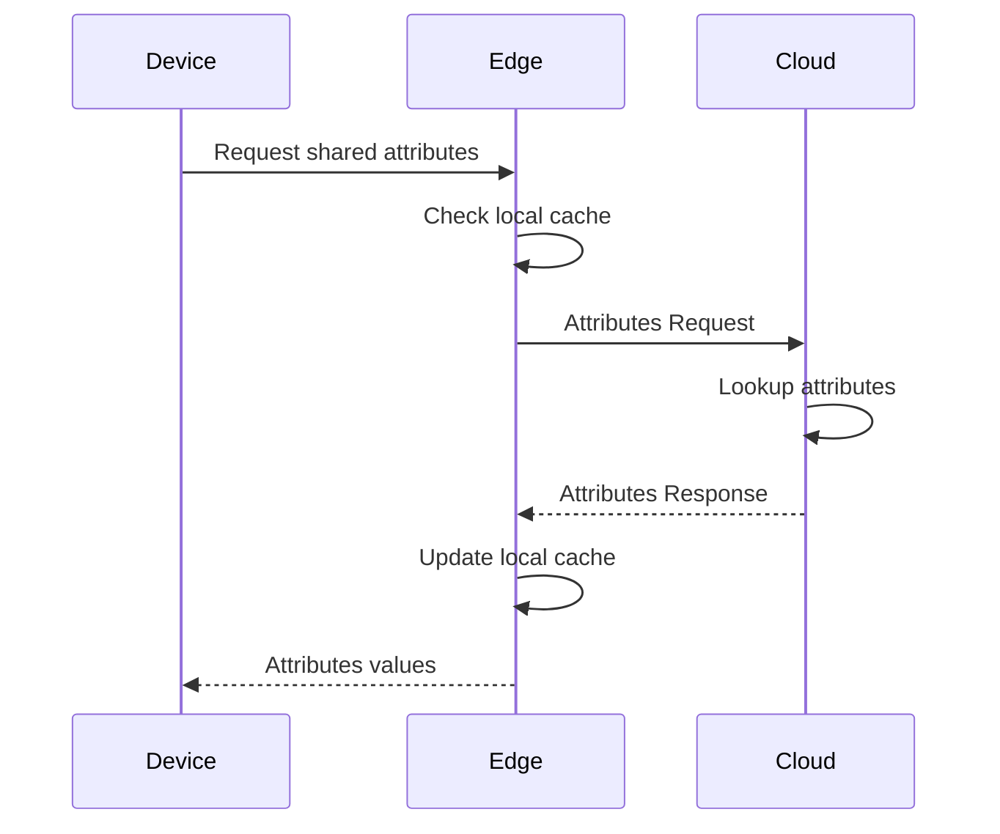
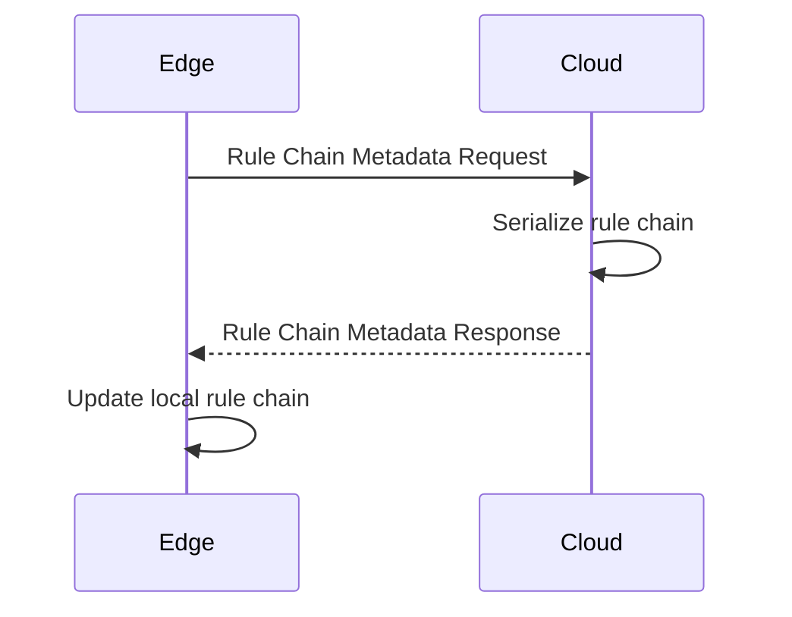
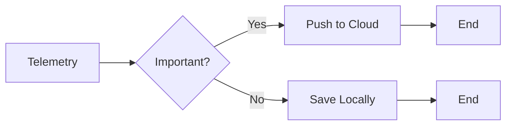
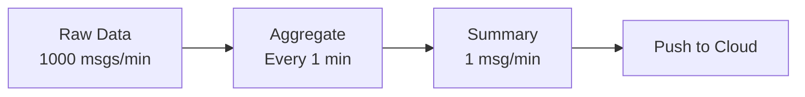

# Cloud Synchronization

## Overview

ThingsBoard Edge synchronizes with the cloud server using a bidirectional gRPC protocol. The Cloud Manager component maintains this connection, handling both outbound events (edge to cloud) and inbound events (cloud to edge). Events are queued locally during connectivity loss and synchronized when the connection is restored, ensuring no data loss.

## Key Behaviors

1. **Bidirectional Sync**: Events flow both from edge to cloud and cloud to edge.

2. **Persistent Queue**: Cloud events are stored locally until successfully delivered.

3. **Automatic Reconnection**: Cloud Manager automatically reconnects after network failures.

4. **Event Ordering**: Events are processed in order within each entity context.

5. **Acknowledgment-Based**: Events remain pending until cloud acknowledges receipt.

## Synchronization Architecture



## gRPC Protocol

### Connection Establishment



### Message Types

**Uplink Messages (Edge → Cloud):**

| Message Type | Description |
|--------------|-------------|
| EntityDataProto | Entity create/update/delete |
| TelemetryUpdateProto | Time-series data |
| AttributeUpdateProto | Attribute changes |
| AlarmUpdateProto | Alarm state changes |
| RelationUpdateProto | Relation modifications |
| RpcResponseProto | RPC command responses |

**Downlink Messages (Cloud → Edge):**

| Message Type | Description |
|--------------|-------------|
| EntityDataProto | Entity provisioning |
| AttributeUpdateProto | Server/shared attributes |
| RpcRequestProto | RPC commands to devices |
| RuleChainUpdateProto | Rule chain template updates |
| WidgetsBundleUpdateProto | Widget bundle sync |
| DashboardUpdateProto | Dashboard provisioning |

## Cloud Event Types

### Outbound Events (Edge → Cloud)

Events generated on the edge that sync to cloud:



### Event Status

| Status | Description |
|--------|-------------|
| PENDING | Event created, awaiting sync |
| DEPLOYED | Successfully pushed to cloud |

### Cloud Event Table Schema

```sql
CREATE TABLE cloud_event (
    id              UUID PRIMARY KEY,
    created_time    BIGINT NOT NULL,
    tenant_id       UUID NOT NULL,
    edge_id         UUID,
    cloud_event_type VARCHAR(255),
    entity_type     VARCHAR(255),
    entity_id       UUID,
    cloud_event_action VARCHAR(255),
    entity_body     TEXT,
    ts              BIGINT NOT NULL
);
```

## Inbound Events (Cloud → Edge)

Events pushed from cloud to edge instances:

| Event Type | Trigger | Effect on Edge |
|------------|---------|----------------|
| Device provisioned | Admin assigns device to edge | Device created on edge |
| Asset provisioned | Admin assigns asset to edge | Asset created on edge |
| Dashboard provisioned | Admin assigns dashboard | Dashboard synced to edge |
| Rule chain updated | Template modified | Rule chain updated on edge |
| Shared attribute set | Server updates attribute | Attribute synced to device |
| RPC request | Server initiates RPC | Command forwarded to device |
| User provisioned | User assigned to edge | User can access edge UI |

## Sync Mechanisms

### Push Strategy

Events are pushed to cloud as soon as connectivity is available:



### Offline Handling

When connectivity is lost:



**Queue Behavior During Offline:**

1. Events continue to be generated locally
2. Cloud events stored with PENDING status
3. No data loss - local persistence ensures durability
4. When reconnected, queued events are processed in order

### Batch Processing

Events are sent in batches for efficiency:

| Parameter | Description | Default |
|-----------|-------------|---------|
| batch.size | Max events per batch | 100 |
| batch.timeout | Max wait time (ms) | 1000 |
| retry.interval | Retry delay (ms) | 3000 |
| max.retries | Max retry attempts | 10 |

## Request-Response Patterns

### Attribute Request

Edge can request current attribute values from cloud:



### Rule Chain Metadata Request

Edge can request rule chain configuration:



## Configuration

### Cloud Connection Settings

| Environment Variable | Description | Default |
|---------------------|-------------|---------|
| CLOUD_ROUTING_KEY | Edge routing key | - |
| CLOUD_ROUTING_SECRET | Edge secret | - |
| CLOUD_RPC_HOST | Cloud server address | localhost |
| CLOUD_RPC_PORT | gRPC port | 7070 |
| CLOUD_RPC_TIMEOUT | Request timeout (ms) | 5000 |
| CLOUD_RPC_SSL_ENABLED | Enable TLS | false |
| CLOUD_RPC_SSL_CERT | TLS certificate path | - |

### Reconnection Settings

| Parameter | Description | Default |
|-----------|-------------|---------|
| reconnect.interval | Base reconnect delay (ms) | 3000 |
| reconnect.max.interval | Max backoff delay (ms) | 60000 |
| keepalive.time | Keepalive interval (s) | 30 |

## Traffic Optimization

### Selective Sync

Not all data needs to go to cloud. Use rule chains to filter:



### Data Aggregation

Reduce traffic by aggregating before sync:



**Example Rule Chain for Aggregation:**

1. Collect telemetry in time window
2. Calculate min/max/avg
3. Push aggregated values to cloud
4. Discard raw values

## Monitoring Sync Status

### Cloud Events Page

The Edge UI provides a Cloud Events page showing:
- Event type and action
- Entity information
- Status (PENDING/DEPLOYED)
- Timestamp

### Health Indicators

| Metric | Healthy | Warning |
|--------|---------|---------|
| Queue depth | < 1000 | > 5000 |
| Sync latency | < 5s | > 30s |
| Connection status | Connected | Reconnecting |

## See Also

- [Edge Architecture](./edge-architecture.md) - Component overview
- [Rule Chain Templates](./rule-chain-templates.md) - Template sync
- [Message Queue](../08-message-queue/README.md) - Internal queuing
- [gRPC/Protobuf](../05-transport-layer/README.md) - Protocol details
