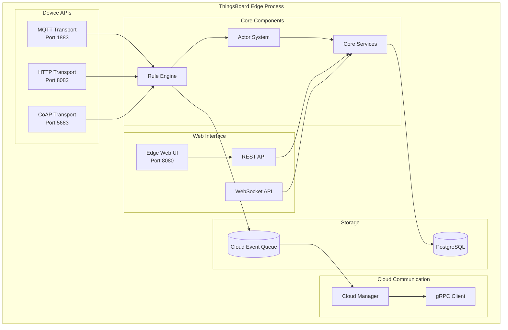
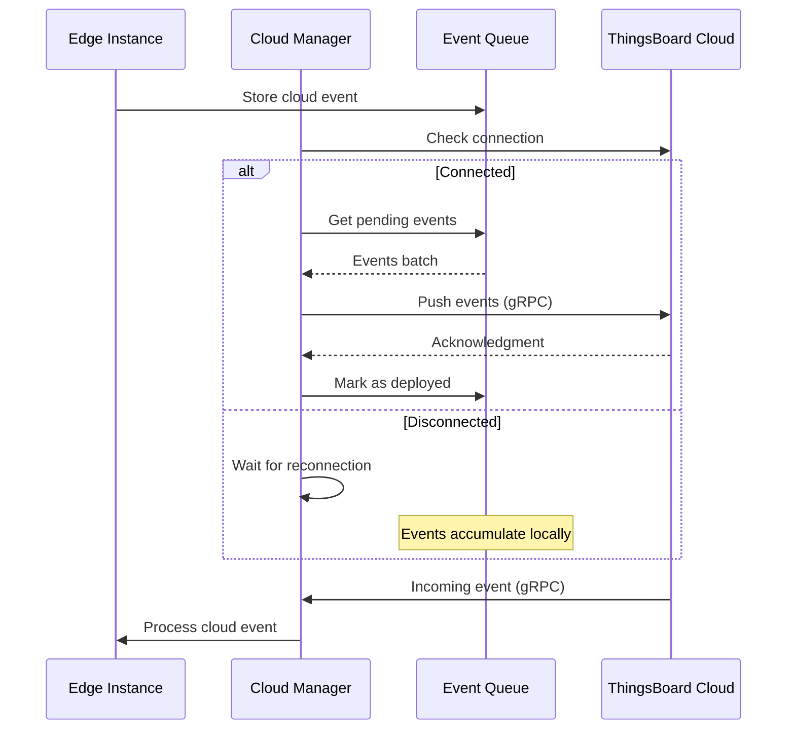
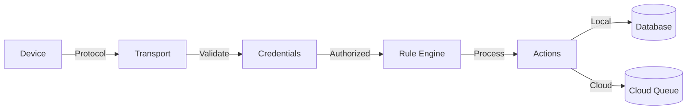
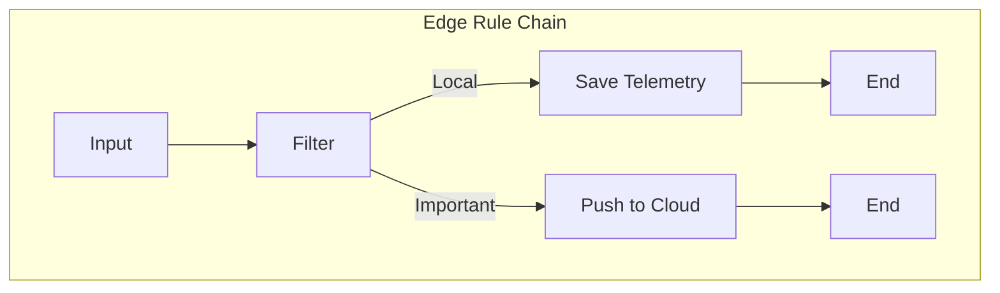
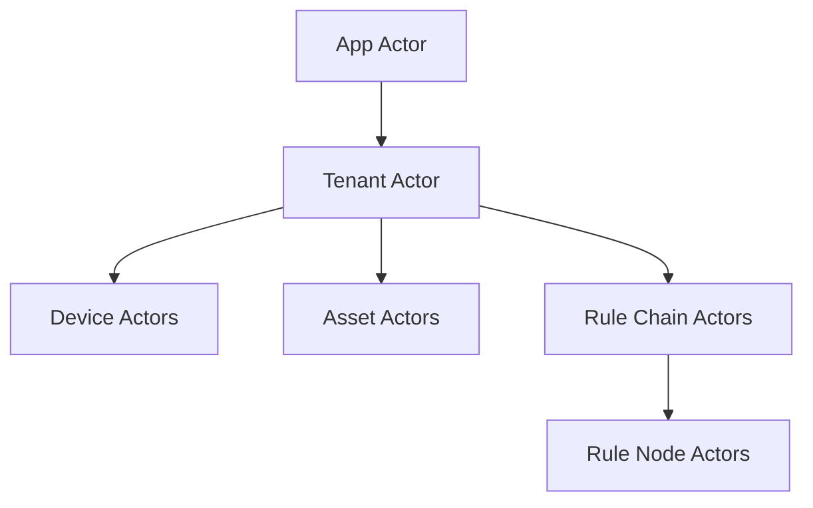
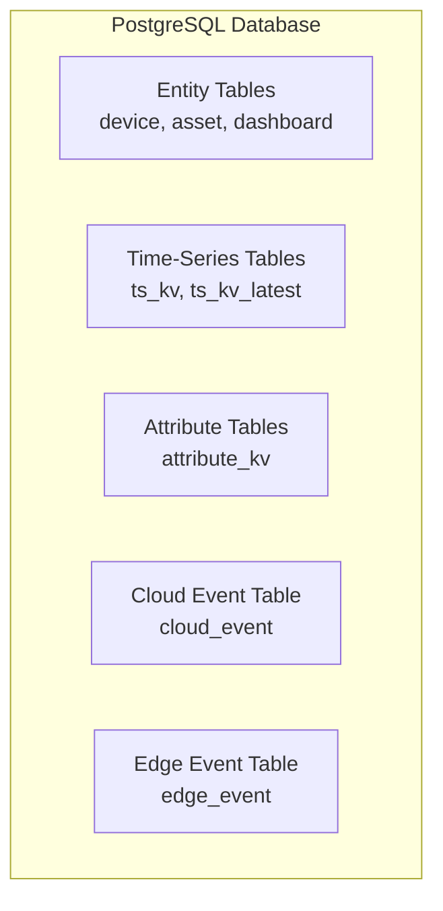
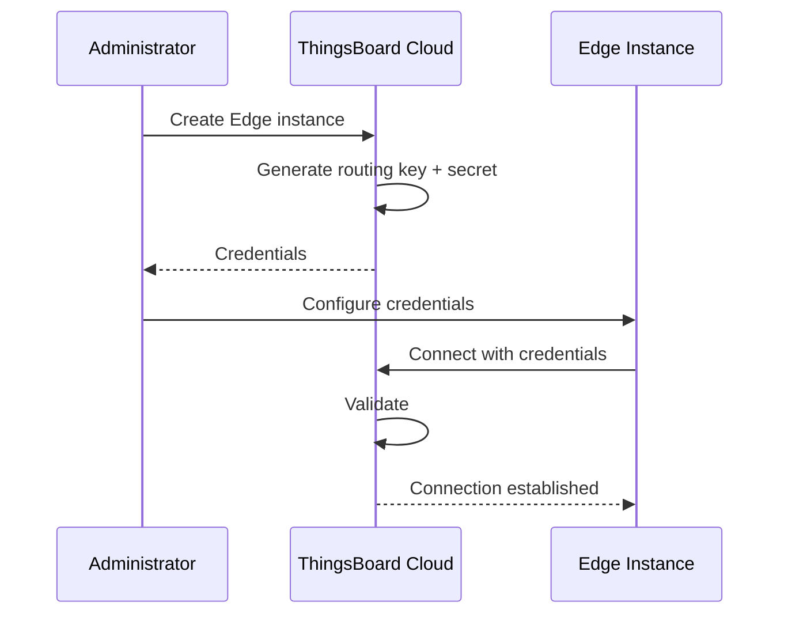
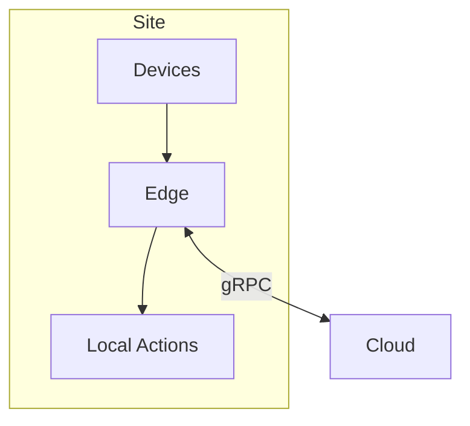
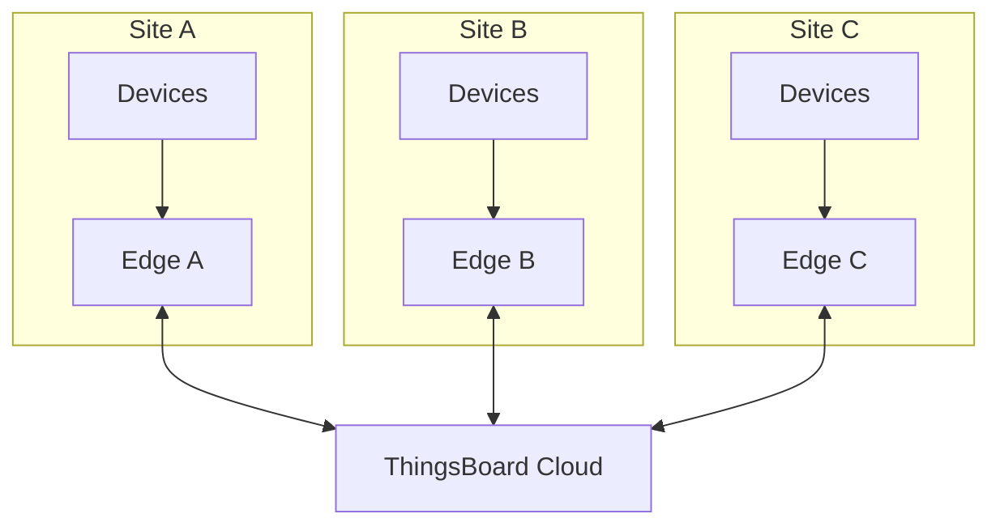
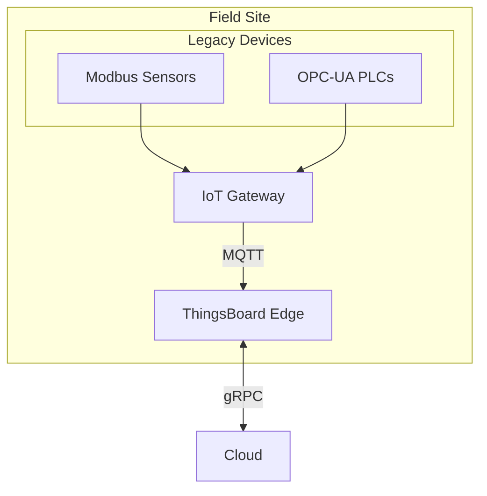

# Edge Architecture

## Overview

ThingsBoard Edge runs as a single Java Virtual Machine (JVM) process containing all necessary components for local IoT data processing. The architecture mirrors the cloud platform but is optimized for constrained environments, running with as little as 256 MB of RAM. Edge instances maintain bidirectional communication with the cloud through gRPC while operating independently during connectivity loss.

## Key Behaviors

1. **Single JVM Deployment**: All components run within one process, sharing OS resources for efficiency.

2. **Local Persistence**: Events and data are stored locally, ensuring no data loss during network outages.

3. **Cloud Synchronization**: The Cloud Manager handles bidirectional sync over gRPC with automatic reconnection.

4. **Standard APIs**: Edge exposes the same REST, WebSocket, MQTT, HTTP, and CoAP APIs as the cloud platform.

5. **Actor-Based Processing**: Rule engine uses the same actor model as the server for consistency.

## Component Architecture



## Component Descriptions

### Cloud Manager Service

The Cloud Manager maintains the connection between Edge and the cloud ThingsBoard server.

**Responsibilities:**
- Establish and maintain gRPC connection to cloud
- Push local events to cloud when connectivity is available
- Receive and process events from cloud (entity updates, RPC commands)
- Queue events during offline periods
- Handle authentication using routing key and secret

**Connection Flow:**



**Configuration:**

| Parameter | Description | Default |
|-----------|-------------|---------|
| CLOUD_ROUTING_KEY | Edge routing key | Generated |
| CLOUD_ROUTING_SECRET | Edge secret | Generated |
| CLOUD_RPC_HOST | Cloud server hostname | - |
| CLOUD_RPC_PORT | gRPC port | 7070 |
| CLOUD_RPC_SSL_ENABLED | Enable TLS | false |

### Transport Components

Edge supports the same device protocols as the cloud platform:

| Protocol | Port | Description |
|----------|------|-------------|
| MQTT | 1883 | Primary IoT protocol, supports QoS 0/1/2 |
| MQTT/TLS | 8883 | Encrypted MQTT |
| HTTP | 8082 | REST-based device API |
| CoAP | 5683 | UDP-based for constrained devices |
| CoAP/DTLS | 5684 | Encrypted CoAP |

**Transport Data Flow:**



### Rule Engine Component

The Edge rule engine processes messages using the same actor-based architecture as the server.

**Key Differences from Server:**
- Uses rule chain templates instead of standard rule chains
- Includes edge-specific nodes (Push to Cloud, Push to Edge)
- Local-only processing by default
- Can selectively sync results to cloud

**Edge-Specific Rule Nodes:**

| Node | Description |
|------|-------------|
| Push to Cloud | Forward message/telemetry to cloud |
| Push to Edge | (Server-side) Send data to edge instance |



### Core Services

Core services handle API requests and entity management.

**Responsibilities:**
- REST API endpoints (port 8080)
- WebSocket subscriptions for real-time data
- Device session management
- Connectivity status tracking
- Entity CRUD operations

**Actor Hierarchy:**



### Edge Web UI

A lightweight web interface built with Express.js serves the Angular application.

**Characteristics:**
- Stateless serving of static assets
- Connects to REST/WebSocket APIs
- Same UI as cloud (subset of features)
- Accessible at port 8080

## Data Storage

Edge uses PostgreSQL for local persistence:



### Cloud Event Queue

Events pending synchronization are stored in the `cloud_event` table:

| Column | Type | Description |
|--------|------|-------------|
| id | UUID | Event identifier |
| tenant_id | UUID | Tenant |
| entity_type | VARCHAR | Entity type |
| entity_id | UUID | Entity identifier |
| action | VARCHAR | Event action (ADDED, UPDATED, etc.) |
| entity_body | TEXT | JSON payload |
| ts | BIGINT | Timestamp |
| status | VARCHAR | PENDING or DEPLOYED |

## Security

### Authentication

Edge uses a routing key/secret pair for cloud authentication:



### TLS/SSL

For secure communication:
- gRPC can use TLS for cloud connection
- MQTT/CoAP support TLS/DTLS for device connections
- Web UI can be configured with HTTPS

## Resource Optimization

### Memory Management

Edge is designed for constrained environments:

| Configuration | RAM | Devices | Use Case |
|---------------|-----|---------|----------|
| Minimal | 256 MB | ~100 | Simple data collection |
| Standard | 512 MB | ~500 | Local processing |
| Full | 1+ GB | ~1000 | Complex rule chains |

**JVM Options for Constrained Environments:**

```
-Xms256m -Xmx256m
-XX:+UseG1GC
-XX:MaxGCPauseMillis=100
```

### Storage Management

- Time-series data can be configured with TTL
- Cloud events are cleaned after successful sync
- Local database can use embedded PostgreSQL

## Deployment Topology

### Single Edge



### Multi-Edge Deployment



### Edge with Gateway



## Common Pitfalls

Edge deployment architecture decisions directly impact system reliability and performance. Missteps in resource allocation, component configuration, security setup, and topology design can lead to data loss, security vulnerabilities, and operational failures. The pitfalls below cover four critical areas where architecture choices have significant consequences.

### Resource Constraints

| Pitfall | Impact | Detection | Solution |
|---------|--------|-----------|----------|
| Process memory undersized for workload | Out of memory crashes, slow GC, unresponsive UI | OOM errors in logs, heap dump files, UI timeouts >30s | Calculate: base (256MB) + devices×0.5MB + rule_chains×10MB. Monitor heap with JMX, set -Xmx conservatively |
| Storage exhaustion during extended offline | Queue overflow, telemetry drops, sync failures | Disk >95%, "No space left on device" errors, dropped messages | Provision: expected_offline_hours × event_rate × 2KB per event. Enable TTL on telemetry, monitor disk usage |
| CPU saturation with concurrent rule chains | Message processing delays, queue backlog, timeout errors | CPU >90% sustained, rule engine queue depth >5000, latency spikes | Profile rule chain complexity. Limit concurrent chains with actor.rule.dispatcher.pool_size. Consider cloud offload |
| Device connection limit reached | New devices cannot connect, transport errors, auth failures | "Too many connections" errors, rejection at transport layer | Check OS file descriptor limit (ulimit -n). Tune connection pool: transport.sessions.max_per_host |

### Component Configuration

| Pitfall | Impact | Detection | Solution |
|---------|--------|-----------|----------|
| Actor dispatcher thread pool misconfigured | Message queue buildup, slow processing, deadlocks | Actor mailbox size growing, slow rule chain execution | Match pool size to CPU cores: actor.dispatcher.pool_size = CPU_cores × 2. Monitor actor queue depths |
| Database connection pool exhausted | Failed queries, "Connection timeout" errors, API failures | Connection wait time >1s, pool exhausted warnings | Calculate: concurrent_users + rule_chains + transports. Set spring.datasource.hikari.maximum-pool-size = calculated + 20% |
| Transport buffer size too small | Message truncation, parsing errors, device disconnects | "Buffer overflow" errors, incomplete JSON payloads | Increase transport.mqtt.netty.max_payload_size for large telemetry. Balance memory cost vs message size |
| Queue type selection mismatch | Data loss (in-memory) or slow performance (persistent) | High latency with persistent queue, missing data with in-memory | Development: in-memory. Production with HA: PostgreSQL queue. Match persistence needs to reliability requirements |

### Security Configuration

| Pitfall | Impact | Detection | Solution |
|---------|--------|-----------|----------|
| Unencrypted gRPC to cloud | Credentials exposed, data interception, compliance violation | Network traffic unencrypted (Wireshark shows plaintext) | Enable CLOUD_RPC_SSL_ENABLED=true, provide valid cert/key. Verify with `openssl s_client -connect cloud:7070` |
| Edge credentials stored in plaintext | Credential theft, unauthorized cloud access | Configuration files world-readable, credentials in environment | Use secret management (Docker secrets, Kubernetes secrets, HashiCorp Vault). Set file permissions 600 |
| Device transport ports exposed publicly | Brute force attacks, unauthorized device provisioning | SSH/telnet attempts in logs, unknown devices appearing | Firewall rules: allow devices from internal network only. Use VPN for remote device access. Enable device auth |

### Deployment Topology

| Pitfall | Impact | Detection | Solution |
|---------|--------|-----------|----------|
| Single edge as single point of failure | Total site outage on edge failure, no redundancy | No failover capability, complete data loss on hardware failure | Critical deployments: deploy paired edges with entity duplication. Use external load balancer for device connections |
| Multi-edge with overlapping device assignments | Duplicate telemetry, conflicting commands, sync conflicts | Same device ID appears on multiple edges, duplicate cloud data | Design clear device-to-edge mapping. Use entity groups to partition devices by edge. Document assignment strategy |
| Gateway creates processing bottleneck | High latency, message queue buildup at gateway, device timeouts | Gateway CPU >80%, message delays >1s, device buffering | Scale gateway horizontally or deploy multiple gateways per edge. Profile gateway connectors, optimize polling intervals |

**Detailed Example 1: Process Memory Exhaustion with Complex Rule Chains**

**Problem**: Edge deployed with standard 512MB heap experiences OutOfMemoryError crashes every few hours. Rule chains perform JSON transformation, external REST API calls, and maintain stateful aggregations across multiple devices. Crashes occur unpredictably, often during peak telemetry periods.

**Why This Happens**: Rule engine allocates memory for:
- Actor mailboxes (queue of pending messages per rule chain)
- Script execution contexts (JavaScript/Groovy runtime environments)
- External API response buffers
- Stateful nodes maintaining aggregation windows

A single script node processing 100 msg/sec might allocate 50MB for script contexts. With 5 concurrent rule chains, memory requirements multiply. Heap pressure increases with message rate, and garbage collection cannot keep pace, eventually leading to OOM.

**Detection**:
- Application logs show `java.lang.OutOfMemoryError: Java heap space`
- Heap dumps generated automatically: `/var/log/tb-edge/heap-dump-*.hprof`
- JMX metrics show heap usage >90% for extended periods: `jmx.memory.heap.used / jmx.memory.heap.max > 0.9`
- GC logs show frequent full GC cycles with minimal memory recovery
- Edge status shows periodic disconnect/reconnect pattern aligned with crashes

**Solution**:
1. **Immediate mitigation** - Increase heap and restart:
   ```bash
   # Edit /etc/tb-edge/conf/tb-edge.conf or docker-compose.yml
   export JAVA_OPTS="-Xms1024m -Xmx2048m -XX:+UseG1GC -XX:+HeapDumpOnOutOfMemoryError"
   systemctl restart tb-edge
   ```

2. **Analyze heap dump** to identify memory consumers:
   ```bash
   # Use jhat, VisualVM, or Eclipse MAT
   jhat /var/log/tb-edge/heap-dump-<timestamp>.hprof
   # Look for large collections, retained script contexts, unclosed connections
   ```

3. **Optimize rule chains**:
   - **Stateless nodes**: Replace stateful aggregation with time-window queries
   - **Script optimization**: Reuse script contexts, avoid creating large objects in loops
   - **API calls**: Cache responses, use connection pooling, implement circuit breakers
   - **Cloud offload**: Move non-critical processing to cloud, keep only latency-sensitive local

4. **Right-size memory allocation formula**:
   ```
   Base: 256MB (edge platform)
   + Devices: num_devices × 0.5MB (actor overhead)
   + Rule chains: num_chains × 10MB (typical)
   + Script nodes: num_script_nodes × 30MB (runtime)
   + Buffer: 20% headroom

   Example: 200 devices, 3 rule chains, 2 script nodes
   = 256 + (200×0.5) + (3×10) + (2×30) + 20% headroom
   = 256 + 100 + 30 + 60 = 446MB → round to 512MB + 20% = 614MB
   → Provision 1GB for safety
   ```

5. **Monitor continuously**:
   ```yaml
   # Enable JMX monitoring
   monitoring:
     enabled: true
     jmx:
       enabled: true
       port: 9999

   # Set up Prometheus alerts
   - alert: EdgeHeapHighUsage
     expr: jvm_memory_used_bytes{area="heap"} / jvm_memory_max_bytes{area="heap"} > 0.85
     for: 5m
   ```

**Detailed Example 2: Database Connection Pool Exhaustion Under Load**

**Problem**: During peak hours with 50+ concurrent dashboard users and active rule chains, Edge REST API becomes unresponsive. Users see "504 Gateway Timeout" errors. Database logs show connections waiting for >10 seconds. Issue resolves after traffic decreases.

**Why This Happens**: Every REST API request, WebSocket subscription, and rule chain database interaction requires a connection from the pool. Default pool size (often 10-20 connections) is sized for light usage. Under load:
- 50 dashboard users × 3 WebSocket subscriptions each = 150 connection demands
- 5 active rule chains × 2 database nodes each = 10 connections
- REST API requests queued waiting for available connections
- Connections held longer due to slow queries on constrained hardware

Eventually all connections are in-use, new requests wait indefinitely, and timeouts cascade through the system.

**Detection**:
- Application logs show `HikariPool-1 - Connection is not available, request timed out after 30000ms`
- Slow query logs in PostgreSQL: queries taking >1s
- API response times exceed 5-10s (measured via /api/auth/user endpoint)
- Database monitoring shows active connections = max connections for extended periods
- WebSocket connections show `SQLException: Cannot get connection`

**Solution**:
1. **Immediate increase** of connection pool:
   ```yaml
   # /etc/tb-edge/conf/tb-edge.yml
   spring:
     datasource:
       hikari:
         maximum-pool-size: 50        # Increase from default 20
         connection-timeout: 30000    # 30s timeout
         idle-timeout: 600000         # 10min idle
         max-lifetime: 1800000        # 30min max lifetime
         minimum-idle: 10             # Keep 10 ready
   ```

2. **Calculate appropriate pool size**:
   ```
   Concurrent users: 50
   Rule chains: 5 × 2 nodes = 10
   Transports: 3 × 2 connections = 6
   Background tasks: 5
   Buffer: 30% headroom

   Total = (50 + 10 + 6 + 5) × 1.3 = 92 connections

   BUT: Check PostgreSQL max_connections limit first
   max_connections >= edge_pool_size + cloud_app_connections + buffer
   ```

3. **Tune PostgreSQL**:
   ```sql
   -- Verify current limits
   SHOW max_connections;  -- Should be >= 150 for this example

   -- Increase if needed (requires restart)
   -- /etc/postgresql/14/main/postgresql.conf
   max_connections = 200
   shared_buffers = 256MB  -- 25% of available RAM for DB
   ```

4. **Optimize query performance** to reduce connection hold time:
   ```sql
   -- Identify slow queries
   SELECT query, mean_exec_time, calls
   FROM pg_stat_statements
   ORDER BY mean_exec_time DESC LIMIT 10;

   -- Add missing indexes on frequent queries
   CREATE INDEX CONCURRENTLY idx_ts_kv_entity_time
   ON ts_kv(entity_id, key, ts);
   ```

5. **Implement connection monitoring**:
   ```yaml
   # Expose Hikari metrics
   management:
     endpoints:
       web:
         exposure:
           include: health,metrics,hikaricp
     metrics:
       export:
         prometheus:
           enabled: true

   # Alert on pool exhaustion
   - alert: EdgeConnectionPoolExhausted
     expr: hikaricp_connections_active / hikaricp_connections_max > 0.9
     for: 2m
   ```

**Prevention**:
- Load test before production: simulate concurrent users + device traffic
- Monitor connection pool metrics continuously
- Set up alerting on >80% pool utilization
- Document connection pool sizing in deployment runbook

**Detailed Example 3: Multi-Edge Deployment with Entity Assignment Conflicts**

**Problem**: Manufacturing facility has 3 edge instances across different production lines. Some devices appear to be assigned to multiple edges, causing duplicate telemetry in cloud dashboards and conflicting RPC commands (e.g., machine receives "start" and "stop" simultaneously from different edges).

**Why This Happens**: During initial deployment, operators assigned entire device groups to edges without verifying exclusivity. A device with same ID exists in multiple edges' entity assignments. Both edges report telemetry for the same device ID to cloud. Cloud attributes/RPC commands may route to wrong edge. This violates the design assumption that each device belongs to exactly one edge.

**Detection**:
- Cloud dashboard shows duplicate telemetry points for same device at same timestamp
- Device attributes update with conflicting values every few seconds
- RPC commands fail intermittently: "Device not found" or "Timeout"
- Cloud logs show: `Received telemetry for device X from edge A and edge B`
- Query cloud database:
  ```sql
  -- Find devices assigned to multiple edges
  SELECT device_id, COUNT(DISTINCT edge_id) as edge_count
  FROM device_edge_assignment
  GROUP BY device_id
  HAVING COUNT(DISTINCT edge_id) > 1;
  ```

**Solution**:
1. **Immediate remediation** - Identify and fix overlaps:
   ```sql
   -- List affected devices
   SELECT d.name, d.id, array_agg(e.name) as assigned_edges
   FROM device d
   JOIN device_edge_assignment dea ON d.id = dea.device_id
   JOIN edge e ON dea.edge_id = e.id
   GROUP BY d.name, d.id
   HAVING COUNT(DISTINCT dea.edge_id) > 1;

   -- Unassign device from incorrect edge
   -- (Do this via UI or API, not direct SQL)
   ```

2. **Design clear device-to-edge mapping strategy**:
   ```
   Option A: Physical Location
   - Production Line 1 devices → Edge A
   - Production Line 2 devices → Edge B
   - Quality Control devices → Edge C

   Option B: Device Type
   - Temperature sensors → Edge A (local analytics)
   - PLCs → Edge B (control systems)
   - Cameras → Edge C (video processing)

   Option C: Entity Groups
   - Create entity groups per edge
   - Assign entire group to edge
   - Enforce: device can only be in one edge-group
   ```

3. **Implement assignment validation**:
   ```python
   # Pre-assignment validation script
   def validate_device_assignment(device_id, target_edge_id):
       # Check if device already assigned to ANY edge
       existing = api.get_device_edge_assignments(device_id)

       if existing:
           raise ValidationError(
               f"Device {device_id} already assigned to edge {existing.edge_id}. "
               f"Unassign first before assigning to {target_edge_id}"
           )

       # Proceed with assignment
       api.assign_device_to_edge(device_id, target_edge_id)
   ```

4. **Document assignment rules** in deployment runbook:
   ```markdown
   ## Device Assignment Rules

   1. **Exclusivity**: Each device assigned to exactly ONE edge
   2. **Location-based**: Map devices to edge by physical location
   3. **Verification**: Before assignment, verify device not already assigned:
      `GET /api/edge/devices/{deviceId}/edges` → should return empty
   4. **Reassignment**: To move device to different edge:
      a. Unassign from current edge
      b. Wait for sync completion (check cloud events)
      c. Assign to new edge
   5. **Bulk assignment**: Use entity groups to assign multiple devices atomically
   ```

5. **Monitoring and alerting**:
   ```sql
   -- Daily automated check for conflicts
   CREATE OR REPLACE FUNCTION check_edge_device_conflicts()
   RETURNS TABLE(device_name TEXT, edge_names TEXT[]) AS $$
   BEGIN
       RETURN QUERY
       SELECT d.name, array_agg(e.name)
       FROM device d
       JOIN device_edge_assignment dea ON d.id = dea.device_id
       JOIN edge e ON dea.edge_id = e.id
       GROUP BY d.name
       HAVING COUNT(DISTINCT dea.edge_id) > 1;
   END;
   $$ LANGUAGE plpgsql;

   -- Alert if conflicts detected
   -- Run via cron: 0 8 * * * psql -c "SELECT * FROM check_edge_device_conflicts();"
   ```

**Prevention Best Practices**:
- Use entity groups to partition devices logically
- Implement assignment validation in deployment scripts
- Document device-to-edge mapping in wiki/Confluence
- Train operators on assignment rules
- Audit assignments monthly for drift

## See Also

- [Cloud Synchronization](./cloud-synchronization.md) - Sync protocol details
- [Rule Chain Templates](./rule-chain-templates.md) - Template provisioning
- [Actor System](../03-actor-system/README.md) - Actor model details
- [Transport Layer](../05-transport-layer/README.md) - Protocol implementations
