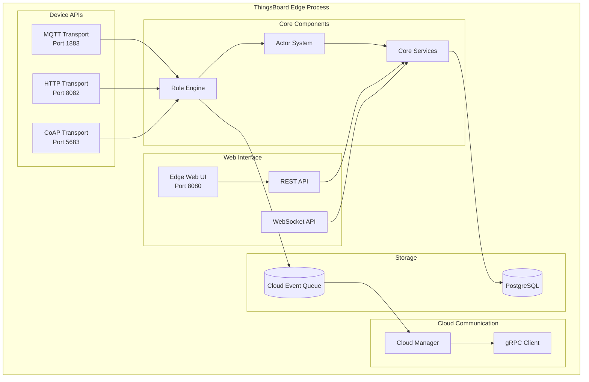
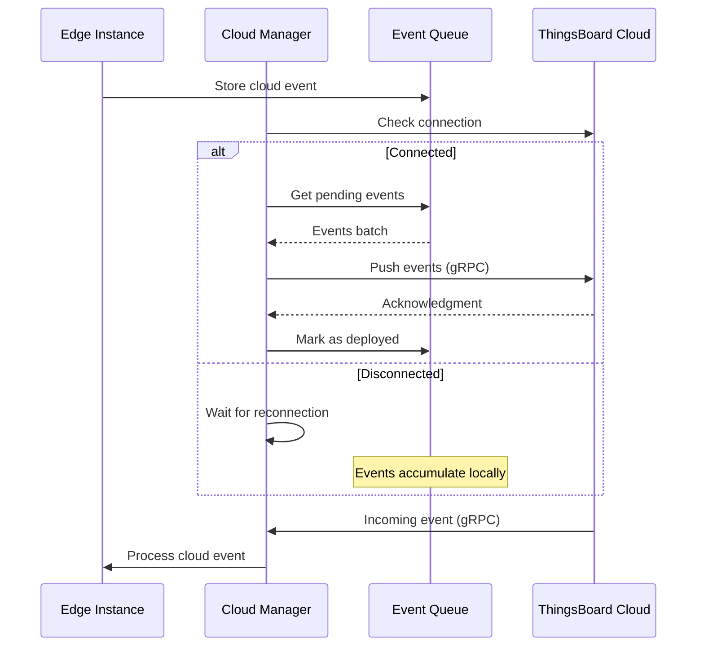
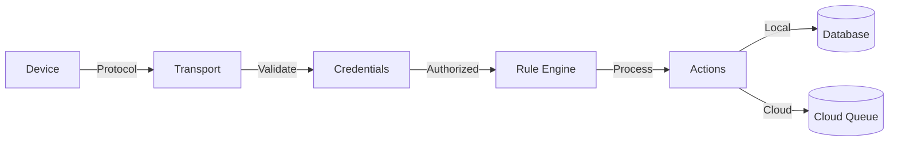
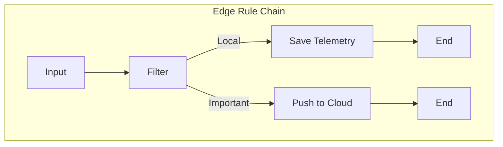
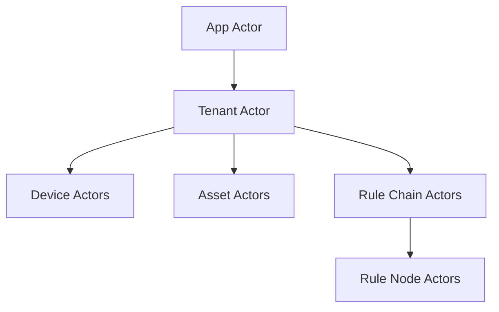
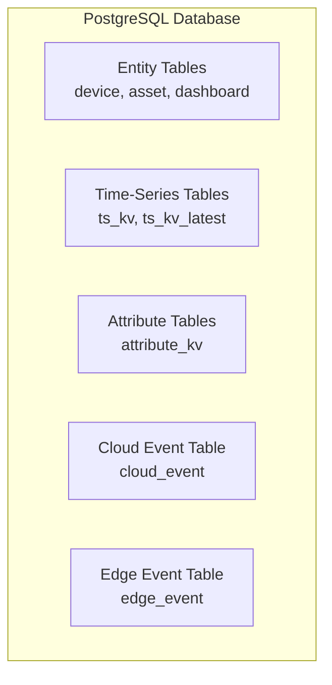
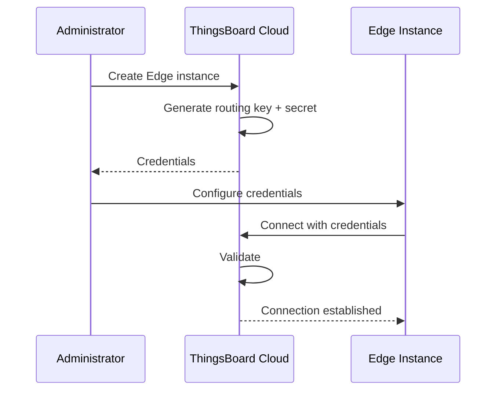
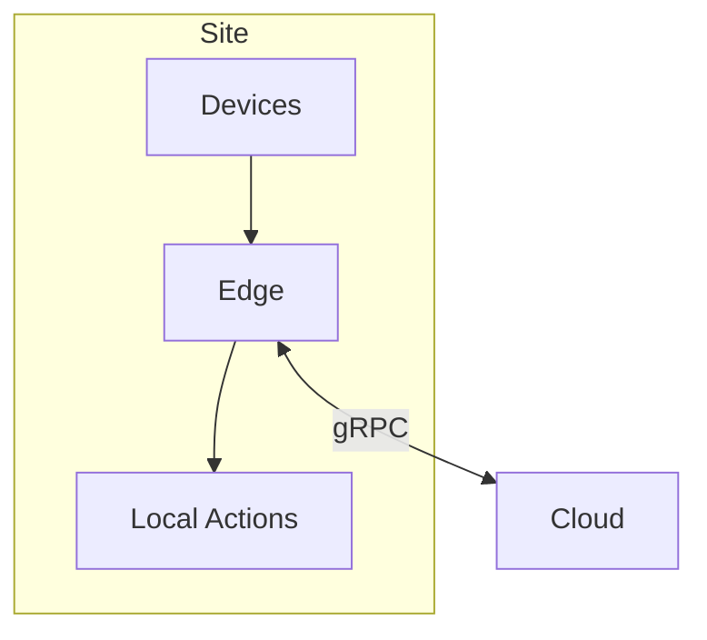
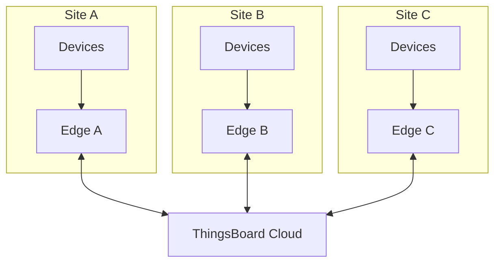
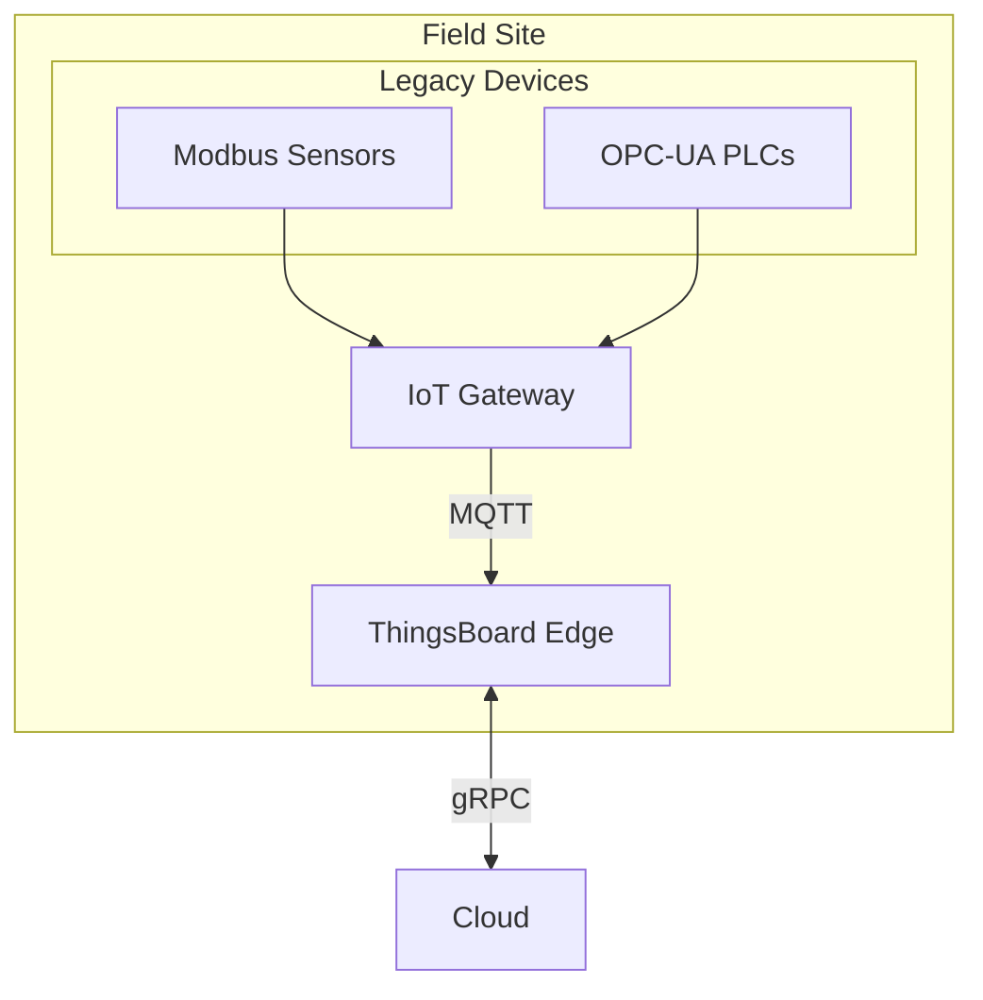

# Edge Architecture

## Overview

ThingsBoard Edge runs as a single Java Virtual Machine (JVM) process containing all necessary components for local IoT data processing. The architecture mirrors the cloud platform but is optimized for constrained environments, running with as little as 256 MB of RAM. Edge instances maintain bidirectional communication with the cloud through gRPC while operating independently during connectivity loss.

## Key Behaviors

1. **Single JVM Deployment**: All components run within one process, sharing OS resources for efficiency.

2. **Local Persistence**: Events and data are stored locally, ensuring no data loss during network outages.

3. **Cloud Synchronization**: The Cloud Manager handles bidirectional sync over gRPC with automatic reconnection.

4. **Standard APIs**: Edge exposes the same REST, WebSocket, MQTT, HTTP, and CoAP APIs as the cloud platform.

5. **Actor-Based Processing**: Rule engine uses the same actor model as the server for consistency.

## Component Architecture



## Component Descriptions

### Cloud Manager Service

The Cloud Manager maintains the connection between Edge and the cloud ThingsBoard server.

**Responsibilities:**
- Establish and maintain gRPC connection to cloud
- Push local events to cloud when connectivity is available
- Receive and process events from cloud (entity updates, RPC commands)
- Queue events during offline periods
- Handle authentication using routing key and secret

**Connection Flow:**



**Configuration:**

| Parameter | Description | Default |
|-----------|-------------|---------|
| CLOUD_ROUTING_KEY | Edge routing key | Generated |
| CLOUD_ROUTING_SECRET | Edge secret | Generated |
| CLOUD_RPC_HOST | Cloud server hostname | - |
| CLOUD_RPC_PORT | gRPC port | 7070 |
| CLOUD_RPC_SSL_ENABLED | Enable TLS | false |

### Transport Components

Edge supports the same device protocols as the cloud platform:

| Protocol | Port | Description |
|----------|------|-------------|
| MQTT | 1883 | Primary IoT protocol, supports QoS 0/1/2 |
| MQTT/TLS | 8883 | Encrypted MQTT |
| HTTP | 8082 | REST-based device API |
| CoAP | 5683 | UDP-based for constrained devices |
| CoAP/DTLS | 5684 | Encrypted CoAP |

**Transport Data Flow:**



### Rule Engine Component

The Edge rule engine processes messages using the same actor-based architecture as the server.

**Key Differences from Server:**
- Uses rule chain templates instead of standard rule chains
- Includes edge-specific nodes (Push to Cloud, Push to Edge)
- Local-only processing by default
- Can selectively sync results to cloud

**Edge-Specific Rule Nodes:**

| Node | Description |
|------|-------------|
| Push to Cloud | Forward message/telemetry to cloud |
| Push to Edge | (Server-side) Send data to edge instance |



### Core Services

Core services handle API requests and entity management.

**Responsibilities:**
- REST API endpoints (port 8080)
- WebSocket subscriptions for real-time data
- Device session management
- Connectivity status tracking
- Entity CRUD operations

**Actor Hierarchy:**



### Edge Web UI

A lightweight web interface built with Express.js serves the Angular application.

**Characteristics:**
- Stateless serving of static assets
- Connects to REST/WebSocket APIs
- Same UI as cloud (subset of features)
- Accessible at port 8080

## Data Storage

Edge uses PostgreSQL for local persistence:



### Cloud Event Queue

Events pending synchronization are stored in the `cloud_event` table:

| Column | Type | Description |
|--------|------|-------------|
| id | UUID | Event identifier |
| tenant_id | UUID | Tenant |
| entity_type | VARCHAR | Entity type |
| entity_id | UUID | Entity identifier |
| action | VARCHAR | Event action (ADDED, UPDATED, etc.) |
| entity_body | TEXT | JSON payload |
| ts | BIGINT | Timestamp |
| status | VARCHAR | PENDING or DEPLOYED |

## Security

### Authentication

Edge uses a routing key/secret pair for cloud authentication:



### TLS/SSL

For secure communication:
- gRPC can use TLS for cloud connection
- MQTT/CoAP support TLS/DTLS for device connections
- Web UI can be configured with HTTPS

## Resource Optimization

### Memory Management

Edge is designed for constrained environments:

| Configuration | RAM | Devices | Use Case |
|---------------|-----|---------|----------|
| Minimal | 256 MB | ~100 | Simple data collection |
| Standard | 512 MB | ~500 | Local processing |
| Full | 1+ GB | ~1000 | Complex rule chains |

**JVM Options for Constrained Environments:**

```
-Xms256m -Xmx256m
-XX:+UseG1GC
-XX:MaxGCPauseMillis=100
```

### Storage Management

- Time-series data can be configured with TTL
- Cloud events are cleaned after successful sync
- Local database can use embedded PostgreSQL

## Deployment Topology

### Single Edge



### Multi-Edge Deployment



### Edge with Gateway



## See Also

- [Cloud Synchronization](./cloud-synchronization.md) - Sync protocol details
- [Rule Chain Templates](./rule-chain-templates.md) - Template provisioning
- [Actor System](../03-actor-system/README.md) - Actor model details
- [Transport Layer](../05-transport-layer/README.md) - Protocol implementations
