# Rule Chain Templates

## Overview

Rule chain templates are server-defined processing pipelines designed for deployment to Edge instances. Unlike standard rule chains that execute on the server, templates serve as blueprints that are provisioned to edges where they run locally. Starting with Edge 4.0, rule chains can also be created directly on the edge instance. Templates enable centralized management of edge processing logic across distributed deployments.

## Key Behaviors

1. **Server-Side Definition**: Templates are created and edited on the ThingsBoard server.

2. **Edge Deployment**: Templates are assigned to specific edge instances for execution.

3. **Local Execution**: Once deployed, rule chains process data locally on the edge.

4. **Synchronized Updates**: Template changes on the server propagate to assigned edges.

5. **Edge-Local Creation**: Edge 4.0+ supports creating rule chains directly on the edge.

## Template vs Standard Rule Chain

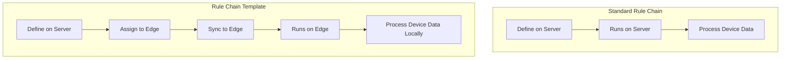

| Aspect | Standard Rule Chain | Rule Chain Template |
|--------|--------------------|--------------------|
| Defined on | Server | Server |
| Executes on | Server | Edge |
| Location | Rule Chains menu | Edge Management > Rule Chain Templates |
| Scope | All server devices | Assigned edge devices |
| Data location | Cloud | Edge (local) |

## Template Management

### Creating Templates on Server

Templates are managed in the **Edge Management > Rule Chain Templates** section:

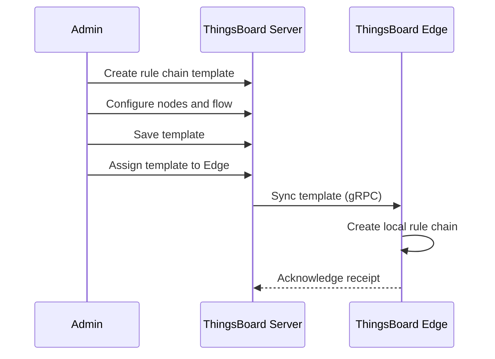

### Creating Rule Chains on Edge (v4.0+)

Edge instances can create local rule chains:

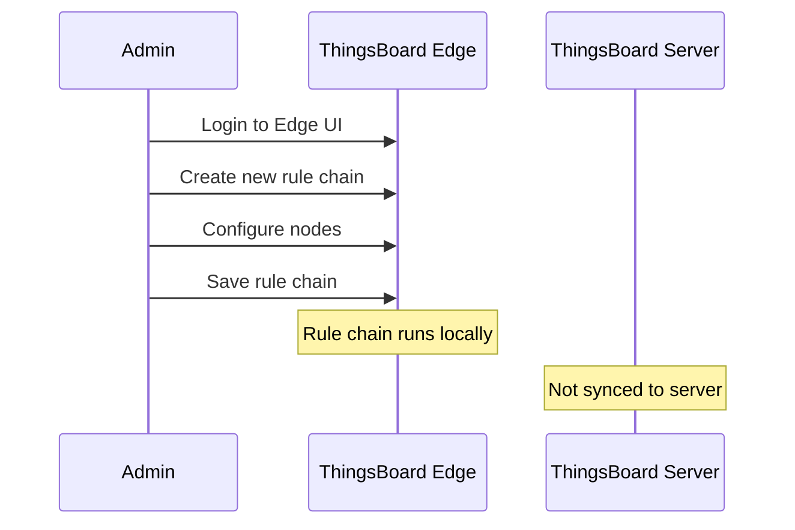

## Template Assignment

### Assigning to Edge

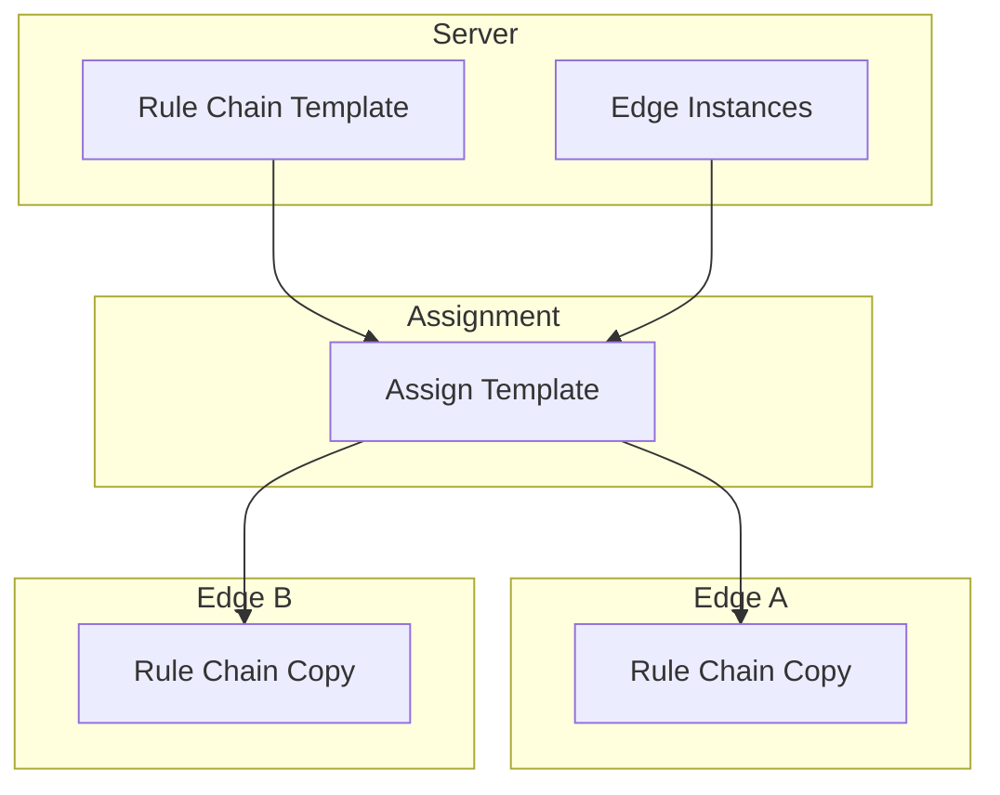

### Managing Edge Rule Chains

From the server, navigate to:
1. **Edge Management > Instances**
2. Select edge instance
3. Click **Manage Edge Rule Chains**
4. Assign or unassign templates

## Edge-Specific Rule Nodes

Templates can use edge-specific nodes for cloud communication:

### Push to Cloud Node

Forwards messages or telemetry to the cloud server:

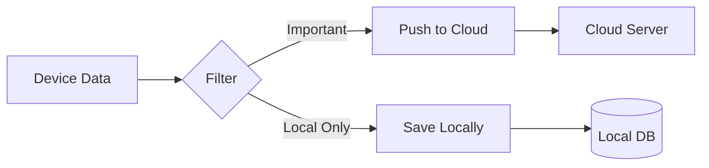

**Configuration:**

| Parameter | Description |
|-----------|-------------|
| Scope | TIMESERIES, ATTRIBUTES, or ENTITY |
| Entity types | Filter by entity type |
| Keys | Specific keys to push |

**Use Cases:**
- Forward aggregated data to cloud
- Push alarms to central monitoring
- Sync selected telemetry

### Push to Edge Node (Server-Side)

Used in server rule chains to send data to edge:

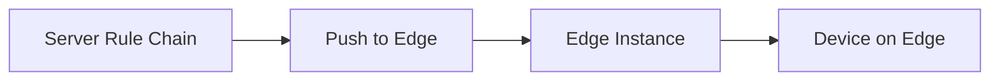

**Use Cases:**
- Send configuration updates
- Push server-side calculations to edge
- Distribute commands from cloud

## Common Template Patterns

### Local Processing with Cloud Sync

Process data locally, push summaries to cloud:

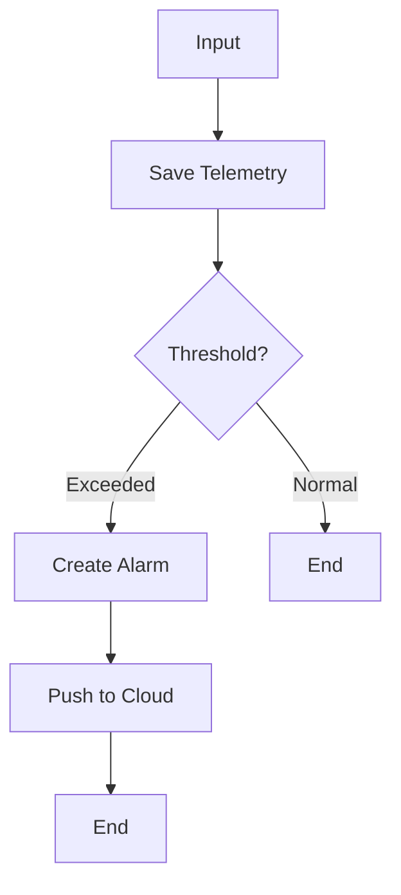

### Data Filtering and Aggregation

Reduce cloud traffic by filtering and aggregating:

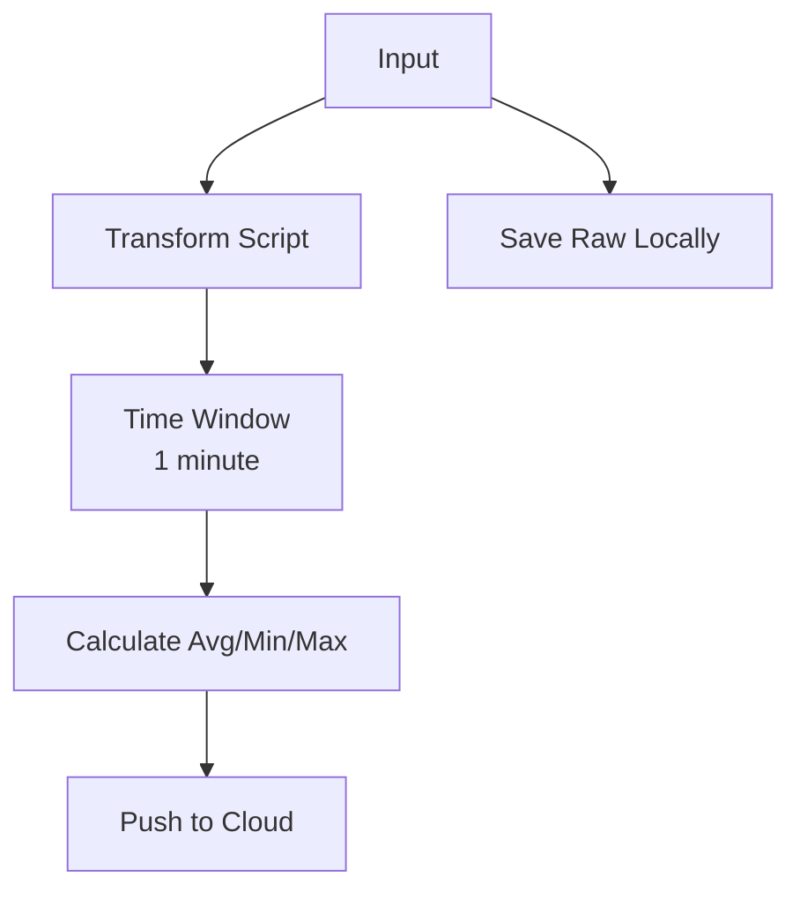

### Offline-Capable Alarming

Handle alarms locally even when cloud is unavailable:

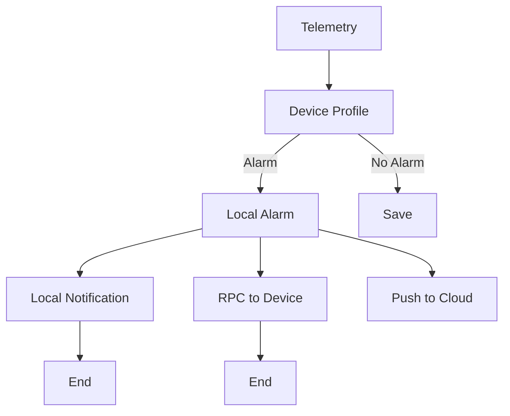

### Gateway Data Routing

Route data from gateway-connected devices:

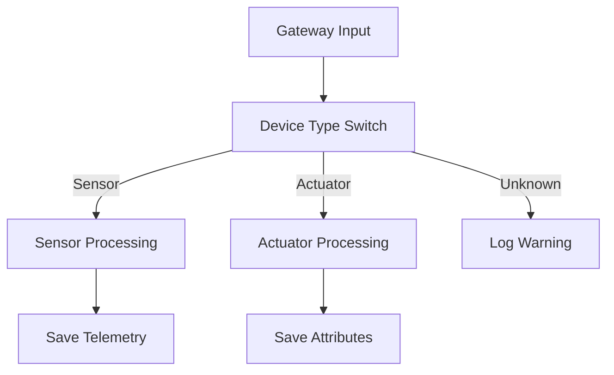

## Template Synchronization

### Initial Sync

When a template is first assigned:

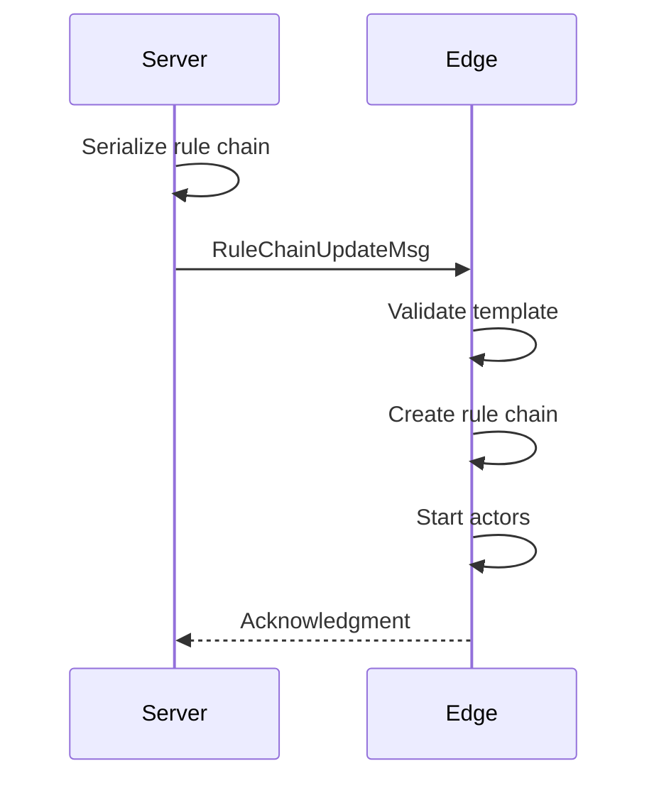

### Update Propagation

When a template is modified:

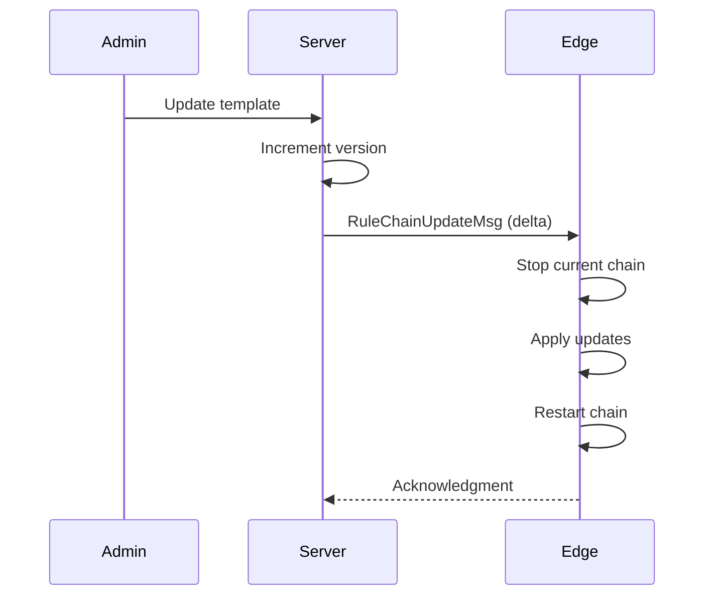

### Conflict Resolution

If edge has local modifications (v4.0+):

| Scenario | Resolution |
|----------|------------|
| Server template updated | Server version overwrites |
| Edge-local chain | Remains unchanged |
| Both modified | Server template takes precedence |

## Root Rule Chain

Each edge has a root rule chain that processes all incoming device messages:

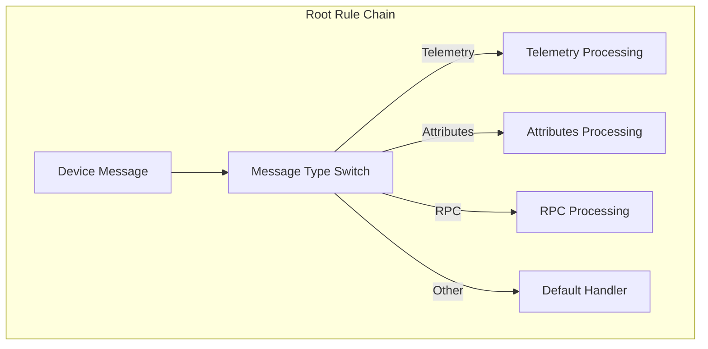

**Root Chain Behavior:**
- Automatically assigned to edge
- First chain to process all device data
- Can route to other rule chains
- Marked with "Root" flag

## Configuration Best Practices

### Design for Offline

- Avoid nodes that require cloud connectivity in critical paths
- Use "Push to Cloud" selectively, not for every message
- Implement local fallback for alarming and notifications

### Optimize for Resources

- Keep rule chains simple on resource-constrained edges
- Avoid complex JavaScript in transform nodes
- Use built-in nodes instead of scripts when possible

### Manage Template Versions

- Test templates on a single edge before broad deployment
- Use naming conventions (e.g., "v1.0 - Temperature Monitor")
- Document template purposes and configurations

## Debugging Templates

### Enable Debug Mode

Debug mode captures message flow on the edge:

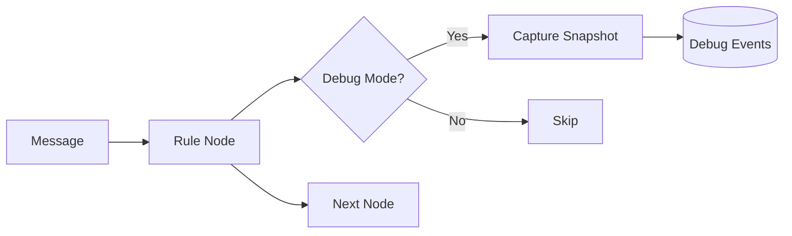

**Captured Information:**
- Input message
- Output message
- Relation type
- Processing time
- Errors

### Debug on Edge vs Cloud

| Debug Location | Visibility | Storage |
|----------------|------------|---------|
| Edge UI | Edge admin only | Local database |
| Server UI (template) | Server admin | Template definition only |

## See Also

- [Edge Architecture](./edge-architecture.md) - Component overview
- [Cloud Synchronization](./cloud-synchronization.md) - Sync protocol
- [Rule Engine](../04-rule-engine/README.md) - Rule chain concepts
- [Node Categories](../04-rule-engine/node-categories.md) - Available nodes
