# Rule Chain Templates

## Overview

Rule chain templates are server-defined processing pipelines designed for deployment to Edge instances. Unlike standard rule chains that execute on the server, templates serve as blueprints that are provisioned to edges where they run locally. Starting with Edge 4.0, rule chains can also be created directly on the edge instance. Templates enable centralized management of edge processing logic across distributed deployments.

## Key Behaviors

1. **Server-Side Definition**: Templates are created and edited on the ThingsBoard server.

2. **Edge Deployment**: Templates are assigned to specific edge instances for execution.

3. **Local Execution**: Once deployed, rule chains process data locally on the edge.

4. **Synchronized Updates**: Template changes on the server propagate to assigned edges.

5. **Edge-Local Creation**: Edge 4.0+ supports creating rule chains directly on the edge.

## Template vs Standard Rule Chain

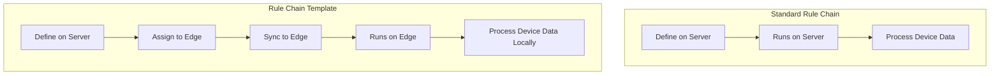

| Aspect | Standard Rule Chain | Rule Chain Template |
|--------|--------------------|--------------------|
| Defined on | Server | Server |
| Executes on | Server | Edge |
| Location | Rule Chains menu | Edge Management > Rule Chain Templates |
| Scope | All server devices | Assigned edge devices |
| Data location | Cloud | Edge (local) |

## Template Management

### Creating Templates on Server

Templates are managed in the **Edge Management > Rule Chain Templates** section:

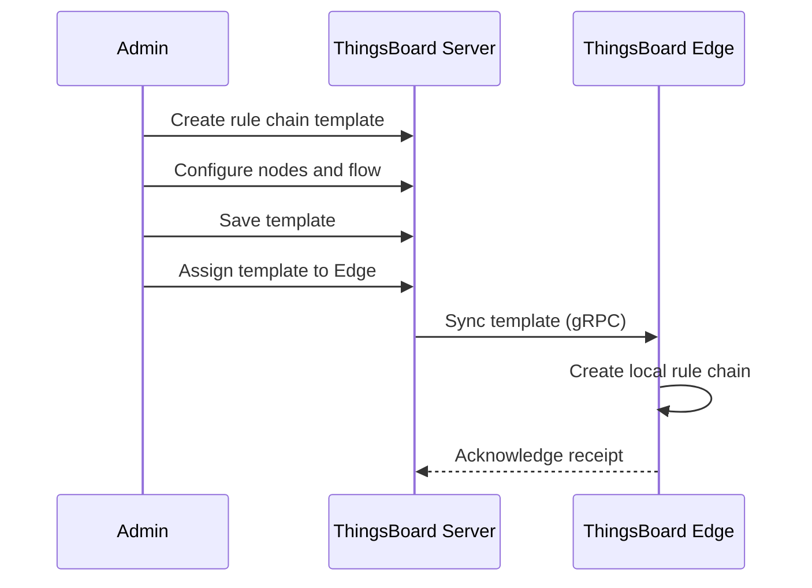

### Creating Rule Chains on Edge (v4.0+)

Edge instances can create local rule chains:

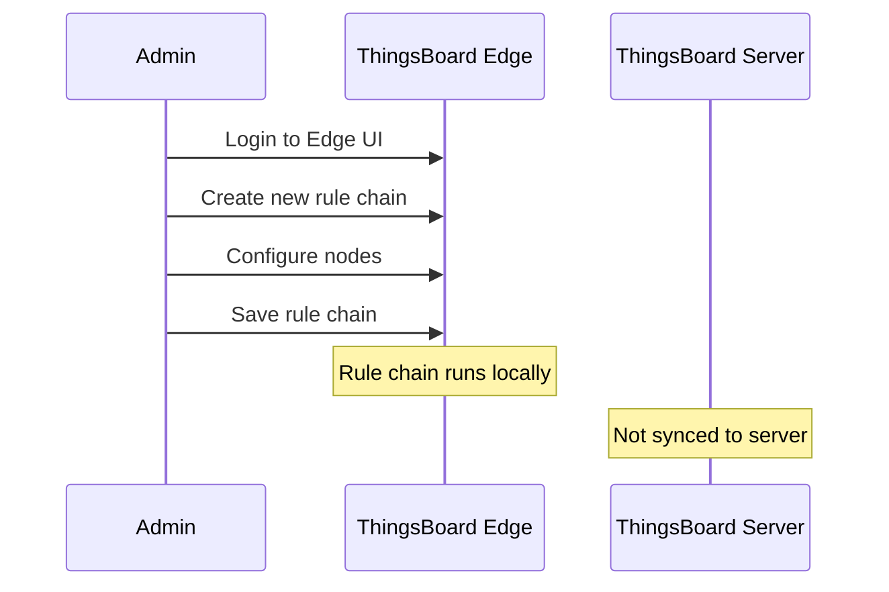

## Template Assignment

### Assigning to Edge

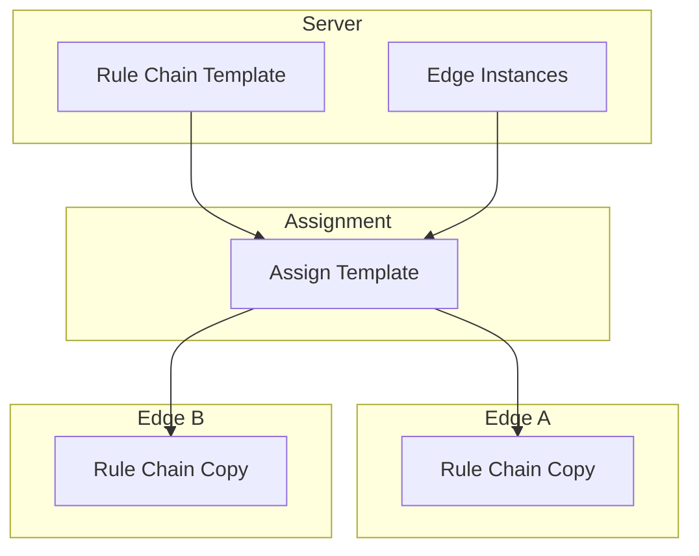

### Managing Edge Rule Chains

From the server, navigate to:
1. **Edge Management > Instances**
2. Select edge instance
3. Click **Manage Edge Rule Chains**
4. Assign or unassign templates

## Edge-Specific Rule Nodes

Templates can use edge-specific nodes for cloud communication:

### Push to Cloud Node

Forwards messages or telemetry to the cloud server:

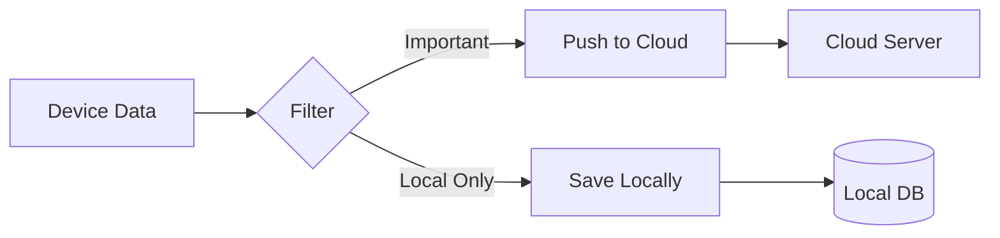

**Configuration:**

| Parameter | Description |
|-----------|-------------|
| Scope | TIMESERIES, ATTRIBUTES, or ENTITY |
| Entity types | Filter by entity type |
| Keys | Specific keys to push |

**Use Cases:**
- Forward aggregated data to cloud
- Push alarms to central monitoring
- Sync selected telemetry

### Push to Edge Node (Server-Side)

Used in server rule chains to send data to edge:

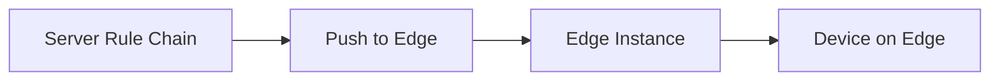

**Use Cases:**
- Send configuration updates
- Push server-side calculations to edge
- Distribute commands from cloud

## Common Template Patterns

### Local Processing with Cloud Sync

Process data locally, push summaries to cloud:

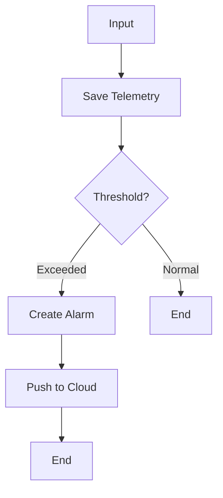

### Data Filtering and Aggregation

Reduce cloud traffic by filtering and aggregating:

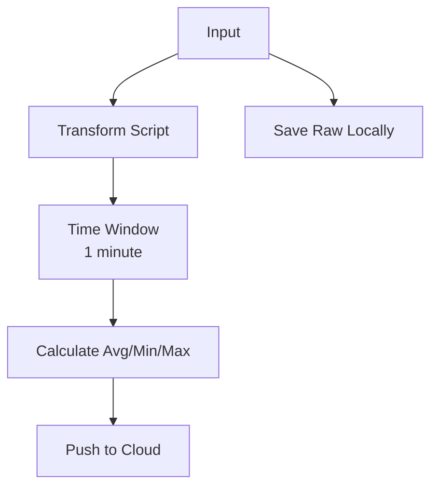

### Offline-Capable Alarming

Handle alarms locally even when cloud is unavailable:

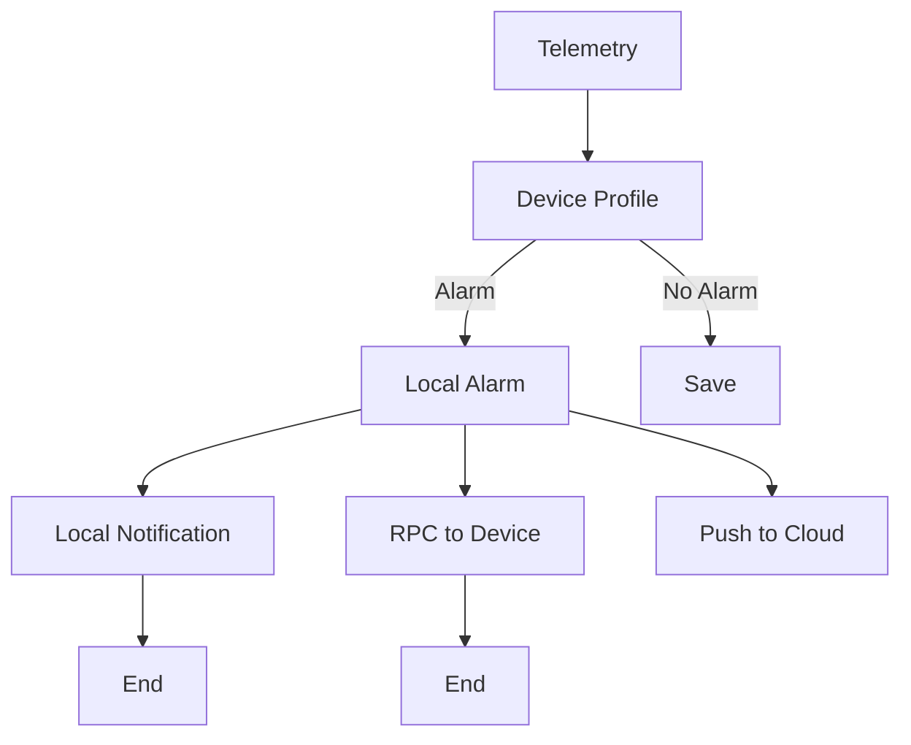

### Gateway Data Routing

Route data from gateway-connected devices:

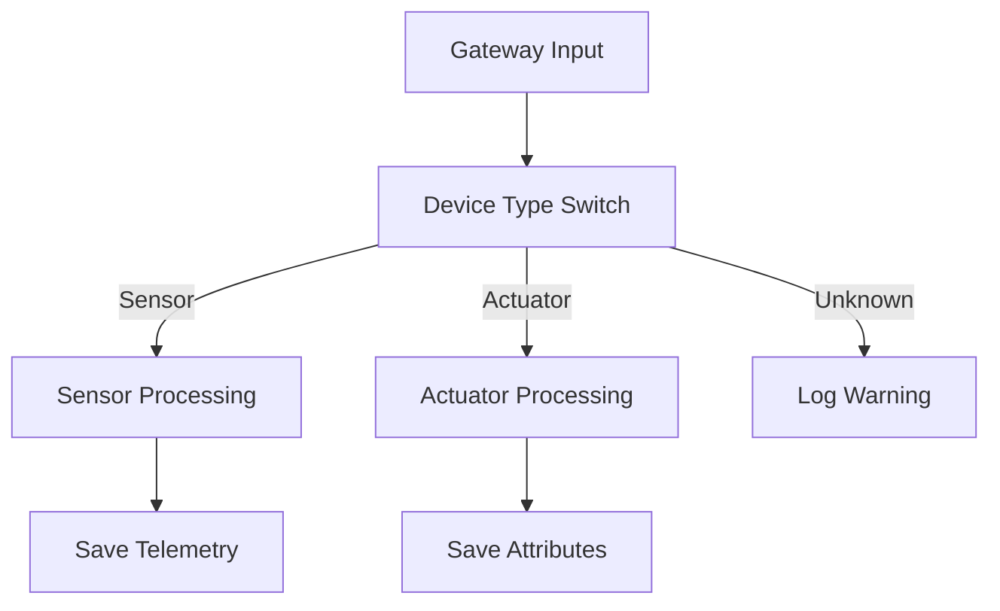

## Template Synchronization

### Initial Sync

When a template is first assigned:

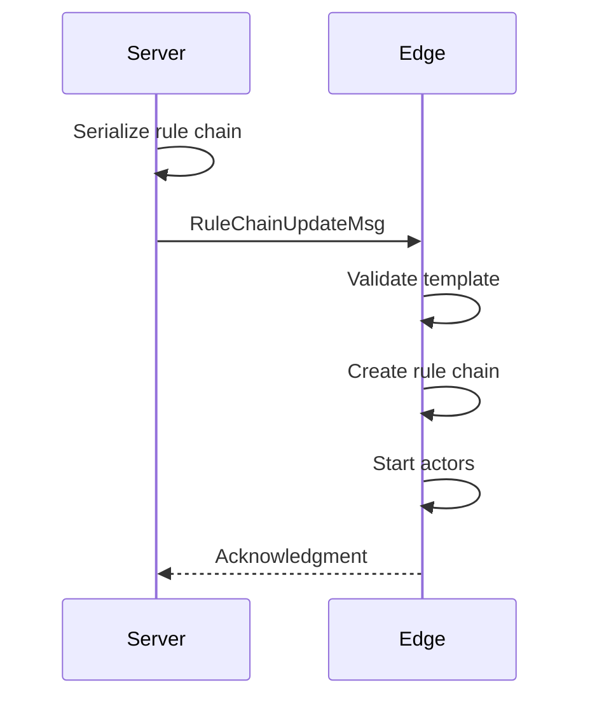

### Update Propagation

When a template is modified:

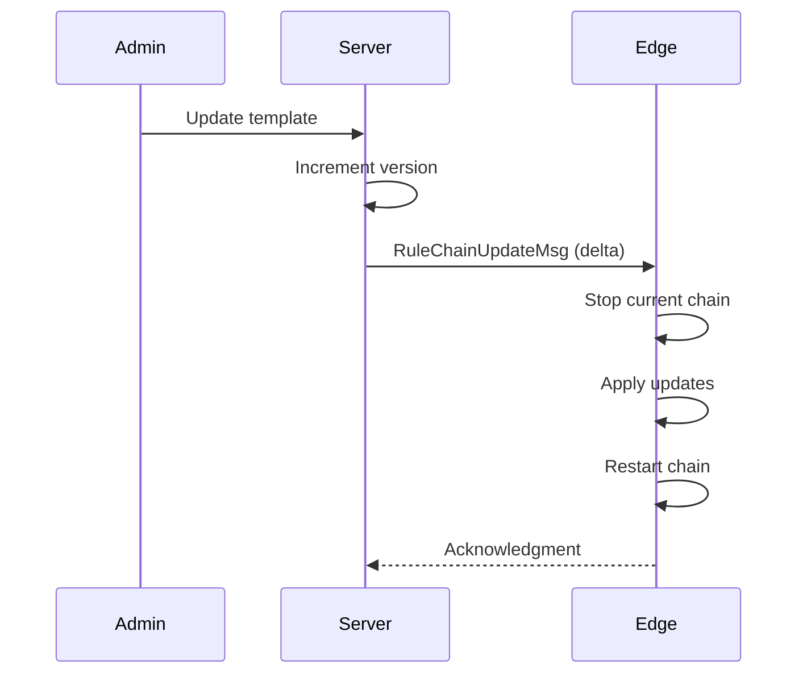

### Conflict Resolution

If edge has local modifications (v4.0+):

| Scenario | Resolution |
|----------|------------|
| Server template updated | Server version overwrites |
| Edge-local chain | Remains unchanged |
| Both modified | Server template takes precedence |

## Root Rule Chain

Each edge has a root rule chain that processes all incoming device messages:

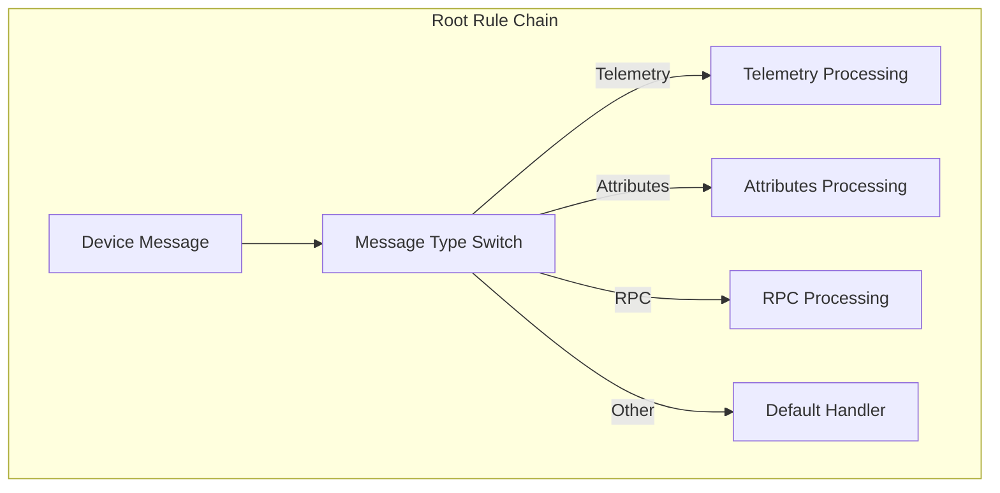

**Root Chain Behavior:**
- Automatically assigned to edge
- First chain to process all device data
- Can route to other rule chains
- Marked with "Root" flag

## Configuration Best Practices

### Design for Offline

- Avoid nodes that require cloud connectivity in critical paths
- Use "Push to Cloud" selectively, not for every message
- Implement local fallback for alarming and notifications

### Optimize for Resources

- Keep rule chains simple on resource-constrained edges
- Avoid complex JavaScript in transform nodes
- Use built-in nodes instead of scripts when possible

### Manage Template Versions

- Test templates on a single edge before broad deployment
- Use naming conventions (e.g., "v1.0 - Temperature Monitor")
- Document template purposes and configurations

## Debugging Templates

### Enable Debug Mode

Debug mode captures message flow on the edge:

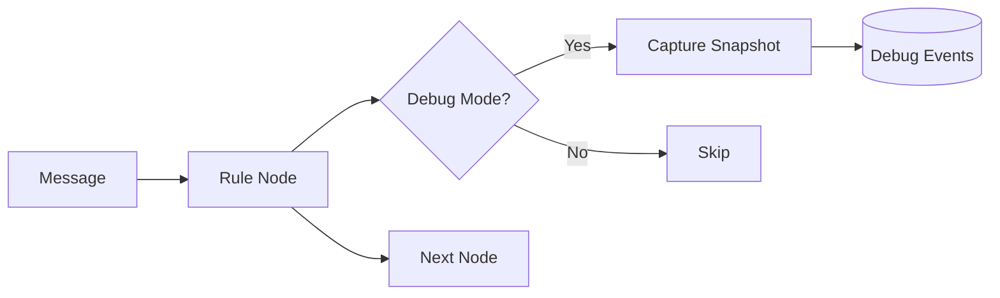

**Captured Information:**
- Input message
- Output message
- Relation type
- Processing time
- Errors

### Debug on Edge vs Cloud

| Debug Location | Visibility | Storage |
|----------------|------------|---------|
| Edge UI | Edge admin only | Local database |
| Server UI (template) | Server admin | Template definition only |

## Common Pitfalls

Rule chain templates introduce unique operational challenges around template management, edge node limitations, offline operation, and resource constraints. Teams commonly encounter issues when treating templates like standard rule chains, using unsupported nodes on edge, or underestimating the resource impact of local processing. The pitfalls below cover four critical areas where template-related issues most frequently occur.

### Template Management

| Pitfall | Impact | Detection | Solution |
|---------|--------|-----------|----------|
| Template vs standard rule chain confusion | Rules don't execute, devices unprocessed, sync failures | Created rule chain in "Rule Chains" instead of "Rule Chain Templates", edge shows no rules | Templates: Edge Management > Rule Chain Templates. Standard: Rule Chains menu. Templates sync to edges, standard runs on server only |
| Version conflicts during updates | Edge running old template version, unexpected behavior, stale logic | Dashboard shows old behavior after template update, version mismatch in logs | Wait for sync completion: check cloud_event status=DEPLOYED. Verify edge version matches server: compare metadata timestamps |
| Root rule chain requirement misunderstood | No messages processed, devices silent, telemetry not saved | All devices show "No data", edge logs "No root chain assigned" | Every edge requires exactly one root chain. Mark chain as root in template assignment. Verify: edge UI shows root chain flag |
| Template assignment propagation delays | Newly assigned template not active, old rules still executing | Template assigned but edge continues old behavior for minutes | Sync is async. Monitor cloud_event table for RULE_CHAIN type. Allow 1-5 minutes for propagation. Force sync: reconnect edge to cloud |

### Edge Node Limitations

| Pitfall | Impact | Detection | Solution |
|---------|--------|-----------|----------|
| Unsupported external nodes on edge | Rule chain fails, messages stuck, "Node not found" errors | REST API call node, Kafka node, cloud integrations fail on edge | Use only edge-compatible nodes. External APIs: verify edge has network access. Replace cloud-only nodes with edge equivalents or "Push to Cloud" + cloud processing |
| Script execution resource constraints | Script timeouts, OOM errors, slow processing, CPU spikes | JavaScript transform node takes >5s, memory grows with each execution | Optimize scripts: avoid loops, cache calculations, limit object creation. Set script timeout: `js.evaluator.timeout_ms`. Consider native nodes over scripts |
| REST API call node limitations | External APIs unreachable, timeout errors, authentication failures | HTTP External node fails with connection errors, 401/403 responses | Verify edge network access to API endpoints. Check firewall rules allow outbound HTTPS. Store API keys as edge attributes, not hardcoded. Implement retry logic in rule chain |
| Cloud service integration unavailability | Email notifications fail, SMS not sent, cloud analytics missing | Send Email node fails on edge, "Service unavailable" errors | Edge has limited integrations. For notifications: use local SMTP or "Push to Cloud" + server-side notifications. For analytics: process locally or sync to cloud |

### Offline Operation

| Pitfall | Impact | Detection | Solution |
|---------|--------|-----------|----------|
| "Push to Cloud" node queuing during offline | Messages accumulate in queue, memory pressure, eventual overflow | Queue depth grows during offline, edge memory increases | Expected behavior. Size queue appropriately: max_high_priority_queue_size. Alternative: save locally, sync selectively when reconnected |
| Local alarm state divergence from cloud | Edge and cloud show different alarm states, conflicting actions | Edge shows ACTIVE alarm, cloud shows CLEARED (or vice versa) | Alarms managed independently during offline. Reconciliation on reconnect uses last-write-wins. Design for eventual consistency, not strong consistency |
| Time-sensitive processing with stale data | Rules use outdated attributes, incorrect decisions, delayed actions | Script accesses shared attributes that are hours old, wrong thresholds applied | Cache shared attributes locally with TTL. Refresh on reconnection. Design rules to tolerate stale data. Use device attributes (client/shared) for critical values |

### Performance & Resources

| Pitfall | Impact | Detection | Solution |
|---------|--------|-----------|----------|
| Rule chain complexity exceeding edge CPU | Processing delays, queue backlog, messages timeout | Rule engine queue depth >5000, CPU >90%, message latency >10s | Profile chain complexity: count nodes × avg message rate. Simplify: remove unnecessary transforms, combine nodes. Offload heavy processing to cloud. Set actor.rule.dispatcher.pool_size based on CPU cores |
| Debug mode storage exhaustion | Disk full, edge crash, PostgreSQL out of space | Disk usage 100%, "No space left on device", debug event table huge | Debug mode stores every message. Disable after debugging: toggle debug flag. Purge old debug events: DELETE FROM debug_event WHERE created_time < now() - interval '1 day'. Set retention policy |
| Memory leaks in custom script nodes | Gradual memory growth, eventual OOM crash, edge restart loop | Heap usage grows over days, garbage collection can't reclaim, frequent restarts | Scripts retain references. Avoid: global variables, unclosed connections, event listeners. Profile heap: use JMX to identify retained objects. Restart edge periodically as mitigation |

**Detailed Example 1: Template vs Standard Rule Chain Confusion**

**Problem**: Team creates rule chain for edge devices in the standard "Rule Chains" menu. Rules appear to work in testing (on server), but when edge connects, no device data is processed. Edge dashboard shows zero telemetry. Devices appear inactive despite sending data.

**Why This Happens**: Rule Chains and Rule Chain Templates are separate systems:
- **Rule Chains**: Execute on ThingsBoard server, process cloud-connected devices
- **Rule Chain Templates**: Blueprints that sync to edges, process edge-connected devices

Creating a rule chain in the wrong location means:
- Server rule chain won't receive edge device messages (different routing)
- Edge never receives the template (no sync event created)
- Edge uses default or root chain only, which may not have expected logic

**Detection**:
- Edge UI shows only root rule chain or previously assigned templates, not the newly created chain
- Cloud "Rule Chain Templates" menu doesn't list the new chain
- Edge logs show: `Processing message with root chain only`
- Cloud logs show: `Rule chain executed on server` (wrong location)
- Query cloud database:
  ```sql
  -- Check if chain is marked as template
  SELECT name, type FROM rule_chain WHERE id = 'chain-uuid';
  -- type should be 'EDGE' for templates, 'CORE' for standard
  ```

**Solution**:
1. **Identify misplaced chain**:
   - Navigate to **Rule Chains** menu
   - Find the edge-intended chain (named "Edge Temperature Monitor" etc.)
   - Note its configuration

2. **Recreate as template**:
   - Navigate to **Edge Management > Rule Chain Templates**
   - Click "+" to create new template
   - Replicate the rule chain configuration from step 1
   - Save template

3. **Assign to edges**:
   - Select the template
   - Click "Assign to edges"
   - Choose target edge instances
   - Verify sync: **Cloud Events** page shows RULE_CHAIN event status=DEPLOYED

4. **Set as root if needed**:
   - If this should be the primary processing chain
   - Edge > Manage > Mark as Root Rule Chain
   - Verify: Edge UI shows chain with "Root" badge

5. **Delete misplaced chain** (optional):
   - Return to **Rule Chains** menu
   - Delete the server-side chain to avoid confusion
   - Confirm deletion doesn't affect edges (templates are separate)

**Prevention Checklist**:
- [ ] Training: Distinguish Rule Chains vs Rule Chain Templates in onboarding
- [ ] Naming convention: Prefix templates with "EDGE:" or "[Template]"
- [ ] Documentation: Create wiki page explaining the distinction
- [ ] Review process: Check rule chain location before deployment
- [ ] UI clarity: Request feature to show "Edge Compatible" badge in Rule Chains menu (future)

**Common Questions**:
Q: *Can I convert a Rule Chain to a Rule Chain Template?*
A: No automatic conversion. Must manually recreate in Rule Chain Templates section.

Q: *Why have two separate menus?*
A: Different execution contexts (server vs edge) require different sync, versioning, and lifecycle management.

Q: *Can a template and standard chain have the same name?*
A: Yes, they're in different namespaces. Use naming conventions to avoid confusion.

**Detailed Example 2: Debug Mode Storage Exhaustion**

**Problem**: Edge instance deployed with debug mode enabled for troubleshooting. After 2 weeks, edge becomes unresponsive. Dashboard won't load. Logs show "No space left on device". SSH access shows disk at 100%, with /var/lib/postgresql consuming 45GB on a 50GB disk.

**Why This Happens**: Debug mode captures every message processed through rule chains:
- Input message (full JSON payload)
- Output message (transformed payload)
- Relation type (Success, Failure, etc.)
- Node execution time
- Error details

For production workload:
- 1,000 devices × 10 messages/hour × 24 hours × 14 days = 3,360,000 messages
- Average debug record size: ~5KB (with JSON payloads)
- Total storage: 3,360,000 × 5KB = 16.8GB

PostgreSQL debug_event table grows unbounded, consuming all disk space. No automatic cleanup is configured.

**Detection**:
- Edge UI extremely slow or times out
- PostgreSQL errors: `ERROR: could not extend file "base/16384/12345": No space left on device`
- Disk usage:
  ```bash
  df -h /var/lib/postgresql
  # Filesystem: /dev/sda1, Size: 50G, Used: 50G, Avail: 0, Use%: 100%
  ```
- Debug event table size:
  ```sql
  SELECT pg_size_pretty(pg_total_relation_size('debug_event')) AS size;
  -- Returns: 45 GB
  ```
- Row count:
  ```sql
  SELECT COUNT(*) FROM debug_event;
  -- Returns: 9,000,000+ rows
  ```

**Solution**:
1. **Immediate recovery** - Free disk space:
   ```bash
   # Stop edge to prevent further writes
   sudo systemctl stop tb-edge

   # Connect to PostgreSQL
   sudo -u postgres psql tb_edge

   # Delete old debug events (keep last 24 hours only)
   DELETE FROM debug_event WHERE created_time < EXTRACT(EPOCH FROM (NOW() - INTERVAL '1 day')) * 1000;
   -- This may take 10-30 minutes for millions of rows

   # Alternative: Truncate entire table if debug data not needed
   TRUNCATE TABLE debug_event;
   -- Instant, but loses all debug history

   # Reclaim disk space
   VACUUM FULL debug_event;
   -- Reclaims disk space released by DELETE/TRUNCATE

   # Restart edge
   sudo systemctl start tb-edge
   ```

2. **Disable debug mode** immediately:
   - Edge UI > Rule Chains
   - For each rule chain: Edit > Uncheck "Debug mode"
   - Or programmatically:
     ```sql
     UPDATE rule_chain SET debug_mode = false WHERE debug_mode = true;
     ```

3. **Implement automated cleanup** script:
   ```bash
   # /etc/cron.daily/cleanup-debug-events
   #!/bin/bash
   # Run daily at 2 AM

   RETENTION_DAYS=7
   CUTOFF=$(date -d "$RETENTION_DAYS days ago" +%s)000  # milliseconds

   sudo -u postgres psql tb_edge <<EOF
   DELETE FROM debug_event WHERE created_time < $CUTOFF;
   VACUUM debug_event;
   EOF
   ```

   ```bash
   # Make executable
   chmod +x /etc/cron.daily/cleanup-debug-events
   ```

4. **Set up disk space monitoring**:
   ```yaml
   # Prometheus alert
   - alert: EdgeDiskSpaceHigh
     expr: (node_filesystem_size_bytes{mountpoint="/var/lib/postgresql"} - node_filesystem_free_bytes{mountpoint="/var/lib/postgresql"}) / node_filesystem_size_bytes{mountpoint="/var/lib/postgresql"} > 0.8
     for: 5m
     annotations:
       description: "Edge {{$labels.instance}} disk at {{$value | humanizePercentage}}"

   # Alert on debug_event table size
   - alert: EdgeDebugTableLarge
     expr: pg_table_size_bytes{table="debug_event"} > 5e9  # 5GB
     for: 30m
   ```

5. **Right-size disk for debug mode** if needed:
   ```
   Workload: 1000 devices × 10 msg/hour = 10,000 msg/hour
   Debug record size: 5KB average
   Daily storage: 10,000 × 24 × 5KB = 1.2GB/day
   Retention: 7 days
   Required: 1.2GB × 7 = 8.4GB for debug alone

   Provision: System (5GB) + Database (10GB) + Debug (10GB) + Buffer (25%) = 31GB minimum
   ```

**Prevention Best Practices**:
- **Use debug mode sparingly**: Enable only for specific troubleshooting, disable immediately after
- **Target debugging**: Enable debug on single rule chain, not all chains
- **Time-bound debugging**: Set calendar reminder to disable after 1-2 hours
- **Monitor disk proactively**: Alert on >80% usage before reaching critical levels
- **Automate cleanup**: Implement daily purge of debug events older than retention period
- **Document debug policy**: "Debug mode for <2 hours max, disable after session"

**Alternative Debugging Approaches** (instead of full debug mode):
- **Selective logging**: Add log nodes at critical points instead of full debug
- **Telemetry sampling**: Process 1% of messages in debug, 99% normal
- **External logging**: Forward debug data to external system (ELK, Splunk) instead of local DB
- **Temporary edge**: Replicate issue on dedicated debug edge, not production

**Detailed Example 3: REST API Call Node Limitations on Resource-Constrained Edge**

**Problem**: Rule chain template includes REST API External node to validate telemetry against vendor's cloud API (e.g., equipment manufacturer's predictive maintenance service). On server, latency is <200ms. On edge (Raspberry Pi 4, cellular connection), requests timeout after 30 seconds, causing message queue buildup and blocking other processing.

**Why This Happens**: REST API node on edge faces multiple constraints:
1. **Network**: Cellular connection has 500-2000ms latency, 2-5% packet loss, limited bandwidth
2. **Hardware**: Raspberry Pi CPU saturated handling 100 concurrent API calls
3. **API endpoint**: Vendor API optimized for server-to-server, rate limits edge connections
4. **Sync thread blocking**: Each timeout (30s) holds a rule engine thread, reducing throughput

With 1,000 devices × 1 API call/minute:
- 1,000 concurrent calls at peak
- Each call: 30s timeout × 1,000 = 30,000 thread-seconds blocked
- Rule engine thread pool (default 16 threads) exhausted within seconds
- Other messages (without API calls) blocked waiting for threads

**Detection**:
- Edge UI extremely slow, rule chain shows "Processing" for minutes
- Rule engine queue depth continuously growing: 5,000 → 10,000 → 20,000
- Logs show:
  ```
  WARN o.t.server.actors.ruleengine - Rule node timeout: REST API External node exceeded 30000ms
  ERROR o.t.server.service.http - Connect timeout to api.vendor.com:443
  ```
- CPU metrics: Raspberry Pi at 100% utilization
- Network metrics: Cellular connection 95%+ utilization, high packet retransmit rate
- Message latency dashboard: p99 > 60 seconds (normally <5s)
- Query message processing:
  ```sql
  SELECT COUNT(*), AVG(processing_time_ms)
  FROM rule_chain_execution_log
  WHERE node_type = 'REST_API_CALL' AND created_time > NOW() - INTERVAL '1 hour'
  GROUP BY status;

  -- Shows: Many TIMEOUT status, avg processing time >30,000ms
  ```

**Solution**:
1. **Immediate mitigation** - Disable API node temporarily:
   - Edit rule chain template on server
   - Replace REST API node with Log node (logs request, skips API call)
   - Or route API messages to "Push to Cloud" + server-side API processing
   - Save and wait for sync to edges

2. **Redesign for edge constraints**:
   Option A: **Move API calls to cloud**
   ```
   EDGE RULE CHAIN:
   Input → Filter (important only) → Push to Cloud → End

   CLOUD RULE CHAIN (triggered by edge data):
   Input → REST API Call → Process Response → Save to Cloud
   ```

   Option B: **Batch and throttle on edge**
   ```
   EDGE RULE CHAIN:
   Input → Aggregate (5 minute window) → REST API Call (batch endpoint) → Process → End
   ```

   Option C: **Local processing without API**
   ```
   EDGE RULE CHAIN:
   Input → Local Script (simple validation) → Alert if threshold → Push to Cloud
   ```

3. **If API required on edge**, optimize:
   ```yaml
   # Edge configuration: Increase timeouts and threads
   actors:
     rule:
       dispatcher:
         pool_size: 32  # Increase from 16 (match CPU cores × 2)

   http:
     request_timeout: 10000  # Reduce to 10s (fail faster)
     max_concurrent_requests: 50  # Limit concurrent API calls

   # In REST API node configuration:
   {
     "timeout": 5000,  # 5s timeout (not 30s)
     "retryAttempts": 0,  # No retries on edge
     "enableProxy": false
   }
   ```

4. **Implement circuit breaker** in rule chain:
   ```
   Input → Script Node (check API health) → Switch
     - API Healthy → REST API Call
     - API Degraded → Skip API, use default logic
     - API Down → Log error, Push to Cloud

   Script (pseudo-code):
   if (failures_last_5_min > 100) {
     return {msg: msg, metadata: {relation: "API_DEGRADED"}};
   }
   ```

5. **Network optimization**:
   - **DNS caching**: Cache vendor API IP to avoid DNS lookups
     ```bash
     # /etc/hosts on edge
     203.0.113.50  api.vendor.com
     ```
   - **Connection pooling**: Reuse HTTPS connections
     ```yaml
     http:
       connection_pool_max_idle: 50
       connection_pool_max_total: 100
     ```
   - **QoS**: Prioritize API traffic over telemetry upload
     ```bash
     tc filter add dev eth0 parent 1:0 prio 1 u32 match ip dport 443 flowid 1:10
     ```

**Prevention**:
- **Load test templates** on actual edge hardware before deployment
- **Profile network latency** from edge to external APIs during planning
- **Design for degraded operation**: Rule chains should function with API failures
- **Document external dependencies**: List all external APIs with SLAs
- **Monitor API health**: Track success rate, latency, error types per edge
- **Fallback strategies**: Always have plan B when API unavailable

## See Also

- [Edge Architecture](./edge-architecture.md) - Component overview
- [Cloud Synchronization](./cloud-synchronization.md) - Sync protocol
- [Rule Engine](../04-rule-engine/README.md) - Rule chain concepts
- [Node Categories](../04-rule-engine/node-categories.md) - Available nodes
